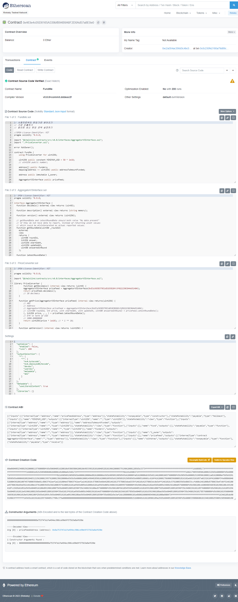

25분마다 5분 쉬기 or 2시간마다 30분 쉬기
자신에게 맞는 속도로 배우세요
몇일 몇년

협업툴을 활용하세요

# 토끼굴의 가장자리

## 블록체인

비트코인 -> bitcoin white paper -> 비트코인의 original vision

사람들이 Superior Digital Store of Value (like gold) 탁월한 자산 가치 저장소(디지털 금광마냥) 로 여겼지만
비트코인의 원래 비전은 bitcoin white paper에 나와있다.

etherium
+ Decentralized Agreements (Smart Contracts)

Nick Szabo (cryptographer)
Smart Contracts are a set of instructions exectued in a decentralized way without the need for a centralized or third party intermediary.

비트코인과 이더리움의 차이점은 smart contract
remove centralized forces and counterparty risk
비트코인도 기술적으로는 samrt contract를 가지고 있지만 "의도적으로 불완전하게" 되어있음
비트코인이 모든 기능을 가지고 있지 않음 ->
관심사 차이 
비트코인 프로토콜-> "value"를 저장하는것
이더리움 프로토콜-> "value"를 저장함과 동시에 탈중앙화를 촉진함

블록체인은 의도적으로 차단되어있음
블록체인은 사실 현실로부터 데이터를 읽거나 듣지 못한다.
The oracle problem

Blockchain Oracle:
Any device that interacts with the off-chain world to provide external data or computation to smart contracts.
체인밖의 세상에서 외부의 데이터나 스마트 컨트렉트를 계산하기 위해 상호작용되는 모든 기기들
블록체인은 하나의 데이터나 하나의 컴퓨테이션으로 작동될 수 없다.
그렇기 때문에 decentralized Oracle Network를 사용함

Hybrid Smart Contracts: On-Chain + Off-chain Agreements
여기서 가장 많이 상호작용할 프로토콜은 Hybrid Smart Contract 일 겁니다.

Chainlink
Decentralized Oracle Network
우리는 "smart contract"와 "hybrid smart contract"를 교대하며 사용할 것입니다.

비트코인 폴렛폼
아발렌체,폴리곤 , 팬텀, 하모니
대부분의 블록체인들이 이더리움 타입의 스마틐컨트렉트에서 작동가능함
따라서 여기서는 Etherium 환경에서 deploy  할 것입니다.
특정 툴이나, 체인을 익힐 걱정을 하지 않아도 됩니다. 왜냐하면 대부분 비슷하게 작동하기 때문입니다.

우리는 스마트컨트랙트 폴렛폼을 사용할때도 있고, 블록체인을 사용할때도 있을겁니다.
Dapp = Decentralized Application = Decentralized Protocol = Smart Contract

Web1: The permissionless open sourced web with static content.
Web2: The permissioned web, with dynamic content. Where companies run your agreements on their servers.
Web3: The permissionless web, with dynamic content. Where decentralized censorship resistant networks run your agreement and code. it generally is accompanied by the idea of user owend ecosystems, where the protocols you interact with you also own a portion of, instead of solely being the product.
웹3: 동적 콘텐츠가 있는 권한 없는 웹입니다. 분산된 검열 저항 네트워크가 당신의 계약과 코드를 실행한다. 일반적으로 사용자 소유 생태계에 대한 아이디어를 수반합니다. 여기서 사용자는 상호 작용하는 프로토콜도 제품이 아닌 일부만 소유합니다.

## smart contarct
### What is the value of smart contracts? 스마트 컨트렉트의 장점은 무엇일까?
이 기술은 어떤 문제점을 해결해 줄 수 있을까요?
기술은 언제나 문제점을 해결하기위해 존재합니다.
블록체인,스마트컨트렉트,암호화폐.... 이 모든것들을 합해서 말 할 수 있는 패러다임이란
이 모든걸 합쳐 스마트컨트렉트가 하는일을 쉽게 말해보자면 
->Trust Minimized Agreement
Unbreakable (Agreement) Promises 깰 수 없는 약속
속도, 효율, 투명성, 등등을 수반하지만 제일 중요한 것은

### undeniable value of smart contract
스마트 컨트렉트의 목적
re-landscape Markets and Agreements.
시장과 계약의 재조성
crypto가 아닌 다른 부분에서!

블록체인의 목적
어릴적 초등학교시절에 하던 깨지지 않는 약속 새끼손가락 걸고 하는 약속과 관계가 있습니다.

Agreements Contracts Promises
여기 당신의 인생에서 동의와 계약 그리고 약속으로 이루어진 결과물이 있습니다.

예를 들어 여기 당신의 의자는 아마존의 기술자가 가구를 만들기 위해 목재를 사기 위해 '동의'한 결과입니다.
그리고 당신은 그걸 40달러에 사는걸 '동의'했습니다.

당신의 집에 있는 전구는, 전기로 작동하고 매일 불을 켤 수 있게 전기회사에서 전기를 받고 돈을 납부하기로 '동의'한 결과입니다. 전기회사에서 생산하는 전기는 전기회사에서 터번을 돌려 전기를 생산하는 기술자과 회사가 동의한 결과입니다.

보험회사에는 당신이 매달 보험금을 내고 보험회사는 ~~아무것도안하죠~~ 당신의 의료보험금 등을 돌려줍니다.

일상생활의 대부분의 것들은 당신의 계약 동의 약속으로 이루어집니다.

Agreements / contracts = Promiese
동의와 계약을 합쳐서 쉽게 부르자면 바로 '약속'입니다.

기름을 교활할때도 과금만큼 기름을 돌려주는걸 약속합니다.
은행에 돈을 넣을때도 안전하게 돈을 보관하고 이자를 쳐서 돌려주는걸 약속합니다.
복권도 복권티켓을 사면 당신에게 당첨될 공정한 기회를 제공함을 약속합니다.

당신이 이 동의를 할때 당신은 동의대상과 이 일에 대해 속이지 않고, 공정하게 대할 것을 새끼 손가락 걸고 약속하는 겁니다. 하지만 늘 이렇진 않죠.

현실에서 이 새끼손가락 걸고 하는 약속을 어기는 경우를 생각해봅시다.

오래전 80~90 년대 맥도날드에서 모노폴리(보드게임)카드를 모으면 돈을 주는 프로모션을 진행했습니다.
쉽게 말하면 맥도날드에서 뭔가를 사면 100만 달러를 얻게 된다는 말이였습니다! 

Hey everbody, I promise if you buy our McFood we'll give you a fair chance of winning the money!

그러나 그들은 이 약속을 어겼습니다.
당첨될 공평한 기회 대신, 사실 당첨될 확률은 '0'이였습니다.
90년대 중반에 $13 ~24 백만 달러를 구입한 사람들이 아닌 회사의 부패한 내부자들이 해쳐먹었습니다.
당신이 맥도날드를 사면 100% 횡령금이 되는 것이였습니다.
이것이 맥도날드의 잘못인지 아닌지 중요하지 않습니다.
그들은 궁극적으로 지키지 못할 약속을 한 것이였습니다.

또 생각해볼 것은 24백만 달러란 돈을 우리들에게서 훔쳐간 것입니다.

하지만 이 서비스가 블록체인에서 배포되었다면 24백만 달러를 횡령하는 일은 절대 불가능했을겁니다. 바로 스마트컨트랙트의 다음과 같은 걸로 말이죠
Imuutable
Decentralized
Transparent

열살 자리 꼬마에게 돈을 맡겨달라는 부탁을 해봤다고 생각해봅시다. 아마 돈을 잃게될까봐 불안해질겁니다.

어떻게 이 사람을 믿을 수 있을까?
혹시 약속을 어기지 않을까?

언제나 이런 불안감들 때문에 숨을 못쉬겠죠

자동차 영업사원이 나에게 좋은 차를 줄지 믿을 수 있을까? 이 세탁기가 내 옷을 잘 빨아줄까 아니면 셔츠를 줄어들게 할까, 혹시 보험회사에서 내가 버스에 치였는데도 약속을 어기고 보험금을 납부하지 않을까?

계약을 하기 위해선 사람들이 옳은 일을 할꺼라고 믿어야 합니다.

작년에만 해도 로빈후드는 사용자들에게 세계금융거래와의 상호작요에 있어서 'Fair chance'를 준다고 선언했었습니다.
HAHA SIKE! 넝담~
AMC, GME, DOGE, NOK ??? (게임스탑사태때 매도버튼을 뽑아버린 걸 말하는듯)

2008년 금융위기를 기억하시나요?
비밀리에 발행된 수상한 부채들이 커다란 금융상품과 결합되어 세계경제를 무너뜨렸습니다.

짐바브웨의 하이퍼인플레이션, 브라질의 하이퍼인플레이션, 테라노스 사건

역사는 우리에게 악명높은 약속을 파기하는 것들의 실체에 대한 교훈을 주고있습니다.

우리는 마침내 이런것들을 smart contract로 고치기를 기다립니다.

이런것들로부터 우리를 지켜줄 여러 제도들이 있지만 가끔 지켜지지 않기도 합니다.
심지어 법정에 개인회생을 신청하러 가서도 3년이 걸릴 수 있고 그 사이에 돈을 구할 방법이 없을지도 모릅니다.

이런 근본적인 문제를 해결하기 위해 무엇을 해야할까요
그것이 바로 Smart Contract이며 blockchain이 만들어진 이유입니다.

스마트 컨트렉트는..
- 분산된(탈중앙화된) 블록체인에 배포된 동의,계약,지시를 말합니다.
- 바뀔(대체 될) 수 없습니다. (불변성)
- 자동으로 실행됩니다.
- 모든사람들이 계약조건을 볼 수 있습니다.

기존의 계약관계에선 중앙에서 계약조건을 마음대로 변경 할 수 있었지만 스마트 컨트렉트에선 불가능합니다.

전통적으로 복권추첨은 비공개로 진행되었습니다.
어떤 사람이 복권을 추첨하고, 코드를 가지고있고 그것을 실행할 수 있었고, 이사람이 어떤걸 조작해도 다른 사람들은 알아차리지 못했습니다.
만약 이 복권시스템이 블록체인환경으로 배포된다면 해커가 시스템을 변경할때마다 모든 사람들이 그것을 알게됩니다. 하지만 해커가 이런일을 하는 자체도 (어떤것을변경하는 일) 불가합니다.
CANNOT BER ALTERED
블록체인은 한번 배포되면 바꿀 수 없기 때문입니다.
impossible to hack
impossible to defraud (사취할 수 없는)
impossible to manipulate

decentralized exchanges
UNISWAP - ERC20 토큰으로 주식구매 가능

Decentralized Finance -> 막대한 금융 손실 감축
은행의 독단적 행동 막을 수 있음

1+1 =3 이 아닌 1+1=2 가 될 수 있도록

DEFI ->$200 Billion
defi movement

trust minimized agreement
ubreakable promises

### Ohter Blockchains benifits
Bitcoin 
이더리움 스마틐컨트렉터 decentralized trust minimized agreement
Chainlink offchain과 onchain 상호작용
스마트컨트렉트는 디지털 오일의 가치가 있다
Smart contract value = Trust Minimized Agreements

1. Decentralized
Many node operators run blockchains
2. Transparency & Flexibility
3. Speed & Efficiency (은행도 수학적으로 작동하지만 몇일걸림 마찬가지로 블록체인도 수학적으로 작동하지만 즉시처리가능함)
4. Security & immutability (데이터를 임의로 변경할 수 없다 / 데이터를 소유할 필요가 없다, 데이터가 소거되어도 모든 데이터는 분산된 노드에 저장되어있다. 수천 수만노드가 중지되어도 문제없다. 오직 하나의 블록체인이 그걸 복사했다면 문제없음, 블록체인을 해킹한다는것은 거의 불가능하다, 중앙화된 시스템을 뜷는것보다 어려움)
5. Counterparty Risk Removal (web2.0의 중개인을 제거하고, 카운터파티 게이트웨이를 제거한다.)
6. Trust minimized agreements (수학적으로 정의되는 파기할 수 없는 약속, 프로토콜의 오너가 될 수 있다.)

## What have Smart Contracts done so far?
- DeFi = Decentralized Finance
공정하고 투명한 금융거래
- DAOs = Decentralized autonomous organizations
https://ethereum.org/ko/dao/#main-content
Member-owned communities without centralized leadership.
A safe way to collaborate with internet strangers.
A safe place to commit funds to a specific cause.
- NFTs =
Non-fungible tokens (NFT)
A way to represent anything unique as an Ethereum-based asset.
NFTs are giving more power to content creators than ever before.
Powered by smart contracts on the Ethereum blockchain.

# Your First Transaction
## MetaMask
디지털 지갑


>'비밀 복구 구문'이란 무엇인가요?
복구 구문은 지갑과 자금의 '마스터 키'입니다.
비밀 복구 구문은 어떻게 저장하나요?
비밀번호 관리자에 저장
은행 금고에 보관.
대여 금고에 보관.
적어서 여러 비밀 장소에 보관하세요.
비밀 복구 구문을 공유해야 하나요?
절대로, 누구와도, 심지어 MetaMask와도 비밀 구문을 공유하면 안 됩니다!
복구 구문을 요청하는 사람은 사기를 치려는 것입니다.

https://etherscan.io/
에 만들어진 월렛주소를 복사해서 붙여넣어 봅시다.

계정생성으로 추가 계정생성하기


계정 옆에 더보기 버튼 -> 계정 상세보기 -> 계정 비밀키 내보내기 -> 트랜잭션에 필요한 private key를 얻을 수 있음


private key가 있다면 해당 계정에 접근가능하나. recovery phrase (12단어) 가 노출되는 경우 다른 계정까지도 접근가능
Public adrress는 etherscan등으로 다른사람도 조회가능 그러나 뱅킹을 하거나 할 수 없음

|Concept|Can Access|Private or Public|
|:---:|:---:|:---:|
|Mnemonic|All of your Accounts|Keep Private!|
|Private Key|1 of your account|Keep Private!|
|Public Address|Nothing|It's public|

### 네트워크 탭


Ethereum Mainnet
현실의 돈이 사용되거나 소비되어 트랜잭션되는 메인 네트워크입니다.

여기서는 TestNet을 이용해서 테스트
TestNet 엔지니어용 테스트 넷입니다.


show/hide 클릭 -> Show test networks-> ON으로

테스트넷들은 fakemoney로 트레이드 합니다.
현재는 Rinkeby가 유명하고 그다음 Kovan을 많이 사용합니다.

때에 따라 좋은 테스트네트워크가 바뀔 수 있으니 git repository를 항상 확인해보시기 바랍니다.

여기서는 Rinkeby를 자주 사용할 겁니다.

검색창에 rinkeby etherscan을 입력하거나
rinkeby.etherscan.io로 접속합니다.
etherium explorer에 private address를 입력합니다.
트랜잭션이 없으므로 빈 정보가 뜰겁니다.

### 파우셋으로 테스트넷 이더리움 보내기
테스트하기 위해 이더리움을 충전해봅시다.

사용할 파우셋
https://faucets.chain.link/

백업파우셋
https://rinkebyfaucet.com/

먼저 링크비네트웍과 지갑을 연결해야합니다.


체인링크에서 링크비네트워크에 접속이 안되니 백업파우셋으로 보내보겠습니다.


트랜잭션이 보입니다.


메타마스크 지갑에 0.1ETH가 들어왔습니다.


이더스캔에도 트랜잭션 목록이 추가되었습니다.

이 0.1ETH는 오직 Rinkeby Network에만 존재하며 
다른 테스트넷이나 이더리움 메인넷을 확인해보면 0ETH인것을 확인 할 수 있습니다.

체인링크 파우셋에서 보내기


이더스캔에서 트랜잭션 정보를 클릭해서 살펴봅시다.


Transaction Hash:
블록체인을 구분하는 값입니다.
이 트랜잭션이 0.1ETH를 이 지갑에 보냈다는 자체를 나타내는 주소입니다.

Status:
트랜잭션 성공/실패 등 상태를 나타냅니다.

Block:
이 트랜잭션이 소속되어있는 블록을 보여줍니다.

TimeStamp:
트랜잭션이 일어난 시간을 나타냅니다.

From:
트랜잭션을 보낸 계정을 나타냅니다.
링크를 누르면 해당 계정을 확인 할 수 있습니다.


To:
트랜잭션을 받은 계정을 나타냅니다.
즉, 여기선 내 계정을 나타냅니다.

Value:
트랜잭션에 보내진 eth 값을 나타냅니다.

Transaction Fee:

트랜잭션 이용비용입니다.
즉, Gas를 나타냅니다.

### Gas 1: Gas 소개


### Transaction fee


블록체인은 모두 다른 각각의 노드에서 작동하고 있습니다.
이 각각의 노드에서 블록체인을 작동하기 위해 언제나 요금을 내고 있습니다.
트랜잭션이 발생할 경우 "miner" 나 "validators"가 소정의 수수료를 받습니다.
이 수수료가 사람들이 노드를 계속 구동할 수 있도록 해줍니다.

가스는 계산 측정 단위입니다.
복잡한 트랜잭션일수록 소비하는 가스도 많아집니다.


60의 가스 제한 중에 21의 가스를 사용했다는 의미입니다.
ETH 보내기와 같은 단순한 작업은 가격이 저렴하지만,
NFT를 발행하고, 몇몇의 나눠진 컨트렉트에 입금하는것과 같이 복잡한 작업에는 계산비용이 비싸고 비싼 값을 지불해야합니다.

GasPrice * Gas Usage by Txn = Transaction Fee
0.000000002500000009 * 21000 = 0.000052500000189

또한 블록체인마다 들어가는 계산하는 가스비용이 다릅니다.

모든 블록체인상의 트랜잭션에는 가스를 지불해야합니다.

### 내 지갑안에서 계정간 트랜잭션하기
Account1 에서 계정1로 0.05ETH를 보낼경우
Account1 에는 얼마가 남을까요

가스시세:
같은 시간에 트랜잭션을 보내는 사람이 많을수록 가스요금이 비싸집니다. 

내계정-> 활동 으로 확인해보면 트랜잭션이 pending상태로 되어있습니니다. 클릭하여 이더스캔으로 넘어가면 indexing이라고 나올텐데 그것은 이더스캔이 내 트랜잭션을 받고 정리하고 있는 중이라는 뜻입니다.
만약 트랜잭션이 제대로 이루어지지 않을 경우 다른 테스트넷을 사용하면 됩니다.


트랜잭션이 success 되었다면 계정에 남은 ETH를 확인해봅시다.


ETH를 받은 계정은 정확히 0.05ETH를 가지고 있고, 보낸계정은 0.2ETH - (0.05 + Gas fee)의 ETH를 가지고있습니다. 

지금까지 테스트 해본방법이 어플리케이션을 이용해서 블록체인 프로토콜과 상호작용하는 방법입니다.

## How do Blockchains works?
Hashing, blocks, signers, etc...

https://andersbrownworth.com/blockchain/

### 해시

Hash:
데이터를 식별하기 위해, 고정된 길이의 고유한 값을 가지는 문자열입니다. 이러한 값은 해시함수에 의해 배치되고 생성됩니다.

Keccak256: 실제 이더리움이 사용하는 알고리즘

SHA 256: Keccak256 내에 포함된 크립토 알고리즘

https://andersbrownworth.com/blockchain/hash

### 블록

https://andersbrownworth.com/blockchain/block

블록은 블록넘버와 넌스 자료(데이터)를 모아 해시값을 생성하여 만들어집니다.


아무값이나 입력하고 채굴(mine)을 눌러봅시다.


배경색이 초록색이 되었고(서명되었고) 넌스(nonce)값이 달라졌습니다. (72608 -> 60075)

해시값 또한 달라졌습니다. (0000으로 시작)

마이너(채굴가)들이 하는일이 바로 이 nonce값을 찾아내는 일입니다.
해당블록넘버 (#1)에서 nonce값이 0000으로 시작하는 해시값에 해당할때까지 bruteforce(일일히 대입)하여 Nonce 1~ 60075 까지 대입하여 알아내는 것입니다.
이렇게 하여 알아낸 0000으로 시작하는 해시값을 가진 블록을 서명된 블록이라고 합니다.

nonce 60075는 0000으로 시작하는 해시가 허용된 넌스입니다.

값을 입력한 뒤 붉은색으로 되는 블록은 해시값이 0000으로 시작하지 않고 서명되지 않은 블록입니다.
여기서 넌스값을 변경하여 0000로 시작하는 해시(즉, 서명된 블록)를 찾는겁니다. 이 과정은 brute force로 이루어집니다.

이것이 블록체인을 채굴혹은 채굴가들이 하는일입니다.

### 블록체인

https://andersbrownworth.com/blockchain/blockchain

위의 블록에 이전해시(prev)변수가 추가됩니다.

블록의 원조가 되는 해시값이 000000~ *64 인 블록은 
Genesis block이라 부르고 이것이 블록체인의 첫번째 블록입니다.

#### 불변성


블록체인 중 하나의 값을 바꾸게 되면 해시값이 달라지면서(0000으로 시작하지 않는 다른 값이 되기때문에, 해당 블록은 물론이고 다음 블록의 이전해시값도 유효하지 않게 됨) 다른 나머지 블록체인 또한 망가지게 됩니다.(다시 연겱하려면 모든 블록을 다시 채굴해야하기 때문에 시간과 비용이 많이 들어감)
이것이 불변성을 보장하는 방법입니다.


#### 분산 블록체인(Distribute Blockchain)

https://andersbrownworth.com/blockchain/distributed

마지막 해시는 모든 블록들과 연결되어있기때문에 블록들에게 영향을 끼칠 수 있습니다.

블록의 값이 바뀐다면 블록체인네트워크 안에 있는 참여자들(peer)이 모두 알아차릴 수 있으며 해당 사용자(peer)는 블록체인 네트워크에서 제외됩니다.(채굴로 서명을 받은 블록이라도 다른 peer의 블록 hash값과 일치하지 않기 때문에)

#### 토큰(Tokens)

https://andersbrownworth.com/blockchain/tokens


tx(트랜잭션)이 추가되었습니다.
매 트랜잭션마다 분산 네트워크를 가지고 있으며
트랜잭션 값을 바꾸면 마찬가지로 원래 참여하고 있던 블록체인 네트워크에서 제외됩니다.

Darcy 가 Bingley에게 돈을 보냈다는걸 어떻게 알 수 있을까요? 이 점은 private key와 public key를 통해 설명 할 수 있습니다.

### 정리

해시: 데이터를 식별하는 고유한 고정 길이 문자열입니다.

해시 알고리즘: 데이터를 고유한 해시로 계산하는 함수입니다.

마이닝(mining): 블록체인 "문제"에 대한 "해결책"을 찾는 과정입니다. 이 예에서 "문제"는 4개의 0으로 시작하는 해시를 찾는 것이었습니다. 노드는 마이닝 블록에 대한 비용을 받습니다.

블록: 함께 마이닝 된 트랜잭션 목록입니다.
(블록, 넌스, 트랜잭션, 이전해시, 해시)

분산화(Decentralized): 권한을 가지고 있는 단독지점이 없습니다.
(서로의 해시를 비교해서 트랜잭션이 정상적인지, 멜리셔스한지 판단) 

넌스(Nonce): 블록체인 문제에 대한 "해결책"을 찾기 위한 "한번 사용된 숫자(Number used once)"입니다.
또한 계정/주소의 트랜잭션 번호(Number)를 정의하기 위해 사용됩니다.

### Signing Transactions 트랜잭션 서명

>Darcy 가 Bingley에게 돈을 보냈다는걸 어떻게 알 수 있을까요? 이 점은 private key와 public key를 통해 설명 할 수 있습니다.

에서 이어지는 글입니다.

#### keys

https://andersbrownworth.com/blockchain/public-private-keys//keys


개인 키: 키 홀더에게만 알려져 있으며, 트랜잭션 "서명"에 사용됩니다.

private key를 입력하면 ECDSA(Elliptic Curve Digital Signature Algorithm) 에 의해 public key를 발급합니다.

#### Signatures


메시지에 값을 입력해봅시다.


여기에서도 ECDSA로 Private key를 바탕으로 Message Signautre가 발급됩니다.

Verify 탭으로 넘어가봅시다.


Verify 버튼을 누르면 valid(배경초록색)이 되었습니다.

Signature에는 아까 전에 만든 Message Signature 값이 들어가 있습니다.

이 verify는 public key와 비교해서 verify 여부를 결정하고 아무나 verify 할 수 있습니다. 따라서 누구나 signature를 가지고 이 트랜잭션이 진짜인지 확인 할 수 있습니다.

#### Transaction 


20달러를 보내봅시다.


마찬가지로 Private key 를 가지고 생성된 message signature를 가지고 signature 값과 비교해서 확인 할 수 있습니다.

이것이 private key를 숨겨야 하는 이유입니다.

Metamask의 setting > Security & Privacy 탭을 확인해봅시다.

reveal seed phrase 를 누르면 비밀번호 확인을 거쳐서 인증 12단어를 볼 수 있습니다.


비공개 키 내보내기


이런식으로 비공개 키를 내보낼 수 있습니다.

위에서 만든 Public Key는 Account1의 public key와 역할이 동일합니다.

### 정리

Public Key: Is derived from your private key. Anyone can "see" it, and use it to verify that a transaction came from you.

Public Key 공개키:
개인 키에서 파생되었습니다. 누구나 "확인"할 수 있으며, 사용자로부터 트랜잭션이 전송되었는지 확인하는 데 사용할 수 있습니다.

Signing a transaction: A "one way" process. Someone with a private key signs a transaction by their private key being hashed with their transaction data.
Anyone can then verify this new transaction hash with your public key.

트랜잭션 서명: "단방향" 프로세스입니다. 개인 키를 가진 사용자는 자신의 개인 키를 자신의 트랜잭션 데이터로 해시하여 트랜잭션에 서명합니다.
그러면 누구나 사용자의 공개 키로 이 새 트랜잭션 해시를 확인할 수 있습니다.

Private Key ||| barrier ||| > Public key > Address

## Gas 2: Block Rewards & EIP 1559

It's not important to understand everything in this section.

The main takeaway should be:
"The more people use a chain, the more expensive it is to send transactions"

21,000 | 21,000

트랜잭션에서 사용하고 싶은 가스량을 제한 할 수 있습니다.


Base Fee: The minimum *gas price* to send your transaction

기본요금: 트랜잭션을 보낼 수 있는 최소 가스가격
Gwei가 뭘까요?

https://eth-converter.com

Wei Gwei Ether 가 있네요


1 Ether = 10,0000,0000 Gwei = 100,0000,0000,0000,0000 Wei

Max Fee: 사용할 수 있는 최대 가스량

Max Priority: 최대로 지불할 가스값 + 마이너에 줄 의향이 있는 최대 값
>https://www.blocknative.com/blog/eip-1559-fees
>
>우선 요금 설정
>
>최대 우선 순위 수수료(Max Priority Fee)는 종종 마이너 팁이라고도 하며, 당신의 거래를 블록에 포함시키기 위해 마이너에게 인센티브를 주기 위해 마이너에게 직접 지불되는 '선택적' 추가 수수료입니다. Max Priority Fee는 기술적으로 선택 사항이지만, 현재 대부분의 네트워크 참여자들은 포함 후보가 되기 위해 일반적으로 최소 2.0 GWE 팁이 필요하다고 추정한다. 이와 같이 특정 채굴 풀은 포함을 위한 대체 최소값을 설정할 수 있다.
>
>혼잡하지 않은 정상적인 네트워크 조건에서 제출되는 '일반적인' 트랜잭션의 경우, 최대 우선 수수료는 2.0 GWEI에 가까워야 합니다. 그러나 다음 블록에 순서나 포함이 중요한 트랜잭션이나 네트워크가 매우 혼잡할 경우 트랜잭션의 우선 순위를 정하기 위해 더 높은 최대 우선 수수료가 필요할 수 있습니다.
>
>Max Priority Fee에 대한 다소 미묘한 뉘앙스는 당신이 광부에게 기꺼이 지불할 수 있는 최대 팁을 나타낸다는 것이다. 단, 기본료+최대우선수수료가 최대수수료를 초과할 경우(아래 참조), 최대우선수수료의 상한을 유지하기 위해 최대우선수수료가 감소한다. 즉, 실제 팁은 최대 우선 수수료보다 작아야 할 수 있으며, 이러한 상황에서는 거래가 채굴자에게 덜 매력적일 수 있습니다.

Burnt = Base Fee * Gas Use

마이너에게 돌아가는 수익 = Transaction Fee - Burnt

Others:

Txn Type:2 (EIP-1559):
이 트랜잭션이 EIP-1559 타입의 트랜잭션이라는 뜻

많은 사람들이 트랜잭션을 이용할 수록
Burnt양이 늘어남

## EIP-1559
https://www.youtube.com/watch?v=MGemhK9t44Q

EIP(ETHEREUM IMPROVEMENT PROPOSAL)
트랜잭션의 변경된 기술사양을 다루는 문서입니다.
보통 기술사양 문서들은 기술적 세부사항을 개선하는데 중점을 둡니다.
그래서 개발자 커뮤니티에선 별로 다뤄지지 않습니다.

하지만 예외가 있는데 이것이 바로 EIP-1559입니다.
왜냐하면 지갑과 같은 사용자 어플리케이션에 관해서 큰 의미를 갖기 때문입니다.

eip1559는 이더리움 요금(fee)모델의의 변화를 설명하고 있으며 2019년에 비탈릭부테린(vitalik buterin)에 의해 제안되었습니다.

이더리움 요금 모델
First-price auction 첫 번째 가격 경매 라는 매커니즘을 기반으로 합니다.

the users who want to have their transaction picked up by a miner have to essentially bid for their space in a block
트랜잭션이 마이너에게 선택 받기를 원하는 사용자들은 기본적으로 그들의 블록 공간을 위해 입찰을 진행해야 합니다. 이는 사용자들이 특정 트랜잭션에 대해 기꺼이 지불할 의향이 있는 가스요금(gas price)을 제출해서 이루어집니다. 
마이너들은 이것을 가격이 높은 순으로 정렬해서 가장 수익성 있는 트랜잭션을 먼저 포함하여 거래를 선택합니다. 이는 매우 비효율적일 수 있고, 일반적으로 사용자가 거래에 대해 초과 지불하게 되는 결과를 초래하게됩니다.

이 모델또한 문제점이 있습니다.
metamask를 예로 들어보면 slow averge fast 중에 속도를 선택하여 또는 수동으로 가스가격을 조절할 수 있습니다.
일반적인 사용자들은 기본요금으로 트랜잭션이 confirm되기를 기다리는 상태가 되기도 전에 가스요금이 갑자기 급등해서 다시 요금 확인을 위해 기다리는 경험을 할 만큼 운이 좋지 않습니다. 이것은 물론 사용자 경험 관점에서도 좋지 않습니다. 

이것은 EIP-1559의 존재 이유기도 합니다.
제안서는 이 문제를 해결하기 위해 작성되었고 다음과 같은 목적을 가지고 있습니다.
- 트랜잭션 요금을 더 예측가능하게
- 트랜잭션 확인 딜레이를 줄이기
- 요금 입찰방식을 자동으로 하여 사용자 경험 향상
- 네트워크 활동과 ETH공급 사이에 긍정적인 피드백 루프 생성

### EIP-1559 FEE MODEL

- Base fee의 새 개념 : 
Basefee는 트랜잭션이 블록에 포함되기 위한 최소요금입니다.
- Base fee는 블록당 책정되며 이더리움 네트워크가 얼마나 혼잡한지에 따라 위아래로 조정이 가능합니다.

- Network Capacity 네트워크 용량 증설
가스 최대량을 12.5M에서 25M으로 늘림으로써, 네트워크 용량을 늘렸습니다.
기본적으로 블록사이즈가 두배로 늘었습니다.

- Base fee 와 네트워크 용량 증가로 EIP 1559 는  다음과 같은 로직으로 설계 될 수 있습니다.
  - 네트워크 사용량이 50% 이상일때 Base fee는 증가합니다.
  - 네트워크 사용량이 50% 이하일때 Base fee는 감소합니다.

이 말은 기본적으로 네트워크가 네트워크 사용량에 따라 수수료를 조정하여 50%의 용량에 평형을 맞추는 것을 목표로 한다는 것을 의미합니다.

### MINER TIP


 eip 1559 also introduces a minor tip a separate fee that can be paid directly to the miner to incentivize them to prioritize a transaction

 eip 1559는 또한 마이너팁을 도입하여 광부에게 직접 지불하여 거래의 우선순위를 부여하도록 장려할 수 있습니다.

 이것은 마이너들이 높은 가스금액에서 인센티브를 받을 수 있는 현재 매커니즘과 비슷합니다. 

이는 (arbitrage transactions)차익거래 같은 트랜잭션과 같은 빠른 트랜잭션 confirm으로 이익을 얻을 수 있을때 있어서 매우 중요한 기능입니다. 

### EIP 1559 와 기존 모델 비교
#### 기존 네트워크 모델
imagine the minimum gas fee to be included in the previous block was 50 gray the network activity seems to remain the same. so users start submitting their transactions with 50 gray trying to be included in the next block

블록에 포함되기 위한 최소가스 수수료가 50Gwei라고 가정해봅시다. 네트워크 활동은 동일하게 유지되므로 사용자는 다음 블록에 포함하려고 하는 50Gwei로 트랜잭션을 제출하기 시작합니다. 동시에 매우 기대되는 토큰이 출시되어 이를 사고싶어 하는 사용자들이 현재 입찰가를 크게 높였습니다. 이제 다음 블록에 포함될 수 있는 최소금액은 100Gwei 입니다.
만약 네트워크 활동이 여러 후속 블록에서도 여전히 혼잡하다면 이미 트랜잭션 요금으로 50Gwei를 낸 사용자는 매우 긴 시간동안 트랜잭션 확인을 기다려야 합니다.
이 경우 블록 사이즈는 12.5백만 가스로 제한되며 블록에 들어갈 수 있는 유일한 방법은 다른 사용자보다 더 높게 입찰하는 것입니다.

#### EIP 1559 의 경우
같은 상황에서 EIP 1559는 이렇게 작동합니다.
이전 블록에서 다음블록으로 옮기는데 50Gwei 가 최소요금으로 설정된 블록에 네트워크 사용률은 50%였으며 대부분의 블록은 최대 가스 제한의 절반인 1250만 가스를 사용했습니다.
새 토큰 출시로 인한 요금 급등은 사용자들이 더 높은 마이너 팁으로 거래를 하게 만듭니다.
블록 공간에 대한 높은 수요와 높은 마이너 팁을 가진 많은 트랜잭션을 볼때 마이너가 2500만 가스의 최대 상한선인 블록을 생성합니다. 더 많은 트랜잭션이 블록에 포함 될 수 있지만, 또한 후속 블록의 base fee 가격이 증가하게 됩니다.

현재 블록이 100% 꽉 찼고, 여전히 네트워크 활동량이 높고, 블록공간에 대한 수요가 높게 유지된다면, 마이너들은 각각의 후속 블록에 기본료를 증가시키면서 꽉 찬 블록을 계속 생산할 것입니다.

어느 시점에서는 요금이 일부 사용자들을 쫓아낼 만큼 충분히 높아져서, 네트워크가 다시 50% 이하의 네트워크 이용률로 돌아오기 시작하고 후속 블록에서 요금을 낮추기 시작할 것입니다. 기본요금은 블록당 최대 12.5퍼센트까지 오르내릴 수 있기 때문에 기름값은 5분 정도 20블럭에서 10배, 40블럭에서 100배까지 소요된다.

...계속

### 정리

Txn Savings : Max값과 실제 지불한 값의 차이

## High-Level Blockchain Fundamentals
블록체인 Peer마다 가지고 있는 Node에서 작동합니다.
네트워크는 참여자가 모여서 이루어집니다.

Node: A single instance in a decentralized network
노드 : 분산 네트워크의 단일 인스턴스

모든 사람이 네트워크에 참가할 수 있습니다.

Blockchains are resilient

블록체인은 복원력이 뛰어납니다. (다른 노드가 다운되더라도 작동할 수 있습니다)
또한 다른 노드가 멜리셔스하다면 그 노드를 제외합니다.

Blockchain nodes keep lists of the transactions that occur.
블록체인 노드는 발생하는 트랜잭션 목록을 보관합니다.
이것이 블록체인에 불변성을 더해줍니다. 아무것도 부패하지 않고, 변하지 않습니다.

### Consensus 컨센서스
#### proof of work
우리가 전에 살펴본 마이닝 기능을 proof of work 이라고 합니다.

proof of work(작업증명)과 proof of stake(이해관계증명)는 컨센셔스의 아래에 놓여있습니다.

컨센서스(합의)는 블록체인의 상태나 하나의 값에 동의하는데 사용되는 메커니즘입니다. 

컨센서스 프로토콜을 크게 나눠보자면 두개로 나눌 수 있습니다.
1. Chain Selection algorithm
2. Sybil Resistance mechanism -> 마이닝 사용(proof of work) 이더리움, 비트코인

http://wiki.hash.kr/index.php/%EC%8B%9C%EB%B9%8C%EA%B3%B5%EA%B2%A9#:~:text=%EC%8B%9C%EB%B9%8C%EA%B3%B5%EA%B2%A9(sybil%20attack)%EC%9D%B4%EB%9E%80,%EC%9D%84%20%EB%AF%B8%EC%B9%98%EB%8A%94%20%EA%B3%B5%EA%B2%A9%EC%9D%84%20%EB%A7%90%ED%95%9C%EB%8B%A4.

시빌 저항이란 시빌공격(공격자가 실제로는 한명이면서 마치 여러 명인 것처럼 속이는 방식으로 네트워크 상 여러 노드를 제어함으로서 의사결정에 좋지 않은 영향을 미치는 공격)으로부터 방어하는 블록체인의 능력을 뜻합니다.

시빌 저항에는 PoW 와 PoS 두가지 매커니즘이 있습니다.

PoW 작업증명:
블록체인 문제를 해결하여 증명 (앞서 실습해본 0000으로 시작하는 nonce를 찾기 같은)

no matter how many sudo anonymous account to make, each one still has undergo to very computationally expensive activity finding the answer to the proof of work problem.

얼마나 많은 sudo 익명 계정을 만들든지 간에, 각각의 계정들은 여전히 작업 증명 문제에 대한 답을 찾는 계산적으로 매우 비싼 활동을 겪습니다.

어떤 블록체인들은 알고리즘을 어렵게 만들거나 쉽게 만드는데 이는 블록타임을 조절하기 위함입니다.

블록타임 - 블록이 발행되는데 걸리는 시간, 알고리즘이 얼마나 어려운지에 비례합니다.

#### chain selection rule
이제 컨센서스를 생성하기 위해선 
시빌 저항을 chain selection rule과 합성해야 합니다.

우리가 어떻게 어떤 블록체인이 진짜 블록체인인지 알 수 있을까요? 

#### 나카모토 컨센서스
나카모토 컨센서스는 pow 와 가장 긴chain rule을 결합한 컨센서스입니다.


#### Block Confirmations
트랜잭션이 끝난 후 남은 블록들

This has recently changed as of EIP 1559
최근에 나카모토 컨센서스는 EIP 1559로 바뀌었습니다.

Pow(작업증명) -> 채굴자Miner
Proof of Stake -> Validater 검증인

작업증명에서는 모든 노드가 블록체인 문제를 해결하기 위해 경쟁합니다. 모든 노드가 이 "퍼즐"을 제일 "먼저" 해결하기 위해 노력합니다. 왜냐하면 첫번째로 문제를 푼 노드가 트랜잭션 fee를 얻을 수 있기 때문입니다.

노드는 두가지 방식으로 보상을 받을 수 있습니다.
하나는 트랜잭션 요금이고
다른 하나는 block award 입니다.
블록어워드는 블록 체인 자체에서 프로토콜로부터 이 노드에 주어집니다.

- 비트코인의 블록 반감기 (block halving)
블록이 대략 50%로 줄어드는것
https://academy.binance.com/ko/halving

블록어워드를 더이상 못얻게 하는 블록체인도 있습니다.

- sybil 공격
- 51% 공격 이더리움 클래식에서 일언난 공격


Longest chain rule:
블록체인의 규모가 클수록 안전하다

Proof of Stake
pos에서는 miner대신 validater 검증인 이라고 합니다.
pow는 너무 많은 에너지가 들어갑니다. 환경문제

ETH 2.0 으로 업그레이드 하면서 POS로 변화했습니다.

Proof of stake nodes put up collateral as a sybil resistance mechanism
Pos 노드는 담보물이 sybil 저항 매커니즘으로 설정되어있습니다.
이 담보물이 stake입니다.

ETH2.0을 예로들면 노드는 ETH를 stake로 삼아 정직하게 활동하도록 합니다. 만약 노드가 악의적 행동을 한다면 그들은 stake를 줄이거나 제거할 것입니다.

이는 효과적인 시빌 저항 매커니즘입니다.
만약 익명의 여러 계정을 만든다면 각각의 노드마다 stake를 가져야 할것입니다. 이 상태에서 잘못된 행동을 한다면 여러 계정을 만드는데 담보로 잡힌 stake(ETH)들을 모두 잃게 될 겁니다.

이 시스템 상에서 채굴자(miner)들은 검증인(validator)이라 불립니다.

- Randomness

Proof of stake uses much less energy
하나의 노드만 문제를 풀고 나머지는 검증만 하면 되기 때문

- Scalability
많은 사람들이 블록체인을 원할때 가스값이 올라갈것이다
이것은 스케일러블에 나쁨
- Sharding : scalability 문제를 해결하기 위한 솔루션
블록체인안의 블록체인

- Layer1: Base layer blockchain implementation

- Layer2: Any appplication built on top of layer2
layer1 위에 구현되어있는 모든 어플리케이션들

아베트롬 옵티미즘 -> Rollups
샤드 체인지 해주는것
싸이체인과 다름 싸인은 자신의 프로토콜로 보안
Rollups -> 베이스레이어로 보안

## Recap
ETH and BTC are Proof of Wrok (at the time of recording)

- ETH 2.0 will be Proof of Stake
- Pow & Pos are sybil resistance mechanisms
- The bigger the blockchain, the more secure
- Sharding and rollups are scalability solutions
- Only so many transactions can fit into a block
- Gas prices are how much it costs to perform executions on-chain

# Welcome to Remix!

## 리믹스 시작하기
https://remix.ethereum.org/


Solidity 선택


처음부터 시작해보기

contracts폴더만 남겨놓고 안의 내용과 나머지들을 다 지워봅시다.


contracts 폴더에 SimpleStorage.sol 파일을 만듭니다.


.sol 파일은 컴파일러가 solidity 파일로 인식하며 solidity는 스마트 계약 부분에서 가장 점유율 높은 언어입니다.

### 솔리디티 컴파일러 탭


첫번째로 해야할 일은 어떤 버전의 솔리디티를 사용할 것인지 정하는 것입니다.

이 부분은 항상 솔리디티 코드의 제일 위쪽 줄에 위치해야 합니다.

솔리디티는 지속적으로 업데이트 되는 언어입니다.
따라서 업데이트 되는 최신 버전의 솔리디티를 쓰고 싶다면
이렇게 입력하면 됩니다.

```solidty
pragma solidity
```

특정 버전을 사용하고 싶다면 뒷부분에 버전을 입력하면 됩니다.
```
pragma solidity 0.8.7; // 0.8.12
```
주석은 // 로 처리합니다.

현재 최신버전은 0.8.12 (2022-06-01기준)입니다.
스테이블 버전은 0.8.7 이기때문에 0.8.7 버전을 사용할 겁니다.

코드를 배울때 항상 주석으로 노트합시다. 복습에 도움이 됩니다.

만약 표기버전보다 더 높은 버전을 사용해도 괜찮다는 표시를 하고 싶을땐 `^`를 붙여서 입력하면 됩니다.
```
pragma solidity ^0.8.7;
```
아니면 특정 버전 범위를 정해서 해당 버전의 컴파일러만 작동하도록 만들 수도 있습니다.
```solidity
pragma solidity >=0.8.7 <0.9.0; //0.8.7이상 0.9.0 미만의 컴파일러만 작동
```

또한 모든 솔리디티 코드는 `;`로 끝나야합니다.

### SPDX License Identifier
  - 라이센스 관리와 코드 공유에 도움이 됩니다.
  - 이는 옵션 선택이지만 가끔 이를 요구하는 컴파일러가 있습니다.
  - 이 설정은 컴파일러 설정보다 먼저(코드 위쪽에) 위치해야합니다.

```solidity
// SPDX-License-Identifier: MIT
pragma solidity 0.8.8;
```


이제 왼쪽 탭에 있는 Complie SimpleSotrage.sol 버튼을 눌러봅시다.


컴파일러가 0.8.8 로 자동으로 바뀌었습니다.

`ctrl + s` 를 눌러 `저장 후 컴파일`이 가능합니다.

코드안에서 0.8.8로 설정 후 다른 버전의 컴파일러를 선택해서 컴파일 할 경우 자동으로 0.8.8버전이 설정되지만, ^0.8.8 과 같이 허용범위를 설정해놓았다면 다른 버전의 컴파일러를 선택하면 그 버전의 컴파일러로 컴파일됩니다.

### contract

contract 키워드는 contract를 정의하는 키워드입니다.
java나 javascript같은 객체지향형 프로그래밍 언어의 class와 비슷하다고 보면 됩니다.

```solidity
// SPDX-License-Identifier: MIT
pragma solidity 0.8.8;

contract
```

`{}` 열어 SimpleStorage 안의 내용을 작성할 수 있습니다.
```
contract SimpleStorage {
    
}
```

`ctrl s`를 눌러 저장 후 컴파일 해봅시다.


이번에는 모두 에러메세지 없이 모두 초록색 체크표시가 뜨는 걸 볼 수 있습니다.

이 초록색 표시는 코드가 정상적으로 컴파일 됐으며, 에러가 없다는 뜻입니다.

we get hypothetically deploy this contract right now and it would be a valid contract.
현시점에서 이 계약을 배포한다고 가정한다면, 이 계약은 유효할 것입니다.
축하합니다. 당신의 첫 계약을 작성해봤어요.

## Basic Solidity Types

솔리디티는 많은 타입과 원시자료형(원시자료타입)을 가지고 있습니다.

솔리디티 공식문서를 보면 더 자세히 알 수 있습니다.

https://docs.soliditylang.org/en/v0.8.14/types.html

https://solidity-kr.readthedocs.io/ko/latest/types.html

기본적인 타입들은 다음과 같은 것들이 있습니다.

boolean: 참 ,거짓

uint: unsigned int , 양의 정수

int: integer, 정수

address: 주소, 메타마스크 계정에 있는 그 주소가 맞습니다.

bytes: 로우레벨에서 사용할 수 있는 단위 나중에 더 자세히 다룹니다.

hasFavoriteNumber 라는 변수를 만들어볼까요. 
```solidity
contract SimpleStorage {
    // boolean, unit, int, address, bytes
    bool hasFavoriteNumber = true;
    uint256 favoriteNumber = 123;
    string favoriteNumberInText = "Five";
    int256 favoriteInt = -5;
    address myAddress = 0xC2a354ac356d3c4BC00432A4989C5fD7a6c4e199;
    bytes32 favoriteBytes = "cat"; // bytes 오브젝트는 자동으로 들어온 자료값을 bytes로변환합니다. ex) 0x12345215asdfa...
    // bytes는 bytes1, bytes2 가 가능하고 32가 최대값입니다. 
    // uint 와 int는 8의 제곱으로 설정해야 합니다. uint8 uint16 uint32
}
```

디폴트 벨류

```
contract SimpleStorage {
    uint256 favoriteNumber; 
    // unit256 favoriteNumber = 0; 과 같습니다.
    // 0으로 초기화됩니다.
}
```

### Basic Solidity Functions

```solidity
// SPDX-License-Identifier: MIT
pragma solidity 0.8.8;

contract SimpleStorage {
    // 이 변수는 0으로 초기화 됩니다.
    uint256 favoriteNumber;

    //함수도 다른 언어와 마찬가지로 사용됩니다.
    // 이 함수는 uint256 형태의 인수를 가지는데 이름은 _favoriteNumber 입니다.
    function store(uint256 _favoriteNumber) public {
        favoriteNumber = _favoriteNumber;
    }
}
```

이쯤에서 테스트넷에 배포를 해봅시다.

https://remix-ide.readthedocs.io/en/latest/run.html#run-setup


`Save and Compile` 후에 `Deploy & run transactions` 탭으로 넘어갑니다.


ENVIRONMENT 에 있는 VM 들은 가상머신(VM)에서 작동하는 fake블록체인입니다.
테스트넷에 직접 접근하지 않아도 이곳에서 JavaScript VM를 통해 테스트를 할 수 있습니다.

ACCOUNT 에는 100ETH가 들어있는 가상 계좌들이 담겨있습니다.

현재 CONTRACT는 SimpleSotre 하나만 작성했기때문에 SimpleStore로 설정되어있습니다.

이제 DEPOLY를 눌러봅시다.


아래쪽 탭을 눌러보면 `SIMPLESTORAGE`가 `0xd9145CCE52D386f254917e481eB44e9943F39138`에 배포되었습니다.


주황색 버튼에는 전에 작성한 `store` 함수가 이름으로 들어가 있고 그 옆의 인풋에는 함수 파라미터인 `uint256 _favoriteNumber` 를 볼 수 있습니다.

이처럼 스마트 컨트렉트는 지갑계정과 마찬가지로 주소를 갖습니다.

COPY를 눌러 복사해봅시다.


콘솔창에서 트랜잭션 정보도 확인 할 수 있습니다.
Etherscan에서 확인한 정보와 비슷하죠?
이는 VM에서 시뮬레이션한 트랜잭션입니다.


새 계약을 만들어 포함시키는 일과 같이 온체인(on-chain)에서의 변화를 주는 일은 항상 트랜잭션을 발생시킵니다. 

이제 store 버튼을 작동시켜볼까요
인수 _favoriteNumber 에 적당한 숫자를 넣고 store 버튼을 눌러 함수를 작동시켜봅시다.


계좌를 확인해보면 소량의 ETH가 소진되어 있습니다.


이 store 함수를 실행시키기 위해 transction이 발생해 gas요금으로 나간것 입니다. 

한번 더 해봅시다.
이번엔 5를 store 해봅시다.


역시나 트랜잭션이 발생합니다.

여기서 우리의 favoriteNumber는 어떻게 볼 수 있을까요?
현재 uint256 favoriteNumber는 private이기 때문에 확인 할 수 없습니다. 이에 관해서(visibility) 나중에 다뤄 볼 겁니다.

현재는 `uint256 public favoriteNumber;`로 바꾸면 public으로 접근이 가능합니다.

다시 컴파일 후에 배포해봅시다.

먼저 컴파일을 한 후 배포탭에 가서 Deploy Contracts 에 있는 배포된 계약을 x버튼을 눌러 삭제합니다.
- 이 버튼은 리스트 상에서만 삭제하는것이고 사실 실제 블록체인환경에서는 사라지진 않습니다. 블록체인은 불변하니까요. 하지만 이곳은 테스트용 가상블록체인이기 때문에 명목상 삭제하는셈 치는겁니다.


그런 다음 다시 Deploy 합니다.

store 밑에 추가로 favoriteNumber 버튼이 나타났습니다.


이 버튼은 public favoriteNumber를 대표하는 버튼입니다.

이 상태에서 누르면 어떻게 될까요?
0으로 초기화 된 값이 보입니다.


`0: uint256: 0`
이 타입은 uint256이고 값은 0이라는 뜻입니다.


이번엔 5를 넣고 store 눌러 저장한 다음
다시 favoriteNumber를 호출해봅시다.


값이 5로 업데이트 된 걸 확인 할 수 있습니다.


### visibility

https://docs.soliditylang.org/en/v0.8.14/cheatsheet.html?highlight=visibility#function-visibility-specifiers

>```solidity
>function myFunction() <visibility specifier> >returns (bool) {
>    return true;
>}
>```
>public: visible externally and internally (creates a getter function for storage/state variables)
>
>private: only visible in the current contract
>
>external: only visible externally (only for functions) - i.e. can only be message-called (via this.func)
>
>internal: only visible internally

- public: 외부적으로 볼수 있고 내부적으로도 볼 수 있습니다. (스토리지/상태 변수들의 getter 함수를 만듭니다.)
이말은 이 계약과 상호작용하거나 볼 수 있는 아무나 이 변수나 함수를 호출 할 수 있습니다.
또한 public 변수에는 가지고 있는 값을 반환(return)하는 함수(getter)가 구현되어있습니다. 이런 이유로 파란 favoriteNumber 버튼을 누르면 반환된 값을 볼 수 있는겁니다.

- private: 오직 이 계약 안에서만 볼 수 있습니다.
private은 오직 이 특정한 계약 안에서만 호출 할 수 있는 함수를 뜻합니다.

- external: 오직 외부에서만 볼 수 있습니다(오직 함수를 위해 사용할 수 있습니다) this.func 을 통해서만 호출 할 수 있습니다.
external은 외부의 누군가가 이 계약안의 함수를 호출 할 수 있습니다.

- internal: 내부적으로만 보입니다.
internal은 이 계약에서 그리고 그 자식요소들만이 이 함수를 호출 할 수 있습니다.

참고로 visibility의 디폴트값은 internal입니다.

```solidity
// SPDX-License-Identifier: MIT
pragma solidity 0.8.8;

contract SimpleStorage {
    // 이 변수는 0으로 초기화 됩니다.
    // 여기서 visibility를 따로 설정해 놓지 않으면 기본 internal입니다.
    uint256 public favoriteNumber;

    //함수도 다른 언어와 마찬가지로 사용됩니다.
    // 이 함수는 uint256 형태의 인수를 가지는데 이름은 _favoriteNumber 입니다.
    function store(uint256 _favoriteNumber) public {
        favoriteNumber = _favoriteNumber;
    }
}

//0xd9145CCE52D386f254917e481eB44e9943F39138
```

- _favoriteNumber 앞의 `_`는 favortieNumber와 구분해 주기 위해 붙인겁니다. 파라미터를 위한 더 좋은 이름은 무엇인가 같은 네이밍 컨벤션에 관한 이야기를 나중에 다뤄볼 것입니다.

블록체인의 상태를 바꾸는 모든 일은 반드시 트랜잭션을 수반한다는 사실을 기억하세요.

리믹스 콘솔의 트랜잭션을 확인해 보면 이더리움을 보낼때(21000가스)보다 훨씬 더 많은 가스가 소비된다는 사실을 알 수 있습니다.

이는 단순히 이더리움을 주고받는 것보다 더욱 복잡한 값을 주고받기 때문입니다.(store함수와 favorteNumber 같은)


### A quick gas example

만약 store 함수 안에서 더 많은 일을 처리한다면 어떻게 될까요?

값을 1 더해서 업데이트 해주는 기능을 추가해 봅시다.

```solidity
    function store(uint256 _favoriteNumber) public {
        favoriteNumber = _favoriteNumber;
        favortieNumber = favoriteNumber + 1;
    }
```
다시 컴파일 후에 배포된 계약리스트를 삭제한 후 재배포합니다.


다시 아무값이나 store를 해봅시다.

리믹스 로그에서 가스값을 확인해 보면 약 1.7배 가까이 가스소모가 늘어난 것을 확인 할 수 있습니다.
(26624 -> 44132)


이처럼 함수안에서 무언가 더 많이 할 수록 소모되는 가스가 많아집니다.

### Scope

`favoriteNumber`는 global 스코프에 위치해있습니다.
이 말은 SimpleStorage의 {} 안에 있는 어떤 것이든 `favoriteNumber`에 접근할 수 있다는 뜻입니다.

만약 이런경우는 어떨까요?
something 함수에서 store 함수에서 선언한 testVar에 재할당 하고 있습니다. 가능할까요?

```solidity
contract SimpleStorage {

    uint256 public favoriteNumber;

    function store(uint256 _favoriteNumber) public {
        favoriteNumber = _favoriteNumber;
        uint256 testVar = 5;
    }

    function something() public {
        testVar = 6;
    }
}
```

store 의 {} 안에서 선언된 testVar 는 그 안에서만 접근이 가능합니다. 그러므로 something() 함수안의 testVar는 testVar를 찾지 못하고 에러가 발생하게 됩니다.

`uint 256 public favoriteNumber;` 가 값을 반환하는 게터함수를 가진다는 사실을 알고 있습니다. 이 함수를 수동으로 구현해볼까요

```solidity
contract SimpleStorage {

    uint256 public favoriteNumber;

    function store(uint256 _favoriteNumber) public {
        favoriteNumber = _favoriteNumber;
        uint256 testVar = 5;
    }

    function retrieve() public view returns(uint256) {
        return favoriteNumber;
    }
}
```

컴파일 후 재배포 해봅시다.

retrieve 버튼이 보입니다.
store에 값을 넣은 뒤 눌러보면
favoriteNumber와 같은 역할을 하고 있다는걸 알 수 있습니다.


그런데 함수로 구현된 retrieve도 파란색 버튼이 되어있습니다.
그렇다면 여기서 주황색 버튼과 파란색 버튼의 차이는 뭘까요?

이유는 바로 `view` 키워드 때문입니다.
```solidity
function retrieve() public view returns(uint256) {
        return favoriteNumber;
    }
```

**`view`와 `pure` 이 두가지 키워드를 가진 함수들은 단독으로 호출되었을 때, 가스를 전혀 소모하지 않습니다.**

`view` 키워드는 이 계약안의 상태(state)를 읽기만 하겠다는 뜻입니다.

대신 `view`와 `pure` 함수는 상태를 변경할 수 없습니다.

여기에 더해서 `pure` 함수들은 블록체인의 상태를 읽는것도 허락해 주지 않습니다. 

puer function의 예
```
    //view ,pure 단독 호출시 가스를 소모하지 않는 함수들
    function retrieve() public view returns(uint256) {
        return favoriteNumber;
    }

    function add() public pure return(uint256) {
        return (1 + 1);
    }
```

수학적인 계산을 하는 함수나, 다른 값들을 읽기위한 알고리즘을 만드는 함수를 만드는 공간으로 사용할 수 있습니다.

이처럼 view, pure 와 같이 값을 읽거나 state를 변경하지 않는 함수는 gas를 소모하지 않습니다.


view와 pure 함수를 작동시켰을때 로그입니다.
보시다시피 트랜잭션로그와 달리 가스소모가 없습니다.


한가지 더 알아둬야 할 게 있습니다.

execution cost 라는 것이 보입니다.
23479 gas 가 소모된다고 되어있는데, 이는 가스가 소모되는 함수(gas calling function)에서 view나 pure 함수를 호출하게 되면 그때 발생하는 가스 비용입니다.
따라서 view, pure 함수는 평소에는 가스를 소비하지 않지만 가스를 소모하는 함수에서 호출을 받으면 excution cost 만큼 가스를 소모하게 됩니다.

기억하세요. 블록체인 state를 변경할때 트랜잭션이 일어나고, gas를 소모하게 됩니다.

```
function store(uint256 _favoriteNumber) public {
    favoriteNumber = _favoriteNumber;
    retrieve();
}
```


```
function store(uint256 _favoriteNumber) public {
    favoriteNumber = _favoriteNumber;
}
```


소량의 가스가 좀 더 소모된걸 확인 할 수 있습니다.
근데 excution cost만큼은 아니네요.

`returns` 키워드는 이 함수가 어떤 값을 반환해아 하는지를 알려줍니다. 여기서 store에 `5`를 넣고 실행했다면 uint256 타입의 값 `5`를 받아 볼 수 있습니다.

### Basic Solidity Arrays & Structs

#### Struct
favoriteNumber에 많은 양의 다른 수들을 저장하는 방법이 있을까요?

우리는 여기서 새 타입을 `sturct`라는 키워드를 통해 만들 수 있습니다.
`많은 사람들의 좋아하는 숫자를 가진` `People`이라는 타입을 만들어 봅시다.

```solidity
    struct People {
        uint256 favoriteNumber;
        string name;
    }
```
자 이제 People 타입을 사용할 수 있습니다.
People은 uint256 타입의 favortieNumber를 가지고있고, name이라는 문자열을 가지고 있습니다. 

이제 People 타입을 사용해봅시다.
uint public favoriteNumber;와 비슷하게 사용할 수 있습니다.

```solidity
uint256 public favoriteNumber;
People public person = People({favoriteNumber: 2, name: "Kim"})

struct People {
    uint256 favoriteNumber;
    string name;
}
```

컴파일 후 재배포를 해봅시다.


person이라는 새 버튼이 생겼습니다.
눌러보시면 person이 가지고 있는 People타입의 객체를 받아볼 수 있습니다.


여기서 맨 왼쪽에 있는 0,1 숫자는 변수의 index를 나타냅니다.

참고로 uint256 public 변수를 서로 다른 이름으로 선언한다면,
이것들도 index를 차례로 가지게 됩니다.

이 이유에 대해선 나중에 더 알아보도록 합시다.

```solidity
    uint256 public favoriteNumber;      --- 0
    uint256 public favoriteNumberOne;   --- 1
    uint256 public favoriteNumberTwo;   --- 2
```

#### Array

더 많은 사람들을 만들고 싶은데, 이렇게 만들어야 할까요?

```solidity
People public person = People({favoriteNumber: 2, name: "Kim"});
People public person1 = People({favoriteNumber: 5, name: "CHAD"});
People public person2 = People({favoriteNumber: 7, name: "pepe"});
```
한두명이면 몰라도 100명 쯤 된다면 정말 힘들겁니다.

이런 목록을 만드는데 더 나은 방법이 있습니다.
바로 자료구조의 한가지인 Array를 이용하는 겁니다.

배열(Array)는 서로 다른 타입들을 가진 목록을 가진 자료구조입니다.

전통적으로 이런식으로 변수를 선언했다면
```
객체타입    객체visbility  변수이름;
uint256    public         favoriteNumber;
```

배열 또한 같은 방법으로 선언하면 됩니다.
```
// People타입을 가진 배열([])타입
People[] public people
// uint256타입을 가진 배열([])타입
uint256[] public favoriteNumbersList
```

컨트랙트에 people배열을 만든 뒤 재배포 해봅시다.


people 버튼이 보입니다.

그런데 다른 getter와 달리 uint256 타입의 값을 입력 할 수 있는 인풋을 가지고 있습니다.

uint256 값에 아무 숫자나 넣어봅시다.


0,1 을 넣어도 아무것도 반환하지 않습니다.

왜냐하면 지금 people 배열이 비어있기 때문입니다.

또한 여기에 들어가는 uint256 값은 바로 배열의 index 값을 뜻합니다.

### Dynamic Array vs Fixed-Sized Array

`People[]` 같은 배열타입을 Dynamic Array 라고 부릅니다.

왜냐하면 배열의 사이즈를 정해주지 않았기 때문인데요,

만약 `People[3]` 이렇게 작성한다면
People을 타입으로 갖는 array는 최대 3개의 요소만 가질 수 있습니다. (Fixed-Sized Array)

`People[]`는 어떤 사이즈든 가능합니다.
여기선 Dynamic Array를 사용할 겁니다. 임의의 수(arbitrary number)를 받아야 하기 때문이죠.

비어있는 `people` 배열을 채워줄 수 있는 addPerson 함수를 만들어 봅시다.

```solidity
function addPerson(string memory _name, uint256 _favoriteNumber) public {
    people.push(People(_favoriteNumber, _name));
}
```
Array.push 메소드를 이용해 어떤 요소를 넣을것인데,
그 요소는 바로 struct People({})로 만들어진 객체입니다. People 안에 들어갈 값은 인수로 받아온 _favoriteNumber, _name 입니다.

이는 다른 방식으로 표현할 수 있습니다.

```solidity
function addPerson(string memory _name, uint256 _favoriteNumber) public {
    // people.push(People(_favoriteNumber, _name));
    People newPerson = People({favoriteNumber: _favoriteNumber, name: _name});
    people.push(newPerson);
}
```
`People newPerson = People({favoriteNumber: _favoriteNumber, name: _name});`
이 방법은 위에서 하나씩 People 배열안의 리스트를 만들 때 사용하던 방법입니다. 이를 함수에서 받는 인수를 이용하여 newPerson이라는 임시 리스트를 만든 뒤
이를 people 배열에 push 하도록 만들었습니다.


컴파일을 해보면 다음과 같은 에러가 나타납니다.

`People memory newPerson`으로 고치면 해결됩니다.

memory 키워드에 대해선 나중에 좀 더 알아봅시다.
(Basic memory 편으로)

```solidity
function addPerson(string memory _name, uint256 _favoriteNumber) public {
    // people.push(People(_favoriteNumber, _name));
    People newPerson = People({favoriteNumber: _favoriteNumber, name: _name});
    people.push(newPerson);
}
```

이제 컴파일 후 다시 배포해봅시다.


people 에 0을 넣으면 역시 아무 값도 반환하지 않습니다.

addPerson에 People 타입의 형식에 맞게 값을 넣은 뒤 호출해 봅시다. 

참고로 알맞지 않은 타입의 값을 넣게 되면 다음과 같은 에러가 로그에 나타납니다.


Kim, 7을 넣고 addPerson을 누른 후

people 에 0을 넣고 호출해봅시다.


입력한 값들이 people index에 알맞게 호출되는걸 확인 할 수 있습니다.

코드를 좀 더 줄여보면 이렇게도 사용가능합니다.

```solidity
function addPerson(string memory _name, uint256 _favoriteNumber) public {
    // people.push(People(_favoriteNumber, _name));
    // People memory newPerson = People({favoriteNumber: _favoriteNumber, name: _name});
    People memory newPerson = People(_favoriteNumber, _name);
    people.push(newPerson);
}
```

### Basic Solidity Erros & Warnings

붉은색 에러 -> 컴파일 에러 (ex:세미콜론 누락)

노란색 에러 -> 경고 (ex: SPDX-License-Identifier 나 사용하지 않는 선언된 변수 등)
경고는 코드실행을 막지 않습니다. 

### Basic Solidity Memory, Storage, & Calldata (Intro)

```solidity
function addPerson(string memory _name, number _favoriteNumber) public {
    people.push(People(_name, _favoriteNumber));
}
```
이 코드에서 memory 키워드를 삭제하면 에러가 발생합니다.


#### EVM Overview (Data Location)

솔리디티에서 EVM이 정보를 저장하고 접근할 수 있는 곳은 6군데가 있습니다.

- EVM can access and store information in six places: 

1. Stack
2. Memory
3. Storage
4. Calldata
5. Code
6. Logs

지금 당장은 모든걸 다루지 않고 제일 중요한 3가지만 다뤄보겠습니다.

-> calldata, memory, storage

calldata 와 memory는 오직 임시적으로만(temporary) 존재하는 변수입니다.

즉 위 코드에서 _name 변수는 addPerson 함수가 호출되어서 트랜잭션이 발생할때만 존재합니다.

storage 변수는 함수가 실행된 후 함수 바깥에서도 존재하는 함수입니다.

예를 들어 `uint256 favoriteNumber;`는 storage 키워드를 사용하지 않아도 storage변수로 존재하고 있습니다.

calldata vs memory

calldata는 임시데이터 값을 변경하지 않아도 될때 사용합니다.

string _name을 calldata로 불러온 후 'cat'이란 문자열을 재할당 한다면 에러가 발생합니다.

```solidity
function addPerson(string calldata _name, number _favoriteNumber) public {
    _name: cat;
    people.push(People(_name, _favoriteNumber));
}
```


반면에 memory는 재할당이 가능합니다.

```solidity
function addPerson(string memory _name, number _favoriteNumber) public {
    people.push(People(_favoriteNubmer, _name))
}
```

storage는 재할당 가능한 영구적인 변수입니다.

데이터 로케이션 중 Stack, Code, Logs는 변수가 저장된다고 말할 수 는 없습니다. memory, storage, calldata만 가능합니다.
왜 그런지 나중에 더 알아보겠습니다.

- 왜 두번째 인수 uint256 _favoriteNumber는 memory가 필요없을까요?

uint256 에도 memory를 붙여서 parameter로 보내봅시다.

```solidity
function addPerson(string memory _name, number memory _favoriteNumber) public {
    people.push(People(_name, _favoriteNumber));
}
```


솔리디티 자체에서 이미 uint256이 어디에 저장되어야 하는지 알고 있기 때문입니다.
이 함수 내에서 uint256이 memory에 저장되어야 한다는걸 자동으로 알고있습니다.

반면에 string타입은 어디에 저장되어야 할지 모릅니다. 때문에 data location을 설정해줘야합니다.
array, struct, mapping 타입은 솔리디티에게 특별한 타입입니다.

string타입은 생각보다 복잡합니다. string은 bytes로 이루어진 array이기도 하기때문에 위의 에러메세지에 보이는 array 타입에 포함되어 memory가 필요합니다.

string에 storage를 주어도 에러가 발생합니다. 이것 또한 솔리디티가 이미 이 함수의 인수들이 memory로 임시적으로 사용될 것임을 알기때문입니다.

정리 -> struct, array, mapping 타입의 변수를 파라미터로 줄때 memory나 calldata 키워드를 반드시 붙여야 합니다.

뒷부분에서 storage, calldata, memory 에 대한 더 많이 알아보겠습니다.

### Basic Solidity Mappings

array 리스트는 정말 유용합니다. 그런데 만약 사람들의 100명 정도 되는 사람들의 이름만 알고 favorriteNumber를 모른다면 favortieNumber를 알아보기 위해 어떻게 해야할까요? people에 index를 일일이 대입하여 호출해야 할까요? 이름을 일일이 확인하고 좋아하는 숫자를 확인해야 할까요?
굉장히 비효율적일 겁니다.

더욱 효과적인 방법이 있습니다.

또다른 자료구조인 mapping입니다.
mapping은 자료구조로 key가 하나의 값에 "mapped"되어 있는 형태입니다. 마치 사전이라고 생각하시면 이해가 쉬울겁니다. 이 key들은 key에 묶인 값을 반환합니다.

```
mapping(string => uint256) public nameToFavoriteNumber;
```
string을 uint256에 매핑하는 타입이고 visibility는 public 이름은 nameToFavoriteNumber라는 변수입니다.

이제 각 문자열마다 특정한 uint256이 매핑된 사전을 가지게 되었습니다.

배포 후에 이름을 넣어보면 0을 반환합니다.


매핑을 만들었을때 모든 값들은 0으로 초기화되기 때문에 값들을 만들어줘야 합니다.

- 매핑을 addPerson에서 추가하도록 만들기

```solidity
function addPerosn (string memory _name, number _favoriteNumber) public {
    people.push(People(_favoriteNumber,_name));
    nameToFavoriteNumber[_name] = _favoriteNumber;
}
```
저장 후 재배포합니다.
addPerson 함수에 _name과 _favoriteNumber를 입력하고 실행합니다.
nameTOFavorite에 방금 넣은 _name 값을 넣어 매핑된 값을 출력하는지 봅시다.


Kim에 매핑된 7값을 반환한 것을 확인 할 수 있습니다.

이번엔 people로 저장된 값을 불러와봅시다.


두번째로 addPerson한 Chad 도 값을 잘 출력합니다.

### Deploying your First Contract

이제 테스트넷을 이용해 웹에 직접 배포해봅시다.

컴파일 후 DEPLOY 탭으로 이동합니다.

이제 가상머신 (JavaScript VM) 대신 injcected Web3 나 Web3 Provider를 사용할 겁니다.


injcected Web3는 메타마스크 같은 브라우저 지갑에 컨트렉트를 주입(injcect) 할거라는 뜻입니다.

faucet과 비슷하게 작동하는 겁니다.


injcected Web3를 선택하고 메타 마스크 창이 뜨면 계정을 선택한 뒤 다음을 누릅니다.


연결을 누릅니다.


이제 DEPLOY탭을 보면 메타마스크 계정으로 연결된 걸 볼 수 있습니다.


Web3 Proivder는 endpoint를 정해서 좀 더 세부적으로 연결할 수 있습니다. 이 부분은 뒷부분에서 이해가 될 겁니다.

현재 지갑이 존재하는 테스트넷은 Rinkeby 고 이 계약은 Rinkeby 테스트넷에 배포되었습니다.

테스트넷 주소와 faucet 모음 :
https://docs.chain.link/docs/link-token-contracts/

Deploy 버튼을 눌러봅시다.

그러면 이번엔 메타마스크 알림창이 뜹니다. 그리고 이 계약을 정말 배포할 것인지 물어봅니다.

이 과정은 블록체인 원리를 알아볼때 예로 들었었던 트랜잭션에 서명(sign)하는 행위와 같습니다.

우리는 트랜잭션의 DATA를 sign 하고 sending 하는겁니다. 


이 계약을 배포하는데 필요한 Gas와 총합(Total) ETH 량이 표시됩니다.

이곳은 테스트넷이니 일단 confirm 합시다.

테스트넷 상태에 따라 시간이 오래걸릴 수도 있습니다.


배포가 완료되었습니다.

보시다시피 가스요금이 단순히 이더리움을 보내는 트랜잭션보다 훨씬 많이 드는 것을 볼 수 있습니다.

이제 배포한 컨트렉트 정보를 볼까요

Deployed Contracts에 주소를 Copy해서 Etherscan에서 검색합니다.


배포한 계약의 상태를 볼 수 있습니다.
첫 트랜잭션이 create contract인걸 확인할 수 있습니다.


파란버튼(view function)을 호출하면 메타마스크가 뜨지 않습니다.(gas 소모 x)

반면에 주황색버튼을 호출하면 메타마스크가 뜨면서 계약에 sign 후 컨펌을 요청합니다.

store 함수를 작동시켜보겠습니다.


confirm을 눌러서 확인합니다.


pending -> indexing -> success 순으로 트랜잭션 과정이 진행됩니다.

이 과정은 테스트 넷의 상태에 따라서 정말 오래걸릴 수도 있기 때문에 가장 마지막에 진행하는 것이 좋습니다.
저는 3시간 걸렸습니다.

이제 store 한 값을 retrieve로 불러와볼까요


정상적으로 값(17)을 가져왔습니다.

이번엔 addPerson 을 작동시켜봅시다.


이제 테스트넷에 배포가 완료되었고, 이더스캔에서 트랜잭션이 일어난 것을 직접 확인할 수 있습니다.
처음으로 테스트넷에 계약을 배포한겁니다. 축하합니다!

참고로 배포되는 테스트넷을 바꾸고 싶다면 Metamask에서 테스트넷을 바꾸면 remix에서도 해당 테스트넷으로 변경해 줍니다.
물론 faucet을 통해 transaction에 필요한 ETH를 준비해놓아야 겠죠?

### The EVM & A Recap of Lesson 2

- EVM, Ethereum Virtual Machine

Remix에서 컴파일버튼을 누르게 되면 코드를 EVM을 통해 컴파일하게 됩니다.

Avalanche, Fantom, Polygon 에서도 사용가능합니다.

이제 지금까지 작성한 코드의 순서를 복습해볼까요

1. pragma solidity ^0.8.8 -> 솔리디티 버전 알려주기
2. //SPDX-License-identifier: MIT -> SPDX 라이센스 설정하기
3. 계약(contract SimpleStorage {}) 작성하기 -> 다른 프로그램언어의 class 와 비슷한것
4. 데이터타입엔 uint, boolean, string 등 다양한 것이 있습니다.
5. 만약 새 타입을 작성하고 싶다면 `struct`를 이용하면 됩니다.
```solidity
struct People {
    uint256 favoriteNumber;
    string name;
}
```
6. 배열로 리스트를 만들 수 있습니다.
```solidity
People[] public people;
```
7. 매핑으로 키와 값을 쌍으로 가지는 해시테이블을 만들 수 있습니다.
```solidity
mapping(string => number) public nameToFavoriteNumber;
```
8. 블록체인 stat를 바꿀 수 있는 함수를 작성할 수 있습니다.

```solidity
uint256 favoriteNumber;

function store(uint256 _favoriteNumber) public {
    favortieNumber = _favoriteNumber;
}
```

```solidity
function addPerson(stirng memory _name, uint256 _favoriteNumber) public {
    people.push(People(_favoriteNumber, _name))
}
```
9. 또한 블록체인 상태(state)를 변경시키지 않는 함수도 만들 수 있습니다.
```solidity
//view, pure
function retrieve() public view retruns(uint256) {
    return favoriteNumber;
}
```
10. 임시로 사용하거나 영구적으로 사용할 데엍의 데이터 로케이션을 특정지을수도 있습니다.
calldata, memory는 임시
storage는 영구적입니다.

```solidity
//calldatat, memory, storage
function addPerson(string memory _name, uint256 _favoriteNumber) public {
    people.push(People(_memory, _favoriteNumber));
    nameToFavoriteNumber[_name] = _favoriteNumber
}
```

컴파일 버튼을 누르면 EVM specification(사양)이 이 코드를 컴파일 합니다. 나중에 사양에 대해서 더 자세히 알아볼 겁니다.

# Lesson 3 Remix Storage Factory

https://github.com/PatrickAlphaC/storage-factory-fcc

Just sit back Watch and enjoy

컨트렉트는 컨트렉트를 배포할 수 도 있습니다.

StorageFactory.sol 을 통해 다른 컨트렉트와 상호작용하여 컨트렉트를 배포할 겁니다.

DEPLOY 탭으로 가서 ENVIRONMENT를 다시 JavaScriptVM으로 설정해주고 CONTRACT란을 StorageFactory로 선택 후 Deploy 합니다.

다음과 같은 함수들이 보입니다.
createSimpleStorage는 이름에서 알 수 있다시피 SimpleStorage 계약을 만들어줍니다.

createSimpleStorage를 클릭해보겠습니다.


SimpleStorage 계약이 생성되었다면 이제 sfStore 함수를 이용해 상호작용이 가능합니다.

sfStore에 `0,1`(index 0 에 1의 값을 넣기) 값을 넣어보겠습니다.

그런다음 sfGet과 simpleStorageArray에 각각 0을 넣고 호출해보겠습니다.


sf Get에는 index0의 값 1이 반환되었고

simpleStorageArray(최하단파란버튼)에서는 방금 createSimpleStorage 버튼으로 deploy한 SimpleStorage의 address값을 반환합니다.

### Importing Contracts into other Contracts

컨트렉트에서 컨트렉트를 배포하고 배포된 컨트렉트와 상호작용하는 방법을 알아봅시다.

서로 다른 각각의 컨트렉트와 끊김없이(seamless) 상호작용하는 능력을 결합성(composability)이라고 합니다.

스마트 컨트렉트는 결합성이 있습니다. 왜냐하면 서로 상호작용하기 쉽기때문입니다.

This is specially awesome when it comes things like deFi or you can have really complex financial products interacts each other incredibly easily. since other code is available on-chain.
이런 특성은 DeFi 앱 같은 경우나 복잡한 금융관련 상품의 상호작용을 쉽게 만들어야 할 때 매우 유용합니다. 왜냐하면 체인상의 다른 코드를 사용할 수 있기 때문입니다.

이제 어떻게 하는지 배워볼 겁니다.


저번시간에 이어서 작성한 워크스페이스에 StorageFactory.sol 파일을 만들어줍니다.

다음과 같이 기본설정을 해준 후 컴파일 후 저장해줍니다.

```solidity
// SPDX-License-Identifier: MIT
pragma solidity ^0.8.0;

contract StorageFactory {
    
}
```

이제 계약을 배포하는 함수를 작성합니다.

전역변수로 createSimpleStroageContract를 저장했습니다.

```solidity
// SPDX-License-Identifier: MIT
pragma solidity ^0.8.0;

contract StorageFactory {

    function createSimpleStorageContract() public {
        
    }

}
```

그렇다면 여기서 createSimpleStorageContrcat는 어떻게 simpleStorage의 생김새를 알까요?

이렇게 해봅시다. simpleStorage의 코드를 통째로 복사해서 StorageFacotory 코드에 붙여넣습니다.

```solidity

// SPDX-License-Identifier: MIT
pragma solidity ^0.8.0;

contract SimpleStorage {

    uint256 favoriteNumber;

    struct People {
        uint256 favoriteNumber;
        string name;
    }
    // uint256[] public anArray;
    People[] public people;

    mapping(string => uint256) public nameToFavoriteNumber;

    function store(uint256 _favoriteNumber) public virtual {
        favoriteNumber = _favoriteNumber;
    }
    
    function retrieve() public view returns (uint256){
        return favoriteNumber;
    }

    function addPerson(string memory _name, uint256 _favoriteNumber) public {
        people.push(People(_favoriteNumber, _name));
        nameToFavoriteNumber[_name] = _favoriteNumber;
    }
}


contract StorageFactory {

    function createSimpleStorageContract() public {
        // How does storage factory know what simple storage looks like?
    }

}
```

이렇게 만든 후 Deploy 해보면 작동하긴 합니다.
계약배포에도 simpleStorage와 StorageFactory 함수 두가지가 들어가 있습니다. 이처럼 하나의 솔리디티 파일에 두개이상의 계약을 가지는 것도 가능합니다.

이제 위에 있는 SimpleStorage도 StorageFactory안에서 전역변수로 선언해 보겠습니다.

그런 다음 createSimpleStorageContract함수 안에 new 키워드로 새 계약을 배포하겠다는 코드를 작성해줍니다.

```solidity
contract StorageFactory {
    SimpleStorage public simpleStorage;
    function createSimpleStorageContract() public {
        simpleStorage = new SimpleStorage();
    }
}

```

JavaScript VM 환경에서 CONTRACT를 StorageFacotory로 설정한 후 Deploy해보겠습니다.

simpleStroage를 호출하면 초기화된 address 주소가 반환됩니다.


createSimpleStorageContract를 눌러 simpleStorage 계약을 하나 배포합니다.

다시 simpleStorage를 호출하면 해당 계약의 address가 보입니다.


이렇게 계약이 계약을 배포하는 방법에 대해 알아보았습니다.

사실 simpleStorage를 만들기 위해 위에 복사해 놓은 코드들은 `import`를 이용해 다른 파일에서 불러들여오는것이 좋습니다.

```solidity
// SPDX-License-Identifier: MIT
pragma solidity ^0.8.0;

import "./SimpleStorage.sol";

contract StorageFactory {
    SimpleStorage public simpleStorage;

    function createSimpleStorageContract() public {
        simpleStorage = new SimpleStorage();
    }

}
```

여기에서 SimpleStorage.sol의 solidity 버전과 StorageFactory.sol의 solidity 버전이 다릅니다. 이 때 두 버전의 중간 버전 가까운 것을 임의로 선택 후에 컴파일하면 Remix에서 자동으로 적합한 컴파일러 버전을 설정해줍니다.

하지만 만약 StorageFactory.sol 이 0.7.0 버전이고 SimpleStorage 버전이 0.8.8 이라면 컴파일러 버전이 맞지 않는다고 에러가 발생합니다.

이번엔 SimpleStorage를 배열로 만들어 여러개의 계약을 받아 볼 겁니다.

```solidity
// SPDX-License-Identifier: MIT
pragma solidity ^0.8.0;

import "./SimpleStorage.sol";

contract StorageFactory {
    SimpleStorage[] public simpleStorageArray;

    function createSimpleStorageContract() public {
        SimpleStorage simpleStorage = new SimpleStorage();
        SimpleStorageArray.push(simpleStorage);
    }

}
```

배포 후 createSimpleStorageContract버튼을 여러번 누르고 SimpleSotrage버튼으로 index를 호출해보겠습니다.


### Interacting with other contracts

이제 다른 계약을 추적할 수 있게 되었습니다.
그렇다면 상호작용은 어떻게 할까요?

만약 SimpleStorage 계약 안의 store 함수를 사용하고 싶다면 어떻게 해야할까요?

sfStore(storage factory Store)라는 이름으로 함수를 만들어보겠습니다.
이 함수는 uint256 인수 두가지를 받으며 visibility는 public입니다.

```solidity
contract StorageFactory {
    SimpleStorage[] public simpleStorageArray;

    function createSimpleStorageContract() public {
        SimpleStorage simpleStorage = new SimpleStorage();
        simpleStorageArray.push(simpleStorage);
    }

    function sfStore(uint simpleStorageIndex, uint256 simpleStorageNumber) public {

    }

}
```

외부 계약을 끌어다 쓰려면 몇가지 조건을 알고 있어야합니다.

1. Address
2. ABI - Application Binary Interface

ABI는 정확히 어떻게 계약과 소통해야하는지 알려줍니다.
나중에 더 자세히 다루겠습니다.

Remix의 COMPILE 탭에서 컴파일 후 Compliation Details 버튼을 눌러봅시다.
다른 계약의 정보에 대해서 리스트업 되어있는걸 확인 할 수 있습니다.


ABI도 있습니다. ABI는 계약의 input ouput으로 어떤 작업이 이루어지는지 정보를 담고 있습니다.


우리는 Address 값을 이미 알고 있습니다. simpleStorageArray에 담겨있으니까요.

마찬가지로 ABI도 import 해온 계약으로부터 알아낼 수 있습니다.

컴파일 하면 ABI와 함께 프리패키지 되기때문에 import "./SimpleStorage.sol"로 불러들인 순간 자동으로 ABI를 알고있는 상태입니다. 나중에 ABI를 따로 쉽게 불러오는 다른 방법도 알아볼 겁니다.

먼저 SimpleStorage 오브젝트를 불러옵니다.
SimpleStorage타입을 가진 simpleStorage라는 변수를 선언합니다.

여기선 new를 사용하지 않고 SimpleStorage()를 호출해서 SimpleStorage의 Address만 가져올 수 있도록 합니다.

Address를 가져올 수 있도록 인수(simpleStorageArray에 안의 index값)를 SimpleStorage()에 넣어줍니다.

아니면 아예 simpleStorageArray로 접근해서 _simpleStorageIndex를 사용해 해당 배열index의 계약을 simpleStorage 변수에 할당합니다.

```solidity
import "./SimpleStorage.sol";

contract StorageFactory {
    SimpleStorage[] public simpleStorageArray;

    function createSimpleStorageContract() public {
        SimpleStorage simpleStorage = new SimpleStorage();
        simpleStorageArray.push(simpleStorage);
    }

    function sfStore(uint256 _simpleStorageIndex, uint _simpleStorageNumber) public {
        // Address
        // ABI - Application Binary Interface
        SimpleStorage simpleStorage = simpleStorageArray[_simpleStorageIndex];
    }

}

```
이렇게 되면 새롭게 만든 simpleStorage 계약을 simpleStorageArray의 index n에 저장하고 다시 해당 index 안의 계약을 SimpleStorage 타입의 simpleStorage 변수에 할당한 것이 됩니다.

simpleStorageArray가 계속 address를 추적해 주고 있으며 때문에 ABI는 자동으로 함께 포함되어 들어오게 됩니다.

만약 위의 주석과 같이 SimpleStorage simpleStorage = SimpleStorage(simplesStorageArray[_simplestorage])로 작성한다면 SimpleStorage[] 배열은 address[]배열이 더 어울릴 것입니다. 왜냐하면 주소(address)값만 불러오기 때문이죠. 이 부분은 나중에 다시 확인해보도록 하겠습니다.

일단 지금은, simpleStorage 오브젝트에 대한 정보를 얻게 되었습니다.

이제 simpleStorage 에서 SimpleStorage계약 안의 store함수를 다음과 같이 사용할 수 있습니다.

```solidity
function sfStore(uint256 _simpleStorageIndex, uint256 _simpleStorageNumber) public {
    SimpleStorage simpleStorage = simpleStorageArray[_simpleStorageIndex];
    simpleStorage.store(_simpleStorageNumber);
}

```

다른 함수도 불러와 보겠습니다.
이번엔 SimpleStorage 안의 getter 함수를 불러와 sfStore로 저장한 숫자를 불러와보겠습니다.

```solidity
function sfGet(uint256 _simpleStorageIndex) public view returns(uint256) {
    SimpleStorage simpleStorage = simpleStorageArray[_simpleStorageIndex];
    return simpleStorage.retrieve();
}
```

이제 아래 최종 완성 코드를 배포한 후에 실행해보겠습니다.

```solidity
// SPDX-License-Identifier: MIT
pragma solidity ^0.8.0;

import "./SimpleStorage.sol";

contract StorageFactory {
    SimpleStorage[] public simpleStorageArray;

    function createSimpleStorageContract() public {
        SimpleStorage simpleStorage = new SimpleStorage();
        simpleStorageArray.push(simpleStorage);
    }

    function sfStore(uint256 _simpleStorageIndex, uint _simpleStorageNumber) public {
        // Address
        // ABI - Application Binary Interface
        SimpleStorage simpleStorage = simpleStorageArray[_simpleStorageIndex];
        simpleStorage.store(_simpleStorageNumber);
    }

    function sfGet(uint256 _simpleStorageIndex) public view returns(uint256) {
        SimpleStorage simpleStorage = simpleStorageArray[_simpleStorageIndex];
        return simpleStorage.retrieve();
    }

}
```


먼저 sfGet과 simpleStorage에 0을 각각 넣어보겠습니다.

아무일도 일어나지 않습니다.

다음은 createSimpleSotrageContract로 계약을 생성 한 후 simpleStorage에 0을 넣어보겠습니다.


해당 계약의 주소를 불러왔습니다.

이제 sfStore로 index 0 에 숫자 7을 address가 0x3aD18EC437c396539C439CD1A4721B01F2800b1A 인 계약에 저장해보겠습니다.
그리고 다시 sfGet으로 해당 숫자를 호출합니다.


- 참고 : simpleStorage 버튼을 계약이 없는 index를 호출했을대 아무것도 뜨지 않지만 트랜잭션 로그에서 초기화 된 address 값을 확인 할 수 있습니다.


이해를 위해 더 간단하게 만들어볼까요?
sfGet함수는 이런식으로 바로 SimpleStore 오브젝트에 접근해서 오브젝트 안의 함수를 가져올 수도 있습니다.

```solidity
function sfGet(uint256 _simpleStorageIndex) public view returns(uint256) {
    return simpleStorageArray[_simpleStorageIndex].retrieve();
}

```

이처럼 StorageFactory 계약은 SimpleStorage의 매니저 역할을 하는 계약으로 사용할 수 있습니다.

### Inheritance & Overrides

만약 store 함수에서 favoriteNumber를 저장하는데 그치지 않고 `5`를 더해서 저장하는 기능을 만들고 싶다면 어떻게 해야할까요?

ExtraStorage.sol 이라는 파일을 만들어보겠습니다.

이때 simpleStorage를 포함하고 있는 StorageFactory계약을 불러오고 싶다면 `inheritance`를 사용하면 됩니다.

첫번재로 ExtraStorage에서 사용될 계약들을 모두 불러옵니다.
두번째로 계약 이름 뒤에 is를 붙여 불러온 계약의 이름을 붙여줍니다.

```solidity
// SPDX-License-Identifier: MIT

pragma solidity ^0.8.0;

import "./SimpleStorage.sol";

contract ExtraStorage is SimpleStorage {

}
```
이렇게 하면 ExtraStorage는 SimpleStorage의 모든것을 상속받아 작동하게 됩니다. 컴파일 후 확인해보겠습니다.


SimpleStorage.sol의 모든 함수를 상속받아 사용 할 수 있습니다.

어떤 컨트렉트의 모든 기능(함수)들을 다른 계약에 상속해서 사용하고 싶다면 import로 계약을 불러온 뒤 상속받을계약 is 상속해줄계약 으로 작성하면 됩니다.

자, 여기서 상속받은 SimpleStorage의 함수중에 store 함수가 맘에 들지 않습니다. 내 입맛대로 바꿔서 사용하고 싶을땐 어떻게 해야 할까요?

store 함수는 현재 favoritNumber를 인수로 받아 저장하고 있습니다. ExtraStorage에선 store를 이용해 favoriteNumber + 5 의 값을 저장하려 합니다.

이럴때 `override` 키워드를 사용하면 됩니다.
여기엔 또 두가지의 키워드가 있습니다.
1. override
2. virtual

지금은 일단 언급한 키워드 없이 store 함수를 ExtraStorage에 그대로 옮겨서 구현해보겠습니다.

```solidity
// SPDX-License-Identifier: MIT

pragma solidity ^0.8.0;

import "./SimpleStorage.sol";

contract ExtraStorage is SimpleStorage {
    // + 5
    // override
    // virtual override
    function store(uint256 _favoriteNumber) public {
        favoriteNumber = _favoriteNumber + 5
    }
}
```
컴파일 하면 다음과 같이 두가지 오류가 발생합니다.


부모 계약이 자식계약이 갖고 있는 함수를 갖고 있다면 solidity에게 override specifier를 이용해 해당 함수를 덮어쓴다고 알려줘야 합니다.
또한 덮어씌워질 원본 함수에는 virtual이라는 specifier를 붙여야 합니다.


SimpleStorage.sol의 store 함수의 visability 오른쪽에 `virtual` 지정자(specifier)를 추가해줍니다.
```
function store(uint256 _favoriteNumber) public virtual {
    favoriteNumber = _favoriteNumber;
}
```
ExtraStorage.sol의 store 함수의 visability 오른쪽에 `override` 지정자(specifier)를 추가해줍니다.
```
function store(uint256 _favoriteNumber) public override {
    favoriteNumber = _favoriteNumber + 5;
}
```
이제 컴파일 후 DEPLOY탭에서 ExtraStorage를 선택 후(확인필수) 다시 배포해보겠습니다.


simpleStore의 함수를 모두 갖고 있으면서,
store에 5를 넣으면 5를 더해서 10을 반환하고 있습니다.


### Lesso3 Recap

1. 계약자체를 타입으로 삼고 new 키워드를 이용해 계약이 새로운 계약을 만드는 방법에 대해 알아보았습니다.
```
contract StorageFactory {
    SimpleStorage simpleStorage = new SimpleStorage()
}
```

2. import를 통해 다른 계약을 불러오는 방법을 배웠습니다.
```
import "./불러오고싶은계약.sol"
```

3. 다른 계약과 상호작용하려면 Address와 ABI가 필요하다는 걸 배웠습니다.

4. 자식계약에게 부모계약을 상속하고 싶다면 inheritance를 사용하면 된다는 걸 배웠습니다. import로 해당 계약을 불러온 뒤 contract 자식계약 is 부모계약 {}으로 상속(inheritance)을 구현할 수 있습니다.

5. 부모계약의 함수를 변형하여 사용하고 싶다면 자식함수에 구현된 부모함수와 똑같은 이름의 함수에 override 지정자를 사용해야 한다는 걸 배웠습니다.
또한 덮어씌워지는 해당 부모함수에 virtual 지정자를 사용해야 한다는 것도 배웠습니다.

# Lesson 4 Remix Fund Me

fund() 와 withdraw()를 이용해서 모금하고 출금하는 DeFi앱을 만들어 볼 겁니다.

## Sending ETH Through A function & Reverts

FundMe.sol 파일을 만들어보겠습니다.

```solidity
// 사용자로부터 펀딩기금 받아오기
// 모금된 기금 인출하기
// 달러로 최소 펀딩 금액 설정하기

//SPDX-License-Identifier: MIT
pragma solidity ^0.8.8;

contract FundMe {
    
    function fund() {

    }
    
    function withdraw() {

    }
}
```

FundMe 컨트렉트를 작성한 후 
사용자가 돈을 보내기 위한 fund(),
마련한 돈을 인출하기 위한 withdraw()
두가지 주요함수를 작성합니다.

일단 fund안에서 최소 후원금액(USD)를 설정할 겁니다.
생각해봐야 할것이 몇개 있습니다.

1. 어떻게 이 계약으로 ETH를 보낼까요?

-> remix의 DEPLOY 탭의 `VALUE` 인풋에서 보낼 ETH의 양을 정할 수 있습니다.


데이터 필드
### Transaction Fields
- Nonce: tx count for the account
- GasPrice : price per unit of gas (in wei)
- GasLimit : max gas that this tx can use
- To: address that the tx is sent to
- Value : amount of wei to send
- Data : What to send to the To address
- v, r, s: components of tx signature

데이터를 보낼때
### Transactions - value Transfer
- Nonce : tx count for the account
- Gas Price : price per unit of gas (in wei)
- Gas Limit : `21000`
- To: `address that the tx is sent to`
- Value: amount of wei to send
- Data: `empty`
- v, r, s: components of tx signature

벨류값의 데이터 중에는 이미 자동으로 입력되어있는(populated) 값들이 있습니다. 
Gas Limit, To, Data 가 그렇습니다.

함수를 호출할때도 입력할 수 있는 데이터가 있습니다.

Transactions - Function Call
- Nonce: tx count for the account
- GasPrice : price per unit of gas (in wei)
- GasLimit : max gas that this tx can use
- To: `address that the tx is sent to`
- Value : amount of wei to send
- Data : `What to send to the To address`
- v, r, s: components of tx signature


VALUE 단위인 Wei Gwei Finney Ether

### payable
스마트 컨트렉트가 지갑처럼 자금을 가질 수 있게 만듭니다.

배포할때마다 지갑주소와 비슷한 주소를 가지게 됩니다.

Remix에서 이 지정자가 들어간 함수는 빨간 버튼으로 표시됩니다.

```solidity
//SPDX-License-Identifier: MIT
pragma solidity ^0.8.8;

contract FundMe {

    function fund() public payable {

    }
}
```
지갑과 컨트렉트 모두 네이티브 블록체인 토큰(이더리움 같은)을 가질 수 있습니다.

배포할 때 이더리움 자금을 가지게 되는걸 확인 할 수 있을겁니다.

payable을 사용하면 DEPLOY탭에 있는 VALUE 에 접근할 수 있습니다.

얼마나 많은 value를 보낼 것인가는 다음과 같은 전역변수(msg)를 사용해 표현합니다.
`msg.value;`

그렇다면 사용자가 이더리움을 보낼때 최소 1이더리움을 보내게 하려면 어떻게 해야할까요?
바로 `require` 키워드를 사용하면 됩니다.

`require(msg.value > 1e18);`

여기서 `1e18 == 1 * 10 ** 18 == 1000000000000000000` 입니다.

이더리움은 wei단위로 계산합니다. 따라서 1ETH는 1e18 값으로 설정해야합니다.

`require`는 일종의 체커입니다. msg.value 가 1e18 보다 큰가요? 아니라면 require의 두번째 인수인 `revert`로 넘어갑니다.

- Solidity 에서 한글쓰기
https://ethereum.stackexchange.com/questions/97173/do-solidity-smart-contract-symbols-support-unicode
유니코드 이스케이프 문자를 쓰거나, unicode 키워드를 문자열앞에 붙여주면 됩니다. ex)`string memory greeting = unicode"안녕하세요"` or `"\ucd5c\uc18c\u0020\ud380\ub529\uae08\uc561\uc5d0\u0020\ubbf8\ub2ec\ud569\ub2c8\ub2e4\u002e"`

```solidity
//SPDX-License-Identifier: MIT
pragma solidity ^0.8.8;

contract FundMe {

    function fund() public payable {
        // 달러로 최소 금액을 설정하려 합니다.
        // 1. 어떻게 이 계약으로 ETH를 보낼까요?
        require(msg.value > 1e18, unicode"최소 펀딩금액에 미달합니다.");
    }

    // function withdraw(){}

}
```
이제 JavaScript VM에 배포해봅시다.

payable 함수는 다음과 같이 붉은색 버튼으로 표시됩니다.


버튼을 누르면 로그에 에러가 출력됩니다.


revert 메세지가 출력된걸 볼 수 있습니다.

require가 value를 보낼 필드가 필요합니다.
DEPLOY 탭의 VALUE 값을 2로 설정해보겠습니다.
그런다음 다시 `fund`를 호출합니다


Wei를 Ether로 바꿔줍시다.


트랜잭션이 성공했고, 2000000000000000000 wei가 전송된 걸 확인 할 수 있습니다.


`require(msg.value > 1, unicode"금액이 부족해요..")`

리콰이어는 이렇게 작동합니다.

`if msg.value >1 else unicode"금액이 부족해요.."`

그런데 `revert`가 정확히 뭘 하는걸까요?

-> **이전 행동을 취소하고, 남아있는 가스를 되돌려 보냅니다.**

예를 들어 전역변수로 number를 지정하고 이를 fund함수에서 불러와 보겠습니다.

```solidity
//SPDX-License-Identifier: MIT
pragma solidity ^0.8.8;

contract FundMe {

    uint256 public number;

    function fund() public payable {
        // 달러로 최소 금액을 설정하려 합니다.
        // 1. 어떻게 이 계약으로 ETH를 보낼까요?
        number = 5;
        require(msg.value > 1e18, unicode"최소 펀딩금액에 미달합니다.");
    }

    // function withdraw(){}

}
```

fund 함수를 VALUE가 0인 상태로 호출해보겠습니다.

그렇게 되면 fund함수가 호출되고 number = 5;로 설정되지만 require에서 msg.value가 0이기 때문에 이전 행동 즉, number = 5; 할당을 취소하게 됩니다.


따라서 number를 호출하면 여전히 0의 값을 보여주게 됩니다.

이 과정이 가스를 소모했을까요? 네, 그렇습니다. 
number를 5로 바꾸기 위해 사용했습니다. 그리고 남은 모든 가스들은 require로 넘어가서 반환되었습니다.

예를 들어 다음과 같이 require 다음에 많은 연산을 한다고 가정해봅시다.
그렇게 되면 require 다음에 오는 연산들에 소모되는 가스들은 모두 다시 되돌려집니다.

```solidity
function fund() public payable {
    number = 5; // -> 이 가스는 소모되었고 반환되지 않습니다.
    require(msg.value > 1, unicode"최소 펀딩금액에 미달합니다.");
    // 이후에 많은 다른 연산들 진행 -> 이것들에 의해 소모된 가스는 모두 다시 반환됩니다.
}
```

revert에 대한 개념이 지금은 잘 이해되지 않을 수 도 있습니다. revert로 할 수 있는 다른 기능도 알아볼테니 나중에 더 자세히 살펴봅시다.

## Chainlink & Oracles

현재 최소 금액을 달러가 아닌 ETH(정확히는wei)로 설정해 놓았습니다. 이제 이 부분을 달러로 바꾸어 표시합니다.

먼저 최소 USD 달러 값을 FundMe 컨트렉트 안에 설정합니다.

`uint256 public minimumUsd = 50;`

이 값을 업데이트하기 할때 더 효율적인 가스사용을 위한 방법에 대해 알아볼 겁니다.

이제 ETH를 USD로 변환하기 위해서 오라클 네트워크가 필요합니다.

여기서는 Chainlink를 사용할 겁니다.

USD 단위는 오프체인 환경(현실)에서 우리가 약속한 단위입니다. 그렇다면 블록체인 바깥의 값(USD)와 소통하기 위해서 분산된 오라클 네트워크(Decentralized Oracle Network)가 필요합니다.

더 진행하기 전에 최선의 방법으로 FundMe 컨트렉트 완성을 위해 분산 오라클 네트워크 아키텍처에 대해서 짚고 넘어가겠습니다.


전에 얘기했듯이 블록체인 스스로는 현실 데이터와 이벤트에 접근할 수 없습니다. 블록체인이 이더리움의 가치에 대해서 모르고, 바깥 날씨가 화창한지 모르고, 기온이 얼만지도 모르고, 대통령이 누군지도 모르고 이런 모든 정보에 대해서 아무것도 모릅니다. 블록체인 또한 외부의 계산을 할 수 없습니다. 놀라운 인공지능을 개발해서 스마트 컨트렉트에 심는다면 가능할지도 모르겠습니다. 하지만 스마트 컨트렉트 스스로는 아무것도 할 수 없습니다.


앞서 언급했다시피, 이것이 블록체인이 디자인(설계)에 의해 결정된다는 이유입니다.

Non-deterministic 처럼 노드마다 랜덤데이터나 서로다른 값들을 가지고 있어 결과값이 같지 않을 것이고 다른 노드는 다른 결과를 초래하고 결코 합의(컨센서스)에 도달하지 못할것입니다.

이것이 스마트 컨트렉트 연결성 문제(The Smart Contract Connectivity Problem)라 알려진 것이며, 오라클 문제(The Oracle Problem)라고도 부릅니다.


이건 달갑지 못한 소식입니다. 왜냐면 우리는 스마트 컨트렉트가  전통적인 계약을 대체하길 원하기 때문이죠.

그리고 전통적인 계약은 데이터가 필요하고 현실세계와 상호작용이 필요합니다. 

그리고 이것이 체인링크와 블록체인의 오라클이 자리잡은 이유입니다.


블록체인오라클(blockchain Oracle)은 스마트 컨트렉트 데이터 제공 혹은 계산을 위해 오프체인 세계와 상호작용하는 모든 장치입니다.


하지만, 이야기는 거기에서 끝이 아닙니다. 만약 우리가 중앙화된 오라클을 사용한다면, 우리는 실패한 부분을 재도입(reintroducing)하게 됩니다. 우리는 이 모든일을  로직 레이어를 분산(탈중앙)시키기 위해 한겁니다. 그러나 우리가 중앙화된 노드나 중앙화된 API 를 통해서 데이터를 가지고 온다면, 우리는 우리 스스로 API 를 부르게 되는것이고, 우리가 없애기 위해 엄청나게 노력한 이러한 신뢰장악을 재도입하게 되는것입니다. 스마트 컨트렉트 구측의 모든 목적을 망치는것입니다. 그래서 우린 중앙화된 노드를 통해 데이터를 얻거나 계산을 하지 않을겁니다. 


체인링크가 해결책입니다. 체인링크는 스마트 컨트렉트 안으로 데이터 가져오기와 외부 연산을 위한 분산화 오라클 네트워크입니다. 전에 말했듯이, 이것이 온체인과 오프체인에 결합된 경이롭도록 풍부한 기능을 가진, 막강한 어플리케이션인 하이브리드 스마트 컨트렉트의 시작이 되었습니다. 체인링크는 모듈화된 분산 오라클 네트워크로 원하는 데이터와 외부 연산을 커스터마이즈해서 보낼 수 있습니다.

다시 코드로 돌아가보겠습니다.

이부분에서 많은사람들이 이렇게 생각합니다.
" 여기서 HTTPS 가 API를 불러들여와야겠다. 그럼 되겠지"
블록체인 노드는 ex)https://api 이러한 HTTPS 호출을 할 수 없습니다. 왜냐면 HTTPS 호출은 컨센서스에 도달하지 못하기 때문입니다. 만약 HTTPS가 노드를 다른 시간에 호출하거나 다른 작업을 한다면, 모든 컨센서스는 파기되게 됩니다. 그래서 대신에, 우리는 체인링크 분산형 오라클 네트워크가 필요합니다. 그리고 트랜잭션중에 이 노드(FundMe)의 네트워크는 데이터를 스마트 컨트렉트에 사용하기 위해 변환할 것입니다. 

체인링크는 상호작용에 있어서 커스터마이즈를 지원합니다.
커스터마이즈를 위해선 추가로 작업해야 할 것들이 있습니다.
완전히 분산된 상태로 제공되는 수많은 기능들이 스마트 컨트렉트에 즉시 사용할 준비가 되어있습니다.

어떤 기능들이 있을까요?
1. Chainlink Data Feeds :
Powering over $50 bilion in the DeFi World
첫번째로 체인링크 데이터 피드 기능입니다.
이 기능을 이 어플리케이션에서 사용할 겁니다.

그들이 작동하는 곳은 체인링크 노드들이고 , 다른 교환처 그리고 데이터제공자로부터 데이터를 받고, 그 데이터들을 분산화된 체인링크 노드를 통해 들여옵니다.

체인링크 노드는 미디언(medium)을 이용해서 에셋이 실제 얼마의 가격(prcie)인지 알아냅니다. 그리고 그걸 하나의 트랜잭션에 가져다줍니다. 다른 스마트 컨트렉트가 쓸 수 있는 체인들(레퍼런스 컨트렉트, 프라이스 피드 컨트렉트, 데이터 컨트렉트)에게 전달해 줍니다.

그러면 그 스마트 컨트렉트는 price 정보를 통해서 디파이 어플리케이션을 작동시킵니다.

https://data.chain.link

이곳에서 가상화폐단위를 확인하고 변환 할 수 있습니다.


ETH USD example을 살펴보겠습니다.


ETH USD에서는 각각의 노드가 ETH USD가격에 대해 서로 다른 응답을 가지고 있는 독립된 체인링크 노드 오퍼레이터의 전체 네트워크를 볼 수 있습니다. 이것들은 네트워크에 의해 집계되었고, 체인에 전달되었습니다. 


Trigger parameters:
Deviation threshold, Heartbeat

얼마나 자주 업데이트 하는지 확인 할 수 있습니다.
이러한 항목은 현재 0.5% 의 편차임계값이나 3600초의 heartbeat중 하나라도 도달하면 업데이트 됩니다.

최종 업데이트가 언제인지 볼 수 있고, 오라클 응답의 수도 볼 수 있습니다.


체인에서 직접 컨트렉트 주소도 볼 수 있고, 심지어 이더스캔에서 컨트렉트를 볼수 있고, 기록도 볼수있습니다.
서로 다른 오라클의 모든 응답을 볼 수 있습니다.
그리고 맨 끝에서 이 네트워크를 유지하는 사용자와 스폰서들을 볼 수 있습니다.


트랜잭션 가스와 비슷하게, 노드 운영자(operator)가 스마트 컨트렉트에 데이터를 전달할 때마다, 체인링크 노드 운영자는 체인링크 토큰에서 약간의 오라클 가스를 보상받습니다. 


현재의 데이터피드 모델입니다.

A network of these chainlink nodes, each reaches out and gets the information about an asset and then signs the data with their own private key. In a single transaction, then, one node will deliver all the data with all the different signatures to a reference contract. If that node doesn't deliver the data, another node will send it instead. Reputation is incredibly important when your chainlink node operator. If you miss data updates, If you forget to send transactions, you'll probably be quickly kicked off these networks and have no chance of making any more money in the future. 

이러한 체인 링크 노드의 네트워크는 각각 자산에 대한 정보를 얻고 자신의 개인 키로 데이터에 서명합니다. 단일 트랜잭션에서 하나의 노드가 모든 서로 다른 서명이 있는 모든 데이터를 참조 계약으로 전달합니다. 해당 노드가 데이터를 전송하지 않으면 다른 노드가 대신 데이터를 전송합니다. 체인 링크 노드 운영자에게 평판은 매우 중요합니다. 데이터 업데이트를 놓치는 경우 트랜잭션을 보내는 것을 잊으면 이러한 네트워크에서 빠르게 퇴출되고 앞으로 더 이상 돈을 벌 기회가 없습니다.


These data feeds are used by some of the largest protocols in the space, such as 'Synthetics', 'SushiSwap', 'Compound' and 'AAVE', with several billion dollars each.


이러한 데이터 피드는 '합성', '스시스와프', '복합', 'AAVE'와 같은 공간 내 가장 큰 프로토콜에 의해 사용되며, 각각 수십억 달러씩이다.

We can take a look at an example over at 'http://docs.chain.link'

'http://docs.chain.link'에서 예를 살펴볼 수 있습니다.

EVM contracts로 작업할땐 EVM chains를 선택하고 DATA FEEDS 로 스크롤을 내린다음 솔리디티 섹션으로 가십시오.
그럼 trending price feeds의 읽기와 사용 컨트렉트 전체 예시를 볼 수 있습니다. 심지어 리믹스에서도 읽을 수 있습니다. 열어보면 kovan 네트워크 계약의 예시가 있습니다. 추후에 테스트넷이 아니라 실제 네트워크에서 어떻게 체인링크와 함께 작동하는지 심화해서 살펴볼 겁니다.

faucet에서 kovan네트워크의 ETH를 받기위해 이동합니다.

메타마스크 테스트넷을 kovan으로 변경합니다.


docs를 읽을때 항상 적혀있는 테스트넷에 맞춰서 테스트 하세요.


솔리디티에서 데이터피드 이용 예제코드 : https://docs.chain.link/docs/get-the-latest-price/#solidity

예제 코드를 열고 컴파일 합니다.


ENVIORNMENT를 injected web3로 설정한 후
CONTRACT를 PriceConsumerV3로 선택하고 Deploy합니다.


Deployed Contract를 펼쳐서 getLatestPrice를 눌러보면 ETH가 달러로 변환된 값이 반환됩니다.


변환된 값이 이상한 `176996000000` 값이 나오는데 이는 솔리디티에서 소숫점이 제대로 작동하지 않기 떄문입니다.

There is a decimals flag associated with this price feed address. that tells us how many decimals to include with this price.

이 프라이스 피드 주소와 연결된 소수 플래그가 있습니다. 이 가격에 포함할 소수 자릿수를 알려줍니다. 이는 개발자 문서에도 포함되어 있습니다.

솔리디티에서 데이터피드 이용 예제코드 : https://docs.chain.link/docs/get-the-latest-price/#solidity

소수점 플래그 : https://docs.chain.link/docs/price-feeds-api-reference/#decimals

// $1,769.96000000

프라이스피드 활용하기

만약 다른 프라이스 피드 주소를 찾고 있다면 contract addresses 항목을 참조하면 됩니다.

https://docs.chain.link/docs/ethereum-addresses/


여기서 이 Proxy 주소가 1 INCH 토큰을 ETH으로 변환해서 가격을 알려줄 겁니다.

세번째 AAPL 은 애플 주식을 USD 단위로 알려줄것이고, 나머지 목록들도 이런식으로 사용할 수 있습니다.

그 다음 바로 사용할 수 있는 분산 어플리케이션은 `Chainlink VRF` 입니다.

### Chainlink VRF, Chainlink Verifiable random dysfunction

Securing Randomness for your applications.

나중에 해볼 복권 어플리케이션 예제를 하기전에, 어떻게 블록체인에서 무작위성(randomness)이 조작되는지에 대해서 살펴보겠습니다. 


Blockchains are deterministic system, which by definition means that they can't have randomness. If you can determine what a random number is, it's not a really random anymore, is it? So we need to wait to get a provably random number by looking outside of the blockchain. And Oracle's are perfectly positioned to do exactly that.


Chainlink verifiable randomness function is way to get provably a random number into our smart contract to guarantee fairness and guarantee randomness of applications. 


Many protocols like 'Pooltogether', 'x infinity', 'Ether Cards', 'Avocado Cheese' and more use Chainlink VRF for lotteries, randomizing NFT's for gaming and for more, we're going to do an example of chainlink VRF in a later section. Once we get to the lottery section. if you want to see if you can play with the randomness yourself right now, I recommend you go into Doc's chainlink -> EVM chains, and scroll down to get a random number. And this will teach you how to get a provaly random number into your applications.

### Chainlink Keepers


Decentralized Event-Driven Execution

The next decentralized out of the box feature of chainlink is chainlink keepers, which is decentralized event driven execution.


As we've seen in order to kick off some type of transaction, somebody needs to spend the gas and somebody needs to sit down and hit the go button or hit the transact button or hit the send button. But this is obviously a centralized vetor. If you have a decentralized application that needs to run at specific times, or after specific events are trigger. Chainlink keepers are the solution to this. Chainlink keepers are chainlink nodes that listen to a registration contract for different events that you specify to fire. Maybe you say every 10 minutes, you want to do someting or once a week do something or if the price of some acid hits some number, or maybe a liquidity pool is at a certain level, whatever envet that you want to code, you absoulutely can. the chainlink nodes constantly listen for these triggers to happen and check the different contracts for these triggers. Once a trigger returns true, the chainlink nodes will then perform whatever action that you tell the chainlink nodes to do, we're also not going to go over the chainlink keepers examples right now, because we're going to get to them in a later module. However, if you want to try them out, go to https://docs.chain.link/docs/chainlink-keepers

and go to Making Compatible Contracts and feel free to read the documentation. Try it out yourself.


The last of the box feature of chainlink is the most customizalbe, but also the hardest to get correct end to end reliability is the ultimate promise of our smart contracts. And we want and need them to be able to do anything, we want to be able to take any input and get any output making HTTP GET HTTP POST request is an easy way to customize our chainlink nodes to be able to do anything. Remember how we talked about making API calls that blockchain nodes themselves can do that?
Well, chainlink nodes can do that chainlink nodes can make direct requests to any APi that you specify. In order to do this, you both have to choose the chainlink node and the URL /data to send the request to. This is a little bit trickier than Chainlink VRF keepers or price feeds because you then have to responsible for creating the Chainlink network that gets data from many different chainlink nodes and many different data providers. But let's look an example in remix anywats. For this Section,

예제 코드 : https://docs.chain.link/docs/single-word-response/

```solidity
// SPDX-License-Identifier: MIT
pragma solidity ^0.8.7;

import '@chainlink/contracts/src/v0.8/ChainlinkClient.sol';
import '@chainlink/contracts/src/v0.8/ConfirmedOwner.sol';

/**
 * Request testnet LINK and ETH here: https://faucets.chain.link/
 * Find information on LINK Token Contracts and get the latest ETH and LINK faucets here: https://docs.chain.link/docs/link-token-contracts/
 */

/**
 * THIS IS AN EXAMPLE CONTRACT WHICH USES HARDCODED VALUES FOR CLARITY.
 * PLEASE DO NOT USE THIS CODE IN PRODUCTION.
 */
contract APIConsumer is ChainlinkClient, ConfirmedOwner {
    using Chainlink for Chainlink.Request;

    uint256 public volume;
    bytes32 private jobId;
    uint256 private fee;

    event RequestVolume(bytes32 indexed requestId, uint256 volume);

    /**
     * @notice Initialize the link token and target oracle
     *
     * Kovan Testnet details:
     * Link Token: 0xa36085F69e2889c224210F603D836748e7dC0088
     * Oracle: 0x74EcC8Bdeb76F2C6760eD2dc8A46ca5e581fA656 (Chainlink DevRel)
     * jobId: ca98366cc7314957b8c012c72f05aeeb
     *
     */
    constructor() ConfirmedOwner(msg.sender) {
        setChainlinkToken(0xa36085F69e2889c224210F603D836748e7dC0088);
        setChainlinkOracle(0x74EcC8Bdeb76F2C6760eD2dc8A46ca5e581fA656);
        jobId = 'ca98366cc7314957b8c012c72f05aeeb';
        fee = (1 * LINK_DIVISIBILITY) / 10; // 0,1 * 10**18 (Varies by network and job)
    }

    /**
     * Create a Chainlink request to retrieve API response, find the target
     * data, then multiply by 1000000000000000000 (to remove decimal places from data).
     */
    function requestVolumeData() public returns (bytes32 requestId) {
        Chainlink.Request memory req = buildChainlinkRequest(jobId, address(this), this.fulfill.selector);

        // Set the URL to perform the GET request on
        req.add('get', 'https://min-api.cryptocompare.com/data/pricemultifull?fsyms=ETH&tsyms=USD');

        // Set the path to find the desired data in the API response, where the response format is:
        // {"RAW":
        //   {"ETH":
        //    {"USD":
        //     {
        //      "VOLUME24HOUR": xxx.xxx,
        //     }
        //    }
        //   }
        //  }
        // request.add("path", "RAW.ETH.USD.VOLUME24HOUR"); // Chainlink nodes prior to 1.0.0 support this format
        req.add('path', 'RAW,ETH,USD,VOLUME24HOUR'); // Chainlink nodes 1.0.0 and later support this format

        // Multiply the result by 1000000000000000000 to remove decimals
        int256 timesAmount = 10**18;
        req.addInt('times', timesAmount);

        // Sends the request
        return sendChainlinkRequest(req, fee);
    }

    /**
     * Receive the response in the form of uint256
     */
    function fulfill(bytes32 _requestId, uint256 _volume) public recordChainlinkFulfillment(_requestId) {
        emit RequestVolume(_requestId, _volume);
        volume = _volume;
    }

    /**
     * Allow withdraw of Link tokens from the contract
     */
    function withdrawLink() public onlyOwner {
        LinkTokenInterface link = LinkTokenInterface(chainlinkTokenAddress());
        require(link.transfer(msg.sender, link.balanceOf(address(this))), 'Unable to transfer');
    }
}

```

HTTP 요청 예제를 테스트하기 위해 파우셋에서 link토큰을 받아야 합니다.

https://faucets.chain.link/


링크토큰을 받은 후 반드시 메타마스크에서 import(토큰가져오기) 해줘야 합니다.


link토큰의 네트워크 별 주소는 여기서 볼 수 있습니다.

https://docs.chain.link/docs/link-token-contracts/#kovan

여기서는 kovan 네트워크를 사용할겁니다.

토큰 주소를 복사해서 붙여넣으면 자동으로 기호와 십진수 값을 지정해 줍니다.


ETH 아래 LINK 가 추가되었습니다.


아래의 세팅으로 deploy 합니다.


여기서 requestVolumeData를 살펴보겠습니다.


requestVolumeData가 사실 API call을 만들어줍니다.
전에 말했듯이 체인링크에 데이터를 요청하면 오라클 가스(LINK토큰)을 지불합니다.

처음에 받은 LINK 토큰을 가지고 진행하겠습니다(LINK토큰은 ERC 677 토큰입니다. ERC 677 토큰은 ERC 20 토큰으로부터 함수를 상속받은 토큰으로 데이터를 페이로드에 넣어 전송할 수 있습니다.)

이제 이 오라클가스(LINK토큰)을 APICONSUMER에 보내기 위해 방금 배포한 APICONSUMER 계약의 주소를 복사합니다.

메타마스크의 보내기(Send)버튼을 눌러 복사한 주소를 붙여넣고 보냅니다.

에셋(자산)을 LINK로 바꾼 뒤 0.2LINK를 전송합니다.


0.2LINK를 보낸 이유는 테스트 예제에 0.1LINK라고 적혀있기 때문인데 버전이 바뀌면서 fee가 사라진것 같아요...

volume을 호출해보겠습니다.

초기값인 0으로 나오는데, 지난 24시간의 ETH volume을 조회하기 위해서 해당 주석을 참고하면 구조를 알 수 있습니다.

```solidity

// Set the URL to perform the GET request on
        req.add('get', 'https://min-api.cryptocompare.com/data/pricemultifull?fsyms=ETH&tsyms=USD');

        // Set the path to find the desired data in the API response, where the response format is:
        // {"RAW":
        //   {"ETH":
        //    {"USD":
        //     {
        //      "VOLUME24HOUR": xxx.xxx,
        //     }
        //    }
        //   }
        //  }
        // request.add("path", "RAW.ETH.USD.VOLUME24HOUR"); // Chainlink nodes prior to 1.0.0 support this format
```

더 명확하게 확인하기 위해 api요청 endpoint로 직접 이동해보겠습니다.

https://min-api.cryptocompare.com/data/pricemultifull?fsyms=ETH&tsyms=USD

여기서 VOLUME24HOUR 값을 들여올 겁니다.


하나의 트랜잭션에 요청을 만들고, 두번째 트랜잭션엔 볼륨값을 받아 volume 전역변수에 저장할 것입니다.

```solidity
    /**
     * Receive the response in the form of uint256
     */
    function fulfill(bytes32 _requestId, uint256 _volume) public recordChainlinkFulfillment(_requestId) {
        emit RequestVolume(_requestId, _volume);
        volume = _volume;
    }
```

Deploy탭에서 주황색버튼 requestVolumeData를 호출해보겠습니다.
메타마스크가 뜨면 컨펌을 눌러주면 됩니다.
그리고 알겠지만 volume 값이 업데이트 되지 않습니다.


트랜잭션이 끝난 후(fulfill) 다시 volume버튼을 눌러보면 ETH volume 들어와 있습니다.


잠깐의 딜레이 후 체인링크 노드가 API 콜백을 다시 이 계약으로 보내줍니다.

나중에 이 과정에 대해서 더 자세히 알아보겠습니다.

나중에 배울 chainlink VRF, keeper 의 실무적용을 위해 실습해 본 것입니다.

## Review of Sending ETH And Working with Chainlink

논점을 벗어난 이야기가 길어졌습니다. 간단하게 복습을 해보겠습니다.

이더리움을 보내거나 다른 네이티브 블록체인 토큰을 함수를 통해 보낼때 항상 payable을 붙여주어야 합니다.

`require(성공조건,실패시행동);`를 이용해 트랜잭션이 성공할 경우와 실패할 경우 동작을 설정할 수 있습니다.

트랜잭션에 보낼 이더리움이나 블록체인 네이티브 토큰의 값에 접근하고 싶다면 전역변수`msg.vlaue`를 사용하면 됩니다.

chainlink data feed: 외부 데이터 정보를 받을 수 있는 서비스 -> 화폐단위 등등

chainlink VRF: provably(증명가능한) 외부 무작위 수를 생성할 수 있는 서비스

chainlink keeper: 이벤트 주도 외부 계산을 할 수 있는 서비스 if를 이용한 트리거 사용가능

Connect to any api: 분산시스템을 통해 API 연결가능

## Interfaces & Price Feeds

```solidity
// 사용자로부터 펀딩기금 받아오기
// 기금 인출하기
// 달러로 최소 펀딩 금액 설정하기

//SPDX-License-Identifier: MIT
pragma solidity ^0.8.8;

contract FundMe {

    uint256 public minimumUsd = 50;
    // uint256 public number;

    function fund() public payable {
        // 달러로 최소 금액을 설정하려 합니다.
        // 1. 어떻게 이 계약으로 ETH를 보낼까요?
        // number = 5;
        require(msg.value >= minimumUsd, unicode"최소 펀딩금액에 미달합니다.");
        // revert 될 경우 이후 액션에서 소모된 가스는 반환됩니다.
    }

    // function withdraw(){}

}
```
먼저 변환된 비율을 받아야 합니다.

Using Data Feeds 예제 코드에 있는 AggregationV3Interface 는 getLatestPrice 안에 있는 int price와 나머지 데이터들을 불러올 수 있습니다.

먼저 getPrice()함수를 작동시키기 위해선 프로젝트 바깥의 함수에서 가져와야 합니다. 저번 시간에 배웠듯이
1. ABI
2. Address

두가지 값이 필요합니다.

Address는 가져오는건 간단합니다. chainlink data feed 문서에 가서 원하는 테스트넷 에 있는 목록 중 원하는 주소를 가져오면 됩니다. 여기선 Rinkeby ETH/USD 주소를 사용하겠습니다.


ETH/USD 0x8A753747A1Fa494EC906cE90E9f37563A8AF630e

ABI값은 어떻게 구할까요?
솔리디티엔 interface라는 개념이 있습니다. 한 번 살펴봅시다.

https://github.com/smartcontractkit/chainlink

이 레포지토리로 가서 AggregatorV3Interface를 살펴봅시다.

 https://github.com/smartcontractkit/chainlink/blob/develop/contracts/src/v0.8/interfaces/AggregatorV3Interface.sol

```solidity
// SPDX-License-Identifier: MIT
pragma solidity ^0.8.0;

interface AggregatorV3Interface {
  function decimals() external view returns (uint8);

  function description() external view returns (string memory);

  function version() external view returns (uint256);

  // getRoundData and latestRoundData should both raise "No data present"
  // if they do not have data to report, instead of returning unset values
  // which could be misinterpreted as actual reported values.
  function getRoundData(uint80 _roundId)
    external
    view
    returns (
      uint80 roundId,
      int256 answer,
      uint256 startedAt,
      uint256 updatedAt,
      uint80 answeredInRound
    );

  function latestRoundData()
    external
    view
    returns (
      uint80 roundId,
      int256 answer,
      uint256 startedAt,
      uint256 updatedAt,
      uint80 answeredInRound
    );
}
```

안을 살펴보면 많은 함수들이 선언만 되어있을 뿐 내용이 구현되어있지 않습니다.

이것이 바로 interface라 불리는 것입니다.
만약 이 파일을 컴파일 하면 사실상 계약의 ABI를 얻을 수 있습니다. 왜냐하면 계약과 상호작용는 서로 다른 모든 방법에 대해 정의하고 있기 때문입니다. 사실 이 함수가 어떤 일을 하는지 말해주지는 않지만, 괜찮습니다. 왜냐하면 우리가 함수가 사실 어떤일을 하는지 알 필요가 없기 때문입니다. 그것들은 모두 계약에 저장 될겁니다. 그래서 우리가 할 수 있는 건 우린 이 코드에서 인터페이스를 가져와서 리믹스에 붙여넣는 것입니다.
하지만 잠시만 기다리십시오. 이것보다 쉬운 방법이 있습니다. 보기만 하세요 일단

인터페이스 코드를 붙여넣었다면 이제 API 호출이 가능합니다.


```solidity
    function getPrice() public {
        // ABI
        // Address 
        AggregatorV3Interface(0xECe365B379E1dD183B20fc5f022230C044d51404).version()
    }

```
getPrice에서 AggregatorV3Interface를 불러온 뒤 인수로 Rinkeby BTC/USD 주소를 넣어줍니다.

해당 주소가 유효하면 interface 안에 있는 version 함수를 사용할 수 있습니다.

즉, version 함수를 `0xECe365B379E1dD183B20fc5f022230C044d51404` 주소를 가진 계약에서 호출한 겁니다.

이제 version을 함수로 따로 빼내보겠습니다.

uint256 값을 반환하는 함수 getVersion을 작성하고
AggregatorV3Interface 타입의 객체 priceFeed를 만듭니다.

```solidity
function getVersion() public returns (uint256) {
    AggregatorV3Interface priceFeed = AggregatorV3Interface(0xECe365B379E1dD183B20fc5f022230C044d51404)
    return priceFeed.version();
}

```

이제 오라클과 작업하기 위해 지금 바로 사용할 수 있는 실제 테스트넷이 필요합니다. hardhat 과 자바스크립트 환경으로 이전해서 로컬에서 테스트한다면 훨씬 쉬워지고 빨라질것입니다. 다만 현재 테스트넷에서 테스트하려면 조금 오래걸립니다.

Rinkeby 테스트넷으로 바꾼 뒤 배포하고 getVersion을 호출하면 '4'를 반환하고 이 pricefeed가 버전 4라는 사실을 알 수 있습니다. 이것이 프로젝트 외부에 이미 존재하고 있는 계약과 상호작용하는 매우 쉬운 방법입니다.

## Importing from GitHub & NPM

로컬에 AggregationV3Interface 파일을 만들어 import하는 방법도 있지만 GitHub(npm package)으로 직접 연결하는 방법도 있습니다.

```
import "@chainlink/contracts/src/v0.8/interfaces/AggregatorV3Interface.sol";
```

```
npm i @chainlink/contracts
yarn add @chainlink/contracts
```
이 명령어는 GitHub로 부터 직접 코드를 import해옵니다.
리믹스는 github에서 만들어진 코드를 npm package를 다운받습니다.

## Floating Point Math in Solidity

이제 가격을 가져올 차례입니다. chainlink 문서의 코드를 리버스엔지니어링 해서 가져오는것도 좋습니다.

```solidity
// 사용자로부터 펀딩기금 받아오기
// 기금 인출하기
// 달러로 최소 펀딩 금액 설정하기

//SPDX-License-Identifier: MIT
pragma solidity ^0.8.8;

import "@chainlink/contracts/src/v0.8/interfaces/AggregatorV3Interface.sol";

contract FundMe {

    uint256 public minimumUsd = 50;
    // uint256 public number;

    function fund() public payable {
        // 달러로 최소 금액을 설정하려 합니다.
        // 1. 어떻게 이 계약으로 ETH를 보낼까요?
        // number = 5;
        require(msg.value >= minimumUsd, unicode"최소 펀딩금액에 미달합니다.");
        // revert 될 경우 이후 액션에서 소모된 가스는 반환됩니다.
    }

    function getPrice() public {
        // ABI
        // Address 
        AggregatorV3Interface priceFeed = AggregatorV3Interface(0xECe365B379E1dD183B20fc5f022230C044d51404)
        
    }

    function getVersion() public returns (uint256) {
        AggregatorV3Interface priceFeed = AggregatorV3Interface(0xECe365B379E1dD183B20fc5f022230C044d51404)
        return priceFeed.version()
    }

    function getConversionRate() public {}
    // function withdraw(){}

}
```

이 코드는 해당주소의 계약이 AggregationV3Interface의 함수들을 가지고 있다는 가정 하에 작성한 코드입니다.

특히 latestRoundData 함수 안의 int256 answer 값이 현재 원하는 값입니다.

이제 priceFeed 에서 answer를 반환시켜봅시다.
```solidity
priceFeed.latestRoundData()
```

```solidity
function latestRoundData()
    external
    view
    returns (
      uint80 roundId,
      int256 answer,
      uint256 startedAt,
      uint256 updatedAt,
      uint80 answeredInRound
    );
}
```
여기서 latestRoundData 함수를 보면 한가지 값이 아닌 여러값을 반환함을 알 수 있습니다.

따라서 이렇게 작성해줍니다. (docs에도 주석으로 나와있습니다.)

```
(uint80 roundId, int price, uint startedAt, uint updateAt, uint80 answeredInRound) = priceFeed.latestRoundData();
```
하지만 지금은 int256 price만 필요하니 나머지는 지워도 상관없습니다.

```solidity
(,int256 price,,,) = priceFeed.latestRoundData();

```

msg.value 는 18자리 수입니다. 1ETH = 1000000000000000000 Wei

msg.value와 getPrice에서 받는 price값의 단위를 일치시켜주기 위한 작업을 해야합니다.
Wei는 0이 18개인 숫자이고,
현재 ether의 시세는 1800$ 이고 price에서 실제로  받는값은 소수점 없이 180000000000이므로 1800.00000000으로 생각하면 이미 0을 8개를 갖고 있으니  ether도 0이 18개 되도록 `10**10`을 곱해주거나 `10e10`을 곱해줘서 단위를 맞춰주면 됩니다.

`return price * 1e10;`

또한 int도 uint로 변환해줍니다. 타입케이스를 바꾸는 건 어렵지만 int와 uint는 쉽게 바꾸기가 가능합니다.

`return uint256(price * 1e10);`

```solidity
    function getPrice() public view returns(uint256) {
        // ABI
        // Address 
        AggregatorV3Interface priceFeed = AggregatorV3Interface(0xECe365B379E1dD183B20fc5f022230C044d51404);
        // (uint80 roundId, int price, uint startedAt, uint updateAt, uint80 answeredInRound) = priceFeed.latestRoundData();
        (, int256 price, , , ) = priceFeed.latestRoundData();
        // ETH in term of USD
        // 1800.00000000
        return uint256(price * 1e10); // * 1 ** 10;
    }
```
마지막으로 함수에 view 속성을 추가해줍니다.

이제 getConversionRate 함수를 작성해보겠습니다.

```solidity
    function getConversionRate(uint256 ethAmount) public view returns(uint256) {
        
    }
```

파라미터로 들어오는 ethAmout 값이 USD로 얼마의 가치를 가지는지 계산해줘야 합니다.

먼저 위에서 만든 getPrice함수로 현재 1이더리움에 몇 달러인지 시세값을 ethPrice에 할당합니다.

두번째로 현재 시세값에 인수로 받은 이더리움 양(ethAmount)을 곱하여 총 인수로 받은 이더리움이 몇달러인지 계산합니다.

주의할 점은, ethPrice는 18자리 숫자이기 때문에 ethPrice 에 ethAmount를 먼저 곱한 뒤 다시 1**18로 나누어줘야 달러 소숫점에 맞출 수 있습니다.

예를 들어 1ETH 당 1800$ 일때 ethPrice는 `1800 * 1e18` 값을 가지고 ethAmount로 `2`가 들어왔다고 가정하면, `(1800 * 1e18) * 2` 가 되어 `3600 * 1e18`이 됩니다. 여기서 필요없는 소숫점을 제거하기 위해 `(3600 * 1e18) / 1e18`을 하면 `3600`$ 값을 얻을 수 있습니다.

참고로 곱셈을 먼저 하는 이유는 솔리디티 특성상 소숫점계산이 제대로 작동하지 않기 때문입니다.

솔리디티에서 소숫점계산을 하지 않는이유는 예를들어 ETH/USD 비율이 3이 나와야 할때 2999.999999999999999999 로 나오기 때문입니다.

하지만 소숫점 없이 전체 숫자로 계산할 경우엔 올바른 결과값이 나옵니다. 따라서 먼저 곱셉으로 소숫점을 생성하지 않고 결과값을 낸 뒤 자릿수로 나눠줘야 정상적인 결과를 얻을 수 있습니다.

```solidity
function getConversionRate(uint256 ethAmount) public view returns(uint256) {
    uint256 ethPrice = getPrice();
    uint256 ethAmountInUsd = (ethPrice * ethAmount) / 1e18;
}
```
또한 최소펀딩금액인 minmumUsd 변수에도 변환된 msg.value값과 같은 자릿수를 가질 수 있도록 1e18을 곱해줍니다.

`int256 public miniumbUsd = 50 * 1e18;`

배포후 fund 함수를 실행시킬때 VALUE 값에 들어갈 유효한 값을 알아내기 위해선 먼저 이더리움 시세를 확인 한 후에 최소펀딩금액 / 이더리움 달러시세 로 나누면 나누면 몇 eth를 보내야 하는지 알아낼 수 있습니다.
여기선 최소펀딩금액 50이고, 현재 시세를 1이더리움당 1800달러라 가정할시  50 / 1800 = 0.02777777777777777777777777777778eth 이상 보내야 유효한 VALUE 값이 된다는 걸 알 수 있습니다.

이더리움 컨버터로 Wei로 바꾼다면 27777777777777777Wei 이상의 VALUE값이 필요합니다.

반올림 하여 0.03으로 하여 30000000000000000 Wei를 넣어보겠습니다.


## Basic Solidity Arrays & Structs 2

FundMe 계약에서 다음으로 할일은 뭐가 있을까요?

계속 돈을 보낸 모든 사람들을 지속적으로 추적하게 만들겁니다.

이를 위해서 데이터 스트럭쳐를 하나 만들어보겠습니다.

주소를 담은 배열 `funders` 만들겠습니다.
그리고 이 안에 송금한 사람들의 주소를 계속 추가할겁니다.

```
address[] public funders;

function fund() public payable {
    require(getConversionRate(msg.value) >= minimumUsd, unicode"최소금액에 미달합니다");
    funders.push(msg.sender)
}

```
`msg.sender`는 `msg.value`와 같이 미리 정해진 솔리디티의 전역변수로 msg.value가 보내는 이더리움이나 화폐값의 양을 나타낸다면 sender는 보내는 사람의 `address`에 접근 할 수 있습니다. (예를 들어 보내는 사람의 메타마스크 계정 지갑주소와 동일합니다)

그리고 매핑을 이용하여 주소와 금액을 매핑해 어떤사람이 얼만큼 금액을 보냈는지도 만들 수 있을겁니다.

```
address[] public funders;
mapping(address => int256) public addressToAmountFunded;

function fund() public payable {
    require(getConversionRate(msg.value) >= minimumUsd, unicode"최소금액에 미달합니다");
    funders.push(msg.sender);
    addressToAmountFunded[msg.sender] = msg.value;
}

```

## Review Interfaces, GitHub Imports, & Math in Solidity

## Library

https://solidity-by-example.org/library/

라이브러리는 계약과 비슷하지만 상태변수를 선언할 수 없고 이더리움을 전송할수도 없습니다.

모든 라이브러리 함수가 내부(internal)인 경우 라이브러리가 계약에 내장됩니다(embedded).

그렇지 않으면 라이브러리를 배포한 다음 계약을 배포하기 전에 연결해야 합니다.

이 말이 무슨 뜻일까요?

우리가 원하는 함수를 만들어 다른 함수에 포함시킬 수 있다는 뜻입니다.

예를 들어, getConversionRate 함수를 기본전역변수인 msg.value에 포함시켜 msg.value.getConversionRate();처럼 사용이 가능하단 뜻입니다.

그럼 어떻게 하면 될까요?

일단 contract폴더에 새로운 파일을 만들어보겠습니다.
`PriceConverter.sol`

라이브러리는 스마트 계약 작성과 매우매우 유사합니다.

이번에도 SPDX라이센스 식별자로 시작합니다.
pragma 로 솔리디티 버전을 정해준 뒤 contract 대신 library 키워드를 사용하여 PriceConveter 라이브러리를 만들어줍니다.

```
// SPDX-License-Identifier: MIT

pragma solidity ^0.8.0;

library PriceConverter {
    
}

```
라이브러리는 상태변수를 선언할 수 없고 이더리움도 보낼 수 없습니다. 또한 모든 함수는 internal 이 될 것입니다.

다음은 FundMe에 있는 Fund를 제외한 get으로 시작하는 모든 함수들을 PriceConverter로 잘라내어 붙여넣습니다.

또한 AggregatorV3Interface 도 FundMe엔 더이상 필요없고 여기서 사용할것이기 때문에 가져옵니다.

이 상태에서 컴파일을 하면 컴파일을 통과합니다.

이제 uint256인 값으로 msg.vlaue를 conversionRate 한 값을 직접 얻고싶습니다.

먼저 모든 함수를 public에서 internal로 전환합니다.

```solidity
// SPDX-License-Identifier: MIT

pragma solidity ^0.8.0;

import "@chainlink/contracts/src/v0.8/interfaces/AggregatorV3Interface.sol";

library PriceConverter {
        function getDecimals() internal view returns (uint8) {
        AggregatorV3Interface priceFeed = AggregatorV3Interface(0xECe365B379E1dD183B20fc5f022230C044d51404);
        return priceFeed.decimals();
        // 18 decimals
    }

    function getPrice() internal view returns(uint256) {
        // ABI
        // Address 
        AggregatorV3Interface priceFeed = AggregatorV3Interface(0xECe365B379E1dD183B20fc5f022230C044d51404);
        // (uint80 roundId, int price, uint startedAt, uint updateAt, uint80 answeredInRound) = priceFeed.latestRoundData();
        (, int256 price, , , ) = priceFeed.latestRoundData();
        // ETH in term of USD
        // 1800.00000000
        return uint256(price * 1e10); // * 1 ** 10;
    }

    function getVersion() internal view returns (uint256) {
        AggregatorV3Interface priceFeed = AggregatorV3Interface(0xECe365B379E1dD183B20fc5f022230C044d51404);
        return priceFeed.version();
    }

    function getConversionRate(uint256 ethAmount) internal view returns(uint256) {
        uint256 ethPrice = getPrice();
        uint256 ethAmountInUsd = (ethPrice * ethAmount) / 1e18;
        // 2999.999999999999999999
        return ethAmountInUsd;
    }
    // function withdraw(){}
}

```

이제 이 모든 함수들을 FundMe.sol 에서 import 한 후 uint256 안에 함수로 붙여넣을 수 있습니다.

```solidity

import "./PriceConverter.sol"

contract FundMe {
    using PriceConverter for uint256;

    ...
    ...

```

이러면 FundMe에선 getConversionRate 함수가 정의되어 있지 않다고 에러를 발생시킵니다.

일단 라이브러리로 돌아와서 getConversionRate함수를 살펴보겠습니다.

Now in our library, the first variable that gets passed to the function is going to be the object that it's called on itself.
라이브러리에서 함수에 첫번째로 전달되는 인수는 함수가 스스로를 호출하는 객체가 될 것입니다.

따라서 암묵적으로 msg.value.getConversionRate()는 getConversionRate(msg.value)와 동일합니다.

```solidity
 function fund() public payable {
        require(msg.value.getConversionRate() >= minimumUsd, unicode"최소 펀딩금액에 미달합니다.");

        funders.push(msg.sender);
        addressToAmountFunded[msg.sender] = msg.value;
    }

```
다시 한번 살펴봅시다.
`msg.value.getConversionRate()`는 파라미터로 값을 전달하지 않았음에도 불구하고 값을 유추하고 있습니다. 왜냐하면 
`msg.value.getConversionRate()`에서 `msg.value`는 첫번째 파라미터로 취급되며 이와 같은 라이브러리 함수의 첫번째 파라미터로 취급됩니다.

만약 라이브러리 함수 getConversionRate에 다른 인수를 추가하고 싶다면 예를들어
```solidity
function getConversionRate(int256 ethAmount, int256 sometingElse) internal view returns(uint256){}
```
이라면

```solidity
require(msg.value.getConversionRate(123), unicode"....)
```
이런식으로 인수를 추가해줘야 합니다.

## SafeMath, Overflow Checking, and the "unchecked" keyword

솔리디티의 오랫동안 사용되던 라이브러리 중 하나는 SafeMath.sol입니다. 아마 다른 곳에서도 본적이 있을 수도 있습니다.

잠시 옆길로 새서 SafeMath에 대해 알아봅시다.

Contract 폴더에 SafeMathTest.sol 파일을 생성합니다.

SafeMath는 솔리디티 버전 0.8 이전부터 거의 모든 부분에 사용되어져 왔습니다. 지금은 거의 컨트렉트가 아니기도 합니다. 무슨 일이 일어난 걸까요? 왜 SfaeMath가 더이상 사용되지 않을까요? 예시코드를 한번 작성해보겠습니다.

0.8 이전 버전을 사용하는 솔리디티 계약을 만듭니다.

`uint8`의 최대값은 `255`입니다.

만약 여기에 +1을 더하면 어떻게 될까요?

```solidity
//SPDX-License-Identifier: MIT
pragma solidity ^0.6.0;

contract SafeMathTester {
    uint8 public bigNumber = 255; //uint8 -> maximum 255

    function add() public {
        bigNumber = bigNumber + 1;
    }
}
```
bigNumber를 그냥 호출해보면 255가 정상적으로 반환됩니다.


add를 호출해 bigNumber에 1을 더하면 bigNumber는 `0`으로 초기화 되어버립니다.


0.8.0 버전 이전에 uint와 int는 "unchecked"라는 개념으로 실행되어져왔습니다.

이말은 만약 숫자의 최대한계를 넘는 숫자를 전달하면, 0으로 전체를 감싸고 0부터 다시 수를 세기 시작하게됩니다. 이로써 유명해진 라이브러리가 바로 SafeMath입니다. 기본적으로 이 라이브러리는 최대수가 넘어가게되면 트랜잭션이 실패할 것이라고 미리 경고해주는 식으로 작동합니다.

이제 0.8.0 버전으로 컴파일 해보겠습니다.


add를 호출하게 되면 에러가 발생합니다.

0.8.0 버전부터는 overflow와 underflow 가 변수에서 일어나면 미리 체크하도록 만들었습니다. 

unchecked 키워드를 사용한다면 unchecked 버전으로 되돌릴 수도 있습니다.

```solidity
//SPDX-License-Identifier: MIT
pragma solidity ^0.8.0;

contract SafeMathTester {
    uint8 public bigNumber = 255; //uint8 -> maximum 255

    function add() public {
        unchecked {bigNumber = bigNumber + 1;}
    }
}
```
오버플로우를 일으켰지만 에러발생대신 0으로 돌아가게 됩니다.


즉 0.7.6 버전 이하에서 보는 코드는 위 코드와 동일하다 보면 됩니다.

언뜻보면 unchecked 키워드가 필요없을 것 처럼 보이지만, 가스사용을 효율적으로 조절할때 사용됩니다.

이제 FundMe 계약으로 돌아가보겠습니다.

## Basic Solidity For Loop

이제 모인 자금을 인출하는 함수 withdraw를 만들어보겠습니다.

모든 자금을 빼간다면 funder 배열과 addressToAmountFunded 매핑이 초기화되어야 합니다.

각각의 funder로 부터 돈을 인출할것이기 때문에

여기서 for loop에 대해 알아보겠습니다.

/* */ 안에 있는 모든 구문은 주석으로 처리됩니다.

```solidity
for(/* starting index, ending index, step amount*/) {
    //code
}
```

```solidity
function withdraw() public {
    for(int256 funderIndex = 0; funderIndex < funders.length; funderIndex++) {
        address funder = funders[funderIndex];
        addressToAmountFunded[funder] = 0;
    }
}
```
이제 출금과 동시에 펀딩한 사람 객체를 배열(funders)에서 삭제해야 할 것입니다. 
또한 실제로 출금하는 코드를 작성해야합니다.

사용자 배열을 초기화 시키는 방법은 사용자 배열마다 0으로 초기화시켜주거나 아니면 이 배열 전체를 초기화 시켜주는 방법 2가지가 있습니다.

## Basic Solidity Resetting an Array

for 로 일일이 루프하는기보다 array를 초기화시켜보겠습니다.

```solidity
funders = new address[](0);
```
funders는 새로운 address를 가진 []배열입니다 안에는 (0)개의 오브젝트가 들어있습니다.(아무것도 없습니다.) 

## Sending ETH from a Contract

이제 이 함수를 부른 사람에게 돈을 전달해줄 코드를 작성해야합니다.

이더리움을 보내거나 기타 네이티브 블록체인 통화를 보낼때 , 3가지의 다른 방법이 있습니다. 이 세가지 방법을 다 배워볼 것입니다. 그리고 세가지 사이의 차이점에 대해서 말해볼 것입니다. 
1. transfer
2. send
3. call

### 1. transfer : 
transfer는 가장 단순하고 쉬운 방법으로 
합리적인 방법입니다.

msg.sender 로 해당 전송자 변수를 불러온 뒤 transfer를 사용합니다 transfer 안에는 금액을 넣어야합니다.

this는 현재의 전체 컨트렉트(FundMe)를 가리킵니다.

address(this)로 FundMe에 접근하여 balance 변수에 접근하면 계약이 가지고 있는 금액을 참조할 수 있습니다.

이를 위해 먼저 해야할 일은 이 msg.sender를 address에서 payable로 타입캐스트(타입변환) 해주는 것입니다.

```solidity
// msg.sender = address
// payable(msg.sender) = payable address
payable(msg.sender).transfer(address(this).balance)
```
솔리디티에서 입출금을 위해선 반드시 payable 키워드를 붙여야합니다. 그래서 payable 타입캐스터로 msg.sender를 감싸준것입니다.

하지만 transfer에 문제점이 좀 있습니다.

https://solidity-by-example.org/setting-ether/

첫부분에서 MetaMask로 Account1에서 계정2로 ETH를 전송할때 21000가스가 들었습니다.

transfer 함수는 23000가스로 제한이 걸려있습니다.
만약 초과해서 사용한다면 에러를 발생시킵니다.

### 2. send

다음에 사용해볼것은 send입니다.
send는 transfer와 마찬가지로 23000의 가스사용량이 제한되어있습니다. 만약 실패한다면 boolean 를 반환합니다.

따라서 transfer 함수는 실패한다면 에러를 일으키고 트랜잭션을 되돌릴것입니다.

send를 이용한다면 에러를 발생시키지 않습니다. 성공했는지 여부를 알리는 boolean을 반환합니다.

```solidity
payable(msg.sender).send(address(this).balance);
```
그런데 만약 이렇게 끝나게 된다면 send는 트랜잭션을 되돌리지(revert) 않기때문에 우리가 돈을 돌려받을 코드를 작성할 필요가 있습니다.

```solidity
boolean sendSuccess = payable(msg.sender).send(address(this).balance);
require(sendSuccess, "Send failed");
```
이렇게 작성한다면 require가 이전행동을 되돌림으로서 sendSuccess 트랜잭션이 revert할 수 있게 됩니다.

따라서 transfer는 자동으로 에러와 트랜잭션을 반화하고, send는 require문을 작성했을때만 에러와 트랜잭션을 반환합니다.

세번째는 무엇일까요?

### 3. call

세번째는 `call`입니다.

`call`은 우리가 처음으로 배우는 솔리디티에서 실제 사용되는 저수준 명령어 일겁니다. 이 call 함수는 매우 강력합니다.

call은 이더리움의 모든 함수를 virtually 로 사용할 수 있습니다. 그것도 API 없이도 말이죠. 이 call에 대해 후에 심화해서 알아볼 것입니다. 지금은 이것을 이용해서 이더리움을 보내는 방법만 알아보겠습니다.

콜은 'send'와 매우 비슷해보입니다.

```solidity
payable(msg.sender).call()
```

여기서 call() 의 괄호 안에 어떤 함수정보나 다른 계약에서 불러올 함수에 대한 정보를 넣어줄 수 있습니다.

여기서는 실제로 함수를 불러들일 필요는 없기때문에 공백으로`("")` 놔둘겁니다. 이렇게 함으로써 트랜잭션을 하는것처럼 이용할 수 있습니다.

```solidity
payable(msg.sender).call("");
```

그리고 배포탭을 보면 항상 'msg.value' 값이 있습니다(Remix의 DEPOLY탭의 VALUE 인풋). 이 call 함수를 일반 트랜잭션처럼 사용할 것이며 'msg.value'와 같은 기능을 추가할 수 있습니다.

```solidity
payable(msg.sender).call{value: address(this).balnace}("");
```


This call function actually returns two variables.
And when a function returns two variables, we can show that by placing them into parentheses on the left hand side. 

The two variables, it returns are going to be a Boolean, that we're going to  call call success.

이 call 함수는 실제로 두개의 변수를 반환합니다. 그리고 이를 좌변항의 괄호안에 놓았을때 그 두 변수를 나타낼 수 있습니다.

```solidity
() = payable(msg.sender).call{value: address(this).balance}("");
```

이 두변수들은, 하나는 boolean을 변환할것이며, 이걸 callSuccess라 지정하겠습니다. 그리고 다른 하나는 bytes를 반환할것이며, dataReturned라 지정하겠습니다.

```solidity
(bool callSuccess, bytes dataReturned) = payable(msg.sender).call{value: address(this).balance}("");
```

call은 다른 함수를 호출 할 수 있도록 해줍니다. 만약 호출한 함수가 데이터나 값을 반환한다면, 우리는 그걸 dataReturned 변수에 할당할 것입니다. 또한 call은 함수가 성공적으로 호출되었는지 호출 성공여부를 반환하며, 성공했다면 true 아니라면 false를 반환합니다. 이 boolean은 callSuccess에 할당할 것입니다.

그리고 bytes객체는 배열이기 때문에 데이터 반환은 memory 안에 있어야 합니다.

```solidity
(bool callSuccess, bytes memory dataReturned) = payable(msg.sender).call{value: address(this).balance}("");
```

사실 여기서는 아무함수도 불러오지 않았기 때문에 데이터를 반환하지 않았고, 그렇기 때문에 dataReturned에는 신경쓸필요가 없습니다.

price 계약과 비슷하게 dataReturned 부분을 지우고 진행해도 상관없고, 다만 콤마(,)는 놔두어서, 솔리디티에게 "이 함수가 두개의 변수를 반환한다는걸 알아, 하지만 한개만 사용할거야" 라고 알려줘야 합니다.

그리고 send와 마찬가지로 require문을 작성해줘야합니다.

```solidity
(bool callSuccess, bytes dataReturned) = payable(msg.sender).call{value: address(this).balance}("");
require(callSuccess, "Call failed");
```

이 문의 뜻은 callSuccess 를 필요로하고(require) 만약 없다면(false) "Call failed"라는 에러메세지와 함께 revert 시킵니다.

현재 기준으로는 이더리움이나 블록체인 화폐를 보내거나 받을때 `call`을 사용하는 것이 권장되는 방식입니다.

## Basic Solidity Constructor

문제가 하나 있습니다. 지금 상태에선 누구나 withdraw함수로 돈을 빼갈 수 있다는 겁니다.

이 계약의 소유자만이 출금할 수 있도록 하려면 어떻게 해야할까요? 몇몇 함수들을 세팅해보겠습니다.

배포시에 배포자가 이 계약의 소유자 될 수 있도록 자동으로 설정하게 만들겁니다.

```solidity
    function callMeRgihtAway() {
        
    }
```
계약이 배포되면 해당함수가 작동하면서 배포자를 자동으로 계약 소유자로 변경할 것입니다.

이 과정에서 두번의 트랜잭션이 필요할겁니다.
그리고 이런 방식으로 코드를 짜려면 굉장히 불편할 겁니다.

그래서 대신에 솔리디티는 constructor라는 것이 있습니다.

만약 다른 프로그램 언어에 익숙하다면, constructor는 다른 언어에 있는 constructor와 역할이 같습니다.

constructor는 이 계약이 배포되는 즉시 호출되는 함수입니다.

만약 이렇게 작성한다면

```solidity
constructor() {
    minimumUsd = 2;
}
```

minimumUsd는 50 * 10e18 값이 아닌 즉시 2로 변경됩니다.

왜냐하면 constructor이 호출되는 트랜잭션은 이 계약이 생성되는 트랜잭션과 같기 때문입니다.

constructor는 입맛에 따라 계약을 설정 할 수 있기 때문에 매우 유용합니다. 예를들어

withdraw 함수를 오직 이 계약의 소유자만 사용가능하게 만드려면, 컨스트럭터가 계약의 소유자가 누구인지 결정하게 만들면 됩니다.
전역변수로 owner 주소를 만듭니다.

```
address public owner;
```

이제 컨스트럭터에 다음과 같이 작성합니다.

```solidity
address public owner;

constructor () {
    owner = msg.sender;
}
```
컨스트럭터 안의 msg.sender는 이 계약의 배포자를 가르킵니다.

이제 owner에 계약배포자의 주소가 들어가게되었습니다.

## Basic Solidity Modifiers

소유자(owner)가 설정되었으니 이제 withdraw 함수를 소유자만 사용할 수 있도록 설정해보겠습니다.

withdraw 함수안의 내용을 실행시키기 전에 맨 위쪽에 requrie문을 작성합니다.

withdraw 함수를 작동시키는 사람 (msg.sender)가 owner와 같은지 확인하고 다음 코드를 실행시킬 수 있도록 작성합니다.

```solidity
function withdraw() public {
    require(msg.sender == owner, unicode"펀딩 소유자가 아닙니다.");
    for(uint256 fundersIndex = 0; fundersindex < funders.length; fundersIndex++) {
        address funder = funders[fundersIndex];
        addressAmountToFunded[funder] = 0;
    }
    funders = new address[](0);
    (bool callSuccess,) = payable(msg.sender).call{value: address(this).balance}("");
    require(callSuccess, unicode"호출 실패");
}
```

그런데 매번 함수마다 이렇게 require문을 작성하기 번거로울 겁니다. 그래서 필요한게 `modifier`입니다.

이번에는 require문 대신에 modifier를 사용해 작성해보겠습니다.

모디파이어는 함수선언문 오른쪽에 키워드로 사용할 수 있습니다. 그 기능으로 함수를 수정할 수 있게 할 것입니다.

modifier 키워드로 onlyOwner 라는 객체를 생성하고 앞서 withdraw함수에서 작성한 소유자 확인 require문을 붙여넣습니다. 그 후 맨 끝줄에 `_`(언더스코어)를 붙입니다.

```solidity
    modifier onlyOwner {
        require(msg.sender == owner, unicode"펀딩 소유자만 인출할 수 있습니다.");
        _;
    }
```

그러고나서 midifier를 함수선언문 오른쪽에 붙여줍니다

```solidity
    function withdraw() public onlyOwner {
        for(uint256 funderIndex = 0; funderIndex < funders.length; funderIndex++) {
            address funder = funders[funderIndex];
            addressToAmountFunded[funder] = 0;
        }
        // reset the array
        funders = new address[](0);
        // actually withdraw the funds
        (bool callSuccess,/*bytes dataReturned*/) = payable(msg.sender).call{value: address(this).balance}("");
        require(callSuccess, unicode"호출 실패");
    }
```

그렇다면 모디파이어에서 어떤 일이 일어나는 걸까요?

withdraw 함수에 onlyowner 모디파이어를 붙이면 솔리디티에게 이렇게 말하는 것입니다.

"withdraw 함수에서 withdraw 안의 코드를 읽기 전에 modifier onlyOnwer 코드를 먼저 보렴, 그리고 그곳에 있는걸 무조건 먼저 실행하고, `_;`로 가렴. "

`_`가 의마하는 것은 나머지 코드들을 실행하라는 뜻입니다.

정확히 말해서 withdraw 함수가 실행되면 onlyOnwer 에 있는 코드가 먼저 실행되고, withdraw의 나머지 코드가 실행되는 겁니다. 

만약 `_`가 위쪽에 와있다면

```
modifier onlyOwner {
    _;
    require(msg.sender == owner, unicode"펀딩 소유자만 인출할 수 있습니다.");;
}
```

이렇게 되면 withdraw의 나머지 코드들을 먼저 실행시킨뒤 onlyOnwer의 require문을 실행시키게 됩니다.

## Testnet Demo


자릿수를 맞추기위해 minimumUsd에 1e18을 곱해준 값이 나옵니다.

owner는 이 컨트렉트 소유자의 address입니다. (constructor 안에서 호출한 msg.sender 값)

addressToAmountFunded 와 funders 는 아직 아무도 fund하지 않았으므로 0입니다.

그리고 블록체인의 상태를 변경할 수 있는 빨간 버튼과 주황색 버튼을 확인 할 수 있습니다.

withdraw는 주황색입니다. 왜냐하면 이더리움을 사용하지도 않고 받지도 않기 때문입니다.

fund는 빨간색입니다. fund는 payable 함수이고 이더리움을 전송 할 것입니다.

이제 이 계약을 사용해보겠습니다.

50 / 1900(현재이더리움시세) = 0.0263157894736842

이를 wei로 환산합니다. * 1e18 = 26315789473684200

올림하여 27000000000000000 를 VALUE 값에 넣어 보내겠습니다.

성공하면 etherscan에서 해당 트랜잭션을 확인 할 수 있습니다.


트랜잭션에서 해당 컨트렉트 정보 페이지로 넘어가보겠습니다.


컨트렉트 정보를 보면 두개의 트랜잭션이 발생한 걸 확인 할 수 있습니다.


하나는 컨트렉트 크리에이션(컨트렉트를 생성했을때) 트랜잭션이고

다른 하나는 Fund 함수를 호출했을때의 트랜잭션입니다.


또한 Balance 를 확인하면 0.027 Ether 가 들어와있습니다.

Fund 를 호출할때 VALUE에 넣었던 ether 값이 그대로 적용되었습니다.


확인을 위해 한번 더 송금하고 0.054 Ether 가 되는지 확인해보겠습니다.


Fund 메소드가 한번 더 호출되었고 자산도 예상치에 부합하는 0.054Ether로 늘어났습니다.

이제 addressToAmountFunded 와 funders를 확인해보겠습니다.

addressToAmoutFunded 에 Fund한 지갑주소를 복사해서 넣습니다.

funders에도 0과 1을 각각 넣고 호출해보겠습니다.


이제 withdraw 함수가 작동하는지 확인해보겠습니다.

먼저 withdraw가 소유자만 작동시킬 수 있는지 확인합니다.

메타마스크 계정을 계정2로 바꾸고 withdraw 함수를 호출해보겠습니다.


계약 소유자가 아닐경우 withdraw 트랜잭션이 revert 되는 모습을 볼 수 있습니다.


이제 다시 소유주 계정으로 withdraw를 실행시켜보겠습니다.


이번엔 정상적으로 작동합니다.
계약의 자산도 0으로 바뀌었습니다.

그리고 addressToAmountFunded는 0을 반환하고 funders 는 execution revert 됩니다.


## Advanced Solidity Concepts 5:04:30

### Advancded Solidity Immutable & Constant 5:05:40

이제 이 펀딩 계약을 더 전문적으로 만들어보겠습니다.
대단하다고는 할 수 없지만 좀 더 나아질 거에요. 왜 그런지 알게될 겁니다.

먼저 이쪽의 변수들을 살펴보겠습니다.

특히 owner 와 minimunUsd를 보면, owner는 계약에서 단 한번만 설정되었고, 그 후 전혀 값이 바뀌지 않았습니다.
minimumUsd는 한번만 설정되었고, 심지어 constructor 바깥에서 선언되었습니다. 

만약 우리가 단 한번만 값이 설정되는 변수를 가지고 있다면, 솔리디티에 있는 툴을 이용해서 가스를 효율적으로 사용하도록 만들 수 있습니다.

일단 FundMe를 컴파일하고 JS VM에 배포해보겠습니다.
참고로 VM에 배포할 경우 fund 와 withdraw 등은 사용하지 못할 겁니다. 왜냐하면 VM에 chainlink network가 없기 때문입니다.(chainlink는 실제 서비스이기때문에 실제 메인넷이나 테스트넷에서 작동가능)

하지만 상관없습니다. 여기서 중요한건 가스사용량 입니다.


현재 이 계약은 872,573 가스가 사용되었고, 이 사용량을 줄이기 위해 몇가지 트릭을 추가하겠습니다.

트릭에 사용할 수 있는 키워드는 2가지가 있습니다.
1. constant
2. immutable

솔리디티에는 변수를 재할당 할 수 없게 만드는 2가지 키워드가 있습니다. 

솔리디티 공식문서에서 더 자세히 알 수 있습니다.

https://docs.soliditylang.org/en/v0.8.14/contracts.html?highlight=constant#constant

https://docs.soliditylang.org/en/v0.8.14/contracts.html?highlight=constant#immutable

만약 변수가 함수 바깥에서 한번만 할당되었고, 이후에 재할당이 이루어지지 않았다면, 그래서 만약 변수가 컴파일 시 할당되었다면, 변수에 `constant` 키워드를 추가할 수 있습니다. 

```solidity
uint256 public constant minimumUsd= 50 * 10e18;
```

나중에 stroage에 대해서 좀 더 배우겠지만, constant 키워드를 추가하면, minimumUsd는 스토리지 공간을 차지 하지 않고, 읽기도 훨씬 쉬워집니다. 

컴파일 후 배포해보겠습니다. 가스가 줄어들었는지 확인합니다.


872,573 -> 852,990 로 줄어든걸 확인 할 수 있습니다.
20000 정도의 가스를 아낄 수 있습니다. 이 정도면 이더리움을 한번 보낼 수 있을 정도의 가스입니다.

보통, constant 변수는 다른 명명규칙을 가지고 있습니다. 보통 모두 대문자로 표기하고 `_`로 단어를 나눕니다. 이렇게 하면 해당 명명규칙을 가진 변수가 상수(constant)라는 걸 알 수 있고 읽는 비용이 저렴하다는 걸 알 수 있습니다.

```solidity
int256 public constant MINIMUM_USD = 50 * 1e18;
```

다시 배포하고 이번엔 MINIMUM_USD를 호출해보겠습니다.
view 함수도 가스값을 가진다는 사실을 지난시간에 알아보았습니다. 


execution cost 를 확인해보니 
21415 gas 가 명시되어있습니다.

constant 키워드를 없이 deploy 하면 excution cost가 23515 gas 입니다.

23515 -> 21415 로 줄어들었습니다. 

이런 변화는 작은 트랜잭션에선 체감이 덜 될지도 모르지만 이더리움 같은 비싼체인에서는 큰 차이를 생깁니다. 

예를들어 이더리움에서 현재 가스요금(current gas price)를 알 수 있습니다.

https://etherscan.io/gastracker


이를 평균 42gwei 값을 wei로 환산해서 트랜잭션에 소모하는 가스량에 곱하면 소모하는 총 이더리움(가스요금)을 구할 수 있습니다.

21,415 * 42,000,000,000 = 899,430,000,000,000 wei

= 0.00089943 ether = 1.618974 달러

23,515 * 42,000,000,000 = 987,630,000,000,000 wei

= 0.00098763 ether = 1.777734 달러

물론, 아직 현재 배우는 단계에서 가스 최적화를 생각하지마십시오. 나중에 정어어엉말 잘 하게 된다면 그때 가스 최적화를 시작하면 됩니다. 하지만 지금 가스최적화에 시간을 뺏기거나 스트레스 받지 마세요!

이제 나머지 owner 변수를 살펴보겠습니다.
우리는 owner를 컨스트럭터 바깥에서 선언한 후, 컨스트럭터에서 한번 할당하고 바꾸지 않았습니다.

이렇게 컨스트럭터에서 할당하고, 컨스트럭터 바깥에서 선언한 변수는 `immutable` 키워드를 사용할 수 있습니다.

일반적으로 immutable 값을 나타내는 좋은 컨벤션은 이름앞에 `i_`를 붙이는 것입니다.
```solidity
address public immutable i_owner;
```
constant 키워드와 가스절약 방식이 비슷합니다. 

owner 변수는 `address public immutable i_owner;` 구간에서 값을 설정하지 못합니다. 왜냐하면 전역스코프에 는 실행되고 있는 함수가 없기 때문입니다. 즉 전역에서는 msg.sender를 호출하지 못합니다. msg.sender는 함수 안에 있어야 받을 수 있습니다. 

이제 immutable 유무에 따른 가스값을 알아보겠습니다.

immutable 미적용


immutable 적용


23622 -> 21508

이 두가지 방법이 가스를 절약할 수 있는 방법은 스토리지에 이 변수를 저장하는것이 아니라 이 계약에 직접 byte코드로 들어가기 때문입니다. 이러한 저수준 컨트롤은 이 과정의 후반부에 배울것입니다.

### Advancde Solidity Custom Errors 5:12:56

가스 소모량을 줄일 다른 방법이 또 있을까요?

하나는 require를 업데이트 하는 것입니다.

현재 require문에는 에러메세지가 포함되어있는데 이 에러메세지 문자열 하나하나마다 배열에 포함되어야 하기 때문에 소모되는 비용이 있습니다.

0.8.4 버전부터 커스텀 에러 기능이 생겼습니다.
맨 위에 커스텀에러를 선언하고 rquire 대신 if를 사용하는 방법입니다.

https://blog.soliditylang.org/2021/04/21/custom-errors/

```solidity
// SPDX-License-Identifier: GPL-3.0
pragma solidity ^0.8.4;

error Unauthorized();

contract VendingMachine {
    address payable owner = payable(msg.sender);

    function withdraw() public {
        if (msg.sender != owner)
            revert Unauthorized();

        owner.transfer(address(this).balance);
    }
    // ...
}
```
이 방법은 직접 에러코드를 호출하는 것(`error Unauthorized();`)으로 훨씬 가스량을 줄일 수 있습니다. 오류와 관련된 전체 문자열을 호출하는 것이 아니라 오류코드를 직접 호출하기 때문입니다.

require 문을 custom error로 바꿔보겠습니다.

먼저 contract 바깥에 error를 선언합니다.
```sol
error NotOwner();
```

이제 onlyOwner 모디파이어의 require문을 고쳐보겠습니다.

```sol
//require(msg.sender == i_owner, unicode"계정 소유자만 인출 가능합니다.")
if(msg.sender != i_owner) { revert NotOwner();}
_;
```

이렇게 하면 긴 오류메세지를 직접 저장해하는 대신 오류코드만 호출하면 끝납니다.

하지만 아직도 require 문을 많이 볼 수 있을겁니다. custom error 가 만들어지지 얼마 안됬기 때문에 상황에 따라 사용하는 걸 추천드립니다. 아마 미래에 custom error도 require 문 만큼 가독성이 좋게 업데이트 될 지도 모릅니다. 하지만 더 효율적인 가스사용을 원한다면 custom error를 사용하면 됩니다.

revert는 require에서 revert 되는 원리와 달리 revet 다음에 오는 아무것이나 다시 되돌릴 수 있습니다.

### Advancde Solidity Receive & fallback

자 이제 이 계약을 향상시켜줄 방법 한개만 더 봅시다.

떄때로, 사람들은 필요한 구문을 통과하지 않고 이더리움이나 블록체인 토큰을 가져가는 계약과 상호작용 할 것입니다.

예를 들어, remix의 JavaScript EVM에서 fund 함수 없이 돈을 보낼 수 도 있습니다. 그렇게 되면 어떻게 될까요?

fund함수를 실행시켰나요? 아닙니다. 우리는 기부자를(funder)를 추적하지 않을 것이고, 그 사람의 개인정보를 가지고 정보를 이 계약에 업데이트 하지 않을 겁니다.

그래서 나중에 우리가 보상이나 어떤걸 주고 싶을 때 우리는 그 기부자들에 대해 알 수 없습니다. 그리고 이건 문제가 될겁니다. 사람들이 우리에게 정보없이 돈을 보낼 것이고 우리는 그들에게 어떠한 보상을 줄 수도 없게 됩니다.

추가적으로 그 사람들이 아마 의도치 않게 다른 함수를 잘못 호출했을 수도 있습니다. 그리고 그들은 메타마스크를 사용하지도 않고, 그들에게 무언가 알려줄 툴도 사용하지 않을거고(이 트랜잭션이 잘못됬다는 걸 알려주는 ), 이런경우에 우리는 어떻게 대처해야 할까요?

fund 함수를 호출하지 않고 이 계약에 ETH를 보냈을때 어떤 일이 발생할까요?

지금은 fundMe 계약의 balnace로 ETH가 전송될 것이며 fundMe 계약은 보낸 사람을 추적하지 않을 겁니다.

하지만 사실 사람들이 존재하지 않는 함수를 호출해서 이 계약에 돈을 보냈을때도 코드를 작동시키는 방법이 있습니다.

자, 솔리디티엔 두가지 특별한 함수가 있습니다.

하나는 `receive` 라 불리고 다른 하나는 `fallback`이라 불립니다.

1. `receive()`
2. `fallback()`

솔리디티의 여러 특별 함수 중 두가지가 이것들입니다.

https://docs.soliditylang.org/en/v0.8.14/contracts.html?highlight=receive#receive-ether-function

https://docs.soliditylang.org/en/v0.8.14/contracts.html?highlight=receive#fallback-function

>A contract can have at most one receive function, declared using 'receive() external payable { ... }' (without the function keyword). This function cannot have arguments, cannot return anything and must have external visibility and payable state mutability. It can be virtual, can override and can have modifiers.

계약에는 `receive() external paybal { ... }`(`function` 키워드 없이)을 사용하여 선언된 최대 하나의 `receive` 함수를 가질 수 있습니다. 이 함수는 인수를 가질 수 없고, 아무것도 반환할 수 없으며, `external` 가시성(visibility) 및 `payable`지급 가능한' 상태 변이성(mutability)을 가져야 합니다. 가상(`virtual`)일 수 있고, 재정의(`override`)할 수 있으며, 수정자(`modifier`)가 있을 수 있습니다.

이게 정확히 의마하는 바가 뭘까요?

따로 파일을 만들어 실험해 보겠습니다.

FallbackExample.sol

```sol
// SPDX-License-Identifier: MIT

pragma solidity ^0.8.7;

contract FallbackExample {
    uint256 public result;

    receive() external payable {
        result = 1;
    }
}
```

솔리디티는 receive()가 특별함수임 알기에
이더리움을 이 계약으로 보내거나 트랜잭션이 일어났을때 트랜잭션과 연관된 코드가 없더라도receive 함수가 작동할 것입니다.

한번 자바스크립트 vm에 배포해서 테스트 해볼까요


처음 아무것도 보내거나 트랜잭션 하지 않았을대 result는 0으로 초기화 됩니다.

하지만 이 계약으로 이더리움을 조금 보내면 어떻게 될까요?

remix의 Low level interactions 에 CALLDATA에서 ETH를 직접적으로 보내보겠습니다. 지금 여기에 있는 calldata가 무엇인지 알지 못해도 괜찮습니다. 이곳을 통해 그냥 다른 함수를 이용해 작업하거나 보낼 수 있다는 사실만 알아두십시오. 

그리고 파라미터를 transact 옆 인풋에 넣어 보낼 수 있습니다.


이곳은 VM 환경이기 때문에 MetaMask를 사용 할 수 없습니다. 따라서 메타마스크에서 보내기(send)기능을 사용하는것과 동일한 방식을 통해 테스트할 겁니다.

VALUE 값에 1wei를 넣은 뒤 Low level interactions에 아무것도 넣지 않은 상태로 transact 버튼을 누릅니다. 이는 메타마스크의 send 작동과 비슷합니다.

우리가 receive 함수를 실행시키지도 않았는데
receive()를 실행시켰다고 로그에 나옵니다.


그럼 result 값이 바뀌었는지 확인해볼까요


receive 안의 코드가 실행되어 result에 1을 재할당 하였습니다!

현재 배포를 지우고 다시 배포한 후 이번엔 0wei VALUE 로 transact 버튼을 눌러보겠습니다.


마찬가지로 0을 보내더라도 receive 함수가 작동되어 1을 할당 한 것을 확인 할 수 있습니다.

receive 함수는 트랜잭션이 일어난 모든 순간에 작동됩니다. 그리고 여기에선 함수를 특정짓지 않고, call data도 빈 값으로 두었습니다.

FundMe와 같이 다른 계약과 같이 작동해야 할때는, 예를 들어, 우리는 fund,withdraw,addressToAmountFunded... 같은 함수들 중 하나를 작동시킬때 calldata에 이 함수 들 중 하나를 가리키는 특정 데이터를 채웁니다.

즉 receive는 calldata가 빈 값 일때 작동됩니다.

이번엔 calldata에 특정함수를 가리키는 값을 집어넣어 보겠습니다.

`0x00`을 입력했을때 'Fallback' function is not defined라고 에러 메세지가 나옵니다.

즉 calldata에 들어있는 함수정보를 통해 해당 함수에 맞는 함수를 실행하고, 만약 해당 함수를 찾지못햇을때 fallback 함수가 실행되는 겁니다.

```sol
// SPDX-License-Identifier: MIT

pragma solidity ^0.8.7;

contract FallbackExample {
    uint256 public result;

    receive() external payable {
        result = 1;
    }

    fallback() external payable {
        result = 2;
    }
}
```

fallback 은 솔리디티가 예상하는 함수 "키워드"를 입력하지 않았을때 실행됩니다.

이것과 비슷한 것이 지난시간에 배운것중에 있습니다. 바로 constructor()입니다. 이것 또한 특별함수입니다. 솔리디티가 constructor가 배포시에 가장 먼저 실행되어야 할 코드라는 걸 알고 있습니다.

이제 코드로 돌아와서 다시 배포한 후에 `0x00`값을 넣고 Transact를 눌러봅시다. 그럼 솔리디티가 해당하는 함수를 찾지 못하고 `fallback`함수를 실행시키게 되고 result는 2값을 반환하게 됩니다.

이번엔 다시 calldata에 아무것도 넣지 않고 transact  버튼을 눌러봅시다. 이는 솔리디티가 이렇게 받아들이게 됩니다 " 이 계약에 이더리움을 보내거나 함수를 호출하기 하려하는데, 어떤 일을 할지 특정짓지 않고 그것을 하려하는구나, 내게 준비된 (레시피) 함수가 있으니 그걸 실행시켜줄께 " 이렇게하여 `receive` 함수를 실행시키게 되고 result 값은 다시 1이 됩니다.

https://solidity-by-example.org/fallback/

```
이더리움이 계약으로 전송됨
            |
     msg.data 가 비었나요?
          /   \
         네   아니오
        /        \
    receive()?  fallback()
      /  \
    네   아니오
    /       \
receive()  fallback()
```

이제 FundMe에 적용시켜 보겠습니다.

fund 함수를 작동시키지 않고 돈을 보내거나 트랜잭션 했을때 receive와 fallback을 실행시키도록 만들겁니다.

누군가 의도치 않게 돈을 보냈을때, receive 함수가 작동되도록 그리고 fallback함수가 작동되도록 해서 자동적으로 fund 함수를 실행시키도록 합니다.

```sol
receive() external payable {
    fund();
}

fallback() external payalbe {
    fund();
}

```

이제 실제 테스트넷에 배포해서 작동되는지 확인해보겠습니다.

배포가 완료되면 fund함수를 사용하지 않고 메타마스크를 직접 열어 보내기(send) 기능에 해당 계약주소를 넣고 ETH를 송금합니다.

현재 배포된 계약의 상태는 계약생성시 트랜잭션밖에 없고 balance도 0ETH 인 상태입니다.


abc3


abc2


abc1


이제 이더스캔에 업데이트된 정보를 확인해보겠습니다.


계약에 돈이 들어와있고 fund 대신 transfer로 트랜잭션도 발생했습니다.

이제 funders 배열도 확인해봅시다.


배열에도 우리가 보낸 지갑주소가 저장되어있으며 해당 지갑주소로 addressToAmoutFunded를 호출하면 보낸 금액을 확인할 수 있습니다.

## LESSON 4 Recap

### 아직 안배운 것들
실제 사용하는 이유를 모르면 배우기 어렵기 때문에 나중에 배울것입니다.

1. Enums
2. Events
3. Try / Catch
4. Function Selectors
5. abi.encode / decode
6. Hasing
7. Yul / Assumbly

하지만 그래도 지금까지 배운것들로만으로도 대부분의 솔리디티 코드가 무엇을 하는지 이해할 수 있을 겁니다.

### LESSON4에서 배운것들
1. 솔리디티의 특별한 함수
 - receive
 - fallback
 - constructor

이 함수들은 function 키워드 없이 사용 할 수 있습니다.
msg.data에 있는 값이 특정 함수를 지정하는 값이 아니라면 fallback 함수를 실행시킵니다. msg.data에 값이 비어있다면(empty) receive함수를 실행시킵니다.
 
2. 가스를 아낄 수 있는 두가지 키워드
 - constant
 - immutable

 constant와 immutable은 오직 한번만 업데이트 되는 변수에만 적용 할 수 있습니다. 
 constant는 한번만 할당되었고, 이후에 값이 변경되지 않는 경우 사용가능하고, immutable은 constructor에서 할당되어 이후에 값이 변경되지 않는 변수에 사용합니다.

3. remix의 Low level Interactions 는 CALLDATA 와 transfer를 통해 함수호출 없이 값을 보낼 수 있으며 CALLDATA가 비어있을땐 `receive` 함수를 호출하고 CALLDATA에 값이 있다면 값이 가리키는 특정 함수를 찾아 실행시키고 만약 없다면 `fallback`함수를 실행시킵니다. 

# 축하합니다! 솔리디티 기본과정을 마쳤습니다! 5:30:40


# LESSON 5 Ethers.js Simple Stroage

## Effective Debugging Strategies & Getting Help Don't skip this!!

하드햇(HardHat)과 자바스크립트로 넘어가기 전에 왜 그래야하는지 알아야합니다.

잠시 도움을 요청하는 방법과 문제에 대응하는 방법에 대해 알아봅시다.

- tinker and figure out yourself : Limit tinkering / triaging to 20 minutes.

20분이 넘어간다면 다음 단계로 넘어가세요.
하지만 반드시 적어도 15분은 스스로 생각해보세요.
or be 100% sure
you exhausted all options

Tinker and try to pinpoint exactly what's going on

stack exchange eth

2. check the documentation
3. google it

- Indexed Code-Based Forum : Stack overflow
- Indexed Repository : GitHub
- Indexed Technology-Specific Forum : r/ether (reddit)
- Unindexed Discussion Platform : chainlink discord channel

"Make your questions searchable and indexed by web crawlers"

And maybe build a new decentralized Stackoverflow please. Please build this.

ex)
I'm trying to find the best places to learn about smart contracts? Where should I look?

-> asking r/ethdev or probably more a "discord"
Why? -> It's Opinionated, Not Technical, etc

How do I undo 'git add' before commit?

I mistakenly ~...... ... ...
```
git add myfile.txt
```
I have not yet run `git commit`. Is there ~ ....

-> asking Stack Overflow

## Installation & Setup - Moving to local development

### HardHat

A smart contract developer framework similar to brownie or foundry or, and likes,

그리고 하드햇을 쓰는 이유는 바로 자바스크립트 기반이기때문입니다.


타입스크립트를 좋아하는 분들을 위해서 코드 끝부분 마다 타입스크립트 버전의 코드를 보여드릴겁니다.

HardHat을 배우기 전에 먼저 배워야 할 패키지가 있습니다.

### Ethers.js

앞으로 Ethers.js로 할 수 있는 모든것들을 배울것입니다.
Ethers.js는 스마트 컨트렉트로 작업하기 위한 자바스크립트 기반의 라이브러리 입니다. 그리고 이 다음 배울 HardHat을 작동시킬 라이브러리기도 합니다.

HardHat 환경 안에는 많은 ethers.js가 있습니다. 그러니 ethers.js를 배우는것은 hardHat이 무엇을 하는지 이해하기 위해 굉장히 중요합니다.

## Local Development Introduction


설치

포메터 설정

`ctrl shift  p` -> `기본설정(settings.json)`

을 열고 다음줄을 추가합니다.


```solidity
    "[solidity]": {
        "editor.defaultFormatter": "NomicFoundation.hardhat-solidity"
    }
```
hardhat-solidity plulgin을 디폴트 포멧터로 설정
javascript는 prettier로

폴더에 전에 만들었던 SimpleStorage.sol 파일을 복사해서 넣어놓겠습니다.

## Tiny JavaScript Refresher

노드환경에서 자바스크립트를 실행시켜봅시다.

deploy.js를 만들고 다음과 같이 입력합니다.

```js
console.log("hi");
```

이제 터미널에서 node deploy.js 를 실행해봅시다.

터미널에서 tab키를 누르면 파일이름을 자동완성 시켜줍니다.

## Async Programming in JavaScript

솔리디티는 synchronous(동기) 프로그램밍 언어입니다.

동기가 뜻하는 것은 그저 다른것이 끝나면 한줄이 다시 시작되는 것입니다. 

```js
function main() {
  console.log("hi");
  let variable = 5;
  console.log(variable);
}

main();
```

만약 코드가 이렇게 되어있다면 이건 동기적으로 작성한겁니다. 

main()이 먼저 실행될 것이고, main안의 코드들이 한줄한줄 차례로 실행될겁니다.

이것이 자바스크립트의 동기형 프로그래밍이고 솔리디티는 모든 처리가 동기형으로 되어있습니다. 다만 오라클에서 작업할때는 예외가 있습니다.

그러나 지금은, 동기형으로 작동합니다.

자바스크립트는 비동기로 작동할 수 있습니다. 
이 말은 코드실행을 동시에 할 수 있다는 뜻입니다.

요리를 좋은 예시로 차이점에 대해서 설명해보겠습니다.

```tsx
요리

동기(Synchronous)
1. 팝콘을 전자레인지에 넣는다.
2. 팝콘이 완성될때까지 기다린다.
3. 다른 사람들을 위해 음료수를 준비한다.

```

여기서 이상한 점이 있다면, 굳이 이 순서대로 요리를 해야할까요?
`3. 다른 사람들을 위해 음료수를 준비한다` 는 `2. 팝콘이 완성될때까지 기다린다` 를 하면서 충분히 할 수 있는 일입니다. 팝콘이 다 될때까지 기다리지 않고, 음료수를 따르면 되겠죠?

```tsx
요리

비동기(Asynchronous)
1. 팝콘을 전자레인지에 넣는다.
2. 다른 사람들을 위해 음료수를 준비한다.
3. 팝콘이 완성될때까지 기다린다.
```

자바스크립트는 동기와 비동기의 전환이 자유롭습니다. 만약 `팝콘에 소금을 뿌린다` 라는 요리과정이 필요하다면 반드시 팝콘이 완성 된 후에 뿌려야 될 겁니다. 이럴땐 동기적으로 처리해야 되겠죠?

이렇게 대기시간이 있는 함수들은 `Promise`라고 불리는 객체를 반환합니다.

```tsx
요리

동기(Synchronous)
1. 팝콘을 전자레인지에 넣는다. -> `Promise`
2. 팝콘이 완성될때까지 기다린다.
3. 다른 사람들을 위해 음료수를 준비한다.

```

1.번이 자바스크립트 함수로 표현된다면 아마 `Promise` 기반의 함수가 될 겁니다. 프로미스(`Promise`)는 대기`pending`, 이행됨`fulfilled` 혹은 거절`reject` 도 가능합니다.

그리고 이런것들 덕분에 팝콘이 완성될 경우 그 사실을 알 수 있습니다.

팝콘이 메소드 일 경우, 

우리가 팝콘이 다 될 때까지 기다리는건 `pending` 상태입니다. 

팝콘이 다 되었다면 그건 `fulfilled` 상태일겁니다.

만약 도중에 그만 두고 기다림을 멈췄다면 `reject`상태일겁니다.

전자레인지에 팝콘을 넣는건 `Promise`입니다.
이 `Promise`를 가지고, 우리는 코드에게 이렇게 말 할 수 있습니다. "팝콘이 다 될때까지 기다려줄래요? 아니면 하던거 계속 해도 괜찮아요."

이제 이걸 자바스크립트로 표현해봅시다.

```js
불금 영화 세팅하기

팝콘 튀기기
음료수 따르기
영화 틀기

```

먼저 수도 코드로 이를 작성해보겠습니다.

```jsx
function 불금영화세팅하기() {
    팝콘튀기기()
    음료수따르기()
    영화틀기()
}
```
여기서 우리는 `영화틀기()`를 `팝콘튀기기()`와 `음료수따르기()`가 완료된 후에 실행하고 싶습니다.

팝콘튀기기와 음료수따르기 중 하나가 `Promise`를 반환한다면, 우리는 `불금영화세팅하기` 함수에게 기다려 달라고 팝콘을 다 튀길때까지 기다려달라고 말해야 합니다.
때문에 팝콘튀기기는 함수는 다음과 같이 표현할 수 있습니다.

```jsx
function 불금영화세팅하기() {
    let 상태 = 팝콘튀기기()
    음료수따르기()
    영화틀기()
}

function 팝콘튀기기() {
    //팝콘튀기는 코드
    return Promise(/*여기에 코드 입력*/)
}
```
그리고 팝콘이 튀겨지는 동안에 `상태`는 `완성`이 될것입니다. 즉 팝콘이 다 튀겨지면 `fulfilled` 로 될것이고, 팝콘이 망하고, 전자레인지가 폭발했다면 `reject` 상태가 될것입니다. 그런데 여기서 우리가 움직이기 전에 `상태`가 기다리는`pending`상태로 만들기는 싫습니다. 

영화가 시작되는 때는 오직 팝콘이 튀겨지고 음료수가 다 준비되었을 때 입니다.

그리고 `팝콘튀기기`와`음료수따르기` 둘다 `Promise`를 반환한다고 해봅시다. 그리고 코드에게 이렇게 말해야합니다. "팝콘이 다튀겨지고 음료수를 다 준비할때까지 기다려야해"

이렇게 하는 방법엔 2가지가 있습니다. 

그 중 가장 쉬운 방법은 `async` 함수로 만드는 것입니다.
async 함수를 사용한 함수 안에서는 `await`라 불리는 키워드에 접근할 수 있습니다. 

`await`를 가진 함수는 모든 `Promise`기반의 함수에게 `Promise`가 `fulfilled`되거나 `reject`될 때까지 기다려야한다고 알려줍니다.

여기서 await 팝콘튀기기() 함수를 fulfilled 되거나 reject 될때까지 기다리라는 뜻입니다.

그러면 이렇게 표현할 수 있습니다.

 팝콘이 튀겨질때까지 기다리고 `await 팝콘튀기기()`

그리고 나면 음료수가 다 준비될때까지 기다립니다. `await 음료수따르기()`

그리고 나서 나머지 작업 `영화틀기`를 실행합니다.

그리고 `영화틀기`는 반드시 위의 두가지 await 함수가 fulfilled 되거나 reject 되고 나서 실행됩니다.

```js
async function 불금영화세팅하기() {
    await 팝콘튀기기()
    await 음료수따르기()
    영화틀기()
}

function 팝콘튀기기() {
    //팝콘튀기는 코드
    return Promise(/*여기에 코드 입력*/)
}
```

이렇게 기억하면 됩니다. async 함수 안에서 만나는 await가 붙은 함수는 이 함수가 끝날때까지 다음 단계로 움직이지 않는구나. 라구요.

이렇게 살펴본 이유는 우리가 사용할 대부분의 함수들이 asyncronous로 작동하기 때문입니다.

예를들어, 우리가 계약을 배포할때 , 뭘 해야 하나요?

```js
async function deploy() {
    console.log("배포시작");
    //계약을 배포한다구? 배포가 완료될 때까지 기다려
}
```

만약 async를 사용하지 않으면 어떻게 될까요?

```js
function deploy() {
    console.log("배포시작");
    //계약을 배포한다구? 배포가 완료될 때까지 기다려
    //contract.deploy -> 배포가 끝날때까지 기다리지 않음
}
```
이렇게 된다면 배포가 끝나지 않은상태에서 컨트렉트 안의 코드를 실행시키게 되고 작동하지 않게 될 겁니다.

```js
async function deploy() {
    console.log("배포시작");
    //계약을 배포한다구? 배포가 완료될 때까지 기다려
    //contract.deploy -> 배포가 끝날때까지 기다림
}
```

그리고 이제 우리의 main()함수에 코드를 적어줄겁니다.

```js
async function main() {
    
}

main().then(() => process.exit(0)).catch((error)=>{
    console.error(error);
    process.exit(1);
})
```

이것이 기본적으로 완료될떄까지 기다렸다가 에러를 출력하도록 만드는 코드입니다.

## Compiling our Solidity

모든 코드는 async function main() {} 안에서 이루어질겁니다. main 안에 들어가는 코드가 SimpleStroge를 배포하기 위한 코드입니다.

리믹스에서 첫번째로 하던일이 뭐였나요?
바로 모든 코드를 컴파일 하는 것입니다.

그러니 로컬에서도 자바스크립트 코드를 컴파일 하려합니다.

### solc-js

solc-js: 
https://github.com/ethereum/solc-js

yarn: https://yarnpkg.com/getting-started/install

yarn 설치

- 노드 16.10 버전부터 별도의 설치 없이 코어팩 설정으로 사용가능 합니다.

`corepack enable`

`yarn --version`

- 혹은 16.10 미만일때 `npm i -g corepack`

- 글로벌 설치 `npm i -g yarn`

solc 설치하기

이 프로젝트에서는 솔리디티 0.8.7 버전을 사용할 예쩡이니 0.8.7 버전을 설치하겠습니다.

```ps1
yarn add solc@0.8.7-fixed
```

package.json
```json
{
  "dependencies": {
    "solc": "0.8.7-fixed"
  }
}
```

solc 로 컴파일 하려면 글로벌 설치가 필요하지만 yarn을 이용해 로컬에만 설치해도 컴파일 할 수 있습니다.

solc 명령어 알아보기

```ps1
yarn solcjs --help
```

solc 로 컴파일하기

```ps1
yarn solcjs --bin --abi --include-path node_modules/ --base-path . -o . SimpleStorage.sol
```
- `--bin` 바이너리를 원함
- `--abi` abi 도 원함
- `--include-path node_module/` 노드모듈 폴더에 계약이나 파일을 포함시키겠다.
- `--base-path .` 기본 경로는 `.`(이 폴더경로)가 될것이다.
- `-o .` 컴파일된 바이너리와(--bin) ABI(--abi)를 산출물로 내보내겠다. `.` 현재 폴더로
- `SimpleStorage.sol` 컴파일할 파일

입력하면 다음과 같은 파일이 생성됩니다.


abi는 ABI 정보를 가지고 있고,
bin은 바이너리 코드를 가지고 있습니다.

bin의 코드들은 remix에서 컴파일했을때 compilation detail을 열면 나오는 있는 bytecode의 object 값과 똑같습니다.


abi는 마찬가지로 compiliation detail에 있는 ABI 정보와 같습니다.


이제 방금 입력했던 solc 컴파일 코드를 더 간편하게 입력하기 위해 package.json의 스크립트 프로퍼티를 수정합니다.

```json
{
  "dependencies": {
    "solc": "0.8.7-fixed"
  },
  "scripts": {
    "complie": "yarn solcjs --bin --abi --include-path node_modules/ --base-path . -o . SimpleStorage.sol"
  }
}
```

이제 `yarn compile`로 위 명령을 실행 할 수 있습니다.

여기까지가 구현한 것이 remix에서 컴파일 버튼을 누르는것과 동일합니다.

## Ganache & Networks

이제 사실상 이걸 어떻게 배포하는지 알아보겠습니다.

remix에선 2곳에 배포했었습니다. 하나는 VM 하나는 metamask를 이용한 injected web3 에 말이죠.

일단 이걸 자바스크립트 가상머신에 배포하려면 먼저 페이크블록체인이 필요합니다. 나중에 Hardhat 런타임 환경을 자바스크립트 가상머신, 일명 가짜블록체인으로 쓸겁니다.

하지만 지금은, Ganache라는 툴을 사용해보겠습니다.
https://trufflesuite.com/ganache/

가나슈(Ganache)는 remix의 가상머신(VM)과 비슷합니다.
로컬로 테스트, 배포, 코드실행을 할 수 있는 가짜블록체인입니다. 또 블록체인이 어떻게 작동하고 있는지 알아보기에도 좋은 툴입니다.


QUICKSTART를 누르면 페이크 블록체인을 바로 만들 수 있습니다.


이게 바로 여러분 컴퓨터에서 돌아가는 페이크블록체인들입니다.

이 목록들은 remix 의 DEPLOY 탭에 있는 ACCOUNT와 같다고 보면 됩니다.

이제 remix의 EVIORNMENT 탭처럼 배포할 가상환경을 선택 할 수 있게 만들어보겠습니다.

injected web3를 선택하면 metamask가 팝업됩니다.
이건 마법같은게 아니라 그렇게 설정해놨기 때문입니다.
metamask에서 `네트워크 추가(add testnet)`을 눌러봅시다.


네트워크 탭으로 가보면 네트워크 마다 정보를 확인 할 수 있습니다. 공통적으로 들어가 있는 요소중에 `RPC URL`이란걸 주목해봅시다.


https://ko.wikipedia.org/wiki/%EC%9B%90%EA%B2%A9_%ED%94%84%EB%A1%9C%EC%8B%9C%EC%A0%80_%ED%98%B8%EC%B6%9C

>원격 프로시저 호출(영어: remote procedure call, 리모트 프로시저 콜, RPC)은 별도의 원격 제어를 위한 코딩 없이 다른 주소 공간에서 함수나 프로시저를 실행할 수 있게하는 프로세스 간 통신 기술이다. 다시 말해, 원격 프로시저 호출을 이용하면 프로그래머는 함수가 실행 프로그램에 로컬 위치에 있든 원격 위치에 있든 동일한 코드를 이용할 수 있다.
>
>객체 지향의 원칙을 사용하는 소프트웨어의 경우 원격 프로시저 호출을 원격 호출(remote invocation) 또는 원격 메소드 호출(remote method invocation)이라고 일컫는다.
>
>가끔 ONC RPC와 DCE/RPC와 같은 비호환 대상을 수행하기 위해 쓰이는 다른 수많은 기술이 있다.

`RPC`는 `Remote procedure call(원격 프로시저 호출)`의 준말입니다. `URL`은 `Uniform Resource locator`의 약자구요.

`RPC URL`은 누군가가 이 URL을 실행하고 있는 블록체인 노드와의 연결을 의미하며, 이를 통해 API 호출을 하고 블록체인 노드와 상호 작용할 수 있습니다.

블록체인 노드는 소프트웨어로 실행되고 , 어떤것들은 API 콜을 공개하고 있습니다. 

Go-Etherium 웹사이트를 보면 나만의 블록체인을 돌리기 위한 설명이 있습니다. 실제 블록체인인 이더리움처럼 말이죠.

이문서에는 RPC 앤드포인트를 공개하기 위해 대부분은 `-http.addr` 같은 플래그를 가지고 있습니다. 

만약 메타마스크나 다른 프로바이더를 쓰지 않고, 진짜 블록체인노드를 만들고 싶다면 `Go-Etherium`이나 블록체인을 돌릴수 있는 다른 소프트웨어를 사용하는게 좋습니다.

이 RPCURL을 가지고 가나슈와 연결해보겠습니다.

가나슈 상단에 RPC server 가 보이는데 이게 현재 가나슈 노드의 엔드포인트입니다. 이걸 복사해서 deploy.js에 참고하기 위해 붙여넣겠습니다.

Etherium Json-RPC Specification

https://playground.open-rpc.org/?schemaUrl=https://raw.githubusercontent.com/ethereum/execution-apis/assembled-spec/openrpc.json&uiSchema%5BappBar%5D%5Bui:splitView%5D=false&uiSchema%5BappBar%5D%5Bui:input%5D=false&uiSchema%5BappBar%5D%5Bui:examplesDropdown%5D=false

Axios나 fetch를 가지고 api 콜을 할 수 있습니다. 하지만 여기선 레퍼로 만들어서 노드와 상호작용하는데 사용할 겁니다. 그리고 배포나 상호작용 아님 다른것들 을 블록체인 노드로 할겁니다. 

모든 세팅이 다 끝났나요?
바로 여기에서 Ethers.js가 등장할 때입니다.

## Introduction to Ethers.js
Ethers js is one of the most popular JavaScript based tooling kits, that allows us to interact with different blockchains and has all these wrappers that make all these API calls and do all these things with Aetherium, and polygon and avalanche and any EVM compatible chain.

Ethersjs는 가장 인기 있는 JavaScript 기반 툴킷 중 하나로, 다양한 블록체인과 상호 작용할 수 있으며, 이러한 API 호출을 수행하고 이더리움, 폴리곤, 아발란체, EVM 호환 체인으로 이러한 모든 작업을 수행할 수 있는 랩퍼가 있습니다.

똑같은 일을 하는 다른 인기있는 패키지로는 `web3.js`가 있습니다. 이 과정중에 잠시 다뤄볼 수 있을 겁니다.

The reason that we're using ethers is that ethers is the main tool that powers the hard hat environment.

우리가 이더js를 사용하는 이유는 이더js가 하드햇 환경을 작동시키는 주요 도구이기 때문입니다. 

### ethers 설치하기

https://docs.ethers.io/v5/

```ps
/home/ricmoo> npm install --save ethers
```

```ps
yarn add ethers
```

deploy.js에서 ethers를 불러옵니다.

js일경우
```js
const ethers = require("ethers");
```

ts일 경우
```ts
import ethers from "ethers";
```

이제 main함수에 provider 객체를 만들 수 있습니다.
그리고 이게 스크립트 기본 세팅입니다.
```js
const ethers = require("ethers");

async function main() {
// 솔리디티 코드를 컴파일
// 방법 1. 여기(main)에서 컴파일하기
// 방법 2. 따로 분리해서 컴파일하기 <- 이걸로 할거임
// http://127.0.0.1:7545
}

main()
  .then(() => process.exit(0))
  .catch((error) => {
    console.error(error);
    process.exit(1);
  });

```

이제 메인함수에 프로바이더 인스턴스를 생성합니다.
JsonRpcProvider에 인수로 가나슈 Rpc endpoint를 보내주면 됩니다.

```js
async function main() {
    // http://127.0.0.1:7545
    const provider = new ethers.provider.JsonRpcProvider("http://127.0.0.1:7545");
}
```

이말은 `"http://127.0.0.1:7545"`여기에 접속할 거란 뜻입니다.

이것이 스크립트(const provider)와 로컬 블록체인("http://127.0.0.1:7545")을 연결하는 방법입니다.

이제 지갑을 가져오겠습니다.

Wallet함수는 한쌍의 파라미터를 갖는데 프라이빗키와 프로바이더가 그것입니다.

프라이빗 키를 확인하려면 가나슈에서 해당 계정의 맨 오른쪽에 있는 열쇠아이콘을 클릭하면 됩니다.


단 여기서 프라이빗키는 **절대** 이런식으로 직접적으로 넣지 않습니다. 나중에 어떻게 처리하는지 배울것입니다.

```js
async function main() {
    //"http://127.0.0.1:7545"
    const provider = new ethers.providers.JsonRpcProvider("http://127.0.0.1:7545");
    const wallet = new ethers.Wallet("2a3c137e648be125443bea64ca3e3a79e6ab0014dcc9b7d72d9ce965d500e9dc", provider);
}
```

이 두개가 블록체인과 연결하는데 필요한 모든 정보를 가지고 있습니다.

provider는 블록체인과 연결하게 해주며, wallet은 프라이빗키를 이용해서 트랜잭션마다 서명(sign)을 해줄 수 있게 해줍니다.

프라이빗 키가 트랜잭션을 서명하는데 사용되고 트랜잭션을 암호화 한다는걸 기억하고 계세요.

이제 연결은 끝났고 계약을 가지고 오겠습니다.

계약을 배포하기 위해선 ABI가 필요합니다. 그러니 아까 컴파일한 계약의 바이너리 코드를 가져오겠습니다.

이제 이 두개의 파일을 읽어야 합니다.


이 두개의 파일을 읽기 위해선 `fs`라는 패키지가 필요합니다.

최상단에 이렇게 작성합니다.

```js
const ethers = require("ethers");
const fs = require("fs-extra") // 그냥 ("fs") 도 가능

async function main() {
    //"http://127.0.0.1:7545"
    const provider = ethers.providers.JsonRpcProvider("http://127.0.0.1:7545");
    const wallet = ethers.Wallet("2a3c137e648be125443bea64ca3e3a79e6ab0014dcc9b7d72d9ce965d500e9dc", provider);
}
```

fs-extra는 기본적으로 노드패키지에 포함되어있지만 만약 포함되어있지 않다면 `yarn add fs-extra`로 설치하세요.

```js
const ethers = require("ethers");
const fs = require("fs-extra");

async function main() {
    //"http://127.0.0.1:7545"
    const provider = new ethers.providers.JsonRpcProvider("http://127.0.0.1:7547");
    const wallet = new ethers.Wallet("2a3c137e648be125443bea64ca3e3a79e6ab0014dcc9b7d72d9ce965d500e9dc", provider);
    const abi = fs.readFileSync("./_SimpleStorage_sol_SimpleStorage.abi", "utf8");
    const binary = fs.readFileSync("./_SimpleStorage_sol_SimpleStorage.bin", "utf8");

}
```

이제 계약 공장(contract factory)이라는 걸 만들 수 있습니다.(계약 팩토리 패턴하고는 다른겁니다).
ethers.js에서 계약을 배포할 수 있는 객체를 만들겁니다.

```js
const ethers = require("ethers");
const fs = requrie("fs-extra");

async function main() {
    const provider = new ethers.providers.JsonRpcProvider("http://127.0.0.1:7545");
    const wallet = new ethers.Wallet("2a3c137e648be125443bea64ca3e3a79e6ab0014dcc9b7d72d9ce965d500e9dc", provider);
    const abi = fs.readFileSync("./_SimpleStorage_sol_SimpleStorage.abi", "utf8");
    const binary = fs.readFileSync("./_SimpleStorage_sol_SimpleStorage.bin", "utf8");
    const contractFactory = new ethers.ContractFactory(abi, binary, wallet);
    const contract = await contractFactory.deploy(); // 여기서 멈춰! 계약이 배포될때까지 기다리렴
}
```

abi를 넘김으로써 binary와 어떻게 상호작용해야하는지 알려주고, 그리고 서명하고 배포할 수 있는 프라이빗 키를 가진 지갑(wallet)에 있는 바이너리는 당연히 주요 컴파일된 코드입니다. 

그리고 contract 를 만들어 컨트렉트가 배포될때까지 기다리도록 합니다.

여기에서 처음으로 `await` 키워드를 사용하게 되었습니다.

`await`키워드를 사용한 이유는 우리가 코드한테 "여기서 멈춰! 계약이 배포될때까지 기다리렴" 이라고 말해야 하기 때문입니다. 그리고 여기에 있는 await은 또한 contractFactory.deploy()가 Promise(contract)를 해결할 것이라는 걸 뜻합니다.

contractFactory.deploy는 contract 객체를 반환합니다.
콘솔로그로 확인해보겠습니다.

이제 코드를 실행해보겠습니다.
`Ganache`가 실행된 상태인지 확인하고, 터미널에 이렇게 입력합니다.
```ps1
node deploy.js
```

다음과 같은 결과가 나옵니다.

```ps1
PS C:\Dev\web3\ethersjs-simple-storage> node deploy.js
배포중입니다. 기다려주세요...
Contract {
  interface: Interface {
    fragments: [
      [FunctionFragment],
      [FunctionFragment],
      [FunctionFragment],
      [FunctionFragment],
      [FunctionFragment]
    ],
    _abiCoder: AbiCoder { coerceFunc: null },
    functions: {
      'addPerson(string,uint256)': [FunctionFragment],
      'nameToFavoriteNumber(string)': [FunctionFragment],
      'people(uint256)': [FunctionFragment],
      'retrieve()': [FunctionFragment],
      'store(uint256)': [FunctionFragment]
    },
    errors: {},
    events: {},
    structs: {},
    deploy: ConstructorFragment {
      name: null,
      type: 'constructor',
      inputs: [],
      payable: false,
      stateMutability: 'nonpayable',
      gas: null,
      _isFragment: true
    },
    _isInterface: true
  },
  provider: JsonRpcProvider {
    _isProvider: true,
    _events: [],
    _emitted: { block: -2 },
    disableCcipRead: false,
    formatter: Formatter { formats: [Object] },
    anyNetwork: false,
    _networkPromise: Promise { [Object] },
    _maxInternalBlockNumber: 0,
    _lastBlockNumber: -2,
    _maxFilterBlockRange: 10,
    _pollingInterval: 4000,
    _fastQueryDate: 1654669229311,
    connection: { url: 'http://127.0.0.1:7545' },
    _nextId: 57,
    _eventLoopCache: { detectNetwork: null, eth_chainId: null, eth_blockNumber: null },
    _network: { chainId: 1337, name: 'unknown' },
    _internalBlockNumber: Promise { [Object] },
    _fastBlockNumber: 0,
    _fastBlockNumberPromise: Promise { 0 }
  },
  signer: Wallet {
    _isSigner: true,
    _signingKey: [Function (anonymous)],
    _mnemonic: [Function (anonymous)],
    address: '0xE36bc43c99B529d1d367406Dd2c4837c2Df5cE0E',
    provider: JsonRpcProvider {
      _isProvider: true,
      _events: [],
      _emitted: [Object],
      disableCcipRead: false,
      formatter: [Formatter],
      anyNetwork: false,
      _networkPromise: [Promise],
      _maxInternalBlockNumber: 0,
      _lastBlockNumber: -2,
      _maxFilterBlockRange: 10,
      _pollingInterval: 4000,
      _fastQueryDate: 1654669229311,
      connection: [Object],
      _nextId: 57,
      _eventLoopCache: [Object],
      _network: [Object],
      _internalBlockNumber: [Promise],
      _fastBlockNumber: 0,
      _fastBlockNumberPromise: [Promise]
    }
  },
  callStatic: {
    'addPerson(string,uint256)': [Function (anonymous)],
    'nameToFavoriteNumber(string)': [Function (anonymous)],
    'people(uint256)': [Function (anonymous)],
    'retrieve()': [Function (anonymous)],
    'store(uint256)': [Function (anonymous)],
    addPerson: [Function (anonymous)],
    nameToFavoriteNumber: [Function (anonymous)],
    people: [Function (anonymous)],
    retrieve: [Function (anonymous)],
    store: [Function (anonymous)]
  },
  estimateGas: {
    'addPerson(string,uint256)': [Function (anonymous)],
    'nameToFavoriteNumber(string)': [Function (anonymous)],
    'people(uint256)': [Function (anonymous)],
    'retrieve()': [Function (anonymous)],
    'store(uint256)': [Function (anonymous)],
    addPerson: [Function (anonymous)],
    nameToFavoriteNumber: [Function (anonymous)],
    people: [Function (anonymous)],
    retrieve: [Function (anonymous)],
    store: [Function (anonymous)]
  },
  functions: {
    'addPerson(string,uint256)': [Function (anonymous)],
    'nameToFavoriteNumber(string)': [Function (anonymous)],
    'people(uint256)': [Function (anonymous)],
    'retrieve()': [Function (anonymous)],
    'store(uint256)': [Function (anonymous)],
    addPerson: [Function (anonymous)],
    nameToFavoriteNumber: [Function (anonymous)],
    people: [Function (anonymous)],
    retrieve: [Function (anonymous)],
    store: [Function (anonymous)]
  },
  populateTransaction: {
    'addPerson(string,uint256)': [Function (anonymous)],
    'nameToFavoriteNumber(string)': [Function (anonymous)],
    'people(uint256)': [Function (anonymous)],
    'retrieve()': [Function (anonymous)],
    'store(uint256)': [Function (anonymous)],
    addPerson: [Function (anonymous)],
    nameToFavoriteNumber: [Function (anonymous)],
    people: [Function (anonymous)],
    retrieve: [Function (anonymous)],
    store: [Function (anonymous)]
  },
  filters: {},
  _runningEvents: {},
  _wrappedEmits: {},
  address: '0x10af82Dbab411AB5F3f60D771f3a56503F095247',
  resolvedAddress: Promise { '0x10af82Dbab411AB5F3f60D771f3a56503F095247' },
  'addPerson(string,uint256)': [Function (anonymous)],
  'nameToFavoriteNumber(string)': [Function (anonymous)],
  'people(uint256)': [Function (anonymous)],
  'retrieve()': [Function (anonymous)],
  'store(uint256)': [Function (anonymous)],
  addPerson: [Function (anonymous)],
  nameToFavoriteNumber: [Function (anonymous)],
  people: [Function (anonymous)],
  retrieve: [Function (anonymous)],
  store: [Function (anonymous)],
  deployTransaction: {
    nonce: 0,
    gasPrice: BigNumber { _hex: '0x04a817c800', _isBigNumber: true },
    gasLimit: BigNumber { _hex: '0x071342', _isBigNumber: true },
    to: null,
    value: BigNumber { _hex: '0x00', _isBigNumber: true },
    data: '0x608060405234801561001057600080fd5b50610771806100206000396000f3fe608060405234801561001057600080fd5b50600436106100575760003560e01c80632e64cec11461005c5780636057361d1461007a5780636f760f41146100965780638bab8dd5146100b25780639e7a13ad146100e2575b600080fd5b610064610113565b604051610071919061052a565b60405180910390f35b610094600480360381019061008f919061046d565b61011c565b005b6100b060048036038101906100ab9190610411565b610126565b005b6100cc60048036038101906100c791906103c8565b6101b6565b6040516100d9919061052a565b60405180910390f35b6100fc60048036038101906100f7919061046d565b6101e4565b60405161010a929190610545565b60405180910390f35b60008054905090565b8060008190555050565b6001604051806040016040528083815260200184815250908060018154018082558091505060019003906000526020600020906002020160009091909190915060008201518160000155602082015181600101908051906020019061018c9291906102a0565b505050806002836040516101a09190610513565b9081526020016040518091039020819055505050565b6002818051602081018201805184825260208301602085012081835280955050505050506000915090505481565b600181815481106101f457600080fd5b906000526020600020906002020160009150905080600001549080600101805461021d9061063e565b80601f01602080910402602001604051908101604052809291908181526020018280546102499061063e565b80156102965780601f1061026b57610100808354040283529160200191610296565b820191906000526020600020905b81548152906001019060200180831161027957829003601f168201915b5050505050905082565b8280546102ac9061063e565b90600052602060002090601f0160209004810192826102c5 
760008555610315565b82601f106102e757805160ff1916838001178555610315565b82800160010185558215610315579182015b828111156103145782518255916020019190600101906102f9565b5b5090506103229190610326565b5090565b5b8082111561033f576000816000905550600101610327565b5090565b60006103566103518461059a565b610575565b90508281526020810184848401111561037257610371610704565b5b61037d8482856105fc565b509392505050565b600082601f83011261039a576103996106ff565b5b81356103aa848260208601610343565b91505092915050565b6000813590506103c281610724565b92915050565b6000602082840312156103de576103dd61070e565b5b600082013567ffffffffffffffff8111156103fc576103fb610709565b5b61040884828501610385565b91505092915050565b600080604083850312156104285761042761070e565b5b600083013567ffffffffffffffff81111561044657610445610709565b5b61045285828601610385565b9250506020610463858286016103b3565b9150509250929050565b6000602082840312156104835761048261070e565b5b6000610491848285016103b3565b91505092915050565b60006104a5826105cb565b6104af81856105d6565b93506104bf81856020860161060b565b6104c881610713565b840191505092915050565b60006104de826105cb565b6104e881856105e7565b93506104f881856020860161060b565b80840191505092915050565b61050d816105f2565b82525050565b600061051f82846104d3565b915081905092915050565b600060208201905061053f6000830184610504565b92915050565b600060408201905061055a6000830185610504565b818103602083015261056c818461049a565b90509392505050565b600061057f610590565b905061058b8282610670565b919050565b6000604051905090565b600067ffffffffffffffff8211156105b5576105b46106d0565b5b6105be82610713565b9050602081019050919050565b600081519050919050565b600082825260208201905092915050565b600081905092915050565b6000819050919050565b82818337600083830152505050565b60005b8381101561062957808201518184015260208101905061060e565b83811115610638576000848401525b50505050565b6000600282049050600182168061065657607f821691505b6020821081141561066a576106696106a1565b5b50919050565b61067982610713565b810181811067ffffffffffffffff82111715610698576106976106d0565b5b80604052505050565b7f4e487b7100000000000000000000000000000000000000000000000000000000600052602260045260246000fd5b7f4e487b7100000000000000000000000000000000000000000000000000000000600052604160045260246000fd5b600080fd5b600080fd5b600080fd5b600080fd5b6000601f19601f8301169050919050565b61072d816105f2565b811461073857600080fd5b5056fea2646970667358221220b45b5261c3f2c329911796f4e0af49b3ce4ab7b6971f62fbfaf6ef176acf6bf664736f6c63430008070033',
    chainId: 1337,
    v: 2710,
    r: '0x8790586e0c8c63783c6bc1ee5bbbba550c11e243e9e2a734ecfb1fb968f85d9f',
    s: '0x3f4a67dfdae214e2e4a771bb9d4f2da410a7c1fc6b07612135c83155d0d0e7bf',
    from: '0xE36bc43c99B529d1d367406Dd2c4837c2Df5cE0E',
    hash: '0x92e80a79e33a1ae12d6a92b2dad213ea2e1f790354cdce4b862f768027e3aa02',
    type: null,
    confirmations: 0,
    wait: [Function (anonymous)]
  }
}
```

이것이 우리가 배포한 계약 객체입니다.

그리고 가나슈를 확인해봅시다.


약간의 ETH가 줄어든것을 확인 할 수 있습니다. Tx COUNT도 1로 늘었습니다.

만약 트러플(truffle suite)환경에서 작업한다면 
이곳에서 계약을 확인 할 수 있습니다. 하지만 지금은 하드햇 환경이기때문에 볼 수 없습니다.


하지만 TRANSACTION 탭에 가면 계약이 생성되며 발생된 트랜잭션을 볼 수 있습니다.


이건 이더스캔하고 비슷한겁니다, 로컬에서 돌아간다는것만 빼구요.

블럭도 볼 수 있습니다.

우리가 트랜잭션을 한번 했기때문에 블록은 한개뿐입니다.


잘했습니다! 방금 ethers.js를 이용해 당신의 로컬 블록체인에 계약을 배포한겁니다!

## A note on the await keyword

자 이제 await 키워드 없이 진행하면 어떻게 되는지 살펴봅시다. 

await키워드가 없다면 자바스크립트는 코드를 계속 진행하게 할 것이고, 우리는 결코 이 계약이 배포되었는지 체크하지 못하고 지나갈 것입니다. 그렇게 되면 어떻게 되는지 한번 봅시다.

```ps1
PS C:\Dev\web3\ethersjs-simple-storage> node deploy.js
배포중입니다. 기다려주세요...
Promise { <pending> }
```

스크립트가 pending인 상태에서 끝나버렸습니다.

왜냐하면 Promise가 완료되기도 전에 이미 코드실행이 끝나서 종료되었기 때문입니다.

그래서 `await`이 굉장히 중요한겁니다.
awiat키워드는 또한 Promise를 해결해줍니다. 즉, Promise를 `pending`상태에서 빠져나가게 해줍니다.

https://docs.ethers.io/v5/api/contract/contract-factory/#ContractFactory-deploy

```js
contractFactory.deploy( ...args [ , overrides ] ) ⇒ Promise< Contract >
```
contractFactory는 Contract를 resolve(해결)하는 Promise를 반환해줍니다.

그리고 await를 사용하기 위해 함수앞에 async를 붙이는 걸 잊지마세요.

## Adding Transaction Overrides

remix에서 배포할 때 여러 가지 것들을 트랜잭션에 실어 보낼 수 있었습니다.

value 로 eth나 블록체인화폐를 보낼 수 도 있었고, gas limit 값을 설정해서 보낼 수 도 있었습니다. 또 transact 버튼을 이용해 calldata에 데이터를 넣어 보낼수도 있었습니다.

또 메타마스크에서 보내기로 돈을 보낼때 gasfee와 priority fee, 등 가스요금도 조절할 수 있었습니다.

ethers 에서도 이런것들이 가능합니다.

vscode의 메소드나 함수에 ctrl을 누르고 클릭하면 해당 메소드의 원본소스코드로 이동할 수 있습니다. 그러면 어떻게 생긴 함수인지 알 수 있겠죠.

ContractFactory가 가지고 있는 deploy 메소드를 한번 살펴봅시다.

```ts
async deploy(...args: Array<any>): Promise<Contract> {

        let overrides: any = { };

        // If 1 extra parameter was passed in, it contains overrides
        if (args.length === this.interface.deploy.inputs.length + 1) {
            overrides = args.pop();
        }

        // Make sure the call matches the constructor signature
        logger.checkArgumentCount(args.length, this.interface.deploy.inputs.length, " in Contract constructor");

        // Resolve ENS names and promises in the arguments
        const params = await resolveAddresses(this.signer, args, this.interface.deploy.inputs);
        params.push(overrides);

        // Get the deployment transaction (with optional overrides)
        const unsignedTx = this.getDeployTransaction(...params);

        // Send the deployment transaction
        const tx = await this.signer.sendTransaction(unsignedTx);

        const address = getStatic<(tx: TransactionResponse) => string>(this.constructor, "getContractAddress")(tx);
        const contract = getStatic<(address: string, contractInterface: ContractInterface, signer?: Signer) => Contract>(this.constructor, "getContract")(address, this.interface, this.signer);

        // Add the modified wait that wraps events
        addContractWait(contract, tx);

        defineReadOnly(contract, "deployTransaction", tx);
        return contract;
    }
```

앞줄을 보게되면 인수가 1개 이상일 경우 마지막에 오는 인수가 객체 타입을 가지는 overrides가 되어 덮어씌워지는 걸 확인 할 수 있습니다.

따라서 이렇게 쓸 수 있습니다.

```js
const contract = contractFactory.deploy({gasPrice: 1000000000 });
```

이렇게 하고 배포를 한다면 우리는 gasPrice가 1000000000인 계약을 배포하게 되는겁니다.

아니면 gasLimit을 설정해도 됩니다. 다양한 값을 덮어씌울 수 (override)있습니다.

## Transaction Receipts

또 뭘 할 수 있을까요?

우리는 계약을 끝내기 위해 특정 블록넘버를 기다릴 수 있습니다.

배포할때 체인에 최소 한개의 블럭이 연결되는지 확인하고 싶을때가 있을겁니다.

```js
const deploymentReceipt = await contract.deployTransaction.wait(1);
console.log(deploymentReceipt);
```
여기서 기다리고 싶은 confrimation을 특정지을 수 있습니다.

그래서 우린 1 블럭이 승인(confirmation)됬다는걸 deploymentReceipt로 확실시 할 수 있습니다.

그리고 deploymentReceipt를 콘솔로그로 확인해보겠습니다.

`node deploy.js`

```js
{
  to: null,
  from: '0xE36bc43c99B529d1d367406Dd2c4837c2Df5cE0E',
  contractAddress: '0x5dba3ce7d8Fdf6FC61Dfc92af36cb3Fa2a7EEACc',
  transactionIndex: 0,
  gasUsed: BigNumber { _hex: '0x071342', _isBigNumber: true },
  logsBloom: '0x00000000000000000000000000000000000000000000000000000000000000000000000000000000000000000000000000000000000000000000000000000000000000000000000000000000000000000000000000000000000000000000000000000000000000000000000000000000000000000000000000000000000000000000000000000000000000000000000000000000000000000000000000000000000000000000000000000000000000000000000000000000000000000000000000000000000000000000000000000000000000000000000000000000000000000000000000000000000000000000000000000000000000000000000000000000',
  blockHash: '0x82d3d80b8773dcc46e0f8fc6996aff43e2fcb39a634b901ea593af7905bc106f',
  transactionHash: '0xb29b37631e2b17cca3c6bb0559bb1cbf14b3c1aca4f14387dca7f64b5493c91d',
  logs: [],
  blockNumber: 3,
  confirmations: 1,
  cumulativeGasUsed: BigNumber { _hex: '0x071342', _isBigNumber: true },
  status: 1,
  type: 0,
  byzantium: true,
  events: []
}
```
여기서 트랜잭션에 관한 모든 정보를 확인 할 수 있습니다.

to는 계약을 배포했기 때문에 null 입니다.
그리고 from은 계약이 배포된 가나슈 지갑계정의 address가 적혀있습니다. contractAddress에서 계약의 address도 볼 수 있네요. 트랜잭션 인덱스, 가스..등등

이번엔 두가지로 나누어서 트랜잭션을 좀 더 잘 알아볼 수 있도록 해보겠습니다.
또한 좀 더 명확한 표현을 위해 `transactionReceipt`로 이름을 고치겠습니다.

```
console.log("")
```

```js
배포 트랜잭션입니다.
{
  nonce: 3,
  gasPrice: BigNumber { _hex: '0x04a817c800', _isBigNumber: true },
  gasLimit: BigNumber { _hex: '0x071342', _isBigNumber: true },
  to: null,
  value: BigNumber { _hex: '0x00', _isBigNumber: true },
  data: '0x608060405234801561001057600080fd5b50610771806100206000396000f3fe608060405234801561001057600080fd5b50600436106100575760003560e01c80632e64cec11461005c5780636057361d1461007a5780636f760f41146100965780638bab8dd5146100b25780639e7a13ad146100e2575b600080fd5b610064610113565b604051610071919061052a565b60405180910390f35b610094600480360381019061008f919061046d565b61011c565b005b6100b060048036038101906100ab9190610411565b610126565b005b6100cc60048036038101906100c791906103c8565b6101b6565b6040516100d9919061052a565b60405180910390f35b6100fc60048036038101906100f7919061046d565b6101e4565b60405161010a929190610545565b60405180910390f35b60008054905090565b8060008190555050565b6001604051806040016040528083815260200184815250908060018154018082558091505060019003906000526020600020906002020160009091909190915060008201518160000155602082015181600101908051906020019061018c9291906102a0565b505050806002836040516101a09190610513565b9081526020016040518091039020819055505050565b6002818051602081018201805184825260208301602085012081835280955050505050506000915090505481565b600181815481106101f457600080fd5b906000526020600020906002020160009150905080600001549080600101805461021d9061063e565b80601f01602080910402602001604051908101604052809291908181526020018280546102499061063e565b80156102965780601f1061026b57610100808354040283529160200191610296565b820191906000526020600020905b81548152906001019060200180831161027957829003601f168201915b5050505050905082565b8280546102ac9061063e565b90600052602060002090601f0160209004810192826102ce5760008555610315565b82601f106102e757805160ff1916838001178555610315565b82800160010185558215610315579182015b828111156103145782518255916020019190600101906102f9565b5b5090506103229190610326565b5090565b5b8082111561033f576000816000905550600101610327565b5090565b60006103566103518461059a565b610575565b90508281526020810184848401111561037257610371610704565b5b61037d8482856105fc565b509392505050565b600082601f83011261039a576103996106ff565b5b81356103aa848260208601610343565b91505092915050565b6000813590506103c281610724565b92915050565b6000602082840312156103de576103dd61070e565b5b600082013567ffffffffffffffff8111156103fc576103fb610709565b5b61040884828501610385565b91505092915050565b600080604083850312156104285761042761070e565b5b600083013567ffffffffffffffff81111561044657610445610709565b5b61045285828601610385565b9250506020610463858286016103b3565b9150509250929050565b6000602082840312156104835761048261070e565b5b6000610491848285016103b3565b91505092915050565b60006104a5826105cb565b6104af81856105d6565b93506104bf81856020860161060b565b6104c881610713565b840191505092915050565b60006104de826105cb565b6104e881856105e7565b93506104f881856020860161060b565b80840191505092915050565b61050d816105f2565b82525050565b600061051f82846104d3565b915081905092915050565b600060208201905061053f6000830184610504565b92915050565b600060408201905061055a6000830185610504565b818103602083015261056c818461049a565b90509392505050565b600061057f610590565b905061058b8282610670565b919050565b6000604051905090565b600067ffffffffffffffff8211156105b5576105b46106d0565b5b6105be82610713565b9050602081019050919050565b600081519050919050565b600082825260208201905092915050565b600081905092915050565b6000819050919050565b82818337600083830152505050565b60005b8381101561062957808201518184015260208101905061060e565b83811115610638576000848401525b50505050565b6000600282049050600182168061065657607f821691505b6020821081141561066a576106696106a1565b5b50919050565b61067982610713565b810181811067ffffffffffffffff82111715610698576106976106d0565b5b80604052505050565b7f4e487b7100000000000000000000000000000000000000000000000000000000600052602260045260246000fd5b7f4e487b7100000000000000000000000000000000000000000000000000000000600052604160045260246000fd5b600080fd5b600080fd5b600080fd5b600080fd5b6000601f19601f8301169050919050565b61072d816105f2565b811461073857600080fd5b5056fea2646970667358221220b45b5261c3f2c329911796f4e0af49b3ce4ab7b6971f62fbfaf6ef176acf6bf664736f6c63430008070033',
  chainId: 1337,
  v: 2709,
  r: '0x62c3c75c955f7ab7d5c5438b38e9bc4383b272132886cd54ef2cd021845a99fc',
  s: '0x05dd3deb55d991f6be4b95d03fa629603f3fa1df4b5892b3091cff40e2bfcfb4',
  from: '0xE36bc43c99B529d1d367406Dd2c4837c2Df5cE0E',
  hash: '0x37b1a7041c41899dfdc7ae203da501fede43d80a9dcc2e02463212da7c32f0a3',
  type: null,
  confirmations: 0,
  wait: [Function (anonymous)]
}
트랜잭션 영수증입니다.
{
  to: null,
  from: '0xE36bc43c99B529d1d367406Dd2c4837c2Df5cE0E',
  contractAddress: '0x9E27bdD1fdf8D48B156D540D8D3bd607b4d5ceA7',
  transactionIndex: 0,
  gasUsed: BigNumber { _hex: '0x071342', _isBigNumber: true },
  logsBloom: '0x00000000000000000000000000000000000000000000000000000000000000000000000000000000000000000000000000000000000000000000000000000000000000000000000000000000000000000000000000000000000000000000000000000000000000000000000000000000000000000000000000000000000000000000000000000000000000000000000000000000000000000000000000000000000000000000000000000000000000000000000000000000000000000000000000000000000000000000000000000000000000000000000000000000000000000000000000000000000000000000000000000000000000000000000000000000',
  blockHash: '0x28648f06f7744dc2d6e017c7d5ad5d6cb5bbfbbf4358152d88b77ff0f930b0c3',
  transactionHash: '0x37b1a7041c41899dfdc7ae203da501fede43d80a9dcc2e02463212da7c32f0a3',
  logs: [],
  blockNumber: 4,
  confirmations: 1,
  cumulativeGasUsed: BigNumber { _hex: '0x071342', _isBigNumber: true },
  status: 1,
  type: 0,
  byzantium: true,
  events: []
}
```
오직 wait()로 트랜잭션을 기다렸을때만 내역(receipt)를 얻을 수 있습니다.

아니라면 contract에 들어있는 deployTransaciton 오브젝트(즉, 트랜잭션 응답)에 접근하게 됩니다. 이 둘의 차이점은 매우 중요하기 때문에 나중에 가서 더 살펴볼 겁니다.

## Sending a "raw" transaction in ethersjs

우리가 트랜잭션 내역을 받아 출력했을때 안에 들어있는 모든걸 얻을 수 있다는걸 알게 됬습니다. 왜냐하면 전에도 말했듯이 계약을 배포하는건 사실 그냥 트랜잭션을 보내는것이기 때문입니다.

so if we want to see what's really going on under the hood, we can actually create a transaction ourselves and create a contract ourselves just by specifying the transaction information. 

그래서 우리가 실제로 무슨 일이 일어나고 있는지 알고 싶다면, 우리는 실제로 거래를 만들고 거래 정보를 명시하는 것만으로 계약을 만들 수 있습니다.

순수 트랜잭션만 사용하여 컨트렉트를 다시 배포해보겠습니다.

And this is going to be the way you can actually deploy or send transactions purely with transaction data. you can send any transaction this gives you unlimited flexibility with the transactions you want to send.

그리고 이것이 실제로 트랜잭션 데이터를 사용하여 트랜잭션을 배포하거나 전송할 수 있는 방법이 될 것입니다. 원하는 아무 트랜잭션을 보낼 수 있으며, 따라서 모든 트랜잭션을 유연하게 전송할 수 있습니다.

다음과 같이 트랜잭션 정보를 담을 tx 객체를 만듭니다.
트랜잭션 정보는 유연하여 원하는 대로 정보를 넣을 수 있습니다.

```js
const tx = {
    
} 
```


tx 카운트는 nonce값을 만드는 재료중 하나로 쓰입니다. 그리고 nonce값은 매 트랜잭션마다 증가합니다.
넌스는 number only use once 입니다. 단 한번만 써야되요. tx 카운트가 4이므로 이전에 사용하지 않았던 nonce 값 5를 넣어줘야 할까요? 한번 넣어봅시다.

```js
const tx = {
    nonce: 5,
}
```
넌스는 지갑에도 쓰이고 서명자에겐 트랜잭션을 보내기 위해 사용됩니다. 그리고 매 트랜잭션마다 다른 논스를 사용합니다. 특정 트랜잭션과 연관된 숫자이며, 마이닝을 위한 어려운 블록체인 문제를 푸는데 사용됩니다.


가스가격도 정하겠습니다. 가나슈에서 복사해오면 됩니다.
가스한도도 정합니다.

to는 계약배포시 콘솔로그에서 봤던것과 같이 `null`값으로 지정해줍니다. 

그리고 `value` 아무것도 보내지 않을 것이니 `0`이 될것입니다. 

`data`에는 우리가 보낼 계약의 바이너리코드를 보내면 됩니다. 보낼때는 항상 앞에 `0x`를 붙인뒤 그 뒤에 바이너리 코드를 붙이면 됩니다.

이제 `chainId`를 정할 차례입니다.
메타마스크의 네트워크 추가화면의 목록을 보면 네트워크마다 `체인ID`를 숫자값으로 가지고 있습니다.
ex) Rinkeby:4, Kovan:42, Localhost8545: 1337

가나슈에서 NETWORK ID로 찾을 수 있습니다. 


`chainId: 5777`을 입력해줍니다.


```js
const tx = {
    nonce: 5,
    gasPrice: 20000000000,
    gasLimit: 100000,
    to: null,
    value: 0,
    data: "0x608060405234801561001057600080fd5b50610771806100206000396000f3fe608060405234801561001057600080fd5b50600436106100575760003560e01c80632e64cec11461005c5780636057361d1461007a5780636f760f41146100965780638bab8dd5146100b25780639e7a13ad146100e2575b600080fd5b610064610113565b604051610071919061052a565b60405180910390f35b610094600480360381019061008f919061046d565b61011c565b005b6100b060048036038101906100ab9190610411565b610126565b005b6100cc60048036038101906100c791906103c8565b6101b6565b6040516100d9919061052a565b60405180910390f35b6100fc60048036038101906100f7919061046d565b6101e4565b60405161010a929190610545565b60405180910390f35b60008054905090565b8060008190555050565b6001604051806040016040528083815260200184815250908060018154018082558091505060019003906000526020600020906002020160009091909190915060008201518160000155602082015181600101908051906020019061018c9291906102a0565b505050806002836040516101a09190610513565b9081526020016040518091039020819055505050565b6002818051602081018201805184825260208301602085012081835280955050505050506000915090505481565b600181815481106101f457600080fd5b906000526020600020906002020160009150905080600001549080600101805461021d9061063e565b80601f01602080910402602001604051908101604052809291908181526020018280546102499061063e565b80156102965780601f1061026b57610100808354040283529160200191610296565b820191906000526020600020905b81548152906001019060200180831161027957829003601f168201915b5050505050905082565b8280546102ac9061063e565b90600052602060002090601f0160209004810192826102ce5760008555610315565b82601f106102e757805160ff1916838001178555610315565b82800160010185558215610315579182015b828111156103145782518255916020019190600101906102f9565b5b5090506103229190610326565b5090565b5b8082111561033f576000816000905550600101610327565b5090565b60006103566103518461059a565b610575565b90508281526020810184848401111561037257610371610704565b5b61037d8482856105fc565b509392505050565b600082601f83011261039a576103996106ff565b5b81356103aa848260208601610343565b91505092915050565b6000813590506103c281610724565b92915050565b6000602082840312156103de576103dd61070e565b5b600082013567ffffffffffffffff8111156103fc576103fb610709565b5b61040884828501610385565b91505092915050565b600080604083850312156104285761042761070e565b5b600083013567ffffffffffffffff81111561044657610445610709565b5b61045285828601610385565b9250506020610463858286016103b3565b9150509250929050565b6000602082840312156104835761048261070e565b5b6000610491848285016103b3565b91505092915050565b60006104a5826105cb565b6104af81856105d6565b93506104bf81856020860161060b565b6104c881610713565b840191505092915050565b60006104de826105cb565b6104e881856105e7565b93506104f881856020860161060b565b80840191505092915050565b61050d816105f2565b82525050565b600061051f82846104d3565b915081905092915050565b600060208201905061053f6000830184610504565b92915050565b600060408201905061055a6000830185610504565b818103602083015261056c818461049a565b90509392505050565b600061057f610590565b905061058b8282610670565b919050565b6000604051905090565b600067ffffffffffffffff8211156105b5576105b46106d0565b5b6105be82610713565b9050602081019050919050565b600081519050919050565b600082825260208201905092915050565b600081905092915050565b6000819050919050565b82818337600083830152505050565b60005b8381101561062957808201518184015260208101905061060e565b83811115610638576000848401525b50505050565b6000600282049050600182168061065657607f821691505b6020821081141561066a576106696106a1565b5b50919050565b61067982610713565b810181811067ffffffffffffffff82111715610698576106976106d0565b5b80604052505050565b7f4e487b7100000000000000000000000000000000000000000000000000000000600052602260045260246000fd5b7f4e487b7100000000000000000000000000000000000000000000000000000000600052604160045260246000fd5b600080fd5b600080fd5b600080fd5b600080fd5b6000601f19601f8301169050919050565b61072d816105f2565b811461073857600080fd5b5056fea2646970667358221220b45b5261c3f2c329911796f4e0af49b3ce4ab7b6971f62fbfaf6ef176acf6bf664736f6c63430008070033",
    chainId:5777,
}
```

그러나 이 트랜잭션은 서명되지 않았기때문에 아무도 이 트랜잭션을 전송한게 아니게 됩니다. 여기엔 그저 트랜잭션 정보만 있을 뿐입니다. 우리는 이 트랜잭션에  서명해야 합니다. 그리고 블록체인에 보내야 합니다.  

다음과 같이 작성합니다.

```js
const signedTxResponse = await wallet.signTransaction(tx);
console.log(signedTxResponse);
```

자 이렇게 하고 이렇게 3줄을 주석처리하고 실행해보겠습니다.

```js
const ethers = require("ethers");
const fs = require("fs-extra");

async function main() {
  // 솔리디티 코드를 컴파일
  // 방법 1. 여기(main)에서 컴파일하기
  // 방법 2. 따로 분리해서 컴파일하기 <- 이걸로 할거임
  // http://127.0.0.1:7545
  const provider = new ethers.providers.JsonRpcProvider(
    "http://127.0.0.1:7545"
  );
  const wallet = new ethers.Wallet(
    "2a3c137e648be125443bea64ca3e3a79e6ab0014dcc9b7d72d9ce965d500e9dc",
    provider
  );
  const abi = fs.readFileSync("./_SimpleStorage_sol_SimpleStorage.abi", "utf8");
  const binary = fs.readFileSync(
    "./_SimpleStorage_sol_SimpleStorage.bin",
    "utf8"
  );
  // const contractFactory = new ethers.ContractFactory(abi, binary, wallet);
  // console.log("배포중입니다. 기다려주세요...");
  // const contract = await contractFactory.deploy(); // 여기서 멈춰! 계약이 배포될때까지 기다리렴
  // console.log(contract);
  // const transactionReceipt = await contract.deployTransaction.wait(1);

  // console.log("배포 트랜잭션입니다.")
  // console.log(contract.deployTransaction);
  // console.log("트랜잭션 내역입니다.")
  // console.log(transactionReceipt);

  console.log("트랜잭션 데이터만 가지고 배포하기!");
  const tx = {
    nonce: 5,
    gasPrice: 20000000000,
    gasLimit: 6721975,
    to:null,
    value:0,
    data: "0x608060405234801561001057600080fd5b50610771806100206000396000f3fe608060405234801561001057600080fd5b50600436106100575760003560e01c80632e64cec11461005c5780636057361d1461007a5780636f760f41146100965780638bab8dd5146100b25780639e7a13ad146100e2575b600080fd5b610064610113565b604051610071919061052a565b60405180910390f35b610094600480360381019061008f919061046d565b61011c565b005b6100b060048036038101906100ab9190610411565b610126565b005b6100cc60048036038101906100c791906103c8565b6101b6565b6040516100d9919061052a565b60405180910390f35b6100fc60048036038101906100f7919061046d565b6101e4565b60405161010a929190610545565b60405180910390f35b60008054905090565b8060008190555050565b6001604051806040016040528083815260200184815250908060018154018082558091505060019003906000526020600020906002020160009091909190915060008201518160000155602082015181600101908051906020019061018c9291906102a0565b505050806002836040516101a09190610513565b9081526020016040518091039020819055505050565b6002818051602081018201805184825260208301602085012081835280955050505050506000915090505481565b600181815481106101f457600080fd5b906000526020600020906002020160009150905080600001549080600101805461021d9061063e565b80601f01602080910402602001604051908101604052809291908181526020018280546102499061063e565b80156102965780601f1061026b57610100808354040283529160200191610296565b820191906000526020600020905b81548152906001019060200180831161027957829003601f168201915b5050505050905082565b8280546102ac9061063e565b90600052602060002090601f0160209004810192826102ce5760008555610315565b82601f106102e757805160ff1916838001178555610315565b82800160010185558215610315579182015b828111156103145782518255916020019190600101906102f9565b5b5090506103229190610326565b5090565b5b8082111561033f576000816000905550600101610327565b5090565b60006103566103518461059a565b610575565b90508281526020810184848401111561037257610371610704565b5b61037d8482856105fc565b509392505050565b600082601f83011261039a576103996106ff565b5b81356103aa848260208601610343565b91505092915050565b6000813590506103c281610724565b92915050565b6000602082840312156103de576103dd61070e565b5b600082013567ffffffffffffffff8111156103fc576103fb610709565b5b61040884828501610385565b91505092915050565b600080604083850312156104285761042761070e565b5b600083013567ffffffffffffffff81111561044657610445610709565b5b61045285828601610385565b9250506020610463858286016103b3565b9150509250929050565b6000602082840312156104835761048261070e565b5b6000610491848285016103b3565b91505092915050565b60006104a5826105cb565b6104af81856105d6565b93506104bf81856020860161060b565b6104c881610713565b840191505092915050565b60006104de826105cb565b6104e881856105e7565b93506104f881856020860161060b565b80840191505092915050565b61050d816105f2565b82525050565b600061051f82846104d3565b915081905092915050565b600060208201905061053f6000830184610504565b92915050565b600060408201905061055a6000830185610504565b818103602083015261056c818461049a565b90509392505050565b600061057f610590565b905061058b8282610670565b919050565b6000604051905090565b600067ffffffffffffffff8211156105b5576105b46106d0565b5b6105be82610713565b9050602081019050919050565b600081519050919050565b600082825260208201905092915050565b600081905092915050565b6000819050919050565b82818337600083830152505050565b60005b8381101561062957808201518184015260208101905061060e565b83811115610638576000848401525b50505050565b6000600282049050600182168061065657607f821691505b6020821081141561066a576106696106a1565b5b50919050565b61067982610713565b810181811067ffffffffffffffff82111715610698576106976106d0565b5b80604052505050565b7f4e487b7100000000000000000000000000000000000000000000000000000000600052602260045260246000fd5b7f4e487b7100000000000000000000000000000000000000000000000000000000600052604160045260246000fd5b600080fd5b600080fd5b600080fd5b600080fd5b6000601f19601f8301169050919050565b61072d816105f2565b811461073857600080fd5b5056fea2646970667358221220b45b5261c3f2c329911796f4e0af49b3ce4ab7b6971f62fbfaf6ef176acf6bf664736f6c63430008070033",
    chainId: 5777
  };
  const signedTxResponse = await wallet.signTransaction(tx);
  console.log(signedTxResponse);
}

main()
  .then(() => process.exit(0))
  .catch((error) => {
    console.error(error);
    process.exit(1);
  });

```

`node deploy.js`

이러한 거대한 값이 나옵니다.

```ps1
트랜잭션 데이터만 가지고 배포하기!
0xf907e6058504a817c800836691b78080b90791608060405234801561001057600080fd5b50610771806100206000396000f3fe608060405234801561001057600080fd5b50600436106100575760003560e01c80632e64cec11461005c5780636057361d1461007a5780636f760f41146100965780638bab8dd5146100b25780639e7a13ad146100e2575b600080fd5b610064610113565b604051610071919061052a565b60405180910390f35b610094600480360381019061008f919061046d565b61011c565b005b6100b060048036038101906100ab9190610411565b610126565b005b6100cc60048036038101906100c791906103c8565b6101b6565b6040516100d9919061052a565b60405180910390f35b6100fc60048036038101906100f7919061046d565b6101e4565b60405161010a929190610545565b60405180910390f35b60008054905090565b8060008190555050565b6001604051806040016040528083815260200184815250908060018154018082558091505060019003906000526020600020906002020160009091909190915060008201518160000155602082015181600101908051906020019061018c9291906102a0565b505050806002836040516101a09190610513565b9081526020016040518091039020819055505050565b6002818051602081018201805184825260208301602085012081835280955050505050506000915090505481565b600181815481106101f457600080fd5b906000526020600020906002020160009150905080600001549080600101805461021d9061063e565b80601f01602080910402602001604051908101604052809291908181526020018280546102499061063e565b80156102965780601f1061026b57610100808354040283529160200191610296565b820191906000526020600020905b81548152906001019060200180831161027957829003601f168201915b5050505050905082565b8280546102ac9061063e565b90600052602060002090601f0160209004810192826102ce5760008555610315565b82601f106102e757805160ff1916838001178555610315565b82800160010185558215610315579182015b828111156103145782518255916020019190600101906102f9565b5b5090506103229190610326565b5090565b5b8082111561033f576000816000905550600101610327565b5090565b60006103566103518461059a565b610575565b90508281526020810184848401111561037257610371610704565b5b61037d8482856105fc565b509392505050565b600082601f83011261039a576103996106ff565b5b81356103aa848260208601610343565b91505092915050565b6000813590506103c281610724565b92915050565b6000602082840312156103de576103dd61070e565b5b600082013567ffffffffffffffff8111156103fc576103fb610709565b5b61040884828501610385565b91505092915050565b600080604083850312156104285761042761070e565b5b600083013567ffffffffffffffff81111561044657610445610709565b5b61045285828601610385565b9250506020610463858286016103b3565b9150509250929050565b6000602082840312156104835761048261070e565b5b6000610491848285016103b3565b91505092915050565b60006104a5826105cb565b6104af81856105d6565b93506104bf81856020860161060b565b6104c881610713565b840191505092915050565b60006104de826105cb565b6104e881856105e7565b93506104f881856020860161060b565b80840191505092915050565b61050d816105f2565b82525050565b600061051f82846104d3565b915081905092915050565b600060208201905061053f6000830184610504565b92915050565b600060408201905061055a6000830185610504565b818103602083015261056c818461049a565b90509392505050565b600061057f610590565b905061058b8282610670565b919050565b6000604051905090565b600067ffffffffffffffff8211156105b5576105b46106d0565b5b6105be82610713565b9050602081019050919050565b600081519050919050565b600082825260208201905092915050565b600081905092915050565b6000819050919050565b82818337600083830152505050565b60005b8381101561062957808201518184015260208101905061060e565b83811115610638576000848401525b50505050565b6000600282049050600182168061065657607f821691505b6020821081141561066a576106696106a1565b5b50919050565b61067982610713565b810181811067ffffffffffffffff82111715610698576106976106d0565b5b80604052505050565b7f4e487b7100000000000000000000000000000000000000000000000000000000600052602260045260246000fd5b7f4e487b7100000000000000000000000000000000000000000000000000000000600052604160045260246000fd5b600080fd5b600080fd5b600080fd5b600080fd5b6000601f19601f8301169050919050565b61072d816105f2565b811461073857600080fd5b5056fea2646970667358221220b45b5261c3f2c329911796f4e0af49b3ce4ab7b6971f62fbfaf6ef176acf6bf664736f6c63430008070033822d45a01b0590ba797b4ca4d256ac47cb4dd76a4a10af98c70e8ca3d0047bc813b019b2a04138c49fe916bdcedb84166c05b1612069f5ca3718efa7cceaaf852556bbcc43

```

그리고 가나슈를 보면 블록이 추가되지도 않았습니다.


이유는 우리가 서명만 해놓고 블럭을 보내지 않았기 때문입니다.

signedTxResponse 부분을 고쳐보겠습니다.
사인대신 send로 트랜잭션을 보내고,
트랜잭션이 보내져서 블록에 추가될때까지 wait(1) 기다리라고 작성합니다.

```js
const sentTxResponse = await wallet.sendTransaction(tx);
await sentTxResponse.wait(1);
console.log(sentTxResponse);
```

에러가 발생했습니다.

```ps1
Error: chainId address mismatch
```

위로 올려서 배포한 계약의 체인아이디를 다시 확인해보면 1337로 되어있습니다. chainId를 1337로 바꾸어 다시 시도합니다.

또다시 에러가 발생했습니다.

```ps1
"error: Error: the tx doesn't have the correct nonce. account has nonce of: 4 tx has nonce of: 5"

...
...

 data: {
      stack: "TXRejectedError: the tx doesn't have the correct nonce. account has nonce of: 4 tx has nonce of: 5\n"
```

즉 계정은 넌스값을 4를 가져야하는데 트랜잭션이 5값을 가지고 있다는 뜻입니다.

넌스값도 4로 바꾸어 다시 시도합니다.

여기서 넌스값을 가장 쉽게 구하는 방법은 지갑으로부터 트랜잭션 카운트 값을 받아오는 것입니다.

https://docs.ethers.io/v5/api/signer/#Wallet

여기 이더리움 문서에 트랜잭션 카운트를 받아오는 모범예시가 적혀있습니다.
```js
await wallet.getTransactionCount();
```

그럼 이렇게 적어줄 수 있습니다.

```js
const nonce = await wallet.getTransactionCount();

const tx = {
    nonce: nonce,
    ...
    ...
}
```

다시 배포해봅시다.


블록이 성공적으로 추가되었습니다!

그리고 node deploy.js로 한번 더 트랜잭션해도 넌스값을 걱정할 필요가 없습니다. 매번마다 넌스값을 구해서 갖고오기 때문입니다.

`sendTransaction`도 ctrl를 눌러 원본소스를 확인해봅시다.

```ts
    // Populates all fields in a transaction, signs it and sends it to the network
    async sendTransaction(transaction: Deferrable<TransactionRequest>): Promise<TransactionResponse> {
        this._checkProvider("sendTransaction");
        const tx = await this.populateTransaction(transaction);
        const signedTx = await this.signTransaction(tx);
        return await this.provider.sendTransaction(signedTx);
    }
```

우리가 sign없이 트랜잭션이 가능한 이유가 있었습니다.
중간에 signedTx 가 트랜잭션 서명작업을 해주고 있습니다.

앞서 체험해본 과정이 바로 remix에서 DEPLOY 탭으로 값을 보내고 함수를 호출하는 방식이였습니다.

하지만 이렇게 작업한다면 아주아주 번거롭기 때문에 ethers와 hardhat을 이용하여 이런 작업을 훨씬 쉽게 진행하는 겁니다.

다시 ethers를 이용한 코드로 바꿔놓겠습니다.

## Interacting with Contracts in Ethersjs

리믹스 함수버튼처럼 함수를 호출 할 수 있도록 만들어보겠습니다.

```js
const currentFavoriteNumber = await contract.retrieve();
```

우리가 가지고 있는 계약 오브젝트는 계약 공장(contractFactory)에서 반환된 것으로, 계약 오브젝트는 ABI에 설명된 모든 함수와 함께 제공될 예정입니다. 그래서 우리는 계약 공장에 ABI를 전달해야 했습니다.

SimpleStorage를 solc로 컴파일하여 나온 ABI 파일을 살펴보면 retrieve에 대한 설명을 찾을 수 있습니다. ABI에는 함수가 어떤 타입이여야 하는지 설명해줍니다.

```
{"inputs":[],"name":"retrieve","outputs":[{"internalType":"uint256","name":"","type":"uint256"}],"stateMutability":"view","type":"function"},
```

지금은 읽기 힘들지만 확장자를 json으로 변경 후 포메터로 정리하면 훨씬 읽기 쉬워집니다.

```json
  {
    "inputs": [],
    "name": "retrieve",
    "outputs": [{ "internalType": "uint256", "name": "", "type": "uint256" }],
    "stateMutability": "view",
    "type": "function"
  },
```

이 상태로 다시 확장자를 abi파일로 바꾸면 가독성을 높이면서도 사용하는데는 지장이 없습니다.

전에도 말했듯이, ABI(Application Binary Interface)는 컨트렉트 작업에 있어서 무척 중요합니다.

우리가 만약 bin파일 처럼 거대한 바이트코드만 전달해준다면 어떤 프로세서든지간에 바이너리 코드안에 어떤 함수가 어떤 일을 하는지 이해하기 위해 디컴파일하는것은 힘든 일입니다.

etherVM.io 같은 걸로도 디컴파일 할 수 있습니다. 이 컴파일러는 바이트코드를 솔리디티로 디컴파일 할 수 있습니다. 다만 제대로 된 컴파일결과를 얻기 어려운 편입니다.

그래서 그냥 ABI를 통해 이 바이트코드가 어떤 함수인지 함수 정보를 설명해 주는 편이 낫습니다.

바이트코드를 블록체인에 배포하면, 그리고 거기에서 함수를 호출하면, 코드가 코드안에 그 함수가 존재하면 자동적으로 그 함수를 호출할 수 있게 해줍니다. 

하지만 코드에게 함수가 존재한다고 알려주려면, ABI 정보를 주는것이 훨씬 쉽습니다. 

그래서 favoriteNumber를 얻고싶다면 이렇게 하는것이 좋습니다.

currentFavoriteNumber 를 콘솔로그로 살펴보겠습니다.

```js
const currentFavoriteNumber = await contract.retrieve();
console.log(currentFavoriteNumber);
```


코드를 다시 살펴보겠습니다.

provider를 가나슈 인스턴스에 연결했습니다.
```js
const provider = new ethers.providers.JsonRpcServer(RPCURL);
```
그리고 프라이빗 키를 이용하여 가나슈의 맨 위에 있는 지갑계정과 연결했습니다.
```js
const wallet = new ethers.Wallet(PRIVATE_KEY,provider)
```
파일시스템을(fs) 이용해서 abi와 binary 값을 가져왔습니다.
```js
const abi = fs.readFileSync(ABI_FILE_PATH,"utf8");
const binary = fs.readFileSync(BINARY_FILE_PATH,"utf8");
```
가져온 abi와 binary 그리고 연결한 wallet을 이용하여 contractFactory를 만들었습니다.
```js
const contractFactory = new ethers.ContractFactory(abi, bianary, wallet);
```
contractFactory를 배포했습니다.
```js
const contract = await contractFactory.deploy();
```
트랜잭션에서 블록 하나가 추가될때까지 기다리고 완료되면 내역을 얻을 수 있게 만들었습니다.
```js
const txReceipt = await contract.deployTransaction.wait(1);
```
배포된 계약에서 retrieve 함수를 호출해 favortieNumber를 얻었습니다.
```js
const currentFavoriteNumber = await contract.retrieve();
```

배포 후 currentFavoriteNumber 값을 콘솔로그로 확인하면 이런 객체가 들어옵니다.

```ps1
# console.log("좋아하는 숫자",currentFavoriteNumber);
좋아하는 숫자 BigNumber { _hex: '0x00', _isBigNumber: true }
```

여기서 `BigNumber` 란 무엇일까요?

https://docs.ethers.io/v5/api/utils/bignumber/#BigNumber

`BigNumber`는 ethers.js 어플리케이션에서 제공하는 라이브러리로 숫자로 하는 작업을 도와줍니다.

bigNumber 문서를 읽다보면 이런 항목이 있습니다.

Why can't I just use Number?
https://docs.ethers.io/v5/api/utils/bignumber/#BigNumber--notes-safenumbers

처음에는 아마 반환값이 0일거라 생각했을겁니다. 그러나 이상한 hex값과 함께 _isBigNumber: true 를 갖는 bigNumber 를 얻었습니다.

So solidity can't use decimal places, and JavaScript has a hard time with decimal places.

And this is kind of the more specific rationale for why not to use numbers, what you'll see a lot of the time instead of numbers is you'll see strings like zero, you'll see JavaScript use strings like this, or big numbers.

솔리디티는 소수점을 사용할 수 없고, 자바스크립트는 소수점을 사용하기 어렵습니다.

이것은 왜 숫자를 사용하지 않는지에 대한 더 구체적인 근거입니다. 숫자 대신 여러분이 종종 보게 될 것은 자바스크립트가 `("1000000000")` 와같은  문자열을 사용하는 것을 볼 수 있거나 `bigNumber`를 사용한다는 것입니다.

자바스크립트는 `100000000000000000000000000000` 같은 숫자를 너무 커서 이해하지 못합니다. 그래서  ethers로 작업할땐 bigNumber나 string을 사용합니다.

반환 받은 currentFavoriteNumber 객체를 더 쉽게 읽는방법은 `toString()`을 이용해 문자열로 변환시키는것입니다.

```js
console.log(`좋아하는 숫자 : ${currentFavoriteNumber.toString()}`);
```


이제 다시 실행시켜보면 

숫자로 `0`을 출력합니다.

이제 store함수를 호출해 좋아하는 숫자를 업데이트 해보겠습니다.

```js
const transactionResponse = await contract.store("7")
```

물론 숫자 `7`을 넘겨도 작동하지만 만약 숫자가 `10000000000000000000000000000`처럼 커진다면 방금 살펴봤던 예시와 같이 부정확한 결과가 나올 수 있기 때문에 문자열 `"7"`로 넘겨주는 것이 가장 좋습니다.
ethers는 `"7"`이 숫자 7이라는걸 알 정도로 충분히 스마트합니다.

```js
const transactionResponse = await contract.store("7");
const transactionRecipet = await contract.transactionResponse.wait(1);
```
store 함수의 결과값을 받을때까지 기다렸다가 transactionResponse 값을 받으면, 트랜잭션 블록이 하나 추가될때까지 기다리고 그 내역을 transactionRecipet 에 저장합니다.

이제 업데이트 된 숫자를 받아보겠습니다.

```js
const transactionResponse = await contract.store("7");
const transactionReceipt = await transactionResponse.wait(1);
const updatedFavoriteNumber = await contract.retrieve();
console.log(`업데이트 된 좋아하는 숫자: ${updatedFavoriteNumber.toString()}`);
```

```ps1
좋아하는 숫자 0
업데이트 된 좋아하는 숫자: 7
```

이제 가나슈로 가보면 TRANSACTIONS에 컨트렉트 콜이 생성된걸 확인 할 수 있습니다.


또한 트랜잭션 데이터(TX DATA)가 들어있는걸 확인 할 수 있습니다.


이 트랜잭션 데이터가 트랜잭션 객체에 들어가는 값들입니다. ethers.js가 백엔드에서 우리 대신 해주기 때문에 우리가 트랜잭션 데이터 객체를 일일이 작성하지 않아도 됩니다.

## Enviroment Variables

다시 코드로 돌아가보면 RPCURL 과 노출되지 말아야 할 프라이빗 키가 노출되어 있습니다. 이 값을 숨기는 방법을 알아보겠습니다.

```ps1
echo $CAT
```
이 코드는 CAT 환경변수를 보여줍니다.

현재는 CAT 변수가 비어있기 때문에 아무값도 나오지 않습니다.

```ps1
export CAT=dog
echo $CAT
# dog
```
이렇게 dog를 넣어주면 dog를 출력합니다.

이것이 스크립트나 터미널환경에 들어있는 환경변수입니다.
.env 파일을 이용하는 이유는 
`PRIVATE_KEY = 1513421313...` 이런식으로 일일이 배쉬에 입력하기 번거롭기 때문입니다.

```
PRIVATE_KEY=2a3c137e648be125443bea64ca3e3a79e6ab0014dcc9b7d72d9ce965d500e9dc
```
어떤 툴들은 0x로 시작하는 프라이빗 키를 받야야 하는 경우가 있습니다. 
ex)`0x2a3c137e648be125443bea64ca3e3a79e6ab0014dcc9b7d72d9ce965d500e9dc`

하지만 Ethers와 hardhat에선 자동으로 변환하니 그대로 넣어도 됩니다.

그리고 이 변수를 환경에 갖다 붙이기 위해 dotenv 패키지가 필요합니다.

https://www.npmjs.com/package/dotenv

```ps1
yarn add dotenv
```

env안의 변수를 환경변수로 만들어주는 역할을 하는 코드입니다.

```js
require('dotenv').config()
```
이제 이런식으로 dotenv안의 환경변수에 접근할 수 있습니다.

```js
require('dotenv').config();
const provider = new ether.providers(process.env.RPC_URL);
const wallet = new ether.Wallet(process.env.PRIVATE_KEY, provieder);
```

### .gitignore

```
.env
node_modules
```

## Better Private Key Management

혹시나 실수로 .env파일을 push해서 프라이빗키가 노출되거나 기타 다른 이유로 .env파일이 걱정된다면, 

대안 중 하나가 바로 RPC URL안에 커맨드라인에서 환경변수로 private key를 집어넣는 방법입니다.

그러니 배포하기 전 bash에서

```bash
RPC_URL=http://127.0.0.1:7545 PRIVATE_KEY=2a3c137e648be125443bea64ca3e3a79e6ab0014dcc9b7d72d9ce965d500e9dc node deploy.js
```

이렇게 입력해주세면 됩니다.
노드 실행 명령 전에 RPC_URL과 RPIVATE_KEY 를 설정하는 것은 .env 변수를 만드는것과 똑같습니다.

아직 테스트빌드나 배우는 시점에서 .env 에 프라이빗 키를 보관하는건 그렇게 신경쓰이진 않습니다.

하지만 좀 더 전문적인 분야로 들어간다면, 조금은 걱정될겁니다.

어떻게 하면 보안을 더 강화할 수 있을까요?

바로 프라이빗 키를 암호화 하여 로컬에 보관하는 것입니다. 그렇게 하면 누군가 내 프라이빗 키를 탈취하였다면, 탈취된 프라이빗 키는 일반적인 플레인 텍스트로 존재하진 않을겁니다. 암호화되었으니까요.

그리고 값을 알아내기 위한 나만이 아는 비밀번호를 설정해야할겁니다.

먼저, 새파일 `encryptKey.js`를 만듭니다.
프라이빗 키 플레인 텍스트 대신 이 파일을 로컬에 보관할겁니다. 이 방법이 프라이빗 키를 날것으로 돌아다니게 두는 것보다 안전합니다.

시작은 `deploy.js`와 똑같이 하면 됩니다.

그 후 ethers, fs, dotenv 패키지를 불러와줍니다.
```js
const ethers = require("ethers");
const fs = require("fs-extra");
require("dotenv").config();

async function main() {}

main()
  .then(() => process.exit(0))
  .catch((error) => {
    console.log(error);
    process.exit(1);
  });

```

이제 지갑을 만들겠습니다, 그러나 저번 지갑과는 다른방법으로 만들겁니다.

```js
const ethers = require("ethers");
const fs = require("fs-extra");
require("dotenv").config();

async function main() {
    const wallet = new ethers.Wallet(process.env.PRIVATE_KEY);
    const encryptedJsonKey = await wallet.encrypt();
}

main().then(() => process.exit(0)).catch((error) => {
    console.log(error);
    process.exit(1);
});
```
`ethers.encrypt()` 는 암호화된 JSON 키를 반환하며 반환된 키를 로컬에 보관해 오직 비밀번호로만 풀 수 있게 만들 수 있습니다.

`ethers.encrypt()`는 두가지 파라미터를 받습니다.하나는 프라이빗키를 해독하기 위한 패스워드, 나머지 하나는 프라이빗 키를 받습니다. 

그러므로 `.env` 파일로 가서 PRIVATE_KEY_PASSWORD 변수를 만들고 비밀번호를 설정합니다.

```
PRIVATE_KEY=2a3c137e648be125443bea64ca3e3a79e6ab0014dcc9b7d72d9ce965d500e9dc
RPC_URL=http://127.0.0.1:7545
PRIVATE_KEY_PASSWORD=mypassword
```

여기선 예시를 위해 간단한 `mypassword`로 설정했습니다.
crypto 패키지 등으로 암호화해시를 생성해서 값을 주는것이 좋아보입니다.

```js
const ether = require("ether");
const fs = require("fs-extra");
require("dotenv").config();

async function main() {
    const wallet = new ethers.Wallet(process.env.PRIVATE_KEY);
    const encryptedJsonKey = await wallet.encrypt(process.env.PRIVATE_KEY_PASSWORD, process.env.PRIVATE_KEY);
    console.log(encryptedJsonKey)
}

main()
    .then(() => process.exit(0))
    .catch((error) => {
        console.log(error);
        process.exit(1);
    })
```

`node encryptKey.js`로 실행하면

다음과 같은 JSON객체를 반환받습니다.

```ps1
{
  "address": "e36bc43c99b529d1d367406dd2c4837c2df5ce0e",
  "id": "e114a8a6-d58b-411f-a349-e0c8c6cbcaa7",
  "version": 3,
  "Crypto": {
    "cipher": "aes-128-ctr",
    "cipherparams": {
      "iv": "417642ebf5bf290595059258e8c875f2"
    },
    "ciphertext": "96313370a1de7affe12e2362ee43e82e2d38e00136d6aba5c1549634c0fb624f",
    "kdf": "scrypt",
    "kdfparams": {
      "salt": "75aa9a30a25724605177525168a470ce03d3a36893bfb88fe1542869b143686c",
      "n": 131072,
      "dklen": 32,
      "p": 1,
      "r": 8
    },
    "mac": "a9e36b5c1b5c4c7bd6dbebe74e2093d4b902516678f430598408af84e90b2ec1"
  }
}
```
이것은 나의 계정정보 즉 월렛정보가 암호화 된 것으로 누군가 내 비밀번호를 탈취해서 계정에 접근하더라도 해독 비밀번호가 없다면 암호화된 정보를 볼 수 없습니다.

이제 파일시스템이 이것을 JSON 파일 형태로 저장하도록 만듭니다.

```js
const encryptedJsonKey = await wallet.encrypt(
    process.env.PRIVATE_KEY_PASSWORD,
    process.env.PRIVATE_KEY
)
fs.writeFileSync("./.encryptedKey.json", encryptedJsonKey);
```
`writeFilesSync` 로 첫번째 인수에는 새로만들 파일이름과 경로, 그리고 두번째 인수에는 파일에 들어갈 값을 전달해줍니다.

다시 `node encryptedKey.js`를 실행합니다.


새 json파일 `.encryptedKey.json`이 생성되었습니다.

이제 `.gitignore`에도 해당 항목을 추가해줍니다.

```
.env
node_modules
.encryptedKey.json
```

.env 파일 안의 프라이빗 키와 프라이빗 키 패스워드도 삭제합니다. 이미 json파일로 만들었으니까요.

```
RPC_URL
```

이제 다시 `deploy.js`로 돌아가서 암호화된 키를 적용해서 프라이빗 키를 넘겨보겠습니다.

https://docs.ethers.io/v5/api/signer/#Wallet-fromEncryptedJson

```js
const encryptedJson = fs.readFileSync("./.encryptedKey.json","utf8");
let wallet = new ethers.Wallet.fromEncryptedJsonSync(encryptedJson, process.env.PRIVATE_KEY_PASSWORD);
```
그리고 다시 프로바이더와 연결해주기 위해 다음과 같이 작성합니다.

```js
const encryptedJson = fs.readFileSync("./.encryptedKey.json","utf8");
let wallet = new ether.Wallet.fromEncryptedJsonSync(encryptedJson, porcess.env.PRIVATE_KEY_PASSWORD);
wallet = await wallet.connect(provider);
```

자 이제 이 계약이 배포되려면 새로운 PRIVATE_KEY_PASSWORD를 환경변수로 주입시킨 뒤 실행시켜야합니다.

좀 이상한 실행방법이지만 일단 해보겠습니다.

```bash
PRIVATE_KEY_PASSWORD=mypassword node deploy.js
```

```bash
좋아하는 숫자 0
업데이트 된 좋아하는 숫자: 7
```

제대로 작동합니다. 환경변수에 PRIVATE_KEY_PASSWORD와 PRIVATE_KEY를 두지 않고 작동시키는데 성공했습니다!

추가로, 터미널에 `history`를 입력하면 내가 커맨드라인 배쉬에 입력한 명령어 기록이 나오게 됩니다.

사실 해커가 이걸 추적할 수 도 있습니다.
따라서 `history -c` 명령어를 입력하면 배쉬명령어 기록이 사라집니다.

이런 사소한 문제를 대비하는게 우스꽝스러울지 몰라도, 프로젝트가 점점 거대해질수록 프라이빗 키 보안과 같은 보안문제는 정말 중요해집니다.

이 과정에서는 최소한의 정보를 제공하고 키를 암호화하는 방법과 여기서 조금 더 안전하게 사용하는 방법을 보여드렸습니다. 

나머지 과정에서는 dotenv 파일을 사용하겠습니다.

그리고 만약 미래에 실제 돈을 다룰 일이 있다면 이 링크를 꼭 읽어보고 진행하세요!

https://github.com/smartcontractkit/full-blockchain-solidity-course-js/discussions/5

## Optional Prettier Formatting

다른 사람들도 포맷된 코드를 볼 수 있도록 만들어봅시다.

https://github.com/prettier-solidity/prettier-plugin-solidity

`npm install --save-dev prettier prettier-plugin-solidity`

`yarn add prettier prettier-plugin-solidity`

노드 환경에서 작동되는 프리티어와 솔리디티 프리티어 플러그인을 설치합니다.

`.prettierrc` 파일을 만들고 다음과 같이 설정할 수 있습니다. 그렇게 하면 앞으로 이 파일이 default setting을 대신할 겁니다.

```
{
    "tabWitdh": 4,
    "semi": false,
    "useTabs": false,
    "singleQuote": false,
}
```

`README.md` 파일을 만들어보세요

## Deploying to a Testnet or a Mainnet

마지막으로 해볼것은 이 코드를 테스트넷에 배포해보는 겁니다.

Rinkeby 테스트넷을 사용할 겁니다.

### Alchemy


알케미 대시보드는 테스트넷이나 실제 메인넷에 연결된 앱의 상태를 보여줍니다.


새로 만든 앱 이름을 클릭해서 들어가보겠습니다.


View Key를 확인해봅니다.


우리가 여기서 신경쓸건 HTTP 엔드포인트 입니다.

이것이 사용할 RPC URL이 될겁니다.

이 URL을 복사해서 .env의 RPC_URL을 교체해줍니다.

```
RPC_URL=https://eth-rinkeby.alchemyapi.io/v2/liDyftmlXDHrSl5L8ZbgejY-boPgGKB9
```

이제 테스트넷에 사용할 프라이빗 키를 메타마스크에서 가지고 올겁니다.

계정세부정보 -> 비공개키 내보내기 -> .env에 포함

```
PRIVATE_KEY: yourprivatekey
RPC_URL=https://eth-rinkeby.alchemyapi.io/v2/liDyftmlXDHrSl5L8ZbgejY-boPgGKB9
```

`node deploy.js` 로 실행합니다.

이 작업은 실제로 운용되는 테스트넷과 트랜잭션하는 작업이기 때문에 시간이 조금 걸립니다.

```bash
$ node deploy.js
배포중입니다. 기다려주세요...
컨트렉트 주소 : 0xE2511d49c2F5B779d629737A11749E4b1a387c6f
좋아하는 숫자 0
업데이트 된 좋아하는 숫자: 7
```

이제 해당 컨트렉트 주소를 이더스캔에서 검색하면 계약을 확인 할 수 있습니다.


테스트넷에 배포를 성공했습니다!

## Verifying on Block Explorers - From the UI

이더스캔에선 내 계약코드를 검증(verify) 하고 발행(publish) 할 수 있습니다.


그래서 내 코드를 검증하고 발행한다는게 무슨뜻일까요?

여기 보면 바이트코드가 뒤섞여있는걸 볼 수 있습니다.
Decomplie ByteCode를 누르면 solidity코드로 디컴파일 할 수 있지만 보통 시간과 자원을 많이 잡아먹습니다. 

그래서 Verify and Publish 링크를 눌러 우리스스로 이 작업을 할 수 있습니다.

스크롤을 내려 컴파일 정보를 추가하고 이더스캔 같은 블록탐색기에서 이것을 컴파일 할 수 있습니다.


argument로 넣어줄 게 없으므로 비워둬도 됩니다.


계약이 성공적으로 컴파일되었습니다.


이제 다시 돌아가봅시다.

그리고 이더스캔 검색창에 계약주소를 다시 검색하고 Contract 탭을 다시 보면 체크표시가 되어있습니다.

이제 누구나 이 소스코드를 볼 수 있습니다.


Read Contract를 누르면 remix에서 봤던 함수버튼도 볼 수 있습니다.


Write Contract를 보면 ,remix의 주황,빨강 함수를 볼 수 있습니다.

그런데 이렇게 하나하나 이더스캔에 들어가서 검증을 받기는 번거롭습니다. 나중에 로컬코드에서 이를 작성하는법을 알아볼겁니다.

그리고 Alchemy의 RPC_URL은 다른 테스트넷과 메인넷등으로 손쉽게 변경하고 사용할 수 있습니다.
Phantom, avalanche 등등 기타 블록체인네트워크에 연결하고 싶다면 Alchemy에서 네트워크를 변경한 후 HTTP 엔드포인트를 RPC_URL로 가지고 오면 됩니다.

## Alchemy Dashboard & The Mempool 8:08:00

알케미는 이외에도 트랜잭션에 대해서 많은 걸 가르쳐줍니다. 그리고 그 뒤에서 벌어지는 일들도 알 수 있죠. `Mempool`이라 불리는 개념을포함해서요


메타마스크에서 가스량을 최소로 조절해서 마이너가 피킹하지 않도록 하고 Alchemy의 Mempool 탭을 확인해보겠습니다.

Mempool은 일종의 홀딩그라운드 입니다. 마치 레스토랑의 웨이팅 룸과 같습니다. 트랜잭션 보내면 마이닝 될때까지 기다려야겠죠. 그 기다리는 동안의 공간을 Mempool이 시각적으로 보여줍니다.

모든 노드는 홀딩그라운드를 가지고 있습니다.

블록체인은 노드 네트워크로 작동하고, 노드는 블록체인 복사본으로 유지되고 있습니다.


개발자들은 블록체인에 요청을 보내기 위해 노드를 사용합니다.


여기에서 노드는 전체 블록체인 상태의 복사본을 갖고있습니다. 또한 로컬메모리에 트랜잭션 정보를 담고 있는데, 이를 `Mempool`이라 부릅니다.

그래서 마이닝 되기를 기다리는 pending상태의 트랜잭션은 `Mempool`에 위치해 있다고 생각하면 됩니다.

가스값이 너무 낮아 팬딩된 트랜잭션은 메타마스크에서 `가속화`를 눌러 가스요금을 `High`등으로 설정해서 트랜잭션을 성공시킬 수 있습니다.

`Mempool`에서 트랜잭션의 과정을 확인할 수 있습니다. 참고로 가속화된 트랜잭션은 취소되었다가 다시 트랜잭션을 보내게 됩니다.

## Lesson 5 Recap

1. node.js로 프로젝트를 만드는 방법에 대해 배웠습니다.
    1. `node abcd` 명령어로 노드 실행
    2. `package.json`에서 `dependenies` 관리하는법
    3. `script` 관리하기 `soclc` complie 명령어
    4. async `main` 함수 와 후열에 붙는 main실행 후 exit 함수
    5. `await` 키워드 이게 붙은 작업이 끝날때까지 기다려줘
    6. `RPC_URL` 사용해서 `provider` 만들기
    7. `wallet`에 프라이빗키로 provider(RPC) 연결하기
    8. `PRIVATE_KEY` 암호화 방법
        1. .env 사용하기
        2. .env에 PRIVATE_KEY_PASSWORD 만들어서 encryptedKey.json 생성 후 .env에 있는 PRIVATE_KEY와 PRIVATE_KEY_PASSWORD를 지우고 .gitignore 설정 후 
        ehters.Wallet.fromEncryptedJsonSync(암호화제이슨문서,process.env.PRIVATE_KEY_PASSWORD)로 지갑과 연결,
        그리고 실행할때 터미널에 아래와 같이 PRIVATE_KEY_PASSWORD를 터미널에서 설정해주고 실행
        ```
        PRIVATE_KEY_PASSWORD=내비밀번호 node deploy.js
        ```
    9. 솔리디티 계약코드를 solc로 application binary interface 파일과 바이너리 파일을 컴파일 해서 추출 한 후에 deploy.js에 fs.readFileSync("파일경로","utf8")로 들여오기
    10. 배포된 컨트렉트와 상호작용하기 
    11. 포멧터 세팅하기
    12. 실제 네트워크에 계약 배포하고 수동으로 검증(verify)하기 (나중에 솔리디티에서 처리하는법을 배울겁니다.)

## Optional: TypeScript

require를 es6 import 모듈로 바꿔주고 실행하면 다음과 같은 에러가 발생합니다.

```
SyntaxError: Cannot use import statement outside a module
```
자바스크립트에서 모듈을 사용할려면  `package.json`에 "type": "module" 이런식으로 무언갈 만들어야 하지만 타입스크립트는 그럴 필요가 없습니다.

노드 타입스크립트를 설치하면 됩니다.

```
yarn add typescript ts-node
```

ts-node로 실행하려면 반드시 `yarn ts-node deploy.ts` 이런식으로 실행해야합니다.

실행하면 타입스크립트용 fs-extra가 없으므로 에러가 납니다.

`@types/fs-extra` 도 설치해줍니다.

`yarn ts-node deploy.ts`로 다시 실행하면 또 에러가 발생합니다.

```ps1
deploy.ts:15:36 - error TS2345: Argument of type 'string | undefined' is not assignable to parameter of type 'BytesLike | ExternallyOwnedAccount | SigningKey'.
  Type 'undefined' is not assignable to type 'BytesLike | ExternallyOwnedAccount | SigningKey'.

15   const wallet = new ethers.Wallet(process.env.PRIVATE_KEY, provider);
```
타입스크립트는 PRIVATE_KEY를 string | undefined로 인식하는데,
우리가 가진 PRIVATE_KEY가 바이트코드로 되어있기때문에 PRIVATE_KEY의 타입을 지정해줘야 합니다.

먼저 process.env를 사용하는 모든 곳에 `!`를 붙여서 `PRIVATE_KEY`가 `undefined`가 될일이 없다는걸 알려줍니다.

```ts
const wallet = new ethers.Wallet(process.env.PRIVATE_KEY!);
const encryptedJsonKey = ethers.wallet.encrypt(
    process.env.PRIVATE_KEY_PASSWORD!,
    process.env.PRIVATE_KEY!
)
fs.writeFileSync("./.encryptedKey.json", encryptedJsonKey);

```
```ts
const provider = new ethers.providers(process.env.RPC_URL!);
const wallet = new ethers.wallet(PRIVATE_KEY, provider!);

const abi = fs.readFileSync(COMPILED_ABI,"utf8");
const binary = fs.readFileSync(COMPIED_BIN,"utf8");

const contractFactory = new ehters.ContractFactory(abi, binary, wallet);

const contract = await contractFactory.deploy()
await contract.deployTransaction.wait(1);

console.log(`contract address : ${contract.address}`);

const favoriteNumber = await contract.retrieve();
console.log(favoriteNumber);
const transactionResponse = await contract.store("7");
console.log(transactionResponse);
const transactionReceipt = await transactionResponse.wait(1);
console.log(transactionReceipt);
const updatedFavoriteNumber = await contract.retrieve();
console.log(updatedFavoriteNumber);

```


```
배포중입니다. 기다려주세요...
컨트렉트 주소 : 0x1a3Fb3730089C3957aF735F5bb7B33F651603e81
좋아하는 숫자 0
업데이트 된 좋아하는 숫자: 7
Done in 27.65s.
```

`yarn ts-node encryptedKey.ts` 로 새 encryptedKey를 얻을 수 도 있습니다.

# Lesson 6 Hardhat Simple Storage

>https://hardhat.org/


하드햇은 개발환경입니다.

- 컴파일, 배포, 테스트 및 EVM 기반 스마트 컨트렉트 디버그가 유연한 자바스크립트 기반 개발환경을 제공합니다.

- 코드 와 외부툴의 간편하게 통합할 수 있습니다.

- 이더리움을 시뮬레이션 할 수 있는 로컬 하드햇 네트워크를 제공합니다.

- 확장가능한 플러그인 기능들이 있습니다.

- 고수준의 디버깅이 가능합니다.


## Hardhat Setup

>https://hardhat.org/getting-started
하드햇 문서는 경이롭습니다. 모르는 부분이 있다면 하드햇 문서를 꼭 읽어보세요!

>https://hardhat.org/tutorial
혼자 해보시고 싶다면 잠시 멈추고 튜토리얼 문서로 시작하시는것도 권장하는 바 입니다.

설치부터 시작해보겠습니다.

```bash
# npm init
yarn init
```
질문이 귀찮다면 이렇게 하셔도 됩니다.
```
yarn init -y
```

package.json 이 생성되는데 `main` 프로퍼티를 지워줍니다.

```json
{
  "name": "hardhat-simple-storage",
  "version": "1.0.0",
  //"main": "index.js",
  "license": "MIT"
}
```

이제 하드햇 프레임워크를 설치해줍니다.

```bash
# npm install --dev hardhat
yarn add --dev hardhat
```

yarn 에서 npm 명령어는 다음과 같이 대응됩니다.
```
yarn = npm
yarn = npx
```
hardhat 프로젝트를 시작하면 프로젝트 준비를 위한 설정 프롬프트가 실행됩니다.

```bash
# npx hardhat
yarn hardhat
```

```bash
888    888                      888 888               888
888    888                      888 888               888
888    888                      888 888               888
8888888888  8888b.  888d888 .d88888 88888b.   8888b.  888888
888    888     "88b 888P"  d88" 888 888 "88b     "88b 888
888    888 .d888888 888    888  888 888  888 .d888888 888
888    888 888  888 888    Y88b 888 888  888 888  888 Y88b.
888    888 "Y888888 888     "Y88888 888  888 "Y888888  "Y888

Welcome to Hardhat v2.9.9

? What do you want to do? ...
> Create a basic sample project
  Create an advanced sample project
  Create an advanced sample project that uses TypeScript
  Create an empty hardhat.config.js
  Quit

```
`Create a basic sample project`를 선택합니다.
모든 간단한 하드햇 보일러플레이트를 생성해줍니다.

```ps
888    888                      888 888               888
888    888                      888 888               888
888    888                      888 888               888
8888888888  8888b.  888d888 .d88888 88888b.   8888b.  888888
888    888     "88b 888P"  d88" 888 888 "88b     "88b 888
888    888 .d888888 888    888  888 888  888 .d888888 888
888    888 888  888 888    Y88b 888 888  888 888  888 Y88b.
888    888 "Y888888 888     "Y88888 888  888 "Y888888  "Y888

Welcome to Hardhat v2.9.9

√ What do you want to do? · Create a basic sample project
√ Hardhat project root: · C:\Users\ESO\Desktop\Dev\web3\hardhat-simple-storage
√ Do you want to add a .gitignore? (Y/n) · y

You need to install these dependencies to run the sample project:
  yarn add --dev "hardhat@^2.9.9" "@nomiclabs/hardhat-waffle@^2.0.0" "ethereum-waffle@^3.0.0" "chai@^4.2.0" "@nomiclabs/hardhat-ethers@^2.0.0" "ethers@^5.0.0"

Project created
See the README.md file for some example tasks you can run.
```

추가 디팬던시 패키지를 설치해줘야 합니다.

```bash
yarn add --dev "hardhat@^2.9.9" "@nomiclabs/hardhat-waffle@^2.0.0" "ethereum-waffle@^3.0.0" "chai@^4.2.0" "@nomiclabs/hardhat-ethers@^2.0.0" "ethers@^5.0.0"
```

설치 후 `package.json` 의 `devDependencies`는 다음과 같습니다.

```json
{
  "name": "hardhat-simple-storage",
  "version": "1.0.0",
  "license": "MIT",
  "devDependencies": {
    "@nomiclabs/hardhat-ethers": "^2.0.0",
    "@nomiclabs/hardhat-waffle": "^2.0.0",
    "chai": "^4.2.0",
    "ethereum-waffle": "^3.0.0",
    "ethers": "^5.0.0",
    "hardhat": "^2.9.9"
  }
}
```

`ethers`는 익숙하지만 나머지 낯선 패키지에 대해선 나중에 설명하겠습니다.

훌륭합니다. 이로써 하드햇 프로젝트를 시작하기 위한 보일러 플레이트를 설치했습니다.

이제 무엇이 설치되었는지 살펴봅시다.


첫번째로 `contract` 폴더입니다.
`Greeter.sol`이란 파일이 이미 생성되어있습니다.
자그마한 계약코드입니다.

다음은, `node_modules`입니다.
당연하게도 JavaScript 의존성(dependecies)가 설치된 폴더입니다. 그런데 여기서 특이한 점이 있습니다. 어떤 폴더는 `@`로 시작하고 어떤폴더는 그렇지 않습니다. 무슨차이일까요?

`@`로 시작되는 폴더는 `scoped package`라고 부릅니다.
이는 외부모듈이며 범위패키지입니다. 이러한 외부모듈은 npm 패키지나 yarn 패키지가 namespace가 될 수 있도록 허락해줍니다. 이로써 개발조직에서 이 패키지를 공식적으로 만들었는지 아닌지 표기 할 수 있고 구분이 용이합니다.

예를들어 패키지가 범위(scope)를 `@angular` 가지고 있다면 이는 앵귤러 코어 팀에서 발행한것임을 알 수 있습니다.

우리가 가진 패키지에서도 `@ensdomains` 은 ens팀에서 만들었고, `@nomiclabs`는 하드햇을 만든 노믹랩에서 배포한 패키지임을 알 수 있습니다.

다음은 `scripts` 폴더 입니다.
이곳에 코드를 작성해서 계약을 배포하거나 계약과 상호작용 할 수 있습니다.

그리고 다음은 `test`폴더입니다.
지금까지 테스트코드를 작성해본적이 없지만 스마트 컨트렉트에서 테스트는 굉장히 중요합니다.
이 `sample-test.js`에선 매우 간단한 테스트를 해볼 수 있는 샘플 코드를 제공하고 있습니다.

다음 `.gitignore` 에는 몇몇 미리 지정된 중요한 파일이름들이 적혀있습니다.

그리고 가장 큰 변화점인 `hardhat.config.js` 파일입니다.
이 파일은 지금당장은 단순하지만, 우리가 작성한 모든 스크립트를 실행시키는 진입점(entry point)이라 볼 수 있습니다. 이 파일은 설정 파일로 어떻게 나머지 코드들이 블록체인과 상호작용하고 작동하는지 결정합니다.

이제 다시 `yarn hardhat`을 해보면 템플릿 설치가 아닌 hardhat 명령어에 대해서 출력합니다.

```bash
Hardhat version 2.9.9

Usage: hardhat [GLOBAL OPTIONS] <TASK> [TASK OPTIONS]

GLOBAL OPTIONS:

  --config              A Hardhat config file.
  --emoji               Use emoji in messages.
  --help                Shows this message, or a task's help if its name is provided
  --max-memory          The maximum amount of memory that Hardhat can use.
  --network             The network to connect to.
  --show-stack-traces   Show stack traces.
  --tsconfig            A TypeScript config file.
  --verbose             Enables Hardhat verbose logging
  --version             Shows hardhat's version.


AVAILABLE TASKS:

  accounts      Prints the list of accounts
  check         Check whatever you need
  clean         Clears the cache and deletes all artifacts
  compile       Compiles the entire project, building all artifacts
  console       Opens a hardhat console
  flatten       Flattens and prints contracts and their dependencies
  help          Prints this message
  node          Starts a JSON-RPC server on top of Hardhat Network
  run           Runs a user-defined script after compiling the project
  test          Runs mocha tests

To get help for a specific task run: npx hardhat help [task]
```

## Hardhat Setup Troubleshooting 8:30:00

`npx hardhat`이나 `yarn hardhat`으로 보일러 플레이트 설치 후 다시 해당 명령어를 입력해도 위에서 살펴본 출력결과가 나오지 않고 에러가 생긴다면, 먼저 폴더 구조가 잘못되었는지 살펴보세요.

잘못된 `dependencie` 설치시 `npx hardhat --verbose`를 입력하면 어디에서 디펜던시를 가져오는지 알려주고 이를 수정할 수 있습니다.


그 후 hardhat.config.js 파일을 삭제한 후에 다시 npx harhat을 실행시킵니다.

또 한가지 자주 하는 실수는 `npm install`을 누락한 경우입니다. 다른 리포지토리나 다른 사람이 작업한 코드를 `pull`로 다운받았을때 해당 package.json에 있는 dependencie를 설치하기 위해 `npm install`을 해줘야 작동합니다.

## Hardhat Setup Continued

아무것도 없는 날것의 상태에서 hardhat 명령어를 실행해서 할 수 있는 또 다른 일은 무엇일까요?

```bash
AVAILABLE TASKS:

  accounts      Prints the list of accounts
  check         Check whatever you need
  clean         Clears the cache and deletes all artifacts
  compile       Compiles the entire project, building all artifacts
  console       Opens a hardhat console
  flatten       Flattens and prints contracts and their dependencies
  help          Prints this message
  node          Starts a JSON-RPC server on top of Hardhat Network
  run           Runs a user-defined script after compiling the project
  test          Runs mocha tests

To get help for a specific task run: npx hardhat help [task]
```

여기에 있는 `TASKS`가 보이시나요 이것이 hardhat을 통해 실행할 수 있는 다른 tasks(일)이 혹은  다른 명령어입니다.

예를들어 `yarn hardhat account`를 입력하면 우리가 사용할 수 있는 가짜 계정을 생성해서 출력합니다.

```bash
0xf39Fd6e51aad88F6F4ce6aB8827279cffFb92266
0x70997970C51812dc3A010C7d01b50e0d17dc79C8
0x3C44CdDdB6a900fa2b585dd299e03d12FA4293BC
0x90F79bf6EB2c4f870365E785982E1f101E93b906
0x15d34AAf54267DB7D7c367839AAf71A00a2C6A65
0x9965507D1a55bcC2695C58ba16FB37d819B0A4dc
0x976EA74026E726554dB657fA54763abd0C3a0aa9
0x14dC79964da2C08b23698B3D3cc7Ca32193d9955
0x23618e81E3f5cdF7f54C3d65f7FBc0aBf5B21E8f
0xa0Ee7A142d267C1f36714E4a8F75612F20a79720
0xBcd4042DE499D14e55001CcbB24a551F3b954096
0x71bE63f3384f5fb98995898A86B02Fb2426c5788
0xFABB0ac9d68B0B445fB7357272Ff202C5651694a
0x1CBd3b2770909D4e10f157cABC84C7264073C9Ec
0xdF3e18d64BC6A983f673Ab319CCaE4f1a57C7097
0xcd3B766CCDd6AE721141F452C550Ca635964ce71
0x2546BcD3c84621e976D8185a91A922aE77ECEc30
0xbDA5747bFD65F08deb54cb465eB87D40e51B197E
0xdD2FD4581271e230360230F9337D5c0430Bf44C0
0x8626f6940E2eb28930eFb4CeF49B2d1F2C9C1199
```
가나슈의 가상계정과 똑같은 역할입니다.

`yarn hardhat compile`로 컴파일도 진행할 수 있습니다.
우리가 ethers.js와 solc.js 로 솔리디티 코드를 컴파일 한 작업과 똑같습니다.

```
Downloading compiler 0.8.4
Compiled 2 Solidity files successfully
```


artifacts와 cache 폴더가 생성되었습니다.

cache 폴더안의 파일을 이용해 솔리디티 계약파일에 빠르게 엑세스할 수 있습니다.
artifacts 폴더는 컴파일된 코드의 모든 정보를 담고 있습니다. 


build-info를 보면 계약에 대한 많은 정보를 포함하고 있습니다.

저수준(lower-level)에서 무슨일이 일어나는지 확인하고 싶다면, artifact 폴더에 그 정보들이 다 담겨있습니다.

다른 명령어도 실행할 수 있지만 좀 나중에 알아보겠습니다.

## Deploying SimpleStorage From Hardhat

이제 저번시간에 ethers.js를 가지고 배포했던것처럼 이번엔 hardhat 환경에서 배포를 해보겠습니다.

먼저 계약과의 상호작용을 해봅시다.

`contracts`폴더 안의 `Greeter.sol`파일을 이전에 만든 계약인 `SimpleStorage.sol`로 대체합니다.

`ctrl+p`를 눌러 `hardhat.config.js` 파일을 열고 솔리디티 컴파일러 버전을 솔리디티 파일에 맞게 변경해줍니다.

맨 아랫줄 module.exports 부분을 수정해주면 됩니다.

```js
require("@nomiclabs/hardhat-waffle");

// This is a sample Hardhat task. To learn how to create your own go to
// https://hardhat.org/guides/create-task.html
task("accounts", "Prints the list of accounts", async (taskArgs, hre) => {
  const accounts = await hre.ethers.getSigners();

  for (const account of accounts) {
    console.log(account.address);
  }
});

// You need to export an object to set up your config
// Go to https://hardhat.org/config/ to learn more

/**
 * @type import('hardhat/config').HardhatUserConfig
 */
module.exports = {
  solidity: "0.8.8",
};
```

이제 컴파일을 해보겠습니다.

```bash
yarn hardhat compile
```

버전이 맞다면 정상적으로 컴파일 됩니다.

```bash
Compiled 1 Solidity file successfully
Done in 1.42s.
```

컴파일 된 파일은 `artifacts` 폴더에서 찾을 수 있습니다. 저수준 정보를 얻고 싶다면 artifact/buildinfo 폴더를 보면 됩니다.

솔리디티 코드를 예쁘게 정리하기 위한 프리티어를 추가합니다.

```
yarn add --dev prettier prettier-plugin-solidity
```

프로젝트 폴더에 `.prettierrc`파일을 생성하고 포맷터 세팅을 해줍니다.

```
{
    "tabWidth": 4,
    "useTabs": false,
    "semi": false,
    "singleQuote": false
}
```

포멧터 예외 설정을 위한 `.prettierignore`도 작성합니다.

```
node_modules
package.json
img
artifacts
cache
coverage
.env
.*
README.md
coverage.json
```

이제 배포스크립트를 작성해봅시다.


`scripts`폴더 안의 `sample-script.js` 파일의 이름을 `deploy.js`로 변경합니다.

먼저 전체적인 구조는 ethers로 배포하는 방식과 비슷합니다.

```js
//imports


//async main
async function main() {}

// main
main()
  .then(() => process.exit(0))
  .catch((error) => {
    console.log(error);
    process.exit(1);
  });

```

하지만 달라진 점이 있는데 불러들여오는 패키지가 다릅니다.
ethers를 직접 불러오는 대신 depencencies 에 표기되어 있는 `@nomiclabs/hardat-ethers`를 불러옵니다.

```js
const { ethers } = require("hardhat");
```

즉 하드헷 안의 ethers를 불러오면 됩니다.

이는 하드헷이 서로다른 스크립트와 배포등을 자동으로 추적하여 관리해주는 장점이 있습니다.

심지어 ethers를 이용해 즉시 컨트렉트팩토리를 생성할 수 있습니다.

```js
const {ethers} = require("hardhat");

async function main() {
    const simpleStorageFactory = await ehters.getContractFactory("SimpleStorage");
}

```

만약 hardhat에서 ethers를 불러오지 않고 ethers에서 가져왔다면

ethers가 contract 폴더의 존재를 모르기때문에 전에 했던 작업과 같이 contract에 대한 정보와 컴파일 된 파일을 다 넘겨줘야 했을겁니다. 하지만 하드햇은 컴파일정보가 어디있는지 알기 때문에 간편하게 컨트렉트 팩토리를 만들 수 있습니다.

```js
const {ethers} = require("hardhat");

async function main() {
    const SimpleStorageFactory = await ehters.getContractFactory("SimpleStorage");
    console.log("계약을 배포중입니다...")
    const simpleStorage = await SimpleStorageFactory.deploy();
    await simpleStorage.deployed();
}

```
또한 deployed 메소드를 사용하면 deployTransaction.wait(1) 처럼 작성하지 않아도 됩니다.

또 한가지 더. RPCURL 로 프로시저에 연결하지도, private 키를 이용해 지갑에도 연결하지 않았습니다. 이 상태에서 실행해보겠습니다.

어떤 블록체인에 배포할건지(RPCURL) 정하지 않았으니 작동하지 않을까요? 게다가 프라이빗 키 값을 넘겨주지도 않았습니다.

아무튼 실행해봅시다.
다음과 같이 입력하여 실행합니다. tab으로 자동완성시킬 수 있습니다.
```bash
yarn hardhat run scripts/deploy.js
```
```bash
Done in 2.79s.
```
무슨일이 일어난 걸까요?

콘솔로그를 추가해보겠습니다.

```js
const {ethers} = require("hardhat");

//async main
async function main() {
  const simpleStorageFactory = await ethers.getContractFactory("SimpleStorage");
  const simpleStorage = await simpleStorageFactory.deploy();
  console.log("계약을 배포중입니다...")
  await simpleStorage.deployed();
  // private key ㅇㄷ? rpc url ㅇㄷ?
  console.log(`이곳에 배포되었습니다: ${simpleStorage.address}`)
}

// main
main()
  .then(() => process.exit(0))
  .catch((error) => {
    console.log(error);
    process.exit(1);
  });
```

```bash
이곳에 배포되었습니다: 0x5FbDB2315678afecb367f032d93F642f64180aa3
Done in 2.70s.
```
??? 계약주소를 얻었습니다.

## Networks in Hardhat

하드햇은 `Hardhat Network`라는 빌트인 툴이 있습니다.

>https://hardhat.org/hardhat-network#hardhat-network
Hardhat은 Ganache, 'geth --dev' 등과 유사하게 개발을 위해 설계된 로컬 이더리움 네트워크 노드인 Hardhat Network와 함께 내장되어 있습니다. 계약을 배포하고, 테스트를 실행하고, 코드를 디버깅할 수 있습니다.

우리가 `command hardhat`이나 `script hardhat` 또는 `task hardhat`을 실행할때마다. 우리는 이를 페이크 하드햇 네트워크에 배포하게 됩니다.

하드햇 네트워크는 가나슈(Ganache)와 매우 유사합니다. 가나슈같은 UI는 없지만 스크립트를 위해 백그라운드에서 실행됩니다.

사실 `hardhat.config.js`의 `module.exports` 부분에서 우리가 사용하는 네트워크를 설정 할 수 있습니다.

우리가 아무것도 exports하지 않는다면 기본적으로 이렇게 작성되어있는것과 같습니다.

```js
module.exports = {
    defaultNetwork: "hardhat",
    solidity: "0.8.8",
}
```

특정 네트워크를 설정하지 않고 하드햇 스크립트를 실행시키면 언제나 hardhat 페이크 네트워크를 사용하며, 하드햇 네트워크는 사용자를 위한 RPCURL과 private key를 자동으로 제공합니다. 그래서 그것들을 넣지 않아도 되는겁니다.

이것이 하드햇을 사용하는 주요이점입니다.

또한 CLI실행시 이렇게 직접적으로도 표현할 수 있습니다.

```bash
yarn run hardhat scripts/deploy.js --network hardhat
```

이러한 방식의 네트워크 플래그는 서로 다른 체인이나 블록체인, 프라이빗 키를 굉장히 쉽게 변경하며 넘나 들 수 있습니다. 

여기에 더해 네트워크를 추가할 수 있습니다.

```js
module.exports = {
    defaultNetwork: "hardhat",
    Network: {
        rinkeyby: {
            url: RINKEBY_RPC_URL,
        },
    },
    solidity:"0.8.8",
}
```
.env 파일을 만들어서 링크비 RPCURL을 가지고옵시다.

```bash
yarn add --dev dotenv
```

그리고 이번엔 하드햇 네트워크가 아니기때문에 해당 네트워크에서 사용할 프라이빗 키가 필요합니다. 따라서 메타마스크에서 이를 가져올겁니다. .env에 입력합니다.

프라이빗 키는 account로 배열로 저장합니다.

```js
const RINKEBY_RPC_URL = process.env.RINKEBY_RPC_URL;
const PRIVATE_KEY = process.env.PRIVATE_KEY

module.exports = {
    defaultNetwork: "hardhat",
    Network: {
        rinkeyby: {
            url: RINKEBY_RPC_URL,
            account: [PRIVATE_KEY],
        },
    },
    solidity:"0.8.8",
}
```

한가지 더 추가할 것은 네트워크의 `chainId`입니다.
링크비 체인의 아이디가 될 값이죠.

https://chainlist.org

이곳에 가보면 각 네트워트 마다 가진 고유한 chainId를 볼 수 있습니다.

```js
const RINKEBY_RPC_URL = process.env.RINKEBY_RPC_URL;
const PRIVATE_KEY = process.env.PRIVATE_KEY

module.exports = {
    defaultNetwork: "hardhat",
    Network: {
        rinkeyby: {
            url: RINKEBY_RPC_URL,
            account: [PRIVATE_KEY],
            chainId: 4,
        },
    },
    solidity:"0.8.8",
}
```
링크비는 4이므로 4를 넣었습니다.

```bash
yarn hardhat run scripts/deploy.js --network rinkeby
```
이상태로 실행하며 이러한 에러가 발생합니다.

```bash
TypeError: Cannot read properties of null (reading 'sendTransaction')
```

https://ethereum.stackexchange.com/questions/102390/how-to-fix-typeerror-cannot-read-property-sendtransaction-of-null-when-depl

맨 마지막 답변을 보면 account 가 아니라 accounts 가 되어야 함을 알 수 있습니다.

다시 실행하면 에러가 또 뜹니다.

```bash
Error HH100: Network rinkeby doesn't exist
```

찾아보니 객체구조를 잘못 입력하였습니다.

module.exports안의 
`Network` -> `networks` 로 고쳐써야 합니다.

```js
const RINKEBY_RPC_URL = process.env.RINKEBY_RPC_URL;
const PRIVATE_KEY = process.env.PRIVATE_KEY;

module.exports = {
  defaultNetwork: "hardhat",
  networks: {
    rinkeby: {
      url: RINKEBY_RPC_URL,
      accounts: [PRIVATE_KEY],
      chainId: 4,
    },
  },
  solidity: "0.8.8",
};
```

다시 시도해보겠습니다.

```bash
계약을 배포중입니다...
이곳에 배포되었습니다: 0xF045a64686Ae25eC3A829449e5B73d5BD4BAA6b4
Done in 18.17s.
```

성공적으로 계약이 배포되었습니다. 이더스캔도 확인해보겠습니다.


## Programatic Verification


보시는 바와 같이 배포된 계약이 검증이 되지 않은 상태입니다.

이전처럼 배포 후 일일이 수동으로 검증하지 않고, 배포스크립트에 검증용 코드를 작성해보겠습니다.

verify 라는 함수를 작성합니다.

simplestorage에 constructor가 없기 때문에 simplestorage를 위한 argument는 빈값이 될겁니다. 그러나 나중에, constructor가 존재하는 계약에서는, arguments가 입력될 것이고, 넘겨받는 인수에 대해선 그 때 가서 설명드리겠습니다.

이 자동 검증 프로세스는 이더스캔같은 블록익스플로러에서 작동하는것과 같습니다. 만약 다른 블록익스플로러에서 검증을 하고 싶다면, 해당 블록익스플로러의 API를 참조하시기 바랍니다.

https://docs.etherscan.io/tutorials/verifying-contracts-programmatically

이더스캔에는 `프로그래매틱하게 계약을 검증하는 방법`이라는 튜토리얼도 가지고 있습니다. API를 통해서 요청하여 검증받는 방식입니다.

이런 방법도 가능하지만 훨씬 쉬운방법이 있습니다.

하드햇은 '확장가능한' 프레임워크입니다.

이 말은 플러그인을 추가할 수 있다는 뜻입니다. 심지어 문서에는 `Building Plugin`이라는 섹션도 있습니다.

https://hardhat.org/advanced/building-plugins#building-plugins

좀 더 스크롤을 내려보면 노믹스 하드햇팀에서 생성한 유명 플러그인들이 있습니다. 그 중에 `@nomiclabs/hardhat-etherscan` 항목을 찾을 수 있습니다. 

https://hardhat.org/plugins/nomiclabs-hardhat-etherscan

이더스캔 계약 검증을 훨씬 쉽게 만들어주는 플러그인입니다.

설치
```bash
# npm install --save-dev @nomiclabs/hardhat-etherscan
yarn add --dev @nomiclabs/hardhat-etherscan
```

`hardhat.config.js`파일을 열고 최상단에 플러그인을 불러옵니다.

```js
require("@nomiclabs/hardhat-etherscan");

```

이 기능을 이용하기 위해선 etherscan API가 필요합니다.

etherscan에 가입합니다.


대시보드에서 API keys 탭을 선택합니다.


+Add 버튼을 눌러 key를 추가합니다.

이 API키 또한 비밀번호처럼 취급해주어야 합니다.

.env 파일 혹은 기타 보안조치를 취해서 보관해줍시다.

이제 다시 `hardhat.config.js`로 돌아와서 `module.exports`에 새로운 엔트리를 추가합니다.

```js
const ETHERSCAN_API_KEY = process.env.ETHERSCAN_API_KEY;

module.exports = {
    defaultNetwork: "hardhat",
    networks: {
        rinkeby: {
            url: RPC_URL,
            accounts: [PRIVATE_KEY],
            chainId: 4,
        }
    },
    solidity: "0.8.8",
    etherscan: {
        apiKey: ETHERSCAN_API_KEY,
    }
}

```

이제 하드햇 문서로 돌아오면 새로운 task를 이용해서 검증을 해야 한다고 명시되어있습니다.

```bash
npx hardhat verify --network mainnet DEPLOYED_CONTRACT_ADDRESS "Constructor argument 1"
```

여기서 `yarn hardhat`으로 task를 살펴봅시다.

```bash
Hardhat version 2.9.9

Usage: hardhat [GLOBAL OPTIONS] <TASK> [TASK OPTIONS]

GLOBAL OPTIONS:

  --config              A Hardhat config file.      
  --emoji               Use emoji in messages.      
  --help                Shows this message, or a task's help if its name is provided
  --max-memory          The maximum amount of memory that Hardhat can use.
  --network             The network to connect to.  
  --show-stack-traces   Show stack traces.
  --tsconfig            A TypeScript config file.   
  --verbose             Enables Hardhat verbose logging
  --version             Shows hardhat's version.    


AVAILABLE TASKS:

  accounts      Prints the list of accounts
  check         Check whatever you need
  clean         Clears the cache and deletes all artifacts
  compile       Compiles the entire project, building all artifacts
  console       Opens a hardhat console
  flatten       Flattens and prints contracts and their dependencies
  help          Prints this message
  node          Starts a JSON-RPC server on top of Hardhat Network
  run           Runs a user-defined script after compiling the project
  test          Runs mocha tests

To get help for a specific task run: npx hardhat help [task]

Done in 1.11s.
```

수정된 harhat.config.js 파일을 저장하고 다시 `yarn hardhat`을 입력하면 `AVAILABLE TASKS:`에 `verify`항목이 새로 생긴걸 볼 수 있습니다.


```bash
Hardhat version 2.9.9

Usage: hardhat [GLOBAL OPTIONS] <TASK> [TASK OPTIONS]

GLOBAL OPTIONS:

  --config              A Hardhat config file.      
  --emoji               Use emoji in messages.      
  --help                Shows this message, or a task's help if its name is provided
  --max-memory          The maximum amount of memory that Hardhat can use.
  --network             The network to connect to.  
  --show-stack-traces   Show stack traces.
  --tsconfig            A TypeScript config file.   
  --verbose             Enables Hardhat verbose logging
  --version             Shows hardhat's version.    


AVAILABLE TASKS:

  accounts      Prints the list of accounts
  check         Check whatever you need
  clean         Clears the cache and deletes all artifacts
  compile       Compiles the entire project, building all artifacts
  console       Opens a hardhat console
  flatten       Flattens and prints contracts and their dependencies
  help          Prints this message
  node          Starts a JSON-RPC server on top of Hardhat Network
  run           Runs a user-defined script after compiling the project
  test          Runs mocha tests
  verify        Verifies contract on Etherscan      

To get help for a specific task run: npx hardhat help [task]

Done in 1.10s.
```

hardhat 명령어를 입력할 때 hardhat에서 config에 plugin을 확인하고 추가된 것이 있으면 추가합니다.

```bash
npx hardhat verify --network mainnet DEPLOYED_CONTRACT_ADDRESS "Constructor argument 1"
```

물론 이런 명령어로 수동으로 계약으 검증 할 수도 있습니다.

그러나 이것보다 더 프로그래메틱한 방법으로 접근해보겠습니다.

그러니 다시 deploy.js로 돌아거서 verify 함수를 마저 작성해봅시다.

```js
async function verify(contractAddress, args) {
  console.log("계약을 검증하고 있습니다...");
}
```

그리고 사실 hardhat을 입력했을때 출력되는 run package에 있는 실행명령어를 스크립트에서도 실행할 수 있습니다.

```bash
AVAILABLE TASKS:

  accounts      Prints the list of accounts
  check         Check whatever you need
  clean         Clears the cache and deletes all artifacts
  compile       Compiles the entire project, building all artifacts
  console       Opens a hardhat console
  flatten       Flattens and prints contracts and their dependencies
  help          Prints this message
  node          Starts a JSON-RPC server on top of Hardhat Network
  run           Runs a user-defined script after compiling the project
  test          Runs mocha tests
  verify        Verifies contract on Etherscan  
```

최상단에 `run` 패키지를 가져와줍니다.

```js
const { ethers, run } = require("hardhat");

```
`run`은 hardhat task를 실행할 수 있도록 허용해줍니다.

따라서 이렇게 작성할 수 있습니다.

```js
async function verify(contractAddress, args) {
  console.log("계약을 검증하고 있습니다...");
  await run("verify");
}
```

또한 `run`에게 파라미터를 넘겨줄 수 있습니다.

다음 명령어로 verify에 대한 도움말을 살펴보겠습니다.

```bash
yarn hardhat verify --help
```
```bash
Hardhat version 2.9.9

Usage: hardhat [GLOBAL OPTIONS] verify [--constructor-args <INPUTFILE>] [--contract <STRING>] [--libraries <INPUTFILE>] [--list-networks] [address] [...constructorArgsParams]

OPTIONS:

  --constructor-args    File path to a javascript module that exports the list of arguments.
  --contract            Fully qualified name of the 
contract to verify. Skips automatic detection of the contract. Use if the deployed bytecode matches more than one contract in your project.
  --libraries           File path to a javascript module that exports the dictionary of library addresses for your contract. Use if there are undetectable library addresses in your contract. Library addresses are undetectable if they are only used in the constructor for your contract.
  --list-networks       Print the list of supported 
networks

POSITIONAL ARGUMENTS:

  address               Address of the smart contract to verify
  constructorArgsParams Contract constructor arguments. Ignored if the --constructor-args option is used. (default: [])

verify: Verifies contract on Etherscan

For global options help run: hardhat help

Done in 1.12s.
```

`verify: Verifies contract on Etherscan`

verify 객체를 넘겨줍시다.

```js
async function verify(contractAddress, args) {
  console.log("계약을 검증하고 있습니다...");
  await run("verify:verify");
}
```

하드햇 깃허브에 가면 verify 이외에 가능한 것도 확인 할 수 있습니다.

https://github.com/NomicFoundation/hardhat/blob/767f68dee84d6a47cd40153a8ab8552f41a95d5e/packages/hardhat-etherscan/src/constants.ts

```ts
export const pluginName = "@nomiclabs/hardhat-etherscan";
export const TASK_VERIFY = "verify";
export const TASK_VERIFY_GET_MINIMUM_BUILD = "verify:get-minimum-build";
export const TASK_VERIFY_GET_CONSTRUCTOR_ARGUMENTS =
  "verify:get-constructor-arguments";
export const TASK_VERIFY_GET_COMPILER_VERSIONS = "verify:get-compiler-versions";
export const TASK_VERIFY_GET_ETHERSCAN_ENDPOINT =
  "verify:get-etherscan-endpoint";
export const TASK_VERIFY_GET_CONTRACT_INFORMATION =
  "verify:get-contract-information";
export const TASK_VERIFY_VERIFY_MINIMUM_BUILD = "verify:verify-minimum-build";
export const TASK_VERIFY_VERIFY = "verify:verify";
export const TASK_VERIFY_GET_LIBRARIES = "verify:get-libraries";
```
verify뿐만아니라 verify minimum build 등 다양한 명령이 수행가능합니다.

그리고 여기서 사용할 것은 `export const TASK_VERIFY_VERIFY = "verify:verify";` 이 부분입니다.

첫번째 파라미터가 테스크(verify)의 서브테스크를 결정한다면, 두번째 파라미터에는 실제 파라미터를 가지고 있는 객체를 받습니다.

```js
function verify(contractAddress, args) {
    console.log("계약을 검증하고 있습니다...");
    await run("verify:verify", {
        address: contractAddress,
        constructorArguments: args,
    })
} 

```

이정도만 해도 검증을 하는데 문제가 없지만 좀 더 배워보기 위해 에러케이스에 대해 알아보겠습니다.

에러케이스 중 한가지는 계약이 이미 검증이 완료된 상태일때입니다.
이는 매우 반가운 상황이기도 한데, 자동적으로 etherscan에서 검증을 마쳤고, 이 계약코드가 etherscan에서 검증한 계약코드(바이트코드)와 같다는걸 인식함을 알 수 있기 때문입니다.

One of the errors that often comes up when running 'await' is that the contract has already been verified. And you'll actually likely run into this, because 'Ether Scan' will get smart enough by seeing enough byte-code that is exactly 'simple-storage' that it will start to just automatically verify any byte-code that looks like 'simple-storage'.

'await'을 실행할 때 자주 나타나는 오류 중 하나는 계약이 이미 검증됐다는 점입니다. EtherScan은 'SimpleStorage'로 보이는 바이트 코드를 자동으로 확인하기 시작할 정도로 충분히 똑똑해지기 때문에 실제로 이 문제에 부딪힐 가능성이 높습니다.

즉 이더스캔이 코드 일부만 보고 검증해버리는 상황을 피하기 위해서 피하기 위해서, try catch 문을 사용할 수 있습니다.

hardhat도 자체적으로 에러를 캐치하여 메시지를 출력하지만 
catch문 안의 에러객체를 이용해 이를 처리해 보겠습니다.

이렇게 처리하는 이유는 try 안의 코드에서 에러가 발생할 경우 모든 스크립트가 끝나기 종료되기 때문입니다. 지금은 스크립트가 끝나지 않고 검증이 안되어도(별 문제가 없기 때문에) 계속 진행시키고 싶기 때문입니다.

verify 함수를 부르기 전 해야할 일이 있습니다.
main() 함수에 마지막 줄에서 생각해봅시다.
1. 만약 하드햇 네트워크에 배포했다면 어떻게 될까요?

하드햇네트워크에 배포한 계약을 이더스캔네트워크에서 검증한다. 말이 안됩니다. 물론 hardhat.etherscan.io 라는 하드햇 테스트넷도 없을 것입니다.

그러므로 하드햇 네트워크에 배포했을때를 조건문으로 처리해주어야 합니다.

이 때 config에 설정해놓은 chainId를 유용하게 사용할 수 있습니다.
네트워크 상태를 network 패키지를 가져와서 확인 할 수 있습니다.

```js
const {ethers, run, netwrok} = require("hardhat");

async function main() {
    const contractFactory = await ethers.getContractFactory("SimpleStorage");
    console.log("배포중...")
    const contract = await contractFactory.deploy();
    await contract.deployed();
    console.log("계약주소: ",contract.address);
    // 하드햇네트워크에 배포했을때
    console.log(network.config);
}

```

이 상태에서 네트워크 안의 객체들에 무엇이 있는지 살펴보겠습니다.
```bash
 yarn hardhat run scripts/deploy.js
```
```bash
계약을 배포중입니다...
이곳에 배포되었습니다: 0x5FbDB2315678afecb367f032d93F642f64180aa3
{
  hardfork: 'arrowGlacier',
  blockGasLimit: 30000000,
  gasPrice: 'auto',
  chainId: 31337,
  throwOnTransactionFailures: true,
  throwOnCallFailures: true,
  allowUnlimitedContractSize: false,
  mining: { auto: true, interval: 0, mempool: { order: 'priority' } },
  accounts: {
    initialIndex: 0,
    count: 20,
    path: "m/44'/60'/0'/0",
    passphrase: '',
    mnemonic: 'test test test test test test test test test test test junk',
    accountsBalance: '10000000000000000000000'      
  },
  loggingEnabled: false,
  gasMultiplier: 1,
  minGasPrice: <BN: 0>,
  chains: Map(4) {
    1 => { hardforkHistory: [Map] },
    3 => { hardforkHistory: [Map] },
    4 => { hardforkHistory: [Map] },
    42 => { hardforkHistory: [Map] }
  },
  gas: 30000000,
  initialDate: '2022-06-12T15:19:16.651Z'
}
Done in 3.12s.

```

네트워크 객체는 이처럼 많은 정보를 담고 있습니다.
또한 chainId가 31337 이란 사실도 알 수 있습니다.

chainId는 매우중요한데 이 값으로 메인넷과 테스트넷을 구별해 줄 수 있기 때문입니다.

위 결과는 아래와 같이 실행했을때와 동일합니다.
```bash
yarn hardhat run scripts/deploy.js --network hardhat
```
default network를 hardhat으로 설정했기 때문입니다.

다시 deploy.js로 와서 조건문을 작성해보겠습니다.

```js
async function main() {
    const SimpleStorageFactory = await ethers.getContractsFactory("SimpleStorage");
    console.log("배포중...")
    const simpleStorage = await SimpleStorageFactory.deploy();
    await simpleStorage.deployed();
    console.log("이곳에 배포되었습니다", simpleStorage.address);
    // 하드햇네트워크에 배포했을때
    // chainId === 4 -> rinkeby 즉 링크비에 배포했을때 처리할 코드
    if(network.config.chainId === 4 && process.env.ETHERSCAN_API_KEY) {
        await simpleStorage.deployTransaction.wait(6);
        await verify(simpleStorage.address, [])
    }
}

```

링크비이고 이더스캔API키가 존재하는 경우 verify 함수를 작동시킵니다.
인수로는 simpleStorage.address로 계약주소를 넘겨주고, 두번째 인수 constructor는 없으므로 빈([])을 넣어줍니다.
또한 verify는 async 함수이므로 await을 사용해줍니다.

또한 배포가 될때 이더스캔이 이것의 트랜잭션을 알아차리는데 시간이 걸립니다. 그러므로 이에 대한 모범사례는 전에 했던것처럼 블록이 추가될때까지 기다리는겁니다. 단 이번엔 6번째 블록이 추가될때입니다.

## Interaction with Contracts in Hardhat

이제 검증과정 작성이 끝난 코드를 가지고 계약안의 함수들을 작동시켜보겠습니다.

```js
async function main() {
    const SimpleStorageFactory = await ethers.getContractFactory("SimpleStorage");
    const simpleStorage = await SimpleStorageFactory.deploy();
    await simpleStorage.deployed();
    console.log(`배포주소: ${simpleStorage.address}`);
    //하드햇으로 배포했을 때
    if(simpleStorage.network.chainId === 4 && process.env.ETHERSCAN_API_KEY) {
        console.log("블록 트랜잭션 대기중...")
        await simpleStorage.deployTransaction.wait(6);
        await verify(simpleStorage.address, []);
    }

    const currentValue = await simpleStorage.retrieve();
    console.log(`현재 좋아하는 숫자: ${currentValue}`);
    const transactionResponse = await simpleStorage.store(7);
    await transactionResponse.wait(1);
    const updatedValue = await simpleStorage.retrieve();
    console.log(`업데이트 된 좋아하는 숫자: ${updatedValue}`);
    
}

async function verify(contractAddress, args) {
    try {
        await run("verify:verify", {
            address:contractAddress,
            constructorArguments: args,
        })
    } catch(e) {
        if(e.message.toLowerCase().includes("already verified")) {
            console.log("이미 검증된 계약입니다.");
        } else {
            console.log(e);
        }
    }
}

```

```bash
yarn hardhat run scripts/deploy.js
```
```bash
계약을 배포중입니다...
이곳에 배포되었습니다: 0x5FbDB2315678afecb367f032d93F642f64180aa3
{
  hardfork: 'arrowGlacier',
  blockGasLimit: 30000000,
  gasPrice: 'auto',
  chainId: 31337,
  throwOnTransactionFailures: true,
  throwOnCallFailures: true,
  allowUnlimitedContractSize: false,
  mining: { auto: true, interval: 0, mempool: { order: 'priority' } },
  accounts: {
    initialIndex: 0,
    count: 20,
    path: "m/44'/60'/0'/0",
    passphrase: '',
    mnemonic: 'test test test test test test test test test test test junk',
    accountsBalance: '10000000000000000000000'      
  },
  loggingEnabled: false,
  gasMultiplier: 1,
  minGasPrice: <BN: 0>,
  chains: Map(4) {
    1 => { hardforkHistory: [Map] },
    3 => { hardforkHistory: [Map] },
    4 => { hardforkHistory: [Map] },
    42 => { hardforkHistory: [Map] }
  },
  gas: 30000000,
  initialDate: '2022-06-13T03:34:11.461Z'
}
현재 좋아하는 숫자: 0
업데이트 된 좋아하는 숫자 7
Done in 2.96s.
```


```bash
yarn hardhat run scripts/deploy.js --network rinkeby
```
```bash
계약을 배포중입니다...
이곳에 배포되었습니다: 0x909f0c4C5cf36cb05A29B1bfA18bd57668812D49
{
  accounts: [
    '0x1fcf5044cf30d6def697a4011f6ed3cd18a4cb868052ec7c0df251194aad1657'
  ],
  gas: 'auto',
  gasPrice: 'auto',
  gasMultiplier: 1,
  httpHeaders: {},
  timeout: 20000,
  url: 'https://eth-rinkeby.alchemyapi.io/v2/liDyftmlXDHrSl5L8ZbgejY-boPgGKB9',
  chainId: 4
}
블록 트랜잭션 대기중...
계약을 검증하고 있습니다...
Nothing to compile
[Error: ENOENT: no such file or directory, open 'C:\Users\ESO\Desktop\Dev\web3\hardhat-simple-storage\artifacts\build-info\f6d72e584f9c6e176d0b340e8f9097a9.json'] {
  errno: -4058,
  code: 'ENOENT',
  syscall: 'open',
  path: 'C:\\Users\\ESO\\Desktop\\Dev\\web3\\hardhat-simple-storage\\artifacts\\build-info\\f6d72e584f9c6e176d0b340e8f9097a9.json'
}
[Error: ENOENT: no such file or directory, open 'C:\Users\ESO\Desktop\Dev\web3\hardhat-simple-storage\artifacts\build-info\f6d72e584f9c6e176d0b340e8f9097a9.json'] {
  errno: -4058,
  code: 'ENOENT',
  syscall: 'open',
  path: 'C:\\Users\\ESO\\Desktop\\Dev\\web3\\hardhat-simple-storage\\artifacts\\build-info\\f6d72e584f9c6e176d0b340e8f9097a9.json'
}
현재 좋아하는 숫자: 0
업데이트 된 좋아하는 숫자 7
Done in 104.98s.
```

그런데 rinkeby 네트워크에 배포시 에러가 발생하게 됩니다.

## Artifacts Troubleshooting

```bash
Nothing to compile
[Error: ENOENT: no such file or directory, open 'C:\Users\ESO\Desktop\Dev\web3\hardhat-simple-storage\artifacts\build-info\f6d72e584f9c6e176d0b340e8f9097a9.json'] {
  errno: -4058,
  code: 'ENOENT',
  syscall: 'open',
  path: 'C:\\Users\\ESO\\Desktop\\Dev\\web3\\hardhat-simple-storage\\artifacts\\build-info\\f6d72e584f9c6e176d0b340e8f9097a9.json'
}
[Error: ENOENT: no such file or directory, open 'C:\Users\ESO\Desktop\Dev\web3\hardhat-simple-storage\artifacts\build-info\f6d72e584f9c6e176d0b340e8f9097a9.json'] {
  errno: -4058,
  code: 'ENOENT',
  syscall: 'open',
  path: 'C:\\Users\\ESO\\Desktop\\Dev\\web3\\hardhat-simple-storage\\artifacts\\build-info\\f6d72e584f9c6e176d0b340e8f9097a9.json'
}
```

이렇게 해결하겠습니다. artifact 디렉토리와 cache 디렉토리를 모두 삭제합니다.

다시 `yarn hardhat run scripts/deploy.js --network rinkeby` 를 실행하면, hardhat이 자동으로 솔리디티 코드를 컴파일하고 폴더를 만들어서 보관합니다.

```bash
Compiled 1 Solidity file successfully
계약을 배포중입니다...
이곳에 배포되었습니다: 0x78103D5E763947947b18AbAE195b3D9f36fc29Ca
{
  accounts: [
    '0x1fcf5044cf30d6def697a4011f6ed3cd18a4cb868052ec7c0df251194aad1657'
  ],
  gas: 'auto',
  gasPrice: 'auto',
  gasMultiplier: 1,
  httpHeaders: {},
  timeout: 20000,
  url: 'https://eth-rinkeby.alchemyapi.io/v2/liDyftmlXDHrSl5L8ZbgejY-boPgGKB9',
  chainId: 4
}
블록 트랜잭션 대기중...
계약을 검증하고 있습니다...
Nothing to compile
Successfully submitted source code for contract
contracts/SimpleStorage.sol:SimpleStorage at 0x78103D5E763947947b18AbAE195b3D9f36fc29Ca
for verification on the block explorer. Waiting for 
verification result...

Successfully verified contract SimpleStorage on Etherscan.
https://rinkeby.etherscan.io/address/0x78103D5E763947947b18AbAE195b3D9f36fc29Ca#code
현재 좋아하는 숫자: 0
업데이트 된 좋아하는 숫자 7
Done in 144.21s.
```

성공적으로 검증이 완료되었습니다.
검증 후 나오는 주소를 통해 검증사항을 자세히 확인할 수 있습니다.

https://rinkeby.etherscan.io/address/0x78103D5E763947947b18AbAE195b3D9f36fc29Ca#code

## Custom Hardhat Tasks

이제 검증하고 검증한 코드와 상호작용하는 방법까지 알게되었습니다.
훌륭합니다.

하드햇으로 할 수 있는 다른건 뭐가 있을까요?

```
yarn hardhat
```
을 입력한 후 `AVAILABLE TASKS:`에 주목해봅시다.

```
AVAILABLE TASKS:

  accounts      Prints the list of accounts
  check         Check whatever you need
  clean         Clears the cache and deletes all artifacts
  compile       Compiles the entire project, building all artifacts
  console       Opens a hardhat console
  flatten       Flattens and prints contracts and their dependencies
  help          Prints this message
  node          Starts a JSON-RPC server on top of Hardhat Network
  run           Runs a user-defined script after compiling the project
  test          Runs mocha tests
  verify        Verifies contract on Etherscan      

To get help for a specific task run: npx hardhat help [task]

```

하드햇 TASKS는 hardhat.config.js 파일에서 커스텀으로 만들 수 있습니다.

기본적으로 제공되는 커스텀 테스크중에는 accounts가 있습니다.
```js
// This is a sample Hardhat task. To learn how to create your own go to
// https://hardhat.org/guides/create-task.html
task("accounts", "Prints the list of accounts", async (taskArgs, hre) => {
  const accounts = await hre.ethers.getSigners();

  for (const account of accounts) {
    console.log(account.address);
  }
});

```

하지만 일반적으로 `tasks`라는 폴더를 만들어 그 안에 테스크들을 보관합니다.

따라서 accounts 테스크를 지우고 tasks 폴더에 따로 만들겠습니다.

hardhat.config.js 안의 account를 지웠을 경우 `yarn hardhat`을 하면 사용가능한 테스크 목록에 account가 사라진것으 확인할 수 있습니다.

```bash
AVAILABLE TASKS:       

  check         Check whatever you need       
  clean         Clears the cache and deletes all artifacts
  compile       Compiles the entire project, building all artifacts  
  console       Opens a hardhat console       
  flatten       Flattens and prints contracts and their dependencies 
  help          Prints this message
  node          Starts a JSON-RPC server on top of Hardhat Network   
  run           Runs a user-defined script after compiling the project
  test          Runs mocha tests
  verify        Verifies contract on Etherscan

To get help for a specific task run: npx hardhat help [task]

Done in 1.15s.
```

이제 새로운 task를 task폴더에 만들어보겠습니다.
`block-number.js` 파일을 만들어줍니다.


이것을 사용하여 현재 블록넘버를 식별하거나 현재 사용하고있는 블록체인을 확인 할 수 있습니다. 

첫번째로 task 함수를 불러옵니다.

그 후 테스크이름과 설명을 정해주고 setAction으로 할일을 정해줍니다.

task가 수행할 일은 taskArgs( 아까 빈값([])으로 보내는 인수)와 hre 라는 인수를 받는 익명함수로 작성합니다.

hre 란 hardhat runtime enviornment 를 뜻합니다.
즉, deploy에서 불러왔던 `require("hardhat")`과 같은겁니다. 하드햇의 패키지에 접근할 수 있습니다.

그럼 `hre.ethers`로 `ethers`에 접근도 가능합니다.
ehters.provider.getBlocknumber 로 블록넘버를 얻은 후

이 함수를 exports 해줍니다.

```js
const {task} = require("hardhat/config");

task("block-number", "현재 블록넘버 출력하기").setAction(
    // const blockTask = async function() => {}
    // async function blockTask() {}
    async (taskArgs, hre) => {
        const blockNumber = await hre.ethers.provider.getBlockNumber();
        console.log(`현재 블록넘버: ${blockNumber}`);
    }
)

module.exports = {}

```

이제 이 block-number 테스크를 하드햇이 인식할 수 있도록 만들어보겠습니다.

`hardhat.config.js`파일로 이동해서 tasks 파일에 있는 blcok-number를 불러옵니다.

```js
require("./tasks/block-number");
```

다시 `yarn hardhat`으로 테스크목록을 불러와보겠습니다.

```bash
AVAILABLE TASKS:

  block-number  현재 블록넘버 확인하기
  check         Check whatever you need
  clean         Clears the cache and deletes all artifacts
  compile       Compiles the entire project, building all artifacts
  console       Opens a hardhat console
  flatten       Flattens and prints contracts and their dependencies
  help          Prints this message
  node          Starts a JSON-RPC server on top of Hardhat Network
  run           Runs a user-defined script after compiling the project
  test          Runs mocha tests
  verify        Verifies contract on Etherscan      

To get help for a specific task run: npx hardhat help [task]

Done in 1.15s.
```

`block-number  현재 블록넘버 확인하기`로 테스크가 등록된걸 확인 할 수 있습니다.

한번 사용해보겠습니다.

```bash
yarn hardhat block-number
```

`await`을 붙이지 않게되면 프로미스가 해결되지 않아 프로미스 객체를 받게됩니다.

```bash
현재 블록 넘버: [object Promise]
Done in 2.03s.
```

수정 후 다시 실행해보겠습니다.

```bash
현재 블록 넘버: 0
Done in 2.08s.
```

왜 0이냐면 이것을 하드햇 네트워크에서 실행시켰고 하드햇 네트워크에서 실행시킬시 하드햇 네트워크를 디폴팅 하기때문입니다.

반면에 링크비 테스트넷으로 테스트해보면

```bash
yarn hardhat block-number --network rinkeby
```
```bash
현재 블록 넘버: 10843030
Done in 3.20s.
```

엄청나게 높은 블록 넘버를 받을 수 있습니다.
이것이 링크비의 실제 블록넘버입니다.

다시 하드햇 네트워크로 실행해보면 `0`을 출력하는데 이는 하드햇 네트워크를 실행할때마다 리셋되기때문입니다.

스크립트와 테스크는 둘다 같은 일을 할 수 있습니다. 둘다 계약과 상호작용 가능하고 스마트 계약을 배포할 수 도 있습니다. 

지금은 스크립트로 처리하는것이 권장할만합니다. 특별히 다른 요소를 CLI로 일일이 입력하는것이 말이 안되기 떄문입니다.

그렇지만 다른 외부패키지 등에서 많은 tasks를 볼 수 있고 특정한 부분에서 유용하게 사용됩니다. 하지만 항상 스크립트를 우선으로 합시다.

테스크는 플러그인에 좋고, 스크립트는 로컬 환경에 좋다고 생각됩니다.

## Hardhat Localhost Node

hardhat.config.js 의 module.exports 부분을 보면
우리가 매번 hardhat 네트워크를 실행할때마다 초기화 되는데

이를 가나슈처럼 네트워크를 초기화 시키지 않고 특정 블럭과 계속 상호작용하는 방법에 대해 알아보겠습니다.

다음과 같은 명령어를 입력해봅시다.

```bash
yarn hardhat node
```
```bash
Started HTTP and WebSocket JSON-RPC server at http://127.0.0.1:8545/

Accounts
========

WARNING: These accounts, and their private keys, are publicly known.
Any funds sent to them on Mainnet or any other live 
network WILL BE LOST.

Account #0: 0xf39Fd6e51aad88F6F4ce6aB8827279cffFb92266 (10000 ETH)
Private Key: 0xac0974bec39a17e36ba4a6b4d238ff944bacb478cbed5efcae784d7bf4f2ff80

Account #1: 0x70997970C51812dc3A010C7d01b50e0d17dc79C8 (10000 ETH)
Private Key: 0x59c6995e998f97a5a0044966f0945389dc9e86dae88c7a8412f4603b6b78690d

Account #2: 0x3C44CdDdB6a900fa2b585dd299e03d12FA4293BC (10000 ETH)
Private Key: 0x5de4111afa1a4b94908f83103eb1f1706367c2e68ca870fc3fb9a804cdab365a

Account #3: 0x90F79bf6EB2c4f870365E785982E1f101E93b906 (10000 ETH)
Private Key: 0x7c852118294e51e653712a81e05800f419141751be58f605c371e15141b007a6

Account #4: 0x15d34AAf54267DB7D7c367839AAf71A00a2C6A65 (10000 ETH)
Private Key: 0x47e179ec197488593b187f80a00eb0da91f1b9d0b13f8733639f19c30a34926a

Account #5: 0x9965507D1a55bcC2695C58ba16FB37d819B0A4dc (10000 ETH)
Private Key: 0x8b3a350cf5c34c9194ca85829a2df0ec3153be0318b5e2d3348e872092edffba

Account #6: 0x976EA74026E726554dB657fA54763abd0C3a0aa9 (10000 ETH)
Private Key: 0x92db14e403b83dfe3df233f83dfa3a0d7096f21ca9b0d6d6b8d88b2b4ec1564e

Account #7: 0x14dC79964da2C08b23698B3D3cc7Ca32193d9955 (10000 ETH)
Private Key: 0x4bbbf85ce3377467afe5d46f804f221813b2bb87f24d81f60f1fcdbf7cbf4356

Account #8: 0x23618e81E3f5cdF7f54C3d65f7FBc0aBf5B21E8f (10000 ETH)
Private Key: 0xdbda1821b80551c9d65939329250298aa3472ba22feea921c0cf5d620ea67b97

Account #9: 0xa0Ee7A142d267C1f36714E4a8F75612F20a79720 (10000 ETH)
Private Key: 0x2a871d0798f97d79848a013d4936a73bf4cc922c825d33c1cf7073dff6d409c6

Account #10: 0xBcd4042DE499D14e55001CcbB24a551F3b954096 (10000 ETH)
Private Key: 0xf214f2b2cd398c806f84e317254e0f0b801d0643303237d97a22a48e01628897

Account #11: 0x71bE63f3384f5fb98995898A86B02Fb2426c5788 (10000 ETH)
Private Key: 0x701b615bbdfb9de65240bc28bd21bbc0d996645a3dd57e7b12bc2bdf6f192c82

Account #12: 0xFABB0ac9d68B0B445fB7357272Ff202C5651694a (10000 ETH)
Private Key: 0xa267530f49f8280200edf313ee7af6b827f2a8bce2897751d06a843f644967b1

Account #13: 0x1CBd3b2770909D4e10f157cABC84C7264073C9Ec (10000 ETH)
Private Key: 0x47c99abed3324a2707c28affff1267e45918ec8c3f20b8aa892e8b065d2942dd

Account #14: 0xdF3e18d64BC6A983f673Ab319CCaE4f1a57C7097 (10000 ETH)
Private Key: 0xc526ee95bf44d8fc405a158bb884d9d1238d99f0612e9f33d006bb0789009aaa

Account #15: 0xcd3B766CCDd6AE721141F452C550Ca635964ce71 (10000 ETH)
Private Key: 0x8166f546bab6da521a8369cab06c5d2b9e46670292d85c875ee9ec20e84ffb61

Account #16: 0x2546BcD3c84621e976D8185a91A922aE77ECEc30 (10000 ETH)
Private Key: 0xea6c44ac03bff858b476bba40716402b03e41b8e97e276d1baec7c37d42484a0

Account #17: 0xbDA5747bFD65F08deb54cb465eB87D40e51B197E (10000 ETH)
Private Key: 0x689af8efa8c651a91ad287602527f3af2fe9f6501a7ac4b061667b5a93e037fd

Account #18: 0xdD2FD4581271e230360230F9337D5c0430Bf44C0 (10000 ETH)
Private Key: 0xde9be858da4a475276426320d5e9262ecfc3ba460bfac56360bfa6c4c28b4ee0

Account #19: 0x8626f6940E2eb28930eFb4CeF49B2d1F2C9C1199 (10000 ETH)
Private Key: 0xdf57089febbacf7ba0bc227dafbffa9fc08a93fdc68e1e42411a14efcf23656e

WARNING: These accounts, and their private keys, are publicly known.
Any funds sent to them on Mainnet or any other live 
network WILL BE LOST.
```

마치 가나슈의 계정목록처럼 로컬네트워크의 노드들을 한번 순회하였습니다. 차이점이라면 터미널에서 말이죠.

다음 문장을 봅시다.

```bash
Started HTTP and WebSocket JSON-RPC server at http://127.0.0.1:8545/
```

알아차리셨나요? 이 노드들은 하드햇 네트워크 상에 존재하고 있지 않습니다. 

새 터미널을 연다면 이 노드들과 상호작용 할 수 있습니다.

새 터미널을 추가하고 연 뒤 `yarn hardhat run scripts/deploy.js` 로 계약을 배포해보겠습니다.

```bash
계약을 배포중입니다...
이곳에 배포되었습니다: 0x5FbDB2315678afecb367f032d93F642f64180aa3
{
  hardfork: 'arrowGlacier',
  blockGasLimit: 30000000,
  gasPrice: 'auto',
  chainId: 31337,
  throwOnTransactionFailures: true,
  throwOnCallFailures: true,
  allowUnlimitedContractSize: false,
  mining: { auto: true, interval: 0, mempool: { order: 'priority' } },
  accounts: {
    initialIndex: 0,
    count: 20,
    path: "m/44'/60'/0'/0",
    passphrase: '',
    mnemonic: 'test test test test test test test test test test test junk',
    accountsBalance: '10000000000000000000000'      
  },
  loggingEnabled: false,
  gasMultiplier: 1,
  minGasPrice: <BN: 0>,
  chains: Map(4) {
    1 => { hardforkHistory: [Map] },
    3 => { hardforkHistory: [Map] },
    4 => { hardforkHistory: [Map] },
    42 => { hardforkHistory: [Map] }
  },
  gas: 30000000,
  initialDate: '2022-06-13T05:08:15.247Z'
}
현재 좋아하는 숫자: 0
업데이트 된 좋아하는 숫자 7
Done in 3.03s.
```

배포 후 다시 노드목록이 있는 터미널을 살펴보면 이 목록에 있는 계정과 상호작용한 것 같지는 않습니다...

하드햇 네트워크는 터미널에 출력된 로컬 네트워크와 사실상 다릅니다.

이 로컬에서 작동중인 네트워크는 로컬호스트(http://127.0.0.1:8545/)로 하여금 작동되는 네트워크입니다.

그래서 하드햇 네트워크와는 약간 다릅니다. 물론 지금 `하드햇 환경`을 사용하고 있지만 `하드햇 네트워크`상에는 존재하고 있지 않습니다. 따라서 이것은 분리된 네트워크로 취급되어집니다.

그래서 이것을 hardhat.config.js에 추가하면 이 노드들과 상호작용을 할 수 있습니다.

체인아이디는 하드햇과 다른 네트워크상에 있지만 같은 chainId를 지니고 있습니다.

또한 accounts는 하드햇이 자동으로 로컬호스트 노드목록중 10개의 가계정을 뽑아서 입력해줍니다.

```js
module.exports = {
  defaultNetwork: "hardhat",
  networks: {
    rinkeby: {
      url: RINKEBY_RPC_URL,
      accounts: [PRIVATE_KEY],
      chainId: 4,
    },
    localhost: {
      url:"http://127.0.0.1:8545/",
      //acounts: 하드햇이 자동으로 노드목록에 있는 프라이빗키를 잡아줍니다!
      chainId: 31337,
    }
  },
  solidity: "0.8.8",
  etherscan: {
    apiKey: ETHERSCAN_API_KEY,
  }
};
```

이제 이렇게 로컬호스트를 네트워크로 잡고 실행해봅시다.
이렇게하면 localhost를 가르키게 됩니다.

```bash
yarn hardhat run scripts/deploy.js --network localhost
```
```bash
계약을 배포중입니다...
이곳에 배포되었습니다: 0x5FbDB2315678afecb367f032d93F642f64180aa3
{
  accounts: 'remote',
  gas: 'auto',
  gasPrice: 'auto',
  gasMultiplier: 1,
  httpHeaders: {},
  timeout: 40000,
  url: 'http://127.0.0.1:8545/',
  chainId: 31337
}
현재 좋아하는 숫자: 0
업데이트 된 좋아하는 숫자 7
Done in 2.57s.
```

완료되었다면 이제 노드목록이 있는 터미널 창을 확인해보겠습니다.

```bash
web3_clientVersion (2)
eth_chainId (2)
eth_accounts
eth_chainId
eth_blockNumber
eth_chainId (2)
eth_estimateGas
eth_getBlockByNumber
eth_feeHistory
eth_sendTransaction
  Contract deployment: SimpleStorage
  Contract address:    0x5fbdb2315678afecb367f032d93f642f64180aa3
  Transaction:         0xe5ef9ac3156f8cebe5239371c93d0a0239fd43e9c6d7e397ec25c3dd693fe477
  From:                0xf39fd6e51aad88f6f4ce6ab8827279cfffb92266
  Value:               0 ETH
  Gas used:            463682 of 463682
  Block #1:            0x0f7101bbea0d8bd14e6a9fe94bf5a364ec9d53b37f357daa6671c2ce229b3a29

eth_chainId
eth_getTransactionByHash
eth_chainId
eth_getTransactionReceipt
eth_chainId
eth_call
  Contract call:       SimpleStorage#retrieve       
  From:                0xf39fd6e51aad88f6f4ce6ab8827279cfffb92266
  To:                  0x5fbdb2315678afecb367f032d93f642f64180aa3

eth_chainId
eth_estimateGas
eth_feeHistory
eth_sendTransaction
  Contract call:       SimpleStorage#store
  Transaction:         0x7705d6421a42c95a0e34825319c8d7d6d632512a564a27f94f91c343a652357f
  From:                0xf39fd6e51aad88f6f4ce6ab8827279cfffb92266
  To:                  0x5fbdb2315678afecb367f032d93f642f64180aa3
  Value:               0 ETH
  Gas used:            43724 of 43724
  Block #2:            0x22bd0c899b0c1dafe6cb99defc6ecb89bafe4ef219e51a2b7c0d47eebc4d2bca

eth_chainId
eth_getTransactionByHash
eth_chainId
eth_getTransactionReceipt
eth_chainId
eth_call
  Contract call:       SimpleStorage#retrieve       
  From:                0xf39fd6e51aad88f6f4ce6ab8827279cfffb92266
  To:                  0x5fbdb2315678afecb367f032d93f642f64180aa3
```

우리가 실행한 배포트랜잭션, 그리고 함수호출 트랜잭션 등 정보들이 로깅되어 출력되었습니다!

이 방식은 작성한 스크립트가 제대로 작동되는지, 계약과 상호작용은 제대로 되는지 테스트하는데 굉장히 유용합니다. 무엇보다, 실제 테스트넷에서 배포후 테스트하는것보다 훨씬 빠릅니다.

로컬호스트 노드들을 중단하거나 재실행 하고 싶다면 `ctrl+c`를 눌러 실행을 종료하고 다시 `yarn hardhat node`를 입력하거나 해당 터미널을 쓰레기통 아이콘을 눌러 종료하고 새 터미널을 열어 명령어를 입력하면 됩니다.

## The Hardhat Console

만약 전체 스크립트를 건드리지 않고, 블록체인을 조작해야 한다면 어떻게 해야할까요? 

하드햇에는 `console`이라는 패키지가 있습니다.
`console`은 블록체인과 소통할 수 있는 자바스크립트코드를 실행할 수 있는 자바스크립트 환경으로, 다음과 같이 실행할 수 있습니다. 

```bash
yarn hardhat console # --네트워크 플래그 ex) --network localhost
```

로컬 호스트에서 실행해보겠습니다.

```bash
yarn hardhat console --network localhost
```
```bash
Welcome to Node.js v16.15.1.
Type ".help" for more information.
>
```
쉘 안에 쉘이 들어가서 실행됩니다!

이 셸 안에서는 우리가 deploy.js 스크립트에서 했던 모든걸 할 수 있습니다.

우리는 import나 require를 사용해 패키지를 가져올 필요도 없습니다.
모든 하드햇 패키지가 콘솔안에 있기 때문입니다.

deploy.js 안에 있는 스크립트를 복사해서 붙여넣어보겠습니다.

```bash
Welcome to Node.js v16.15.1.
Type ".help" for more information.
> const simpleStorageFactory = await ethers.getContractFactory("SimpleStorage");
undefined
> const simpleStorage = await simpleStorageFactory.deploy();
undefined
>
```

그리고 다시 노드목록이 있는 터미널로 돌아와서 로그를 확인해보겠습니다.

```bash
web3_clientVersion
eth_chainId (2)
eth_accounts
eth_blockNumber
eth_chainId (2)
eth_estimateGas
eth_getBlockByNumber
eth_feeHistory
eth_sendTransaction
  Contract deployment: SimpleStorage
  Contract address:    0x5fbdb2315678afecb367f032d93f642f64180aa3
  Transaction:         0xe5ef9ac3156f8cebe5239371c93d0a0239fd43e9c6d7e397ec25c3dd693fe477
  From:                0xf39fd6e51aad88f6f4ce6ab8827279cfffb92266
  Value:               0 ETH
  Gas used:            463682 of 463682
  Block #1:            0xc2572244d7e52a24b205496664858cd946c2ab23d719beefc24be2074d3c1cc0

eth_chainId
eth_getTransactionByHash

```

새 simpleStorage가 배포된걸 확인 할 수 있습니다.
계약안의 함수도 실행해보겠습니다.

```bash
> await simpleStorage.retrieve();
BigNumber { value: "0" }
> await simpleStorage.store(9);
{
  hash: '0x14a058663d6f366fb9e46eb2a56acfae4b07eddee24c49b79c2b6b37e8f20b9d',
  type: 2,
  accessList: [],
  blockHash: '0x3a7bfe8f89c9a6519dd488eab487b78744b09416b5282afb33200619ead785c4',
  blockNumber: 2,
  transactionIndex: 0,
  confirmations: 1,
  from: '0xf39Fd6e51aad88F6F4ce6aB8827279cffFb92266',
  gasPrice: BigNumber { value: "769006015" },       
  maxPriorityFeePerGas: BigNumber { value: "0" },   
  maxFeePerGas: BigNumber { value: "973273237" },   
  gasLimit: BigNumber { value: "43724" },
  to: '0x5FbDB2315678afecb367f032d93F642f64180aa3', 
  value: BigNumber { value: "0" },
  nonce: 1,
  data: '0x6057361d0000000000000000000000000000000000000000000000000000000000000009',
  r: '0x5efb81e851fc75ac12e1b5743f3677f3da264e1b0329b5221b56a5e722e56dc0',
  s: '0x466031505e9d890b183ef025e29d4911c7de6df71e9aeacfb8b6a15cd47750de',
  v: 0,
  creates: null,
  chainId: 31337,
  wait: [Function (anonymous)]
}
> await simpleStorage.retrieve();
BigNumber { value: "9" }
```

함수 실행도 가능한걸 확인 할 수 있습니다.

이처럼 스크립트 작성없이 빠르게 블록체인과 상호작용테스트를 할 수 있습니다.

이 콘솔은 어떤 네트워크에서도 사용가능합니다. hardhat, rinkeby
```bash
await ethers.provider.getBlockNumber();
> 10468453
```

## Running Tests

이전에 artifact와 cache 를 지울때 폴더를 수동으로 직접 지웠지만, 커맨드라인으로 지우는 방법도 있습니다.

```bash
yarn hardhat clean
```

이 밖에도 다른 유용한 테스크들이 있지만 그 중 가장 뛰어난 기능을 자랑하는 테스크가 바로 `test`입니다.

test 운용(running test)은 스마트 컨트렉트 개발여정 에 있어서 핵심사항인 부분입니다. 그리고 이 과정에서도 앞으로도 좋은 테스트 코드를 작성할 수 있도록 많은 시간을 투자할 것입니다.

테스트를 작성하는 이유는 코드가 내 의도되로 작동되는지 확인하기 위해서입니다.

especially in the defi, and the decentralized, smart contract world, all of our code is going to be open source for anybody to interact with, and potentially exploit.

특히 'defi'와 분산된 스마트 계약 세계에서 우리의 모든 코드는 누구나 상호 작용하고 잠재적으로 이용할 수 있는 오픈 소스가 될 것입니다.

`rekt.news` 라는 사이트는, 이전의 해킹에 대한 많은 정보가 있고, 어떻게 해킹되었는지, 그리고 스마트컨트랙트가 어떻게 이것을 해킹되게 만들었는지에 대한 정보가 나와있습니다.

그래서 테스트는, 강력한 테스트를 작성하는것이 바로 해킹방어의 첫 걸음이 될것입니다.

그리고 우리가 가지고 있는 test폴더 안의 sample-test를 이름을 바꿀 것입니다. 

`test-deploy.js`

그리고 안의 내용을 모두 지오고 처음부터 시작해보겠습니다.

자, 이제 SimpleStorage.sol의 테스트 코드를 작성해봅시다.

하드햇 테스팅은 `Mocha`프레임워크를 통해 작동됩니다. 모카는 자바스크립트 기반의 테스트 프레임워크이며, 원한다면 solidity 안에서 직접 테스트를 할 수 있습니다. 

https://remix-ide.readthedocs.io/en/latest/unittesting_examples.html

순수 solidity 코드로 테스트하는 것이 나은지 모던 프로그래밍 언어로 테스트하는게 나은지에 대해서는 약간의 장단점이 있습니다.

이 논쟁은 모던 프로그래밍 언어로 테스트하는것이, 계약과 상호작용하는데 있어서 더 많은 기능을 테스트 해볼 수 있기 때문입니다. 반면에 솔리디티로 테스트해야 한다는 측의 주장은, 가능한 코드 그대로 남아있어야 한다는 의견입니다.

현재는 대부분의 프로젝트는 자바스크립트 같은 현대 프로그래밍 언어로 테스트의 대부분을 수행하고 있습니다. 그래서 여기서는 자바스크립틀 가지고 테스팅 할 것입니다.

첫번째로 `describe`함수를 호출합니다.
describe는 인수로 두가지를 받습니다.

첫번째는 계약이름 그리고 두번째는 함수입니다.

이 함수는 따로 작성해서 기명함수로 넣을 수 있지만 대부분 익명함수로 작성합니다.

```js
describe("SimpleStorage", function () {})
describe("SimpleStorage", () => {})
```

다음은 우리는 `describe` 블럭마다 `beforeEach`라는 함수를 호출해줘야 합니다. 그리고 `it`이라는 함수와 같이 말이죠.

`beforeEach`함수는 `it`에 돌입하기전 해야할 일을 말합니다.

이 여러개의 `it`마다 사실상 우리가 테스트할 코드가 들어가는 곳입니다.

심지어 `describe`블록 안에서 `describe`를 호출해 `beforeEach`와 `it`을 또 다시 호출 할 수 있습니다.

```js
describe("SimpleStorage", function () {
    beforeEach();
    it();
    it();
    describe("SimpleStorage", function () {
        beforeEach();
        it();
        it();
        it();
    })
    it();
})
```

이런 `describe` 네스팅 방법은 테스트를 분리하거나 모듈화 하는데 도움이 됩니다.

하지만 이번시간에는 하나의블럭만 사용할 것이고, it도 하나만 사용해보겠습니다.

그렇다면 우리가 코드를 테스트하기 전에 (it문을 작동시키기 전에) 
beforeEach에서 할일은 코드를 배포하는 일입니다.

```js
const { ethers } = require("hardhat");

// describe("SimpleStorage", () => {});
describe("SimpleStorage", function () {
  beforeEach(async function () {
    const simpleStorageFactory = await ethers.getContractFactory("SimpleStorage");
    const simpleStorage = await simpleStorageFactory.deploy();
  })

  it()
})
```

지금 상태에선 simpleStorageFactory와 simpleStorage가 beforeEach 스코프 안에 들어있어서 it()이 이것들을 테스트 할 수 있도록 바깥으로 꺼내주어야 합니다.

따라서 let으로 해당 변수들을 선언한 뒤 재할당 되도록 바꿉니다.

```js
const { ethers } = require("hardhat");

describe("SimpleStorage", function () {
    // let simpleStorageFactory;
    // let simpleStorage;
    let simpleStorageFactory, simpleStorage;
    beforeEach(async function () {
      simpleStorageFactory = await ethers.getContractFactory("SimpleStorage");
      simpleSotrage = await simpleStorageFactory.deploy();  
    })

    it()
})

```

다음은 it문에서 새로 배포된 계약과 상호작용 할 수 있도록 만들어 주어야 합니다.

먼저 it의 인수로 테스트가 무엇을 수행해야 하는지 설명을 적어줍니다. 그다음 두번째 인수로 async 함수를 전달해줍니다.
전달된 async 함수가 첫번재 인수에서 설명하고 있는 일을 수행하는 코드여야 합니다.

그 다음 해당 테스트 코드가 내놔야 할 결과값을 정해줍니다.

`const expectedValue = "0";`

```js
const { ethers } = require("hardhat");

describe("SimpleStorage", function () {
    // let simpleStorageFactory;
    // let simpleStorage;
    let simpleStorageFactory, simpleStorage;
    beforeEach(async function () {
      simpleStorageFactory = await ethers.getContractFactory("SimpleStorage");
      simpleSotrage = await simpleStorageFactory.deploy();  
    })

    it("favorite number가 0으로 시작되야 합니다.", async function () {
        const currentValue = await simpleStorage.retrieve();
        const expectedValue = "0";
    })
})

```

그 다음은 `assert` 와 `expect`키워드를 사용할 겁니다. 이 함수들은 `chai`라는 패키지에서 가져옵니다. `chai`패키지는 하드햇을 설치할때 함께 설치되어 들어옵니다.

assert를 사용하는 편이 신텍스가 좀 더 말이 되어 좋습니다. 하지만 expect를 사용해야할 경우도 있습니다.

assert는 많은 함수들이 들어있는 메소드로써, 이 값이 뭐가 되어야 하는지 정하는걸 도와줍니다.

`aseert.equal` 을 사용해서 첫번째 인수로는 테스트 코드 결과값 두번째 인수로는 나와야할 기대값을 정해줍니다.


```js
const { ethers } = require("hardhat");
const { assert, expect } = require("chai");

describe("SimpleStorage", function () {
    // let simpleStorageFactory;
    // let simpleStorage;
    let simpleStorageFactory, simpleStorage;
    beforeEach(async function () {
      simpleStorageFactory = await ethers.getContractFactory("SimpleStorage");
      simpleSotrage = await simpleStorageFactory.deploy();  
    })

    it("favorite number가 0으로 시작되야 합니다.", async function () {
    const currentValue = await simpleStorage.retrieve();
    const expectedValue = "0";
    assert.equal(currentValue.toString(), expectedValue);
  })
})

```

이제 터미널에서 `yarn hardhat test`를 입력해보겠습니다.

```bash


  SimpleStorage
    ✔ favorite number가 0으로 시작되야 합니다.


  1 passing (962ms)

Done in 2.15s.
```

테스트를 정상적으로 통과했습니다.

이번엔 기대값을 다르게 넣고 오답일 경우를 테스트해보겠습니다.
`const expectedValue = "1"`로 고치고 테스트해보겠습니다.

```bash


  SimpleStorage
    1) favorite number가 0으로 시작되야 합니다.


  0 passing (974ms)
  1 failing

  1) SimpleStorage
       favorite number가 0으로 시작되야 합니다.:    

      AssertionError: expected '0' to equal '1'     
      + expected - actual

      -0
      +1

      at Context.<anonymous> (test\test-deploy.js:15:12)


error Command failed with exit code 1.
info Visit https://yarnpkg.com/en/docs/cli/run for documentation about this command.

```

테스트 통과를 실패했습니다. `1`값을 기대했지만 `0`값을 얻었다고 나옵니다. 

```bash
      AssertionError: expected '0' to equal '1'     
      + expected - actual
```

이번엔 it()문을 추가해서 테스트 문을 하나 더 작성해보겠습니다.
store 함수를 호출했을때 값이 업데이트 되었는지 체크해보는 테스트코드를 작성하겠습니다.
먼저 기대값을 변수로 store 함수에 인수로 전달하여 기대값을 저장합니다.
그리고 결과값을 변수로 retrieve 함수를 호출하여 이 둘을 assert로 비교합니다.


```js
const { ethers } = require("hardhat");
const { assert, expect } = require("chai"); 

// describe("SimpleStorage", () => {});
describe("SimpleStorage", function () {
  let simpleStorageFactory, simpleStorage;
  beforeEach(async function () {
    simpleStorageFactory = await ethers.getContractFactory("SimpleStorage");
    simpleStorage = await simpleStorageFactory.deploy();
  })

  it("favorite number가 0으로 시작되야 합니다.", async function () {
    const currentValue = await simpleStorage.retrieve();
    const expectedValue = "0";
    assert.equal(currentValue.toString(), expectedValue);
  })

  it("store를 호출했을 때 업데이트 되어야 합니다.", async function () {
    const expectedValue = "7";
    const transactionResponse = await simpleStorage.store(expectedValue);
    await transactionResponse.wait(1);

    const currentValue = await simpleStorage.retrieve();
    assert(currentValue.toString(), expectedValue);
  })
})

```

테스트를 위와 마찬가지로 `yarn hardhat test`로 시행하면 두 테스트가 모두 테스트됩니다.

```bash


  SimpleStorage
    ✔ favorite number가 0으로 시작되야 합니다.
    ✔ store를 호출했을 때 업데이트 되어야 합니다. (39ms)


  2 passing (1s)

Done in 2.23s.

```

만약 테스트 중 일부만을 테스트하고 싶다면 `--grep` 키워드를 사용해 it문의 첫번째 인수안에 들어있는 설명문의 문장을 키워드로 넣어서 해당 키워드가 문장에 포함되어 있다면, 그 테스트를 실행합니다. 여기서는 store를 넣어보겠습니다.

```bash
yarn hardhat test --grep store
```
```bash


  SimpleStorage
    ✔ store를 호출했을 때 업데이트 되어야 합니다.


  1 passing (980ms)

Done in 2.14s.

```

아니면 스크립트에 .only 를 추가하면 해당 메소드가 붙은 테스트만 실행됩니다.

```js
it.only("store를 호출했을때 값이 업데이트 되어야 합니다.", async function () {
    const expectedValue = "7";
    const transactionResponse = simpleStorage.store(currentValue);
    await transactionResponse.wait(1);
    const currentValue = simpleStorage.retrieve();
    assert(currentValue.toStirng(), expectedValue);
})

```

다음은 `expect`키워드를 사용하는 방법입니다.

```js
  it("favorite number가 0으로 시작되야 합니다.", async function () {
    const currentValue = await simpleStorage.retrieve();
    const expectedValue = "0";
    assert.equal(currentValue.toString(), expectedValue);
    expect(currentValue.toStirng().to.equal(expectedValue))
  })
```

위 코드에 작성된 expect 코드는 바로 위의 assert 코드와 똑같이 작동됩니다. 원하는 것을 사용하면 됩니다.

## Hardhat Gas Reporter

가스 소모량이 얼만큼 드는지 테스트할 수 도 있습니다.

`hardhat-gas-reporter`

이 패키지는 테스트코드마다 가스사용량을 표로 정리해서 보여줍니다.

https://www.npmjs.com/package/hardhat-gas-reporter


함수 중 하나의 가스소모량이 대략 어느정도인지 알려줍니다.

```bash
yarn add hardhat-gas-reporter --dev
```

패키지가 설치되었다면 `hardhat.config.js`파일로 가서 gas pit을 통해 작업할 수 있습니다.

etherScan 아래에 섹션을 하나 추가해줍니다.
```js
require("hardhat-gas-reporter");

  gasReporter: {
    enabled:true,
  }
```


```js
require("hardhat-gas-reporter");

module.exports = {
  defaultNetwork: "hardhat",
  networks: {
    rinkeby: {
      url: RINKEBY_RPC_URL,
      accounts: [PRIVATE_KEY],
      chainId: 4,
    },
    localhost: {
      url:"http://127.0.0.1:8545/",
      //acounts: 하드햇이 자동으로 노드목록에 있는 프라이빗키를 잡아줍니다!
      chainId: 31337,
    }
  },
  solidity: "0.8.8",
  etherscan: {
    apiKey: ETHERSCAN_API_KEY,
  },
  gasReporter: {
    enabled:true,
  }
};
```

추가했다면 테스트코드를 실행해봅시다.

```bash
yarn hardhat test
```
```bash

  SimpleStorage
    √ favorite number가 0으로 시작되야 합니다.
    √ store를 호출했을 때 업데이트 되어야 합니다.

·----------------------------|----------------------------|-------------|-----------------------------·
|    Solc version: 0.8.8     ·  Optimizer enabled: false  ·  Runs: 200  ·  Block limit: 30000000 gas  │
·····························|····························|·············|······························
|  Methods                                                                                            │
··················|··········|··············|·············|·············|···············|··············
|  Contract       ·  Method  ·  Min         ·  Max        ·  Avg        ·  # calls      ·  eur (avg)  │
··················|··········|··············|·············|·············|···············|··············
|  SimpleStorage  ·  store   ·           -  ·          -  ·      43724  ·            2  ·          -  │
··················|··········|··············|·············|·············|···············|··············
|  Deployments               ·                                          ·  % of limit   ·             │
·····························|··············|·············|·············|···············|··············
|  SimpleStorage             ·           -  ·          -  ·     463682  ·        1.5 %  ·          -  │
·----------------------------|--------------|-------------|-------------|---------------|-------------·

  2 passing (1s)

Done in 4.18s.
```

store 함수는 43724 가스를
SimpleStorage가 배포되는데 463682 가스를 썼음을 대략적으로 알 수 있습니다. 이러한 정보는 가스 최적화를 할때 아주 유용합니다.

조금 더 발전시켜서 사용해봅시다.
결과물을 파일로 저장해보겠습니다.

컬러를 출력할시 내용이 깨질 수 도 있기때문에 noColor를 true로 설정하고, currency 로 화폐단위를 원(KRW)로 바꿔보겠습니다.
이렇게 하면 각각의 가스마다 원으로 환산해서 가스값을 얻을 수 있습니다.

이 기능을 이용하려면 coinmarketcap API가 필요합니다.

https://coinmarketcap.com/api/

`.env` 파일에 `COINMARKETCAP_API_KEY`로 coinmarketcap api키를 추가해줍니다.

```js
const COINMARKETCAP_API_KET = process.env.COINMARKETCAP_API_KEY;

gasReporter: {
    enabled: true,
    outputFile: "gas-report.txt",
    noColors: true,
    currency: "KRW",
    coinmarketcap: COINMARKETCAP_API_KEY,
}
```

`.gitignore`에 `gas-rpeort.txt`파일을 추가해줍시다.

위와 같이 coinmarketcap 프로퍼티를 추가하면 gas repoter를 실행할때마다 코인마켓캡 api를 호출하게 됩니다. 앞으로 이 부분을 주석처리할때가 가끔있을텐데 지속적인 api 호출을 방지하기 위함입니다.

이제 테스트를 실시합니다.

```bash
yarn hardhat test
```
 
```txt
·----------------------------|----------------------------|-------------|-----------------------------·
|    Solc version: 0.8.8     ·  Optimizer enabled: false  ·  Runs: 200  ·  Block limit: 30000000 gas  │
·····························|····························|·············|······························
|  Methods                   ·               139 gwei/gas               ·     1546487.91 krw/eth      │
··················|··········|··············|·············|·············|···············|··············
|  Contract       ·  Method  ·  Min         ·  Max        ·  Avg        ·  # calls      ·  krw (avg)  │
··················|··········|··············|·············|·············|···············|··············
|  SimpleStorage  ·  store   ·           -  ·          -  ·      43724  ·            2  ·    9398.99  │
··················|··········|··············|·············|·············|···············|··············
|  Deployments               ·                                          ·  % of limit   ·             │
·····························|··············|·············|·············|···············|··············
|  SimpleStorage             ·           -  ·          -  ·     463682  ·        1.5 %  ·   99673.93  │
·----------------------------|--------------|-------------|-------------|---------------|-------------·
```

달러로도 해보겠습니다.

```txt
·----------------------------|----------------------------|-------------|-----------------------------·
|    Solc version: 0.8.8     ·  Optimizer enabled: false  ·  Runs: 200  ·  Block limit: 30000000 gas  │
·····························|····························|·············|······························
|  Methods                   ·               150 gwei/gas               ·       1196.70 usd/eth       │
··················|··········|··············|·············|·············|···············|··············
|  Contract       ·  Method  ·  Min         ·  Max        ·  Avg        ·  # calls      ·  usd (avg)  │
··················|··········|··············|·············|·············|···············|··············
|  SimpleStorage  ·  store   ·           -  ·          -  ·      43724  ·            2  ·       7.85  │
··················|··········|··············|·············|·············|···············|··············
|  Deployments               ·                                          ·  % of limit   ·             │
·····························|··············|·············|·············|···············|··············
|  SimpleStorage             ·           -  ·          -  ·     463682  ·        1.5 %  ·      83.23  │
·----------------------------|--------------|-------------|-------------|---------------|-------------·
```

이번엔 암호화폐(토큰)종류를 바꿔보겠습니다.
폴리곤(MATIC)으로 바꿔봅시다.

```js
gasReporter: {
    enabled: true,
    outputFile: "gas-reports.txt",
    noColors: true,
    currency: "KRW"
    coinmarketcap: COINMARKETCAP_API_KEY,
    token: "MATIC",
}
```

```txt
·----------------------------|----------------------------|-------------|-----------------------------·
|    Solc version: 0.8.8     ·  Optimizer enabled: false  ·  Runs: 200  ·  Block limit: 30000000 gas  │
·····························|····························|·············|······························
|  Methods                   ·               86 gwei/gas                ·       0.42 usd/matic        │
··················|··········|··············|·············|·············|···············|··············
|  Contract       ·  Method  ·  Min         ·  Max        ·  Avg        ·  # calls      ·  usd (avg)  │
··················|··········|··············|·············|·············|···············|··············
|  SimpleStorage  ·  store   ·           -  ·          -  ·      43724  ·            2  ·       0.00  │
··················|··········|··············|·············|·············|···············|··············
|  Deployments               ·                                          ·  % of limit   ·             │
·····························|··············|·············|·············|···············|··············
|  SimpleStorage             ·           -  ·          -  ·     463682  ·        1.5 %  ·       0.02  │
·----------------------------|--------------|-------------|-------------|---------------|-------------·
```

원(KRW)단위로 살펴보겠습니다.

```txt
·----------------------------|----------------------------|-------------|-----------------------------·
|    Solc version: 0.8.8     ·  Optimizer enabled: false  ·  Runs: 200  ·  Block limit: 30000000 gas  │
·····························|····························|·············|······························
|  Methods                   ·               89 gwei/gas                ·      537.36 krw/matic       │
··················|··········|··············|·············|·············|···············|··············
|  Contract       ·  Method  ·  Min         ·  Max        ·  Avg        ·  # calls      ·  krw (avg)  │
··················|··········|··············|·············|·············|···············|··············
|  SimpleStorage  ·  store   ·           -  ·          -  ·      43724  ·            2  ·       2.09  │
··················|··········|··············|·············|·············|···············|··············
|  Deployments               ·                                          ·  % of limit   ·             │
·····························|··············|·············|·············|···············|··············
|  SimpleStorage             ·           -  ·          -  ·     463682  ·        1.5 %  ·      22.18  │
·----------------------------|--------------|-------------|-------------|---------------|-------------·
```

ETH 보다 훨씬 싸네요.

만약 가스리포트를 끄고싶다면 `enalbed:false`로 설정하면됩니다.

### 환경변수 예외처리

모종의 이유로 환경변수값을 읽어오지 못하거나 존재하지 않을때 핸들링해줄 코드가 필요합니다. 다음과 같이 `||` 연산자를 사용해 값이 존재하지 않을시 사용할 값이나 행동을 처리합니다.

```js
const RINKEBY_RPC_URL = process.env.RINKEBY_RPC_URL; || "https://rinkeby.ethereum.com"
const PRIVATE_KEY = process.env.PRIVATE_KEY || "0xkey"
...
...
```

## Solidiy Coverage

타입스크립트 버전으로 넘어가기 전에 Test Coverage 에 대해서 짚고 넘어가겠습니다. 앞으로의 과정에서 계약을 배포할때 해킹으로 부터 안전과 보안을 위한 좀 더 많은 툴을 다루게 될 것입니다.

그 중 한가지가 `Solidity Coverage`라는 툴입니다. 이것은 harhat 플러그인이기도 합니다.

coverage is a project that goes through all of our tests and sees exactly how many lines of code in our 'Simpestorage.sol' are actually covered.

커버리지(coverage)는 모든 테스트를 거치고 '심플스토리지솔'에서 실제로 커버되는 코드 라인의 수를 정확하게 확인하는 프로젝트입니다.

즉, 테스트 되어지지 않은 코드들을 찾아내어 테스트하라고 권유합니다.

설치
```bash
yarn add --dev solidity-coverage
```

마찬가지로 `hardhat.config.js`파일에서 불러와줍니다.

```js
require("solidity-coverage");
```

이 패키지 또한 마찬가지로 module.exports 부분에서 다양한 옵션을 설정할 수 있지만 이번에는 아무것도 사용하지 않고 기본설정으로 실행해보겠습니다.

```bash
yarn hardhat coverage
```

```bash

Version
=======
> solidity-coverage: v0.7.21

Instrumenting for coverage...
=============================

> SimpleStorage.sol

Compilation:
============

Compiled 1 Solidity file successfully

Network Info
============
> HardhatEVM: v2.9.9
> network:    hardhat


  SimpleStorage
    ✔ favorite number가 0으로 시작되야 합니다.
    ✔ store를 호출했을 때 업데이트 되어야 합니다. (38ms)


  2 passing (294ms)

--------------------|----------|----------|----------|----------|----------------|
File                |  % Stmts | % Branch |  % Funcs |  % Lines |Uncovered Lines |
--------------------|----------|----------|----------|----------|----------------|
 contracts\         |       50 |      100 |    66.67 |       50 |                |
  SimpleStorage.sol |       50 |      100 |    66.67 |       50 |          29,30 |
--------------------|----------|----------|----------|----------|----------------|
All files           |       50 |      100 |    66.67 |       50 |                |
--------------------|----------|----------|----------|----------|----------------|

> Istanbul reports written to ./coverage/ and ./coverage.json
Done in 3.56s.

```

이 밖에도 coverage.json 파일이 생성됩니다. `.gitignore`에 이것도 추가해줍시다. 또 `coverage`를 추가해 coverage 폴더도 같이 추가해줍니다.

이 표를 보면, SimpleStorage.sol 안의 50%의 코드가 커버되고 있습니다. 3분의2의(66.67%)함수와 50%의 줄이 커버되고 있고, 현재 정확히 어떤 코드줄이 테스트 되어지지 않았는지 알려줍니다.

여기선 SimpleStorage.sol의 31,32 줄이 테스트로 커버되지 않았다고 나옵니다.

말이 되는군요. 왜냐하면 31에서 32는 `AddPerson`함수인데, 호출도 하지 않았고 테스트에도 추가하지 않았으니까요.

이제 잠시 멈추고 AddPerson도 테스트 코드에 추가해서 coverage를 100%로 끌어올려보십시오. 아주 훌륭한 학습이 될 겁니다.

참고: 리믹스에서 확인해본 파라미터값


people같은 함수를 부를때 `people[0]`이런식으로 호출하면 안되고 `people(0)` 이렇게 호출해야 됩니다. 또한 people 배열은 비어있으면 revert 되기때문에, 비어있는 people(0)을 호출하면 에러가 발생하면서 코드가 종료됩니다. 따라서 비어있는 people배열을 호출하더라도 에러를 처리하고 코드가 계속될 수 있는 처리를 해야할 것 같습니다... 단순 변수인 public view 함수들은 어떻게 receive와 fallback으로 처리해야하는지 알아봐야 할 것 같습니다...

지금 생각난건 modifier를 생성해 해당 함수가 호출되기전에 require문을 처리해 배열이 비어있다면 에러를 반환하는것으로 처리하면 어떨까 싶네요.

```js
  const addPerson = await simpleStorage.addPerson("KIM","7");
  await addPerson.wait(1);
  console.log("person 불러오는중");
  const updatedObj = await simpleStorage.people(0);
  const updatedMap = await simpleStorage.nameToFavoriteNumber("KIM");
  console.log(`업데이트 된 people배열: ${updatedObj}`,updatedObj.toString());
  console.log(`업데이트 된 Map: ${updatedMap}`,updatedMap.toString());
```
```bash
계약을 배포중입니다...
이곳에 배포되었습니다: 0x9A9f2CCfdE556A7E9Ff0848998Aa4a0CFD8863AE
{
  accounts: 'remote',
  gas: 'auto',
  gasPrice: 'auto',
  gasMultiplier: 1,
  httpHeaders: {},
  timeout: 40000,
  url: 'http://127.0.0.1:8545/',
  chainId: 31337
}
현재 좋아하는 숫자: 0
업데이트 된 좋아하는 숫자 7
person 불러오는중
업데이트 된 people배열: 7,KIM 7,KIM
업데이트 된 Map: 7 7
Done in 2.77s.
```

toString 없이 생으로 가져오는 경우
```bash
계약을 배포중입니다...
이곳에 배포되었습니다: 0x9A676e781A523b5d0C0e43731313A708CB607508
{
  accounts: 'remote',
  gas: 'auto',
  gasPrice: 'auto',
  gasMultiplier: 1,
  httpHeaders: {},
  timeout: 40000,
  url: 'http://127.0.0.1:8545/',
  chainId: 31337
}
현재 좋아하는 숫자: 0
업데이트 된 좋아하는 숫자 7
person 불러오는중
업데이트 된 people배열: 7,KIM [
  BigNumber { value: "7" },
  'KIM',
  favoriteNumber: BigNumber { value: "7" },
  name: 'KIM'
]
업데이트 된 Map: 7 BigNumber { value: "7" }
Done in 2.82s.
```

테스트 코드
`test-deploy.js`
```js
const { ethers } = require("hardhat");
const { assert, expect } = require("chai"); 

// describe("SimpleStorage", () => {});
describe("SimpleStorage", function () {
  let simpleStorageFactory, simpleStorage;
  beforeEach(async function () {
    simpleStorageFactory = await ethers.getContractFactory("SimpleStorage");
    simpleStorage = await simpleStorageFactory.deploy();
  })

  it("favorite number가 0으로 시작되야 합니다.", async function () {
    const currentValue = await simpleStorage.retrieve();
    const expectedValue = "0";
    assert.equal(currentValue.toString(), expectedValue);
    // expect(currentValue.toStirng().to.equal(expectedValue))
  })

  // it.only() only 붙은 것만 테스트
  it("store를 호출했을 때 업데이트 되어야 합니다.", async function () {
    const expectedValue = "7";
    const transactionResponse = await simpleStorage.store(expectedValue);
    await transactionResponse.wait(1);

    const currentValue = await simpleStorage.retrieve();
    assert(currentValue.toString(), expectedValue);
  })

  it("AddPerson으로 사람이름과 좋아하는 숫자를 추가했을때 people배열에 좋아하는 숫자와 사람이름이 담긴 People struct가 추가 되어야합니다.", async function () {
    const expectedNameValue = "김철수";
    const expectedNumberValue = "7";
    const expectedValue = `${expectedNumberValue},${expectedNameValue}`;
    const transactionResponse = await simpleStorage.addPerson(expectedNameValue, expectedNumberValue);
    await transactionResponse.wait(1);
    const currentValue = await simpleStorage.people(0);
    assert(currentValue.toString(), expectedValue); 
  })
})

```

```bash
yarn hardhat coverage
```
```bash

Version
=======
> solidity-coverage: v0.7.21

Instrumenting for coverage...
=============================

> SimpleStorage.sol

Compilation:
============

Compiled 1 Solidity file successfully

Network Info
============
> HardhatEVM: v2.9.9
> network:    hardhat


  SimpleStorage
    ✔ favorite number가 0으로 시작되야 합니다.
    ✔ store를 호출했을 때 업데이트 되어야 합니다. (38ms)
    ✔ AddPerson으로 사람이름과 좋아하는 숫자를 추가했을때 people배열에 좋아하는 숫자와 사람이름이 담긴 People 
struct가 추가 되어야합니다. (45ms)


  3 passing (375ms)

--------------------|----------|----------|----------|----------|----------------|
File                |  % Stmts | % Branch |  % Funcs |  % Lines |Uncovered Lines |
--------------------|----------|----------|----------|----------|----------------|
 contracts\         |      100 |      100 |      100 |      100 |                |
  SimpleStorage.sol |      100 |      100 |      100 |      100 |                |
--------------------|----------|----------|----------|----------|----------------|
All files           |      100 |      100 |      100 |      100 |                |
--------------------|----------|----------|----------|----------|----------------|

> Istanbul reports written to ./coverage/ and ./coverage.json
Done in 3.33s.
```

커버리지 100%를 달성했습니다!

다음 챕터로 넘어가도록 하겠습니다.

## Hardhat Waffle

우리가 마지막으로 살펴보지 않은게 하나 있습니다.

`hardhat.config.js`에 있는 `require("@nomiclabs/hardhat-waffle")`은 무엇일까요?

구글링 해봅시다.

https://hardhat.org/plugins/nomiclabs-hardhat-waffle

여기에는 이렇게 써져있습니다.

>Hardhat plugin for integration with Waffle
와플과의 통합을 위한 하드햇 플러그인

해당 링크를 따라가보면 Waffle 홈페이지가 나옵니다.

https://getwaffle.io/

와플(Waffle)은 진보된 테스팅을 할 수 있도록 해주는 프레임워크중 하나입니다.

스크롤을 내려 써져있는 코드들은 우리가 곧 테스트 코드를 작성할때 사용해볼 코드들입니다.

```js
await expect(token.transfer(walletTo.address, 7))
	.to.emit(token, 'Transfer')
	.withArgs(wallet.address, walletTo.address, 7);

```
```js
await expect(token.transfer(walletTo.address, 1007)).to.be.reverted;
```

그리고 앞으로 더욱 더 이 와플 툴을 보여드릴겁니다.

## Lesson 6 Recap

1. 하드햇 프로젝트를 spin up 하는방법 `yarn hardhat`
2. 모든 TASKS의 출발점이 되는 `hardhat.config.js` 다루는 법
3. contracts 폴더에 계약파일을 넣을 수 있다는 점
4. 그리고 contracts폴더에 들어있는 계약파일을 `hardhat compile` 명령어로 컴파일 할 수 있습니다.
5. 모든 컴파일 결과물은 `artifacts`와 `cache`폴더로 들어가게 됩니다.
6. 만약 컴파일 에러 등으로 클린리셋을 원한다면, `artifacts`,`cache`폴더를 지우거나 `yarn hardhat clean` 명령어로 리셋할 수 있습니다.
7. script 뿐만아니라 tasks로도 계약을 배포하고 상호작용 할 수 있다는 사실을 알게되었습니다.
8. 주로 script를 사용할거지만, script와 tasks의 다른점에 대해서 알아둡시다. script는 주로 로컬에서 개발할때, tasks는 플러그인에서 사용할때 유용합니다.
9. `const { ethers, run, netwrok } = require("hardhat");` 처럼 하드햇 패키지 안에서 여러가지를 가져올 수 있습니다.
10. 그리고 이것들을 사요해서 async 함수로 계약을 배포하고 상호작용했습니다.
11. 또한 하드햇과 하드햇플러그인을 이용해 계약을 프로그래메틱하게 검증했습니다.
12. 그리고나서 `ehters`와 비슷하게 계약과 상호작용 했습니다.
13. 우리는 놀라운 검증 스크립트 `verify` 함수를 작성했고, 
14. 나만의 커스텀 task인 `block-number` task도 작성했습니다.
15. 우리는 이 모든것들의 테스트 코드를 처음으로 작성했습니다.
16. 또한 우리는 우리의 테스트가 앞으로 어떻게 진행될지 보여주었습니다.
17. 그리고 테스트의 중요성에 대해서 살짝 얘기했습니다.
18. 그리고 좋은 테스트를 작성하는 것이 정말로 전문적인 환경과 부차적인 프로젝트(그저그런 사이드프로젝트) 사이의 차이가 될 것이라는 것을 강조했습니다.
19. 스마트 계약을 검사하거나 , 누군가가 저에게 보라하는 프로젝트가 주어질 때마다. 제가 첫번째로 보는것은 당연히 README입니다. 그리고 두번째로 보는것이 바로 테스트입니다.
20. 만약 테스트가 좋지 않다면, 저는 보통 이렇게 말합니다. "여러분은 처음부터 다시 시작할 필요가 있고, 여러분의 테스트를 레벨업 할 필요가 있습니다."
21. 그래서 테스트는 정말 정말 중요한 부분입니다. 특히 이 분야에서는요!
22. 우리는 사용할 수 있는 몇가지 환경변수에 대해 더 배웠습니다. `etherscan api` `coinmarketcap api`
23. 우리의 테스트를 더욱 좋게 만들어주는 도구에 대해 배웠습니다.
24. 그 중 하나는 `coverage` 전체 코드중에 테스트 된 코드의 비율을 알려줍니다.
25. 또 하나는 `gas-repoter`로 실제네트워크에서 가스요금으로 얼마나 지불해야하는지를 알려주는 도구입니다.
26. 우리는 `hardhat.config.js`에 대해서 많은 것을 배웠습니다.
27. `modules.exports`부분에서 `defaultNetwork` `networks`를 이용해 어떻게 여러개의 네트워크를 추가하고 우리의 EVM 코드나 프로젝트가 여기에 적힌 네트워크에서 작업할 수 있도록 하는 방법에 대해 알게되었습니다.
28. 우리는 일반 dependencies 대신 dev dependencies를 이용해 작업을 시작했습니다.
29. 리드미에 대해서는 이 시간에 자세히 다루지 않았었습니다.
30. 그러나 리드미는 깃 허브 리포지토리의 환영 페이지 같은겁니다. 그리고 당신의 코드가 무슨일을 하는지 이해할 수 있도록 내용을 전달해주어야 합니다.
31. 블록체인, 블록체인 생태계에 참여한다는 것은 여러분 스스로 코딩하는 일보다 그 이상의 것입니다. 
32. 다른사람들이 여러분의 프로젝트에 관심을 갖고 참여하도록 하세요.
33. 제 깃 리포지토리의 README.md를 살펴보세요, Getting started에는 코드의 설치방법 부터 실행방법 등, quickstart 섹션, Useage 섹션도 있습니다. 그리고 testing 섹션도요, 사람들에게 어떻게 당신의 코드와 상호작용하는지 가르쳐주는 겁니다.

https://github.com/othneildrew/Best-README-Template

리드미에 관한 리포지토리입니다. 참고하세요.

### TypeScript

나중에 TypeScript로 하드햇 프로젝트를 시작하고 싶다면 이렇게 하면 됩니다.

`yarn hardhat` -> `Create an advanced sample project that uses TypeScript` 선택 -> 많은 플러그인이 설치될 겁니다.

하지만 이번에는 자바스크립트에서 타입스크립트로 이전하는 방법에 대해 알려드릴겁니다.

앞으로 심화된 타입스크립트를 사용하기 위해선 원하든 원치않든 패키지를 설치해야 할것입니다.
다음 시간에 설명드리겠습니다. 그러나 그 중에 절대적으로 필요한 패키지가 있습니다.

```bash
yarn add --dev @typechain/ethers-v5 @typechain/hardhat @types/chai @types/node @types/mocha ts-node typechain typescript
```

다음에 할것은 모든 자바스크립트파일을 ts파일로 바꿔주는겁니다.

`deploy.js`->`deploy.ts`
`hardhat.config.js` -> `hardhat.config.ts`
`block-number.js` -> `block-number.ts`
`test-deploy.js` -> `test-deploy.ts`

그리고 `tsconfig.json`파일을 새로 만들어줍니다. 이 파일은 우리의 타입스크립트 설정파일이 될겁니다.

`tsconfig.json`는 다음과 같이 작성합니다.
```json
{
    "compilerOptions": {
        "target": "ES2018",
        "module": "commonjs",
        "strict": true,
        "esModuleInterop": true,
        "outDir": "dist"
    },
    "include": ["./scripts","./test"],
    "files": ["./hardhat.config.ts"]
}
```

이제 `deploy.ts`로 가서 시작해봅시다.

먼저 require를 import 문으로 수정합니다.

그다음 verify 함수에 있는 파라미터의 타입을 지정해줍니다.

args에는 배열이 오는데 배열의 타입이 뭐가 될지 모르므로(문자열, 숫자, 불리언 기타 등등이 가능하므로) any[]로 설정해줍니다.

error 객체에도 any를 붙여줍니다. 기술적으로는 error타입이지만 지금은 단순하게 any를 붙여주겠습니다.

```ts
const verify = async (contractAddress: string, args: any[]) => {
  console.log("계약을 검증하고 있습니다...");
  try {
    await run("verify:verify", {
      address:contractAddress,
      constructorArguments: args,
    })
  } catch (e: any) {
    console.log(e);
    if (e.message.toLowerCase().includes("already verified")) {
      console.log("이미 배포된 계약입니다.");
    } else {
      console.log(e);
    }
  }
}
```

또한 지금 ethers가 불러와지지 않고 있습니다. `hardhat.config.ts`파일로 가봅시다.

현재 require 문으로 되어있는 불러오기를 import문으로 모두 수정해줍니다.

```ts
// require("@nomiclabs/hardhat-waffle");
// require("dotenv").config();
// require("@nomiclabs/hardhat-etherscan");
// require("./tasks/block-number");
// require("hardhat-gas-reporter");
// require("solidity-coverage");
import "@nomiclabs/hardhat-waffle";
import "dotenv/config";
import "@nomiclabs/hardhat-etherscan";
import "./tasks/block-number";
import "hardhat-gas-reporter";
import "solidity-coverage";
```

다시 deploy.ts로 가보면 ethers에 에러가 사라져있는걸 확인 할 수 있습니다.

더 강조해서 나타내고 싶다면
```ts
import "@nomiclabs/hardhat-ethers"
```
로 작성해도 됩니다.

`hardhat.config.ts` 파일에서는 또 task를 불러오고 있습니다. 따라서 `block-number.ts`도 수정해줘야 합니다.

다음과 같이 import 문으로 고쳐주고

moduel.exports 대신 `export default` 를 메소드 앞에 붙여줍니다.

```ts
import { task } from "hardhat/config";

export default task("block-number","현재 블록넘버 확인하기").setAction(
    async (taskArgs, hre) => {
        const blockNumber = await hre.ethers.provider.getBlockNumber();
        console.log(`현재 블록 넘버: ${blockNumber}`);
    }
)

// module.exports = {}
```

이제 deploy.ts 스크립트를 실행해봅시다.

```bash
yarn hardhat run scripts/deploy.ts --network hardhat
```
```bash
계약을 배포중입니다...
이곳에 배포되었습니다: 0x5FbDB2315678afecb367f032d93F642f64180aa3
{
  hardfork: 'arrowGlacier',
  blockGasLimit: 30000000,
  gasPrice: 'auto',
  chainId: 31337,
  throwOnTransactionFailures: true,
  throwOnCallFailures: true,
  allowUnlimitedContractSize: false,
  mining: { auto: true, interval: 0, mempool: { order: 'priority' } },
  accounts: {
    initialIndex: 0,
    count: 20,
    path: "m/44'/60'/0'/0",
    passphrase: '',
    mnemonic: 'test test test test test test test test test test test junk',
    accountsBalance: '10000000000000000000000'
  },
  loggingEnabled: false,
  gasMultiplier: 1,
  minGasPrice: <BN: 0>,
  chains: Map(4) {
    1 => { hardforkHistory: [Map] },
    3 => { hardforkHistory: [Map] },
    4 => { hardforkHistory: [Map] },
    42 => { hardforkHistory: [Map] }
  },
  gas: 30000000,
  initialDate: '2022-06-13T15:05:15.643Z'
}
현재 좋아하는 숫자: 0
업데이트 된 좋아하는 숫자 7
person 불러오는중
업데이트 된 people배열: 7,KIM 7,KIM
업데이트 된 Map: 7 7
Done in 8.64s.

```

성공적으로 실행되었습니다.

이제 테스트 코드를 바꿀 차례입니다.

`test-deploy.ts`

require문을 import로 고치고

`yarn hardhat test`를 실행해봅시다.

그럼 린터로 인해 에러가 뿜어져나옵니다.

```bash

```

One of the trickiest things that you run into as a developer in this space is calling functions on contracts where those functions don't exist, or vice versa. We're not calling functions on contracts that do exist. Right now the typing for our contracts is just `type: contract`, which isn't super helpful, because `type: contract` doesn't necessarily have all the functions that we want it to have. 

이 부분에서 개발자로서 마주치게 되는 가장 까다로운 일 중 하나는 해당 함수가 존재하지 않는 계약에서 함수를 호출하는 것입니다. 또는 그 반대도 마찬가지입니다. 우리는 계약에 존재하는 함수를 호출하는 것이 아닙니다. 지금 우리의 계약을 타입화 하는것은 그저 contract 타입 일 뿐이기 때문에, 별 도움이 되지 않습니다. 왜냐하면 contract 타입은 우리가 원하는 모든 함수를 가지고 있지는 않기 때문입니다. 

\node_modules\@ethersproject\contracts\src.ts\index.ts 파일을 보면 contract 클래스가 있습니다. 그것이 contract 타입입니다.

따라서 우리는 우리의 계약 SimpleStorage에 맞는 계약 타입을 작성해야 합니다.

여기서 사용할 수 있는 것이 `TypeChain` 패키지입니다.
계약에게 올바른 타입을 추가해줍니다.

타입체인은 하드헷 플러그인을 가지고 있습니다. 타입스크립트와 타입스크립트를 네이티브하게 쓸수있게 해줍니다.

`typechain/hardhat`이 우리가 이미 설치한 패키지입니다.

이제 `hardhat.config.ts` 파일로 가서 typeChain을 불러와줍니다.

```ts
import "@typechain/hardhat"
```

그후 다시 `yarn hardhat` 명령어를 입력하면, 새로운 typechain이라는 TASK가 생긴걸 확인 할 수 있습니다.

```bash
AVAILABLE TASKS:

  block-number          현재 블록넘버 확인하기
  check                 Check whatever you need
  clean                 Clears the cache and deletes all artifacts
  compile               Compiles the entire project, building all artifacts
  console               Opens a hardhat console
  coverage              Generates a code coverage report for tests
  flatten               Flattens and prints contracts and their dependencies
  gas-reporter:merge
  help                  Prints this message
  node                  Starts a JSON-RPC server on top of Hardhat Network
  run                   Runs a user-defined script after compiling the project
  test                  Runs mocha tests
  typechain             Generate Typechain typings for compiled contracts
  verify                Verifies contract on Etherscan

To get help for a specific task run: npx hardhat help [task]

Done in 3.64s.
```

설명을 읽어보면 컴파일 된 계약을 위한 타입체인 타이핑을 생성해준다고 되어있습니다.
이것은 simpleStorage와 같은 계약들이 각각에 알맞는 타이핑을 가지게 해줍니다.

그러므로 이걸 사용하면 simpleStorge 타입을 가지는 변수 simpleStorage를 얻을 수 있습니다.

이것이 더 나은 이유는 계약마다 무엇을 하는지 더욱 명확해지기 때문이죠,

이걸 만들기 위해선 다음 명령어를 입력합니다.

```bash
yarn hardhat typechain
```
```bash
Generating typings for: 0 artifacts in dir: typechain-types for target: ethers-v5
Successfully generated 6 typings!
Done in 4.40s.
```

이 명령어는 이러한 새 폴더를 만듭니다.
계약에 맞는 타입을 가지고 있는 계약이 들어있는 폴더입니다.


simpleStorage.ts 를 열어보면 simpleStorage 계약에서 할 수 있는 모든것들이 자동적으로 타입스크립트와 자바스크립트로 변환되어 코딩되어 있습니다. 

이제 `.gitignore`에 `typechain`과 `typechain-types`도 추가해줍니다.

다시 테스트코드로 돌아와서

simpleStorage에 맞는 타입을 정해줄 겁니다.

```ts
import { SimpleStorage, SimpleStorage__factory } from "../typechain_types"


```

SimpleStorage ctrl을 누르고 눌러보면 해당 함수의 타입에 대해서 알 수 있습니다.


getContractFactory를 살펴보면


```ts
(property) HardhatEthersHelpers.getContractFactory: (name: string, signerOrOptions?: Signer | FactoryOptions | undefined) => Promise<ContractFactory> (+1 overload)
```

` Promise<ContractFactory> (+1 overload)`를 반환하는걸 알 수 있습니다.

이걸 ()로 감싸주고 SimpleStorage__factory 타입으로 지정해주면 됩니다.

```ts
simpleStorageFactory = (await ethers.getContractFactory("SimpleStorage")) as SimpleStorage__factory;
```

이제 다시 `yarn hardhat test`를 입력해 테스트를 실시해보겠습니다.

```bash
No need to generate any newer typings.

  SimpleStorage
    √ favorite number가 0으로 시작되야 합니다.
    √ store를 호출했을 때 업데이트 되어야 합니다.
    √ AddPerson으로 사람이름과 좋아하는 숫자를 추가했을때 people배열에 좋아하는 숫자와 사람이름이 담긴 People 
struct가 추가 되어야합니다.


  3 passing (1s)

Done in 6.88s.

```
성공적으로 테스트가 통과되었습니다.

아래는 타입스크립트로 변환한 최종코드입니다.

`test-deploy.ts`
```ts
import { ethers } from "hardhat";
import { assert, expect } from "chai";
import { SimpleStorage, SimpleStorage__factory } from "../typechain-types" 

// describe("SimpleStorage", () => {});
describe("SimpleStorage", function () {
  let simpleStorageFactory: SimpleStorage__factory
  let simpleStorage: SimpleStorage;
  beforeEach(async function () {
    simpleStorageFactory = (await ethers.getContractFactory("SimpleStorage")) as SimpleStorage__factory;
    simpleStorage = await simpleStorageFactory.deploy();
  })

  it("favorite number가 0으로 시작되야 합니다.", async function () {
    const currentValue = await simpleStorage.retrieve();
    const expectedValue = "0";
    assert.equal(currentValue.toString(), expectedValue);
    // expect(currentValue.toStirng().to.equal(expectedValue))
  })

  // it.only() only 붙은 것만 테스트
  it("store를 호출했을 때 업데이트 되어야 합니다.", async function () {
    const expectedValue = "7";
    const transactionResponse = await simpleStorage.store(expectedValue);
    await transactionResponse.wait(1);

    const currentValue = await simpleStorage.retrieve();
    assert(currentValue.toString(), expectedValue);
  })

  it("AddPerson으로 사람이름과 좋아하는 숫자를 추가했을때 people배열에 좋아하는 숫자와 사람이름이 담긴 People struct가 추가 되어야합니다.", async function () {
    const expectedNameValue = "김철수";
    const expectedNumberValue = "7";
    const expectedValue = `${expectedNumberValue},${expectedNameValue}`;
    const transactionResponse = await simpleStorage.addPerson(expectedNameValue, expectedNumberValue);
    await transactionResponse.wait(1);
    const currentValue = await simpleStorage.people(0);
    assert(currentValue.toString(), expectedValue); 
  })
})

```


`deploy.ts` 코드
```ts
import {ethers, run, network} from "hardhat";

//async main
async function main() {
  const simpleStorageFactory = await ethers.getContractFactory("SimpleStorage");
  console.log("계약을 배포중입니다...")
  const simpleStorage = await simpleStorageFactory.deploy();
  await simpleStorage.deployed();
  // private key ㅇㄷ? rpc url ㅇㄷ?
  console.log(`이곳에 배포되었습니다: ${simpleStorage.address}`)
  //하드햇 로컬 네트워크에 배포했다면 어떻게 될까?
  console.log(network.config);
  if(network.config.chainId === 4 && process.env.ETHERSCAN_API_KEY) {
    console.log("블록 트랜잭션 대기중...")
    await simpleStorage.deployTransaction.wait(6);
    await verify(simpleStorage.address, []);
  }

  const currentValue = await simpleStorage.retrieve();
  console.log(`현재 좋아하는 숫자: ${currentValue}`);
  const transactionResponse = await simpleStorage.store("7");
  await transactionResponse.wait(1);
  const updatedValue = await simpleStorage.retrieve();
  console.log(`업데이트 된 좋아하는 숫자 ${updatedValue}`);
  
  const addPerson = await simpleStorage.addPerson("KIM","7");
  await addPerson.wait(1);
  console.log("person 불러오는중");
  const updatedObj = await simpleStorage.people(0);
  const updatedMap = await simpleStorage.nameToFavoriteNumber("KIM");
  console.log(`업데이트 된 people배열: ${updatedObj}`,updatedObj.toString());
  console.log(`업데이트 된 Map: ${updatedMap}`,updatedMap.toString());

}

// async function verify(contractAddress, args) {
const verify = async (contractAddress: string, args: any[]) => {
  console.log("계약을 검증하고 있습니다...");
  try {
    await run("verify:verify", {
      address:contractAddress,
      constructorArguments: args,
    })
  } catch (e: any) {
    console.log(e);
    if (e.message.toLowerCase().includes("already verified")) {
      console.log("이미 배포된 계약입니다.");
    } else {
      console.log(e);
    }
  }
}

// main
main()
  .then(() => process.exit(0))
  .catch((error) => {
    console.log(error);
    process.exit(1);
  });

```

`hardhat.config.ts` 코드
```ts
import "@nomiclabs/hardhat-waffle";
import "dotenv/config";
import "@nomiclabs/hardhat-etherscan";
import "./tasks/block-number";
import "hardhat-gas-reporter";
import "solidity-coverage";
// ethers를 가져온걸 더 강조해서 표시하고 싶다면 이렇게 작성 (이렇게 안해도 됨) hardhat-waffle 과 hardhat-etherscan이 이미 ethers를 포함하고 있기 때문
// import "@nomiclabs/hardhat-ethers";
import "@typechain/hardhat";

// You need to export an object to set up your config
// Go to https://hardhat.org/config/ to learn more

/**
 * @type import('hardhat/config').HardhatUserConfig
 */

const RINKEBY_RPC_URL = process.env.RINKEBY_RPC_URL;
const PRIVATE_KEY = process.env.PRIVATE_KEY;
const ETHERSCAN_API_KEY = process.env.ETHERSCAN_API_KEY;
const COINMARKETCAP_API_KEY = process.env.COINMARKETCAP_API_KEY;

module.exports = {
  defaultNetwork: "hardhat",
  networks: {
    rinkeby: {
      url: RINKEBY_RPC_URL,
      accounts: [PRIVATE_KEY],
      chainId: 4,
    },
    localhost: {
      url:"http://127.0.0.1:8545/",
      //acounts: 하드햇이 자동으로 노드목록에 있는 프라이빗키를 잡아줍니다!
      chainId: 31337,
    }
  },
  solidity: "0.8.8",
  etherscan: {
    apiKey: ETHERSCAN_API_KEY,
  },
  gasReporter: {
    enabled: true,
    outputFile: "gas-report.txt",
    noColors: true,
    currency: "KRW",
    coinmarketcap: COINMARKETCAP_API_KEY,
    token: "MATIC",
  }
};

```

`block-numbers.ts`코드
```ts
import { task } from "hardhat/config";

export default task("block-number","현재 블록넘버 확인하기").setAction(
    async (taskArgs, hre) => {
        const blockNumber = await hre.ethers.provider.getBlockNumber();
        console.log(`현재 블록 넘버: ${blockNumber}`);
    }
)

// module.exports = {}
```

# Lesson 7 Hardhat fund Me

우리는 우리가 하드햇으로 할 수 있는 기본적인 것들을 배웠습니다.
다음에 배울 하드햇 FundMe와 lottery 앱들은 하드햇을 익히는데 기본이 되는 과정이 될 것입니다.

## Hardhat Setup

```bash
yarn add --dev hardhat
```
```bash
yarn hardhat
```

2번 `Create an advanced sample project` 선택


```bash
yarn add --dev "hardhat@^2.9.9" "@nomiclabs/hardhat-waffle@^2.0.0" "ethereum-waffle@^3.0.0" "chai@^4.2.0" "@nomiclabs/hardhat-ethers@^2.0.0" "ethers@^5.0.0" "@nomiclabs/hardhat-etherscan@^3.0.0" "dotenv@^16.0.0" "eslint@^7.29.0" "eslint-config-prettier@^8.3.0" "eslint-config-standard@^16.0.3" "eslint-plugin-import@^2.23.4" "eslint-plugin-node@^11.1.0" "eslint-plugin-prettier@^3.4.0" "eslint-plugin-promise@^5.1.0" "hardhat-gas-reporter@^1.0.4" "prettier@^2.3.2" "prettier-plugin-solidity@^1.0.0-beta.13" "solhint@^3.3.6" "solidity-coverage@^0.7.16"
```

이중 사용할 건 얼마 되지 않지만 모두 설치해줍니다.


저번 basic sample project와 달리
.env 등 여러가지가 추가되었습니다.

eslint가 추가된걸 볼 수 있습니다.
하지만 여기선 eslint를 사용하지 않을것이기 때문에 지우겠습니다.

물론 써도 상관없습니다.

`.npmignore`는 npm패키지에 push할때 뺄것들을 넣는 곳입니다.

이것도 지우도록 하겠습니다.

solhint, solhintignore는 조금 있다 살펴보고,

`hardhat.config.js` 파일을 살펴봅시다.

```js
require("dotenv").config();

require("@nomiclabs/hardhat-etherscan");
require("@nomiclabs/hardhat-waffle");
require("hardhat-gas-reporter");
require("solidity-coverage");

// This is a sample Hardhat task. To learn how to create your own go to
// https://hardhat.org/guides/create-task.html
task("accounts", "Prints the list of accounts", async (taskArgs, hre) => {
  const accounts = await hre.ethers.getSigners();

  for (const account of accounts) {
    console.log(account.address);
  }
});

// You need to export an object to set up your config
// Go to https://hardhat.org/config/ to learn more

/**
 * @type import('hardhat/config').HardhatUserConfig
 */
module.exports = {
  solidity: "0.8.4",
  networks: {
    ropsten: {
      url: process.env.ROPSTEN_URL || "",
      accounts:
        process.env.PRIVATE_KEY !== undefined ? [process.env.PRIVATE_KEY] : [],
    },
  },
  gasReporter: {
    enabled: process.env.REPORT_GAS !== undefined,
    currency: "USD",
  },
  etherscan: {
    apiKey: process.env.ETHERSCAN_API_KEY,
  },
};
```

롭스턴 네트워크와 가스리포터 그리고 이더스캔이 설정되어있는걸 확인 할 수 있습니다.

readme.md 도 좀 더 늘어났습니다.

## Linting

### Solhint
솔힌트(solhint)에 대해서 알아보겠습니다.

솔힌트가 무엇일까요?

솔힌트는 솔리디티 코드를 린트할 수 있는 린터입니다.

>Linting is the process of running a program that will analyse code for potential erros. 린팅이란 잠재적 에러를 위해 코드를 분석하는 실행되는 프로그램의 프로세스입니다.

eslint는 자바스크립트 코드 린터입니다.

solhint는 솔리디티 코드 린터입니다.

솔힌트는 이렇게 실행 할 수 있습니다.

```bash
yarn solhint contracts/*.sol
```
```bash

Done in 0.76s.
```
아무이상이 없다면 아무 내용도 출력하지 않습니다.

실험을 위해 샘플로 제공되는 `Greeter.sol`을 수정해보겠습니다.

```solidity
uint256 someVar;
```
해당 변수에 visibilty를 생략하고 solhint를 실행해보겠습니다.

```bash

./contracts/Greeter.sol
  9:5  warning  Explicitly mark visibility of state  state-visibility

✖ 1 problem (0 errors, 1 warning)

Done in 0.69s.

```
해당 변수에 visibilty가 설정되지 않았다고 경고해줍니다.

## Hardhat Setup Continued

contracts에 Remix에서 작성했던 FundMe와 PriceConverter를 들고옵니다.

`hardhat.config.js`에서 솔리디티 버전을 `0.8.8`로 바꿔줍니다.

그리고 컴파일 해줍시다.

```bash
yarn hardhat compile
```

그러면 다음과 같은 에러가 발생할겁니다.

```bash
Error HH411: The library @chainlink/contracts, imported from contracts/PriceConverter.sol, is not installed. Try installing it using npm.

For more info go to https://hardhat.org/HH411 or run Hardhat with --show-stack-traces
error Command failed with exit code 1.
info Visit https://yarnpkg.com/en/docs/cli/run for documentation about this command.
```

## Importing from NPM


```solidity
// SPDX-License-Identifier: MIT

pragma solidity ^0.8.0;

import "@chainlink/contracts/src/v0.8/interfaces/AggregatorV3Interface.sol";
```

PriceConverter.sol 에서 사용하는 chainlink 패키지를 노드환경에서 사용할 수 있도록 만들어주어야 합니다.

다음과 같이 chainlink 패키지를 설치해줍니다.
```bash
yarn add --dev @chainlink/contracts
```


설치후 노드모듈폴더에서 chainlink 패키지폴더를 찾을 수 있습니다.

또한 하드햇이 패키지가 설치된 것을 인식하기때문에 다시 컴파일 하면 됩니다.

```bash
yarn hardhat compile
```

3개의 파일이 성공했다고 나옵니다.


## Hardhat Deploy

이제 배포를 해볼텐데요,
지난번에 만든 deploy스크립트는 배포된것을 계속 추적하게 만들기가 굉장히 까다로웠습니다.

deploy.js 스크립트를 사용한다면, 그건 배포한것을 어떤 파일로도 저장하지 않습니다. 또한 배포를 위해 배포 스크립트에 모든 내용을 포함하면 테스트와 배포 스크립트가 함께 작동하지 않을 수 있습니다.

앞서 말한것들을 더욱 쉽게 할 수 있는 방법을 알아보겠습니다.

hardhat-deploy

https://github.com/wighawag/hardhat-deploy


```
yarn add --dev hardhat-deploy
```

설치가 끝나면 하드햇 컨픽파일에 require문을 작성해줍니다.

```js
require('hardhat-deploy');
```

이제 다시 하드햇 명령어를 시작하면
여러줄의 명령어가 추가된걸 볼 수 있습니다.

```bash
yarn hardhat
```
```bash
Hardhat version 2.9.9

Usage: hardhat [GLOBAL OPTIONS] <TASK> [TASK OPTIONS]

GLOBAL OPTIONS:

  --config              A Hardhat config file.
  --emoji               Use emoji in messages.
  --help                Shows this message, or a task's 
help if its name is provided
  --max-memory          The maximum amount of memory that Hardhat can use.
  --network             The network to connect to.      
  --show-stack-traces   Show stack traces.
  --tsconfig            A TypeScript config file.       
  --verbose             Enables Hardhat verbose logging 
  --version             Shows hardhat's version.        


AVAILABLE TASKS:

  accounts              Prints the list of accounts     
  check                 Check whatever you need
  clean                 Clears the cache and deletes all artifacts
  compile               Compiles the entire project, building all artifacts
  console               Opens a hardhat console
  coverage              Generates a code coverage report for tests
  deploy                Deploy contracts
  etherscan-verify      submit contract source code to etherscan
  export                export contract deployment of the specified network into one file
  export-artifacts
  flatten               Flattens and prints contracts and their dependencies
  gas-reporter:merge
  help                  Prints this message
  node                  Starts a JSON-RPC server on top 
of Hardhat EVM
  run                   Runs a user-defined script after compiling the project
  sourcify              submit contract source code to sourcify (https://sourcify.dev)
  test                  Runs mocha tests
  verify                Verifies contract on Etherscan  

To get help for a specific task run: npx hardhat help [task]

Done in 1.53s.
```

그중 하나인 `deploy`테스크를 주목해봅시다.

deploy 폴더를 하나 만듭시다.

배포코드로 보여지는 하드햇 배포모듈이 담길 폴더입니다.

또한 우리가 스크립트를 작성할 곳이기도 합니다.

스크립트 작성전 한가지 더 할일이 있습니다.

`ethers.js`를 사용할거라면 
`hardhat-deploy-ethers`패키지를 설치하는게 좋다고 나와있습니다.

`yarn add --dev hardhat-deploy-ethers`로 설치하지 않고 조금 다른 방법으로 설치할겁니다.

hardhat-deploy 레포의 README를 보면 이렇게 나와있습니다.

```bash
npm install --save-dev  @nomiclabs/hardhat-ethers@npm:hardhat-deploy-ethers ethers
```

이 말은 @nomiclabs/hardhat-ethers 패키지를
npm에서 hardhat-deploy-ethers ethers 로 덮어씌우겠다는 뜻입니다.

지난시간에는 `hardhat-ethers`를 이용해서 ethers에 덮어씌워 사용했습니다.

이제 `hardhat-deploy-ethers`가 `ehters`를 덮어씌운 `hardhat-ethers`를 덮어쓰고 그것을 사용할 겁니다.

이러한 과정은 `ehters`가 우리가 계약으로 만든 서로 다른 모든 배포를 기억하고 추적할 수 있습니다.

```bash
yarn add --dev @nomiclabs/hardhat-ethers@npm:hardhat-deploy-ethers ethers
```

설치가 끝난 후 package.json의 디펜던시를 살펴봅시다.

```json
{
  "devDependencies": {
    "@chainlink/contracts": "^0.4.1",
    "@nomiclabs/hardhat-ethers": "npm:hardhat-deploy-ethers",
    ...
    ...
  }
}
```
`"@nomiclabs/hardhat-ethers": "npm:hardhat-deploy-ethers",`
이더스의 버전이 하드햇 디플로이로 바뀌어져 있습니다.

이제 배포스크립트를 작성하겠습니다.

`deploy/01-deploy-fund-me.js` 파일을 생성합니다.
배포스크립트는 이와같이 번호를 붙여서 웒하는 순서대로 실행되도록 하는게 좋습니다.

// import
// main function
// calling of main function

보통 배포스크립트라면 위와 같이 3가지 함수를 지니고있는데,
hardhat-deploy를 이용하면 main function 과 calling of main function가 필요없습니다.

하드햇 디플로이는 우리가 특정한 함수를 호출합니다. 이 스크립트에서 말이죠.

```js
function deployFunc() {
    
}
```
이 함수를 하드햇디플로이가 default 함수로 볼 수 있도록 export 할겁니다.

```js
function deployFunc() {
    console.log("안녕!")
}

module.exports.default = deployFunc
```

`deployFunc()` 안에는 `deployFunc(hre)`처럼 암묵적으로 하드햇 런타임 환경이 인수로 포함되어 들어갑니다.

이제 deploy 명령어를 사용 할 수 있습니다.

```bash
yarn hardhat deploy
```

그런데 하드햇-디플로이의 예제코드를 보면 신텍스가 약간 다른걸 알 수 있습니다.

https://github.com/wighawag/hardhat-deploy#an-example-of-a-deploy-script-

```js
module.exports = async ({
  getNamedAccounts,
  deployments,
  getChainId,
  getUnnamedAccounts,
}) => {
  const {deploy} = deployments;
  const {deployer} = await getNamedAccounts();

  // the following will only deploy "GenericMetaTxProcessor" if the contract was never deployed or if the code changed since last deployment
  await deploy('GenericMetaTxProcessor', {
    from: deployer,
    gasLimit: 4000000,
    args: [],
  });
};
```

어떤 방식으로 작동하는지 알아보겠습니다.

우리는 기명함수대신 익명함수로 작성할겁니다.

```js
async (hre) => {}
```
그리고 이걸 감싸서 module.exports에 넣어줄 겁니다.
따라서 이렇게 표현할 수 있습니다.

```js
// function deployFunc(hre) {
//     console.log("안녕!")
// }

// module.exports.default = deployFunc

module.exports = aysnc (hre) => {}
```

이 문법은 주석처리된 문법과 거의 비슷합니다.
그저 async 함수에 이름이 없을 뿐입니다.
그래서 이것이 우리가 사용할 함수입니다.

만약 이 문법이 헷갈린다면 위의 것을 사용해도 상관없습니다.

그 다음에 할 것은 `hre`에 있는 async 함수들을 꺼내오는겁니다.

deploy 스크립트를 실행할때마다, hardhat-deploy가 자동으로 위의 async 함수를 호출하여 hardhat 객체들을 인수에 전달합니다.

지난시간의 hardhat-simple-storage과 비슷하게, deploy 스크립트를 보면 `ehters, run network`등의 하드햇 오브젝트를
`hardhat`에서 가져왔습니다.

```js
const { ethers, run, network } = require("hardhat");
```

여기서는 `"hardhat"`에서 가져오는 대신 `hre`에서 가져오는겁니다.
기본적으로 hardhat과 같은 것입니다.

`hre`에서 2가지 변수를 사용할 겁니다.

```js
module.exports = async(hre) => {
  const { getNamedAccount, deployments } = hre
  // hre.getNamedAccounts
  // hre.deployments
}
```

한발 더 나아가서, 문법적 설탕을 이용해서 이렇게 줄일 수도 있습니다.

함수 선언에서 이 두 변수를 추정할 수 있도록 만드는 겁니다.

```js
module.exports = async({ getNamedAccount, deployments }) => {

}
```

문법적 설탕을 이용하지 않는다면 다음과 같이 표현할 수 있습니다.

```js
async function deployFunc(hre) {
  console.log("hi!");
  hre.getNamedAccounts();
  hre.deployments;
}
module.exports.default = deployFunc; 
```

이 방식은 위에 있는 문법적 설탕을 추가한 방식과 동일합니다.

둘 중 편한 방식을 사용하면 됩니다.

다음으로 넘어가서 `deployments` 객체에서 두가지 함수를 또 꺼내 쓸겁니다. 그 두가지는 `deploy`와 `log` 함수입니다.

```js
module.exports = async({ getNamedAccounts, deployments }) => {
  const { deploy, log } = deployments;
}
```

추가로 `deployer` 도 `getNamedAccounts`에서 꺼내줍니다.

```js
module.exports = async({ getNamedAccounts, deployments }) => {
  const { deploy, log } = deployments
  const { deployer } = await getNamedAccounts()
}
```

`getNamedAccounts()`는 무엇일까요?

ethers.js를 사용할때 accounts 안에 있는 계정들로 계정을 불러올 수 있습니다. 하드햇 환경에서는 `hardhat.config.js`안에 있는 network 프로퍼티안에 있는 accounts에 해당합니다.

```js
module.exports = {
  solidity: "0.8.8",
  networks: {
    ropsten: {
      url: process.env.ROPSTEN_URL || "",
      accounts:
        process.env.PRIVATE_KEY !== undefined ? [process.env.PRIVATE_KEY] : [],
    },
  },

  ...
  ...

}
```

예를 들어

```js
{accounts:[privatekey0, privateKey1, privateKey2]}
```

와 같이 프라이빗 키들이 들어가 있다면, 무엇이 어떤 곳에 대응하는 키인지 알아보기 힘들겁니다. 따라서 이렇게 하는 대신 제일 아래에 프로퍼티를 하나 생성해서 프라이빗 키마다 대응하는 계정을 지정해 줄건데, 이것이 바로 `namedAccounts`항목 입니다.

여기서 namedAccounts 중 하나를 `deployer`로 지정할 겁니다.
그리고 `default: 0` 로 설정해줄 겁니다.

```js
module.exports = {
  solidity: "0.8.8",
  networks: {
    ropsten: {
      url: process.env.ROPSTEN_URL || "",
      accounts:
        process.env.PRIVATE_KEY !== undefined ? [process.env.PRIVATE_KEY] : [],
    },
  },
  gasReporter: {
    enabled: process.env.REPORT_GAS !== undefined,
    currency: "USD",
  },
  etherscan: {
    apiKey: process.env.ETHERSCAN_API_KEY,
  },
  namedAccounts: {
    deployer: {
      default: 0,
    }
  }
};

```

We can also specify which number is going to be the 'deployer' account across different chains.

또한 여러 체인에서 어떤 번호가 `deployer`(배포자) 계정이 될 것인지 지정할 수 있습니다.

예를 들어 링크비네트워크이고 deployer 계정을 첫번째(`1`)로 위치하고 싶을때 링크비 네트워크의 체인번호는 `4`이므로, 다음과 같이 설정할 수 있습니다.

```js
module.exports = {
  solidity: "0.8.8",
  networks: {
    ropsten: {
      url: process.env.ROPSTEN_URL || "",
      accounts:
        process.env.PRIVATE_KEY !== undefined ? [process.env.PRIVATE_KEY] : [],
    },
  },
  gasReporter: {
    enabled: process.env.REPORT_GAS !== undefined,
    currency: "USD",
  },
  etherscan: {
    apiKey: process.env.ETHERSCAN_API_KEY,
  },
  namedAccounts: {
    deployer: {
      default: 0,
      4: 1,
    }
  }
};

```

아니면 만약 하드햇이라면 이렇게 설정할겁니다.

```js
namedAccounts: {
  deployer: {
    default: 0,
    31337: 1
  }
}
```

또한 다음순서로 사용자도 생성할 수 있습니다. 예를 들어 테스트나 기타 등등을 위한 유저계정을 생성한다면 이런식으로 원하는대로 생성할 수 있습니다.

```js
namedAccounts: {
  deployer: {
    default: 0,
    31337: 1
  }
  user: {
    default: 1,
  }
}
```

다시 배포스크립트로 돌아와서 보면, getNamedAccounts안의 deployer를 꺼내오고 있다는걸 알 수 있습니다.

```js
module.expots = async({ getNamedAccounts, deploymnets }) {
  const { deploy, log } = deployments;
  const { deployer } = await getNamedAccounts()
}
```

마지막으로는 체인아이디를 꺼내옵니다.
```js
module.expots = async({ getNamedAccounts, deploymnets }) {
  const { deploy, log } = deployments;
  const { deployer } = await getNamedAccounts()
  const chainId = netwrok.config.chainId
}
```

## Mocking & helper-hardhat-config

그럼 이 FuneMe 계약을 어떻게 배포해야될까요?

리믹스를 사용할땐 엄청 쉬었잖아요 그쵸?

우린 테스트넷에 배포를 했었습니다. 아하, 여기에서 문제가 있었죠,
테스트넷에 배포하는건 조금 느리다는 문제점이 있었습니다. 이렇게 항상 테스트 넷 혹은 메인넷에 배포할때마다 느린속도 때문에 기다리게 되면 계약을 조금씩 수정할때 굉장히 불편할겁니다. 그래서 이 코드를 모두 로컬에서 테스트 한 후 혹은 특정 코드만 작동하는지 보기 위해 마지막으로 배포하고 싶습니다. chainlink 문서에 나와있는 예시처럼 말이죠.

그래서 생각해낸게 로컬네트워크에 먼저 배포하는 겁니다. 가능할까요?

PriceConverter.sol을 보면, 아래와 같이 0x로 시작하는 주소로 하드코딩 되어있습니다.

```solidity
    function getVersion() internal view returns (uint256) {
        AggregatorV3Interface priceFeed = AggregatorV3Interface(0xECe365B379E1dD183B20fc5f022230C044d51404);
        return priceFeed.version();
    }
```

https://docs.chain.link/docs/ethereum-addresses/#Rinkeby%20Testnet

에 가서 ETH / USD 를 찾아보면 여기 있는 이 주소는 Rinkeby만을 위한 주소입니다.

```
ETH / USD	0x8A753747A1Fa494EC906cE90E9f37563A8AF630e
```


그렇다면 하드햇 네트워크에선 어떻게 해야할까요?

하드햇 네트워크의 블록체인은 비어있습니다. 즉 실행될때마다 부숴지고 초기화 되죠. 

심지어 체인링크 프라이스피드 또한 실제 네트워크상에 배포되어있는 계약이기 때문에, 하드햇에서 사용할 수도 없습니다.

그 중 하나의 방법이 블록체인을 포킹(`forking`)하는 것입니다. 하드코딩하지 않아도 되죠.

하지만 더 나은 방법이 있습니다. 바로 `mocks` 라는 방법입니다.

https://stackoverflow.com/questions/2665812/what-is-mocking

>Mocking is primarily used in unit testing. An object under test may have dependencies on other (complex) objects. To isolate the behavior of the object you want to replace the other objects by mocks that simulate the behavior of the real objects. This is useful if the real objects are impractical to incorporate into the unit test.
>
>In short, mocking is creating objects that simulate the behavior of real objects.

역주) 대략 목업(mock-up)이랑 비슷한 뜻입니다.

다시 배포스크립트로 와서 보겠습니다.
```js
module.exports = async ({ getNamedAccounts, deployments }) => {
    const { deloy, log } = deployments;
    const { deployer } = await getNamedAccounts();
    const chainId = network.config.chainId;

    // 이제 무슨 일이 일어나냐면...
    // 체인을 바꾸고 싶을때 어떻게 해야 할까요
    // 1. 로컬 호스트 또는 하드햇 네트워크로 이동할 때 모의실험(mock)을 사용할 겁니다.


}
```

첫번째로 로컬 호스트 또는 하드햇 네트워크로 이동할 때 mock을 이용해서 모의실험을 할 겁니다.

두번째로 만약 체인을 바꾸고 싶다면 어떻게 될까요

chainlink pricefeed 에는 많은 네트워크 체인(메인넷, 팔리디움, 링크비, 코반...등등)이 있고 게다가 체인마다 eth에 대응하는 다른 화폐단위마다 가격이 다릅니다.

따라서 우리에게 주어진 방법은 여기 있는 이 하드코딩된 주소를 모듈화(modularize)하고 파라미터화(parameterize)해야합니다.
그래서 어떤 체인에 배포해도 계약코드를 바꾸지 않아도 상관없게 말이죠.

이렇게 하기 위해서 FundMe.sol을 리팩터링 해야합니다.

```solidity
// 사용자로부터 펀딩기금 받아오기
// 기금 인출하기
// 달러로 최소 펀딩 금액 설정하기

//SPDX-License-Identifier: MIT
pragma solidity ^0.8.8;

// import "@chainlink/contracts/src/v0.8/interfaces/AggregatorV3Interface.sol";
import "./PriceConverter.sol";

error NotOwner();

contract FundMe {
    using PriceConverter for uint256;

    uint256 public constant MINIMUM_USD = 50 * 1e18;
    // uint256 public number;

    address[] public funders;
    mapping(address => uint256) public addressToAmountFunded;

    address public immutable i_owner;

    constructor (){
        i_owner = msg.sender;
    }

    function fund() public payable {
        // 달러로 최소 금액을 설정하려 합니다.
        // 1. 어떻게 이 계약으로 ETH를 보낼까요?
        // number = 5;
        require(msg.value.getConversionRate() >= MINIMUM_USD, unicode"최소 펀딩금액에 미달합니다.");
        // revert 될 경우 이후 액션에서 소모된 가스는 반환됩니다.
        funders.push(msg.sender);
        addressToAmountFunded[msg.sender] += msg.value;
    }

    function withdraw() public onlyOwner {
        // require(msg.sender == owner, unicode"펀딩 소유자만 인출할 수 있습니다.");
        // for loop
        /* starting index, ending index, step amount*/
        for(uint256 funderIndex = 0; funderIndex < funders.length; funderIndex++) {
            address funder = funders[funderIndex];
            addressToAmountFunded[funder] = 0;
        }
        // reset the array
        funders = new address[](0);
        // actually withdraw the funds
        (bool callSuccess,/*bytes dataReturned*/) = payable(msg.sender).call{value: address(this).balance}("");
        require(callSuccess, unicode"호출 실패");
    }

    modifier onlyOwner {
        require(msg.sender == i_owner, unicode"펀딩 소유자만 인출할 수 있습니다.");
        // if(msg.sender != i_owner) { revert NotOwner();}
        _;
    }

    receive() external payable {
        fund();
    }

    fallback() external payable {
        fund();
    }
}
```

현재 여기에는 `constructor`가 보일겁니다.
```solidity
    constructor (){
        i_owner = msg.sender;
    }
```
컨스트럭터 함수는 배포하는 동시에 자동으로 호출되는 함수입니다.
즉, 배포하자마자 계약소유자(owner)를 msg.sender(계약배포자)로 설정하고 있습니다.

그런데 여기서 constructor를 가지고 더 할 수 있는 일이 있습니다.
보통 함수와 같이 constructor도 역시 함수이기 때문에 파라미터를 가질 수 있습니다. 우리가 원하는 것은 파라미터에 프라이스피드 주소를 넣는것입니다.

현재 프라이스피드는 체인에 따라 다른 주소를 가지고 있습니다.

```solidity
constructor (address priceFeed) {
  i_owner = msg.sender;
}
```

AggregatorV3Interface를 전역변수로 저장합니다.

priceConverter에서 보면 이미 AggregatorV3Interface 타입의 변수를 만든 경험이 있습니다.

chainlink 레포지토리에서 가져온 ABI로 컴파일된 파일을 가져와서 ABI와 정보와 계약주소의 정보가 일치하면 상호작용할 수 있는 계약을 얻을 수 있는 구조였습니다.

FundMe에서 할일도 똑같습니다.
AggregatorV3Interface 변수 priceFeed를 선언합니다

컨스트럭터 안의 priceFeed를 이름이 겹치지 않도록 이름을 바꿨습니다.

그리고 priceConverter에서 했던것과 동일하게 AggregatorV3Interface함수 안에 인수로 프라이스피드 주소를 넣어줍니다. 차이점이라면 하드코딩된 주소말고 파라미터를 넣어준다는것입니다.

```solidity
AggregatorV3Interface public priceFeed;

    constructor (address priceFeedAddress){
        i_owner = msg.sender;
        priceFeed = AggregatorV3Interface(priceFeedAddress);
    }
```
참고로 인수로 넣을때 priceFeedAddress의 타입을 꼭 지정해줍시다 address`로요!

여기보시면 uint256에서 PriceConverter를 라이브러리로 사용할것이라 해놨습니다.

```solidity
using PriceConverter for uint256
```

그래서 `msg.value.getConversionRate` 에서는 uint256의 라이브러리로 사용하고 있기때문에 getConversionRate(msg.value)와 동일하게 사용되고 있다는걸 알고 있어야 합니다.

```solidity
function FundMe() public payable {
  require(msg.value.getConversionRate(priceFeed)) >= MINIMUM_USD, unicode"최소 후원 금액에 미달합니다")

  funders.push(msg.sender);
  addressToAmountFunded[msg.sender] += msg.value;
}
```
와 같이 사용할 수 있습니다.

그리고 인수(priceFeed)가 들어갈 자리를 하나 더 마련할 수 있도록 `PriceConvert.sol`안의 `getConversionRate`를 업데이트 해야합니다.

또한 인수로 추가한 priceFeed를 getPrice에 인수로 넣어줄 수 있습니다.

```solidity
    function getConversionRate(uint256 ethAmount, AggregatorV3Interface priceFeed) internal view returns(uint256) {
        uint256 ethPrice = getPrice(priceFeed);
        uint256 ethAmountInUsd = (ethPrice * ethAmount) / 1e18;
        // 2999.999999999999999999
        return ethAmountInUsd;
    }
```

그럼 마찬가지로 getPrice 함수 선언에서도 priceFeed를 넣어줍니다.

```solidity
 function getPrice(AggregatorV3 priceFeed) Internal view returns uint256 {
  // AggregatorV3Interface priceFeed = AggregatorV3Interface(0x142132352352352);
  (, int256 answer, , , ) = priceFeed.latestRoundData();
  return uint256(answer * 10000000000);
 }
```

FundMe.sol
```solidity
// 사용자로부터 펀딩기금 받아오기
// 기금 인출하기
// 달러로 최소 펀딩 금액 설정하기

//SPDX-License-Identifier: MIT
pragma solidity ^0.8.8;

import "@chainlink/contracts/src/v0.8/interfaces/AggregatorV3Interface.sol";
import "./PriceConverter.sol";

error NotOwner();

contract FundMe {
    using PriceConverter for uint256;

    uint256 public constant MINIMUM_USD = 50 * 1e18;
    // uint256 public number;

    address[] public funders;
    mapping(address => uint256) public addressToAmountFunded;

    address public immutable i_owner;

    AggregatorV3Interface public priceFeed;

    constructor (address priceFeedAddress){
        i_owner = msg.sender;
        priceFeed = AggregatorV3Interface(priceFeedAddress);
    }

    function fund() public payable {
        // 달러로 최소 금액을 설정하려 합니다.
        // 1. 어떻게 이 계약으로 ETH를 보낼까요?
        // number = 5;
        require(msg.value.getConversionRate(priceFeed) >= MINIMUM_USD, unicode"최소 펀딩금액에 미달합니다.");
        // revert 될 경우 이후 액션에서 소모된 가스는 반환됩니다.
        funders.push(msg.sender);
        addressToAmountFunded[msg.sender] += msg.value;
    }

    function withdraw() public onlyOwner {
        // require(msg.sender == owner, unicode"펀딩 소유자만 인출할 수 있습니다.");
        // for loop
        /* starting index, ending index, step amount*/
        for(uint256 funderIndex = 0; funderIndex < funders.length; funderIndex++) {
            address funder = funders[funderIndex];
            addressToAmountFunded[funder] = 0;
        }
        // reset the array
        funders = new address[](0);
        // actually withdraw the funds
        (bool callSuccess,/*bytes dataReturned*/) = payable(msg.sender).call{value: address(this).balance}("");
        require(callSuccess, unicode"호출 실패");
    }

    modifier onlyOwner {
        require(msg.sender == i_owner, unicode"펀딩 소유자만 인출할 수 있습니다.");
        // if(msg.sender != i_owner) { revert NotOwner();}
        _;
    }

    receive() external payable {
        fund();
    }

    fallback() external payable {
        fund();
    }
}
```
priceConverter.sol
```solidity
// SPDX-License-Identifier: MIT

pragma solidity ^0.8.0;

import "@chainlink/contracts/src/v0.8/interfaces/AggregatorV3Interface.sol";

library PriceConverter {
        function getDecimals() internal view returns (uint8) {
        AggregatorV3Interface priceFeed = AggregatorV3Interface(0xECe365B379E1dD183B20fc5f022230C044d51404);
        return priceFeed.decimals();
        // 18 decimals
    }

    function getPrice(AggregatorV3Interface priceFeed) internal view returns(uint256) {
        // ABI
        // Address 
        // AggregatorV3Interface priceFeed = AggregatorV3Interface(0xECe365B379E1dD183B20fc5f022230C044d51404);
        // (uint80 roundId, int price, uint startedAt, uint updateAt, uint80 answeredInRound) = priceFeed.latestRoundData();
        (, int256 price, , , ) = priceFeed.latestRoundData();
        // ETH in term of USD
        // 1800.00000000
        return uint256(price * 1e10); // * 1 ** 10;
    }

    function getVersion() internal view returns (uint256) {
        AggregatorV3Interface priceFeed = AggregatorV3Interface(0xECe365B379E1dD183B20fc5f022230C044d51404);
        return priceFeed.version();
    }

    function getConversionRate(uint256 ethAmount, AggregatorV3Interface priceFeed) internal view returns(uint256) {
        uint256 ethPrice = getPrice(priceFeed);
        uint256 ethAmountInUsd = (ethPrice * ethAmount) / 1e18;
        // 2999.999999999999999999
        return ethAmountInUsd;
    }
    // function withdraw(){}
}
```


이로서 priceFeed를 체인이 다르더라도 코드를 바꾸지 않고 사용할 준비가 끝났습니다.

이제 컴파잃 해보겠습니다.
```bash
yarn hardhat compile
```
```bash
$ yarn hardhat compile

Compiled 3 Solidity files successfully
Done in 2.00s.
```

다시 배포스크립트로 가보겠습니다.

우리가 컨트렉트를 배포하려면 컨트렉트 팩토리를 필요로했습니다.
그런데 hardhat-deploy에서는 이 deploy 함수를 이용하기만 하면 됩니다. 그리고 이 deploy 함수를 이용하려면 이렇게 작성하면 됩니다. 계약이름으로 변수를 생성하고 `const fundMe`
그다음 `await deploy("FundMe", {})` 첫번째 인수는 계약의 이름, 그리고 두번째 인수는 여기에 더해서 덮어씌울 리스트를 넣으면 됩니다. `from`은 누가 배포하는지를 정할 수 있고 위에서 `getNamedAccounts`로 불러온 `deployer`로 정해줍니다. 그리고 `args`로 constructor에 인수를 보내줄 수 있는데 전달할 args가 바로 
```solidity
constructor (address priceFeedAddress) {
  i_owner = msg.sender;
  priceFeed = AggregatorV3Interface(priceFeedAddress);
}
```
이곳에 들어가는 `address priceFeedAddress` 입니다.
그래서 `args: []`로 배열안에 프라이스피드 계약주소를 넣어두면 됩니다. 그리고 마지막으로 커스텀 로그를 설정합니다. 이렇게 하면 계약배포할때 일일이 console.log를 칠 필요가 없어집니다.


```js
module.exports = async ({ getNamedAccounts, deployments }) => {
    const { deloy, log } = deployments;
    const { deployer } = await getNamedAccounts();
    const chainId = network.config.chainId;

    // 이제 무슨 일이 일어나냐면...
    // 체인을 바꾸고 싶을때 어떻게 해야 할까요
    // 1. 로컬 호스트 또는 하드햇 네트워크로 이동할 때 모의실험(mock)을 사용할 겁니다.

    const fundMe = await deploy("FundMe", {
      from: deployer,
      args: [], // 프라이스피드 주소 목록 집어넣기
      logs: true,
    })

}
(async function () {})
```

이제 args에 프라이스피드 주소를 파라미터화하여 넣어봅시다.

// 만약 체인아이디가 X면 주소는 Y를 사용
// 만약 체인아이디가 Z면 주소는 A를 사용

이런식으로 구성 할 수 있을겁니다.

그리고 이런 논리를 구성하기 위해선 `aave`를 사용해야합니다.

aave는 여러 체인상에서 작동하고있고, 코드를 여러 체인에 배포하고 여러 개의 다른 주소로 작동하는 또 다른 프로토콜입니다.

https://github.com/aave/aave-v3-core/blob/master/helper-hardhat-config.ts

여기서 눈여겨봐야할건 `helper-hardhat-config.ts` 파일입니다.

```ts
// @ts-ignore
import { HardhatNetworkForkingUserConfig, HardhatUserConfig } from 'hardhat/types';
import { eEthereumNetwork, iParamsPerNetwork } from './helpers/types';

require('dotenv').config();

const INFURA_KEY = process.env.INFURA_KEY || '';
const ALCHEMY_KEY = process.env.ALCHEMY_KEY || '';
const TENDERLY_FORK_ID = process.env.TENDERLY_FORK_ID || '';
const FORK = process.env.FORK || '';
const FORK_BLOCK_NUMBER = process.env.FORK_BLOCK_NUMBER
  ? parseInt(process.env.FORK_BLOCK_NUMBER)
  : 0;

const GWEI = 1000 * 1000 * 1000;

export const buildForkConfig = (): HardhatNetworkForkingUserConfig | undefined => {
  let forkMode: HardhatNetworkForkingUserConfig | undefined;
  if (FORK) {
    forkMode = {
      url: NETWORKS_RPC_URL[FORK],
    };
    if (FORK_BLOCK_NUMBER || BLOCK_TO_FORK[FORK]) {
      forkMode.blockNumber = FORK_BLOCK_NUMBER || BLOCK_TO_FORK[FORK];
    }
  }
  return forkMode;
};

export const NETWORKS_RPC_URL: iParamsPerNetwork<string> = {
  [eEthereumNetwork.kovan]: ALCHEMY_KEY
    ? `https://eth-kovan.alchemyapi.io/v2/${ALCHEMY_KEY}`
    : `https://kovan.infura.io/v3/${INFURA_KEY}`,
  [eEthereumNetwork.ropsten]: ALCHEMY_KEY
    ? `https://eth-ropsten.alchemyapi.io/v2/${ALCHEMY_KEY}`
    : `https://ropsten.infura.io/v3/${INFURA_KEY}`,
  [eEthereumNetwork.main]: ALCHEMY_KEY
    ? `https://eth-mainnet.alchemyapi.io/v2/${ALCHEMY_KEY}`
    : `https://mainnet.infura.io/v3/${INFURA_KEY}`,
  [eEthereumNetwork.coverage]: 'http://localhost:8555',
  [eEthereumNetwork.hardhat]: 'http://localhost:8545',
  [eEthereumNetwork.tenderlyMain]: `https://rpc.tenderly.co/fork/${TENDERLY_FORK_ID}`,
};

export const BLOCK_TO_FORK: iParamsPerNetwork<number | undefined> = {
  [eEthereumNetwork.main]: 12406069,
  [eEthereumNetwork.kovan]: undefined,
  [eEthereumNetwork.ropsten]: undefined,
  [eEthereumNetwork.coverage]: undefined,
  [eEthereumNetwork.hardhat]: undefined,
  [eEthereumNetwork.tenderlyMain]: 12406069,
};
```

여기서 이부분을 보면

```ts
export const NETWORKS_RPC_URL: iParamsPerNetwork<string> = {
  [eEthereumNetwork.kovan]: ALCHEMY_KEY
    ? `https://eth-kovan.alchemyapi.io/v2/${ALCHEMY_KEY}`
    : `https://kovan.infura.io/v3/${INFURA_KEY}`,
  [eEthereumNetwork.ropsten]: ALCHEMY_KEY
    ? `https://eth-ropsten.alchemyapi.io/v2/${ALCHEMY_KEY}`
    : `https://ropsten.infura.io/v3/${INFURA_KEY}`,
  [eEthereumNetwork.main]: ALCHEMY_KEY
    ? `https://eth-mainnet.alchemyapi.io/v2/${ALCHEMY_KEY}`
    : `https://mainnet.infura.io/v3/${INFURA_KEY}`,
  [eEthereumNetwork.coverage]: 'http://localhost:8555',
  [eEthereumNetwork.hardhat]: 'http://localhost:8545',
  [eEthereumNetwork.tenderlyMain]: `https://rpc.tenderly.co/fork/${TENDERLY_FORK_ID}`,
};
```
어떤 어떤 네트워크에 있는지에 따라서 변수를 가지고 있습니다. 

이는 우리가 구현하려는

```js
// 만약 체인아이디가 X면 주소는 Y를 사용
// 만약 체인아이디가 Z면 주소는 A를 사용
```
와 똑같습니다.

우리도 똑같이 `helper-hardhat-config.js` 파일을 만들어보겠습니다.


그리고 여기서 네트워크 설정을 정의할겁니다.

```js
const networkConfig = {

}
```

그리고 링크비 네트워크 체인아이디(`4`)를 이용한 프로퍼티를 하나 만들어줍니다.

그리고 그 안에 name과 ethUsdPriceFeed를 체인링크 프라이스피드에서 긁어와 넣어줍니다.

https://docs.chain.link/docs/ethereum-addresses/#Rinkeby%20Testnet

```js
const networkConfig = {
  4: {
    name: "rinkeby",
    ethUsdPriceFeed: "0x8A753747A1Fa494EC906cE90E9f37563A8AF630e"
  }
}
```

Now we have a simple methodology of keeping track of different price feeds a different contract addresses across different chains. 

이제 여러 체인에서 서로 다른 가격 피드를 추적할 수 있는 간단한 방법론을 갖게 되었습니다.

예를 들어 우리가 폴리곤에 배포한다고 생각해봅시다.
첫번째로 polygon의 체인아이디가 필요할 겁니다.

https://docs.polygon.technology/docs/develop/metamask/config-polygon-on-metamask


체인아이디가 `137`임을 확인했습니다.

체인링크에 가서 주소릃 확인합니다.

https://docs.chain.link/docs/matic-addresses/

```js
const networkConfig = {
  4: {
    name: "rinkeby",
    ethUsdPriceFeed:"0x8A753747A1Fa494EC906cE90E9f37563A8AF630e"
  },
  137: {
    name: "polygon",
    ethUsdPriceFeed:"0xF9680D99D6C9589e2a93a78A04A279e509205945"
  },
  // 31337 -> 하드햇은 어떻게 하죠?
}
```

하드햇 설정에 대해선 조금있다가 살펴보겠습니다.

그리고 다음과 같이 내보내줍니다. 이렇게 하는 이유는 아까 전에 배포스크립트를 작성할때 이렇게 내보낸 이유와 같습니다.

```js
const networkConfig = {
  4: {
    name: "rinkeby",
    ethUsdPriceFeed:"0x8A753747A1Fa494EC906cE90E9f37563A8AF630e"
  },
  137: {
    name: "polygon",
    ethUsdPriceFeed:"0xF9680D99D6C9589e2a93a78A04A279e509205945"
  },
  // 31337 -> 하드햇은 어떻게 하죠?
}

module.exports = {
  networkConfig,
}
```

배포스크립트로 돌아가봅시다. 이제 뭘 해야 할까요

네, 방금 만든 네트워크 설정을 가져와야합니다.

```js
const { networkConfig } = require("../helper-hardhat-config");
// const helperConfig = require("../helper-hardhat-config");
// const networkConfig = helperConfig.networkConfig;
```

위의 코드는 주석처리된 코드 2줄을 줄인것과 같습니다.

그리고 이것이 `module.exports = { networkConfig }` 로 내보낸 이유입니다.

이제 이 로직을 작성할 차례입니다.

```
// 만약 체인아이디가 X면 주소는 Y를 사용
// 만약 체인아이디가 Z면 주소는 A를 사용
```

```js
const ethUsdPriceFeedAddress = networkConfg[chainId]["ethUsdPriceFeed"];
```

이렇게 작성하면 chainId에 따라서 프라이스피드 주소를 받아올 수 있습니다.

이제 로컬호스트는 어떻게 처리하는지 알아보겠습니다.

프라이스피드 주소가 필요없는 경우엔 어떻게 할까요?

이 지점이 바로 모의계약(mock contracts)이 필요한 시점입니다.

로직은 이렇습니다.

`만약 계약이 존재하지 않는다면, 미니버전의 계약을 로컬테스트를 위해 배포한다.`

deploy폴더에 `00-deploy-mocks.js`파일을 만듭니다.

00으로 시작하는 이유는 이것이 거의 배포 전 미리 실행되는 스크립트라 봐도 무방하기 때문입니다.

이제 FundeMe 계약에서도 체인링크프라이스피드 같은 이미 만들어진 계약이 아니라 우리가 만든 계약을 사용할겁니다. 이미 만들어진 계약이 없을때 , 하드햇이나 로컬환경에서 , 그럴때 이렇게 mocks를 사용합니다.

시작은 01 배포스크립트와 비슷합니다.

```js
module.exports = async ({ getNamedAccounts, deployments }) => {}
```

아 그리고 `01-deploy-fund-me.js`에서 chainId를 불러오는 network를 어디서 불러오는지 정의하지 않고 사용하고 있는데요, 자바스크립트가 network가 어디서 오는지 알고있을정도로 똑똑해서 그렇습니다. 다만 명시하지 않으면 헷갈리기 때문에 requrie문으로 명시하도록 하겠습니다.

```js
const { network } = require("hardhat");

const chainId = network.config.chainId
```

다시 `00-deploy-mocks.js`로 돌아가서 여기서도 네트워크를 불러와줍니다.

```js
const { netwrok } = require("hardhat");

module.exports = async ({ getNamedAccounts, deployments }) => {
  const { deploy, log } = deployments;
  const { deployer } = getNamedAccounts();
  const chainId = network.config.chainId;
}
```

여기까지도 01배포스크립트와 똑같습니다. 왜냐하면 배포스크립트를 만드는 거니까요!

이제 계약을 배포하고 싶은데, 계약폴더에는 FundMe와 PriceConverter 두가지 밖에 없습니다. 새로운 계약을 배포할 파일이 필요합니다.

또 필요한것은 이 계약은 테스트 파일이고 실제로 쓰이지 않는다는걸 명시해 둬야합니다.

contracts 폴더에 `mocks` 나 `test`라는 이름으로 폴더를 생성해줍니다.

그리고 그안에 `MockV3Aggregator.sol`파일을 생성해줍니다.


이 파일이 우리의 모의계약이 될 파일입니다.

그럼 우리의 페이크 프라이스피드 계약을 어떻게 작성할까요?

체인링크 깃허브에 가서 소스코드를 긁어오는 방법도 있을겁니다. 하지만 너무 방대한 양이라 불편하죠, 더 편리하고 똑똑한 방법이 있습니다.

체인링크 레포지토리는 mocks를 포함하고 있습니다.

https://github.com/smartcontractkit/chainlink/blob/develop/contracts/src/v0.6/tests/MockV3Aggregator.sol

이제 이 파일을 사용하면 되는데, 파일구조가 해당 레포지토리에 맞춰져 있기 때문에 이것을 우리 프로젝트의 구조에 맞춰야 하기 때문에 번거롭습니다.

대신에, 노드모듈패키지를 사용하면 됩니다!

이렇게 작성하면 됩니다.

```solidity
// SPDX-License-Identifier: MIT
pragma solidity ^0.6.0;

import "@chainlink/contracts/src/v0.6/tests/MockV3Aggregator.sol";
```

여기서 솔리디티 버전때문에 에러가 발생합니다.
솔리디티 버전은 계속해서 업그레이드 되고 다른 버전과 작업해야할 일도 있기 떄문에 버전설정을 해줘야 합니다.

`hardhat.config.js`로 가서 솔리디티 버전을 수정합니다.

solidity를 객체로 만들어서 아래와 같이 여러 버전을 넣어줄 겁니다.

```js
module.exports = {
  // solidity: "0.8.8",
  solidity: {
    compilers: [{ version: "0.8.8" }, { version: "0.6.6" }],
  },
  defaultNetwork: "hardhat",
  networks: {
    ropsten: {
      url: process.env.ROPSTEN_URL || "",
      accounts:
        process.env.PRIVATE_KEY !== undefined ? [process.env.PRIVATE_KEY] : [],
    },
  },
  gasReporter: {
    enabled: process.env.REPORT_GAS !== undefined,
    currency: "USD",
  },
  etherscan: {
    apiKey: process.env.ETHERSCAN_API_KEY,
  },
};
```

다시 yarn hardhat compile을 해봅시다.

```bash
$ yarn hardhat compile
yarn run v1.22.15
warning package.json: No license field
$ 

Downloading compiler 0.6.6
Compiled 5 Solidity files successfully
Done in 4.13s.
```


artifacts 폴더에 다음과 같이 파일이 생성된걸 확인 할 수 있습니다.

이제 우리는 컴파일 된 모의계약(MockV3Aggregator.sol)과 이 페이크 프라이스피드를 배포하기 위한 스크립트(00-deploy-mocks.js)를 가지고 있습니다.

이제 어떻게 배포하면 될까요?

FundMe 계약을 배포하는것과 유사합니다.

`00-deploy-mocks.js`파일로 돌아오겠습니다.

그리고 이곳에 if문을 작성할 겁니다.

우리는 이 계약을 프라이스피드가 이미 존재하는 메인넷이나 테스트넷에 배포하지 않을겁니다.

일단 우리가 어느 체인에 있는지(chainId)를 정의해야합니다.
`helper-hardhat-config.js` 파일로 갑니다.

다음과 같이 developmentChains 를 설정하고 exports 합니다.

```js
const networkConfig = {
    4: {
        name:"rinkeby",
        ethUsdPriceFeed:"",
    },
    137: {
        name:"polygon",
        ethUsdPriceFeed:"",
    },
    //31337 하드햇설정은 나중에
}

const developmentChains = ["hardhat", "localhost"];

module.exports = {
    networkConfig,
    developmentChains
}
```

`00-deploy-mocks.js`로 갑니다.

이제 developmentChain을 가져올겁니다.

그리고 이를 이용해 만약 developmentChains에 현재 chainId가 포함되어 있다면 이 계약을 배포합니다.

```js
const { netwrok } = require("hardhat");
const { developmentChains } = require("../helper-hardhat-config.js");

module.exports = async ({ getNamedAccounts, deployments }) => {
  const { deploy, log } = deployments;
  const { deployer } = getNamedAccounts();
  const chainId = network.config.chainId;

  if(developmentChains.includes(chainId)) {
    log("로컬 네트워크 감지됨!, 모의계약 배포중...")
    deploy("MockV3Aggregator", {
      contract:"MockV3Aggregator",
      from: deployer,
      log: true,
      args: ???
    })
  }

}
```

이제 args에는 무엇이 들어가야 할까요? 본래는 주소가 들어가야 했습니다.

체인링크 레포지토리나 노드모듈을 살펴보면 컨스트럭터에 들어가야할 인수가 정해져있는걸 볼 수 있습니다.


```solidity
  constructor(
    uint8 _decimals,
    int256 _initialAnswer
  ) public {
    decimals = _decimals;
    updateAnswer(_initialAnswer);
  }
```

`uint8 _decimals`와 `int256 _initialAnswer`가 들어가야 한다는 걸 알 수 있습니다.

decimals는 decimals() 함수가 반환하는 결과물과 똑같고, initialAnswer는 프라이스피드가 어떤 자릿수로 시작되는지에 대한것입니다. ex)2000 이면 initialAnswer는 200000000000 DECIMAL은 8

이걸 변수로 만들어서 밖에서도 가져올 수 있도록 할 겁니다.

변수로 만들어놓을 좋은 공간은 바로 `helper-hardhat-confg.js`파일입니다, 

```js
const networkConfig = {
    4: {
        name:"rinkeby",
        ethUsdPriceFeed:"",
    },
    137: {
        name:"polygon",
        ethUsdPriceFeed:"",
    },
    //31337 하드햇설정은 나중에
}

const developmentChain = ["hardhat", "localhost"];
const DECIMALS = 8;
const INITIAL_ANSWER = 200000000000;

module.exports = {
    networkConfig,
    developmentChain,
    DECIMALS,
    INITIAL_ANSWER
}
```

다시 모의배포스크립트로 갑니다.

MockV3Aggregator 의 컨스트럭터가 인수 순서가 어떻게 되는지 확인 후에 args에 배열로 인수를 순서대로 넣어줍니다.

```js
const { netwrok } = require("hardhat");
const { developmentChain, DECIMALS, INITIAL_ANSWER } = require("../helper-hardhat-config");

module.exports = async ({ getNamedAccounts, deployments }) => {
  const { deploy, log } = deployments;
  const { deployer } = getNamedAccounts();
  const chainName = network.name;

  if(developmentChain.includes(chainName)) {
    log("로컬 네트워크 감지됨! 모의계약 배포중...");
    await deploy("MockV3Aggregator", {
        contract: "MockV3Aggregator",
        from: deployer,
        log: true,
        args: [DECIMALS, INITIAL_ANSWER],
    })
    log("모의계약 배포가 완료되었습니다.");
    log("-----------------------------")
  }

}
```

이제 로컬에서 테스트 가능한 모의계약 배포 스크립트작성이 끝났습니다.

하지만 아직 FundMe 계약 배포가 완료된것이 아닙니다.

mock 스크립트만 가지고 실행할 수 있는 방법이 있을까요? 그렇습니다.

`00-deploy-mocks.js` 의 끝부분에 `module.exports`문을 이렇게 작성해줍니다.

```js
module.exports.tags = ["all", "mocks"];
```

이렇게 하면 tag 플래그를 사용하여 명령어를 입력할 수 있습니다.

```bash
yarn hardhat deploy --tags mocks
```

deploy 스크립트를 특정 태그(여기선 mocks)를 달고 있는 것만 실행한다는 뜻입니다.

이 말은 mocks 스크립트만 실행한다는 뜻입니다.

```bash
$ yarn hardhat deploy --tags mocks
yarn run v1.22.15
warning package.json: No license field
$ C:\Users\ESO\Desktop\Dev\web3\hardhat-fund-me\node_modules\.bin\hardhat deploy --tags mocks
Nothing to compile
로컬 네트워크 감지됨! 모의계약 배포중... [Function: bound getNamedAccounts] AsyncFunction
An unexpected error occurred:

Error: ERROR processing C:\Users\ESO\Desktop\Dev\web3\hardhat-fund-me\deploy\00-deploy-mocks.js:
TypeError: Cannot read properties of undefined (reading 'length')
    at getFrom (C:\Users\ESO\Desktop\Dev\web3\hardhat-fund-me\node_modules\hardhat-deploy\src\helpers.ts:1713:14)
    at _deploy (C:\Users\ESO\Desktop\Dev\web3\hardhat-fund-me\node_modules\hardhat-deploy\src\helpers.ts:533:9)
    at processTicksAndRejections (node:internal/process/task_queues:96:5)
    at _deployOne (C:\Users\ESO\Desktop\Dev\web3\hardhat-fund-me\node_modules\hardhat-deploy\src\helpers.ts:1004:16)
    at Object.module.exports [as func] (C:\Users\ESO\Desktop\Dev\web3\hardhat-fund-me\deploy\00-deploy-mocks.js:19:5)
    at DeploymentsManager.executeDeployScripts (C:\Users\ESO\Desktop\Dev\web3\hardhat-fund-me\node_modules\hardhat-deploy\src\DeploymentsManager.ts:1219:22)
    at DeploymentsManager.runDeploy (C:\Users\ESO\Desktop\Dev\web3\hardhat-fund-me\node_modules\hardhat-deploy\src\DeploymentsManager.ts:1052:5)
    at SimpleTaskDefinition.action (C:\Users\ESO\Desktop\Dev\web3\hardhat-fund-me\node_modules\hardhat-deploy\src\index.ts:438:5)
    at Environment._runTaskDefinition (C:\Users\ESO\Desktop\Dev\web3\hardhat-fund-me\node_modules\hardhat\src\internal\core\runtime-environment.ts:219:14)
    at Environment.run (C:\Users\ESO\Desktop\Dev\web3\hardhat-fund-me\node_modules\hardhat\src\internal\core\runtime-environment.ts:131:14)    
    at DeploymentsManager.executeDeployScripts (C:\Users\ESO\Desktop\Dev\web3\hardhat-fund-me\node_modules\hardhat-deploy\src\DeploymentsManager.ts:1222:19)
    at processTicksAndRejections (node:internal/process/task_queues:96:5)
    at DeploymentsManager.runDeploy (C:\Users\ESO\Desktop\Dev\web3\hardhat-fund-me\node_modules\hardhat-deploy\src\DeploymentsManager.ts:1052:5)
    at SimpleTaskDefinition.action (C:\Users\ESO\Desktop\Dev\web3\hardhat-fund-me\node_modules\hardhat-deploy\src\index.ts:438:5)
    at Environment._runTaskDefinition (C:\Users\ESO\Desktop\Dev\web3\hardhat-fund-me\node_modules\hardhat\src\internal\core\runtime-environment.ts:219:14)
    at Environment.run (C:\Users\ESO\Desktop\Dev\web3\hardhat-fund-me\node_modules\hardhat\src\internal\core\runtime-environment.ts:131:14)    
    at SimpleTaskDefinition.action (C:\Users\ESO\Desktop\Dev\web3\hardhat-fund-me\node_modules\hardhat-deploy\src\index.ts:584:32)
    at Environment._runTaskDefinition (C:\Users\ESO\Desktop\Dev\web3\hardhat-fund-me\node_modules\hardhat\src\internal\core\runtime-environment.ts:219:14)
error Command failed with exit code 1.
info Visit https://yarnpkg.com/en/docs/cli/run for documentation about this command.

```
에러해결
hardhat.config.js module.exports에 다음을 추가
```bash

```


```bash
Nothing to compile
로컬 네트워크 감지됨! 모의계약 배포중...
deploying "MockV3Aggregator" (tx: 0x2f60bd4cba5dffe33cd22380f4891cfadb7f13aad763bb084e8a1c3336b892f9)...: deployed at 0x5FbDB2315678afecb367f032d93F642f64180aa3 with 569635 gas
모의계약 배포가 완료되었습니다!
-----------------------------
Done in 2.71s.

```

`log: true` 로 설정해놨기 때문에 
```bash
deploying "MockV3Aggregator" (tx: 0x2f60bd4cba5dffe33cd22380f4891cfadb7f13aad763bb084e8a1c3336b892f9)...: deployed at 0x5FbDB2315678afecb367f032d93F642f64180aa3 with 569635 gas
```
가 보이는 겁니다.

좋습니다. 배포에 성공했다면 모의계약이 잘 작동한다는 뜻입니다.

이제 FundMe 배포 스크립트에 이것을 적용해보겠습니다.

`01-deploy-fund-me.js`로 돌아옵니다.

먼저 전에 입력했던 ethUsdPriceFeedAddress를 const에서 let으로 바꿔줍니다.

그리고 다음과 같이 현재 네트워크 체인이 개발 네트워크 배열목록에 있다면 모의계약을 불러와서 ethUsdPriceFeed주소를 대체하고,
아니라면 네트워크를 체인아이디로 식별한 후 해당 네트워크에 맞는 address를 얻은 후 ethUsdPriceFeed를 실제네트워크 상에 존재하는 체인링크 프라이스피드로 부터 받아옵니다.

그후 deploy를 작동시키는 fundMe 안에 args를 임시로 `[address]`로 해놨을텐데, 이것을 `ethUsdPriceFeed`로 바꿔줘서 프라이스 피드 주소가 동적으로 들어갈 수 있도록 해줍니다. 

```js
  if (developmentChains.includes(network.name)) {
    // const ethUsdAggregator = await deployments.get("MockV3Aggregator")
    const ethUsdAggregator = await get("MockV3Aggregator");
    ethUsdPriceFeedAddress = ethUsdAggregator.address;
  } else {
    ethUsdPriceFeedAddress = networkConfig[chainId]["ethUsdPriceFeed"];
  }

    const fundMe = await deploy("FundMe", {
    from: deployer,
    args: [ethUsdPriceFeedAddress], // 여기에 주소 리스트 입력
    log: true,
  });

```

그리고 끝으로 실행 태그도 달아주도록 하겠습니다.

```js
module.exports.tags = ["all", "fundme"];
```


전체코드 `01-deploy-fund-me.js`

```js
// import
// main function
// calling of main function

// function deployFunc(hre) {
//     console.log("안녕!")
// }

// module.exports.default = deployFunc

const { network } = require("hardhat");
const {
  networkConfig,
  developmentChains,
} = require("../helper-hardhat-config");
// const helperConfig = require("../helper-hardhat-config");
// const networkConfig = helperConfig.networkConfig;

module.exports = async ({ getNamedAccounts, deployments }) => {
  const { deploy, log, get } = deployments;
  const { deployer } = await getNamedAccounts();
  const chainId = network.config.chainId;
  // 만약 체인아이디가 X면 주소는 Y를 사용
  // 만약 체인아이디가 Z면 주소는 A를 사용
  // const ethUsdPriceFeedAddress = networkConfig[chainId]["ethUsdPriceFeed"];
  let ethUsdPriceFeedAddress;
  if (developmentChains.includes(network.name)) {
    // const ethUsdAggregator = await deployments.get("MockV3Aggregator")
    const ethUsdAggregator = await get("MockV3Aggregator");
    ethUsdPriceFeedAddress = ethUsdAggregator.address;
  } else {
    ethUsdPriceFeedAddress = networkConfig[chainId]["ethUsdPriceFeed"];
  }

  // 이제 무슨 일이 일어나냐면...
  // 체인을 바꾸고 싶을때 어떻게 해야 할까요
  // 1. 로컬 호스트 또는 하드햇 네트워크로 이동할 때 모의실험(mock)을 사용할 겁니다.

  const fundMe = await deploy("FundMe", {
    from: deployer,
    args: [ethUsdPriceFeedAddress], // 여기에 주소 리스트 입력
    log: true,
  });
  log("---------------------------------------------------------------");
};
// (async function () {});

module.exports.tags = ["all", "fundme"];

```

이제 솔리디티 코드를 바꾸지 않아도 하드햇 네트워크나 로컬이든 아니면 실제 메인넷, 테스트넷이든 상관하지 않고 배포할 수 있게 되었습니다.

자 이제 제대로 되었다면 아래의 코드가 작동할겁니다.
```bash
yarn hardhat deploy
```

```bash
Nothing to compile
로컬 네트워크 감지됨! 모의계약 배포중...
deploying "MockV3Aggregator" (tx: 0xf702e8af2a5c6b59e76ea7d72a331af0f9cc0b457a6b1205c62b456b040571b2)...: deployed at 0x8464135c8F25Da09e49BC8782676a84730C318bC with 569635 gas
모의계약 배포가 완료되었습니다!
-----------------------------
deploying "FundMe" (tx: 0xcba62f66b0fbc8f8a2abe039ad3fe6a63dcbb9f72d383c31523287d62ef6c4df)...: deployed at 0x71C95911E9a5D330f4D621842EC243EE1343292e with 919272 gas
---------------------------------------------------------------
Done in 2.73s.
```

훌륭합니다. 잘 배포되었습니다.
로컬네트워크가 감지되자
먼저 MockV3Aggregator를 모의계약으로 배포한 뒤,
그다음 FundMe 계약을 배포하였습니다.

하드햇-디플로이의 또하나의 장점은,
우리가 로컬네트워크에서 블록체인을 작동시키거나 블록체인 노드를 가동시킬때 하드햇-디플로이가 자동적으로 모든 배포스크립트를 실행시켜서 모든 하드햇 노드(yarn hardhat node 했을때 나오는 노드들)마다 계약이 배포되도록 만듭니다.

```bash
yarn hardhat node
```
```bash
$ yarn hardhat node
yarn run v1.22.15
warning package.json: No license field
$ 
Nothing to compile
로컬 네트워크 감지됨! 모의계약 배포중...
deploying "MockV3Aggregator" (tx: 0xf702e8af2a5c6b59e76ea7d72a331af0f9cc0b457a6b1205c62b456b040571b2)...: deployed at 0x8464135c8F25Da09e49BC8782676a84730C318bC with 569635 gas
모의계약 배포가 완료되었습니다!
-----------------------------
deploying "FundMe" (tx: 0xcba62f66b0fbc8f8a2abe039ad3fe6a63dcbb9f72d383c31523287d62ef6c4df)...: deployed at 0x71C95911E9a5D330f4D621842EC243EE1343292e with 919272 gas
---------------------------------------------------------------
Started HTTP and WebSocket JSON-RPC server at http://127.0.0.1:8545/

Accounts
========

WARNING: These accounts, and their private keys, are publicly known.
Any funds sent to them on Mainnet or any other live network WILL BE LOST.

Account #0: 0xf39Fd6e51aad88F6F4ce6aB8827279cffFb92266 (10000 ETH)
Private Key: 0xac0974bec39a17e36ba4a6b4d238ff944bacb478cbed5efcae784d7bf4f2ff80

Account #1: 0x70997970C51812dc3A010C7d01b50e0d17dc79C8 (10000 ETH)
Private Key: 0x59c6995e998f97a5a0044966f0945389dc9e86dae88c7a8412f4603b6b78690d

Account #2: 0x3C44CdDdB6a900fa2b585dd299e03d12FA4293BC (10000 ETH)
Private Key: 0x5de4111afa1a4b94908f83103eb1f1706367c2e68ca870fc3fb9a804cdab365a

Account #3: 0x90F79bf6EB2c4f870365E785982E1f101E93b906 (10000 ETH)
Private Key: 0x7c852118294e51e653712a81e05800f419141751be58f605c371e15141b007a6

Account #4: 0x15d34AAf54267DB7D7c367839AAf71A00a2C6A65 (10000 ETH)
Private Key: 0x47e179ec197488593b187f80a00eb0da91f1b9d0b13f8733639f19c30a34926a

Account #5: 0x9965507D1a55bcC2695C58ba16FB37d819B0A4dc (10000 ETH)
Private Key: 0x8b3a350cf5c34c9194ca85829a2df0ec3153be0318b5e2d3348e872092edffba

Account #6: 0x976EA74026E726554dB657fA54763abd0C3a0aa9 (10000 ETH)
Private Key: 0x92db14e403b83dfe3df233f83dfa3a0d7096f21ca9b0d6d6b8d88b2b4ec1564e

Account #7: 0x14dC79964da2C08b23698B3D3cc7Ca32193d9955 (10000 ETH)
Private Key: 0x4bbbf85ce3377467afe5d46f804f221813b2bb87f24d81f60f1fcdbf7cbf4356

Account #8: 0x23618e81E3f5cdF7f54C3d65f7FBc0aBf5B21E8f (10000 ETH)
Private Key: 0xdbda1821b80551c9d65939329250298aa3472ba22feea921c0cf5d620ea67b97

Account #9: 0xa0Ee7A142d267C1f36714E4a8F75612F20a79720 (10000 ETH)
Private Key: 0x2a871d0798f97d79848a013d4936a73bf4cc922c825d33c1cf7073dff6d409c6

Account #10: 0xBcd4042DE499D14e55001CcbB24a551F3b954096 (10000 ETH)
Private Key: 0xf214f2b2cd398c806f84e317254e0f0b801d0643303237d97a22a48e01628897

Account #11: 0x71bE63f3384f5fb98995898A86B02Fb2426c5788 (10000 ETH)
Private Key: 0x701b615bbdfb9de65240bc28bd21bbc0d996645a3dd57e7b12bc2bdf6f192c82

Account #12: 0xFABB0ac9d68B0B445fB7357272Ff202C5651694a (10000 ETH)
Private Key: 0xa267530f49f8280200edf313ee7af6b827f2a8bce2897751d06a843f644967b1

Account #13: 0x1CBd3b2770909D4e10f157cABC84C7264073C9Ec (10000 ETH)
Private Key: 0x47c99abed3324a2707c28affff1267e45918ec8c3f20b8aa892e8b065d2942dd

Account #14: 0xdF3e18d64BC6A983f673Ab319CCaE4f1a57C7097 (10000 ETH)
Private Key: 0xc526ee95bf44d8fc405a158bb884d9d1238d99f0612e9f33d006bb0789009aaa

Account #15: 0xcd3B766CCDd6AE721141F452C550Ca635964ce71 (10000 ETH)
Private Key: 0x8166f546bab6da521a8369cab06c5d2b9e46670292d85c875ee9ec20e84ffb61

Account #16: 0x2546BcD3c84621e976D8185a91A922aE77ECEc30 (10000 ETH)
Private Key: 0xea6c44ac03bff858b476bba40716402b03e41b8e97e276d1baec7c37d42484a0

Account #17: 0xbDA5747bFD65F08deb54cb465eB87D40e51B197E (10000 ETH)
Private Key: 0x689af8efa8c651a91ad287602527f3af2fe9f6501a7ac4b061667b5a93e037fd

Account #18: 0xdD2FD4581271e230360230F9337D5c0430Bf44C0 (10000 ETH)
Private Key: 0xde9be858da4a475276426320d5e9262ecfc3ba460bfac56360bfa6c4c28b4ee0

Account #19: 0x8626f6940E2eb28930eFb4CeF49B2d1F2C9C1199 (10000 ETH)
Private Key: 0xdf57089febbacf7ba0bc227dafbffa9fc08a93fdc68e1e42411a14efcf23656e

WARNING: These accounts, and their private keys, are publicly known.
Any funds sent to them on Mainnet or any other live network WILL BE LOST.

```

## Utils Folder

`01-deploy-fund-me.js` 에

개발환경이 아닌 경우에 인증하는 스크립트를 작성합니다.

```js
  // 체인이 개발환경이 아니라면 바로 검증
  if(!developmentChains.includes(network.name) && process.env.ETHERSCAN_API_KEY) {
    //검증
    
  }
```


이 검증은 유틸 폴더를 만들어서 진행합니다.

여러개의 검증 스크립트를 작성할 필요가 없이 유틸폴더 스크립트로 대체합니다.

`verify.js`파일을 만들고 지난시간에 만들었던 `deploy.js` 스크립트를 가져와 붙여넣습니다.

```js
const { run } = require("hardhat");

const verify = async (contractAddress, args) => {
    console.log("계약 검증을 진행하고 있습니다...");
    try {
        await run("verify:verify", {
            address: contractAddress,
            constructorArguments: args,
        })
    } catch (e) {
        if(e.message.toLowerCase().includes("already verify")) {
            console.log("이미 검증된 계약입니다.");
        } else {
            console.log(e);
        }
    }
}

module.exports = {
    verify
}
```

`01-deploy-fund-me.js`로 돌아옵니다.

verify 함수를 불러오고 await으로 실행시킵니다.

다음으로 verify 실행에 필요한 인수 두가지 계약 address와 args를 넣어줍니다.

fundMe 변수에서 fundMe.address로 계약주소를 얻을 수 있습니다.

fundMe에 args로 ethUsdPriceFeedAddresss가 들어갑니다.
이를 바깥에서 args라는 변수에 할당해서 fundMe에도 넣어주고 verify에도 넣어줍니다.


```js
// import
// main function
// calling of main function

// function deployFunc(hre) {
//     console.log("안녕!")
// }

// module.exports.default = deployFunc

const { network } = require("hardhat");
const {
  networkConfig,
  developmentChains,
} = require("../helper-hardhat-config");
const { verify } = require("../utils/verify");
// const helperConfig = require("../helper-hardhat-config");
// const networkConfig = helperConfig.networkConfig;

module.exports = async ({ getNamedAccounts, deployments }) => {
  const { deploy, log, get } = deployments;
  const { deployer } = await getNamedAccounts();
  const chainId = network.config.chainId;
  // 만약 체인아이디가 X면 주소는 Y를 사용
  // 만약 체인아이디가 Z면 주소는 A를 사용
  // const ethUsdPriceFeedAddress = networkConfig[chainId]["ethUsdPriceFeed"];
  let ethUsdPriceFeedAddress;
  if (developmentChains.includes(network.name)) {
    // const ethUsdAggregator = await deployments.get("MockV3Aggregator")
    const ethUsdAggregator = await get("MockV3Aggregator");
    ethUsdPriceFeedAddress = ethUsdAggregator.address;
  } else {
    ethUsdPriceFeedAddress = networkConfig[chainId]["ethUsdPriceFeed"];
  }

  // 이제 무슨 일이 일어나냐면...
  // 체인을 바꾸고 싶을때 어떻게 해야 할까요
  // 1. 로컬 호스트 또는 하드햇 네트워크로 이동할 때 모의실험(mock)을 사용할 겁니다.
  const args = [ethUsdPriceFeedAddress];

  const fundMe = await deploy("FundMe", {
    from: deployer,
    args: args, // 여기에 주소 리스트 입력
    log: true,
  });

  // 체인이 개발환경이 아니라면 바로 검증
  if(!developmentChains.includes(network.name) && process.env.ETHERSCAN_API_KEY) {
    //검증
    await verify(fundMe.address, args);
  }

  log("---------------------------------------------------------------");
};
// (async function () {});

module.exports.tags = ["all", "fundme"];

```

## Testnet Demo

이제 링크비테스트넷에 배포할겁니다.

`hardhat.config.js`에서 필요없는 주석들과 account 테스크를 지워줍니다.

```js
require("dotenv").config();

require("@nomiclabs/hardhat-etherscan");
require("@nomiclabs/hardhat-waffle");
require("hardhat-gas-reporter");
require("solidity-coverage");
require("hardhat-deploy");

/**
 * @type import('hardhat/config').HardhatUserConfig
 */
module.exports = {
  // solidity: "0.8.8",
  solidity: {
    compilers: [{ version: "0.8.8" }, { version: "0.6.6" }],
  },
  defaultNetwork: "hardhat",
  networks: {
    ropsten: {
      url: process.env.ROPSTEN_URL || "",
      accounts:
        process.env.PRIVATE_KEY !== undefined ? [process.env.PRIVATE_KEY] : [],
    },
  },
  gasReporter: {
    enabled: process.env.REPORT_GAS !== undefined,
    currency: "USD",
  },
  etherscan: {
    apiKey: process.env.ETHERSCAN_API_KEY,
  },
  namedAccounts: {
    deployer: {
      default: 0,
      31337: 1
    },
    user: {
      default: 1,
    },
  },
};

```

networks에서 롭스턴은 사용하지 않을것이기 때문에 지워줍니다.

링크비 네트워크(주소,계정,체인ID)를 설정해주고, 코인마켓캡의 가스리포터 설정, 검증을 위한 이더스캔을 설정해줍니다.

```js
require("dotenv").config();

require("@nomiclabs/hardhat-etherscan");
require("@nomiclabs/hardhat-waffle");
require("hardhat-gas-reporter");
require("solidity-coverage");
require("hardhat-deploy");

const RINKEBY_RPC_URL = process.env.RINKEBY_RPC_URL;
const PRIVATE_KEY = process.env.PRIVATE_KEY;
const COINMARKETCAP_API_KEY = process.env.COINMARKETCAP_API_KEY;
const ETHERSCAN_API_KEY = process.env.ETHERSCAN_API_KEY;

module.exports = {
  // solidity: "0.8.8",
  solidity: {
    compilers: [{ version: "0.8.8" }, { version: "0.6.6" }],
  },
  defaultNetwork: "hardhat",
  networks: {
    rinkeby: {
      url:RINKEBY_RPC_URL,
      accounts:[PRIVATE_KEY],
      chainId: 4,
    },
  },
  gasReporter: {
    enabled: false,
    outputFile: "gas-report.txt",
    noColors: true,
    currency: "USD",
    coinmarketcap:COINMARKEYCAP_API_KEY,
    toekn: "MATIC",
  },
  etherscan: {
    apiKey: ETHERSCAN_API_KEY,
  },
  namedAccounts: {
    deployer: {
      default: 0,
      31337: 1
    },
    user: {
      default: 1,
    },
  },
};

```

한가지 더 해야합니다.

지난 프로젝트에서 우리는 이더스캔이 블록이 확실히 포함된 후에 검증을 하기 위해서 블록이 승인되기까지 기다리도록 명령했습니다(wait(1)). 여기서도 마찬가지입니다.

hardhat.config.js에 몇개의 블럭을 기다려야 하는지 설정할 수 있습니다.

```js
require("dotenv").config();

require("@nomiclabs/hardhat-etherscan");
require("@nomiclabs/hardhat-waffle");
require("hardhat-gas-reporter");
require("solidity-coverage");
require("hardhat-deploy");

const RINKEBY_RPC_URL = process.env.RINKEBY_RPC_URL;
const PRIVATE_KEY = process.env.PRIVATE_KEY;
const COINMARKETCAP_API_KEY = process.env.COINMARKETCAP_API_KEY;
const ETHERSCAN_API_KEY = process.env.ETHERSCAN_API_KEY;

module.exports = {
  // solidity: "0.8.8",
  solidity: {
    compilers: [{ version: "0.8.8" }, { version: "0.6.6" }],
  },
  defaultNetwork: "hardhat",
  networks: {
    rinkeby: {
      url:RINKEBY_RPC_URL,
      accounts:[PRIVATE_KEY],
      chainId: 4,
      blockConfirmations: 6,
    },
  },
  gasReporter: {
    enabled: false,
    outputFile: "gas-report.txt",
    noColors: true,
    currency: "USD",
    coinmarketcap:COINMARKEYCAP_API_KEY,
    toekn: "MATIC",
  },
  etherscan: {
    apiKey: ETHERSCAN_API_KEY,
  },
  namedAccounts: {
    deployer: {
      default: 0,
      31337: 1
    },
    user: {
      default: 1,
    },
  },
};

```

이제 다시 `01-deploy-fund-me.js` 로 돌아옵니다.

fundME deploy의 옵션에 waitConfirmation을 추가해줍니다.

```js
//import
// main function
// calling of main function

// function deployFunc(hre) {
//   console.log("안녕");
// }

// module.exports.default = deployFunc

const { network } = require("hardhat");
const { networkConfig, developmentChains, } = requrie("../helper-hardhat-config");
const { verify } = require("../utils/verify");

module.exports = async ({ getNamedAccounts, deployments }) => {
  const { deploy, log, get } = deployments;
  const { deployer } = getNamedAccounts();
  const chainId = network.config.ChainId;

  let ethUsdPriceFeedAddress;
  if(deploymentChains.includes(network.name)) {
    const ethUsdAggregator = await get("MockV3Aggregator");
    ethUsdPriceFeedAddresss = ethUsdAggregator.address;
  } else {
    ethUsdPriceFeedAddress = networkConfig[chainId]["ethUsdPriceFeed"];
  }

  const args = [ethUsdPriceFeedAddress];
  const fundMe = deploy("FundMe", {
    from: deployer,
    args: args,
    log: true,
    waitConfirmations: network.config.blockConfirmations || 1,
  });

  if(!developmentChains.includes(network.name)) {
    await verify(fundMe.address, args);
  }
}
```

`waitConfirmations: network.config.blockConfirmations || 1,`
은 하드햇 컨픽파일에서 블럭컨퍼메이션 숫자를 받아오지 못하면, 블럭 하나(1)를 기다리겠다는 의미입니다.

여기서 6블럭을 기다리는 이유는 이더스캔이 트랜잭션을 인덱싱 하기까지 충분한 시간을 주기 위해서입니다.

이제 .env 파일을 만들어 해당 키들을 다 넣어줍니다.

계약을 배포해봅시다.
`yarn hardhat deploy --network rinkeby`

정상적으로 실행된다면, 링크비 네트워크에 배포했기 때문에 모의계약을 생성하지 않고 링크비 네트워크 프라이스피드 주소를 받아 환율정보를 얻은 뒤 배포가 완료되면, 이더스캔 API로 계약을 검증할 것입니다.

정말 확실하게 배포하고 싶다면 태그를 이용하면 됩니다.
`yarn hardhat deploy --network rinkeby --tags fundme`

에러 수정 -> hardhat.config.js blockconfirmation 오타수정, verfiy.js constructorArgs -> constructorArgumnets 오타수정

```bash
Nothing to compile
프라이스피드주소0x8A753747A1Fa494EC906cE90E9f37563A8AF630e
reusing "FundMe" at 0x463e4c05D8165A339bfB94B9A6F2D0Ad57a8E0e0
배포된 계약 {
  address: '0x463e4c05D8165A339bfB94B9A6F2D0Ad57a8E0e0',
  abi: [
    {
      inputs: [Array],
      stateMutability: 'nonpayable',
      type: 'constructor'
    },
    { stateMutability: 'payable', type: 'fallback' },
    {
      inputs: [],
      name: 'MINIMUM_USD',
      outputs: [Array],
      stateMutability: 'view',
      type: 'function'
    },
    {
      inputs: [Array],
      name: 'addressToAmountFunded',
      outputs: [Array],
      stateMutability: 'view',
      type: 'function'
    },
    {
      inputs: [],
      name: 'fund',
      outputs: [],
      stateMutability: 'payable',
      type: 'function'
    },
    {
      inputs: [Array],
      name: 'funders',
      outputs: [Array],
      stateMutability: 'view',
      type: 'function'
    },
    {
      inputs: [],
      name: 'i_owner',
      outputs: [Array],
      stateMutability: 'view',
      type: 'function'
    },
    {
      inputs: [],
      name: 'priceFeed',
      outputs: [Array],
      stateMutability: 'view',
      type: 'function'
    },
    {
      inputs: [],
      name: 'withdraw',
      outputs: [],
      stateMutability: 'nonpayable',
      type: 'function'
    },
    { stateMutability: 'payable', type: 'receive' }
  ],
  transactionHash: '0x3c230fe2180a79d89c80adb6db2f4dc3524fb577e18196914b2836ca16d6f3ba',
  receipt: {
    to: null,
    from: '0xC2a354ac356d3c4BC00432A4989C5fD7a6c4e199',
    contractAddress: '0x463e4c05D8165A339bfB94B9A6F2D0Ad57a8E0e0',
    transactionIndex: 21,
    gasUsed: '919272',
    logsBloom: '0x00000000000000000000000000000000000000000000000000000000000000000000000000000000000000000000000000000000000000000000000000000000000000000000000000000000000000000000000000000000000000000000000000000000000000000000000000000000000000000000000000000000000000000000000000000000000000000000000000000000000000000000000000000000000000000000000000000000000000000000000000000000000000000000000000000000000000000000000000000000000000000000000000000000000000000000000000000000000000000000000000000000000000000000000000000000',
    blockHash: '0x8e0882ddece681e1ef48aed97746f9d78ace95c77add5ab595f16cf012843d80',
    transactionHash: '0x3c230fe2180a79d89c80adb6db2f4dc3524fb577e18196914b2836ca16d6f3ba',
    logs: [],
    blockNumber: 10867706,
    cumulativeGasUsed: '12940071',
    status: 1,
    byzantium: true
  },
  args: [ '0x8A753747A1Fa494EC906cE90E9f37563A8AF630e' ],
  numDeployments: 1,
  solcInputHash: '1cdb5b296904958fdbae21c7b8d7e46d',
  metadata: '{"compiler":{"version":"0.8.8+commit.dddeac2f"},"language":"Solidity","output":{"abi":[{"inputs":[{"internalType":"address","name":"priceFeedAddress","type":"address"}],"stateMutability":"nonpayable","type":"constructor"},{"stateMutability":"payable","type":"fallback"},{"inputs":[],"name":"MINIMUM_USD","outputs":[{"internalType":"uint256","name":"","type":"uint256"}],"stateMutability":"view","type":"function"},{"inputs":[{"internalType":"address","name":"","type":"address"}],"name":"addressToAmountFunded","outputs":[{"internalType":"uint256","name":"","type":"uint256"}],"stateMutability":"view","type":"function"},{"inputs":[],"name":"fund","outputs":[],"stateMutability":"payable","type":"function"},{"inputs":[{"internalType":"uint256","name":"","type":"uint256"}],"name":"funders","outputs":[{"internalType":"address","name":"","type":"address"}],"stateMutability":"view","type":"function"},{"inputs":[],"name":"i_owner","outputs":[{"internalType":"address","name":"","type":"address"}],"stateMutability":"view","type":"function"},{"inputs":[],"name":"priceFeed","outputs":[{"internalType":"contract AggregatorV3Interface","name":"","type":"address"}],"stateMutability":"view","type":"function"},{"inputs":[],"name":"withdraw","outputs":[],"stateMutability":"nonpayable","type":"function"},{"stateMutability":"payable","type":"receive"}],"devdoc":{"kind":"dev","methods":{},"version":1},"userdoc":{"kind":"user","methods":{},"version":1}},"settings":{"compilationTarget":{"contracts/FundMe.sol":"FundMe"},"evmVersion":"london","libraries":{},"metadata":{"bytecodeHash":"ipfs","useLiteralContent":true},"optimizer":{"enabled":false,"runs":200},"remappings":[]},"sources":{"@chainlink/contracts/src/v0.8/interfaces/AggregatorV3Interface.sol":{"content":"// SPDX-License-Identifier: MIT\\npragma solidity ^0.8.0;\\n\\ninterface AggregatorV3Interface {\\n  function decimals() external view returns (uint8);\\n\\n  function description() external view returns (string memory);\\n\\n 
 function version() external view returns (uint256);\\n\\n  // getRoundData and latestRoundData should both raise \\"No data present\\"\\n  // 
if they do not have data to report, instead of returning unset values\\n  // which could be misinterpreted as actual reported values.\\n  function getRoundData(uint80 _roundId)\\n    external\\n    view\\n    returns (\\n      uint80 roundId,\\n      int256 answer,\\n      uint256 startedAt,\\n      uint256 updatedAt,\\n      uint80 answeredInRound\\n    );\\n\\n  function latestRoundData()\\n    external\\n    view\\n    returns (\\n      uint80 roundId,\\n      int256 answer,\\n      uint256 startedAt,\\n      uint256 updatedAt,\\n      uint80 answeredInRound\\n  
  );\\n}\\n","keccak256":"0xf2b6c9adb3552254df1445b73563cf014434ff5e78663e9b961b6c059506ceb5","license":"MIT"},"contracts/FundMe.sol":{"content":"// \\uc0ac\\uc6a9\\uc790\\ub85c\\ubd80\\ud130 \\ud380\\ub529\\uae30\\uae08 \\ubc1b\\uc544\\uc624\\uae30\\r\\n// \\uae30\\uae08 \\uc778\\ucd9c\\ud558\\uae30\\r\\n// \\ub2ec\\ub7ec\\ub85c \\ucd5c\\uc18c \\ud380\\ub529 \\uae08\\uc561 \\uc124\\uc815\\ud558\\uae30\\r\\n\\r\\n//SPDX-License-Identifier: MIT\\r\\npragma solidity ^0.8.8;\\r\\n\\r\\nimport \\"@chainlink/contracts/src/v0.8/interfaces/AggregatorV3Interface.sol\\";\\r\\nimport \\"./PriceConverter.sol\\";\\r\\n\\r\\nerror NotOwner();\\r\\n\\r\\ncontract FundMe {\\r\\n    using PriceConverter for uint256;\\r\\n\\r\\n    uint256 public constant MINIMUM_USD = 50 * 1e18;\\r\\n    // uint256 public number;\\r\\n\\r\\n    address[] public funders;\\r\\n   
 mapping(address => uint256) public addressToAmountFunded;\\r\\n\\r\\n    address public immutable i_owner;\\r\\n\\r\\n    AggregatorV3Interface public priceFeed;\\r\\n\\r\\n    constructor (address priceFeedAddress){\\r\\n        i_owner = msg.sender;\\r\\n        priceFeed = AggregatorV3Interface(priceFeedAddress);\\r\\n    }\\r\\n\\r\\n    function fund() public payable {\\r\\n        // \\ub2ec\\ub7ec\\ub85c \\ucd5c\\uc18c \\uae08\\uc561\\uc744 \\uc124\\uc815\\ud558\\ub824 \\ud569\\ub2c8\\ub2e4.\\r\\n        // 1. \\uc5b4\\ub5bb\\uac8c \\uc774 \\uacc4\\uc57d\\uc73c\\ub85c ETH\\ub97c \\ubcf4\\ub0bc\\uae4c\\uc694?\\r\\n        // number = 5;\\r\\n        require(msg.value.getConversionRate(priceFeed) >= 
MINIMUM_USD, unicode\\"\\ucd5c\\uc18c \\ud380\\ub529\\uae08\\uc561\\uc5d0 \\ubbf8\\ub2ec\\ud569\\ub2c8\\ub2e4.\\");\\r\\n        // revert \\ub420 \\uacbd\\uc6b0 \\uc774\\ud6c4 \\uc561\\uc158\\uc5d0\\uc11c \\uc18c\\ubaa8\\ub41c \\uac00\\uc2a4\\ub294 \\ubc18\\ud658\\ub429\\ub2c8\\ub2e4.\\r\\n        funders.push(msg.sender);\\r\\n        addressToAmountFunded[msg.sender] += msg.value;\\r\\n    }\\r\\n\\r\\n    function withdraw() public onlyOwner {\\r\\n        // require(msg.sender == owner, unicode\\"\\ud380\\ub529 \\uc18c\\uc720\\uc790\\ub9cc \\uc778\\ucd9c\\ud560 \\uc218 \\uc788\\uc2b5\\ub2c8\\ub2e4.\\");\\r\\n        // for loop\\r\\n        /* starting index, ending index, step amount*/\\r\\n        for(uint256 funderIndex = 0; funderIndex < funders.length; funderIndex++) {\\r\\n            address funder = funders[funderIndex];\\r\\n       
     addressToAmountFunded[funder] = 0;\\r\\n        }\\r\\n        // reset the array\\r\\n        funders = new address[](0);\\r\\n        // actually withdraw the funds\\r\\n        (bool callSuccess,/*bytes dataReturned*/) = payable(msg.sender).call{value: address(this).balance}(\\"\\");\\r\\n        require(callSuccess, unicode\\"\\ud638\\ucd9c \\uc2e4\\ud328\\");\\r\\n    }\\r\\n\\r\\n    modifier onlyOwner {\\r\\n     
   require(msg.sender == i_owner, unicode\\"\\ud380\\ub529 \\uc18c\\uc720\\uc790\\ub9cc \\uc778\\ucd9c\\ud560 \\uc218 \\uc788\\uc2b5\\ub2c8\\ub2e4.\\");\\r\\n        // if(msg.sender != i_owner) { revert NotOwner();}\\r\\n        _;\\r\\n    }\\r\\n\\r\\n    receive() external payable 
{\\r\\n        fund();\\r\\n    }\\r\\n\\r\\n    fallback() external payable {\\r\\n        fund();\\r\\n    }\\r\\n}","keccak256":"0x43d112768ce1e886dd5051413bfe724d6c33ec4ab64a22139e2953160debc624","license":"MIT"},"contracts/PriceConverter.sol":{"content":"// SPDX-License-Identifier: MIT\\r\\n\\r\\npragma solidity ^0.8.0;\\r\\n\\r\\nimport \\"@chainlink/contracts/src/v0.8/interfaces/AggregatorV3Interface.sol\\";\\r\\n\\r\\nlibrary PriceConverter {\\r\\n        function getDecimals() internal view returns (uint8) {\\r\\n        AggregatorV3Interface priceFeed = AggregatorV3Interface(0xECe365B379E1dD183B20fc5f022230C044d51404);\\r\\n        return priceFeed.decimals();\\r\\n        // 18 decimals\\r\\n   
 }\\r\\n\\r\\n    function getPrice(AggregatorV3Interface priceFeed) internal view returns(uint256) {\\r\\n        // ABI\\r\\n        // Address \\r\\n        // AggregatorV3Interface priceFeed = AggregatorV3Interface(0xECe365B379E1dD183B20fc5f022230C044d51404);\\r\\n        // (uint80 roundId, int price, uint startedAt, uint updateAt, uint80 answeredInRound) = priceFeed.latestRoundData();\\r\\n        (, int256 price, , , ) = priceFeed.latestRoundData();\\r\\n        // ETH in term of USD\\r\\n        // 1800.00000000\\r\\n        return uint256(price * 1e10); // 
* 1 ** 10;\\r\\n    }\\r\\n\\r\\n    function getVersion() internal view returns (uint256) {\\r\\n        AggregatorV3Interface priceFeed = AggregatorV3Interface(0xECe365B379E1dD183B20fc5f022230C044d51404);\\r\\n        return priceFeed.version();\\r\\n    }\\r\\n\\r\\n    function getConversionRate(uint256 ethAmount, AggregatorV3Interface priceFeed) internal view returns(uint256) {\\r\\n        uint256 ethPrice = getPrice(priceFeed);\\r\\n        uint256 ethAmountInUsd = (ethPrice * ethAmount) / 1e18;\\r\\n        // 2999.999999999999999999\\r\\n        return ethAmountInUsd;\\r\\n    }\\r\\n    // function withdraw(){}\\r\\n}","keccak256":"0x2e94b3fc25dba247c8046e7c0b943ac62f15d6985dc684081b6f5696d3404785","license":"MIT"}},"version":1}',
  bytecode: '0x60a06040523480156200001157600080fd5b50604051620010b9380380620010b9833981810160405281019062000037919062000120565b3373ffffffffffffffffffffffffffffffffffffffff1660808173ffffffffffffffffffffffffffffffffffffffff1660601b8152505080600260006101000a81548173ffffffffffffffffffffffffffffffffffffffff021916908373ffffffffffffffffffffffffffffffffffffffff1602179055505062000152565b600080fd5b600073ffffffffffffffffffffffffffffffffffffffff82169050919050565b6000620000e882620000bb565b9050919050565b620000fa81620000db565b81146200010657600080fd5b50565b6000815190506200011a81620000ef565b92915050565b600060208284031215620001395762000138620000b6565b5b6000620001498482850162000109565b91505092915050565b60805160601c610f4162000178600039600081816102e6015261057a0152610f416000f3fe6080604052600436106100745760003560e01c8063741bef1a1161004e578063741bef1a1461010c578063b60d428814610137578063dba6335f14610141578063dc0d3dff1461016c57610083565b80633ccfd60b1461008d5780633e47d6f3146100a45780636b69a592146100e157610083565b36610083576100816101a9565b005b61008b6101a9565b005b34801561009957600080fd5b506100a26102e4565b005b3480156100b057600080fd5b506100cb60048036038101906100c691906107c1565b61052d565b6040516100d89190610807565b60405180910390f35b3480156100ed57600080fd5b506100f6610545565b6040516101039190610807565b60405180910390f35b34801561011857600080fd5b50610121610552565b60405161012e9190610881565b60405180910390f35b61013f6101a9565b005b34801561014d57600080fd5b50610156610578565b60405161016391906108ab565b60405180910390f35b34801561017857600080fd5b50610193600480360381019061018e91906108f2565b61059c565b6040516101a091906108ab565b60405180910390f35b6802b5e3af16b18800006101e8600260009054906101000a900473ffffffffffffffffffffffffffffffffffffffff16346105db90919063ffffffff16565b1015610229576040517f08c379a0000000000000000000000000000000000000000000000000000000008152600401610220906109a2565b60405180910390fd5b6000339080600181540180825580915050600190039060005260206000200160009091909190916101000a81548173ffffffffffffffffffffffffffffffffffffffff021916908373ffffffffffffffffffffffffffffffffffffffff16021790555034600160003373ffffffffffffffffffffffffffffffffffffffff1673ffffffffffffffffffffffffffffffffffffffff16815260200190815260200160002060008282546102db91906109f1565b92505081905550565b7f000000000000000000000000000000000000000000000000000000000000000073ffffffffffffffffffffffffffffffffffffffff163373ffffffffffffffffffffffffffffffffffffffff1614610372576040517f08c379a000000000000000000000000000000000000000000000000000000000815260040161036990610ab9565b60405180910390fd5b60005b60008054905081101561041d57600080828154811061039757610396610ad9565b5b9060005260206000200160009054906101000a900473ffffffffffffffffffffffffffffffffffffffff1690506000600160008373ffffffffffffffffffffffffffffffffffffffff1673ffffffffffffffffffffffffffffffffffffffff1681526020019081526020016000208190555050808061041590610b08565b915050610375565b50600067ffffffffffffffff81111561043957610438610b51565b5b6040519080825280602002602001820160405280156104675781602001602082028036833780820191505090505b506000908051906020019061047d9291906106b7565b5060003373ffffffffffffffffffffffffffffffffffffffff16476040516104a490610bb1565b60006040518083038185875af1925050503d80600081146104e1576040519150601f19603f3d011682016040523d82523d6000602084013e6104e6565b606091505b505090508061052a576040517f08c379a000000000000000000000000000000000000000000000000000000000815260040161052190610c12565b60405180910390fd5b50565b60016020528060005260406000206000915090505481565b6802b5e3af16b188000081565b600260009054906101000a900473ffffffffffffffffffffffffffffffffffffffff1681565b7f000000000000000000000000000000000000000000000000000000000000000081565b600081815481106105ac57600080fd5b906000526020600020016000915054906101000a900473ffffffffffffffffffffffffffffffffffffffff1681565b6000806105e783610617565b90506000670de0b6b3a764000085836106009190610c32565b61060a9190610cbb565b9050809250505092915050565b6000808273ffffffffffffffffffffffffffffffffffffffff1663feaf968c6040518163ffffffff1660e01b815260040160a06040518083038186803b15801561066057600080fd5b505afa158015610674573d6000803e3d6000fd5b505050506040513d601f19601f820116820180604052508101906106989190610d79565b5050509150506402540be400816106af9190610df4565b915050919050565b828054828255906000526020600020908101928215610730579160200282015b8281111561072f5782518260006101000a81548173ffffffffffffffffffffffffffffffffffffffff021916908373ffffffffffffffffffffffffffffffffffffffff160217905550916020019190600101906106d7565b5b50905061073d9190610741565b5090565b5b8082111561075a576000816000905550600101610742565b5090565b600080fd5b600073ffffffffffffffffffffffffffffffffffffffff82169050919050565b600061078e82610763565b9050919050565b61079e81610783565b81146107a957600080fd5b50565b6000813590506107bb81610795565b92915050565b6000602082840312156107d7576107d661075e565b5b60006107e5848285016107ac565b91505092915050565b6000819050919050565b610801816107ee565b82525050565b600060208201905061081c60008301846107f8565b92915050565b6000819050919050565b600061084761084261083d84610763565b610822565b610763565b9050919050565b60006108598261082c565b9050919050565b600061086b8261084e565b9050919050565b61087b81610860565b82525050565b60006020820190506108966000830184610872565b92915050565b6108a581610783565b82525050565b60006020820190506108c0600083018461089c565b92915050565b6108cf816107ee565b81146108da57600080fd5b50565b6000813590506108ec816108c6565b92915050565b6000602082840312156109085761090761075e565b5b6000610916848285016108dd565b91505092915050565b600082825260208201905092915050565b7fecb59cec868c20ed8e80eb94a9eab888ec95a1ec979020ebafb8eb8baced95a960008201527feb8b88eb8ba42e00000000000000000000000000000000000000000000000000602082015250565b600061098c60278361091f565b915061099782610930565b604082019050919050565b600060208201905081810360008301526109bb8161097f565b9050919050565b7f4e487b7100000000000000000000000000000000000000000000000000000000600052601160045260246000fd5b60006109fc826107ee565b9150610a07836107ee565b9250827fffffffffffffffffffffffffffffffffffffffffffffffffffffffffffffffff03821115610a3c57610a3b6109c2565b5b828201905092915050565b7fed8e80eb94a920ec868cec9ca0ec9e90eba78c20ec9db8ecb69ced95a020ec8860008201527f9820ec9e88ec8ab5eb8b88eb8ba42e0000000000000000000000000000000000602082015250565b6000610aa3602f8361091f565b9150610aae82610a47565b604082019050919050565b60006020820190508181036000830152610ad281610a96565b9050919050565b7f4e487b7100000000000000000000000000000000000000000000000000000000600052603260045260246000fd5b6000610b13826107ee565b91507fffffffffffffffffffffffffffffffffffffffffffffffffffffffffffffffff821415610b4657610b456109c2565b5b600182019050919050565b7f4e487b7100000000000000000000000000000000000000000000000000000000600052604160045260246000fd5b600081905092915050565b50565b6000610b9b600083610b80565b9150610ba682610b8b565b600082019050919050565b6000610bbc82610b8e565b9150819050919050565b7fed98b8ecb69c20ec8ba4ed8ca800000000000000000000000000000000000000600082015250565b6000610bfc600d8361091f565b9150610c0782610bc6565b602082019050919050565b60006020820190508181036000830152610c2b81610bef565b9050919050565b6000610c3d826107ee565b9150610c48836107ee565b9250817fffffffffffffffffffffffffffffffffffffffffffffffffffffffffffffffff0483118215151615610c8157610c806109c2565b5b828202905092915050565b7f4e487b7100000000000000000000000000000000000000000000000000000000600052601260045260246000fd5b6000610cc6826107ee565b9150610cd1836107ee565b925082610ce157610ce0610c8c565b5b828204905092915050565b600069ffffffffffffffffffff82169050919050565b610d0b81610cec565b8114610d1657600080fd5b50565b600081519050610d2881610d02565b92915050565b6000819050919050565b610d4181610d2e565b8114610d4c57600080fd5b50565b600081519050610d5e81610d38565b92915050565b600081519050610d73816108c6565b92915050565b600080600080600060a08688031215610d9557610d9461075e565b5b6000610da388828901610d19565b9550506020610db488828901610d4f565b9450506040610dc588828901610d64565b9350506060610dd688828901610d64565b9250506080610de788828901610d19565b9150509295509295909350565b6000610dff82610d2e565b9150610e0a83610d2e565b9250827f7fffffffffffffffffffffffffffffffffffffffffffffffffffffffffffffff0482116000841360008413161615610e4957610e486109c2565b5b817f80000000000000000000000000000000000000000000000000000000000000000583126000841260008413161615610e8657610e856109c2565b5b827f80000000000000000000000000000000000000000000000000000000000000000582126000841360008412161615610ec357610ec26109c2565b5b827f7fffffffffffffffffffffffffffffffffffffffffffffffffffffffffffffff0582126000841260008412161615610f0057610eff6109c2565b5b82820290509291505056fea264697066735822122070c7a81cf73e77e810d5e9b0ec6436a6615f63143cc5e2ceddd66baf77a0b89364736f6c63430008080033', 
  deployedBytecode: '0x6080604052600436106100745760003560e01c8063741bef1a1161004e578063741bef1a1461010c578063b60d428814610137578063dba6335f14610141578063dc0d3dff1461016c57610083565b80633ccfd60b1461008d5780633e47d6f3146100a45780636b69a592146100e157610083565b36610083576100816101a9565b005b61008b6101a9565b005b34801561009957600080fd5b506100a26102e4565b005b3480156100b057600080fd5b506100cb60048036038101906100c691906107c1565b61052d565b6040516100d89190610807565b60405180910390f35b3480156100ed57600080fd5b506100f6610545565b6040516101039190610807565b60405180910390f35b34801561011857600080fd5b50610121610552565b60405161012e9190610881565b60405180910390f35b61013f6101a9565b005b34801561014d57600080fd5b50610156610578565b60405161016391906108ab565b60405180910390f35b34801561017857600080fd5b50610193600480360381019061018e91906108f2565b61059c565b6040516101a091906108ab565b60405180910390f35b6802b5e3af16b18800006101e8600260009054906101000a900473ffffffffffffffffffffffffffffffffffffffff16346105db90919063ffffffff16565b1015610229576040517f08c379a0000000000000000000000000000000000000000000000000000000008152600401610220906109a2565b60405180910390fd5b6000339080600181540180825580915050600190039060005260206000200160009091909190916101000a81548173ffffffffffffffffffffffffffffffffffffffff021916908373ffffffffffffffffffffffffffffffffffffffff16021790555034600160003373ffffffffffffffffffffffffffffffffffffffff1673ffffffffffffffffffffffffffffffffffffffff16815260200190815260200160002060008282546102db91906109f1565b92505081905550565b7f000000000000000000000000000000000000000000000000000000000000000073ffffffffffffffffffffffffffffffffffffffff163373ffffffffffffffffffffffffffffffffffffffff1614610372576040517f08c379a000000000000000000000000000000000000000000000000000000000815260040161036990610ab9565b60405180910390fd5b60005b60008054905081101561041d57600080828154811061039757610396610ad9565b5b9060005260206000200160009054906101000a900473ffffffffffffffffffffffffffffffffffffffff1690506000600160008373ffffffffffffffffffffffffffffffffffffffff1673ffffffffffffffffffffffffffffffffffffffff1681526020019081526020016000208190555050808061041590610b08565b915050610375565b50600067ffffffffffffffff81111561043957610438610b51565b5b6040519080825280602002602001820160405280156104675781602001602082028036833780820191505090505b506000908051906020019061047d9291906106b7565b5060003373ffffffffffffffffffffffffffffffffffffffff16476040516104a490610bb1565b60006040518083038185875af1925050503d80600081146104e1576040519150601f19603f3d011682016040523d82523d6000602084013e6104e6565b606091505b505090508061052a576040517f08c379a000000000000000000000000000000000000000000000000000000000815260040161052190610c12565b60405180910390fd5b50565b60016020528060005260406000206000915090505481565b6802b5e3af16b188000081565b600260009054906101000a900473ffffffffffffffffffffffffffffffffffffffff1681565b7f000000000000000000000000000000000000000000000000000000000000000081565b600081815481106105ac57600080fd5b906000526020600020016000915054906101000a900473ffffffffffffffffffffffffffffffffffffffff1681565b6000806105e783610617565b90506000670de0b6b3a764000085836106009190610c32565b61060a9190610cbb565b9050809250505092915050565b6000808273ffffffffffffffffffffffffffffffffffffffff1663feaf968c6040518163ffffffff1660e01b815260040160a06040518083038186803b15801561066057600080fd5b505afa158015610674573d6000803e3d6000fd5b505050506040513d601f19601f820116820180604052508101906106989190610d79565b5050509150506402540be400816106af9190610df4565b915050919050565b828054828255906000526020600020908101928215610730579160200282015b8281111561072f5782518260006101000a81548173ffffffffffffffffffffffffffffffffffffffff021916908373ffffffffffffffffffffffffffffffffffffffff160217905550916020019190600101906106d7565b5b50905061073d9190610741565b5090565b5b8082111561075a576000816000905550600101610742565b5090565b600080fd5b600073ffffffffffffffffffffffffffffffffffffffff82169050919050565b600061078e82610763565b9050919050565b61079e81610783565b81146107a957600080fd5b50565b6000813590506107bb81610795565b92915050565b6000602082840312156107d7576107d661075e565b5b60006107e5848285016107ac565b91505092915050565b6000819050919050565b610801816107ee565b82525050565b600060208201905061081c60008301846107f8565b92915050565b6000819050919050565b600061084761084261083d84610763565b610822565b610763565b9050919050565b60006108598261082c565b9050919050565b600061086b8261084e565b9050919050565b61087b81610860565b82525050565b60006020820190506108966000830184610872565b92915050565b6108a581610783565b82525050565b60006020820190506108c0600083018461089c565b92915050565b6108cf816107ee565b81146108da57600080fd5b50565b6000813590506108ec816108c6565b92915050565b6000602082840312156109085761090761075e565b5b6000610916848285016108dd565b91505092915050565b600082825260208201905092915050565b7fecb59cec868c20ed8e80eb94a9eab888ec95a1ec979020ebafb8eb8baced95a960008201527feb8b88eb8ba42e00000000000000000000000000000000000000000000000000602082015250565b600061098c60278361091f565b915061099782610930565b604082019050919050565b600060208201905081810360008301526109bb8161097f565b9050919050565b7f4e487b7100000000000000000000000000000000000000000000000000000000600052601160045260246000fd5b60006109fc826107ee565b9150610a07836107ee565b9250827fffffffffffffffffffffffffffffffffffffffffffffffffffffffffffffffff03821115610a3c57610a3b6109c2565b5b828201905092915050565b7fed8e80eb94a920ec868cec9ca0ec9e90eba78c20ec9db8ecb69ced95a020ec8860008201527f9820ec9e88ec8ab5eb8b88eb8ba42e0000000000000000000000000000000000602082015250565b6000610aa3602f8361091f565b9150610aae82610a47565b604082019050919050565b60006020820190508181036000830152610ad281610a96565b9050919050565b7f4e487b7100000000000000000000000000000000000000000000000000000000600052603260045260246000fd5b6000610b13826107ee565b91507fffffffffffffffffffffffffffffffffffffffffffffffffffffffffffffffff821415610b4657610b456109c2565b5b600182019050919050565b7f4e487b7100000000000000000000000000000000000000000000000000000000600052604160045260246000fd5b600081905092915050565b50565b6000610b9b600083610b80565b9150610ba682610b8b565b600082019050919050565b6000610bbc82610b8e565b9150819050919050565b7fed98b8ecb69c20ec8ba4ed8ca800000000000000000000000000000000000000600082015250565b6000610bfc600d8361091f565b9150610c0782610bc6565b602082019050919050565b60006020820190508181036000830152610c2b81610bef565b9050919050565b6000610c3d826107ee565b9150610c48836107ee565b9250817fffffffffffffffffffffffffffffffffffffffffffffffffffffffffffffffff0483118215151615610c8157610c806109c2565b5b828202905092915050565b7f4e487b7100000000000000000000000000000000000000000000000000000000600052601260045260246000fd5b6000610cc6826107ee565b9150610cd1836107ee565b925082610ce157610ce0610c8c565b5b828204905092915050565b600069ffffffffffffffffffff82169050919050565b610d0b81610cec565b8114610d1657600080fd5b50565b600081519050610d2881610d02565b92915050565b6000819050919050565b610d4181610d2e565b8114610d4c57600080fd5b50565b600081519050610d5e81610d38565b92915050565b600081519050610d73816108c6565b92915050565b600080600080600060a08688031215610d9557610d9461075e565b5b6000610da388828901610d19565b9550506020610db488828901610d4f565b9450506040610dc588828901610d64565b9350506060610dd688828901610d64565b9250506080610de788828901610d19565b9150509295509295909350565b6000610dff82610d2e565b9150610e0a83610d2e565b9250827f7fffffffffffffffffffffffffffffffffffffffffffffffffffffffffffffff0482116000841360008413161615610e4957610e486109c2565b5b817f80000000000000000000000000000000000000000000000000000000000000000583126000841260008413161615610e8657610e856109c2565b5b827f80000000000000000000000000000000000000000000000000000000000000000582126000841360008412161615610ec357610ec26109c2565b5b827f7fffffffffffffffffffffffffffffffffffffffffffffffffffffffffffffff0582126000841260008412161615610f0057610eff6109c2565b5b82820290509291505056fea264697066735822122070c7a81cf73e77e810d5e9b0ec6436a6615f63143cc5e2ceddd66baf77a0b89364736f6c63430008080033',
  devdoc: { kind: 'dev', methods: {}, version: 1 },
  userdoc: { kind: 'user', methods: {}, version: 1 },
  storageLayout: {
    storage: [ [Object], [Object], [Object] ],
    types: {
      t_address: [Object],
      't_array(t_address)dyn_storage': [Object],
      't_contract(AggregatorV3Interface)45': [Object],
      't_mapping(t_address,t_uint256)': [Object],
      t_uint256: [Object]
    }
  },
  newlyDeployed: false
}
계약 검증을 진행하고 있습니다...
Nothing to compile
에러발생!에러발생! NomicLabsHardhatPluginError: The constructor for contracts/FundMe.sol:FundMe has 1 parameters
but 0 arguments were provided instead.
    at encodeArguments (C:\Users\ESO\Desktop\Dev\web3\hardhat-fund-me\node_modules\@nomiclabs\hardhat-etherscan\src\ABIEncoder.ts:29:13)       
    at SimpleTaskDefinition.verifySubtask [as action] (C:\Users\ESO\Desktop\Dev\web3\hardhat-fund-me\node_modules\@nomiclabs\hardhat-etherscan\src\index.ts:283:34)
    at Environment._runTaskDefinition (C:\Users\ESO\Desktop\Dev\web3\hardhat-fund-me\node_modules\hardhat\src\internal\core\runtime-environment.ts:219:14)
    at Environment.run (C:\Users\ESO\Desktop\Dev\web3\hardhat-fund-me\node_modules\hardhat\src\internal\core\runtime-environment.ts:131:14)    
    at verify (C:\Users\ESO\Desktop\Dev\web3\hardhat-fund-me\utils\verify.js:6:9)
    at Object.module.exports [as func] (C:\Users\ESO\Desktop\Dev\web3\hardhat-fund-me\deploy\01-deploy-fund-me.js:51:5)
    at DeploymentsManager.executeDeployScripts (C:\Users\ESO\Desktop\Dev\web3\hardhat-fund-me\node_modules\hardhat-deploy\src\DeploymentsManager.ts:1219:22)
    at DeploymentsManager.runDeploy (C:\Users\ESO\Desktop\Dev\web3\hardhat-fund-me\node_modules\hardhat-deploy\src\DeploymentsManager.ts:1052:5)
    at SimpleTaskDefinition.action (C:\Users\ESO\Desktop\Dev\web3\hardhat-fund-me\node_modules\hardhat-deploy\src\index.ts:438:5)
    at Environment._runTaskDefinition (C:\Users\ESO\Desktop\Dev\web3\hardhat-fund-me\node_modules\hardhat\src\internal\core\runtime-environment.ts:219:14)

    Caused by: Error: types/values length mismatch (count={"types":1,"values":0}, value={"types":[{"name":"priceFeedAddress","type":"address","indexed":null,"components":null,"arrayLength":null,"arrayChildren":null,"baseType":"address","_isParamType":true}],"values":[]}, code=INVALID_ARGUMENT, version=abi/5.6.3)
        at Logger.makeError (C:\Users\ESO\Desktop\Dev\web3\hardhat-fund-me\node_modules\@ethersproject\logger\src.ts\index.ts:261:28)
        at Logger.throwError (C:\Users\ESO\Desktop\Dev\web3\hardhat-fund-me\node_modules\@ethersproject\logger\src.ts\index.ts:273:20)
        at AbiCoder.encode (C:\Users\ESO\Desktop\Dev\web3\hardhat-fund-me\node_modules\@ethersproject\abi\src.ts\abi-coder.ts:101:20)
        at Interface._encodeParams (C:\Users\ESO\Desktop\Dev\web3\hardhat-fund-me\node_modules\@ethersproject\abi\src.ts\interface.ts:323:31)  
        at Interface.encodeDeploy (C:\Users\ESO\Desktop\Dev\web3\hardhat-fund-me\node_modules\@ethersproject\abi\src.ts\interface.ts:327:21)   
        at encodeArguments (C:\Users\ESO\Desktop\Dev\web3\hardhat-fund-me\node_modules\@nomiclabs\hardhat-etherscan\src\ABIEncoder.ts:22:8)    
        at SimpleTaskDefinition.verifySubtask [as action] (C:\Users\ESO\Desktop\Dev\web3\hardhat-fund-me\node_modules\@nomiclabs\hardhat-etherscan\src\index.ts:283:34)
        at Environment._runTaskDefinition (C:\Users\ESO\Desktop\Dev\web3\hardhat-fund-me\node_modules\hardhat\src\internal\core\runtime-environment.ts:219:14)
        at Environment.run (C:\Users\ESO\Desktop\Dev\web3\hardhat-fund-me\node_modules\hardhat\src\internal\core\runtime-environment.ts:131:14)        at verify (C:\Users\ESO\Desktop\Dev\web3\hardhat-fund-me\utils\verify.js:6:9)
---------------------------------------------------------------
Done in 4.99s.

```

```bash
yarn run v1.22.15
warning package.json: No license field
$ C:\Users\ESO\Desktop\Dev\web3\hardhat-fund-me\node_modules\.bin\hardhat deploy --network rinkeby
Nothing to compile
프라이스피드주소0x8A753747A1Fa494EC906cE90E9f37563A8AF630e
reusing "FundMe" at 0x463e4c05D8165A339bfB94B9A6F2D0Ad57a8E0e0
배포된 계약 {
  address: '0x463e4c05D8165A339bfB94B9A6F2D0Ad57a8E0e0',
  abi: [
    {
      inputs: [Array],
      stateMutability: 'nonpayable',
      type: 'constructor'
    },
    { stateMutability: 'payable', type: 'fallback' },
    {
      inputs: [],
      name: 'MINIMUM_USD',
      outputs: [Array],
      stateMutability: 'view',
      type: 'function'
    },
    {
      inputs: [Array],
      name: 'addressToAmountFunded',
      outputs: [Array],
      stateMutability: 'view',
      type: 'function'
    },
    {
      inputs: [],
      name: 'fund',
      outputs: [],
      stateMutability: 'payable',
      type: 'function'
    },
    {
      inputs: [Array],
      name: 'funders',
      outputs: [Array],
      stateMutability: 'view',
      type: 'function'
    },
    {
      inputs: [],
      name: 'i_owner',
      outputs: [Array],
      stateMutability: 'view',
      type: 'function'
    },
    {
      inputs: [],
      name: 'priceFeed',
      outputs: [Array],
      stateMutability: 'view',
      type: 'function'
    },
    {
      inputs: [],
      name: 'withdraw',
      outputs: [],
      stateMutability: 'nonpayable',
      type: 'function'
    },
    { stateMutability: 'payable', type: 'receive' }
  ],
  transactionHash: '0x3c230fe2180a79d89c80adb6db2f4dc3524fb577e18196914b2836ca16d6f3ba',
  receipt: {
    to: null,
    from: '0xC2a354ac356d3c4BC00432A4989C5fD7a6c4e199',
    contractAddress: '0x463e4c05D8165A339bfB94B9A6F2D0Ad57a8E0e0',
    transactionIndex: 21,
    gasUsed: '919272',
    logsBloom: '0x00000000000000000000000000000000000000000000000000000000000000000000000000000000000000000000000000000000000000000000000000000000000000000000000000000000000000000000000000000000000000000000000000000000000000000000000000000000000000000000000000000000000000000000000000000000000000000000000000000000000000000000000000000000000000000000000000000000000000000000000000000000000000000000000000000000000000000000000000000000000000000000000000000000000000000000000000000000000000000000000000000000000000000000000000000000',
    blockHash: '0x8e0882ddece681e1ef48aed97746f9d78ace95c77add5ab595f16cf012843d80',
    transactionHash: '0x3c230fe2180a79d89c80adb6db2f4dc3524fb577e18196914b2836ca16d6f3ba',
    logs: [],
    blockNumber: 10867706,
    cumulativeGasUsed: '12940071',
    status: 1,
    byzantium: true
  },
  args: [ '0x8A753747A1Fa494EC906cE90E9f37563A8AF630e' ],
  numDeployments: 1,
  solcInputHash: '1cdb5b296904958fdbae21c7b8d7e46d',
  metadata: '{"compiler":{"version":"0.8.8+commit.dddeac2f"},"language":"Solidity","output":{"abi":[{"inputs":[{"internalType":"address","name":"priceFeedAddress","type":"address"}],"stateMutability":"nonpayable","type":"constructor"},{"stateMutability":"payable","type":"fallback"},{"inputs":[],"name":"MINIMUM_USD","outputs":[{"internalType":"uint256","name":"","type":"uint256"}],"stateMutability":"view","type":"function"},{"inputs":[{"internalType":"address","name":"","type":"address"}],"name":"addressToAmountFunded","outputs":[{"internalType":"uint256","name":"","type":"uint256"}],"stateMutability":"view","type":"function"},{"inputs":[],"name":"fund","outputs":[],"stateMutability":"payable","type":"function"},{"inputs":[{"internalType":"uint256","name":"","type":"uint256"}],"name":"funders","outputs":[{"internalType":"address","name":"","type":"address"}],"stateMutability":"view","type":"function"},{"inputs":[],"name":"i_owner","outputs":[{"internalType":"address","name":"","type":"address"}],"stateMutability":"view","type":"function"},{"inputs":[],"name":"priceFeed","outputs":[{"internalType":"contract AggregatorV3Interface","name":"","type":"address"}],"stateMutability":"view","type":"function"},{"inputs":[],"name":"withdraw","outputs":[],"stateMutability":"nonpayable","type":"function"},{"stateMutability":"payable","type":"receive"}],"devdoc":{"kind":"dev","methods":{},"version":1},"userdoc":{"kind":"user","methods":{},"version":1}},"settings":{"compilationTarget":{"contracts/FundMe.sol":"FundMe"},"evmVersion":"london","libraries":{},"metadata":{"bytecodeHash":"ipfs","useLiteralContent":true},"optimizer":{"enabled":false,"runs":200},"remappings":[]},"sources":{"@chainlink/contracts/src/v0.8/interfaces/AggregatorV3Interface.sol":{"content":"// SPDX-License-Identifier: MIT\\npragma solidity ^0.8.0;\\n\\ninterface AggregatorV3Interface {\\n  function decimals() external view returns (uint8);\\n\\n  function description() external view returns (string memory);\\n\\n 
 function version() external view returns (uint256);\\n\\n  // getRoundData and latestRoundData should both raise \\"No data present\\"\\n  // 
if they do not have data to report, instead of returning unset values\\n  // which could be misinterpreted as actual reported values.\\n  function getRoundData(uint80 _roundId)\\n    external\\n    view\\n    returns (\\n      uint80 roundId,\\n      int256 answer,\\n      uint256 startedAt,\\n      uint256 updatedAt,\\n      uint80 answeredInRound\\n    );\\n\\n  function latestRoundData()\\n    external\\n    view\\n    returns (\\n      uint80 roundId,\\n      int256 answer,\\n      uint256 startedAt,\\n      uint256 updatedAt,\\n      uint80 answeredInRound\\n  
  );\\n}\\n","keccak256":"0xf2b6c9adb3552254df1445b73563cf014434ff5e78663e9b961b6c059506ceb5","license":"MIT"},"contracts/FundMe.sol":{"content":"// \\uc0ac\\uc6a9\\uc790\\ub85c\\ubd80\\ud130 \\ud380\\ub529\\uae30\\uae08 \\ubc1b\\uc544\\uc624\\uae30\\r\\n// \\uae30\\uae08 \\uc778\\ucd9c\\ud558\\uae30\\r\\n// \\ub2ec\\ub7ec\\ub85c \\ucd5c\\uc18c \\ud380\\ub529 \\uae08\\uc561 \\uc124\\uc815\\ud558\\uae30\\r\\n\\r\\n//SPDX-License-Identifier: MIT\\r\\npragma solidity ^0.8.8;\\r\\n\\r\\nimport \\"@chainlink/contracts/src/v0.8/interfaces/AggregatorV3Interface.sol\\";\\r\\nimport \\"./PriceConverter.sol\\";\\r\\n\\r\\nerror NotOwner();\\r\\n\\r\\ncontract FundMe {\\r\\n    using PriceConverter for uint256;\\r\\n\\r\\n    uint256 public constant MINIMUM_USD = 50 * 1e18;\\r\\n    // uint256 public number;\\r\\n\\r\\n    address[] public funders;\\r\\n   
 mapping(address => uint256) public addressToAmountFunded;\\r\\n\\r\\n    address public immutable i_owner;\\r\\n\\r\\n    AggregatorV3Interface public priceFeed;\\r\\n\\r\\n    constructor (address priceFeedAddress){\\r\\n        i_owner = msg.sender;\\r\\n        priceFeed = AggregatorV3Interface(priceFeedAddress);\\r\\n    }\\r\\n\\r\\n    function fund() public payable {\\r\\n        // \\ub2ec\\ub7ec\\ub85c \\ucd5c\\uc18c \\uae08\\uc561\\uc744 \\uc124\\uc815\\ud558\\ub824 \\ud569\\ub2c8\\ub2e4.\\r\\n        // 1. \\uc5b4\\ub5bb\\uac8c \\uc774 \\uacc4\\uc57d\\uc73c\\ub85c ETH\\ub97c \\ubcf4\\ub0bc\\uae4c\\uc694?\\r\\n        // number = 5;\\r\\n        require(msg.value.getConversionRate(priceFeed) >= 
MINIMUM_USD, unicode\\"\\ucd5c\\uc18c \\ud380\\ub529\\uae08\\uc561\\uc5d0 \\ubbf8\\ub2ec\\ud569\\ub2c8\\ub2e4.\\");\\r\\n        // revert \\ub420 \\uacbd\\uc6b0 \\uc774\\ud6c4 \\uc561\\uc158\\uc5d0\\uc11c \\uc18c\\ubaa8\\ub41c \\uac00\\uc2a4\\ub294 \\ubc18\\ud658\\ub429\\ub2c8\\ub2e4.\\r\\n        funders.push(msg.sender);\\r\\n        addressToAmountFunded[msg.sender] += msg.value;\\r\\n    }\\r\\n\\r\\n    function withdraw() public onlyOwner {\\r\\n        // require(msg.sender == owner, unicode\\"\\ud380\\ub529 \\uc18c\\uc720\\uc790\\ub9cc \\uc778\\ucd9c\\ud560 \\uc218 \\uc788\\uc2b5\\ub2c8\\ub2e4.\\");\\r\\n        // for loop\\r\\n        /* starting index, ending index, step amount*/\\r\\n        for(uint256 funderIndex = 0; funderIndex < funders.length; funderIndex++) {\\r\\n            address funder = funders[funderIndex];\\r\\n       
     addressToAmountFunded[funder] = 0;\\r\\n        }\\r\\n        // reset the array\\r\\n        funders = new address[](0);\\r\\n        // actually withdraw the funds\\r\\n        (bool callSuccess,/*bytes dataReturned*/) = payable(msg.sender).call{value: address(this).balance}(\\"\\");\\r\\n        require(callSuccess, unicode\\"\\ud638\\ucd9c \\uc2e4\\ud328\\");\\r\\n    }\\r\\n\\r\\n    modifier onlyOwner {\\r\\n     
   require(msg.sender == i_owner, unicode\\"\\ud380\\ub529 \\uc18c\\uc720\\uc790\\ub9cc \\uc778\\ucd9c\\ud560 \\uc218 \\uc788\\uc2b5\\ub2c8\\ub2e4.\\");\\r\\n        // if(msg.sender != i_owner) { revert NotOwner();}\\r\\n        _;\\r\\n    }\\r\\n\\r\\n    receive() external payable 
{\\r\\n        fund();\\r\\n    }\\r\\n\\r\\n    fallback() external payable {\\r\\n        fund();\\r\\n    }\\r\\n}","keccak256":"0x43d112768ce1e886dd5051413bfe724d6c33ec4ab64a22139e2953160debc624","license":"MIT"},"contracts/PriceConverter.sol":{"content":"// SPDX-License-Identifier: MIT\\r\\n\\r\\npragma solidity ^0.8.0;\\r\\n\\r\\nimport \\"@chainlink/contracts/src/v0.8/interfaces/AggregatorV3Interface.sol\\";\\r\\n\\r\\nlibrary PriceConverter {\\r\\n        function getDecimals() internal view returns (uint8) {\\r\\n        AggregatorV3Interface priceFeed = AggregatorV3Interface(0xECe365B379E1dD183B20fc5f022230C044d51404);\\r\\n        return priceFeed.decimals();\\r\\n        // 18 decimals\\r\\n   
 }\\r\\n\\r\\n    function getPrice(AggregatorV3Interface priceFeed) internal view returns(uint256) {\\r\\n        // ABI\\r\\n        // Address \\r\\n        // AggregatorV3Interface priceFeed = AggregatorV3Interface(0xECe365B379E1dD183B20fc5f022230C044d51404);\\r\\n        // (uint80 roundId, int price, uint startedAt, uint updateAt, uint80 answeredInRound) = priceFeed.latestRoundData();\\r\\n        (, int256 price, , , ) = priceFeed.latestRoundData();\\r\\n        // ETH in term of USD\\r\\n        // 1800.00000000\\r\\n        return uint256(price * 1e10); // 
* 1 ** 10;\\r\\n    }\\r\\n\\r\\n    function getVersion() internal view returns (uint256) {\\r\\n        AggregatorV3Interface priceFeed = AggregatorV3Interface(0xECe365B379E1dD183B20fc5f022230C044d51404);\\r\\n        return priceFeed.version();\\r\\n    }\\r\\n\\r\\n    function getConversionRate(uint256 ethAmount, AggregatorV3Interface priceFeed) internal view returns(uint256) {\\r\\n        uint256 ethPrice = getPrice(priceFeed);\\r\\n        uint256 ethAmountInUsd = (ethPrice * ethAmount) / 1e18;\\r\\n        // 2999.999999999999999999\\r\\n        return ethAmountInUsd;\\r\\n    }\\r\\n    // function withdraw(){}\\r\\n}","keccak256":"0x2e94b3fc25dba247c8046e7c0b943ac62f15d6985dc684081b6f5696d3404785","license":"MIT"}},"version":1}',
  bytecode: '0x60a06040523480156200001157600080fd5b50604051620010b9380380620010b9833981810160405281019062000037919062000120565b3373ffffffffffffffffffffffffffffffffffffffff1660808173ffffffffffffffffffffffffffffffffffffffff1660601b8152505080600260006101000a81548173ffffffffffffffffffffffffffffffffffffffff021916908373ffffffffffffffffffffffffffffffffffffffff1602179055505062000152565b600080fd5b600073ffffffffffffffffffffffffffffffffffffffff82169050919050565b6000620000e882620000bb565b9050919050565b620000fa81620000db565b81146200010657600080fd5b50565b6000815190506200011a81620000ef565b92915050565b600060208284031215620001395762000138620000b6565b5b6000620001498482850162000109565b91505092915050565b60805160601c610f4162000178600039600081816102e6015261057a0152610f416000f3fe6080604052600436106100745760003560e01c8063741bef1a1161004e578063741bef1a1461010c578063b60d428814610137578063dba6335f14610141578063dc0d3dff1461016c57610083565b80633ccfd60b1461008d5780633e47d6f3146100a45780636b69a592146100e157610083565b36610083576100816101a9565b005b61008b6101a9565b005b34801561009957600080fd5b506100a26102e4565b005b3480156100b057600080fd5b506100cb60048036038101906100c691906107c1565b61052d565b6040516100d89190610807565b60405180910390f35b3480156100ed57600080fd5b506100f6610545565b6040516101039190610807565b60405180910390f35b34801561011857600080fd5b50610121610552565b60405161012e9190610881565b60405180910390f35b61013f6101a9565b005b34801561014d57600080fd5b50610156610578565b60405161016391906108ab565b60405180910390f35b34801561017857600080fd5b50610193600480360381019061018e91906108f2565b61059c565b6040516101a091906108ab565b60405180910390f35b6802b5e3af16b18800006101e8600260009054906101000a900473ffffffffffffffffffffffffffffffffffffffff16346105db90919063ffffffff16565b1015610229576040517f08c379a0000000000000000000000000000000000000000000000000000000008152600401610220906109a2565b60405180910390fd5b6000339080600181540180825580915050600190039060005260206000200160009091909190916101000a81548173ffffffffffffffffffffffffffffffffffffffff021916908373ffffffffffffffffffffffffffffffffffffffff16021790555034600160003373ffffffffffffffffffffffffffffffffffffffff1673ffffffffffffffffffffffffffffffffffffffff16815260200190815260200160002060008282546102db91906109f1565b92505081905550565b7f000000000000000000000000000000000000000000000000000000000000000073ffffffffffffffffffffffffffffffffffffffff163373ffffffffffffffffffffffffffffffffffffffff1614610372576040517f08c379a000000000000000000000000000000000000000000000000000000000815260040161036990610ab9565b60405180910390fd5b60005b60008054905081101561041d57600080828154811061039757610396610ad9565b5b9060005260206000200160009054906101000a900473ffffffffffffffffffffffffffffffffffffffff1690506000600160008373ffffffffffffffffffffffffffffffffffffffff1673ffffffffffffffffffffffffffffffffffffffff1681526020019081526020016000208190555050808061041590610b08565b915050610375565b50600067ffffffffffffffff81111561043957610438610b51565b5b6040519080825280602002602001820160405280156104675781602001602082028036833780820191505090505b506000908051906020019061047d9291906106b7565b5060003373ffffffffffffffffffffffffffffffffffffffff16476040516104a490610bb1565b60006040518083038185875af1925050503d80600081146104e1576040519150601f19603f3d011682016040523d82523d6000602084013e6104e6565b606091505b505090508061052a576040517f08c379a000000000000000000000000000000000000000000000000000000000815260040161052190610c12565b60405180910390fd5b50565b60016020528060005260406000206000915090505481565b6802b5e3af16b188000081565b600260009054906101000a900473ffffffffffffffffffffffffffffffffffffffff1681565b7f000000000000000000000000000000000000000000000000000000000000000081565b600081815481106105ac57600080fd5b906000526020600020016000915054906101000a900473ffffffffffffffffffffffffffffffffffffffff1681565b6000806105e783610617565b90506000670de0b6b3a764000085836106009190610c32565b61060a9190610cbb565b9050809250505092915050565b6000808273ffffffffffffffffffffffffffffffffffffffff1663feaf968c6040518163ffffffff1660e01b815260040160a06040518083038186803b15801561066057600080fd5b505afa158015610674573d6000803e3d6000fd5b505050506040513d601f19601f820116820180604052508101906106989190610d79565b5050509150506402540be400816106af9190610df4565b915050919050565b828054828255906000526020600020908101928215610730579160200282015b8281111561072f5782518260006101000a81548173ffffffffffffffffffffffffffffffffffffffff021916908373ffffffffffffffffffffffffffffffffffffffff160217905550916020019190600101906106d7565b5b50905061073d9190610741565b5090565b5b8082111561075a576000816000905550600101610742565b5090565b600080fd5b600073ffffffffffffffffffffffffffffffffffffffff82169050919050565b600061078e82610763565b9050919050565b61079e81610783565b81146107a957600080fd5b50565b6000813590506107bb81610795565b92915050565b6000602082840312156107d7576107d661075e565b5b60006107e5848285016107ac565b91505092915050565b6000819050919050565b610801816107ee565b82525050565b600060208201905061081c60008301846107f8565b92915050565b6000819050919050565b600061084761084261083d84610763565b610822565b610763565b9050919050565b60006108598261082c565b9050919050565b600061086b8261084e565b9050919050565b61087b81610860565b82525050565b60006020820190506108966000830184610872565b92915050565b6108a581610783565b82525050565b60006020820190506108c0600083018461089c565b92915050565b6108cf816107ee565b81146108da57600080fd5b50565b6000813590506108ec816108c6565b92915050565b6000602082840312156109085761090761075e565b5b6000610916848285016108dd565b91505092915050565b600082825260208201905092915050565b7fecb59cec868c20ed8e80eb94a9eab888ec95a1ec979020ebafb8eb8baced95a960008201527feb8b88eb8ba42e00000000000000000000000000000000000000000000000000602082015250565b600061098c60278361091f565b915061099782610930565b604082019050919050565b600060208201905081810360008301526109bb8161097f565b9050919050565b7f4e487b7100000000000000000000000000000000000000000000000000000000600052601160045260246000fd5b60006109fc826107ee565b9150610a07836107ee565b9250827fffffffffffffffffffffffffffffffffffffffffffffffffffffffffffffffff03821115610a3c57610a3b6109c2565b5b828201905092915050565b7fed8e80eb94a920ec868cec9ca0ec9e90eba78c20ec9db8ecb69ced95a020ec8860008201527f9820ec9e88ec8ab5eb8b88eb8ba42e0000000000000000000000000000000000602082015250565b6000610aa3602f8361091f565b9150610aae82610a47565b604082019050919050565b60006020820190508181036000830152610ad281610a96565b9050919050565b7f4e487b7100000000000000000000000000000000000000000000000000000000600052603260045260246000fd5b6000610b13826107ee565b91507fffffffffffffffffffffffffffffffffffffffffffffffffffffffffffffffff821415610b4657610b456109c2565b5b600182019050919050565b7f4e487b7100000000000000000000000000000000000000000000000000000000600052604160045260246000fd5b600081905092915050565b50565b6000610b9b600083610b80565b9150610ba682610b8b565b600082019050919050565b6000610bbc82610b8e565b9150819050919050565b7fed98b8ecb69c20ec8ba4ed8ca800000000000000000000000000000000000000600082015250565b6000610bfc600d8361091f565b9150610c0782610bc6565b602082019050919050565b60006020820190508181036000830152610c2b81610bef565b9050919050565b6000610c3d826107ee565b9150610c48836107ee565b9250817fffffffffffffffffffffffffffffffffffffffffffffffffffffffffffffffff0483118215151615610c8157610c806109c2565b5b828202905092915050565b7f4e487b7100000000000000000000000000000000000000000000000000000000600052601260045260246000fd5b6000610cc6826107ee565b9150610cd1836107ee565b925082610ce157610ce0610c8c565b5b828204905092915050565b600069ffffffffffffffffffff82169050919050565b610d0b81610cec565b8114610d1657600080fd5b50565b600081519050610d2881610d02565b92915050565b6000819050919050565b610d4181610d2e565b8114610d4c57600080fd5b50565b600081519050610d5e81610d38565b92915050565b600081519050610d73816108c6565b92915050565b600080600080600060a08688031215610d9557610d9461075e565b5b6000610da388828901610d19565b9550506020610db488828901610d4f565b9450506040610dc588828901610d64565b9350506060610dd688828901610d64565b9250506080610de788828901610d19565b9150509295509295909350565b6000610dff82610d2e565b9150610e0a83610d2e565b9250827f7fffffffffffffffffffffffffffffffffffffffffffffffffffffffffffffff0482116000841360008413161615610e4957610e486109c2565b5b817f80000000000000000000000000000000000000000000000000000000000000000583126000841260008413161615610e8657610e856109c2565b5b827f80000000000000000000000000000000000000000000000000000000000000000582126000841360008412161615610ec357610ec26109c2565b5b827f7fffffffffffffffffffffffffffffffffffffffffffffffffffffffffffffff0582126000841260008412161615610f0057610eff6109c2565b5b82820290509291505056fea264697066735822122070c7a81cf73e77e810d5e9b0ec6436a6615f63143cc5e2ceddd66baf77a0b89364736f6c63430008080033', 
  deployedBytecode: '0x6080604052600436106100745760003560e01c8063741bef1a1161004e578063741bef1a1461010c578063b60d428814610137578063dba6335f14610141578063dc0d3dff1461016c57610083565b80633ccfd60b1461008d5780633e47d6f3146100a45780636b69a592146100e157610083565b36610083576100816101a9565b005b61008b6101a9565b005b34801561009957600080fd5b506100a26102e4565b005b3480156100b057600080fd5b506100cb60048036038101906100c691906107c1565b61052d565b6040516100d89190610807565b60405180910390f35b3480156100ed57600080fd5b506100f6610545565b6040516101039190610807565b60405180910390f35b34801561011857600080fd5b50610121610552565b60405161012e9190610881565b60405180910390f35b61013f6101a9565b005b34801561014d57600080fd5b50610156610578565b60405161016391906108ab565b60405180910390f35b34801561017857600080fd5b50610193600480360381019061018e91906108f2565b61059c565b6040516101a091906108ab565b60405180910390f35b6802b5e3af16b18800006101e8600260009054906101000a900473ffffffffffffffffffffffffffffffffffffffff16346105db90919063ffffffff16565b1015610229576040517f08c379a0000000000000000000000000000000000000000000000000000000008152600401610220906109a2565b60405180910390fd5b6000339080600181540180825580915050600190039060005260206000200160009091909190916101000a81548173ffffffffffffffffffffffffffffffffffffffff021916908373ffffffffffffffffffffffffffffffffffffffff16021790555034600160003373ffffffffffffffffffffffffffffffffffffffff1673ffffffffffffffffffffffffffffffffffffffff16815260200190815260200160002060008282546102db91906109f1565b92505081905550565b7f000000000000000000000000000000000000000000000000000000000000000073ffffffffffffffffffffffffffffffffffffffff163373ffffffffffffffffffffffffffffffffffffffff1614610372576040517f08c379a000000000000000000000000000000000000000000000000000000000815260040161036990610ab9565b60405180910390fd5b60005b60008054905081101561041d57600080828154811061039757610396610ad9565b5b9060005260206000200160009054906101000a900473ffffffffffffffffffffffffffffffffffffffff1690506000600160008373ffffffffffffffffffffffffffffffffffffffff1673ffffffffffffffffffffffffffffffffffffffff1681526020019081526020016000208190555050808061041590610b08565b915050610375565b50600067ffffffffffffffff81111561043957610438610b51565b5b6040519080825280602002602001820160405280156104675781602001602082028036833780820191505090505b506000908051906020019061047d9291906106b7565b5060003373ffffffffffffffffffffffffffffffffffffffff16476040516104a490610bb1565b60006040518083038185875af1925050503d80600081146104e1576040519150601f19603f3d011682016040523d82523d6000602084013e6104e6565b606091505b505090508061052a576040517f08c379a000000000000000000000000000000000000000000000000000000000815260040161052190610c12565b60405180910390fd5b50565b60016020528060005260406000206000915090505481565b6802b5e3af16b188000081565b600260009054906101000a900473ffffffffffffffffffffffffffffffffffffffff1681565b7f000000000000000000000000000000000000000000000000000000000000000081565b600081815481106105ac57600080fd5b906000526020600020016000915054906101000a900473ffffffffffffffffffffffffffffffffffffffff1681565b6000806105e783610617565b90506000670de0b6b3a764000085836106009190610c32565b61060a9190610cbb565b9050809250505092915050565b6000808273ffffffffffffffffffffffffffffffffffffffff1663feaf968c6040518163ffffffff1660e01b815260040160a06040518083038186803b15801561066057600080fd5b505afa158015610674573d6000803e3d6000fd5b505050506040513d601f19601f820116820180604052508101906106989190610d79565b5050509150506402540be400816106af9190610df4565b915050919050565b828054828255906000526020600020908101928215610730579160200282015b8281111561072f5782518260006101000a81548173ffffffffffffffffffffffffffffffffffffffff021916908373ffffffffffffffffffffffffffffffffffffffff160217905550916020019190600101906106d7565b5b50905061073d9190610741565b5090565b5b8082111561075a576000816000905550600101610742565b5090565b600080fd5b600073ffffffffffffffffffffffffffffffffffffffff82169050919050565b600061078e82610763565b9050919050565b61079e81610783565b81146107a957600080fd5b50565b6000813590506107bb81610795565b92915050565b6000602082840312156107d7576107d661075e565b5b60006107e5848285016107ac565b91505092915050565b6000819050919050565b610801816107ee565b82525050565b600060208201905061081c60008301846107f8565b92915050565b6000819050919050565b600061084761084261083d84610763565b610822565b610763565b9050919050565b60006108598261082c565b9050919050565b600061086b8261084e565b9050919050565b61087b81610860565b82525050565b60006020820190506108966000830184610872565b92915050565b6108a581610783565b82525050565b60006020820190506108c0600083018461089c565b92915050565b6108cf816107ee565b81146108da57600080fd5b50565b6000813590506108ec816108c6565b92915050565b6000602082840312156109085761090761075e565b5b6000610916848285016108dd565b91505092915050565b600082825260208201905092915050565b7fecb59cec868c20ed8e80eb94a9eab888ec95a1ec979020ebafb8eb8baced95a960008201527feb8b88eb8ba42e00000000000000000000000000000000000000000000000000602082015250565b600061098c60278361091f565b915061099782610930565b604082019050919050565b600060208201905081810360008301526109bb8161097f565b9050919050565b7f4e487b7100000000000000000000000000000000000000000000000000000000600052601160045260246000fd5b60006109fc826107ee565b9150610a07836107ee565b9250827fffffffffffffffffffffffffffffffffffffffffffffffffffffffffffffffff03821115610a3c57610a3b6109c2565b5b828201905092915050565b7fed8e80eb94a920ec868cec9ca0ec9e90eba78c20ec9db8ecb69ced95a020ec8860008201527f9820ec9e88ec8ab5eb8b88eb8ba42e0000000000000000000000000000000000602082015250565b6000610aa3602f8361091f565b9150610aae82610a47565b604082019050919050565b60006020820190508181036000830152610ad281610a96565b9050919050565b7f4e487b7100000000000000000000000000000000000000000000000000000000600052603260045260246000fd5b6000610b13826107ee565b91507fffffffffffffffffffffffffffffffffffffffffffffffffffffffffffffffff821415610b4657610b456109c2565b5b600182019050919050565b7f4e487b7100000000000000000000000000000000000000000000000000000000600052604160045260246000fd5b600081905092915050565b50565b6000610b9b600083610b80565b9150610ba682610b8b565b600082019050919050565b6000610bbc82610b8e565b9150819050919050565b7fed98b8ecb69c20ec8ba4ed8ca800000000000000000000000000000000000000600082015250565b6000610bfc600d8361091f565b9150610c0782610bc6565b602082019050919050565b60006020820190508181036000830152610c2b81610bef565b9050919050565b6000610c3d826107ee565b9150610c48836107ee565b9250817fffffffffffffffffffffffffffffffffffffffffffffffffffffffffffffffff0483118215151615610c8157610c806109c2565b5b828202905092915050565b7f4e487b7100000000000000000000000000000000000000000000000000000000600052601260045260246000fd5b6000610cc6826107ee565b9150610cd1836107ee565b925082610ce157610ce0610c8c565b5b828204905092915050565b600069ffffffffffffffffffff82169050919050565b610d0b81610cec565b8114610d1657600080fd5b50565b600081519050610d2881610d02565b92915050565b6000819050919050565b610d4181610d2e565b8114610d4c57600080fd5b50565b600081519050610d5e81610d38565b92915050565b600081519050610d73816108c6565b92915050565b600080600080600060a08688031215610d9557610d9461075e565b5b6000610da388828901610d19565b9550506020610db488828901610d4f565b9450506040610dc588828901610d64565b9350506060610dd688828901610d64565b9250506080610de788828901610d19565b9150509295509295909350565b6000610dff82610d2e565b9150610e0a83610d2e565b9250827f7fffffffffffffffffffffffffffffffffffffffffffffffffffffffffffffff0482116000841360008413161615610e4957610e486109c2565b5b817f80000000000000000000000000000000000000000000000000000000000000000583126000841260008413161615610e8657610e856109c2565b5b827f80000000000000000000000000000000000000000000000000000000000000000582126000841360008412161615610ec357610ec26109c2565b5b827f7fffffffffffffffffffffffffffffffffffffffffffffffffffffffffffffff0582126000841260008412161615610f0057610eff6109c2565b5b82820290509291505056fea264697066735822122070c7a81cf73e77e810d5e9b0ec6436a6615f63143cc5e2ceddd66baf77a0b89364736f6c63430008080033',
  devdoc: { kind: 'dev', methods: {}, version: 1 },
  userdoc: { kind: 'user', methods: {}, version: 1 },
  storageLayout: {
    storage: [ [Object], [Object], [Object] ],
    types: {
      t_address: [Object],
      't_array(t_address)dyn_storage': [Object],
      't_contract(AggregatorV3Interface)45': [Object],
      't_mapping(t_address,t_uint256)': [Object],
      t_uint256: [Object]
    }
  },
  newlyDeployed: false
}
계약 검증을 진행하고 있습니다...
Nothing to compile
Successfully submitted source code for contract
contracts/FundMe.sol:FundMe at 0x463e4c05D8165A339bfB94B9A6F2D0Ad57a8E0e0
for verification on the block explorer. Waiting for verification result...

Successfully verified contract FundMe on Etherscan.
https://rinkeby.etherscan.io/address/0x463e4c05D8165A339bfB94B9A6F2D0Ad57a8E0e0#code
---------------------------------------------------------------
Done in 33.95s.
```

이제 어느 네트워크에서나 배포하고 검증할 수 있게 되었습니다.

hardhat.config.js 의 network와, hardat-helper-config.js의 networkConfig만 상황에 맞춰 업데이트해준다면 말이죠.

테스트넷에 배포했으니 이더스캔에서도 확인이 가능합니다.

이더스캔의 contract 탭을 보면 배포된 계약들이 보입니다.



## Solidity Style Guide

테스트 코드를 작성으로 넘어가기 전에 FundMe 계약을 좀 더 수정하고 솔리디티 문법을 보강하는 시간을 가지겠습니다.

솔리디티 컨벤션에 대해서 얘기할 것이고 왜 이런 컨벤션이 존재하고 있는지, 저수준을 다루는 솔리디티를 조금 배우면서 알아보겠습니다.

```solidity
event Funded(address indexed from. uint256 amount);
```
이 코드는 나중에 event에 대해서 다룰때 설명하겠습니다. 지금은 무시해도 좋습니다.

솔리디티에는 `스타일 가이드`가 있습니다.

https://docs.soliditylang.org/en/v0.8.13/style-guide.html

지금 얘기해드리는것은 조금 장황한 얘기라 약간은 선택적인 것이 될 수 도 있습니다. 그리고 별로 달라지는 것은 없지만, 코드의 가독성을 높이고 더 나아보이게 합니다.

### Order of Layout

https://docs.soliditylang.org/en/v0.8.13/style-guide.html#order-of-layout

솔리디티 코드의 큰틀을 작성하는 전체적인 순서입니다.

솔리디티 요소는 다음과 같은 순서로 작성되어야 합니다.
1. Pragma statements
2. Import statements
3. Interfaces
4. Libraries
5. Contracts

Interface와 Libraries 안에는 다음과 같은 순서로 사용되어야합니다.

1. Type declarations
2. State variables
3. Events
4. Modifiers
5. Functions

그리고 여기 없는게 있는데

2번과 3번 사이에 Error codes 가 들어와야합니다.

에러코드는 `error 계약이름__에러명`으로 표현하면 좋습니다.

```solidity
// error NotOwner();
error FundMe__NotOwner();
```
이렇게 하면 이 에러가 어떤 계약에 속한 에러인지 구분이 확실해집니다.

다음으로는 Interfaces, Libraries, Contracts 가 차례로 옵니다.

FundMe 계약에는 Interface와 Libraries가 없고 Contracts 하나가 있습니다.

### NatSpec

https://docs.soliditylang.org/en/v0.8.15/natspec-format.html?highlight=natspec#

다음은 `NatSpec`에 대해 알아보겠습니다.

Ethereum Natural Language Specification Format 의 약자입니다.

`Doxygen`에서 영향을 받아 만들어진 계약을 문서화시키는 방법론입니다.

이렇게 사용할 수 있습니다.

```solidity
/**주석이 시작하는줄
주석이 끝나는줄*/

/// 빗금 3개 주석

/// 계약을 시작을 알리는 예시
/** @title 앞으로 나올 컨트렉트 제목 혹은 목적설명
*   @author 계약 작성자
*   @notice 이 계약에 대한 알림이나 설명
*   @dev 개발자에게 알려야 하는 내용
*/
```
```solidity
/** @title 크라우드 펀딩을 위한 계약
 */
contract FundMe {
    using PriceConverter for uint256;
}
```

이렇게 사용하는 이유는 NatSpec을 이용해서 자동적으로 문서를 생성할 수 있기 때문입니다. 

나중에 이 프로토콜과 상호작용하는 사람들에게 유용할 겁니다.

https://docs.soliditylang.org/en/v0.8.15/natspec-format.html?highlight=natspec#documentation-output

solc를 설치한 후에 다음과 같이 입력하면 됩니다.

```bash
solc --userdoc --devdoc ex1.sol
```

이러한 방식의 주석을 다른 함수에도 사용할 수 있습니다.

또한 내가 구현한 계약이나 함수들이 난해하다고 생각된다면, 스타일가이드 대로 작성하는것이 좋습니다.

계약 order는 이렇습니다.

1. 첫째로 Type 선언으로 시작합니다.
2. state variable을 작성합니다.
현재 fundMe에 작성된 이름들은 곧 바꾸는 과정을 거칠겁니다. 그러나 지금은 아직 아닙니다.
3. Events
4. Modifier 모디파이어가 있습니다. 
5. 마지막으로 함수들이 오면 됩니다.

함수의 순서는 이렇게 됩니다.

Function Order
0. constructor
1. receive
2. fallback
3. external
4. public
5. internal
6. private
7. view / pure

또한 함수에도 natSpec 문을 달 수 있습니다.

```solidity
    /**
     *  @notice 이 함수가 계약에 모금을 해줍니다.
     *  @dev 트랜스퍼는 call로 구현되어있습니다.
     */
```
함수에 들어가는 arguments와 returns 타입이 있다면 이들도 설정해줄 수 있습니다.

```solidity
    /**
     *  @notice 좋아하는 숫자에 1을 더해줘서 보여줍니다...
     *  @dev 이것은 테스트 함수입니다.
     *  @param myNumber 내가 좋아하는 숫자
     *  @return uint256 내가 좋아하는 숫자에 1을 더해서 돌려줍니다
     */
    function tess(uint256 myNumber) public pure returns(uint256){
        return myNumber + 1;
    }
```

그리고 깃허브리포에 가보시면 상태변수명들이 조금 바뀌어있는걸 볼 수 있을 겁니다. 그리고 왜 바뀌었는지 알게 되실겁니다.

## Testing Fund Me

테스트를 작성 한 후 가스예측기 (gas estimator)를 작동시킬겁니다.
가스 예측기를 사용한 후 우리는 다시 계약코드로 돌아가서 가스를 더 저렴하게 사용할 수 있도록 코드를 조금 업데이트 할 겁니다.

그리고 그것이 바로 테스트를 작성하는 이유입니다. 더 빠르고, 가스효율적인 코드를 작성 할 수 있도록요.

그리고 이번엔 좀 더 전문적인 셋업을 한 뒤 확실한 테스트를 시작할겁니다.

지난 시간에는 아주 단순한 테스트를 했습니다.
하지만 프로젝트가 커지면 커질수록 테스트할 것도 많아질 겁니다.

두가지 형식의 테스트를 하게 될겁니다.

test 폴더에 `staging`폴더와 `unit`폴더를 만들겠습니다.

자 이제 두가지 종류의 다른 테스트 방법에 대해 살펴보겠습니다.

### unit test
첫번재는 `unit` 테스트라 불리는 겁니다.

https://en.wikipedia.org/wiki/Unit_testing

>유닛 테스트(unit test)는 컴퓨터 프로그래밍에서 소스 코드의 특정 모듈이 의도된 대로 정확히 작동하는지 검증하는 절차다. 즉, 모든 함수와 메소드에 대한 테스트 케이스(Test case)를 작성하는 절차를 말한다. 이를 통해서 언제라도 코드 변경으로 인해 문제가 발생할 경우, 단시간 내에 이를 파악하고 바로 잡을 수 있도록 해준다. 이상적으로, 각 테스트 케이스는 서로 분리되어야 한다. 이를 위해 가짜 객체(Mock object)를 생성하는 것도 좋은 방법이다. 유닛 테스트는 (일반적인 테스트와 달리) 개발자(developer) 뿐만 아니라 보다 더 심도있는 테스트를 위해 테스터(tester)에 의해 수행되기도 한다.

계약코드에 코드의 최소부분만 테스트하여 제대로 작동하는지 확인하고, 작은부분들이 제대로 작동한다면, 우리는 스테이징(`staging`)혹은 통합(`integration`)테스트를 원합니다.

이 staging 폴더가 실제 네트워크 혹은 테스트넷에서 실행될 코드를 테스트할 코드가 들어갈 폴더입니다.

스테이징 테스트는 마지막으로 행해져야 합니다만 100% 그런것은 아닙니다. 이것이 꼭 필요한 것은 아니지만 굉장히 굉장히 도움이 됩니다.

테스트서버는 양심적으로 사용하십시오, 허나 테스트는 반드시 반드시 로컬에서 100% 확실하게 실행되는지를 확인 한 후, 스테이징 테스트를 이용하면 됩니다. 코드가 다른 계약과 잘 작동하는지를 말이죠.

유닛테스트는 

- `local hardhat`네트워크와 
- `forked hardhat`네트워크 

두가지 곳에서 실시할 수 있습니다.
유닛 테스트를 먼저 작성해보겠습니다. 유닛테스트는 저번에 본것과 비슷합니다.

unit 폴더에 `FundMe.test.js`파일을 생성합니다.


저번 시간과 약간 다를겁니다.
hardhat-deploy 플러그인을 통해서 배포함수의 실행과 함께 자동적으로 테스트를 셋업할겁니다.

똑같이 시작하면 됩니다.

```js
describe("FundMe", function () {
  beforeEach()
})
```

`yarn hardhat test`

```bash

  0 passing (1ms)

Done in 3.43s.

```

`yarn hardhat coverage`
```bash

Version
=======
> solidity-coverage: v0.7.21

Instrumenting for coverage...
=============================

> FundMe.sol
> mocks\MockV3Aggregator.sol
> PriceConverter.sol

Compilation:
============

Compiled 8 Solidity files successfully

Network Info
============
> HardhatEVM: v2.9.9
> network:    hardhat


  0 passing (0ms)

-----------------------|----------|----------|----------|----------|----------------|
File                   |  % Stmts | % Branch |  % Funcs |  % Lines |Uncovered Lines |
-----------------------|----------|----------|----------|----------|----------------|
 contracts\            |        0 |        0 |        0 |        0 |                |
  FundMe.sol           |        0 |        0 |        0 |        0 |... ,99,101,105 |
  PriceConverter.sol   |        0 |      100 |        0 |        0 |... 27,31,32,34 |
 contracts\mocks\      |      100 |      100 |      100 |      100 |                |
  MockV3Aggregator.sol |      100 |      100 |      100 |      100 |                |
-----------------------|----------|----------|----------|----------|----------------|
All files              |        0 |        0 |        0 |        0 |                |
-----------------------|----------|----------|----------|----------|----------------|

> Istanbul reports written to ./coverage/ and ./coverage.json
Done in 4.12s.

```

많은 양의 코드를 커버리지 하지 못하고 있다고 나옵니다.

많은 양의 테스트를 진행할땐 함수를 그룹으로 만들어서 진행하는 것이 좋습니다.

첫번째 테스트는 constructor 로 합시다.

```js
describe("FundMe", function () {
    describe("constructor", function () {})
})
```
FundMe 가 들어간 describe는 전체 FundMe 계약을 말한다 보시면 되고 안의describe("constructor")는 FundMe 안의 constructor와 함수가 들어간다 보시면 됩니다.

하지만 컨스트럭터로 넘어가기 전에 먼저 배포를 해야합니다.

```js
describe("FundMe", function () {

    beforeEach(async function () {
        // fundMe 계약 배포
        // hardhat-deploy 플러그인으로
    })

    describe("constructor", function () {

    })
})
```

hardhat-deploy로 배포했기 때문에, fundMe 계약이 mocks와 다른것들과 함께 따라옵니다. 

deployments를 불러옵니다.

deployments에는 fixture라는 것이 있는데 deploy 폴더에 있는 모든것들을 tag에 따라 원하는 것만 실행할 수 있습니다.
지난번에 module.exports.tags = [all]로 지정한거 기억나나요

여기서도 마찬가지입니다. all로 지정하면 deploy 폴더에서 배포할 모든 계약들을 배포하게 됩니다.

이 한줄로 deploy폴더에 있는 모든것들을 배포할 수 있습니다.

getContract는 우리가 재배포한 계약중 가장 최신의 것을 가져오게 됩니다.

```js
const {deployments, ethers} = require("hardhat");

describe("FundMe", function () {
    let fundMe;
    beforeEach(async function () {
        // fundMe 계약 배포
        // hardhat-deploy 플러그인으로
        await deployments.fixture(["all"]);
        fundMe = await ethers.getContract()
    })

    describe("constructor", function () {

    })
})
```

어떤 계좌가 연결되었는지도 확인합니다.
deployer 값을 얻었다면 이를 다시 getContract에 넣어줍니다.

```js
const { deployments, ethers, getNamedAccounts } = require("hardhat");

describe("FundMe", function () {
  let fundMe;
  beforeEach(async function () {
    // fundMe 계약 배포
    // hardhat-deploy 플러그인으로
    const { deployer } = await getNamedAccounts();
    await deployments.fixture(["all"]);
    fundMe = await ethers.getContract("FundMe", deployer);
  });

  describe("constructor", function () {});
});

```

또다른 계정을 가져오는 다른 방법은 getSigners를 이용하는 방법입니다.

getSingners는 `hardhat.config.js` 의 networks에 있는 accounts배열 안의 계정 정보를 모두 가져옵니다.

만약 default로 hardhat 네트워크에 연결한다면 10개의 가계정을 가지게 되겠죠

그러므로 이렇게 작성할 수 도 있습니다.

```js
const { deployments, ethers, getNamedAccounts } = require("hardhat");

describe("FundMe", function () {
  let fundMe;
  beforeEach(async function () {
    // fundMe 계약 배포
    // hardhat-deploy 플러그인으로
    // const accounts = await ethers.getSigners()
    // const accountZero = accounts[0];
    const { deployer } = await getNamedAccounts();
    await deployments.fixture(["all"]);
    fundMe = await ethers.getContract("FundMe", deployer);
  });

  describe("constructor", function () {});
});
```

deployer 오브젝트를 deployer 변수에 할당하기 위해 이렇게 수정했습니다.

```js
const { deployments, ethers, getNamedAccounts } = require("hardhat");

describe("FundMe", function () {
  let fundMe;
  let deployer
  beforeEach(async function () {
    // fundMe 계약 배포
    // hardhat-deploy 플러그인으로
    // const accounts = await ethers.getSigners()
    // const accountZero = accounts[0];
    deployer = (await getNamedAccounts()).deployer;
    await deployments.fixture(["all"]);
    fundMe = await ethers.getContract("FundMe", deployer);
  });

  describe("constructor", function () {});
});

```

이제 첫번째 테스트를 작성해보겠습니다.
모의계약의 프라이스피드 주소와 배포된 fundMe의 프라이스피드 주소를 비교합니다.

```js
const { assert } = require("chai");
const { deployments, ethers, getNamedAccounts } = require("hardhat");

describe("FundMe", function () {
  let fundMe;
  let deployer
  let mockV3Aggregator
  beforeEach(async function () {
    // fundMe 계약 배포
    // hardhat-deploy 플러그인으로
    // const accounts = await ethers.getSigners()
    // const accountZero = accounts[0];
    deployer = (await getNamedAccounts()).deployer;
    await deployments.fixture(["all"]);
    fundMe = await ethers.getContract("FundMe", deployer);
    mockV3Aggregator = ethers.getContract("MockV3Aggregator",deployer)
  });

  describe("constructor", function () {
    it("aggregator 주소를 알맞게 가지고 있는지", async function () {
      const response = await fundMe.priceFeed();
      assert(response, mockV3Aggregator.address);
    })
  });
});
```

```bash


  FundMe
    constructor
프라이스피드주소0x8464135c8F25Da09e49BC8782676a84730C318bC
배포된 계약 {
  _format: 'hh-sol-artifact-1',
  contractName: 'FundMe',
  sourceName: 'contracts/FundMe.sol',
  abi: [
    {
      inputs: [Array],
      stateMutability: 'nonpayable',
      type: 'constructor'
    },
    { stateMutability: 'payable', type: 'fallback' },  
    {
      inputs: [],
      name: 'MINIMUM_USD',
      outputs: [Array],
      stateMutability: 'view',
      type: 'function'
    },
    {
      inputs: [Array],
      name: 'addressToAmountFunded',
      outputs: [Array],
      stateMutability: 'view',
      type: 'function'
    },
    {
      inputs: [],
      name: 'fund',
      outputs: [],
      stateMutability: 'payable',
      type: 'function'
    },
    {
      inputs: [Array],
      name: 'funders',
      outputs: [Array],
      stateMutability: 'view',
      type: 'function'
    },
    {
      inputs: [],
      name: 'i_owner',
      outputs: [Array],
      stateMutability: 'view',
      type: 'function'
    },
    {
      inputs: [],
      name: 'priceFeed',
      outputs: [Array],
      stateMutability: 'view',
      type: 'function'
    },
    {
      inputs: [],
      name: 'withdraw',
      outputs: [],
      stateMutability: 'nonpayable',
      type: 'function'
    },
    { stateMutability: 'payable', type: 'receive' }    
  ],
  bytecode: '0x60a06040523480156200001157600080fd5b50604051620010b9380380620010b9833981810160405281019062000037919062000120565b3373ffffffffffffffffffffffffffffffffffffffff1660808173ffffffffffffffffffffffffffffffffffffffff1660601b8152505080600260006101000a81548173ffffffffffffffffffffffffffffffffffffffff021916908373ffffffffffffffffffffffffffffffffffffffff1602179055505062000152565b600080fd5b600073ffffffffffffffffffffffffffffffffffffffff82169050919050565b6000620000e882620000bb565b9050919050565b620000fa81620000db565b81146200010657600080fd5b50565b6000815190506200011a81620000ef565b92915050565b600060208284031215620001395762000138620000b6565b5b6000620001498482850162000109565b91505092915050565b60805160601c610f4162000178600039600081816102e6015261057a0152610f416000f3fe6080604052600436106100745760003560e01c8063741bef1a1161004e578063741bef1a1461010c578063b60d428814610137578063dba6335f14610141578063dc0d3dff1461016c57610083565b80633ccfd60b1461008d5780633e47d6f3146100a45780636b69a592146100e157610083565b36610083576100816101a9565b005b61008b6101a9565b005b34801561009957600080fd5b506100a26102e4565b005b3480156100b057600080fd5b506100cb60048036038101906100c691906107c1565b61052d565b6040516100d89190610807565b60405180910390f35b3480156100ed57600080fd5b506100f6610545565b6040516101039190610807565b60405180910390f35b34801561011857600080fd5b50610121610552565b60405161012e9190610881565b60405180910390f35b61013f6101a9565b005b34801561014d57600080fd5b50610156610578565b60405161016391906108ab565b60405180910390f35b34801561017857600080fd5b50610193600480360381019061018e91906108f2565b61059c565b6040516101a091906108ab565b60405180910390f35b6802b5e3af16b18800006101e8600260009054906101000a900473ffffffffffffffffffffffffffffffffffffffff16346105db90919063ffffffff16565b1015610229576040517f08c379a0000000000000000000000000000000000000000000000000000000008152600401610220906109a2565b60405180910390fd5b6000339080600181540180825580915050600190039060005260206000200160009091909190916101000a81548173ffffffffffffffffffffffffffffffffffffffff021916908373ffffffffffffffffffffffffffffffffffffffff16021790555034600160003373ffffffffffffffffffffffffffffffffffffffff1673ffffffffffffffffffffffffffffffffffffffff16815260200190815260200160002060008282546102db91906109f1565b92505081905550565b7f000000000000000000000000000000000000000000000000000000000000000073ffffffffffffffffffffffffffffffffffffffff163373ffffffffffffffffffffffffffffffffffffffff1614610372576040517f08c379a000000000000000000000000000000000000000000000000000000000815260040161036990610ab9565b60405180910390fd5b60005b60008054905081101561041d57600080828154811061039757610396610ad9565b5b9060005260206000200160009054906101000a900473ffffffffffffffffffffffffffffffffffffffff1690506000600160008373ffffffffffffffffffffffffffffffffffffffff1673ffffffffffffffffffffffffffffffffffffffff1681526020019081526020016000208190555050808061041590610b08565b915050610375565b50600067ffffffffffffffff81111561043957610438610b51565b5b6040519080825280602002602001820160405280156104675781602001602082028036833780820191505090505b506000908051906020019061047d9291906106b7565b5060003373ffffffffffffffffffffffffffffffffffffffff16476040516104a490610bb1565b60006040518083038185875af1925050503d80600081146104e1576040519150601f19603f3d011682016040523d82523d6000602084013e6104e6565b606091505b505090508061052a576040517f08c379a000000000000000000000000000000000000000000000000000000000815260040161052190610c12565b60405180910390fd5b50565b60016020528060005260406000206000915090505481565b6802b5e3af16b188000081565b600260009054906101000a900473ffffffffffffffffffffffffffffffffffffffff1681565b7f000000000000000000000000000000000000000000000000000000000000000081565b600081815481106105ac57600080fd5b906000526020600020016000915054906101000a900473ffffffffffffffffffffffffffffffffffffffff1681565b6000806105e783610617565b90506000670de0b6b3a764000085836106009190610c32565b61060a9190610cbb565b9050809250505092915050565b6000808273ffffffffffffffffffffffffffffffffffffffff1663feaf968c6040518163ffffffff1660e01b815260040160a06040518083038186803b15801561066057600080fd5b505afa158015610674573d6000803e3d6000fd5b505050506040513d601f19601f820116820180604052508101906106989190610d79565b5050509150506402540be400816106af9190610df4565b915050919050565b828054828255906000526020600020908101928215610730579160200282015b8281111561072f5782518260006101000a81548173ffffffffffffffffffffffffffffffffffffffff021916908373ffffffffffffffffffffffffffffffffffffffff160217905550916020019190600101906106d7565b5b50905061073d9190610741565b5090565b5b8082111561075a576000816000905550600101610742565b5090565b600080fd5b600073ffffffffffffffffffffffffffffffffffffffff82169050919050565b600061078e82610763565b9050919050565b61079e81610783565b81146107a957600080fd5b50565b6000813590506107bb81610795565b92915050565b6000602082840312156107d7576107d661075e565b5b60006107e5848285016107ac565b91505092915050565b6000819050919050565b610801816107ee565b82525050565b600060208201905061081c60008301846107f8565b92915050565b6000819050919050565b600061084761084261083d84610763565b610822565b610763565b9050919050565b60006108598261082c565b9050919050565b600061086b8261084e565b9050919050565b61087b81610860565b82525050565b60006020820190506108966000830184610872565b92915050565b6108a581610783565b82525050565b60006020820190506108c0600083018461089c565b92915050565b6108cf816107ee565b81146108da57600080fd5b50565b6000813590506108ec816108c6565b92915050565b6000602082840312156109085761090761075e565b5b6000610916848285016108dd565b91505092915050565b600082825260208201905092915050565b7fecb59cec868c20ed8e80eb94a9eab888ec95a1ec979020ebafb8eb8baced95a960008201527feb8b88eb8ba42e00000000000000000000000000000000000000000000000000602082015250565b600061098c60278361091f565b915061099782610930565b604082019050919050565b600060208201905081810360008301526109bb8161097f565b9050919050565b7f4e487b7100000000000000000000000000000000000000000000000000000000600052601160045260246000fd5b60006109fc826107ee565b9150610a07836107ee565b9250827fffffffffffffffffffffffffffffffffffffffffffffffffffffffffffffffff03821115610a3c57610a3b6109c2565b5b828201905092915050565b7fed8e80eb94a920ec868cec9ca0ec9e90eba78c20ec9db8ecb69ced95a020ec8860008201527f9820ec9e88ec8ab5eb8b88eb8ba42e0000000000000000000000000000000000602082015250565b6000610aa3602f8361091f565b9150610aae82610a47565b604082019050919050565b60006020820190508181036000830152610ad281610a96565b9050919050565b7f4e487b7100000000000000000000000000000000000000000000000000000000600052603260045260246000fd5b6000610b13826107ee565b91507fffffffffffffffffffffffffffffffffffffffffffffffffffffffffffffffff821415610b4657610b456109c2565b5b600182019050919050565b7f4e487b7100000000000000000000000000000000000000000000000000000000600052604160045260246000fd5b600081905092915050565b50565b6000610b9b600083610b80565b9150610ba682610b8b565b600082019050919050565b6000610bbc82610b8e565b9150819050919050565b7fed98b8ecb69c20ec8ba4ed8ca800000000000000000000000000000000000000600082015250565b6000610bfc600d8361091f565b9150610c0782610bc6565b602082019050919050565b60006020820190508181036000830152610c2b81610bef565b9050919050565b6000610c3d826107ee565b9150610c48836107ee565b9250817fffffffffffffffffffffffffffffffffffffffffffffffffffffffffffffffff0483118215151615610c8157610c806109c2565b5b828202905092915050565b7f4e487b7100000000000000000000000000000000000000000000000000000000600052601260045260246000fd5b6000610cc6826107ee565b9150610cd1836107ee565b925082610ce157610ce0610c8c565b5b828204905092915050565b600069ffffffffffffffffffff82169050919050565b610d0b81610cec565b8114610d1657600080fd5b50565b600081519050610d2881610d02565b92915050565b6000819050919050565b610d4181610d2e565b8114610d4c57600080fd5b50565b600081519050610d5e81610d38565b92915050565b600081519050610d73816108c6565b92915050565b600080600080600060a08688031215610d9557610d9461075e565b5b6000610da388828901610d19565b9550506020610db488828901610d4f565b9450506040610dc588828901610d64565b9350506060610dd688828901610d64565b9250506080610de788828901610d19565b9150509295509295909350565b6000610dff82610d2e565b9150610e0a83610d2e565b9250827f7fffffffffffffffffffffffffffffffffffffffffffffffffffffffffffffff0482116000841360008413161615610e4957610e486109c2565b5b817f80000000000000000000000000000000000000000000000000000000000000000583126000841260008413161615610e8657610e856109c2565b5b827f80000000000000000000000000000000000000000000000000000000000000000582126000841360008412161615610ec357610ec26109c2565b5b827f7fffffffffffffffffffffffffffffffffffffffffffffffffffffffffffffff0582126000841260008412161615610f0057610eff6109c2565b5b82820290509291505056fea264697066735822122043bc21e9169ca267c1518eb83c1f0fd3f541507c836da9b42688cf51ecc8e70564736f6c63430008080033', 
  deployedBytecode: '0x6080604052600436106100745760003560e01c8063741bef1a1161004e578063741bef1a1461010c578063b60d428814610137578063dba6335f14610141578063dc0d3dff1461016c57610083565b80633ccfd60b1461008d5780633e47d6f3146100a45780636b69a592146100e157610083565b36610083576100816101a9565b005b61008b6101a9565b005b34801561009957600080fd5b506100a26102e4565b005b3480156100b057600080fd5b506100cb60048036038101906100c691906107c1565b61052d565b6040516100d89190610807565b60405180910390f35b3480156100ed57600080fd5b506100f6610545565b6040516101039190610807565b60405180910390f35b34801561011857600080fd5b50610121610552565b60405161012e9190610881565b60405180910390f35b61013f6101a9565b005b34801561014d57600080fd5b50610156610578565b60405161016391906108ab565b60405180910390f35b34801561017857600080fd5b50610193600480360381019061018e91906108f2565b61059c565b6040516101a091906108ab565b60405180910390f35b6802b5e3af16b18800006101e8600260009054906101000a900473ffffffffffffffffffffffffffffffffffffffff16346105db90919063ffffffff16565b1015610229576040517f08c379a0000000000000000000000000000000000000000000000000000000008152600401610220906109a2565b60405180910390fd5b6000339080600181540180825580915050600190039060005260206000200160009091909190916101000a81548173ffffffffffffffffffffffffffffffffffffffff021916908373ffffffffffffffffffffffffffffffffffffffff16021790555034600160003373ffffffffffffffffffffffffffffffffffffffff1673ffffffffffffffffffffffffffffffffffffffff16815260200190815260200160002060008282546102db91906109f1565b92505081905550565b7f000000000000000000000000000000000000000000000000000000000000000073ffffffffffffffffffffffffffffffffffffffff163373ffffffffffffffffffffffffffffffffffffffff1614610372576040517f08c379a000000000000000000000000000000000000000000000000000000000815260040161036990610ab9565b60405180910390fd5b60005b60008054905081101561041d57600080828154811061039757610396610ad9565b5b9060005260206000200160009054906101000a900473ffffffffffffffffffffffffffffffffffffffff1690506000600160008373ffffffffffffffffffffffffffffffffffffffff1673ffffffffffffffffffffffffffffffffffffffff1681526020019081526020016000208190555050808061041590610b08565b915050610375565b50600067ffffffffffffffff81111561043957610438610b51565b5b6040519080825280602002602001820160405280156104675781602001602082028036833780820191505090505b506000908051906020019061047d9291906106b7565b5060003373ffffffffffffffffffffffffffffffffffffffff16476040516104a490610bb1565b60006040518083038185875af1925050503d80600081146104e1576040519150601f19603f3d011682016040523d82523d6000602084013e6104e6565b606091505b505090508061052a576040517f08c379a000000000000000000000000000000000000000000000000000000000815260040161052190610c12565b60405180910390fd5b50565b60016020528060005260406000206000915090505481565b6802b5e3af16b188000081565b600260009054906101000a900473ffffffffffffffffffffffffffffffffffffffff1681565b7f000000000000000000000000000000000000000000000000000000000000000081565b600081815481106105ac57600080fd5b906000526020600020016000915054906101000a900473ffffffffffffffffffffffffffffffffffffffff1681565b6000806105e783610617565b90506000670de0b6b3a764000085836106009190610c32565b61060a9190610cbb565b9050809250505092915050565b6000808273ffffffffffffffffffffffffffffffffffffffff1663feaf968c6040518163ffffffff1660e01b815260040160a06040518083038186803b15801561066057600080fd5b505afa158015610674573d6000803e3d6000fd5b505050506040513d601f19601f820116820180604052508101906106989190610d79565b5050509150506402540be400816106af9190610df4565b915050919050565b828054828255906000526020600020908101928215610730579160200282015b8281111561072f5782518260006101000a81548173ffffffffffffffffffffffffffffffffffffffff021916908373ffffffffffffffffffffffffffffffffffffffff160217905550916020019190600101906106d7565b5b50905061073d9190610741565b5090565b5b8082111561075a576000816000905550600101610742565b5090565b600080fd5b600073ffffffffffffffffffffffffffffffffffffffff82169050919050565b600061078e82610763565b9050919050565b61079e81610783565b81146107a957600080fd5b50565b6000813590506107bb81610795565b92915050565b6000602082840312156107d7576107d661075e565b5b60006107e5848285016107ac565b91505092915050565b6000819050919050565b610801816107ee565b82525050565b600060208201905061081c60008301846107f8565b92915050565b6000819050919050565b600061084761084261083d84610763565b610822565b610763565b9050919050565b60006108598261082c565b9050919050565b600061086b8261084e565b9050919050565b61087b81610860565b82525050565b60006020820190506108966000830184610872565b92915050565b6108a581610783565b82525050565b60006020820190506108c0600083018461089c565b92915050565b6108cf816107ee565b81146108da57600080fd5b50565b6000813590506108ec816108c6565b92915050565b6000602082840312156109085761090761075e565b5b6000610916848285016108dd565b91505092915050565b600082825260208201905092915050565b7fecb59cec868c20ed8e80eb94a9eab888ec95a1ec979020ebafb8eb8baced95a960008201527feb8b88eb8ba42e00000000000000000000000000000000000000000000000000602082015250565b600061098c60278361091f565b915061099782610930565b604082019050919050565b600060208201905081810360008301526109bb8161097f565b9050919050565b7f4e487b7100000000000000000000000000000000000000000000000000000000600052601160045260246000fd5b60006109fc826107ee565b9150610a07836107ee565b9250827fffffffffffffffffffffffffffffffffffffffffffffffffffffffffffffffff03821115610a3c57610a3b6109c2565b5b828201905092915050565b7fed8e80eb94a920ec868cec9ca0ec9e90eba78c20ec9db8ecb69ced95a020ec8860008201527f9820ec9e88ec8ab5eb8b88eb8ba42e0000000000000000000000000000000000602082015250565b6000610aa3602f8361091f565b9150610aae82610a47565b604082019050919050565b60006020820190508181036000830152610ad281610a96565b9050919050565b7f4e487b7100000000000000000000000000000000000000000000000000000000600052603260045260246000fd5b6000610b13826107ee565b91507fffffffffffffffffffffffffffffffffffffffffffffffffffffffffffffffff821415610b4657610b456109c2565b5b600182019050919050565b7f4e487b7100000000000000000000000000000000000000000000000000000000600052604160045260246000fd5b600081905092915050565b50565b6000610b9b600083610b80565b9150610ba682610b8b565b600082019050919050565b6000610bbc82610b8e565b9150819050919050565b7fed98b8ecb69c20ec8ba4ed8ca800000000000000000000000000000000000000600082015250565b6000610bfc600d8361091f565b9150610c0782610bc6565b602082019050919050565b60006020820190508181036000830152610c2b81610bef565b9050919050565b6000610c3d826107ee565b9150610c48836107ee565b9250817fffffffffffffffffffffffffffffffffffffffffffffffffffffffffffffffff0483118215151615610c8157610c806109c2565b5b828202905092915050565b7f4e487b7100000000000000000000000000000000000000000000000000000000600052601260045260246000fd5b6000610cc6826107ee565b9150610cd1836107ee565b925082610ce157610ce0610c8c565b5b828204905092915050565b600069ffffffffffffffffffff82169050919050565b610d0b81610cec565b8114610d1657600080fd5b50565b600081519050610d2881610d02565b92915050565b6000819050919050565b610d4181610d2e565b8114610d4c57600080fd5b50565b600081519050610d5e81610d38565b92915050565b600081519050610d73816108c6565b92915050565b600080600080600060a08688031215610d9557610d9461075e565b5b6000610da388828901610d19565b9550506020610db488828901610d4f565b9450506040610dc588828901610d64565b9350506060610dd688828901610d64565b9250506080610de788828901610d19565b9150509295509295909350565b6000610dff82610d2e565b9150610e0a83610d2e565b9250827f7fffffffffffffffffffffffffffffffffffffffffffffffffffffffffffffff0482116000841360008413161615610e4957610e486109c2565b5b817f80000000000000000000000000000000000000000000000000000000000000000583126000841260008413161615610e8657610e856109c2565b5b827f80000000000000000000000000000000000000000000000000000000000000000582126000841360008412161615610ec357610ec26109c2565b5b827f7fffffffffffffffffffffffffffffffffffffffffffffffffffffffffffffff0582126000841260008412161615610f0057610eff6109c2565b5b82820290509291505056fea264697066735822122043bc21e9169ca267c1518eb83c1f0fd3f541507c836da9b42688cf51ecc8e70564736f6c63430008080033',
  linkReferences: {},
  deployedLinkReferences: {},
  transactionHash: '0xd6ca1309a0194bd52c175ea3dd90a69a3d069bf5bdc77c4a603d70b426e3d41f',
  args: [ '0x8464135c8F25Da09e49BC8782676a84730C318bC' 
],
  linkedData: undefined,
  address: '0x71C95911E9a5D330f4D621842EC243EE1343292e',
  receipt: {
    to: null,
    from: '0x70997970C51812dc3A010C7d01b50e0d17dc79C8',    contractAddress: '0x71C95911E9a5D330f4D621842EC243EE1343292e',
    transactionIndex: 0,
    gasUsed: BigNumber { _hex: '0x0e06e8', _isBigNumber: true },
    logsBloom: '0x00000000000000000000000000000000000000000000000000000000000000000000000000000000000000000000000000000000000000000000000000000000000000000000000000000000000000000000000000000000000000000000000000000000000000000000000000000000000000000000000000000000000000000000000000000000000000000000000000000000000000000000000000000000000000000000000000000000000000000000000000000000000000000000000000000000000000000000000000000000000000000000000000000000000000000000000000000000000000000000000000000000000000000000000000000000',
    blockHash: '0xa17bd7269d7c14d22b5c618fd48e738f3efc610c81bf7e7dc87d18a4803f2e59',
    transactionHash: '0xd6ca1309a0194bd52c175ea3dd90a69a3d069bf5bdc77c4a603d70b426e3d41f',
    logs: [],
    blockNumber: 2,
    confirmations: 1,
    cumulativeGasUsed: BigNumber { _hex: '0x0e06e8', _isBigNumber: true },
    effectiveGasPrice: BigNumber { _hex: '0x697cad9d', 
_isBigNumber: true },
    status: 1,
    type: 2,
    byzantium: true
  },
  libraries: undefined,
  newlyDeployed: true
}
      ✔ aggregator 주소를 알맞게 가지고 있는지


  1 passing (1s)

Done in 2.85s.

```

통과했습니다.

이 말은 mockv3에 pricefeed주소를 알맞게 들어갔다는 뜻입니다.

즉 constructor에 인수가 제대로 들어가있음을 뜻합니다.


### 참고:테스트 1 - 계약 인스턴스 얻기
배포된 계약코드 실행가능
```ps1
심플스토리지 <ref *1> Contract {
  interface: Interface {
    fragments: [
      [FunctionFragment],
      [FunctionFragment],
      [FunctionFragment],
      [FunctionFragment],
      [FunctionFragment]
    ],
    _abiCoder: AbiCoder { coerceFunc: null },
    functions: {
      'addPerson(string,uint256)': [FunctionFragment],
      'nameToFavoriteNumber(string)': [FunctionFragment],
      'people(uint256)': [FunctionFragment],
      'retrieve()': [FunctionFragment],
      'store(uint256)': [FunctionFragment]
    },
    errors: {},
    events: {},
    structs: {},
    deploy: ConstructorFragment {
      name: null,
      type: 'constructor',
      inputs: [],
      payable: false,
      stateMutability: 'nonpayable',
      gas: null,
      _isFragment: true
    },
    _isInterface: true
  },
  provider: EthersProviderWrapper {
    _isProvider: true,
    _events: [],
    _emitted: {
      block: -2,
      't:0x5e3adde287bd12272122535d165105ae8a4cd07c908e25e34920db8bb2287fa7': 1,
      't:0x7131d29fbcdae70ea50031a66f919ce30ad31f0f6241a7dca6b5b02ee7182481': 2,
      't:0xea8283dcb09a236fea172cc05310c462c3b16d60b404ba6bad31b75037fb0e6d': 3
    },
    disableCcipRead: false,
    formatter: Formatter { formats: [Object] },
    anyNetwork: false,
    _networkPromise: Promise { [Object] },
    _maxInternalBlockNumber: 0,
    _lastBlockNumber: -2,
    _maxFilterBlockRange: 10,
    _pollingInterval: 4000,
    _fastQueryDate: 1655536501828,
    connection: { url: 'http://localhost:8545' },
    _nextId: 42,
    _hardhatProvider: BackwardsCompatibilityProviderAdapter {
      _wrapped: [FixedGasProvider],
      _provider: [FixedGasProvider],
      sendAsync: [Function: bound sendAsync],
      send: [Function: bound send],
      _sendJsonRpcRequest: [Function: bound _sendJsonRpcRequest] AsyncFunction
    },
    _eventLoopCache: { detectNetwork: null },
    _network: { chainId: 31337, name: 'unknown' },
    _internalBlockNumber: Promise { [Object] },
    _fastBlockNumber: 0,
    _fastBlockNumberPromise: Promise { 0 }
  },
  signer: SignerWithAddress {
    _isSigner: true,
    address: '0xf39Fd6e51aad88F6F4ce6aB8827279cffFb92266',
    _signer: JsonRpcSigner {
      _isSigner: true,
      provider: [EthersProviderWrapper],
      _address: '0xf39Fd6e51aad88F6F4ce6aB8827279cffFb92266',
      _index: null
    },
    provider: EthersProviderWrapper {
      _isProvider: true,
      _events: [],
      _emitted: [Object],
      disableCcipRead: false,
      formatter: [Formatter],
      anyNetwork: false,
      _networkPromise: [Promise],
      _maxInternalBlockNumber: 0,
      _lastBlockNumber: -2,
      _maxFilterBlockRange: 10,
      _pollingInterval: 4000,
      _fastQueryDate: 1655536501828,
      connection: [Object],
      _nextId: 42,
      _hardhatProvider: [BackwardsCompatibilityProviderAdapter],
      _eventLoopCache: [Object],
      _network: [Object],
      _internalBlockNumber: [Promise],
      _fastBlockNumber: 0,
      _fastBlockNumberPromise: [Promise]
    }
  },
  callStatic: {
    'addPerson(string,uint256)': [Function (anonymous)],
    'nameToFavoriteNumber(string)': [Function (anonymous)],
    'people(uint256)': [Function (anonymous)],
    'retrieve()': [Function (anonymous)],
    'store(uint256)': [Function (anonymous)],
    addPerson: [Function (anonymous)],
    nameToFavoriteNumber: [Function (anonymous)],
    people: [Function (anonymous)],
    retrieve: [Function (anonymous)],
    store: [Function (anonymous)]
  },
  estimateGas: {
    'addPerson(string,uint256)': [Function (anonymous)],
    'nameToFavoriteNumber(string)': [Function (anonymous)],
    'people(uint256)': [Function (anonymous)],
    'retrieve()': [Function (anonymous)],
    'store(uint256)': [Function (anonymous)],
    addPerson: [Function (anonymous)],
    nameToFavoriteNumber: [Function (anonymous)],
    people: [Function (anonymous)],
    retrieve: [Function (anonymous)],
    store: [Function (anonymous)]
  },
  functions: {
    'addPerson(string,uint256)': [Function (anonymous)],
    'nameToFavoriteNumber(string)': [Function (anonymous)],
    'people(uint256)': [Function (anonymous)],
    'retrieve()': [Function (anonymous)],
    'store(uint256)': [Function (anonymous)],
    addPerson: [Function (anonymous)],
    nameToFavoriteNumber: [Function (anonymous)],
    people: [Function (anonymous)],
    retrieve: [Function (anonymous)],
    store: [Function (anonymous)]
  },
  populateTransaction: {
    'addPerson(string,uint256)': [Function (anonymous)],
    'nameToFavoriteNumber(string)': [Function (anonymous)],
    'people(uint256)': [Function (anonymous)],
    'retrieve()': [Function (anonymous)],
    'store(uint256)': [Function (anonymous)],
    addPerson: [Function (anonymous)],
    nameToFavoriteNumber: [Function (anonymous)],
    people: [Function (anonymous)],
    retrieve: [Function (anonymous)],
    store: [Function (anonymous)]
  },
  filters: {},
  _runningEvents: {},
  _wrappedEmits: {},
  address: '0x5FbDB2315678afecb367f032d93F642f64180aa3',
  resolvedAddress: Promise { '0x5FbDB2315678afecb367f032d93F642f64180aa3' },
  'addPerson(string,uint256)': [Function (anonymous)],
  'nameToFavoriteNumber(string)': [Function (anonymous)],
  'people(uint256)': [Function (anonymous)],
  'retrieve()': [Function (anonymous)],
  'store(uint256)': [Function (anonymous)],
  addPerson: [Function (anonymous)],
  nameToFavoriteNumber: [Function (anonymous)],
  people: [Function (anonymous)],
  retrieve: [Function (anonymous)],
  store: [Function (anonymous)],
  deployTransaction: {
    hash: '0x5e3adde287bd12272122535d165105ae8a4cd07c908e25e34920db8bb2287fa7',
    type: 2,
    accessList: [],
    blockHash: '0x3924f3f768f261336dee99525883f53752af70f74e71bc4d9f471e7dddb75654',
    blockNumber: 1,
    transactionIndex: 0,
    confirmations: 1,
    from: '0xf39Fd6e51aad88F6F4ce6aB8827279cffFb92266',
    gasPrice: BigNumber { value: "1875000000" },
    maxPriorityFeePerGas: BigNumber { value: "1000000000" },
    maxFeePerGas: BigNumber { value: "2750000000" },
    gasLimit: BigNumber { value: "463682" },
    to: null,
    value: BigNumber { value: "0" },
    nonce: 0,
    data: '0x608060405234801561001057600080fd5b50610771806100206000396000f3fe608060405234801561001057600080fd5b50600436106100575760003560e01c80632e64cec11461005c5780636057361d1461007a5780636f760f41146100965780638bab8dd5146100b25780639e7a13ad146100e2575b600080fd5b610064610113565b604051610071919061035c565b60405180910390f35b610094600480360381019061008f91906103b7565b61011c565b005b6100b060048036038101906100ab919061052a565b610126565b005b6100cc60048036038101906100c79190610586565b6101b6565b6040516100d9919061035c565b60405180910390f35b6100fc60048036038101906100f791906103b7565b6101e4565b60405161010a929190610657565b60405180910390f35b60008054905090565b8060008190555050565b6001604051806040016040528083815260200184815250908060018154018082558091505060019003906000526020600020906002020160009091909190915060008201518160000155602082015181600101908051906020019061018c9291906102a0565b505050806002836040516101a091906106c3565b9081526020016040518091039020819055505050565b6002818051602081018201805184825260208301602085012081835280955050505050506000915090505481565b600181815481106101f457600080fd5b906000526020600020906002020160009150905080600001549080600101805461021d90610709565b80601f016020809104026020016040519081016040528092919081815260200182805461024990610709565b80156102965780601f1061026b57610100808354040283529160200191610296565b820191906000526020600020905b81548152906001019060200180831161027957829003601f168201915b5050505050905082565b8280546102ac90610709565b90600052602060002090601f0160209004810192826102ce5760008555610315565b82601f106102e757805160ff1916838001178555610315565b82800160010185558215610315579182015b828111156103145782518255916020019190600101906102f9565b5b5090506103229190610326565b5090565b5b8082111561033f576000816000905550600101610327565b5090565b6000819050919050565b61035681610343565b82525050565b6000602082019050610371600083018461034d565b92915050565b6000604051905090565b600080fd5b600080fd5b61039481610343565b811461039f57600080fd5b50565b6000813590506103b18161038b565b92915050565b6000602082840312156103cd576103cc610381565b5b60006103db848285016103a2565b91505092915050565b600080fd5b600080fd5b6000601f19601f8301169050919050565b7f4e487b7100000000000000000000000000000000000000000000000000000000600052604160045260246000fd5b610437826103ee565b810181811067ffffffffffffffff82111715610456576104556103ff565b5b80604052505050565b6000610469610377565b9050610475828261042e565b919050565b600067ffffffffffffffff821115610495576104946103ff565b5b61049e826103ee565b9050602081019050919050565b82818337600083830152505050565b60006104cd6104c88461047a565b61045f565b9050828152602081018484840111156104e9576104e86103e9565b5b6104f48482856104ab565b509392505050565b600082601f830112610511576105106103e4565b5b81356105218482602086016104ba565b91505092915050565b6000806040838503121561054157610540610381565b5b600083013567ffffffffffffffff81111561055f5761055e610386565b5b61056b858286016104fc565b925050602061057c858286016103a2565b9150509250929050565b60006020828403121561059c5761059b610381565b5b600082013567ffffffffffffffff8111156105ba576105b9610386565b5b6105c6848285016104fc565b91505092915050565b600081519050919050565b600082825260208201905092915050565b60005b838110156106095780820151818401526020810190506105ee565b83811115610618576000848401525b50505050565b6000610629826105cf565b61063381856105da565b93506106438185602086016105eb565b61064c816103ee565b840191505092915050565b600060408201905061066c600083018561034d565b818103602083015261067e818461061e565b90509392505050565b600081905092915050565b600061069d826105cf565b6106a78185610687565b93506106b78185602086016105eb565b80840191505092915050565b60006106cf8284610692565b915081905092915050565b7f4e487b7100000000000000000000000000000000000000000000000000000000600052602260045260246000fd5b6000600282049050600182168061072157607f821691505b60208210811415610735576107346106da565b5b5091905056fea26469706673582212201946d8b0cfcd4e9fc0363dd12ae16596f9fd659d6680e59196583005ac381a2664736f6c63430008080033',
    r: '0xe223b973d0c59ae6382d5cc0baefa59b151305bc8611d2506639bdb38659d799',
    s: '0x3c4d3034cc7c90b662348be1cd8e8440f0199743dfc264e25fcc3d05e3098cd8',
    v: 1,
    creates: '0x5FbDB2315678afecb367f032d93F642f64180aa3',
    chainId: 31337,
    wait: [Function (anonymous)]
  },
  _deployedPromise: Promise { [Circular *1] }
}
```

### fund() 테스트
constructor에 대한 테스트가 끝났습니다.

이 다음의 receive 함수와 fallback 함수는 좀 더 좋은 코드로 수정 후에 테스트 하도록 하겠습니다. 

```solidity
    receive() external payable {
        fund();
    }

    fallback() external payable {
        fund();
    }
```

이 줄은 지우고 진행합니다.

fund를 테스트 해보겠습니다.

fund가 실행되었을 때 eth가 모자르면 실패하는지 여부에 대해 테스트합니다.

그렇다면 실패는 어떻게 테스트해야할까요?

fund에 인자를 넣지 않고 고의로 에러를 발생시켜보겠습니다.
```js
  describe("fund", async function() {
    it("eth량이 기준미달일때 실패해야 함", async function () {
      await fundMe.fund();
    })
  })
```

```bash
    fund
undefined
      1) eth량이 기준미달일때 실패해야 함


  1 passing (1s)
  1 failing

  1) FundMe
       fund
         eth량이 기준미달일때 실패해야 함:
     Error: VM Exception while processing transaction: reverted with reason string '최소 펀딩금액에 미달합니다.'    at FundMe.fund (contracts/FundMe.sol:86)
    at HardhatNode._mineBlockWithPendingTxs (node_modules\hardhat\src\internal\hardhat-network\provider\node.ts:1773:23)
    at HardhatNode.mineBlock (node_modules\hardhat\src\internal\hardhat-network\provider\node.ts:466:16)        
    at EthModule._sendTransactionAndReturnHash (node_modules\hardhat\src\internal\hardhat-network\provider\modules\eth.ts:1504:18)
    at HardhatNetworkProvider.request (node_modules\hardhat\src\internal\hardhat-network\provider\provider.ts:118:18)
    at EthersProviderWrapper.send (node_modules\@nomiclabs\hardhat-ethers\src\internal\ethers-provider-wrapper.ts:13:20)
```

VM이 에러를 발생시킵니다. 에러가 생기는게 정상적인 동작이지만 이 테스트에서만큼은 괜찮다고 말해줘야합니다.

여기에선 와플을 이용해 예외처리해볼겁니다.

expect의 revert를 사용해서 트랜잭션이 실패할 경우 되돌려줄 값을 정합니다.

https://ethereum-waffle.readthedocs.io/en/latest/matchers.html?highlight=matcher#revert

>Revert
>Testing if transaction was reverted:
>
>```js
>await expect(token.transfer(walletTo.address, 1007)).to.be.reverted;
>```

```js
  describe("fund", async function() {
    it("eth량이 기준미달일 때 실패해야 함", async function () {
      await expect(fundMe.fund()).to.be.reverted
    })
  })
```

더 확실하게 말하고 싶다면 이렇게 하면 됩니다.

```js
  describe("fund", async function () {
    it("eth량이 기준미달일 때 실패해야 함", async function () {
      await expect(fundMe.fund()).to.be.revertedWith("eth가 더 필요합니다!")
    })
  })
```

>chai패키지는 현재 waffle에 의해 overwritten된 상태입니다.

이런 에러가 발생합니다.

```bash
  1 failing

  1) FundMe
       fund
         eth량이 기준미달일때 실패해야 함:
     AssertionError: Expected transaction to be reverted with more eth, okay?, but other exception was thrown: Error: VM Exception while processing transaction: reverted with reason string '최소 펀딩금액에 미달합니다.'
```

revertedWith이 `'최소 펀딩금액에 미달합니다.'`와 동일한 string을 기대했지만, `eth가 더 필요합니다!` 라는 string을 아규먼트로 보냈습니다. 따라서 `FundMe.sol` 안의 `fund()`안의 revert 문에서 정한 string 값 그대로 revertedWith 안에 넣어서 보내줘야합니다.

```js
  describe("fund", function() {
    it("eth량이 기준미달일때 실패해야 함", async function () {
      await expect(fundMe.fund()).to.be.revertedWith("최소 펀딩금액에 미달합니다.")
    })
  })
```
```bash
MockV3cont.address === getFundMe.priceFeed() ? true
undefined
      ✔ aggregator 주소를 알맞게 가지고 있는지
    fund
undefined
      ✔ eth량이 기준미달일때 실패해야 함 (60ms)


  2 passing (1s)

Done in 2.97s.

```

성공적으로 실패할 경우 해당 에러를 발생시키는지에 대한 테스트가 끝났습니다!

```solidity
    address[] public funders;
    mapping(address => uint256) public addressToAmountFunded;

    function fund() public payable {
        // 달러로 최소 금액을 설정하려 합니다.
        // 1. 어떻게 이 계약으로 ETH를 보낼까요?
        // number = 5;
        require(
            msg.value.getConversionRate(priceFeed) >= MINIMUM_USD,
            unicode"최소 펀딩금액에 미달합니다."
        );
        // revert 될 경우 이후 액션에서 소모된 가스는 반환됩니다.
        funders.push(msg.sender);
        addressToAmountFunded[msg.sender] += msg.value;
    }
```

이제 `fund()`안의 `addressToAmountFunded` 맵핑 같은 자료구조가 제대로 구조를 갖추어서 들어오는지 확인하는 테스트를 진행하겠습니다.

지금은 일단 보내는 값을 하드코딩하겠습니다.
여기서 `ethers.utils.parseEthers`를 사용하면 `1000000000000000000`를 입력할 필요없이 간편하게 gwei단위를 입력할 수 있습니다.

fund()에 값을 넣어서 실행한 뒤 addressToAmountFunded를 호출합니다.

addressToAmountFunded가 인수로 값는값을 다시 기억해봅시다.


```js
    it("addressToAmountFunded에 주소와 기부자가 업데이트 되었나", async function () {
      await fundMe.fund({ value: sendValue });
      const response = await fundMe.addressToAmountFunded(deployer);
      assert.equal(response.toString(), sendValue.toString());
    });
```

> deployer 는 그 자체로 배포자address 값입니다.
> deployer -> (O) 0x70997970C51812dc3....
> deployer.addresss -> (X) undefined 

`--grep`을 이용해서 방금 작성한 테스트코드만 실행해봅시다.

```bash
yarn hardhat test --grep 'addressToAmountFunded'
```

```bash
  FundMe
    fund
모의계약주소 0x8464135c8F25Da09e49BC8782676a84730C318bC
보낸금액 1000000000000000000
deployer 0x70997970C51812dc3A010C7d01b50e0d17dc79C8     
      ✔ addressToAmountFunded에 주소와 기부자가 업데이트
 되었나 (67ms)


  1 passing (493ms)

Done in 2.86s.
```

성공적으로 테스트가 완료되었습니다.

커버리지를 확인해보겠습니다.

```bash
yarn hardhat coverage
```
```bash
Version
=======
> solidity-coverage: v0.7.21

Instrumenting for coverage...
=============================

> FundMe.sol
> mocks\MockV3Aggregator.sol
> PriceConverter.sol

Compilation:
============

Nothing to compile

Network Info
============
> HardhatEVM: v2.9.9
> network:    hardhat


  FundMe
    constructor
모의계약주소 0x8464135c8F25Da09e49BC8782676a84730C318bC
보낸 금액 1000000000000000000
deployer 0x70997970C51812dc3A010C7d01b50e0d17dc79C8
      ✔ aggregator 주소를 알맞게 가지고 있는지
    fund
모의계약주소 0x8464135c8F25Da09e49BC8782676a84730C318bC
보낸 금액 1000000000000000000
deployer 0x70997970C51812dc3A010C7d01b50e0d17dc79C8
      ✔ eth량이 기준미달일때 실패해야 함 (62ms)
모의계약주소 0x8464135c8F25Da09e49BC8782676a84730C318bC
보낸 금액 1000000000000000000
deployer 0x70997970C51812dc3A010C7d01b50e0d17dc79C8
      ✔ addressToAmountFunded에 주소와 기부자가 업데이트 되었나 (46ms)


  3 passing (457ms)

-----------------------|----------|----------|----------|----------|----------------|
File                   |  % Stmts | % Branch |  % Funcs |  % Lines |Uncovered Lines |
-----------------------|----------|----------|----------|----------|----------------|
 contracts\            |    47.62 |    33.33 |       50 |    45.45 |                |
  FundMe.sol           |    41.67 |    33.33 |       50 |    38.46 |... ,99,101,105 |
  PriceConverter.sol   |    55.56 |      100 |       50 |    55.56 |     9,10,26,27 |
 contracts\mocks\      |      100 |      100 |      100 |      100 |                |
  MockV3Aggregator.sol |      100 |      100 |      100 |      100 |                |
-----------------------|----------|----------|----------|----------|----------------|
All files              |    47.62 |    33.33 |       50 |    45.45 |                |
-----------------------|----------|----------|----------|----------|----------------|

> Istanbul reports written to ./coverage/ and ./coverage.json
Done in 3.78s.

```

funders에 제대로 값이 들어가는지 테스트해봅시다.

```solidity
address[] public funders;

...
...

funders.push(msg.sender);
```

```js
    it("funders에 기부자 주소가 들어와야 합니다.", async function () {
      await fundMe.fund({ value: sendValue });
      const funder = await fundMe.funders(0);
      assert.equal(funder, deployer);
    })
```

```bash
yarn hardhat test --grep "funders"
```
```bash

  FundMe
    fund
모의계약주소 0x8464135c8F25Da09e49BC8782676a84730C318bC
보낸 금액 1000000000000000000
deployer 0x70997970C51812dc3A010C7d01b50e0d17dc79C8
      ✔ funders에 기부자 주소가 들어와야 합니다. (75ms)


  1 passing (542ms)

Done in 3.53s.

```

성공적으로 마쳤습니다.

### withdraw() test

이제 withdraw 함수를 테스트해보겠습니다.

새 describe를 만들어줍니다.
withdraw를 하려면 먼저 fund()를 통해 들어온 eth가 있어야 합니다.

따라서 beforeEach()문으로 fund에 value를 넣어서 보내줍니다.

이제 it()문으로 테스트를 작성할 겁니다.

```js
  describe("withdraw", function () {
    beforeEach(async function () {
      await fundMe.fund({value: sendValue});
    });

    it("하나의 기부자에게서 ETH 인출", async function () {
      // Arrange
      // Act
      // Assert
    })
  })
```

이 테스트는 조금 길어지므로 Arrange, Act, Assert 세 부분으로 나누어 진행합니다.

Arrange, Act, Assert는 테스트를 순서를 정하는 방법 중 하나입니다.

먼저, 정렬(Arrange)에서는 FundMe계약이 가지고 있는 자금과 배포자(deployer)가 가지고 있는 자금을 설정하겠습니다.

```js
  describe("withdraw", function () {
    beforeEach(async function () {
      await fundMe.fund({value: sendValue});
    });
    it("하나의 기부자에게서 ETH 인출", async function () {
      // Arrange
      const startingFundMeBalance = await fundMe.provider.getBalance(fundMe.address);
      const startingDeployerBalance = await fundMe.provider.getBalance(deployer);
      // Act
      // Assert
    })
  })
```
beforeEach에서 미리 FundMe 계약을 자금을 보냈기 때문에 FundMe가 가지고 있는 자금과 sender(deployer)가 가지고 있는 자금을 설정 할 수 있습니다.
이 값들을 가기고 값이 얼만큼 바뀌었는지에 따라 테스트를 할 수 있습니다.

이제 Act 에서는 withdraw 함수를 실행시킵니다.
widthdraw를 실행시키고 블록이 추가될때까지 기다립니다.

그런다음 FundMe계약의 자금(`startingFundMeBalance`)이 배포자에게로 모두 인출된 후에 배포자자금(`startingDeployerBalance`) 값과 같은지 여부를 따져야합니다.
따라서 인출함수 실행(withdraw()) 후 FundMe계약자금(`endingFundMeBalance`)과 배포자자금(`endingDeployerBalance`)을 설정합니다.

```js
    it("하나의 기부자에게서 ETH 인출", async function () {
      // Arrange
      const startingFundMeBalance = await fundMe.provider.getBalance(fundMe.address);
      const startingDeployerBalance = await fundMe.provider.getBalance(deployer);
      // Act
      const transactionResponse =  await fundMe.withdraw();
      const transactionReceipt = await transactionResponse.wait(1);

      const endingFundMeBalance = await fundMe.provider.getBalance(fundMe.address);
      const endingDeployerBalance = await fundMe.provider.getBalance(deployer);
      // Assert
    })
```

이제 Assert에서 본격적으로 비교테스트를 실시합니다.
`endingFundMeBalance`는 모두 인출되었으니 0이 되어야 할겁니다.
인출된 자금이 모두 배포자가 가진 자금으로 이동되었으니(`startingDeployerBalance + startingFundMeBalance`) 이는 인출 후 금액(`endingDeployerBalance`)과 똑같아야합니다.

참고로, 여기서 `startingFundMeBalance`이 블록체인에서 호출되게 되면 `BigNumber()` 타입으로 바뀌게 됩니다.
따라서 `+` 연산이 아닌 빅넘버 연산 `BigNumber.add()`로 계산해줘야 합니다.

>https://docs.ethers.io/v5/api/utils/bignumber/#BigNumber--BigNumber--methods--math-operations

또한 빅넘버는 오브젝트이기때문에 정확한 비교를 위해 `toString()`으로 문자열로 변환해서 비교합시다.

```js
    it("하나의 기부자에게서 ETH 인출", async function () {
      // Arrange
      const startingFundMeBalance = await fundMe.provider.getBalance(fundMe.address);
      const startingDeployerBalance = await fundMe.provider.getBalance(deployer);
      // Act
      const transactionResponse =  await fundMe.withdraw();
      const transactionReceipt = await transactionResponse.wait(1);

      const endingFundMeBalance = await fundMe.provider.getBalance(fundMe.address);
      const endingDeployerBalance = await fundMe.provider.getBalance(deployer);
      // Assert
      assert.equal(endingFundMeBalance, 0);
      assert.equal(startingDeployerBalance.add(startingFundMeBalance).toString(), endingDeployerBalance.toStirng());
    })
```

**여기서 한가지 더 고려해야될 사항이 있습니다.**

`withdraw()`를 호출할때 배포자(deployer)는 가스(`gas`)를 소모하게 됩니다.

따라서,
```js
assert.equal(startingDeployerBalance.add(startingFundMeBalance).toString(), endingDeployerBalance.toStirng());
```
이 연산은 정확하지 않습니다. 가스 요금까지 계산해줘야 합니다.

```js
    it("하나의 기부자에게서 ETH 인출", async function () {
      // Arrange
      const startingFundMeBalance = await fundMe.provider.getBalance(fundMe.address);
      const startingDeployerBalance = await fundMe.provider.getBalance(deployer);
      // Act
      const transactionResponse =  await fundMe.withdraw();
      const transactionReceipt = await transactionResponse.wait(1);

      const endingFundMeBalance = await fundMe.provider.getBalance(fundMe.address);
      const endingDeployerBalance = await fundMe.provider.getBalance(deployer);
      // Assert
      assert.equal(endingFundMeBalance, 0);
      assert.equal(
        startingDeployerBalance.add(startingFundMeBalance).toString(),
        endingDeployerBalance.toStirng()
      );
    })
```

## Breakpoints & Debugging

현재 gasCost 값을 가지고 있지 않습니다. gasCost 값을 얻을 수 있는 방법에 대해 알아봅시다.

`transactionReceipt`에서 가스 요금을 가져올 수 있습니다.

더불어 vscode의 트릭하나를 소개해드리겠습니다.

vscode에서 사용할 수 있는 기능 중에 중단점(`Breakpoint`)라는 기능이 있습니다.
코드 줄 숫자의 왼쪽을 호버링 하고 클릭하면 나오는 빨간 점 입니다.


다음과 같이 `endingFundMeBalance`전의 공백 줄에 중단점을 설정해보겠습니다.


중단점이 하는일은 해당 코드라인에 코드실행을 멈추고 디버그 콘솔(`DEBUG CONSOLE`)로 이동할 수 있게 해줍니다.


그리고 이곳에서 이 시점에서 일어나는 변수들의 변화에 대해서 알 수 있게 해줍니다.

이 때 transactionReceipt를 분석하면, gas 소모량을 알 수 있으며, 이는 테스트나 배포를 할때 매우 유용하게 쓰입니다.

vscode의 `실행 및 디버그` 탭에서 `JavaScript Debug Terminal`을 선택합니다.


디버그 전용 터미널이 생성됩니다.


현재는 gasCost가 정해지지 않았기때문에 일단 해당 코드를(`add(gasCost)`)를 지우고 시작하겠습니다.

디버그 터미널에 다음과 같이 입력합니다.
```bash
yarn hardhat test
```


debugger가 attach되고 위와 같은 화면이 됩니다.

`디버그 콘솔`에서 transactionReceipt를 입력해봅시다.


transactionRecipt 오브젝트의 구조를 알아볼 수 있습니다.

화살표를 눌러 프로퍼티를 살펴보면 gasUsed 항목이 있습니다.


혹은 탭 옆의 `변수` 항목에서도 찾아볼 수 있습니다.


또한 effectiveGasPrice라는 항목도 볼 수 있습니다.


```
transactionReceipt.effectiveGasPrice
{
  _hex: "0x5f130b2e",
  _isBigNumber: true,
}
gasUsed
{
  _hex: "0x8b14",
  _isBigNumber: true,
}
```

따라서 가스소모량(`gasUsed`) 에 가스가격(`effectiveGasPrice`)를 곱하면 지불한 가스요금을 알 수 있습니다.

>https://docs.ethers.io/v5/api/providers/types/#providers-TransactionReceipt

디버그모드와 디버그터미널을 종료하겠습니다.


## Gas 3

이제 위의 두 항목(`gasUsed`,`effectiveGasPrice`)를 `transactionReceipt 객체에서 가져옵니다.
그 후 둘을 `BigNumber.mul()` 메소드로 곱하여 `gasCost`에 할당합니다.
이것을 다시 `endingDeployerBalnace`에 `BigNumber.add()`로 더해줍니다. 

이제 지불한 가스요금도 포함했기 때문에 식이 정확해졌습니다.

```js
    it("하나의 기부자에게서 ETH 인출", async function () {
      // Arrange
      const startingFundMeBalance = await fundMe.provider.getBalance(
        fundMe.address
      );
      const startingDeployerBalance = await fundMe.provider.getBalance(
        deployer
      );
      // Act
      const transactionResponse = await fundMe.withdraw();
      const transactionReceipt = await transactionResponse.wait(1);
      const { effectiveGasPrice, gasUsed } = transactionReceipt;
      const gasCost = gasUsed.mul(effectiveGasPrice);

      const endingFundMeBalance = await fundMe.provider.getBalance(
        fundMe.address
      );
      const endingDeployerBalance = await fundMe.provider.getBalance(deployer);
      // Assert
      assert.equal(endingFundMeBalance, 0);
      assert.equal(
        startingDeployerBalance.add(startingFundMeBalance).toString(),
        endingDeployerBalance.add(gasCost).toString()
      );
    });
```

>참고: `await fundMe.provider.getBalance` 는 `await ethers.provider.getBalance`로도 사용할 수 있습니다.

>에러기록: endingDeployerBalance.add(gasCost).toString()을 toStiring으로 써서 에러가 발생했습니다.

완성된 코드를 테스트해보겠습니다.
```
yarn hardhat test --grep "인출"
```
```bash


  FundMe
    withdraw
모의계약주소 0x8464135c8F25Da09e49BC8782676a84730C318bC
보낸 금액 1000000000000000000
deployer 0x70997970C51812dc3A010C7d01b50e0d17dc79C8
      ✔ 하나의 기부자에게서 ETH 인출


  1 passing (512ms)

Done in 2.81s.

```

만약 gasPrice를 더해주지 않는다면 어떻게 될까요?
```js
      assert.equal(
        startingDeployerBalance.add(startingFundMeBalance).toString(),
        endingDeployerBalance.toString()
      );
```
이렇게 설정 후 테스트해보겠습니다.

```bash


  FundMe
    withdraw
모의계약주소 0x8464135c8F25Da09e49BC8782676a84730C318bC
보낸 금액 1000000000000000000
deployer 0x70997970C51812dc3A010C7d01b50e0d17dc79C8
      1) 하나의 기부자에게서 ETH 인출


  0 passing (522ms)
  1 failing

  1) FundMe
       withdraw
         하나의 기부자에게서 ETH 인출:

      AssertionError: expected '9999997138877104686454' to equal '9999997082085749402590'
      + expected - actual

      -9999997138877104686454
      +9999997082085749402590

      at Context.<anonymous> (test\unit\FundMe.test.js:74:14)
      at processTicksAndRejections (node:internal/process/task_queues:96:5)
      at runNextTicks (node:internal/process/task_queues:65:3)
      at listOnTimeout (node:internal/timers:528:9)
      at processTimers (node:internal/timers:502:7)


```

## Conosle.log & Debugging

하드햇 환경에서는 솔리디티에서도 console.log를 사용할 수 있습니다.

https://hardhat.org/tutorial/debugging-with-hardhat-network#solidity--console.log

```solidity
pragma solidity ^0.8.0;

import "hardhat/console.sol";

contract Token {
  //...
}
```

```solidity
function transfer(address to, uint256 amount) external {
    console.log("Sender balance is %s tokens", balances[msg.sender]);
    console.log("Trying to send %s tokens to %s", amount, to);

    require(balances[msg.sender] >= amount, "Not enough tokens");

    balances[msg.sender] -= amount;
    balances[to] += amount;
}
```

## Testing Fund Me 2

다수의 사용자에게서 eth를 인출하는 테스트를 진행해보겠습니다.

먼저 다수의 사용자로부터 eth를 받아야 합니다.
```js
const accounts = await ethers.getSigners()
```
받아온 accounts를 for 루프를 이용해 순회하며 각각의 계정마다 `fund()`를 호출합니다.

accounts의 첫번째는 deployer가 되므로 인데스를 1부터 시작합니다.

현재 FundMe 계약은 deployer에 연결되 있기 때문에 순회마다 각 계정에 fundMe 계정을 `connect`로 연결해줍니다.

연결된 계정 인스턴스에서 fund를 실행시키고 인수로 eth를 입력해 입금합니다.

```js
    it("다수의 기부자들로부터 인출이 가능해야함", async function () {
      const accounts = await ethers.getSigners();
      for(let i=0; i < 6; i++) {
        const fundMeConnectedContract = await fundMe.connect(accoutns[i]);
        await fundMeConnectedContract.fund({value: sendValue})
      }
    })
```

그리고 바로 전 테스트 처럼 계약자금과 기부자계정자금을 변수에 할당합니다.

바로 전 테스트와 동일하게 진행하면 됩니다. 기부자금액 + 가스 = 배포자자금

```js
    it("다수의 기부자들로부터 인출이 가능해야함", async function () {
      const accounts = await ethers.getSigners();
      for (let i = 0; i < 6; i++) {
        // Arrange
        const fundMeConnectedContract = await fundMe.connect(accounts[i]);
        await fundMeConnectedContract.fund({ value: sendValue });
        const startingFundMeBalance = await fundMe.provider.getBalance(
          fundMe.address
        );
        const startingDeployerBalance = await fundMe.provider.getBalance(
          deployer
        );
        // Act
        const transactionResponse = await fundMe.withdraw();
        const transactionReceipt = await transactionResponse.wait(1);
        const { effectiveGasPrice, gasUsed } = transactionReceipt;
        const gasCost = gasUsed.mul(effectiveGasPrice);
        const endingFundMeBalance = await fundMe.provider.getBalance(
          fundMe.address
        );
        const endingDeployerBalance = await fundMe.provider.getBalance(
          deployer
        );
        // Assert
        assert(
          startingDeployerBalance.add(startingFundMeBalance).toString(),
          endingDeployerBalance.add(gasCost).toString()
        );
        // 후원자목록(funders 배열) 초기화 확인
        await expect(fundMe.funders(0)).to.be.reverted;
        // 맵핑값이 0으로 초기화 되었는지 확인
        for (let i = 0; i < 6; i++) {
          const amountFunded = await fundMe.addressToAmountFunded(
            accounts[i].address
          );
          assert.equal(amountFunded, 0);
        }
      }
    });
```


```bash
yarn hardhat test --grep "다수의"
```
```bash


  FundMe
    withdraw
모의계약주소 0x8464135c8F25Da09e49BC8782676a84730C318bC
보낸 금액 1000000000000000000
deployer 0x70997970C51812dc3A010C7d01b50e0d17dc79C8     
      ✔ 다수의 기부자들로부터 인출이 가능해야함 (903ms)


  1 passing (1s)

Done in 3.73s.

```

테스트를 통과하였습니다.

### modifier 테스트 (계약소유자만 인출가능 테스트)

getSingers로 가계정을 얻은 뒤 attacker 변수에 할당합니다.
attacker는 공격을 위해 fundMe에 connect로 연결하고
withdraw()를 실행시키지만, 계약소유자의 주소와 다르기 때문에 reverted 됩니다.

```js
    it("계약소유자만이 잔액을 인출할 수 있어야 함", async function () {
      const accounts = await ethers.getSigners();
      const attacker = accounts[1];
      const attackerConnectedContract = await fundMe.connect(attacker);
      await expect(attackerConnectedContract.withdraw()).to.be.revertedWith("펀딩 소유자만 인출할 수 있습니다.");
    })

```

확실한 에러코드 반환을 위해 revertedWith으로 작성해보겠습니다.

그전에 먼저 FundMe.sol 파일에 가서 커스텀 에러코드인 `NotOwner`의 이름을 `FundMe__NotOwner`로 수정해 FundMe 계약소유인걸 확실시 합니다.

```solidity
// Error codes
error FundMe__NotOwner();

    //modifier
    modifier onlyOwner() {
        // require(
        //     msg.sender == i_owner,
        //     unicode"펀딩 소유자만 인출할 수 있습니다."
        // );
        if(msg.sender != i_owner) { revert FundMe__NotOwner();}
        _;
    }
```

```js
    it("계약소유자만이 잔액을 인출할 수 있어야 함", async function () {
      const accounts = ethers.getSigners();
      const attacker = accounts[1];
      const attackerConnectedContract = await fundMe.connect(attacker);
      await expect(attackerConnectedContract.withdraw()).to.be.revertedWith("FundMe__NotOwner");
    })

```

>이 에러는 ethers.getSingers()에 await을 붙이지 않아서 발생한 에러입니다.
```bash
      1) 계약소유자만이 잔액을 인출할 수 있어야 함


  0 passing (494ms)
  1 failing

  1) FundMe
       withdraw
         계약소유자만이 잔액을 인출할 수 있어야 함:     
     AssertionError: Expected transaction to be reverted with 펀딩 소유자만 인출할 수 있습니다., but other exception was thrown: Error: sending a transaction requires a signer (operation="sendTransaction", code=UNSUPPORTED_OPERATION, version=contracts/5.6.2)


error Command failed with exit code 1.
info Visit https://yarnpkg.com/en/docs/cli/run for documentation about this command.
```
```bash


  FundMe
    withdraw
모의계약주소 0x8464135c8F25Da09e49BC8782676a84730C318bC
보낸 금액 1000000000000000000
deployer 0x70997970C51812dc3A010C7d01b50e0d17dc79C8
account0: 0xf39Fd6e51aad88F6F4ce6aB8827279cffFb92266
account1: 0x70997970C51812dc3A010C7d01b50e0d17dc79C8
account2: 0x3C44CdDdB6a900fa2b585dd299e03d12FA4293BC
fundMe.i_owner(): 0x70997970C51812dc3A010C7d01b50e0d17dc79C8
msg.sender 0x3c44cdddb6a900fa2b585dd299e03d12fa4293bc
i_owner 0x70997970c51812dc3a010c7d01b50e0d17dc79c8
same? false
      ✔ 계약소유자만이 잔액을 인출할 수 있어야 함 (66ms)


  1 passing (667ms)

Done in 3.09s.
```
> 여기서 fundMe 계약의 소유자가 account[1]이 되어버려서 다른 acocunt주소로 공격을 시도해야 테스트가 완료됬습니다.
> 이유는 이렇습니다. `hardhat.config.js` 에 보면 테스트 코드의 `getNamedAccouts()`가 주소를 가져오는 프로퍼티 namedAccounts에 deployer가 default는 0으로 되어있지만 31337일 경우, 즉, 하드햇이나 로컬호스트가 31337 체인아이디를 가지므로 배포가 account[1]에 됩니다. 
```js
  namedAccounts: {
    deployer: {
      default: 0,
      31337: 1
    },
    user: {
      default: 1,
    },
  },
```


## Storage in Solidity

스테이징 테스트를 하기 전에 gas Estimator를 사용해보겠습니다.

`hardhat.config.js`로 가보면 이미 가스리포터를 하드햇에서 불러오고 있기때문에 coinmarketcap api가 필요없게되었습니다.

```js
require("hardhat-gas-reporter");

//...
//...

  gasReporter: {
    enabled: true,
    outputFile: "gas-report.txt",
    noColors: true,
    currency: "USD",
    // coinmarketcap: COINMARKETCAP_API_KEY,
    token: "MATIC",
  },

```

가스 리포터를 `true`로 바꿔주고 가스리포트를 작성하게 합니다.

모든 테스트를 다시 실시합니다.
```bash
yarn hardhat test
```
```
·-------------------------|----------------------------|-------------|-----------------------------·
|   Solc version: 0.8.8   ·  Optimizer enabled: false  ·  Runs: 200  ·  Block limit: 30000000 gas  │
··························|····························|·············|······························
|  Methods                                                                                         │
·············|············|·············|··············|·············|···············|··············
|  Contract  ·  Method    ·  Min        ·  Max         ·  Avg        ·  # calls      ·  usd (avg)  │
·············|············|·············|··············|·············|···············|··············
|  FundMe    ·  fund      ·      87344  ·      104444  ·     102734  ·           10  ·          -  │
·············|············|·············|··············|·············|···············|··············
|  FundMe    ·  withdraw  ·      40128  ·       48669  ·      41552  ·           12  ·          -  │
·············|············|·············|··············|·············|···············|··············
|  Deployments            ·                                          ·  % of limit   ·             │
··························|·············|··············|·············|···············|··············
|  FundMe                 ·          -  ·           -  ·    1075574  ·        3.6 %  ·          -  │
··························|·············|··············|·············|···············|··············
|  MockV3Aggregator       ·          -  ·           -  ·     569635  ·        1.9 %  ·          -  │
·-------------------------|-------------|--------------|-------------|---------------|-------------·
```

FundMe 계약이 예상보다 많은 가스를 소모하는것을 알 수 있습니다.

`FundMe.sol` 파일의 `withdraw`함수를 최적화 해보겠습니다.

바로 `Storage variable`이 필요한 시점입니다.

이번시간이 첫번재 가스 최적화 시간일겁니다.

FundMe 계약은 아래와 같은 상태변수들을 어떻게 저장하고 추적하는 걸까요?

```solidity
    // State Variables
    uint256 public constant MINIMUM_USD = 50 * 1e18;
    // uint256 public number;

    address[] public funders;
    mapping(address => uint256) public addressToAmountFunded;

    address public immutable i_owner;

    AggregatorV3Interface public priceFeed;
```

이 전역변수, 즉 `저장 변수(storage variable)`가 어떻게 작동하는지 살펴보겠습니다.

>https://docs.soliditylang.org/en/v0.8.15/internals/layout_in_storage.html

전역변수를 선언하거나 이같은 변수가 영구적으로 보관된다면, `storage`라 불리는 곳에 보관됩니다.

`storage`는 엄청 큰 배열 혹은 우리가 만들수 있는 변수들의 엄청 큰 리스트라 생각하시면 됩니다.

따라서
```
contract FunWithStorage {
  uint256 favoriteNumber;
  bool someBool;

  constructor() {
    favoriteNumber = 25;
  }
}
```
`FunWithStorage` 계약을 호출했을때 우리는 `favoriteNumber`라는 변수를 갖게되고,
우리는 이 `favoriteNumber` 변수가 지속되는걸 원합니다. 전에 작성한 simpleSotrage.sol에서 처럼 favoriteNumber를 아무대서나 부를 수 있고
이 계약의 `favoriteNumber` 뭔지 알고싶을 때 호출할 수 있었습니다. 이것이 이렇게 지속이 가능한 방법은 `storage`라 불리는 곳에 보관되기 때문입니다.

스토리지 박스는 이 계약과 연관된 거대한 리스트입니다. 스토리지 박스의 모든 변수들은 각각 이 스토리지 배열에 있는 32byte 길이의 슬롯에 끼워지게(slotted) 됩니다. 

예를 들어 숫자 `25`는 bytes로 표현하면 0x000...19 가 됩니다. 이것이 `uint` `hex` 버전입니다. 그래서 우리가 헥스변환을 하는 이유기도 합니다. 헥스는 uint256을 바이트로 구현한 것이기 때문입니다.

그리고 각각의 `store`는 증가하는 것처럼 보입니다. 마치 0부터 시작하는 배열처럼요

```
Storage
[0] 0x000...19
[1] 0x000...01
[2]
[3]
[4]
```
예를 들어서 `favoriteNumber` 다음에 선언된 `bool someBool`는 `favoriteNumber`가 할당된 Storage[0]바로 뒤의 Storage[1]에 할당됩니다.
불리언을 예로 들면 `bool` 버전에서 `hex`로 변환되게 됩니다. 그리고 우리가 bool을 true로 변경할 경우 true boolean의 hex에디션으로 바뀔겁니다.
매번 전여변수를 추가로 저장할때마다, 더 정확히 말하면, 이 저장변수들은 추가로 스토리지 슬롯을 차지합니다.

그렇다면 동적변수는 어떨까요? 길이를 변경하거나 그런거요. 동적배열이나, 매핑같은 동적인 값은 배열이나 매핑안의 요소가 해싱함수의 일종을 사용하여 보관되게 됩니다. 그리고 이 특정 함수는 솔리디티 문서에서 찾아볼 수 있습니다. 

오브젝트 자체가 스토리지 슬롯을 차지하나, 전체 배열이 되거나 하지는 않습니다. 예를들어,

```solidity
contract FunWithStorage {
  uint256 favoriteNumber;
  bool someBool;
  uint256[] myArray;

  constructor() {
    favoriteNumber = 25;
    someBool = true;
    myArray.push(222);
  }
}
```
```
Storage
[0] 0x000...19
[1] 0x000...01
[2] 0x000...02
[3] [keccak256(2)]0x00...0de
```

위 코드의 myArray는 storage[2]에 끼워넣어지지만 해당 배열의 전체 요소를 가지고 있지는 않습니다.
사실 이것이 정확히 가지고 있는것은 배열의 길이(array length)입니다. 배열의 길이가 storage[2]에 저장된겁니다.

하지만 예를들어, 우리가 `myArray.push(222)`를 실행시키게 되면 우리는 문서에 있는 해싱함수를 사용하게 됩니다.
그리고 숫자 222를 그 위치에 저장하게 됩니다. 이것의 헥스값은 0x00...0de rk ehlqslek. 그래서 이것은 이렇게 말도 안되는 곳에 보관되게 되고 이건 좋은 일입니다. 그리고 이것은 의도적입니다(intentional), 왜냐하면 32bytes는 myArrray를 저장하기에 충분히 크지 않을지도 모르기 때문이죠. 만약에 myArray 배열이 엄청크다면요. 

And it wouldn't make sense for to put the elements inside the array at subsequent numbers because again, the size of the array can change and you're never going to be sure how many subsequence that you need.

또한, 배열의 크기가 바뀔 수 있고 얼마나 많은 배열이 필요한지 알 수 없기 때문에 배열 내부에 요소를 넣는 것은 의미가 없습니다.

그래서 myArray 에는 매핑이 사용할 수 있는 길이(length)를 위한 저장슬롯을 가지고 있습니다. 배열 비슷한 저장 공간은 가지고 있지만, 그냥 비어있을 뿐입니다.

하지만 비어있는것은 의도적인 것이고, 그렇게 비워놓음으로써 솔리디티가 "아하, 여기에 매핑이 들어가겠군. 그리고 해싱함수가 제대로 동작하기 위한 저장슬롯이 필요하겠군." 이라는 사실을 알게됩니다. 

그리고 흥미롭게도, 상수(`constant`) 변수와 불변(`immutable`) 변수는 저장 공간을 차지하지 않습니다.
이유는 constant 변수는 사실 계약 바이트코드 자체이자 그것의 일부이기 때문입니다. 좀 이상하게 들리시죠.

```solidity
contract FunWithStorage {
  uint256 favoriteNumber;
  bool someBool;
  uint256[] myArray;
  uint256 constant NOT_IN_STORAGE = 123;

  constructor() {
    favoriteNumber = 25;
    someBool = true;
    myArray.push(222);
  }
}
```

But you can imagine what solidity does is anytime it sees constant variables name is it just automatically swaps it out with whatever number it actually is.

하지만 여러분은 상상이 가실 겁니다. 항상 일정한 변수들을 볼 때, 실제 숫자와 자동으로 교환되는 이름이죠.

이렇게 생각하셔도 됩니다. 저장되는것이 아니고 그냥 123을 가리키는(pointer) 것이고,  스토리지 슬롯을 차지하지 않는다는 것 이라고요.

함수안에 있는 변수들은 함수가 실행되는 동안에만 존재합니다. 함수 안의 변수들은 계약에 계속 머무르지 않습니다. 지속되지 않고, 영구적이지 않습니다.

그래서 함수안의 변수들은 `storage`에 추가되지 않습니다.

따라서 여기 doStuff() 안에 있는 newVar나 otherVar 같은 변수들은 `storage`에 추가되지 않습니다.
그들은 그들이 가지고 있는 자료구조에 추가됩니다. 함수실행이 끝나면 삭제되는 자료구조입니다.
그럼 이렇게 물어볼 수 도 있습니다. 그럼 memory 키워드는 왜 필요한 건가요?

```solidity
contract FunWithStorage {
  uint256 favoriteNumber;
  bool someBool;
  uint256[] myArray;
  uint256 constant NOT_IN_STORAGE = 123;

  constructor() {
    favoriteNumber = 25;
    someBool = true;
    myArray.push(222);
  }

  function doStuff() public {
    uint256 newVar = favoriteNumber + 1;
    uint256 otherVar = 7;
  }
}
```

String memory 우리가 string 이 필요한 이유는 왜냐하면 문자열들은 기술적으로 앞서 살펴봤던 동적 배열로 볼 수 있기 때문입니다.
그리고 솔리디티에게 "이봐, 우리 이걸 저장 공간(storage location)에서 할거야" 아니면 "한번 쓰고 지울 수 있는 메모리 공간(memory location)에서 할거야" 라고 알려줘야 합니다. 배열 및 매핑은 훨씬 더 많은 공간을 차지할 수 있습니다. 그래서 솔리디티는 단지 확실히 하고 싶을 뿐입니다. "좋아요, 우리가 이걸 어디서 작업하죠? 스토리지인가요? 메모리인가요? 저한테 알려주셔야 해요, 스토리지 데이터 구조에 공간을 할당해야 하는지 알아야 하거든요."

https://github.com/PatrickAlphaC/hardhat-fund-me-fcc

이곳에 스토리지 관련된 코드가 있습니다. 직접 실습해보시고, 챌린지에도 도전해보세요.

스토리지에 대해 이야기 하는 이유는 스토리지에 변수가 저장될때마다 gas가 많이 소모되기 때문입니다.
앞서 말했듯이 코드를 컴파일하게 되면 바이트코드로 변환되게 되는데, remix에서 Compliation Data의 BYTECODE 항목을 살펴보면 object 필드에 헥스 오브젝트를 찾을 수 있습니다. 그 밑에는 opcodes 가 있는데 각가의 opcodes마다 object 안의 바이트코드 일부를 나타냅니다.

이것은 하드햇의 artifacts/build-info 에서도 찾을 수 있습니다.

이 옵코드는 머신코드가 무얼 하는지 알려줍니다. 그리고 코드를 실행하거나 아니면 다른 작업을 위해 얼마나 많은 계산작업을 하는지를 나타냅니다.
Gas가 바로 이 opcodes에 의해 계산됩니다.

>https://github.com/crytic/evm-opcodes

여기에 가보시면 각각의 옵코드마다 얼만큼의 가스를 소모하는지에 대한 도표가 작성되어있습니다.

# Ethereum VM (EVM) Opcodes and Instruction Reference

This reference consolidates EVM opcode information from the [yellow paper](http://gavwood.com/paper.pdf), [stack exchange](https://ethereum.stackexchange.com/questions/119/what-opcodes-are-available-for-the-ethereum-evm), [solidity source](https://github.com/ethereum/solidity/blob/c61610302aa2bfa029715b534719d25fe3949059/libevmasm/Instruction.h#L40), [parity source](https://github.com/paritytech/parity/blob/d365281cce919edc42340c97ce212f49d9447d2d/ethcore/evm/src/instructions.rs#L311), [evm-opcode-gas-costs](https://github.com/djrtwo/evm-opcode-gas-costs/blob/master/opcode-gas-costs_EIP-150_revision-1e18248_2017-04-12.csv) and [Manticore](https://github.com/trailofbits/manticore/blob/c6f457d72e1164c4c8c6d0256fe9b8b765d2cb24/manticore/platforms/evm.py#L590).

New issues and contributions are welcome, and are covered by bounties from Trail of Bits. Join us in #ethereum on the [Empire Hacking Slack](https://empireslacking.herokuapp.com) to discuss Ethereum security tool development.

## Notes

The size of a "word" in EVM is 256 bits.

The gas information is a work in progress. If an asterisk is in the Gas column, the base cost is shown but may vary based on the opcode arguments.

## Table

| Opcode | Name | Description | Extra Info | Gas |
| --- | --- | --- | --- | --- |
| `0x00` | STOP | Halts execution | - | 0 |
| `0x01` | ADD | Addition operation | - | 3 |
| `0x02` | MUL | Multiplication operation | - | 5 |
| `0x03` | SUB | Subtraction operation | - | 3 |
| `0x04` | DIV | Integer division operation | - | 5 |
| `0x05` | SDIV | Signed integer division operation (truncated) | - | 5 |
| `0x06` | MOD | Modulo remainder operation | - | 5 |
| `0x07` | SMOD | Signed modulo remainder operation | - | 5 |
| `0x08` | ADDMOD | Modulo addition operation | - | 8 |
| `0x09` | MULMOD | Modulo multiplication operation | - | 8 |
| `0x0a` | EXP | Exponential operation | - | 10* |
| `0x0b` | SIGNEXTEND | Extend length of two's complement signed integer | - | 5 |
| `0x0c` - `0x0f` | Unused | Unused | - |
| `0x10` | LT | Less-than comparison | - | 3 |
| `0x11` | GT | Greater-than comparison | - | 3 |
| `0x12` | SLT | Signed less-than comparison | - | 3 |
| `0x13` | SGT | Signed greater-than comparison | - | 3 |
| `0x14` | EQ | Equality comparison | - | 3 |
| `0x15` | ISZERO | Simple not operator | - | 3 |
| `0x16` | AND | Bitwise AND operation | - | 3 |
| `0x17` | OR | Bitwise OR operation | - | 3 |
| `0x18` | XOR | Bitwise XOR operation | - | 3 |
| `0x19` | NOT | Bitwise NOT operation | - | 3 |
| `0x1a` | BYTE | Retrieve single byte from word | - | 3 |
| `0x1b` | SHL | Shift Left | [EIP145](https://github.com/ethereum/EIPs/blob/master/EIPS/eip-145.md) | 3 |
| `0x1c` | SHR | Logical Shift Right | [EIP145](https://github.com/ethereum/EIPs/blob/master/EIPS/eip-145.md) | 3 |
| `0x1d` | SAR | Arithmetic Shift Right | [EIP145](https://github.com/ethereum/EIPs/blob/master/EIPS/eip-145.md) | 3 |
| `0x20` | KECCAK256 | Compute Keccak-256 hash | - | 30* |
| `0x21` - `0x2f`| Unused | Unused |
| `0x30` | ADDRESS | Get address of currently executing account | - | 2 |
| `0x31` | BALANCE | Get balance of the given account | - | 700 |
| `0x32` | ORIGIN | Get execution origination address | - | 2 |
| `0x33` | CALLER | Get caller address | - | 2 |
| `0x34` | CALLVALUE | Get deposited value by the instruction/transaction responsible for this execution | - | 2 |
| `0x35` | CALLDATALOAD | Get input data of current environment | - | 3 |
| `0x36` | CALLDATASIZE | Get size of input data in current environment | - | 2* |
| `0x37` | CALLDATACOPY | Copy input data in current environment to memory | - | 3 |
| `0x38` | CODESIZE | Get size of code running in current environment | - | 2 |
| `0x39` | CODECOPY | Copy code running in current environment to memory | - | 3* |
| `0x3a` | GASPRICE | Get price of gas in current environment | - | 2 |
| `0x3b` | EXTCODESIZE | Get size of an account's code | - | 700 |
| `0x3c` | EXTCODECOPY | Copy an account's code to memory | - | 700* |
| `0x3d` | RETURNDATASIZE | Pushes the size of the return data buffer onto the stack | [EIP 211](https://github.com/ethereum/EIPs/blob/master/EIPS/eip-211.md) | 2 |
| `0x3e` | RETURNDATACOPY | Copies data from the return data buffer to memory | [EIP 211](https://github.com/ethereum/EIPs/blob/master/EIPS/eip-211.md) | 3 |
| `0x3f` | EXTCODEHASH | Returns the keccak256 hash of a contract's code | [EIP 1052](https://github.com/ethereum/EIPs/blob/master/EIPS/eip-1052.md) | 700 |
| `0x40` | BLOCKHASH | Get the hash of one of the 256 most recent complete blocks | - | 20 |
| `0x41` | COINBASE | Get the block's beneficiary address | - | 2 |
| `0x42` | TIMESTAMP | Get the block's timestamp | - | 2 |
| `0x43` | NUMBER | Get the block's number | - | 2 |
| `0x44` | DIFFICULTY | Get the block's difficulty | - | 2 |
| `0x45` | GASLIMIT | Get the block's gas limit | - | 2 |
| `0x46` | CHAINID | Returns the current chain’s EIP-155 unique identifier | [EIP 1344](https://github.com/ethereum/EIPs/blob/master/EIPS/eip-1344.md) | 2 |
| `0x47` - `0x4f` | Unused | - |
| `0x48` | BASEFEE | Returns the value of the base fee of the current block it is executing in. | [EIP 3198](https://eips.ethereum.org/EIPS/eip-3198) | 2 |
| `0x50` | POP | Remove word from stack | - | 2 |
| `0x51` | MLOAD | Load word from memory | - | 3* |
| `0x52` | MSTORE | Save word to memory | - | 3* |
| `0x53` | MSTORE8 | Save byte to memory | - | 3 |
| `0x54` | SLOAD | Load word from storage | - | 800 |
| `0x55` | SSTORE | Save word to storage | - | 20000** |
| `0x56` | JUMP | Alter the program counter | - | 8 |
| `0x57` | JUMPI | Conditionally alter the program counter | - | 10 |
| `0x58` | GETPC | Get the value of the program counter prior to the increment | - | 2 |
| `0x59` | MSIZE | Get the size of active memory in bytes | - | 2 |
| `0x5a` | GAS | Get the amount of available gas, including the corresponding reduction for the cost of this instruction | - | 2 |
| `0x5b` | JUMPDEST | Mark a valid destination for jumps | - | 1 |
| `0x5c` - `0x5f` | Unused | - |
| `0x60` | PUSH1 | Place 1 byte item on stack | - | 3 |
| `0x61` | PUSH2 | Place 2-byte item on stack | - | 3 |
| `0x62` | PUSH3 | Place 3-byte item on stack | - | 3 |
| `0x63` | PUSH4 | Place 4-byte item on stack | - | 3 |
| `0x64` | PUSH5 | Place 5-byte item on stack | - | 3 |
| `0x65` | PUSH6 | Place 6-byte item on stack | - | 3 |
| `0x66` | PUSH7 | Place 7-byte item on stack | - | 3 |
| `0x67` | PUSH8 | Place 8-byte item on stack | - | 3 |
| `0x68` | PUSH9 | Place 9-byte item on stack | - | 3 |
| `0x69` | PUSH10 | Place 10-byte item on stack | - | 3 |
| `0x6a` | PUSH11 | Place 11-byte item on stack | - | 3 |
| `0x6b` | PUSH12 | Place 12-byte item on stack | - | 3 |
| `0x6c` | PUSH13 | Place 13-byte item on stack | - | 3 |
| `0x6d` | PUSH14 | Place 14-byte item on stack | - | 3 |
| `0x6e` | PUSH15 | Place 15-byte item on stack | - | 3 |
| `0x6f` | PUSH16 | Place 16-byte item on stack | - | 3 |
| `0x70` | PUSH17 | Place 17-byte item on stack | - | 3 |
| `0x71` | PUSH18 | Place 18-byte item on stack | - | 3 |
| `0x72` | PUSH19 | Place 19-byte item on stack | - | 3 |
| `0x73` | PUSH20 | Place 20-byte item on stack | - | 3 |
| `0x74` | PUSH21 | Place 21-byte item on stack | - | 3 |
| `0x75` | PUSH22 | Place 22-byte item on stack | - | 3 |
| `0x76` | PUSH23 | Place 23-byte item on stack | - | 3 |
| `0x77` | PUSH24 | Place 24-byte item on stack | - | 3 |
| `0x78` | PUSH25 | Place 25-byte item on stack | - | 3 |
| `0x79` | PUSH26 | Place 26-byte item on stack | - | 3 |
| `0x7a` | PUSH27 | Place 27-byte item on stack | - | 3 |
| `0x7b` | PUSH28 | Place 28-byte item on stack | - | 3 |
| `0x7c` | PUSH29 | Place 29-byte item on stack | - | 3 |
| `0x7d` | PUSH30 | Place 30-byte item on stack | - | 3 |
| `0x7e` | PUSH31 | Place 31-byte item on stack | - | 3 |
| `0x7f` | PUSH32 | Place 32-byte (full word) item on stack | - |  3 |
| `0x80` | DUP1 | Duplicate 1st stack item | - |  3 |
| `0x81` | DUP2 | Duplicate 2nd stack item | - | 3 |
| `0x82` | DUP3 | Duplicate 3rd stack item | - | 3 |
| `0x83` | DUP4 | Duplicate 4th stack item | - | 3 |
| `0x84` | DUP5 | Duplicate 5th stack item | - | 3 |
| `0x85` | DUP6 | Duplicate 6th stack item | - | 3 |
| `0x86` | DUP7 | Duplicate 7th stack item | - | 3 |
| `0x87` | DUP8 | Duplicate 8th stack item | - | 3 |
| `0x88` | DUP9 | Duplicate 9th stack item | - | 3 |
| `0x89` | DUP10 | Duplicate 10th stack item | - | 3 |
| `0x8a` | DUP11 | Duplicate 11th stack item | - | 3 |
| `0x8b` | DUP12 | Duplicate 12th stack item | - | 3 |
| `0x8c` | DUP13 | Duplicate 13th stack item | - | 3 |
| `0x8d` | DUP14 | Duplicate 14th stack item | - | 3 |
| `0x8e` | DUP15 | Duplicate 15th stack item | - | 3 |
| `0x8f` | DUP16 | Duplicate 16th stack item | - | 3 |
| `0x90` | SWAP1 | Exchange 1st and 2nd stack items | - | 3 |
| `0x91` | SWAP2 | Exchange 1st and 3rd stack items | - | 3 |
| `0x92` | SWAP3 | Exchange 1st and 4th stack items | - | 3 |
| `0x93` | SWAP4 | Exchange 1st and 5th stack items | - | 3 |
| `0x94` | SWAP5 | Exchange 1st and 6th stack items | - | 3 |
| `0x95` | SWAP6 | Exchange 1st and 7th stack items | - | 3 |
| `0x96` | SWAP7 | Exchange 1st and 8th stack items | - | 3 |
| `0x97` | SWAP8 | Exchange 1st and 9th stack items | - | 3 |
| `0x98` | SWAP9 | Exchange 1st and 10th stack items | - | 3 |
| `0x99` | SWAP10 | Exchange 1st and 11th stack items | - | 3 |
| `0x9a` | SWAP11 | Exchange 1st and 12th stack items | - | 3 |
| `0x9b` | SWAP12 | Exchange 1st and 13th stack items | - | 3 |
| `0x9c` | SWAP13 | Exchange 1st and 14th stack items | - | 3 |
| `0x9d` | SWAP14 | Exchange 1st and 15th stack items | - | 3 |
| `0x9e` | SWAP15 | Exchange 1st and 16th stack items | - | 3 |
| `0x9f` | SWAP16 | Exchange 1st and 17th stack items | - | 3 |
| `0xa0` | LOG0 | Append log record with no topics | - | 375 |
| `0xa1` | LOG1 | Append log record with one topic | - | 750 |
| `0xa2` | LOG2 | Append log record with two topics | - | 1125 |
| `0xa3` | LOG3 | Append log record with three topics | - | 1500 |
| `0xa4` | LOG4 | Append log record with four topics | - | 1875 |
| `0xa5` - `0xaf` | Unused | - |
| `0xb0` | JUMPTO | Tentative [libevmasm has different numbers](https://github.com/ethereum/solidity/blob/c61610302aa2bfa029715b534719d25fe3949059/libevmasm/Instruction.h#L176)| [EIP 615](https://github.com/ethereum/EIPs/blob/606405b5ab7aa28d8191958504e8aad4649666c9/EIPS/eip-615.md) |
| `0xb1` | JUMPIF | Tentative | [EIP 615](https://github.com/ethereum/EIPs/blob/606405b5ab7aa28d8191958504e8aad4649666c9/EIPS/eip-615.md) |
| `0xb2` | JUMPSUB | Tentative | [EIP 615](https://github.com/ethereum/EIPs/blob/606405b5ab7aa28d8191958504e8aad4649666c9/EIPS/eip-615.md) |
| `0xb4` | JUMPSUBV | Tentative | [EIP 615](https://github.com/ethereum/EIPs/blob/606405b5ab7aa28d8191958504e8aad4649666c9/EIPS/eip-615.md) |
| `0xb5` | BEGINSUB | Tentative | [EIP 615](https://github.com/ethereum/EIPs/blob/606405b5ab7aa28d8191958504e8aad4649666c9/EIPS/eip-615.md) |
| `0xb6` | BEGINDATA | Tentative | [EIP 615](https://github.com/ethereum/EIPs/blob/606405b5ab7aa28d8191958504e8aad4649666c9/EIPS/eip-615.md) |
| `0xb8` | RETURNSUB | Tentative | [EIP 615](https://github.com/ethereum/EIPs/blob/606405b5ab7aa28d8191958504e8aad4649666c9/EIPS/eip-615.md) |
| `0xb9` | PUTLOCAL | Tentative | [EIP 615](https://github.com/ethereum/EIPs/blob/606405b5ab7aa28d8191958504e8aad4649666c9/EIPS/eip-615.md) |
| `0xba` | GETLOCAL | Tentative | [EIP 615](https://github.com/ethereum/EIPs/blob/606405b5ab7aa28d8191958504e8aad4649666c9/EIPS/eip-615.md) |
| `0xbb` - `0xe0` | Unused | - |
| `0xe1` | SLOADBYTES | Only referenced in pyethereum | - | - |
| `0xe2` | SSTOREBYTES | Only referenced in pyethereum | - | - |
| `0xe3` | SSIZE | Only referenced in pyethereum | - | - |
| `0xe4` - `0xef` | Unused | - |
| `0xf0` | CREATE | Create a new account with associated code | - | 32000 |
| `0xf1` | CALL | Message-call into an account | - | Complicated |
| `0xf2` | CALLCODE | Message-call into this account with alternative account's code | - | Complicated |
| `0xf3` | RETURN | Halt execution returning output data | - | 0 |
| `0xf4` | DELEGATECALL | Message-call into this account with an alternative account's code, but persisting into this account with an alternative account's code | - | Complicated |
| `0xf5` | CREATE2 | Create a new account and set creation address to `sha3(sender + sha3(init code)) % 2**160` | - |
| `0xf6` - `0xf9` | Unused | - | - |
| `0xfa` | STATICCALL | Similar to CALL, but does not modify state | - | 40 |
| `0xfb` | Unused | - | - |
| `0xfc` | TXEXECGAS | Not in yellow paper FIXME | - | - |
| `0xfd` | REVERT | Stop execution and revert state changes, without consuming all provided gas and providing a reason | - | 0 |
| `0xfe` | INVALID | Designated invalid instruction | - | 0 |
| `0xff` | SELFDESTRUCT | Halt execution and register account for later deletion | - | 5000* | 

## Instruction Details

### ADD

Takes two words from stack, adds them, then pushes the result onto the stack.

Pseudocode: `push(s[0]+s[1])`

### PUSHX

The following X bytes are read from PC, placed into a word, then this word is pushed onto the stack.

### CALL


한번 살펴볼까요? 기본적인 ADD MUL 등은 3 5 정도 소비하는 반면 Balance를 불러오는데 700을 소모합니다.
그런데 세상에 이게 뭔가요


| `0x55` | SSTORE | Save word to storage | - | 20000** |
|--------|--------|----------------------|---|---------|
| `0x54` | SLOAD | Load word from storage | - | 800 |

단어(words)를 storage에 저장하는데 무려 20000의 가스가 필요합니다. 거기에 데이터를 불러오는데도 800의 가스가 필요합니다.

이 스토리지 저장과 로드를 관장하는 이 둘은 제일 중요한 옵코드입니다.

언제든 이 옵코드가 발생하면 우리는 800 이나 20000의 가스를 지불하게 됩니다.
우리가 스토리지를 가지고 작업하면 많은 가스를 소모하게된다는 걸 알 수 있습니다.
그래서 이렇게 엄청나게 많은 가스를 소모하는 작업들에게 붙이는 코드 컨벤션이 있습니다.

바로 `s_`(storage) 를 붙이는 겁니다.

```solidity
    // State Variables
    uint256 public constant MINIMUM_USD = 50 * 1e18;
    // uint256 public number;

    address[] public s_funders;
    mapping(address => uint256) public s_addressToAmountFunded;

    address public immutable i_owner;

    AggregatorV3Interface public s_priceFeed;

```

```solidity
//SPDX-License-Identifier: MIT
// pragma
pragma solidity ^0.8.8;
// imports
import "@chainlink/contracts/src/v0.8/interfaces/AggregatorV3Interface.sol";
import "./PriceConverter.sol";
import "hardhat/console.sol";

// Error codes
error FundMe__NotOwner();

// Interfaces, Libraries, Contracts

/** @title 크라우드 펀딩을 위한 계약
 *  @author iwipwq
 *  @notice 이 계약은 펀딩 계약을 보여주기위한 예시입니다.
 *  @dev 이 계약은 price feeds가 라이브러리로 구현되어있습니다.
 */
contract FundMe {
    // Type Declarations
    using PriceConverter for uint256;

    // State Variables
    uint256 public constant MINIMUM_USD = 50 * 1e18;
    // uint256 public number;

    address[] public s_funders;
    mapping(address => uint256) public s_addressToAmountFunded;

    address public immutable i_owner;

    AggregatorV3Interface public s_priceFeed;

    //modifier
    modifier onlyOwner() {
        console.log("msg.sender", msg.sender);
        console.log("i_owner", i_owner);
        console.log("same?", msg.sender == i_owner);
        // require(
        //     msg.sender == i_owner,
        //     unicode"펀딩 소유자만 인출할 수 있습니다."
        // );
        if(msg.sender != i_owner) revert FundMe__NotOwner();
        _;
    }

    // Functions Order:
    //// constructor
    //// receive
    //// fallback
    //// external
    //// public
    //// internal
    //// private
    //// view / pure

    constructor(address priceFeedAddress) {
        i_owner = msg.sender;
        s_priceFeed = AggregatorV3Interface(priceFeedAddress);
    }

    // receive() external payable {
    //     fund();
    // }

    // fallback() external payable {
    //     fund();
    // }

    /**
     *  @notice 이 함수가 계약에 모금을 해줍니다.
     *  @dev 트랜스퍼는 call로 구현되어있습니다.
     */
    function fund() public payable {
        // 달러로 최소 금액을 설정하려 합니다.
        // 1. 어떻게 이 계약으로 ETH를 보낼까요?
        // number = 5;
        require(
            msg.value.getConversionRate(s_priceFeed) >= MINIMUM_USD,
            unicode"최소 펀딩금액에 미달합니다."
        );
        // revert 될 경우 이후 액션에서 소모된 가스는 반환됩니다.
        s_funders.push(msg.sender);
        s_addressToAmountFunded[msg.sender] += msg.value;
    }

    function withdraw() public onlyOwner {
        // require(msg.sender == owner, unicode"펀딩 소유자만 인출할 수 있습니다.");
        // for loop
        /* starting index, ending index, step amount*/
        for (
            uint256 funderIndex = 0;
            funderIndex < s_funders.length;
            funderIndex++
        ) {
            address funder = s_funders[funderIndex];
            s_addressToAmountFunded[funder] = 0;
        }
        // reset the array
        s_funders = new address[](0);
        // actually withdraw the funds
        (
            bool callSuccess, /*bytes dataReturned*/

        ) = payable(msg.sender).call{value: address(this).balance}("");
        require(callSuccess, unicode"호출 실패");
    }
}

```

이제 다시 본론으로 돌아와서, withdraw함수가 왜이렇게 가스가 많이 드는지 알아보고 가스사용을 최소해봅시다.

첫째, for loop를 호출하고 있습니다. 매 loop마다 해당 코드블록을 다시 실행시킬 것이고 그 안의 비교연산을 수행할 것입니다.
여기에서 for문은 index가  s_funders.length 보다 작을때만 작동하게 되어있는데, 만약 s_funders.length가 길어지면 길어질수록 storage를 그만큼 많이 읽어들일겁니다. 그리고 엄청나게 비싼 비용이 들겠죠.

세상에, 심지어 반복문 안에서는 address funder에 s_funder[funderIndex]를 저장(sstore) 하고 있습니다. 그것도 매 루프마다요!

가스소모를 최소해서 새 withdraw 함수를 만들어보겠습니다.

```solidity
funderIndex < s_funders.length;

address funder = s_funders[funderIndex];
```
이 두 줄에서는 항상 s_funders의 값을 읽을 필요가 없습니다.
s_funder를 두번씩 호출하지 않아도 되구요.

s_funder를 storage에서 읽어들이는 대신 memory에 넣어논 뒤 memory에서 읽어들이면 됩니다.

```solidity
    function cheaperWithdraw() public payable onlyOwner {
        address[] memory funders = s_funders;
    }
```

자, 이제 왜 memory와 storage를 나누는지 이해가 가시나요?

단, 매핑(mapping)은 memory가 될 수 없습니다. 미안해요!

```solidity
    function cheaperWithdraw() public payable onlyOwner {
        address[] memory funders = s_funders;
        // mapping은 memory에 들어갈 수 없습니다. 미안해요!
        for(uint256 funderIndex = 0; funderIndex < funders.length; funderIndex++) {
            address funder = funders[funderIndex];
            s_addressToAmountFunded[funder] = 0;
        }

        s_funders = new address[](0);
        (bool success, ) = i_owner.call{value: address(this).balance}("");
        require(success, unicode"호출 실패");
    }
```

이제 테스트코드로 돌아가서 withdraw 함수 테스트를 그대로 복사 한 후 withdraw를 cheaperWithdraw로 바꿔서 테스트해보겠습니다.

FundMe에서 이름을 바꾼 변수들도 테스트코드에 적용해주셔야 합니다!
```js
funders               => s_funders
priceFeed             => s_priceFeed
addressToAmountFunded => s_addressToAmountFunded
```

```bash
yarn hardhat test
```
```bash

  FundMe
    constructor
모의계약주소 0x5FbDB2315678afecb367f032d93F642f64180aa3
보낸 금액 1000000000000000000
deployer 0xf39Fd6e51aad88F6F4ce6aB8827279cffFb92266
      √ aggregator 주소를 알맞게 가지고 있는지
    fund
모의계약주소 0x5FbDB2315678afecb367f032d93F642f64180aa3
보낸 금액 1000000000000000000
deployer 0xf39Fd6e51aad88F6F4ce6aB8827279cffFb92266
      √ eth량이 기준미달일때 실패해야 함
모의계약주소 0x5FbDB2315678afecb367f032d93F642f64180aa3
보낸 금액 1000000000000000000
deployer 0xf39Fd6e51aad88F6F4ce6aB8827279cffFb92266
      √ s_addressToAmountFunded에 주소와 기부자가 맵핑되어 업데이트 되어야 합니다.
모의계약주소 0x5FbDB2315678afecb367f032d93F642f64180aa3
보낸 금액 1000000000000000000
deployer 0xf39Fd6e51aad88F6F4ce6aB8827279cffFb92266
      √ s_funders에 기부자 주소가 들어와야 합니다.
    withdraw
모의계약주소 0x5FbDB2315678afecb367f032d93F642f64180aa3
보낸 금액 1000000000000000000
deployer 0xf39Fd6e51aad88F6F4ce6aB8827279cffFb92266
msg.sender 0xf39fd6e51aad88f6f4ce6ab8827279cfffb92266
i_owner 0xf39fd6e51aad88f6f4ce6ab8827279cfffb92266
same? true
      √ 하나의 기부자에게서 ETH 인출
모의계약주소 0x5FbDB2315678afecb367f032d93F642f64180aa3
보낸 금액 1000000000000000000
deployer 0xf39Fd6e51aad88F6F4ce6aB8827279cffFb92266
msg.sender 0xf39fd6e51aad88f6f4ce6ab8827279cfffb92266
i_owner 0xf39fd6e51aad88f6f4ce6ab8827279cfffb92266
same? true
msg.sender 0xf39fd6e51aad88f6f4ce6ab8827279cfffb92266
i_owner 0xf39fd6e51aad88f6f4ce6ab8827279cfffb92266
same? true
msg.sender 0xf39fd6e51aad88f6f4ce6ab8827279cfffb92266
i_owner 0xf39fd6e51aad88f6f4ce6ab8827279cfffb92266
same? true
msg.sender 0xf39fd6e51aad88f6f4ce6ab8827279cfffb92266
i_owner 0xf39fd6e51aad88f6f4ce6ab8827279cfffb92266
same? true
msg.sender 0xf39fd6e51aad88f6f4ce6ab8827279cfffb92266
i_owner 0xf39fd6e51aad88f6f4ce6ab8827279cfffb92266
same? true
      √ 다수의 기부자들로부터 인출이 가능해야함
모의계약주소 0x5FbDB2315678afecb367f032d93F642f64180aa3
보낸 금액 1000000000000000000
deployer 0xf39Fd6e51aad88F6F4ce6aB8827279cffFb92266
account0: 0xf39Fd6e51aad88F6F4ce6aB8827279cffFb92266
account1: 0x70997970C51812dc3A010C7d01b50e0d17dc79C8
account2: 0x3C44CdDdB6a900fa2b585dd299e03d12FA4293BC
fundMe.i_owner(): 0xf39Fd6e51aad88F6F4ce6aB8827279cffFb92266
msg.sender 0x70997970c51812dc3a010c7d01b50e0d17dc79c8
i_owner 0xf39fd6e51aad88f6f4ce6ab8827279cfffb92266
same? false
      √ 계약소유자만이 잔액을 인출할 수 있어야 함
모의계약주소 0x5FbDB2315678afecb367f032d93F642f64180aa3
보낸 금액 1000000000000000000
deployer 0xf39Fd6e51aad88F6F4ce6aB8827279cffFb92266
msg.sender 0xf39fd6e51aad88f6f4ce6ab8827279cfffb92266
i_owner 0xf39fd6e51aad88f6f4ce6ab8827279cfffb92266
same? true
msg.sender 0xf39fd6e51aad88f6f4ce6ab8827279cfffb92266
i_owner 0xf39fd6e51aad88f6f4ce6ab8827279cfffb92266
same? true
msg.sender 0xf39fd6e51aad88f6f4ce6ab8827279cfffb92266
i_owner 0xf39fd6e51aad88f6f4ce6ab8827279cfffb92266
same? true
msg.sender 0xf39fd6e51aad88f6f4ce6ab8827279cfffb92266
i_owner 0xf39fd6e51aad88f6f4ce6ab8827279cfffb92266
same? true
msg.sender 0xf39fd6e51aad88f6f4ce6ab8827279cfffb92266
i_owner 0xf39fd6e51aad88f6f4ce6ab8827279cfffb92266
same? true
      √ cheaperWithdraw 테스트...


  8 passing (3s)

Done in 6.83s.
```

모든 테스트를 통과했습니다. 이제 gas-report.txt 파일을 살펴봅시다.

더 많이 드네요....ㅠㅠ

```
·--------------------------------|----------------------------|-------------|-----------------------------·
|      Solc version: 0.8.8       ·  Optimizer enabled: false  ·  Runs: 200  ·  Block limit: 30000000 gas  │
·································|····························|·············|······························
|  Methods                                                                                                │
·············|···················|·············|··············|·············|···············|··············
|  Contract  ·  Method           ·  Min        ·  Max         ·  Avg        ·  # calls      ·  usd (avg)  │
·············|···················|·············|··············|·············|···············|··············
|  FundMe    ·  cheaperWithdraw  ·      40231  ·       48631  ·      41911  ·           10  ·          -  │
·············|···················|·············|··············|·············|···············|··············
|  FundMe    ·  fund             ·      87344  ·      104444  ·     102307  ·           16  ·          -  │
·············|···················|·············|··············|·············|···············|··············
|  FundMe    ·  withdraw         ·      40163  ·       48704  ·      41587  ·           12  ·          -  │
·············|···················|·············|··············|·············|···············|··············
|  Deployments                   ·                                          ·  % of limit   ·             │
·································|·············|··············|·············|···············|··············
|  FundMe                        ·          -  ·           -  ·    1295084  ·        4.3 %  ·          -  │
·································|·············|··············|·············|···············|··············
|  MockV3Aggregator              ·          -  ·           -  ·     569635  ·        1.9 %  ·          -  │
·--------------------------------|-------------|--------------|-------------|---------------|-------------·
```

좀 더 가스를 다이어트 하기 위해 솔리디티에서 콘솔로그 구문을 삭제했습니다.

```
·--------------------------------|----------------------------|-------------|-----------------------------·
|      Solc version: 0.8.8       ·  Optimizer enabled: false  ·  Runs: 200  ·  Block limit: 30000000 gas  │
·································|····························|·············|······························
|  Methods                                                                                                │
·············|···················|·············|··············|·············|···············|··············
|  Contract  ·  Method           ·  Min        ·  Max         ·  Avg        ·  # calls      ·  usd (avg)  │
·············|···················|·············|··············|·············|···············|··············
|  FundMe    ·  cheaperWithdraw  ·      35708  ·       44108  ·      37388  ·           10  ·          -  │
·············|···················|·············|··············|·············|···············|··············
|  FundMe    ·  fund             ·      87344  ·      104444  ·     102307  ·           16  ·          -  │
·············|···················|·············|··············|·············|···············|··············
|  FundMe    ·  withdraw         ·      35640  ·       44181  ·      37064  ·           12  ·          -  │
·············|···················|·············|··············|·············|···············|··············
|  Deployments                   ·                                          ·  % of limit   ·             │
·································|·············|··············|·············|···············|··············
|  FundMe                        ·          -  ·           -  ·    1037105  ·        3.5 %  ·          -  │
·································|·············|··············|·············|···············|··············
|  MockV3Aggregator              ·          -  ·           -  ·     569635  ·        1.9 %  ·          -  │
·--------------------------------|-------------|--------------|-------------|---------------|-------------·
```

### Solidity Chainlink Style Guide

이번시간에는 지난시간에 이어서 리팩토링을 다시 한번 해보겠습니다.

`s_`를 붙인 변수이름들은 다른사람들이 보기에 작업하기 불편할 수 도 있습니다.

여기에 더해서 모든 state 변수가 public으로 선언되어있습니다. 사실 internal 이나 private 변수를 이용하면 가스를 저렴하게 이용할 수 있습니다.
또한 아무나 이 변수들을 읽어들여서도 안되는 이유도 있구요.

그래서 먼저 이 visibility 부터 수정해보겠습니다. 그리고 함수 마지막 부분에 getter 함수를 작성해보겠습니다.

MINIMUM_USD는 다른사람들도 알아야하기 때문에 계속 public으로 놔두겠습니다.

i_owner는 다른사람들이나 다른 계약에게 중요하지 않기 때문에 private으로 바꾸겠습니다.

그리고 마지막 줄에 getter 함수를 추가하겠습니다.

```solidity
function getOwner() public view returns(address) {
  return i_owner;
}
```

s_funders는 역시 private이 될 수 있습니다. 이것도 마지막에 getter함수를 추가해줍니다.

```solidity
function getFunders(uint256 index) public view returns(address) {
  return s_funders[index];
}
```

s_addressToAmountFunded 역시 private이 될 수 있습니다. 이것도 getter 함수를 작성합니다.

```solidity
function getAddressToAmountFunded(address funder) public view returns(uint256) {
  return s_addressToAmountFunded[funder];
}
```

나머지 `s_` 변수들도 getter 함수를 작성해줍시다.

```solidity
function getPriceFeed() public view returns(AggregatorV3Interface) {
    return s_priceFeed;
}
```

이렇게 작성하는 이유는 이렇습니다. `s_`,`i_`같은 컨벤션을 개발자가 볼 경우에는 아 이 변수는 가스가 얼만큼 들겠구나 판단할 수 있어서 조심스럽게 다룰 수 있습니다. 하지만 개발자가 아닌 코드와 상호작용해야하는 일반 사용자라면 이러한 변수네이밍 컨벤션이 혼란을 가져올 수 있기 때문에 따로 getter 함수를 만들어 호출 할 수 있도록 만드는 것입니다. 또한 visibility를 용도에 맞게 적절히 변경해서 가스 소모량을 줄일 수 있습니다.

이제 테스트 코드도 바꿔보겠습니다.

테스트코드에서 해당 코드를 getter 함수로 바꿔주면 됩니다.

```

  FundMe
    constructor
모의계약주소 0x5FbDB2315678afecb367f032d93F642f64180aa3
보낸 금액 1000000000000000000
deployer 0xf39Fd6e51aad88F6F4ce6aB8827279cffFb92266
      √ aggregator 주소를 알맞게 가지고 있는지
    fund
모의계약주소 0x5FbDB2315678afecb367f032d93F642f64180aa3
보낸 금액 1000000000000000000
deployer 0xf39Fd6e51aad88F6F4ce6aB8827279cffFb92266
      √ eth량이 기준미달일때 실패해야 함
모의계약주소 0x5FbDB2315678afecb367f032d93F642f64180aa3
보낸 금액 1000000000000000000
deployer 0xf39Fd6e51aad88F6F4ce6aB8827279cffFb92266
      √ s_addressToAmountFunded에 주소와 기부자가 맵핑되어 업데이트 되어야 합니다.
모의계약주소 0x5FbDB2315678afecb367f032d93F642f64180aa3
보낸 금액 1000000000000000000
deployer 0xf39Fd6e51aad88F6F4ce6aB8827279cffFb92266
      √ s_funders에 기부자 주소가 들어와야 합니다.
    withdraw
모의계약주소 0x5FbDB2315678afecb367f032d93F642f64180aa3
보낸 금액 1000000000000000000
deployer 0xf39Fd6e51aad88F6F4ce6aB8827279cffFb92266
      √ 하나의 기부자에게서 ETH 인출
모의계약주소 0x5FbDB2315678afecb367f032d93F642f64180aa3
보낸 금액 1000000000000000000
deployer 0xf39Fd6e51aad88F6F4ce6aB8827279cffFb92266
      √ 다수의 기부자들로부터 인출이 가능해야함
모의계약주소 0x5FbDB2315678afecb367f032d93F642f64180aa3
보낸 금액 1000000000000000000
deployer 0xf39Fd6e51aad88F6F4ce6aB8827279cffFb92266
account0: 0xf39Fd6e51aad88F6F4ce6aB8827279cffFb92266
account1: 0x70997970C51812dc3A010C7d01b50e0d17dc79C8
account2: 0x3C44CdDdB6a900fa2b585dd299e03d12FA4293BC
fundMe.getOwner(): 0xf39Fd6e51aad88F6F4ce6aB8827279cffFb92266
      √ 계약소유자만이 잔액을 인출할 수 있어야 함
모의계약주소 0x5FbDB2315678afecb367f032d93F642f64180aa3
보낸 금액 1000000000000000000
deployer 0xf39Fd6e51aad88F6F4ce6aB8827279cffFb92266
      √ cheaperWithdraw 테스트...


  8 passing (3s)

Done in 67.42s.
```

정상적으로 통과되었습니다.

한가지 더 가스를 최적화시킬 수 있는 방법은 requrie 문 대신 if문을 사용해 error 코드와 revert문을 사용하는 겁니다.

```solidity
    modifier onlyOwner() {
        // require(
        //     msg.sender == i_owner,
        //     unicode"펀딩 소유자만 인출할 수 있습니다."
        // );
        if(msg.sender != i_owner) revert FundMe__NotOwner();
        _;
    }
```

require문을 사용할 경우 엄청난 양의 문자열로 이루어진 배열을 체인에 저장해야 하기 때문에 에러코드가 훨씬 저렴합니다.
하지만 선택사항입니다.

이번 시간에 이런것들을 배운 이유는 모두 솔리디티 스타일 가이드를 따르기 위해서였습니다.


#### 완성된 `FundMe.sol` 코드

```solidity
// 사용자로부터 펀딩기금 받아오기
// 기금 인출하기
// 달러로 최소 펀딩 금액 설정하기

//SPDX-License-Identifier: MIT
// pragma
pragma solidity ^0.8.8;
// imports
import "@chainlink/contracts/src/v0.8/interfaces/AggregatorV3Interface.sol";
import "./PriceConverter.sol";
import "hardhat/console.sol";

// Error codes
error FundMe__NotOwner();

// Interfaces, Libraries, Contracts

/** @title 크라우드 펀딩을 위한 계약
 *  @author iwipwq
 *  @notice 이 계약은 펀딩 계약을 보여주기위한 예시입니다.
 *  @dev 이 계약은 price feeds가 라이브러리로 구현되어있습니다.
 */
contract FundMe {
    // Type Declarations
    using PriceConverter for uint256;

    // State Variables
    uint256 public constant MINIMUM_USD = 50 * 1e18;
    // uint256 public number;

    address[] private s_funders;
    mapping(address => uint256) private s_addressToAmountFunded;

    address private immutable i_owner;

    AggregatorV3Interface public s_priceFeed;

    //modifier
    modifier onlyOwner() {
        // console.log("msg.sender", msg.sender);
        // console.log("i_owner", i_owner);
        // console.log("same?", msg.sender == i_owner);
        // require(
        //     msg.sender == i_owner,
        //     unicode"펀딩 소유자만 인출할 수 있습니다."
        // );
        if(msg.sender != i_owner) revert FundMe__NotOwner();
        _;
    }

    // Functions Order:
    //// constructor
    //// receive
    //// fallback
    //// external
    //// public
    //// internal
    //// private
    //// view / pure

    constructor(address priceFeedAddress) {
        i_owner = msg.sender;
        s_priceFeed = AggregatorV3Interface(priceFeedAddress);
    }

    // receive() external payable {
    //     fund();
    // }

    // fallback() external payable {
    //     fund();
    // }

    /**
     *  @notice 이 함수가 계약에 모금을 해줍니다.
     *  @dev 트랜스퍼는 call로 구현되어있습니다.
     */
    function fund() public payable {
        // 달러로 최소 금액을 설정하려 합니다.
        // 1. 어떻게 이 계약으로 ETH를 보낼까요?
        // number = 5;
        require(
            msg.value.getConversionRate(s_priceFeed) >= MINIMUM_USD,
            unicode"최소 펀딩금액에 미달합니다."
        );
        // revert 될 경우 이후 액션에서 소모된 가스는 반환됩니다.
        s_funders.push(msg.sender);
        s_addressToAmountFunded[msg.sender] += msg.value;
    }

    function withdraw() public payable onlyOwner {
        // require(msg.sender == owner, unicode"펀딩 소유자만 인출할 수 있습니다.");
        // for loop
        /* starting index, ending index, step amount*/
        for (
            uint256 funderIndex = 0;
            funderIndex < s_funders.length;
            funderIndex++
        ) {
            address funder = s_funders[funderIndex];
            s_addressToAmountFunded[funder] = 0;
        }
        // reset the array
        s_funders = new address[](0);
        // actually withdraw the funds
        (
            bool callSuccess, /*bytes dataReturned*/

        ) = payable(msg.sender).call{value: address(this).balance}("");
        require(callSuccess, unicode"호출 실패");
    }

    function cheaperWithdraw() public payable onlyOwner {
        address[] memory funders = s_funders;
        // mapping은 memory에 들어갈 수 없습니다. 미안해요!
        for(uint256 funderIndex = 0; funderIndex < funders.length; funderIndex++) {
            address funder = funders[funderIndex];
            s_addressToAmountFunded[funder] = 0;
        }

        s_funders = new address[](0);
        (bool success, ) = i_owner.call{value: address(this).balance}("");
        require(success, unicode"호출 실패");
    }

    //view / pure
    function getOwner() public view returns(address) {
        return i_owner;
    }

    function getFunders(uint256 index) public view returns(address) {
        return s_funders[index];
    }

    function getAddressToAmountFunded(address funder) public view returns(uint256) {
        return s_addressToAmountFunded[funder];
    }

    function getPriceFeed() public view returns(AggregatorV3Interface) {
        return s_priceFeed;
    }
}

```

#### 완성된 `FundMe.test.js` 코드

```js
const { assert, expect } = require("chai");
const { deployments, ethers, getNamedAccounts } = require("hardhat");

describe("FundMe", function () {
  let fundMe;
  let deployer;
  let mockV3Aggregator;
  // const sendValue = "1000000000000000000" // 1eth
  const sendValue = ethers.utils.parseEther("1"); // 1eth
  beforeEach(async function () {
    // fundMe 계약 배포
    // hardhat-deploy 플러그인으로
    // const accounts = await ethers.getSigners()
    // const accountZero = accounts[0];
    deployer = (await getNamedAccounts()).deployer;
    await deployments.fixture(["all"]);
    fundMe = await ethers.getContract("FundMe", deployer);
    mockV3Aggregator = await ethers.getContract("MockV3Aggregator", deployer);
    console.log("모의계약주소", mockV3Aggregator.address);
    console.log("보낸 금액", sendValue.toString());
    console.log("deployer", deployer);
    // console.log(
    //   "(await ethers.getSingers())[1]",
    //   (await ethers.getSigners())[1]
    // );
  });

  describe("constructor", function () {
    it("aggregator 주소를 알맞게 가지고 있는지", async function () {
      const response = await fundMe.getPriceFeed();
      assert(response, mockV3Aggregator.address);
    });
  });

  describe("fund", function () {
    it("eth량이 기준미달일때 실패해야 함", async function () {
      await expect(fundMe.fund()).to.be.revertedWith(
        "최소 펀딩금액에 미달합니다."
      );
    });
    it("s_addressToAmountFunded에 주소와 기부자가 맵핑되어 업데이트 되어야 합니다.", async function () {
      await fundMe.fund({ value: sendValue });
      const response = await fundMe.getAddressToAmountFunded(deployer);
      assert.equal(response.toString(), sendValue.toString());
    });
    it("s_funders에 기부자 주소가 들어와야 합니다.", async function () {
      await fundMe.fund({ value: sendValue });
      const funder = await fundMe.getFunders(0);
      assert.equal(funder, deployer);
    });
  });

  describe("withdraw", function () {
    beforeEach(async function () {
      await fundMe.fund({ value: sendValue });
    });

    it("하나의 기부자에게서 ETH 인출", async function () {
      // Arrange
      const startingFundMeBalance = await fundMe.provider.getBalance(
        fundMe.address
      );
      const startingDeployerBalance = await fundMe.provider.getBalance(
        deployer
      );
      // Act
      const transactionResponse = await fundMe.withdraw();
      const transactionReceipt = await transactionResponse.wait(1);
      const { effectiveGasPrice, gasUsed } = transactionReceipt;
      const gasCost = gasUsed.mul(effectiveGasPrice);

      const endingFundMeBalance = await fundMe.provider.getBalance(
        fundMe.address
      );
      const endingDeployerBalance = await fundMe.provider.getBalance(deployer);
      // Assert
      assert.equal(endingFundMeBalance, 0);
      assert.equal(
        startingDeployerBalance.add(startingFundMeBalance).toString(),
        endingDeployerBalance.add(gasCost).toString()
      );
    });

    it("다수의 기부자들로부터 인출이 가능해야함", async function () {
      const accounts = await ethers.getSigners();
      for (let i = 1; i < 6; i++) {
        // Arrange
        const fundMeConnectedContract = await fundMe.connect(accounts[i]);
        await fundMeConnectedContract.fund({ value: sendValue });
        const startingFundMeBalance = await fundMe.provider.getBalance(
          fundMe.address
        );
        const startingDeployerBalance = await fundMe.provider.getBalance(
          deployer
        );
        // Act
        const transactionResponse = await fundMe.withdraw();
        const transactionReceipt = await transactionResponse.wait(1);
        const { effectiveGasPrice, gasUsed } = transactionReceipt;
        const gasCost = gasUsed.mul(effectiveGasPrice);
        const endingFundMeBalance = await fundMe.provider.getBalance(
          fundMe.address
        );
        const endingDeployerBalance = await fundMe.provider.getBalance(
          deployer
        );
        // Assert
        assert(
          startingDeployerBalance.add(startingFundMeBalance).toString(),
          endingDeployerBalance.add(gasCost).toString()
        );
        // 후원자목록(s_funders 배열) 초기화 확인
        await expect(fundMe.getFunders(0)).to.be.reverted;
        // 맵핑값이 0으로 초기화 되었는지 확인
        for (let i = 1; i < 6; i++) {
          const amountFunded = await fundMe.getAddressToAmountFunded(
            accounts[i].address
          );
          assert.equal(amountFunded, 0);
        }
      }
    });

    it("계약소유자만이 잔액을 인출할 수 있어야 함", async function () {
      const accounts = await ethers.getSigners();
      const attacker = accounts[1];
      console.log(`account0: ${accounts[0].address}`);
      console.log(`account1: ${accounts[1].address}`);
      console.log(`account2: ${accounts[2].address}`);
      console.log(`fundMe.getOwner(): ${await fundMe.getOwner()}`)
      const attackerConnectedContract = await fundMe.connect(attacker);
      await expect(attackerConnectedContract.withdraw()).to.be.revertedWith("FundMe__NotOwner");
    });

    it("cheaperWithdraw 테스트...", async function () {
      const accounts = await ethers.getSigners();
      for (let i = 1; i < 6; i++) {
        // Arrange
        const fundMeConnectedContract = await fundMe.connect(accounts[i]);
        await fundMeConnectedContract.fund({ value: sendValue });
        const startingFundMeBalance = await fundMe.provider.getBalance(
          fundMe.address
        );
        const startingDeployerBalance = await fundMe.provider.getBalance(
          deployer
        );
        // Act
        const transactionResponse = await fundMe.cheaperWithdraw();
        const transactionReceipt = await transactionResponse.wait(1);
        const { effectiveGasPrice, gasUsed } = transactionReceipt;
        const gasCost = gasUsed.mul(effectiveGasPrice);
        const endingFundMeBalance = await fundMe.provider.getBalance(
          fundMe.address
        );
        const endingDeployerBalance = await fundMe.provider.getBalance(
          deployer
        );
        // Assert
        assert(
          startingDeployerBalance.add(startingFundMeBalance).toString(),
          endingDeployerBalance.add(gasCost).toString()
        );
        // 후원자목록(s_funders 배열) 초기화 확인
        await expect(fundMe.getFunders(0)).to.be.reverted;
        // 맵핑값이 0으로 초기화 되었는지 확인
        for (let i = 1; i < 6; i++) {
          const amountFunded = await fundMe.getAddressToAmountFunded(
            accounts[i].address
          );
          assert.equal(amountFunded, 0);
        }
      }
    });

  });

});

```

## Storage Review

변경할 수 있고 지속되는 변수를 생성하면 `storage`라 불리는 0으로 시작하는 큰 배열에 `0`번 부터 순서대로 저장하게 됩니다.

동적 배열이나 매핑은 해싱함수를 이용해 데이터 요소들이 어디에 적재되어야 하는지 정합니다.

memory, constantm immutable 은 storage로 가지 않습니다.

storage에 대해 알아둬야 하는 이유는 opcodes 의 SLOAD와 SSTORE 즉 스트링 데이터 읽기와 쓰기가 각각 가스가 800, 20000 씩 드는 비싼 작업이기 때문입니다.
그래서 stroage를 읽거난 쓰는 부분에서 항상 최적화해주고, 또 이런 방법이 가스를 줄이는 가장 쉬운 방법입니다.

## Staging Tests

스테이징 테스트는 실제 테스트넷에서 사용할 수 있는 테스트입니다.

이 테스트는 기본적으로 모든 것이 우리가 원하는 대로 작동하는지 확인하기 위해 몇 가지를 배치한 후에 실행할 것입니다.

이 단계가 바로 메인넷에 배포하기 바로 전 단계이며, 개발의 마지막 여정입니다.

staging폴더에 `FundMe.staging.test.js` 파일을 생성하과 다음과 같이 입력합니다.

스테이징 테스트는 실제 테스트넷에서 이루어지기 때문에 developmentChains 에 네트워크가 포함되어있다면 로컬유닛테스트가 실행되게 하고
아니라면 스테이징 테스트가 실행되도록 합니다.

`FundMe.staging.test.js`
```js
developmentChains.includes(netwrok.name) ? describe.skip : describe("FundMe", async function() { ... })
```

`deploy.test.js` 에도 `!`를 붙여서 다음과 같이 코드를 수정해줍니다.
```js
!developmentChains.includes(netwrok.name) ? describe.skip : describe("FundMe", async function() { ... })
```


`FundMe.staging.test.js`
```js
const { assert } = require("chai");
const { getNamedAccounts, ethers, network } = require("hardhat");
const { developmentChains } = require("../../helper-hardhat-config");

developmentChains.includes(network.name)
  ? describe.skip
  : describe("FundMe", async function () {
      let fundMe;
      let deployer;
      const sendValue = ethers.utils.parseEther("1");
      beforeEach(async function () {
        deployer = (await getNamedAccounts()).deployer;
        fundMe = await ethers.getContract("FundMe", deployer);
      });

      it("기부가 가능하고 인출이 가능함", async function () {
        await fundMe.fund({ value: sendValue });
        await fundMe.withdraw();
        const endingBalance = await fundMe.provider.getBalance(fundMe.address);
        assert.equal(endingBalance.toStirng(), "0");
      });
    });

```

다음과 같이 먼저 배포를 시행합니다.
```bash
yarn hardhat deploy --network rinkeby
```
배포가 되어야 비로소 실제 테스트넷에 배포된 계약들(FundMe, PriceConverter, AggregatorV3Interface 등)을 이용해서 테스트를 진행 할 수 있습니다.

이제 다시
```bash
yarn hardhat test
```
를 입력하면 유닛 테스트를 진행하지만,

```bash
yarn hardhat test --network rinkeby
```
를 입력하면 스테이징 테스트를 진행하는 것을 확인 할 수 있습니다.


```bash
Compiled 1 Solidity file successfully
프라이스피드주소 0x8A753747A1Fa494EC906cE90E9f37563A8AF630e
deploying "FundMe" (tx: 0x5fd346c166a8937c58da077fd60497e35972ecc4b4196dca9693a13a6d5bd73a)...: deployed at 0xf962614c9139C263aFAe92C3683C76A38e830E81 with 1068211 gas
배포된 계약 undefined
계약 검증을 진행하고 있습니다...
Nothing to compile
Successfully submitted source code for contract
contracts/FundMe.sol:FundMe at 0xf962614c9139C263aFAe92C3683C76A38e830E81
for verification on the block explorer. Waiting for verification result...

Successfully verified contract FundMe on Etherscan.
https://rinkeby.etherscan.io/address/0xf962614c9139C263aFAe92C3683C76A38e830E81#code
---------------------------------------
---------------------------------------------------------------
Done in 140.93s.
```

```bash
Error: insufficient funds for intrinsic transaction cost [ See: https://links.ethers.org/v5-errors-INSUFFICIENT_FUNDS ] (error={"name":"ProviderError","code":-32000,"_isProviderError":true}, method="estimateGas", transaction={"from":"0xC2a354ac356d3c4BC00432A4989C5fD7a6c4e199","to":"0xf962614c9139C263aFAe92C3683C76A38e830E81","value":{"type":"BigNumber","hex":"0x0de0b6b3a7640000"},"data":"0xb60d4288","accessList":null}, code=INSUFFICIENT_FUNDS, version=providers/5.6.8)
```

이건 보내는 상대의 이더가 부족할때 나오는 에러입니다.

sendValue를 0.1로 바꿔서 다시 테스트해보겠습니다.

테스트중에 이더가 전송되는 바람에 계약의 balance를 수동으로 withdraw를 실행시켜 0으로 만들어야 했습니다.

하드햇 콘솔`yarn hardhat console --network rinkeby`로 withdraw를 실행한 내역입니다.

```bash
Welcome to Node.js v16.15.1.
Type ".help" for more information.
> fundMe
Uncaught ReferenceError: fundMe is not defined
> FundMe
Uncaught ReferenceError: FundMe is not defined
> deployer
Uncaught ReferenceError: deployer is not defined
> deployments
{
  readDotFile: [AsyncFunction: readDotFile],
  saveDotFile: [AsyncFunction: saveDotFile],
  deleteDotFile: [AsyncFunction: deleteDotFile],
  save: [AsyncFunction: save],
  delete: [AsyncFunction: delete],
  get: [AsyncFunction: get],
  getOrNull: [AsyncFunction: getOrNull],
  getDeploymentsFromAddress: [AsyncFunction: getDeploymentsFromAddress],
  all: [AsyncFunction: all],
  getArtifact: [AsyncFunction: getArtifact],
  getExtendedArtifact: [AsyncFunction: getExtendedArtifact],
  run: [Function: run],
  fixture: [AsyncFunction: fixture],
  createFixture: [Function: createFixture],
  log: [Function: log],
  getNetworkName: [Function: getNetworkName],
  getGasUsed: [Function: getGasUsed],
  fetchIfDifferent: [AsyncFunction: fetchIfDifferent],
  deploy: [AsyncFunction: deploy],
  diamond: { deploy: [AsyncFunction: diamond] },
  catchUnknownSigner: [AsyncFunction: catchUnknownSigner],
  execute: [AsyncFunction: execute],
  rawTx: [AsyncFunction: rawTx],
  read: [AsyncFunction: read],
  deterministic: [AsyncFunction: deterministic],
  call: [Function (anonymous)],
  sendTxAndWait: [Function (anonymous)],
  deployIfDifferent: [Function (anonymous)]
}
> await getNamedAccounts()
{ deployer: '0xC2a354ac356d3c4BC00432A4989C5fD7a6c4e199' }
> let deployer = (await getNamedAccounts()).deployer;
undefined
> deployer
'0xC2a354ac356d3c4BC00432A4989C5fD7a6c4e199'
> let fundMe = await ethers.getContract("FundMe",deployer);
undefined
> fundMe
Contract {
  interface: Interface {
    fragments: [
      [ConstructorFragment],
      [ErrorFragment],
      [FunctionFragment],
      [FunctionFragment],
      [FunctionFragment],
      [FunctionFragment],
      [FunctionFragment],
      [FunctionFragment],
      [FunctionFragment],
      [FunctionFragment],
      [FunctionFragment]
    ],
    _abiCoder: AbiCoder { coerceFunc: null },
    functions: {
      'MINIMUM_USD()': [FunctionFragment],
      'cheaperWithdraw()': [FunctionFragment],
      'fund()': [FunctionFragment],
      'getAddressToAmountFunded(address)': [FunctionFragment],
      'getFunders(uint256)': [FunctionFragment],
      'getOwner()': [FunctionFragment],
      'getPriceFeed()': [FunctionFragment],
      's_priceFeed()': [FunctionFragment],
      'withdraw()': [FunctionFragment]
    },
    errors: { 'FundMe__NotOwner()': [ErrorFragment] },
    events: {},
    structs: {},
    deploy: ConstructorFragment {
      name: null,
      type: 'constructor',
      inputs: [Array],
      payable: false,
      stateMutability: 'nonpayable',
      gas: null,
      _isFragment: true
    },
    _isInterface: true
  },
  provider: EthersProviderWrapper {
    _isProvider: true,
    _events: [],
    _emitted: { block: -2 },
    disableCcipRead: false,
    formatter: Formatter { formats: [Object] },
    anyNetwork: false,
    _networkPromise: Promise {
      [Object],
      [Symbol(async_id_symbol)]: 188,
      [Symbol(trigger_async_id_symbol)]: 13,
      [Symbol(destroyed)]: [Object]
    },
    _maxInternalBlockNumber: -1024,
    _lastBlockNumber: -2,
    _maxFilterBlockRange: 10,
    _pollingInterval: 4000,
    _fastQueryDate: 0,
    connection: { url: 'http://localhost:8545' },
    _nextId: 42,
    _hardhatProvider: BackwardsCompatibilityProviderAdapter {
      _wrapped: [ChainIdValidatorProvider],
      _provider: [ChainIdValidatorProvider],
      sendAsync: [Function: bound sendAsync],
      send: [Function: bound send],
      _sendJsonRpcRequest: [Function: bound _sendJsonRpcRequest] AsyncFunction
    },
    _eventLoopCache: { detectNetwork: null },
    _network: {
      name: 'rinkeby',
      chainId: 4,
      ensAddress: '0x00000000000C2E074eC69A0dFb2997BA6C7d2e1e',
      _defaultProvider: [Function]
    }
  },
  signer: SignerWithAddress {
    _isSigner: true,
    address: '0xC2a354ac356d3c4BC00432A4989C5fD7a6c4e199',
    _signer: JsonRpcSigner {
      _isSigner: true,
      provider: [EthersProviderWrapper],
      _address: '0xC2a354ac356d3c4BC00432A4989C5fD7a6c4e199',
      _index: null
    },
    provider: EthersProviderWrapper {
      _isProvider: true,
      _events: [],
      _emitted: [Object],
      disableCcipRead: false,
      formatter: [Formatter],
      anyNetwork: false,
      _networkPromise: [Promise],
      _maxInternalBlockNumber: -1024,
      _lastBlockNumber: -2,
      _maxFilterBlockRange: 10,
      _pollingInterval: 4000,
      _fastQueryDate: 0,
      connection: [Object],
      _nextId: 42,
      _hardhatProvider: [BackwardsCompatibilityProviderAdapter],
      _eventLoopCache: [Object],
      _network: [Object]
    }
  },
  callStatic: {
    'MINIMUM_USD()': [Function (anonymous)],
    'cheaperWithdraw()': [Function (anonymous)],
    'fund()': [Function (anonymous)],
    'getAddressToAmountFunded(address)': [Function (anonymous)],
    'getFunders(uint256)': [Function (anonymous)],
    'getOwner()': [Function (anonymous)],
    'getPriceFeed()': [Function (anonymous)],
    's_priceFeed()': [Function (anonymous)],
    'withdraw()': [Function (anonymous)],
    MINIMUM_USD: [Function (anonymous)],
    cheaperWithdraw: [Function (anonymous)],
    fund: [Function (anonymous)],
    getAddressToAmountFunded: [Function (anonymous)],
    getFunders: [Function (anonymous)],
    getOwner: [Function (anonymous)],
    getPriceFeed: [Function (anonymous)],
    s_priceFeed: [Function (anonymous)],
    withdraw: [Function (anonymous)]
  },
  estimateGas: {
    'MINIMUM_USD()': [Function (anonymous)],
    'cheaperWithdraw()': [Function (anonymous)],
    'fund()': [Function (anonymous)],
    'getAddressToAmountFunded(address)': [Function (anonymous)],
    'getFunders(uint256)': [Function (anonymous)],
    'getOwner()': [Function (anonymous)],
    'getPriceFeed()': [Function (anonymous)],
    's_priceFeed()': [Function (anonymous)],
    'withdraw()': [Function (anonymous)],
    MINIMUM_USD: [Function (anonymous)],
    cheaperWithdraw: [Function (anonymous)],
    fund: [Function (anonymous)],
    getAddressToAmountFunded: [Function (anonymous)],
    getFunders: [Function (anonymous)],
    getOwner: [Function (anonymous)],
    getPriceFeed: [Function (anonymous)],
    s_priceFeed: [Function (anonymous)],
    withdraw: [Function (anonymous)]
  },
  functions: {
    'MINIMUM_USD()': [Function (anonymous)],
    'cheaperWithdraw()': [Function (anonymous)],
    'fund()': [Function (anonymous)],
    'getAddressToAmountFunded(address)': [Function (anonymous)],
    'getFunders(uint256)': [Function (anonymous)],
    'getOwner()': [Function (anonymous)],
    'getPriceFeed()': [Function (anonymous)],
    's_priceFeed()': [Function (anonymous)],
    'withdraw()': [Function (anonymous)],
    MINIMUM_USD: [Function (anonymous)],
    cheaperWithdraw: [Function (anonymous)],
    fund: [Function (anonymous)],
    getAddressToAmountFunded: [Function (anonymous)],
    getFunders: [Function (anonymous)],
    getOwner: [Function (anonymous)],
    getPriceFeed: [Function (anonymous)],
    s_priceFeed: [Function (anonymous)],
    withdraw: [Function (anonymous)]
  },
  populateTransaction: {
    'MINIMUM_USD()': [Function (anonymous)],
    'cheaperWithdraw()': [Function (anonymous)],
    'fund()': [Function (anonymous)],
    'getAddressToAmountFunded(address)': [Function (anonymous)],
    'getFunders(uint256)': [Function (anonymous)],
    'getOwner()': [Function (anonymous)],
    'getPriceFeed()': [Function (anonymous)],
    's_priceFeed()': [Function (anonymous)],
    'withdraw()': [Function (anonymous)],
    MINIMUM_USD: [Function (anonymous)],
    cheaperWithdraw: [Function (anonymous)],
    fund: [Function (anonymous)],
    getAddressToAmountFunded: [Function (anonymous)],
    getFunders: [Function (anonymous)],
    getOwner: [Function (anonymous)],
    getPriceFeed: [Function (anonymous)],
    s_priceFeed: [Function (anonymous)],
    withdraw: [Function (anonymous)]
  },
  filters: {},
  _runningEvents: {},
  _wrappedEmits: {},
  address: '0xf962614c9139C263aFAe92C3683C76A38e830E81',
  resolvedAddress: Promise {
    '0xf962614c9139C263aFAe92C3683C76A38e830E81',
    [Symbol(async_id_symbol)]: 3213,
    [Symbol(trigger_async_id_symbol)]: 3207,
    [Symbol(destroyed)]: { destroyed: false }
  },
  'MINIMUM_USD()': [Function (anonymous)],
  'cheaperWithdraw()': [Function (anonymous)],
  'fund()': [Function (anonymous)],
  'getAddressToAmountFunded(address)': [Function (anonymous)],
  'getFunders(uint256)': [Function (anonymous)],
  'getOwner()': [Function (anonymous)],
  'getPriceFeed()': [Function (anonymous)],
  's_priceFeed()': [Function (anonymous)],
  'withdraw()': [Function (anonymous)],
  MINIMUM_USD: [Function (anonymous)],
  cheaperWithdraw: [Function (anonymous)],
  fund: [Function (anonymous)],
  getAddressToAmountFunded: [Function (anonymous)],
  getFunders: [Function (anonymous)],
  getOwner: [Function (anonymous)],
  getPriceFeed: [Function (anonymous)],
  s_priceFeed: [Function (anonymous)],
  withdraw: [Function (anonymous)]
}
> fundMe.withdraw()
Promise {
  <pending>,
  [Symbol(async_id_symbol)]: 3295,
  [Symbol(trigger_async_id_symbol)]: 13,
  [Symbol(destroyed)]: { destroyed: false }
}
> .exit
Done in 564.59s.
```

다시 테스트 해보겠습니다.

```bash

  FundMe

    1) 기부가 가능하고 인출이 가능함


  0 passing (31s)
  1 failing

  1) FundMe
       기부가 가능하고 인출이 가능함:

      AssertionError: expected '100000000000000000' to equal '0'
      + expected - actual

      -100000000000000000
      +0

      at Context.<anonymous> (test\staging\FundMe.staging.test.js:20:16)
      at processTicksAndRejections (node:internal/process/task_queues:96:5)


```

에러가 났습니다. console.log로 계약 잔액을 확인 후에 넘어가도록 해보겠습니다.

```bash

  FundMe
withdraw를 실행시키고 난 후 계약에 남은 잔액: 0
    √ 기부가 가능하고 인출이 가능함 (8903659 gas)


  1 passing (4m)

Done in 234.51s.

```

가스제한이 25000정도여서 gasLimit을 이용해 가스제한을 늘려보겠습니다.

```js
const { assert } = require("chai");
const { getNamedAccounts, ethers, network } = require("hardhat");
const { developmentChains } = require("../../helper-hardhat-config");

developmentChains.includes(network.name)
  ? describe.skip
  : describe("FundMe", async function () {
      let fundMe;
      let deployer;
      const sendValue = ethers.utils.parseEther("0.1");
      beforeEach(async function () {
        deployer = (await getNamedAccounts()).deployer;
        fundMe = await ethers.getContract("FundMe", deployer);
      });

      it("기부가 가능하고 인출이 가능함", async function () {
        await fundMe.fund({ value: sendValue });
        await fundMe.withdraw({ gasLimit: 100000 });
        const endingBalance = await fundMe.provider.getBalance(fundMe.address);
        console.log(
          `withdraw를 실행시키고 난 후 계약에 남은 잔액: ${endingBalance}`
        );
        assert.equal(endingBalance.toString(), "0");
      });
    });

```

```bash

  FundMe
withdraw를 실행시키고 난 후 계약에 남은 잔액: 0
    √ 기부가 가능하고 인출이 가능함


  1 passing (3m)

Done in 166.05s.

```

## Running Scripts on a Local Node

깃허브에 이 스마트 컨트렉트를 푸쉬하기 위해 스크립트를 작성하겠습니다.

`scripts/fund.js` 를 생성합니다.

우리가 로컬호스트에서, 즉 하드햇 노드에서 fund()를 사용할 수 있도록 스크립트를 작성해보겠습니다.
```js
const {getNamedAccounts, ethers} = require("hardhat");

async function main() {
    const {deployer} = await getNamedAccounts();
    const fundMe = await ethers.getContract("FundMe",deployer);
    console.log("계약에 펀딩중...");
    const sendValue = ethers.utils.parseEther("0.1");
    const transactionResponse = await fundMe.fund({value: sendValue});
    await transactionResponse.wait(1);
    console.log("펀딩 완료되었습니다!");
}

main()
  .then(() => process.exit(0))
  .catch((error) => {
    console.log(error);
    process.exit(1);
  });

```

```bash
yarn hardhat node
```

배쉬 터미널을 하나 더 만들고 다음과 같이 입력합니다.
```bash
yarn hardhat run scripts/fund.js --network localhost
```

```bash
계약에 펀딩중...
펀딩 완료되었습니다!
Done in 3.35s.
```

바로 이어서 이제 withdraw()도 만들어봅시다
`scripts/withdraw.js`를 생성합니다.

```js
const { getNamedAccounts, ethers } = require("hardhat");

async function main() {
  const { deployer } = await getNamedAccounts();
  const fundMe = await ethers.getContract("FundMe", deployer);
  console.log("펀딩금액 인출 중...");
  const transactionResponse = await fundMe.withdraw();
  await transactionResponse.wait(1);
  console.log("모든 금액을 인출했습니다!");
}

main()
  .then(() => process.exit(0))
  .catch((error) => {
    console.log(error);
    process.exit(1);
  });

```

```bash
yarn hardhat run scripts/withdraw.js
```
```bash
펀딩금액 인출 중...
모든 금액을 인출했습니다!
Done in 3.21s.
```

정상적으로 작동합니다.

이제 계약과 쉽게 상호작용 할 수 있는 스크립트를 작성완료했습니다.

## Adding scripts to your package.json

깃 푸쉬 전에 패키지 설정을 합시다.

`package.json`으로 이동합니다.

다음과 같이 scripts 명령어와 패키지 정보들을 추가합니다.

```json
{
  "name": "hardhat-fund-me",
  "author": "iwipwq",
  "version": "1.0.0",
  "devDependencies": {
    "@chainlink/contracts": "^0.4.1",
    "@nomiclabs/hardhat-ethers": "npm:hardhat-deploy-ethers",
    "@nomiclabs/hardhat-etherscan": "^3.0.0",
    "@nomiclabs/hardhat-waffle": "^2.0.0",
    "chai": "^4.2.0",
    "dotenv": "^16.0.0",
    "eslint": "^7.29.0",
    "eslint-config-prettier": "^8.3.0",
    "eslint-config-standard": "^16.0.3",
    "eslint-plugin-import": "^2.23.4",
    "eslint-plugin-node": "^11.1.0",
    "eslint-plugin-prettier": "^3.4.0",
    "eslint-plugin-promise": "^5.1.0",
    "ethereum-waffle": "^3.0.0",
    "ethers": "^5.6.8",
    "hardhat": "^2.9.9",
    "hardhat-deploy": "^0.11.10",
    "hardhat-gas-reporter": "^1.0.4",
    "prettier": "^2.3.2",
    "prettier-plugin-solidity": "^1.0.0-beta.13",
    "solhint": "^3.3.6",
    "solidity-coverage": "^0.7.16"
  },
  "scripts": {
    "test": "yarn hardhat test",
    "test:staging": "yarn hardhat test --network rinkeby",
    "lint": "yarn solhint 'contracts/*.sol'",
    "lint:fix": "yarn solhint 'contracts/*sol' --fix",
    "format": "yarn prettier --write .",
    "coverage": "yarn hardhat coverage"
  }
}

```

## Pushing to GitHub

깃허브는 여러분의 포트폴리오나 다름없습니다. 

0. 깃허브에서 레포지토리 만들기

1. 브렌치 만들기
```bash
git init -b main
```

2. 초록색과 회색으로 푸쉬되는것과 안되는 것 확인

3. `git status`로 깃 상태 확인

```bash
$ git status
On branch main

No commits yet

Untracked files:
  (use "git add <file>..." to include in what will be committed)
        .env.example
        .gitignore
        .npmignore
        .prettierignore
        .prettierrc
        .solhint.json
        .solhintignore
        README.md
        contracts/
        deploy/
        gas-report.txt
        hardhat.config.js
        helper-hardhat-config.js
        package.json
        scripts/
        test/
        utils/
        yarn.lock

nothing added to commit but untracked files present (use "git add" to track)
```

4. `.gitignore` 확인 deployments도 추가

5. git add .

6. git status
```bash
$ git status
On branch main

No commits yet

Changes to be committed:
  (use "git rm --cached <file>..." to unstage)
        new file:   .env.example
        new file:   .gitignore
        new file:   .npmignore
        new file:   .prettierignore
        new file:   .prettierrc
        new file:   .solhint.json
        new file:   .solhintignore
        new file:   README.md
        new file:   contracts/FundMe.sol
        new file:   contracts/PriceConverter.sol
        new file:   contracts/mocks/MockV3Aggregator.sol
        new file:   deploy/00-deploy-mocks.js
        new file:   deploy/01-deploy-fund-me.js
        new file:   gas-report.txt
        new file:   hardhat.config.js
        new file:   helper-hardhat-config.js
        new file:   package.json
        new file:   scripts/fund.js
        new file:   scripts/withdraw.js
        new file:   test/staging/FundMe.staging.test.js
        new file:   test/unit/FundMe.test.js
        new file:   utils/verify.js
        new file:   yarn.lock

```

7. git remote add orgin url <내 깃주소>

8. git push <remote> <bracnh>
```
git push origin main
```

# Lesson 8 HTML / JavaScript Fund Me (Intro to front end / fullstack)

대부분의 사람들은 프로그래메틱 하게 계약과 상호작용하지 못합니다.
그래서 유저인터페이스가 필요합니다..

토큰마다 faucet 사이트가 있는데 그것과 비슷한 걸 만들어 볼 겁니다.

메타마스크 확장프로그램으로 계정을 연결하고 withdraw 할 수 있는 기능을 만들겁니다.

배포할때는 hardhat-fund-me를 여전히 이용할겁니다.

Dapp을 만들거나 블록체인에 연결되는 웹사이트를 만들때는 두개의 레포지토리가 필요합니다.

- 하나는 `smart contract`를 위한 레포
- 하나는 `front-end / website`를 위한 레포

이 두가지가 합쳐져서 fullstack이 되는 것입니다.

Full stack = Smart Contracts (backend) + Html / JavaScript / Website stuff (front end)

현재 우리는 백엔드를 가지고 있죠, 이제 프론트엔드를 작업하면 됩니다.

## How websites work with web3 walltes

|connect|Execute|
|-|-|

web3 웹사이트를 간단하게 표현하고자 하면 이렇습니다.

connect로 wallet과 연결하고 Execute로 계약안의 함수를 실행합니다.

이 웹을 실행할때 브라우저에서 어떤일이 벌어지는지 알아봅시다.

개발자도구의 소스패널은 브라우저 익스텐션으로 추출한 것들입니다.

소스패널에 Metamask나 기타 다른 확장프로그램이 들어가있는것은 브라우저에 Metamask나 그 프로그램을 설치했기 때문입니다. 맞죠?

메타마스크는 EVM기반의 지갑이고 팬텀은 solana 기반의 지갑입니다.

이 확장프로그램이 설치되면 JavaScript의 window 오브젝트에 주입됩니다.

브라우저 콘솔에서 window를 입력해봅시다. 

`window.ethereum`을 입력해면 많은 오브젝트가 포함되어있는걸 확인 할 수 있습니다. 이 객체는 메나마스크를 갖고있거나 아니면 메타마스크 같은 브라우저에서만 가지고 있습니다.

아니면 또다른 web3 월렛에 접근하고 싶다면 `window.solana`로 접근할 수 있습니다.

이번엔 메타마스크나 팬텀을 가지고 있지 않은 브라우저에서 window객체를 살펴봅시다.
`window.ethereum`,`window.solana`를 입력해도 undefined로 정의되어있지 않습니다.

월렛이 중요한 이유는 그 안에 연결된 블록체인 `노드`들을 갖고있기 때문입니다. 그리고 블록체인으로 상호작용 하기 위해선 우리는 하상 `노드`가 필요합니다.

Alchemy, Infura, 의 URL을 본적이 있을겁니다. 블록체인과 상호작용 하기 위해서죠, 알케미나 인푸라는 빌려서(rent) 상호작용할 수 있는 서드파티 블록체인입니다. 

하지만 상호작용을 하려면 provider나 트랜잭션을 보낼 노드가 필요합니다.
`const web3 = createAlchemyWeb3(API_URL);`

메타마스크의 Networks 탭에 있는 테스트넷 목록의 RPCURL은 실행 중인 블록체인 노드의 'HTTP RPC URL' 연결입니다.

이러한 방식으로 항상 블록체인과 연결이 되있어야 하는데 그걸 쉽게 도와주는 것이 바로 메타마스크 같은 지갑(wallet)입니다.

## HTML Setup

1. HTML / JavaScript 
Later on , we will use Nextjs / Reactjs

라이브서버 설치,
!html

### http 서버 패키지 설치하기 (live server와 똑같이 동작)

```bash
yarn add --dev http-server
```
```bash
yarn http server
```

## Connecting HTML to Metamask

라이브서버를 실행시키고 콘솔에서 window 객체를 살펴보면 ethereum 객체가 설치되어있습니다.


이것을 작동시키는 방법은 Metamask 문서에 적혀있습니다.

https://docs.metamask.io/guide/#why-metamask

그 중에 프로바이더에 대한 설명서가 있습니다.

https://docs.metamask.io/guide/mobile-best-practices.html#the-provider-window-ethereum

window.ethereum을 이용하는것은 블록체인과 연결하는 많은 방법중에 하나일 뿐입니다, 사실 다양한 방법과 지갑이 존재합니다.

하지만 지금은 메타마스크와 window.ethereum 만이 확장으로 존재한다고 가정하고 얘기해봅시다.

제일 처음으로 할 일은 widnow.ethereum이 존재하는지 확인하는 겁니다.

만약 없다면 블록체인에 연결할 수 없다는 겁니다.

```js
if( typeof window.ethereum !== "undefined" ) {
  return console.log("메타마스크가 설치되어있습니다.");
} else console.log("메타마스크 설치가 필요합니다.")

```

다음에 할 수 있는 건 자동적으로 메타마스크에 연결하는겁니다.

https://docs.metamask.io/guide/rpc-api.html#restricted-methods

이 메소드를 사용해서 연결여부를 사용자에게 물어볼 수 있습니다.

이 메소드는 EIP1102에 특화되어있고, 이전에 deprecated된 `ehtereum.enable()`과 동일(equivalent)합니다.

```js
if(typeof window.ethereum !== "undefined") {
  window.ethereum.request
}
```


메타마스크와 연결하는 팝업이 나타납니다.


연결을 완료하면 이 사이트와 이 연결된 계정정보가 나오는데,


이제 이 사이트에서 메타마스크를 통해 API 호출을 할 수 있다는 뜻입니다.

아직 증명(approve)하는 단계가 남아있지만, 지금은 일단 넘어가서 트랜잭션을 시도해보겠습니다.


연결해제하고 싶다면 `이 계정 현결 해제`를 누르면 됩니다.

지금은 새로고침할때마다 이 창이 async 함수로 이를 묶어주겠습니다.

```js
async function connect() {
  if(typeof winodw.ethereum !== "undefined") {
    console.log("메타마스크가 설치되어있습니다.")
    window.ethereum.request({method:"eth_requestAccounts"});
  } else {
    console.log("메타마스크 설치가 필요합니다!")
  }
}

```

이제 connect를 실행시켜주는 버튼을 생성합니다.
또 지갑이 연결이 확실히 된 후에 사용자에게 연결됨을 알려주기 위해서 await을 사용해줍시다.

```html
<!DOCTYPE html>
<html lang="ko">
  <head>
    <title>펀딩 앱</title>
  </head>
  <body>
    안녕하세요
    <script>
        async function connect() {
            if (typeof window.ethereum !== "undefined") {
              console.log("메타마스크가 설치되어있습니다.");
              await window.ethereum.request({method: "eth_requestAccounts"})
              console.log("지갑과 연결되었습니다.")
            } else {
              console.log("메타마스크 설치가 필요합니다.");
            }
        }
    </script>
    <button id="connectButton" onclick="connect()"> 연결하기 </button>
  </body>
</html>
```


이번엔 연결 후 버튼에 변화를 주어 연결되었음을 알려주겠습니다.

```html
  <body>
    안녕하세요
    <script>
        async function connect() {
            if (typeof window.ethereum !== "undefined") {
              console.log("메타마스크가 설치되어있습니다.");
              await window.ethereum.request({method: "eth_requestAccounts"})
              document.getElementById("connectButton").innerText = "연결되었습니다!"
            } else {
                document.getElementById("connectButton").innerText = "메타마스크를 설치해주세요."
            }
        }
    </script>
    <button id="connectButton" onclick="connect()"> 연결하기 </button>
  </body>
```


## JavaScript in its own files

이제 스크립트 파일이 커지므로 따로 분리해두겠습니다.

index.js 파일을 생성합니다.
```js
//index.js
async function connect() {
  if (typeof window.ethereum !== "undefined") {
    console.log("메타마스크가 설치되어있습니다.");
    await window.ethereum.request({ method: "eth_requestAccounts" });
    document.getElementById("connectButton").innerText = "연결되었습니다!";
  } else {
    document.getElementById("connectButton").innerText =
      "메타마스크를 설치해주세요.";
  }
}

```

```html
//index.html
<!DOCTYPE html>
<html lang="ko">
  <head>
    <meta charset="UTF-8" />
    <meta http-equiv="X-UA-Compatible" content="IE=edge" />
    <meta name="viewport" content="width=device-width, initial-scale=1.0" />
    <title>펀딩 앱</title>
  </head>
  <body>
    안녕하세요
    <script src="./index.js" type="text/javascript"></script>
    <button id="connectButton" onclick="connect()">연결하기</button>
  </body>
</html>
```

try catch문을 사용해서 에러핸들링을 해줍니다.

```js
async function connect() {
  if (typeof window.ethereum !== "undefined") {
    console.log("메타마스크가 설치되어있습니다.");
    try {
      await window.ethereum.request({ method: "eth_requestAccounts" });
      document.getElementById("connectButton").innerText = "연결되었습니다!";
    } catch (error) {
      console.log(error);
    }
  } else {
    document.getElementById("connectButton").innerText =
      "메타마스크를 설치해주세요.";
  }
}
```

## ES6 (Front End Js) vs NodeJS

이제 fund 함수와 withdraw 함수를 만들어보겠습니다.

생 자바스크립트 html 환경에서는 다른 문법을 사용합니다.

fund함수와 withdraw 함수를 작성합니다.

먼저 트랜잭션을 위해선 다음과 같은 조건이 필요합니다.

```js
// 기부하기
async function fund(ethAmount) {
    console.log(`${ethAmount} 만큼 기부함`)
    if(typeof winodw.ethereum !== "undefined") {
        // provider / 블록체인에 연결
        // signer / wallet / someone with some gas
        // 상호작용할 계약
        // ^ ABI & Address
    }
}
```

노드 환경이 아닌 브라우저 환경에선 이렇게 import 합니다.

https://docs.ethers.io/v5/getting-started/#getting-started--importing--web-browser

여기서는 위 링크의 `ehters library`에 있는 `ethers-5.6.esm.min.js`를 `다름이름으로 링크 저장`을 눌러 다운받아 사용하겠습니다.

```js
import { ethers } from "./ethers-5.6.esm.min.js";
```

그리고 index.html의 script태그의 type을 module로 바꿔줍니다.
```html
<script src="./index.js" type="module"></script>
```

인라인 js도 모두 index.js로 옮겨주겠습니다.

```js
const connectButton = document.getElementById("connectButton");
const fundButton = document.getElementById("fundButton");

connectButton.onclick = connect
fundButton.onclick = fund
```

이것이 가능한 이유는 script type을 module로 했기 떄문입니다.

```js
console.log(ethers);
```


이더스 오브젝트가 모두 불러들여와진 것을 확인 할 수 있습니다.

```js
import { ethers } from "./ethers-5.6.esm.min.js";

const connectButton = document.getElementById("connectButton");
const fundButton = document.getElementById("fundButton");

connectButton.onclick = connect;
fundButton.onclick = fund;

console.log(ethers);

async function connect() {
  if (typeof window.ethereum !== "undefined") {
    console.log("메타마스크가 설치되어있습니다.");
    try {
      await window.ethereum.request({ method: "eth_requestAccounts" });
      connectButton.innerText = "연결되었습니다!";
    } catch (error) {
      console.log(error);
    }
  } else {
    fundButton.innerText = "메타마스크를 설치해주세요.";
  }
}

// 기부하기
async function fund(ethAmount) {
  console.log(`${ethAmount} 만큼 기부함`);
  if (typeof winodw.ethereum !== "undefined") {
    // provider / 블록체인에 연결
    // signer / wallet / someone with some gas
    // 상호작용할 계약
    // ^ ABI & Address
  }
}

// 출금하기
```

## Sending a Transaction From a Website

fund 함수로 돌아가서 계속 작성해보겠습니다.

https://docs.ethers.io/v5/api/providers/other/#Web3Provider

web3provider는 metamask와 같은 프로바이더를 감싸줄 수 있는 오브젝트입니다.

전에 사용했던 JsonRpcProvider와 유사합니다.
그때는 직접적으로 alchemy endpoint를 rpcurl로 넣었습니다.

web3provider는 현재 rpcurl을 window.ethereum에서 엔드포인트를 찾아 자동으로 캐치하여 가져옵니다.

여기서는 메타마스크 엔드포인트를 가져오겠죠?

```js
const provider = new ethers.providers.Web3Provider(window.ethereum);
```

그리고 이제 signer나 wallet이 필요할 겁니다.
```js
const signer = provider.getSigner()
console.log(signer);
```
이 코드는 provider에 연결된 지갑을 가져옵니다.


provider가 Account1에 연결되었다면 Account1 지갑정보를, 계정2에 연결되었다면 계정2의 지갑정보를 가져옵니다.


이제 contract는 어떻게 가지고 와야 할까요?

먼저 ABI와 address를 가져올 방법에 대해 알아야 할것입니다. 계약이 배포되면 변하지 않는(constant) 파일로 그 정보가 저장될겁니다.

`constant.js` 파일을 생성해줍니다.
여기서 백엔드(계약) 코드를 살펴볼 필요가 있습니다.


이 파일에 abi 정보가 담겨있습니다.


여기서 abi 프로퍼티만 복사해서

constant.js에 복사해서 사용할 겁니다.

abi 오브젝트를 만들어주고 export 합니다.

```js
export const abi = [
    {
      "inputs": [
        {
          "internalType": "address",
          "name": "priceFeedAddress",
          "type": "address"
        }
      ],
      "stateMutability": "nonpayable",
      "type": "constructor"
    },
    {
      "inputs": [],
      "name": "FundMe__NotOwner",
      "type": "error"
    },
    {
      "inputs": [],
      "name": "MINIMUM_USD",
      "outputs": [
        {
          "internalType": "uint256",
          "name": "",
          "type": "uint256"
        }
      ],
      "stateMutability": "view",
      "type": "function"
    },
    {
      "inputs": [],
      "name": "cheaperWithdraw",
      "outputs": [],
      "stateMutability": "payable",
      "type": "function"
    },
    {
      "inputs": [],
      "name": "fund",
      "outputs": [],
      "stateMutability": "payable",
      "type": "function"
    },
    {
      "inputs": [
        {
          "internalType": "address",
          "name": "funder",
          "type": "address"
        }
      ],
      "name": "getAddressToAmountFunded",
      "outputs": [
        {
          "internalType": "uint256",
          "name": "",
          "type": "uint256"
        }
      ],
      "stateMutability": "view",
      "type": "function"
    },
    {
      "inputs": [
        {
          "internalType": "uint256",
          "name": "index",
          "type": "uint256"
        }
      ],
      "name": "getFunders",
      "outputs": [
        {
          "internalType": "address",
          "name": "",
          "type": "address"
        }
      ],
      "stateMutability": "view",
      "type": "function"
    },
    {
      "inputs": [],
      "name": "getOwner",
      "outputs": [
        {
          "internalType": "address",
          "name": "",
          "type": "address"
        }
      ],
      "stateMutability": "view",
      "type": "function"
    },
    {
      "inputs": [],
      "name": "getPriceFeed",
      "outputs": [
        {
          "internalType": "contract AggregatorV3Interface",
          "name": "",
          "type": "address"
        }
      ],
      "stateMutability": "view",
      "type": "function"
    },
    {
      "inputs": [],
      "name": "s_priceFeed",
      "outputs": [
        {
          "internalType": "contract AggregatorV3Interface",
          "name": "",
          "type": "address"
        }
      ],
      "stateMutability": "view",
      "type": "function"
    },
    {
      "inputs": [],
      "name": "withdraw",
      "outputs": [],
      "stateMutability": "payable",
      "type": "function"
    }
  ]
```

`index.js`로 돌아와서 이것을 import해줍니다.

```js
import { abi } from "./constant.js";
```

이제 `address`는 어떻게 얻어야 할까요

두가지 방법이 있습니다.

첫번째는 백엔드에서 `yarn hardhat node`를 이용해 로컬호스트 노드 주소를 가져오는것입니다.

두번째는 현재 프론트엔드 작업창에서 bash터미널을 하나 더 생성 한 뒤 백엔드 프로젝트 디렉토리로 이동해서 `yarn hardhat node`로 노드목록을 가져오는것입니다.

```bash
로컬 네트워크 감지됨! 모의계약 배포중...
deploying "MockV3Aggregator" (tx: 0x2f60bd4cba5dffe33cd22380f4891cfadb7f13aad763bb084e8a1c3336b892f9)...: deployed at 0x5FbDB2315678afecb367f032d93F642f64180aa3 with 569635 gas
모의계약 배포가 완료되었습니다!
-----------------------------
프라이스피드주소 0x5FbDB2315678afecb367f032d93F642f64180aa3
deploying "FundMe" (tx: 0x2b2fbe582a7c1c42b2f02e3fdf327a27fc8cbd0e20cdf3ac0f3b91bc6703c53f)...: deployed at 0xe7f1725E7734CE288F8367e1Bb143E90bb3F0512 with 1068211 gas
배포된 계약 0xe7f1725E7734CE288F8367e1Bb143E90bb3F0512
---------------------------------------
---------------------------------------------------------------
Started HTTP and WebSocket JSON-RPC server at http://127.0.0.1:8545/

Accounts
========

WARNING: These accounts, and their private keys, are publicly known.
Any funds sent to them on Mainnet or any other live network WILL BE LOST.

Account #0: 0xf39Fd6e51aad88F6F4ce6aB8827279cffFb92266 (10000 ETH)
Private Key: 0xac0974bec39a17e36ba4a6b4d238ff944bacb478cbed5efcae784d7bf4f2ff80
```

여기서 로그를 찍은 부분에서 계약이 배포된 주소를 가져옵니다.
```
deploying "FundMe" (tx: 0x2b2fbe582a7c1c42b2f02e3fdf327a27fc8cbd0e20cdf3ac0f3b91bc6703c53f)...: deployed at 0xe7f1725E7734CE288F8367e1Bb143E90bb3F0512 with 1068211 gas
배포된 계약 0xe7f1725E7734CE288F8367e1Bb143E90bb3F0512
```

`constant.js`파일로 가서 해당 주소를 모듈로 만들어 export 해줍니다.

```js
//constant.js
export const contractAddress = "0xe7f1725E7734CE288F8367e1Bb143E90bb3F0512"
```
index.js에서 이를 불러와줍니다.
```js
import { abi, contractAddress } from "./constant.js";
```

그리고 불러온 abi, contractAddress 그리고 signer로 new Contract를 이용해서 계약을 불러옵니다.

```js
const contract = new ethers.Contract(contractAddress, abi, signer);
```

이제 하드햇환경에서 했던것처럼 트랜잭션 할 수 있습니다.

```js
async function fund(ethAmount) {
  console.log(`${ethAmount} 만큼 기부함`);
  if (typeof window.ethereum !== "undefined") {
    // provider / 블록체인에 연결
    // signer / wallet / someone with some gas
    // 상호작용할 계약
    // ^ ABI & Address
    const provider = new ethers.providers.Web3Provider(window.ethereum);
    const signer = provider.getSigner();
    console.log(signer);
    const contract = new ethers.Contract(contractAddress, abi, signer);
    const transactionResponse = await contract.fund({
      value: ethers.utils.parseEther(ethAmount),
    });
  }
}
```

이 상태에서 ethAmount를 아무값이나 하드코딩하여 fund를 실행시키면 이상한 에러가 출력됩니다.

이는 우리가 하드햇 로컬네트워크에 연결하지 않아서 그렇습니다.

현재 메타마스크는 rinkeby 블록체인에 연결되어있느데 말이죠.

메타마스크에서 커스텀으로 하드햇 로컬 네트워크를 추가해보겠습니다.

네트워크 추가를 클릭합니다.


JSON RPC URL은 하드햇 노드의 배포log에서 찾을 수 있습니다.

```bash
```


블록 익스플로러는 옵셔널이므로 스킵하고 `저장`을 누릅니다.


```js
async function fund() {
    const ethAmount = "77"
  console.log(`${ethAmount} 만큼 기부함`);
  if (typeof window.ethereum !== "undefined") {
    // provider / 블록체인에 연결
    // signer / wallet / someone with some gas
    // 상호작용할 계약
    // ^ ABI & Address
    const provider = new ethers.providers.Web3Provider(window.ethereum);
    const signer = provider.getSigner();
    console.log(signer);
    const contract = new ethers.Contract(contractAddress, abi, signer);
    const transactionResponse = await contract.fund({
      value: ethers.utils.parseEther(ethAmount),
    });
  }
}
```
ethAmount 를 77로 하드코딩 후 다시 fund 버튼을 눌러보겠습니다. 성공적으로 메타마스크 트랜잭션 창이 뜨지만 자금이 부족하다고 뜹니다. 즉, 로컬 하드햇 노드에서 하드햇 ETH를 빼와야 합니다.


지갑 가져오기를 선택합니다.


비공개 키를 선택하고 하드햇 노드 목록중 원하는 노드의 private 키를 입력합니다.


여기서 잠깐 환기시키자면, JSON 파일을 선택했을땐 ethers를 배울때 실습해봤던 JSON파일로 private password를 생성하는 방법 기억나시나요? 그 파일을 넣고 private password를 입력하면 됩니다.


새로 게정이 생성되었습니다. 이전 계정의 연결을 끊고 이 계정을 연결한 다음 다시 `기부하기` 버튼을 눌러보겠습니다.


프론트엔드에선 아무일도 일어나지 않지만 백엔드 터미널을 보게 되면 트랜잭션 기록을 볼 수 있습니다.

```bash
eth_feeHistory
eth_getTransactionCount
eth_feeHistory (2)
eth_blockNumber
eth_sendRawTransaction
  Contract call:       FundMe#fund
  Transaction:         0xcd0d7b53b28d5dc4d7ddaba59bf4143310388cb43811702038b7f33f7838e74c
  From:                0xf39fd6e51aad88f6f4ce6ab8827279cfffb92266
  To:                  0xe7f1725e7734ce288f8367e1bb143e90bb3f0512
  Value:               77 ETH
  Gas used:            104488 of 104488
  Block #3:            0x48766233818fcda6a65d02eaa4b1b23481f0286af7e90ace0e127b35a2af38f8
```

> fallback 함수를 주석처리 해놨더니 에러가 발생합니다. fallback 함수를 다시 만들어주고 다시 테스트해보겠습니다.

또한 reject(거부) 했을 경우 해야할 행동도 try catch 문을 이용해 정해주겠습니다.

```js
import { ethers } from "./ethers-5.6.esm.min.js";
import { abi, contractAddress } from "./constant.js";

const connectButton = document.getElementById("connectButton");
const fundButton = document.getElementById("fundButton");

connectButton.onclick = connect;
fundButton.onclick = fund;

console.log(ethers);

async function connect() {
  if (typeof window.ethereum !== "undefined") {
    console.log("메타마스크가 설치되어있습니다.");
    try {
      await window.ethereum.request({ method: "eth_requestAccounts" });
      connectButton.innerText = "연결되었습니다!";
    } catch (error) {
      console.log(error);
    }
  } else {
    fundButton.innerText = "메타마스크를 설치해주세요.";
  }
}

// 기부하기
async function fund() {
    const ethAmount = "77"
  console.log(`${ethAmount} 만큼 기부함`);
  if (typeof window.ethereum !== "undefined") {
    // provider / 블록체인에 연결
    // signer / wallet / someone with some gas
    // 상호작용할 계약
    // ^ ABI & Address
    const provider = new ethers.providers.Web3Provider(window.ethereum);
    const signer = provider.getSigner();
    console.log(signer);
    const contract = new ethers.Contract(contractAddress, abi, signer);
    try {
        const transactionResponse = await contract.fund({
          value: ethers.utils.parseEther(ethAmount),
        });
    } catch(error) {
        console.log(error);
    }
  }
}

// 출금하기

```

## Restting an Account in Metamask


이런 에러가 발생했을때의 해결법입니다.

하드햇 노드를 닫고 다시 실행했을때 발생하는 에러입니다.

계정 -> 설정 -> 고급 -> 계정 재설정을 클릭하시면 됩니다.


이렇게 해서 메타마스크의 블록체인과 싱크되어있는 넌스를 리셋하는겁니다.

## Listening for Events and Completed Transactions

```js
function listenForTransactionMine(transactionResponse, provider) {
    
}
```
aysnc 함수가 아닌걸 알아채셨을겁니다.

우리는 이 함수를 fund() 안에서 await 시킬겁니다.

그러기 위해선 promise를 반환해야겠죠.

```js
function listenForTransactionMine(transactionResponse, provider) {
    console.log(`Mining ${transactionResponse.hash}...`);
    return new Promise()
    // 블록체인을 위한 리스너를 만들기 위해 프로미스 반환
    // 이제 여기에서 블록이 채굴되면 어떤 일을 할건지 결정
}
```

fund() 안에 다음과 같이 await을 이용하여 listenForTransactionMine을 호출합니다.

```js
// 기부하기
async function fund() {
    const ethAmount = "77"
  console.log(`${ethAmount} 만큼 기부할거에요`);
  if (typeof window.ethereum !== "undefined") {
    // provider / 블록체인에 연결
    // signer / wallet / someone with some gas
    // 상호작용할 계약
    // ^ ABI & Address
    const provider = new ethers.providers.Web3Provider(window.ethereum);
    const signer = provider.getSigner();
    console.log(signer);
    const contract = new ethers.Contract(contractAddress, abi, signer);
    console.log(contract);
    try {
        const transactionResponse = await contract.fund({
          value: ethers.utils.parseEther(ethAmount),
        });
        // 트랜잭션이 채굴될때 listen
        // 이벤트 리스트 - 아직 안배움

        //ex) 이 tx가 끝날때까지 기다리렴
        // await을 쓰게 되면 여기서 이 함수가 끝날때까지 코드실행을 멈추라는 뜻
        await listenForTransactionMine(transactionResponse,provider)
    } catch(error) {
        console.log(error);
    }
  }
}
```

다시 프로미스 안에서는 블록이 마인된 후에 정확히 어떤일을 해야할지 정해줘야 합니다.

```js
function listenForTransactionMine(transactionResponse, provider) {
    console.log(`Mining ${transactionResponse.hash}...`);
    return new Promise()
    // 블록체인을 위한 리스너를 만들기 위해 프로미스 반환
    // 이제 여기에서 블록이 채굴되면 어떤 일을 할건지 결정
    // 이 트랜잭션이 끝날때를 listen함
}
```

https://docs.ethers.io/v5/api/contract/contract/#Contract-once

https://docs.ethers.io/v5/api/providers/provider/#Provider-once

provider.once Contract.once 둘다 작동합니다.

transactionReceipt를 받았다는건 트랜잭션이 끝났다는걸 의미합니다.

그러므로 provider.once(eventName,listen) 에서 eventName이 되는 이벤트로서 transactionReceipt를 사용할겁니다.

provider.on을 사용하면 매번 이벤트를 fire 할때마다 이벤트를 호출할 수 있습니다.

once는 딱 한번 호출합니다.

```js
    function listener () {}
    provider.once(transactionResponse.hash, listener)
```
이렇게 기명함수로 이벤트를 정해서 호출할 수 도 있지만 여기선 화살표 함수로 익명함수로서 호출하겠습니다.

transactionResponse.hash가 일어나면, ()=>{} 가 단 한번 호출됩니다.

https://docs.ethers.io/v5/api/providers/provider/#Provider--events

>provider.once는 이벤트리스너의 타입을 switch문으로 구별하여 이벤트 객체가 트랜잭션타입인 `tx`일 경우 getTransactionReceipt 메소드를 실행하여 콜백함수의 인수로 트랜잭션내역을 받을 수 있습니다.


```js
function listenForTransactionMine(transactionResponse, provider) {
    console.log(`Mining ${transactionResponse.hash}...`);
    // 블록체인을 위한 리스너를 만들기 위해 프로미스 반환
    // 이제 여기에서 블록이 채굴되면 어떤 일을 할건지 결정
    // 이 트랜잭션이 끝날때를 listen함
    provider.once(transactionResponse.hash, (transactionReceipt) => {
        console.log(`Completed with ${transactionReceipt.confirmations} confirmations`)
    })
}
```


트랜잭션이 끝난 후에 콘솔로그 "완료"가 출력되도록 콘솔로그를 추가합니다.

```js
// 기부하기
async function fund() {
    const ethAmount = "1"
  console.log(`${ethAmount} 만큼 기부할거에요`);
  if (typeof window.ethereum !== "undefined") {
    // provider / 블록체인에 연결
    // signer / wallet / someone with some gas
    // 상호작용할 계약
    // ^ ABI & Address
    const provider = new ethers.providers.Web3Provider(window.ethereum);
    const signer = provider.getSigner();
    console.log(signer);
    const contract = new ethers.Contract(contractAddress, abi, signer);
    console.log(contract);
    try {
        const transactionResponse = await contract.fund({
          value: ethers.utils.parseEther(ethAmount),
        });
        // 트랜잭션이 채굴될때 listen
        // 이벤트 리스트 - 아직 안배움

        //ex) 이 tx가 끝날때까지 기다리렴
        // await을 쓰게 되면 여기서 이 함수가 끝날때까지 코드실행을 멈추라는 뜻
        await listenForTransactionMine(transactionResponse,provider)
        console.log("완료!");
    } catch(error) {
        console.log(error);
    }
  }
}

```


그런데 `완료!`가 블럭이 승인되었다는 메시지보다 먼저 나오게 됩니다.

무슨 일이 일어난 걸까요?

`await listenForTransactionMine`으로 `listenForTransaction`은 완료될때까지 기다리도록 만드는데 성공했지만, `listenForTransaction` 안의 이벤트리스너인 `provider.once()` 메소드는 지연시키지 못했기 때문입니다. `await`이 `listenForTransaction`안의 `provider.once()`(이벤트리스너)까지는 기다려주지만 `provider.once()`(이벤트함수)이 발생시키는 익명함수 실행에 대해서는 기다려주지 않습니다. 즉 `(transactionResponse.hash,`가 트랜잭션응답을 찾는걸 기다려주지 않습니다.

따라서 `function listenForTransaction(){...}`는 내부의 `provider.once`보다 먼저 끝나게됩니다.

그리고 나서는 바로 다음 줄인 `consosle.log("완료!")`를 출력하게 되는것입니다.

그리고 나서는 kickoff 된 리스너가 있는것을 뒤늦게 알아차리고 이벤트리스너에서 실행시킨 코드의 결과값을 반환합니다.

`provider.once`를 이벤트루프라 불리는 큐(Queue)에 넣어서 프론트엔드에게 이 이벤트가 끝났는지 여부를 확인시켜야합니다.

이제 `provider.once`의 모든것을 Promise 객체 안에다가 넣어줍니다.

```js
return new Promise(()=>{})
```

프로미스는 함수그자체를 입력파리미터로 받습니다.
그리고 그 함수안에는 또 두가지 입력 파라미터를 받는데 이것이 `resolve`와 `reject`입니다.

```js
return new Promise((resolve, reject) => {})
```

`resolve`함수는 이 프로미스가 정상적으로 작동한다면 호출되는 함수입니다.

지금 우리는 리스너가 리스닝을 끝냈을때 프로미스를 진행시키고 싶습니다. 그리고 타임아웃 타입이 있을때는 이를 `reject`할 겁니다.

지금은 아직 작성하지 않을거지만, 훗날에 reject를 작성하려면 reject안에 timeout을 작성해놔야합니다.

기본적으로 이렇게 말해야 합니다. "리스너가 리스닝을 끝내면 resolve가 실행될것이며, 만약 그게 너무 오래걸리면, 너무 오래걸린다고 말해줘야해" 

그리고 {} 안에 `provider.once`를 넣어줍니다.

```js
function waitForTransactionMine(transactionResponse,provider) {
  console.log(`${transactionResponse.hash} 채굴중...`);
  provider.once(transactionResponse.hash, (transactionReceipt) => {
    console.log(`${transactionReceipt.confirmation}`)
  })
}
```

그리고 프로미스가 정상적으로 작동되었다면 단 한번 실행될 resolve 함수를 작성해야합니다.

```js
function listenForTransactionMine(transactionResponse, provider) {
    console.log(`Mining ${transactionResponse.hash}...`);
    // 블록체인을 위한 리스너를 만들기 위해 프로미스 반환
    // 이제 여기에서 블록이 채굴되면 어떤 일을 할건지 결정
    return new Promise((resolve, reject) => {
        provider.once(transactionResponse.hash, (transactionReceipt) => {
            console.log(`Completed with ${transactionReceipt.confirmations} confirmations`)
            resolve()
        })
    })
}
```

다시 코드를 읽어보면, provider.once(transactionResponse.hash) 트랜잭션의 해쉬값(transaction.hash)이 생성되면, 

https://docs.ethers.io/v5/api/utils/transactions/#Transaction

코드블럭 안에 있는 console.log와 resolve()를 실행시킬겁니다.

그리고 이 Promise는 오직 resolve와 reject중 하나가 호출되었을때만 반환됩니다. transaction.hash가 발견되었을때만 단 한번(provider.once) resolve()가 호출됩니다.

다시 기부하기 버튼을 눌러 fund()를 실행시키면 이번에는 우리가 원하던 순서대로 명령이 출력됩니다.


그리고 fund()안에서 await를 사용한 이유는 이 프로미스가 해결될때까지 기다리기 위해서입니다.

## Input Forms

```html
<!DOCTYPE html>
<html lang="ko">
  <head>
    <meta charset="UTF-8" />
    <meta http-equiv="X-UA-Compatible" content="IE=edge" />
    <meta name="viewport" content="width=device-width, initial-scale=1.0" />
    <title>펀딩 앱</title>
  </head>
  <body>
    안녕하세요
    <script src="./index.js" type="module"></script>
    <button id="connectButton">연결하기</button>
    <button id="fundButton">기부하기</button>
    <!-- form -->
    <label for="fund">기부할 이더리움량</label>
    <input id="ethAmount" placeholder="0.1" type="text" />
  </body>
</html>

```


```js
async function fund() {
    const ethAmount = document.getElementById("ethAmount").value
  console.log(`${ethAmount} 만큼 기부할거에요`);
  if (typeof window.ethereum !== "undefined") {
    // provider / 블록체인에 연결
    // signer / wallet / someone with some gas
    // 상호작용할 계약
    // ^ ABI & Address
    const provider = new ethers.providers.Web3Provider(window.ethereum);
    const signer = provider.getSigner();
    console.log(signer);
    const contract = new ethers.Contract(contractAddress, abi, signer);
    console.log(contract);
    try {
        const transactionResponse = await contract.fund({
          value: ethers.utils.parseEther(ethAmount),
        });
        // 트랜잭션이 채굴될때 listen

        //ex) 이 tx가 끝날때까지 기다리렴
        // await을 쓰게 되면 여기서 이 함수가 끝날때까지 코드실행을 멈추라는 뜻
        await listenForTransactionMine(transactionResponse,provider)
        console.log("완료!");
    } catch(error) {
        console.log(error);
    }
  }
}
```


## Reading from the Blockchain

```html
<!DOCTYPE html>
<html lang="ko">
  <head>
    <meta charset="UTF-8" />
    <meta http-equiv="X-UA-Compatible" content="IE=edge" />
    <meta name="viewport" content="width=device-width, initial-scale=1.0" />
    <title>펀딩 앱</title>
  </head>
  <body>
    안녕하세요
    <script src="./index.js" type="module"></script>
    <button id="connectButton">연결하기</button>
    <button id="fundButton">기부하기</button>
    <button id="balanceButton">총 기부된 금액확인하기</button>
    <!-- form -->
    <label for="fund">기부할 이더리움량</label>
    <input id="ethAmount" placeholder="0.1" type="text" />
  </body>
</html>

```
```js
async function getBalance() {
  if (typeof window.ethereum !== "undefined") {
    const provider = new ethers.providers.Web3Provider(window.ethereum);
    const balance = await provider.getBalance(contractAddress);
    console.log("기부된 금액", ethers.utils.formatEther(balance), "ETH");
  }
}
```


## Withdraw Function

```html
<!DOCTYPE html>
<html lang="ko">
  <head>
    <meta charset="UTF-8" />
    <meta http-equiv="X-UA-Compatible" content="IE=edge" />
    <meta name="viewport" content="width=device-width, initial-scale=1.0" />
    <title>펀딩 앱</title>
  </head>
  <body>
    안녕하세요
    <script src="./index.js" type="module"></script>
    <button id="connectButton">연결하기</button>
    <button id="fundButton">기부하기</button>
    <button id="balanceButton">총 기부된 금액확인하기</button>
    <button id="withdrawButton">금액 인출하기</button>
    <!-- form -->
    <label for="fund">기부할 이더리움량</label>
    <input id="ethAmount" placeholder="0.1" type="text" />
  </body>
</html>

```

```js
// 출금하기

async function withdraw() {
  if (typeof window.ethereum !== undefined) {
    console.log("출금 중...");
    const provider = new ethers.providers.Web3Provider(window.ethereum);
    const signer = provider.getSigner();
    console.log("사용자 인증 정보 로딩중...");
    const contract = new ethers.Contract(contractAddress, abi, signer);
    try {
      const transactionResponse = await contract.withdraw();
      await listenForTransactionMine(transactionResponse, provider);
      console.log("출금완료");
    } catch (error) {
      console.log(error);
    }
  }
}
```


Lesson 8 Recap

월렛은 브라우저의 window 객체에 할당됩니다.

`window.ehthereum` `window.solana`

RPCURL을 메타마스크와 연결하기 위해 window.ethereum객체를 사용합니다.

Promise 기반 함수를 작성했습니다. listener kickoff를 작성하고 Promise()로 감싸줘서 이 이벤트가 끝나기를 기다리겠다고 말했습니다. listenForTrnasactionToMine 를 이용해 코드 실행순서를 정렬했습니다.

# Lesson 9 Hardhat Smart Contract Lottery / Raffle

Lesson 9 에서는 백엔드작업을 합니다.

초반에 말씀드린 맥도날드 사건 기억나시나요?
그 문제를 해결할 수 있는 공평한 기회를 주는 Lottery 앱을 만들겁니다.

이번에는ㄴ metamask 외 다른 지갑에도 연결할 수 있도록 할겁니다.

누구나 이 raffle앱에 접근해서 lottery를 돌릴 수 있고,
스마트컨트렉트가 이 기록들을 추적할겁니다.
lottery는 자동적으로 누군가 당첨되게 해줍니다.

이것을 위해서 pure verified number가 필요한데 chainlinkVRF를 사용할 것입니다.
그리고 chainlink Keeper를 사용해서 당첨자를 추첨할 것입니다.

이 프로젝트는 플래그쉽 프로젝트가 될것입니다.

## Hardhat Setup

```bash
yarn add --dev hardhat
```
```bash
yarn hardhat
```
`Create an empty hardhat.config.js`를 선택합니다.

빈 hardhat.config.js가 생성됩니다.

이번엔 처음부터 세팅을 시작해 보겠습니다.

먼저 아래의 디펜던시들을 설치해줍니다.
```bash
yarn add --dev @nomiclabs/hardhat-ethers@npm:hardhat-deploy-ethers ethers @nomiclabs/hardhat-etherscan @nomiclabs/hardhat-waffle chai ethereum-waffle hardhat hardhat-contract-sizer hardhat-deploy hardhat-gas-reporter prettier prettier-plugin-solidity solhint solidity-coverage dotenv
```

`hardhat.config.js`에 설치한 패키지들을 require로 불러와줍니다. 솔리디티 버전도 사용하려는 버전으로 수정합니다.

```js
require("@nomiclabs/hardhat-waffle");
require("@nomiclabs/hardhat-etherscan")
require("hardhat-deploy")
require("solidity-coverage")
require("hardhat-gas-reporter")
require("hardhat-contract-sizer")
require("dotenv").config();

/**
 * @type import('hardhat/config').HardhatUserConfig
 */
module.exports = {
  solidity: "0.8.8",
};
```

## Raffle.sol setup

계약을 담을 `contracts` 폴더를 생성해줍니다.
`Raffle.sol`파일을 생성합니다.

Raffle 앱은 이런 기능들이 필요합니다.

Enter the lottery (paying some amount)
Pick a random winner (verifiably random)
Winner to be selected every X minutes -> competly automated

Chainlink Oracle -> Randomness, Automated Execution (Chainlink Keepers)

```solidity
// SPDX-License-Identifier: MIT
pragma solidity ^0.8.7;

contract Raffle {
    constructor() {
        
    }
}
```
컴파일합니다.
```bash
yarn hardhat compile
```

enterRaffle 함수와 pickRandomWinner 함수를 생성합니다.

```solidity
// SPDX-License-Identifier: MIT
pragma solidity ^0.8.7;

contract Raffle {
    function enterRaffle() public {
        
    }

    // function pickRandomWinner() {}
}
```

enterRaffle부터 작업하겠습니다.

래플을 작동시킬때 usd가 아닌 eth같은 네이티브 토큰으로 계산하겠습니다.

입장료를 설정하겠습니다.
입장료인 entranceFee는 스토리지에 저장되니, `s_`를 붙여줍니다.

그리고 entranceFee를 설정해줄 constructor를 작성합니다.


```solidity
// SPDX-License-Identifier: MIT
pragma solidity ^0.8.7;

contract Raffle {
    uint256 private s_entranceFee;
    
    constructor(uint256 entranceFee) {
        s_entranceFee = entranceFee;
    }
    
    function enterRaffle() public {
        
    }

    // function pickRandomWinner() {}
}
```

그리고 constructor에서 설정한 입장료가 변할 수 없도록 s_entranceFee에 `immutable`속성을 붙여주겠습니다.

그렇게 되면 `i_entrancFee`가 될것이고 컨스트럭터에서 한번 정한 값이 바뀌지 않을 것이기 때문에 가스도 절약 할 수 있습니다.

```solidity
// SPDX-License-Identifier: MIT
pragma solidity ^0.8.7;

contract Raffle {
    uint256 private immutable i_entranceFee;
    
    constructor(uint256 entranceFee) {
        i_entranceFee = entranceFee;
    }
    
    function enterRaffle() public {
        
    }

    // function pickRandomWinner() {}
}
```

그리고 다른 사람들도 입장료를 볼 수 있도록 할겁니다.

```solidity
// SPDX-License-Identifier: MIT
pragma solidity ^0.8.7;

contract Raffle {
    uint256 private immutable i_entranceFee;
    
    constructor(uint256 entranceFee) {
        i_entranceFee = entranceFee;
    }
    
    function enterRaffle() public {
        
    }

    // function pickRandomWinner() {}

    function getEntranceFee() public view returns(uint256) {
        return i_entranceFee;
    }
}
```

이제 i_entranceFee 보다 사용자가 입력한 금액이 낮으면 revert 되는 require문을 작성합니다.

하지만 여기서 우린 custom error를 require 문 대신 사용할 겁니다.

`error Raffle_NotEnoughETHEntered();` 에러코드를 설정해줍니다.

msg.value를 사용하기 위해 enterRaffle()에 payable 속성을 붙여줍니다.

사용자가 입력한 금액(msg.value)이 입장료(entranceFee)보다 작다면 revert 후에 `Raffel_NotEnoughETHEntered()`에러코드를 반환하도록 합니다.

```solidity
// SPDX-License-Identifier: MIT
pragma solidity ^0.8.7;

error Raffle__NotEnoughETHEntered();

contract Raffle {
    uint256 private immutable i_entranceFee;
    
    constructor(uint256 entranceFee) {
        i_entranceFee = entranceFee;
    }
    
    function enterRaffle() public payable {
        // require (msg.value > i_entranceFee, "eth가 충분하지 않습니다!")
        if( msg.value > i_entranceFee) {revert Raffle__NotEnoughETHEntered();}
    }

    // function pickRandomWinner() {}

    function getEntranceFee() public view returns(uint256) {
        return i_entranceFee;
    }
}
```

이제 state variable을 지정할겁니다.

`address[] private s_players;` 로 참여한 플레이어들을 저장할 겁니다.

그리고 당첨자에게 상금을 전달해줘야 하기 때문에, `payable`속성을 붙여주겠습니다.

`address payable[] private s_player;`

그리고 플레이어목록에 접근할 수 있는 함수를 만들어줍니다.

```solidity
    function getPlayer(uint256 index) public view returns (address) {
        return s_players[index];
    }
```

이제 enterRaffle함수에서 참가자를 참가자목록에 push로 넣어줍니다.

```solidity
s_players.push(msg.sender);
```

그런데 여기서 `msg.sender`는 payable address가 아니기 때문에 `payable` 타입으로 타입변환을 해줘야합니다.


```solidity
s_player.push(payable(msg.sender));
```

이제 추첨(Raffle)에 참가한 참가자들을 배열에 넣어서 추적할 수 있게 됬습니다.

## Introduction to Events

동적인 오브젝트, 배열이나 매핑같은 동적인 오브젝트를 업데이트 할때, 항상 event를 발신(emit)합니다.

Lesson 10, 15에서 이 event들은 프론트엔드개발자들에게 매우 의미가 있습니다.

솔리디티로 작업할 때 Event라 불리는 것을 본적이 있을겁니다. 아닐수도 있고요, 하지만 채안링크나 graph 같은 오프체인 프로토콜들이 어떻게 작동하는지 항상 궁금하셨을겁니다. 

이번시간에는 솔리디티의 Logging 과 Events에 대해 배울겁니다.

이벤트를 이더스캔에서 보고, 하드햇에서 그것들을 이용해 작업할겁니다.

EVM = Ethereum Virtual Machine

EVM은 수많은 블록체인 틱(tick)을 생성합니다. ETH(이더리움) 같은거 말이죠. 

그리고 EVM은 logging 기능이라는 기능을 가지고 있습니다.

블록체인에서 어떤 일이 일어났을 때, EVM은 이것들을 `log`라 불리는 특정 데이터스트럭쳐에 작성합니다.

우리는 이 로그들을 우리의 실행되고 있는 블록체인에서 읽을 수 있습니다. 사실 노드를 실행하고 있다면, 아니면 노드에 연결되어 있다면, `eth_getLogs`를 통해서 log를 얻을 수 있습니다.


Logs and Events are often used synonymously.
로그와 이벤트는 종종 동의어로 쓰입니다.

이 로그안에서는 이벤트`events`라 불리는 중요한 부분이 있습니다.
그리고 이것이 우리가 얘기할 주제입니다.

Events allow you to "print" stuff to this log.
이벤트를 이용해 로그의 내용을 "출력" 할 수 있습니다.

이벤트는 당신이 이 로깅 스트럭처에 대한 정보를 storage 변수에 저장하는것 같은 방법보다 훨씬 가스 효율적으로 출력할 수 있도록 해줍니다.

이벤트와 로그는 스마트컨트렉트에 접근할 수 없도록 특별한 데이터스트럭처에 들어있습니다.

Smart Contracts can't access logs

그래서 비용이 저렴합니다. 왜냐하면 스마트컨트렉트는 그들에게 접근할 수 없기떄문에요.

대신에, 우리는 아직 가스가 많이 필요한 storage 변수에 저장 할 필요없이 중요한 정보를 출력할 수 있습니다. 

Evnet are tied to log

각각의 이벤트는 이러한 트랜잭션에서 이벤트가 발신되는 스마트컨트렉트나 계정주소(account address)에 묶여있습니다.

이 이벤트를 듣는것(listening)은 매우 도움이 됩니다.


예를 들어 설명하겠습니다. 당신은 누군가 transfer 함수를 호출할때마다 뭔가를 하고 싶습니다.
항상 이 모든 변수를 읽거나, 어떤것이 뒤집히거나(flip) 바뀌는(switch)걸 찾아내는 대신에, 당신은 단지 이벤트를 듣기(listen)만 하면 됩니다.

그래서 트랜잭션이 일어나면, 이벤트가 발생하고, 우리는 이 이벤트를 들을수있습니다.

이게 바로 대부분의 오프체인 인프라스트럭처가 동작하는 방식입니다. 웹사이트 상에서 트랜잭션이 끝나서 새로고침이 되는것은,
그것은 사실 트랜잭션이 끝나기를 기다리는(듣는것)이고, 이벤트가 발생하기를 기다리는(듣는것)입니다. 그로 하여금 새로고침을 할 수 있게하거나 아니면 다른 일을 할 수 있도록 하려구요.

이건 체인링크나 아니면 체인링크 안에 있는 graph에게도 매우 중요합니다. 체인링크 노드는 실제로 랜덤 숫자를 얻거나, API호출을 하거나, 그 밖의 작업을 위해 요청 데이터 이벤트를 기다립니다(듣습니다.)

가끔 그 이벤트들이 너무 많을 때가 있습니다. 그리고 나중에 이 모든 이벤트를 쿼리할 수 있도록 적절한 방법으로 색인(index)를 작성할 필요가 있습니다.

>https://thegraph.com/

`그래프(graph)`는 이런 이벤트들을 듣고, 그것들을 그래프에 저장합니다. 그래서 나중에 쉽게 쿼리할 수 있도록 하기 위해서요. 그래서 이벤트는 굉장히 강력합니다. 그리고 광범위하게 사용됩니다. 그리고 테스트나 다른것들에도 도움이 됩니다. but you get the picture. 암튼 이해할 겁니다. 정말 쩝니다.   

이제 우리는 이벤트가 뭔지 알았고, 이제 그것들이 어떻게 생겨먹었고, 어떻게 써먹어야 하는지, 스마트 컨트렉트를 만들때 어떻게 활용할 수 있는지에 대해알아보겠습니다.

자 그리고 여기에 바로 이벤트가 어떻게 생겼는지 나와있습니다.

```solidity
event storedNumber(
  uint256 indexed oldNumber,
  uint256 indexed newNumber,
  uint256 addedNumber,
  address sender
);

```

여기에 storedNumber라는 이벤트를 가지고 있습니다. 즉, 우리는 기본적으로 sotredNumber라 불리는 새로운 타입(type)의 이벤트를 가지게 되었습니다. 그래서 우리는 이렇게 말합니다 "솔리디티야, 스마트계약아, 우리가 이런 새로운 어떤 이벤트를 가지게 됐어, storedNumber 라는 타입을 내보낼(emit)거고, 그리고 이 이벤트를 내보낼때, 네가지 파라미터를 가지게 될거야, 그리고 파라미터는 oldNumber, newNumber, addedNumber라 불리는 uint256을 가지게 될거고 하나는 sender라 불리는 address야"

영민한 사람들이라면 알아차리셨겠찌만, 여기엔 또다른 키워드가 들어가 있는걸 눈치채셨을 겁니다. 바로 `indexed` 말이죠. 매우 중요합니다.

우리가 이 이벤트들을 내보낼때 두가지 종류의 파라미터가 있습니다. 하나는 `색인된(indexed)` 파라미터가 있고, 다른 하나는 `색인되지 않은(non-indexed)` 파라미터입니다. 

indexed parameters = topics

you can have up to three index parameters. 인덱스 매개변수(파라미터)는 최대 3개까지만 사용가능합니다.
그리고 그것들을 `토픽(Topic)`이라 부릅니다. 그래서 만약 `Topic`을 보게되면 그것이 `indexed`파라미터가 될 것이라는걸 알 수 있습니다. 

`indexed`파라미터는 더 쉽게 검색(search)할 수 있는 파라미터이고, `non-indexed` 파라미터보다 더 쉽게 쿼리(query)할 수 있는 파라미터입니다. 

실은, eth_getlogs 함수를 더 권장드리고 있습니다. 이것도 특정 `토픽topic`을 검색할 수 있는 파라미터를 가지고 있습니다.
그래서 `non-indexed` 된 것보다 훨씬 searchable 합니다.

`non-indexed`는 검색하기 어렵습니다. 왜냐하면 ABI 인코딩되어있고, 그리고 이걸 디코딩 하기 위해 또 ABI가 필요하기 때문입니다,

자 그리고, 이 상황에서 이것은 스마트 계약에게 storedNumber라는 새 타입이 있다는 걸 알려주고 있습니다. 여기 있는 새로운 이벤트 말이에요. 우리는 그 데이터를 EVM 자료구조 안에 저장하기 위해서 이 이벤트를 내보내야 합니다. 

그러기 위해선, 다음과 같은 것을 해야합니다.

```solidity
emit storedNumber(
  favoriteNumber,
  _favoriteNumber,
  _favoriteNumber + favoriteNumber,
  msg.sender
);
```
이게 바로 이벤트를 내보내는 모양새입니다. 마치 함수 호출과 비슷해 보입니다.

emit을 호출한 뒤, 그다음은 이벤트 이름을, 그리고 안쪽에 원하는 모든 파라미터를 추가하면 됩니다.

여기에 하드햇을 이용해 작업한 이벤트를 가진 스마트계약 코드가 있습니다.

```solidity
//SPDX-License-Identifier: MIT

pragma solidity ^0.8.7;

contract SimpleStorage {
    uint256 favoriteNumber;
    event storedNumber(
        uint256 indexed oldNumber,
        uint256 indexed newNumber,
        uint256 addedNumber,
        address sender
    );

    function store(uint256 _favoriteNumber) public {
        emit storedNumber(
            favoriteNumber,
            _favoriteNumber,
            _favoriteNumber + favoriteNumber,
            msg.sender
        );
        favoriteNumber = _favoriteNumber;
    }

    function retrieve() public view returns (uint256) {
        return favoriteNumber;
    }
}
```

이 스마트 계약에서는 누군가가 store 함수를 호출하면 우리는 이 이벤트를 내보낼 겁니다.
여기에 store함수에 1값을 넣어보낸 트랜잭션 샘플이 있습니다.


Address에 이벤트를 내보낸 컨트렉트나 계정의 주소가 나와있습니다. Topics에는 이벤트 데이터의 색인된(`indexed`) 파라미터들이 보입니다.
그리고 Data에 ABI 인코딩된 `non-indexed` 이벤트 파라미터가 보입니다. 

이게 무슨 뜻이냐면 우리가 `non-indexed`된 파라미털르 던져줬다는 겁니다. 우리는 그것들을 그들의 ABI, 즉 애플리케이션 바이너리 인터페이스로 으깬다음 다시 인코딩 알고리즘을 통해 그것들을 끌어올렸습니다. 그리고 짠, 이것이 우리가 얻은 것입니다.

abi를 가지고 있다면 디코딩이 매우 쉽습니다. abi가 없다면 이 `non-indexed` 파라미터를 디코드하는건 매우 어렵습니다.
이 `non-indexed` 파라미터들은 로그로 가져오는데 매우 적은 가스가 듭니다.

그리고 이 특정 계약에서는, 우리가 계약코드를 검증했기 때문에, 이더스캔이 ABI를 알고있고, 그래서 우린 이걸 우하단에 있는 `Dec`(decoded mode)에서 볼 수 있습니다. `Hex mode`는 당연히 디코딩 되지 않은 모드입니다. 아니면 생으로 보이거나 hex 혹은 hexadecimal 로 인코드 된 모드일겁니다. 

이 이벤트 계층에 관한 걸 솔리디티 문서에서 더 확인하실 수 있습니다. 

## Events in Raffle.sol

다시 Raffle.sol파일로 돌아와서 이벤트를 작성해보겠습니다.

먼저 내보낼 event를 만들어줍니다. event명은 함수명을 거꾸로 해서 만듭니다.
```solidity
contract Raffle {
    uint256 private immutable i_entranceFee;
    address payable[] private s_players;

    /*Events*/
    event RaffleEnter(address indexed player);
```

enterRaffle함수에서 배열의 정보가 업데이트되면 이벤트를 발생시켴서 msg.sender를 내보냅니다.
```solidity
    function enterRaffle() public payable {
        // require (msg.value > i_entranceFee, "eth가 충분하지 않습니다!")
        if (msg.value > i_entranceFee) {
            revert Raffle__NotEnoughETHEntered();
        }
        s_players.push(payable(msg.sender));
        // Emit an event when we update a dynamic array or mapping
        // Named events with the function name reversed
        emit RaffleEnter(msg.sender);
    }
```

보통 event를 구현하고 나면 해당 event에 대한 test 스크립트를 작성하지만 지금시간에는 넘어가도록 하겠습니다.

## Introdution to Chainlink VRF (Randomness in Web3)

사람들이 래플에 참여할 수 있는 최소한의 로직을 만들었습니다.

이제 RandomWinner를 뽑을 차례입니다.
여기서 체인링크VRF와 체인링크 keeper를 사용합니다.

### Chainlink VRF 14:03:00

chainlink VRF version 2

체인링크 버전2는 우리 조심해야 할 서로다른 많은 mental model을 가지고 있습니다.
그것을 어떻게 사용하는지 알려드리겠습니다.

link를 이용해 계약에 funding하는 체인링크 버전1 과 달리 체인링크 버전2에선 기본적으로 당신이 다수의 소비자 계약의 자금을 fund하고 유지보수 할 수 있는 계정을 구독(subscription)하여 funding할 것입니다.

>https://docs.chain.link/docs/get-a-random-number/

docs를 살펴봅시다. 

먼저 해야할건 rinkeby 테스트넷에서 작동할 수 있도록 확실시 하는겁니다. 메타마스크를 rinkeby 테스트넷에 연결합니다.

>https://vrf.chain.link/

이제 위 링크로 구독관리자(subscription manager)로 이동합니다.

구독관리자는 구독계정을 관리해줍니다. 이곳은 여러 체인에 걸쳐 사용할 수 있는 자금을 넣을 수 있는 곳 입니다.

이제 connect wallet을 눌러 지갑과 연결할겁니다.

Create subscription 버튼을 누릅니다.


Create subscription 을 눌러 subscription 을 만듭니다


Add funds를 눌러 add funds 페이지로 이동합니다.


이제 구독을 가졌고, 이 계정을 randomness 요청을 하는데 사용할 수 있습니다.

10link를 넣어보겠습니다.

however much you want the price and link of every random number you request is going to based on the current gas rates on a given chain as well as the gas lane that you've chosen.

당신이 원하는 가격과 모든 임의의 숫자의 링크는 당신이 선택한 가스 레인과 주어진 체인의 현재 가스 요금에 기초할 것이다.

 여러분이 원하는 가격과 모든 임의의 숫자의 링크는 여러분이 선택한 가스 레인과 주어진 체인의 현재 가스 요금에 기초할 것입니다.

이제 Add consumer 페이지로 이동합니다.
근데 지금은 가지고 있는 consumer ID가 없기때문에 일단 문서로 넘어가서 숫자를 요청하는 계약을 생성하겠습니다.

>https://remix.ethereum.org/#url=https://docs.chain.link/samples/VRF/VRFv2Consumer.sol

스크롤을 내려보면 `VRFv2Consumer.sol` 파일을 찾을 수 있습니다. Open in Remix를 눌러 리믹스로 넘어갑니다.

```solidity
import "@chainlink/contracts/src/v0.8/interfaces/VRFCoordinatorV2Interface.sol";
import "@chainlink/contracts/src/v0.8/VRFConsumerBaseV2.sol";
```
import한 계약 파일이 보이고,

bytes32 keyHash 라는 변수는 가스레인을 결정하는 변수입니다.
핵심 해시(key hash) 옵션은 설명서(docs)에 설명된 가스레인 지정 방법입니다. 따라서 주어진 체인에 대해 선택한 키 해시에 따라 가스 제한은 임의 번호 요청에 따라 다르게 설정됩니다.

예를 들어, 이더리움 메인넷에는 200gwei 키 해시 500gwei와 1000gwei 해시가 있습니다.


```solidity
  // The gas lane to use, which specifies the maximum gas price to bump to.
  // For a list of available gas lanes on each network,
  // see https://docs.chain.link/docs/vrf-contracts/#configurations
  bytes32 keyHash = 0xd89b2bf150e3b9e13446986e571fb9cab24b13cea0a43ea20a6049a85cc807cc;
```

또한 여기 callback Gas Limit이라는 지정할 수 있는 변수가 있습니다.
따라서, 가스 사용량에 따라 난수를 채우는 데 드는 비용이 달라집니다.
fulfillRandomWords()를 호출하는데 얼마나 많은 가스를 사용할지 결정합니다. 그러니 적절히 결정해야합니다.

```solidity
  // Depends on the number of requested values that you want sent to the
  // fulfillRandomWords() function. Storing each word costs about 20,000 gas,
  // so 100,000 is a safe default for this example contract. Test and adjust
  // this limit based on the network that you select, the size of the request,
  // and the processing of the callback request in the fulfillRandomWords()
  // function.
  uint32 callbackGasLimit = 100000;
```

리퀘스트 컨퍼메이션을 결정합니다.
기본설정은 3으로 되어있지만 체인환경에 따라 바꿀 수도 있습니다.
```solidity
  // The default is 3, but you can set this higher.
  uint16 requestConfirmations = 3;
```

또한 유연하게 원하는 랜덤 넘버 갯수를 설정할 수 도 있습니다. numwords로 지정하며, 네트워크로부터 얼마나 많은 uint256을 반환받을 것인지 결정합니다.
여기서 랜덤 값을 얻을 수 있습니다 예시는 2가지 값을 얻을 수 있습니다.
```solidity
  // For this example, retrieve 2 random values in one request.
  // Cannot exceed VRFCoordinatorV2.MAX_NUM_WORDS.
  uint32 numWords =  2;
```

컨스트럭터에서는 코디네이터를 위한 주소와 링크토큰을 위한 주소를 확인 할 수 있습니다.(링크토큰은 현재버전의 리믹스 샘플코드에 없음) 
And then you'll see that the subscription ID is going to be created as we deploy the contract.
그러면 계약을 배포할 때 구독 ID가 생성된다는 것을 알 수 있습니다.

그러면 그걸가지고 아까 add Consumer에서 넣을 subscriptionId로 사용할 수 있습니다.

```solidity
  constructor(uint64 subscriptionId) VRFConsumerBaseV2(vrfCoordinator) {
    COORDINATOR = VRFCoordinatorV2Interface(vrfCoordinator);
    s_owner = msg.sender;
    s_subscriptionId = subscriptionId;
  }
```

그리고 subscriptionId를 이용해 계약을 배포할건데, 두가지 메소드가 필요합니다.

매우 친숙해 보이는 두 가지 메소드가 있습니다. 임의의 단어를 VRF 오라클에서 실행하는 '임의 단어 채우기`fulfillRandomWords`' 메소드와 임의의 단어를 요청(`requestRandomWords`)하는 메소드가 있습니다. 이것이 오라클에 대한 요청을 실제로 시작하는 방법입니다.

```solidity
  function fulfillRandomWords(
    uint256, /* requestId */
    uint256[] memory randomWords
  ) internal override {
    s_randomWords = randomWords;
  }
```

```solidity
  // Assumes the subscription is funded sufficiently.
  function requestRandomWords() external onlyOwner {
    // Will revert if subscription is not set and funded.
    s_requestId = COORDINATOR.requestRandomWords(
      keyHash,
      s_subscriptionId,
      requestConfirmations,
      callbackGasLimit,
      numWords
    );
  }
```

지금 현재 배포할 준비가 완료되었으므로 DEPLOY 탭으로 가서 VRFv2Consumer를 배포합니다.


컨스트럭터에게 넘겨줄 subscriptionID를 확인한 후


subscriptionID를 인자로 넘겨주며 deploy합니다.


그리고 배포된 계약주소를 복사하여 Add Consumer란의 Consumer address에 붙여넣고 Add Consumer 버튼을 누릅니다.

이것이 구독계정으로 사용하기 위해 authorize 하는과정입니다.


완료되면 Subscription contract 대시보드가 나타납니다.


이걸로 랜덤 숫자 요청을 위한 인증과정이 끝났습니다.

이제 랜덤 숫자 요청을 넣어봅시다.


`requestRandomWords` 버튼을 눌러 호출해보겠습니다.

트랜잭션이 완료되면. `s_requestId`를 호출합니다.


0:
uint256: 72001771768713125204540943430426891828850846250570389863564924253105478488589

값을 얻었습니다.

이제 s_randomWords에 두개의 값이 들어있을 겁니다. 2개의 randomwords를 요청했기때문에,

0을 넣어서 첫번재 index를 확인해보겠습니다.

## Implementing Chainlink VRF

https://docs.chain.link/docs/get-a-random-number/#analyzing-the-contract

https://github.com/smartcontractkit/chainlink/blob/develop/contracts/src/v0.8/VRFConsumerBaseV2.sol


이제 pickRandomWinner()함수를 만들어보겠습니다.

이 함수는 ChainlinkKeepers 네트워크에 의해서 호출될 겁니다. 그렇기 때문에 상호작용없이 자동적으로 사용할 수 있습니다.

그리고 시작하기 전에 `/* view / Pure function */`으로 뷰나 퓨어함수를 구분해주고 갑시다.

이 함수는 external 함수로 만들겁니다. external은 public보다 비용이 조금 더 저렴합니다. 솔리디티가 이 함수를 가지고 있는 계약에서 호출할 수 있다는걸 알 수 있기 때문이죠.

두 가지 일을 함수 안에서 할겁니다.

1. 랜덤 숫자 요청하기
2. 받은 숫자를 가지고 작업하기

체인링크 VRF는 의도적(intentional)으로 2개의 트랜잭션 과정을 가집니다.

2개의 트랜잭션과정을 거치는 것이 1개의 과정을 거치는 것보다 낫습니다.
1개의 트랜잭션만 가지게 되면 사람들이 무차별 대입(brute-force)으로 이 함수를 `시뮬레이트 호출(simulate call)`(시뮬레이트 콜에 대해서 나중에 배울겁니다.) 할 수 있고, 

simulate calling these transactions to see what they can manipulate to make sure that they are the winner.

이러한 트랜잭션 호출을 시뮬레이션하여 승자가 되기 위해선 무엇을 조작할 수 있는지 확인할 수 있습니다.

우리는 이것을 공평하게 만들고 싶습니다. 아무도 승자가 되기 위해서 스마트 계약을 조작할 수 없도록 말이죠.

이 함수는 단지 요청일 뿐입니다. 

And in the transaction that we actually get the random number from the chain link network, that's when we're going to actually send the money to the winner.

그리고 두번째 함수에서 랜덤숫자가 반환될 것이고, 그리고 우리가 실제로 체인 링크 네트워크로부터 난수를 얻는 트랜잭션에서, 우리는 실제로 승자에게 돈을 보낼 것입니다.

그리고 문서로 가보시면 fulfillRandomWords 라는 함수가 있는데 이것이 바로 그것입니다.

pickRandomWinner의 이름을 requestRandomWinner로 바꿔주겠습니다.

```solidity
    //function pickRandomWinner() external
    function requestRandomWinner() external {}
```

이제 아래에 두번째 함수를 만듭니다.

```solidity
function fulfillRandomWords() internal {}
```

fullfillRandomWords 는 말그대로 랜덤words를 채워주는 역할입니다.

Words라 불리는 이유는 컴퓨터공학에서 쓰이는 용어가 그대로 들어왔기 때문이고 실제로 받는것은 랜덤한 숫자입니다.

https://docs.chain.link/docs/get-a-random-number/#analyzing-the-contract

여기서 코드를 가져올겁니다.

```bash
yarn add --dev @chainlink/contracts
```
```solidity
import "@chainlink/contracts/src/v0.8/VRFConsumerBaseV2.sol"
```

VRF 버전2 계약을 가지고 옵니다.

이제 Raffle을 만들기 위해서 VRFConsumerBaseV2를 상속(inherit)해야합니다.

노드모듈에서 VRFConsumerBaseV2를 찾아서 코드를 보면 다음과 같은 코드가 있습니다.

```solidity
function fulfillRandomWords(uint256 requestId, uint256[] memory randomWords) internal virtual;
```

여기에 있는 `virtual`은 덮어쓰기를 예상한다는 것을 의미하며, 이것이 `VRFConsumerBaseV2`에 있는 이유는 나중에 사용할 `VRFCoordinator`가 이 기능을 `fulfillRandomWords` 함수라고 부를 수 있다는 것을 알기 위해서입니다. 그리고 이 `fulfillRandomWords`가 그 덮어쓸 함수 입니다.

이제 VRFConsumerBaseV2를 Raffle에 상속해줍니다.

docs를 보면 constructor에 다음과 같이 VRFConsumerBaseV2에 vrfCoordinator를 넣어 보내고 있습니다.

다시 한번 말하지만 vrfCoordinator는 랜덤 숫자 검증(random number verification)의  계약 주소입니다.
```solidity
  constructor(uint64 subscriptionId) VRFConsumerBaseV2(vrfCoordinator) {
    COORDINATOR = VRFCoordinatorV2Interface(vrfCoordinator);
    s_owner = msg.sender;
    s_subscriptionId = subscriptionId;
  }
```

따라서 Raffle의 constructor에 다음과 같이 VRFCoordinatorV2 주소를 전달해줍니다.

```solidity
    constructor(address vrfCoordinatorV2, uint256 entranceFee) VRFConsumerBaseV2(vrfCoordinatorV2) {
        i_entranceFee = entranceFee;
    }
```
constructor 인자에 vrfCoordinatorV2를 전달해 준 후 VRFConsumerBaseV2에 파라미터로 전해줍니다.

>https://docs.soliditylang.org/en/v0.8.15/contracts.html?highlight=constructor#multiple-inheritance-and-linearization

컨스트럭터에는 상속 base가 된 VRFConsumerBaseV2 도 인자를 전달해줘야하기때문입니다. 
```solidity
// SPDX-License-Identifier: GPL-3.0
pragma solidity >=0.7.0 <0.9.0;

contract Base1 {
    constructor() {}
}

contract Base2 {
    constructor() {}
}

// Constructors are executed in the following order:
//  1 - Base1
//  2 - Base2
//  3 - Derived1
contract Derived1 is Base1, Base2 {
    constructor() Base1() Base2() {}
}

// Constructors are executed in the following order:
//  1 - Base2
//  2 - Base1
//  3 - Derived2
contract Derived2 is Base2, Base1 {
    constructor() Base2() Base1() {}
}

// Constructors are still executed in the following order:
//  1 - Base2
//  2 - Base1
//  3 - Derived3
contract Derived3 is Base2, Base1 {
    constructor() Base1() Base2() {}
}
```


전체코드
```solidity
//Enter the lottery (paying some amount)
//Pick a random winner (verifiably random)
//Winner to be selected every X minutes -> competly automated

//Chainlink Oracle -> Randomness, Automated Execution (Chainlink Keepers)

// SPDX-License-Identifier: MIT
pragma solidity ^0.8.7;

import "@chainlink/contracts/src/v0.8/VRFConsumerBaseV2.sol";

error Raffle__NotEnoughETHEntered();

contract Raffle is VRFConsumerBaseV2 {
    uint256 private immutable i_entranceFee;
    address payable[] private s_players;

    /*Events*/
    event RaffleEnter(address indexed player);

    constructor(address vrfCoordinatorV2 ,uint256 entranceFee) VRFConsumerBaseV2(vrfCoordinatorV2) {
        i_entranceFee = entranceFee;
    }

    function enterRaffle() public payable {
        // require (msg.value > i_entranceFee, "eth가 충분하지 않습니다!")
        if (msg.value > i_entranceFee) {
            revert Raffle__NotEnoughETHEntered();
        }
        s_players.push(payable(msg.sender));
        // Emit an event when we update a dynamic array or mapping
        // Named events with the function name reversed
        emit RaffleEnter(msg.sender);
    }

    function requestRandomWinner() external {
        // request random number
        // Once we get it, do someting with it
        // 2 transaction process
    }

    function fulfillRandomWords(uint256 requestId, uint256[] memory randomWords) internal override {}

    /* View / Pure function */
    function getEntranceFee() public view returns (uint256) {
        return i_entranceFee;
    }

    function getPlayer(uint256 index) public view returns (address) {
        return s_players[index];
    }

}


```

이제 컴파일 해줍니다.

```bash
yarn hardhat complie
```

## Hardhat shorthand

매번 yarn hardhat ~~~ 명령어를 치는건 매우 비효율적입니다.

효율적인 작업을 위해 `Hardhat shorthand`라는 기능이 있습니다.

https://hardhat.org/guides/shorthand#shorthand-(hh)-and-autocomplete

```bash
yarn global add hardhat-shorthand
```

이제 hh커맨드가 yarn hardhat 커맨드를 대체할 수 있습니다.

```bash
hh compile
```

## Implementing Chainlink VRF -The Request-

이제 실제로 requestRandomWinner 함수를 통해 랜덤 승자를 뽑기 위한 요청을 보내야 합니다.

https://docs.chain.link/docs/get-a-random-number/#analyzing-the-contract

다시 문서로 돌아가서 보면 

```solidity
  constructor(uint64 subscriptionId) VRFConsumerBaseV2(vrfCoordinator) {
    COORDINATOR = VRFCoordinatorV2Interface(vrfCoordinator);
    s_owner = msg.sender;
    s_subscriptionId = subscriptionId;
  }

  // Assumes the subscription is funded sufficiently.
  function requestRandomWords() external onlyOwner {
    // Will revert if subscription is not set and funded.
    s_requestId = COORDINATOR.requestRandomWords(
      keyHash,
      s_subscriptionId,
      requestConfirmations,
      callbackGasLimit,
      numWords
    );
  }
```
VRFCoordinator 주소로 requestRandomWords를 호출하고 있습니다.
COORDINATOR는 VRFCoordinatorV2Interface에 vrfCoordinator 주소를 전달하여 사용하고 있습니다.

먼저 인터페이스를 불러오겠습니다.

```solidity
import "@chainlink/contracts/src/v0.8/interfaces/VRFCoordinatorV2Interface.sol";

error Raffle__NotEnoughETHEntered();

contract Raffle is VRFConsumerBaseV2 {
    /* state variables */
    uint256 private immutable i_entranceFee;
    address payable[] private s_players;
    VRFCoordinatorV2Interface private immutable i_vrfCoordinator;

    /*Events*/
    event RaffleEnter(address indexed player);

    constructor(address vrfCoordinatorV2 ,uint256 entranceFee) VRFConsumerBaseV2(vrfCoordinatorV2) {
        i_entranceFee = entranceFee;
        i_vrfCoordinator = VRFCoordinatorV2Interface(vrfCoordinatorV2);
    }
```

그런 다음 VRFCoordinatorV2Interface타입의 vrfCoordinator를 상태변수로 선언한 다음,
constructor 안에서 VRFcoordinatorV2Interface 안에 vrfCoordinatorV2 주소를 넣어 호출해줍니다.

그리고 vrfCoordinator는 컨스트럭터에서만 단 한번만 사용되고 공개할 필요도 없기 떄문에 private immutable로 지정해줍니다.
변수 네이밍도 `i_`를 붙여줍시다.

이제 아래 코드에 적혀있다시피 `COORDINATRO.requestRandomWords`에 들어갈 인자들을 전달해주어야 합니다.
```solidity
  // Assumes the subscription is funded sufficiently.
  function requestRandomWords() external onlyOwner {
    // Will revert if subscription is not set and funded.
    s_requestId = COORDINATOR.requestRandomWords(
      keyHash,
      s_subscriptionId,
      requestConfirmations,
      callbackGasLimit,
      numWords
    );
  }
```

여기서 `COORDINATOR`는 `i_vrfCoordinator`로 대체해주면됩니다.

```solidity
import "@chainlink/contracts/src/v0.8/interfaces/VRFCoordinatorV2Interface.sol";

error Raffle__NotEnoughETHEntered();

contract Raffle is VRFConsumerBaseV2 {
    /* state variables */
    uint256 private immutable i_entranceFee;
    address payable[] private s_players;
    VRFCoordinatorV2Interface private immutable i_vrfCoordinator;

    /*Events*/
    event RaffleEnter(address indexed player);

    constructor(address vrfCoordinatorV2 ,uint256 entranceFee) VRFConsumerBaseV2(vrfCoordinatorV2) {
        i_entranceFee = entranceFee;
        i_vrfCoordinator = VRFCoordinatorV2Interface(vrfCoordinatorV2);
    }

    function requestRandomWinner() external {
        vrfCoordinator.requestRandomWords(
          keyHash,
          s_subscriptionId,
          requestConfirmations,
          callbackGasLimit,
          numWords
        )
    }
```

우리는 keyHash를 넘겨야 하는데 이는 GasLane이라고 부를 수도 있습니다. 저는 GasLane으로 부르는걸 선호합니다.

docs를 살펴봅시다.
>https://docs.chain.link/docs/vrf-contracts/#ethereum-mainnet

각각의 네트워크마다 가스레인, 설정파리미터들이 따로 존재하는것을 알 수 있습니다.

>bytes32 keyHash: 가스 레인 키 해시 값으로, 요청에 대해 지불할 수 있는 wei단위의 최대 가스 가격입니다. 요청에 대한 응답으로 실행되는 오프 체인 VRF 작업의 ID로 작동합니다.

가스레인은 가스값이 급속도로 치솟을 경우를 대비한 천장을 마련해둡니다.

이 키해시(가스레인)을 설정해주기 위해 역시 컨스트럭터에 키해시값을 인자로 넣어줍니다.

```solidity
    bytes32 private immutble i_gasLane

    constructor(address vrfCoordinatorV2 ,uint256 entranceFee, bytes32 i_gasLane) VRFConsumerBaseV2(vrfCoordinatorV2) {
        i_entranceFee = entranceFee;
        i_vrfCoordinator = VRFCoordinatorV2Interface(vrfCoordinatorV2);
        i_gasLane = gasLane
    }
```

이제 subscriptionId를 정해주어야 하는데요

subscription ID는 이 계약이 펀딩 요청을 위해 사용하는 subscription ID입니다.


온체인에 외부데이터나 외부 계산을 가지고 오기 위한 subscription에 돈을 넣을 수 있는(fund) 계약이 있습니다.


그리고 이 계약에  요청(request)를 보내는 사람들을 위한 subscription목록이 있습니다.
그래서 랜덤숫자를 요청하고 링크 오라클 가스를 지불하기 위해선 이 ID값이 필요합니다.
Subscription ID는 복권의 파라미터로 사용될 수 있습니다.

subscriptionId는 작기 때문에 꼭 uin256값이 될 필요가 없습니다. uint64 타입으로 정해주겠습니다.

`uint64 private immutable i_subscriptionId`

다음은 requestConfirmation입니다. requestConfirmation는 응답하기(responding) 전에 체인 링크 노드가 대기해야 하는 확인(confirmation) 수입니다.

So if you make a request, and there's only one block confirmation, maybe you don't actually send it. because you don't you're afraid of some type of blockchain reorganization or someting.

그래서 요청을 하고 블록확인을(blockConfirmation) 한번(`1`)밖에 하지 않는다면, 실제로 보내지지 않았을 수도 있습니다. 왜냐하면 혹시 모를 블록체인 재구성 같은 것을 고려하지 않았기 때문입니다.

requestConfirmations에 대해서 너무 염려하지 않겠습니다. 여기서는 파라미터처럼 보내지 않고 상수(constant) 3으로 설정할 겁니다.

`uint16 private constant REQUEST_CONFIRMATIONS = 3;`

callbackGasLimit은 fulfillRandomWords를 계산하는데 얼마나 많은 가스를 사용할건지 한도를 정하는 변수입니다.
이것 역시 너무 많은 가스를 사용하지 않도록 방지해주는 역할을 합니다. 예를 들어 우리가 실수로 계약의 코드를 가스가 엄청나게 많이 사용하도록 짰다면, 이것이 랜덤숫자요청을 막을것입니다.

이 변수는 파라미터화 할 수 있는(parameterize-able) 값으로 설정할겁니다. 왜냐하면 fulfillRandomWords를 어떻게 코딩하느냐에 따라서 값이 바뀌길 원하기 때문입니다.

따라서 컨스트럭터에 하나 더 추가해줍니다. docs에 따르면 uint32 값입니다.

`uint32 private immutable i_callbackGasLimit`

마지막  numWords는 가지고 싶은 랜덤 숫자 갯수를 정하는 변수입니다. 우리는 단 하나만 원합니다.

`uint32 private constant NUM_WORDS = 1;`

```solidity
contract Raffle is VRFConsumerBaseV2 {
    /* state variables */
    uint256 private immutable i_entranceFee;
    address payable[] private s_players;
    VRFCoordinatorV2Interface private immutable i_vrfCoordinator;
    bytes32 private immutable i_keyHash;
    uint64 private immutable i_subscriptionId;
    uint16 private constant REQUEST_CONFIRMATIONS = 3;
    uint32 private immutable i_callbackGasLimit;
    uint32 private constant NUM_WORDS = 1;

    /*Events*/
    event RaffleEnter(address indexed player);

    constructor(
        address vrfCoordinatorV2,
        uint256 entranceFee,
        bytes32 keyHash,
        uint64 subscriptionId,
        uint32 callbackGasLimit
    ) VRFConsumerBaseV2(vrfCoordinatorV2) {
        i_entranceFee = entranceFee;
        i_vrfCoordinator = VRFCoordinatorV2Interface(vrfCoordinatorV2);
        i_keyHash = keyHash;
        i_subscriptionId = subscriptionId;
        i_callbackGasLimit = callbackGasLimit;
    }

    function enterRaffle() public payable {
        // require (msg.value > i_entranceFee, "eth가 충분하지 않습니다!")
        if (msg.value > i_entranceFee) {
            revert Raffle__NotEnoughETHEntered();
        }
        s_players.push(payable(msg.sender));
        // Emit an event when we update a dynamic array or mapping
        // Named events with the function name reversed
        emit RaffleEnter(msg.sender);
    }

    function requestRandomWinner() external {
        // request random number
        // Once we get it, do someting with it
        // 2 transaction process
        i_vrfCoordinator.requestRandomWords(
            i_keyHash, //gasLane
            i_subscriptionId,
            REQUEST_CONFIRMATIONS,
            i_callbackGasLimit,
            NUM_WORDS
        );
    }
```

이제 이 i_vrfCoordinator.requestRandomWords는 uint256타입의 requestID를 반환받을겁니다.
이 유니크 아이디는 누가 이 요청을 했는지와 같은 정보들이 담겨있습니다.

변수로 저장하고 싶다면 `uint256 requestId = i_vrfCoordinator.requestRandomWords(...)`로 작성하면 됩니다.

이제 이 `requestId` 를 가지고 이벤트를 만날겁니다. 그리고 좀 있다가 알아봅시다.

지금은 일단 코드 맨 위에 이벤트를 하나 더 생성할겁니다.

```solidity
events RequestedRaffleWinner(uint256 indexed requestId);

//...
//...

function requestRandomWinner() external {
  uint256 requestId = i_vrfCoordinator.requestRandomWords(
    i_keyHash,
    i_subscriptionId,
    REQUEST_CONFIRMATIONS,
    i_callbackGasLimit,
    NUM_WORDS
  );
  emit RequestedRaffleWinner(requestId);
}
```

이제 chainlinkVRF를 이용해 랜덤숫자 요청에 사용할 수 있는 함수를 얻었습니다.
다시한번 말씀드리자면, 이것을 Chainlink Keepers에서 interval로 호출할 수 있도록 세팅할겁니다. 하지만 조금 있다가 해보도록 하겠습니다.

자 이제 fulfillRandomWords에서 랜덤숫자를 받으면 무엇을 해야하는지 생각해봅시다.

```solidity
function fulfillRandomWords(uint256 requestId, uint256[] memory randomWords) internal override {}
```
## Implementing Chainlink VRF -The Fulfill-

### Modulo

`modulo`라 불리는 함수를 이용해 랜덤숫자뽑기(pickRandomWords)를 진행할겁니다.

여기보시면 우리는 randomWords 배열(랜덤숫자배열)을 전달하고 있습니다.

우리가 단 하나의 randomWords를 요청했기 때문에, 이 ranodomWords 의 크기는 `1`이 될것입니다.
그래서 randomWords[0]으로 랜덤숫자배열의 첫번째를 선택하여 랜덤숫자를 가져옵니다.

이 randomWords는 uint256입니다. 따라서 857389279827492374982378723947239... 알아보기 힘들게 나옵니다.

즉 배열에 들어가게된다면 plyaers 배열의 크기가 너무 커져버립니다.

그럼 이 커다란 숫자안에서 어떻게 randomWinner를 뽑을 수 있을까요, 바로 `modulo` 함수를 이용하면 됩니다.

>https://docs.soliditylang.org/en/v0.8.15/types.html?highlight=modulo#modulo

이말은 모듈로 함수를 이용해 palyers 배열 밖에서 randomWords를 가질 수 있다는 뜻입니다.

예를 들어봅시다.

```
// s_players size 10
// randomNumber 202
// 202 % 10 
// 202 / 10 = 20.2
// 20 * 10 = 200
// 2 
// 202 % 10 = 2
```

즉 모듈로 함수는 나머지를 구하는 연산자입니다.

이걸 활용해서 무작위 수를 시드넘버로 사용해서 무작위 수를 총 참여자 수(s_players.length)로 나눠서 나오는 나머지값을 참여자배열(players)에 index로 넣어 해당하는 참여자를 우승자로 뽑을 수 있습니다.

```solidity
    function fulfillRandomWords(uint256 requestId, uint256[] memory randomWords)
        internal
        override
    {
        uint256 indexOfWinner = randomWords[0] % s_players.length;
        address payable recentWinner = s_players[indexOfWinner];
    }
```


## Implementing Chainlink VRF -The Fulfill (continued)-

최근 우승자를 보여주는 기능을 만들어보겠습니다.

코드 상단에 상태변수 항목을 따로 만들어봅시다.

시작할때 승자가 없으므로 빈값으로 시작합니다.

```solidity
    // Lottery Variables
    address private s_recentWinner;
```
우승자가 나오게 되면 바로 s_recentWinner에 해당 우승자를 업데이트합니다.

```solidity
function fulfillRandomWinner(uint256 requestId, uint256[] memory randomWords) internal override {
  uint256 indexOfWinner =  randomWords[0] % s_players.length;
  address payable recentWinner = s_player.length[indexOfWinner]; 
  s_recentWinner = recentWinner;
}
```
그리고 다른 사람들도 최근 우승자를 알 수 있도록 getter 함수를 만들어줍니다.

```solidity
function getRecentWinner() public view returns(address){
  return s_recentWinner;
}
```

이제 fulfillRandomWinner에서 해야할 일은 우승자에게 상금을 전달하는 일입니다.
지난번에 사용했던 call 메소드가 기억나시나요? call을 이용해서 돈을 송금해보겠습니다.
이 계약에 포함된 (`address(this)`) 모든 돈 (`address(this).balance`)을 보낼겁니다.

```solidity
function fulfillRandomWords(uint256 reqeustId, uint256 memory randomWords) internal override {
  uint256 indexOfWinner = randomWords % s_players.length;
  address recentWinner = s_players[indexOfWinner];
  s_recentWinner = recentWinner;
  (bool success, ) = recentWinner.call{value: address(this).balance}("");
}
```

현재 이전 우승자 목록을 추적하기 위한 방법이 없습니다.

우승자 기록을 쉽게 쿼리할 수 있는 이벤트를 만들어보겠습니다.

event 섹션에 새로운 이벤트를 작성합니다.

```solidity
event WinnerPicked(address indexed winner);

// ...
// ...

function fulfillRandomNumber(uint256 requestId, uint256[] memory randomWords) {
  uint256 indexOfWinner = randomWords % s_players.length;
  address recentWinner = s_player[indexOfWinner];
  s_recentWinner = recentWinner;
  (bool success, ) = recentWinner.call{value: address(this)}("");
  if(!success) revert Raffle__TransferFailed();
  emit WinnerPicked(recentWinner);
}
```

그리고 현재 requestId가 사용되지 않아서 lint에서 경고메시지를 주는데 fulfillRandomNumber는 그래도 uint256 값이 필요하기 때문에 `(uint256 /*requestId*/, uint256[] memory randomWords)` 로 처리해주면 됩니다.

그리고 컴파일을 한번 해줍시다.

```bash
hh complie
```

## Introduction to Chainlink Keepers

이제 무작위 승자를 뽑는 기능 뿐만 아니라 자동적이고 프로그래매틱하게 랜덤 승자 뽑기를 trigger 시키고 따로 상호작용 없이  일정한 시간간격에 의해 (interval time) 실행되도록 만들어봅시다.

그리고 분산된 문맥에서(decentralized context) .

스마트 계약을 시간파라미터가 될 어떤 파라미터 , 어떤 자산(asset)가격의 숫자일수도 있고. 프라이스 리퀴디티 풀에 있는 돈, 아니면 다른것이 될 수 있는 파라미터에 기반하여 자동적으로 trigger 시키려면 , Chainlink Keepers가 필요합니다.

>https://docs.chain.link/docs/chainlink-keepers/introduction/

스마트 계약을 유지하는 체인 링크 키퍼를 구축하는 데는 실제로 두 가지 부분이 있습니다.

첫 번째는 이 두 가지 메소드를 구현하여 호환되는 스마트 계약서를 작성해야 합니다.

>https://docs.chain.link/docs/chainlink-keepers/compatible-contracts/#functions

|Function Name|Description|
|:-:|:-:|
|[checkUpkeep](https://docs.chain.link/docs/chainlink-keepers/compatible-contracts/#checkupkeep-function)|Runs off-chain at every block to determine if the performUpkeep function should be called on-chain.|
|[performUpkeep](https://docs.chain.link/docs/chainlink-keepers/compatible-contracts/#performupkeep-function)|Contains the logic that should be executed on-chain when checkUpkeep returns true.|

`checkUpkeep`: 매 블록마다 오프체인에서 실행되며, performUpkeep 함수가 온체인에서 호출되어야하는지 여부를 결정합니다.

`perfomrUpkeep`: checkUpkeep이 true를 반환하였을때 온체인에서 실행되어야 할 로직이 들어있습니다.

And then second, you want to register that smart contract for upkeep with the channeling keeper network. 

둘째, 채널 관리 네트워크에 Upkeep을 위한 스마트 계약을 등록합니다.

먼저 여기에 있는 샘플 코드를 리믹스에서 살펴봅시다.

>https://docs.chain.link/docs/chainlink-keepers/compatible-contracts/#example-contract

```solidity
// SPDX-License-Identifier: MIT
pragma solidity ^0.8.7;

// KeeperCompatible.sol imports the functions from both ./KeeperBase.sol and
// ./interfaces/KeeperCompatibleInterface.sol
import "@chainlink/contracts/src/v0.8/KeeperCompatible.sol";

contract Counter is KeeperCompatibleInterface {
    /**
    * Public counter variable
    */
    uint public counter;

    /**
    * Use an interval in seconds and a timestamp to slow execution of Upkeep
    */
    uint public immutable interval;
    uint public lastTimeStamp;

    constructor(uint updateInterval) {
      interval = updateInterval;
      lastTimeStamp = block.timestamp;

      counter = 0;
    }

    function checkUpkeep(bytes calldata /* checkData */) external view override returns (bool upkeepNeeded, bytes memory /* performData */) {
        upkeepNeeded = (block.timestamp - lastTimeStamp) > interval;
        // We don't use the checkData in this example. The checkData is defined when the Upkeep was registered.
    }

    function performUpkeep(bytes calldata /* performData */) external override {
        //We highly recommend revalidating the upkeep in the performUpkeep function
        if ((block.timestamp - lastTimeStamp) > interval ) {
            lastTimeStamp = block.timestamp;
            counter = counter + 1;
        }
        // We don't use the performData in this example. The performData is generated by the Keeper's call to your checkUpkeep function
    }
}

```

카운터가 있는 것을 볼 수 있습니다. 그래서 간단한 숫자만 가지고 있습니다. 그런 다음 계약 및 업데이트 간격을 언제 생성할지 지정할 수 있습니다. 그러면 계약이 확인됩니다.

그리고 "이봐, 충분한 시간이 지났어. 시간이 흘렀다면 카운터를 업데이트하자."라고 적혀 있을 겁니다.

그리고 여러분은 체인 링크 호환 계약(chainlink compatible) 또는 타임키퍼 네트워크 호환 계약(timekeeper network compatible contracts)이 이 키퍼 호환 인터페이스의 일부인 두 가지 매우 중요한 메소드를 사용한다는 것을 알게 될 것입니다.

첫번째는 `checkUpkeep`입니다. `checkUpkeep`은 특별합니다. 왜냐하면 오프체인 계산이 일어나는 곳이기 때문입니다. 그래서 이 메소드는 사실 온체인에서 작동하지 않습니다. 이것은 채널관리네트워크(channeling keeper network)에서 온 노드에 의한 오프체인에서 실행됩니다.

여기서 정말 좋은 점은 여기서 사용되는 가스는 실제로 사용되는 온체인 가스가 아니라는 점입니다. 이것은 체인 링크 노드에서 실행 중입니다. 그리고 만약 당신의 checkUpkeep 메소드가 반환되고 '`upkeep`이 필요하다'라고 한다면 온체인에서 'upkeep'을 수행할 것입니다.

정리하자면 데이터를 오프체인에서 생성하고, 안으로 전달합니다. 그리고 전달된 데이터를 `checkData`라고 부릅니다.
그런 다음 'upkeep'을 수행하기 위해 전달되는 수행 데이터가 됩니다.

그래서 `upkeep` 메소드는 모든 것이 올바른지 확인하는 것입니다. 그리고 올바른 것이란 수정 또는 실행이 온체인에서 이루어져 결국에는 상태를 변화시킴을 말합니다.

이제 실제로 이 샘플코드 계약을 컴파일하고 배포해보겠습니다.

`30` 초를 uint256 updateInterval 값으로 넣고 링크비 네트워크에 배포해보겠습니다.


이제 이 keeper 계약을 사용할 수 있게 만들것이고, 주소를 복사할겁니다. 그리고 그리고 그 계약을 upkeep(유지보수)을 위한 계약으로 등록할겁니다.

그러니 챔피언 키퍼 네트워크를 작동시키는 애플리케이션으로 넘어가겠습니다. 이것을 사용할 수 있는 몇가지 다른 방법이 있는데요,
등록(registry) 계약에 직접적으로 상호작용해도 되지만, 체인링크 페이지에 이걸 해주는 아주아주 좋은 인터페이스가 있습니다.

>https://keepers.chain.link/


자 그럼 계속해서 새로운 upkeep을 등록하면 에러를 보여줍니다. 지갑을 연결해달라는군요. 우상단의 Connect wallet 버튼으로 지갑을 연결해봅시다.


Trigger를 Custom logic으로 설정해주고 계약주소를 넣어줍니다.


가스리밋은 200000으로 늘려줍니다.

Check data (Hexademical) 란에 입력하는 값으로 같은 계약에 여러 upkeep을 등록하고 checkUpkeep을 사용할 때를 특정할 수 있습니다. 여기서는 무시하겠습니다.

Starting balance는 10Link로 하겠습니다.

10개 링크의 시작 잔액을 주고 메타마스크를 사용하여 해당 거래를 네트워크에 등록합니다. 그리고 확인(confirmed)되면, 이 upkeep은 네트워크에 등록되어야 하고, 10개의 링크로 자금을 지원받아야 합니다. 


좋습니다, upkeep을 보시면 등록이 되어 있는 것을 알 수 있습니다. 

그리고 다음 라운드의 키퍼 노드가 실행되면, 대략 모든 블록을 대상으로 일어나는 일로, 우리는 checkUpkeep 메소드가 "이봐, 지금 사실 upkeep이 필요해, 왜냐하면 타임스템프가 30초 이전의 것이기 떄문이야!" 라는 것을 반환할 것을 알아야 합니다.  그리고 나서 계속 upkeep을 진행 해야 합니다.

그래서 remix에서 Deployed Contracts를 열어 살펴보면 계약의 메소드들을 사용할 수 있습니다. 

counter 버튼을 눌러보면 0에서 시작해서 30초가 지나자마자 우리는 다시 카운터 버튼을 누를 수 있게 됩니다.


이것으로 채널링 키퍼 네트워크(channeling keeper network)가 이 계약에서 upkeep을 수행하고 있음을 알 수 있습니다.
여기에선 1초에 한번씩 실행되었네요.

보시다시피, 키퍼 네트워크와 호환되는 계약을 만드는 것은 매우 쉽습니다. 또한 유지보수를 등록하고 계약 자동화 및 옵션 계산이 완벽하게 작동하는지 확인하는 것이 매우 쉽습니다. 

## Implementing Chainlink Keepers -checkUpkeep-

이제 이 랜덤숫자 요청이 체인 링크 키퍼를 사용하여 자동으로 발생하도록 코드를 업데이트하겠습니다.

sample코드를 살펴보면 두가지 중요한 메소드가 있다는걸 아시겠죠, checkUpkeep과 performUpkeep입니다.

그래서, 이 requestRandomWinner 함수를 performUpkeep으로 바꿔주겠습니다.

checkupkeep 함수는 기본적으로 우리가 최근 당첨자를 업데이트하고 그들에게 모든 자금을 보낼 임의의 번호를 얻을 때(time)인지 확인할 것입니다.

일단 여기 notes를 만들어 무엇이 일어나는지 명시해두겠습니다.

`import "@chainlink/contracts/src/v0.8/KeeperCompatible.sol";`
맨위에 키퍼호환 계약을 import해서 checkUpkeep 과 performUpkeep이 둘다 이 계약에서 구현 할 수 있습니다.

다음과 같이 interface디렉토리에서 interface로써 import 합니다.

```solidity
import "@chainlink/contracts/src/v0.8/interfaces/KeeperCompatibleInterface.sol"
```

이제 이렇게 하여 상속을 표현할 수 있습니다.
```solidity
contract Raffle is VRFConsumerBaseV2, KeeperCompatibleInterface {
```

```solidity
/**
 * @dev This is the function that the Chainlink keeper nodes call
 * they look for the `upKeepNeeded` to return true
 */
function checkUpkeep(bytes calldata /*checkData*/) external override {}
```

이제 이 `checkUpkeep`의 `bytes calldata` 를 통해 이 `checkUpkeep` 함수를 호출할 때 원하는 모든 것을 지정할 수 있습니다.

이 `checkData`가 bytes 타입이라는 것은 다른 함수를 호출하기 위해 이 데이터를 지정할 수도 있다는 것을 의미합니다. 입력 매개 변수를 bytes 타입으로 사용하여 수행할 수 있는 여러 가지 고급 작업이 있습니다. 하지만 이 작업을 약간 단순하게 유지하려고 합니다. 그리고 우리는 사실 이 '데이터 확인' 부분을 사용하지 않을 것입니다. `fulfillRandomWords`함수에서 `Request ID`를 사용하지 않지만 `uint256`값은 받는다는걸 명시해주는 방법과 유사하게 주석처리 할 수 있습니다.

다시 샘플코드로 돌아가보면

```solidity
function checkUpkeep(bytes calldata /* checkData */) external view override returns (bool upkeepNeeded, bytes memory /* performData */) {
        upkeepNeeded = (block.timestamp - lastTimeStamp) > interval;
        // We don't use the checkData in this example. The checkData is defined when the Upkeep was registered.
    }
```
`checkUpkeep`은 bool upkeepNeeded와 우리가 무시할 bytes memory performData를 함께 반환하는걸 알 수 있습니다.

`upkeepNeeded`는 `true` 혹은 `false`가 될 것입니다. `true`는 새 랜덤넘버를 얻을 시간이란 뜻입니다.

`true`값을 반환하려면 일단 `time interval`을 전달해주어야 할겁니다. 아직 정의하지는 않았습니다.

둘째로 이 추첨은 1명 이상의 플레이어가 필요하고 ETH를 가지고 있어야합니다.

셋째로 우리의 subscription이 Link로 자금을 지원받습니다.

Chainlink VRF와 비슷하게 subscription은 Link로 자금을 지원받아야 합니다. 같은것이 checkUpkeep과 performUpkeep를 실행하려면 subscription은 Link가 필요합니다.

한가지 더 추가해서 , 계약이 `open`되어있음을 알려줘야합니다.

우리가 임의의 숫자가 돌아오기를 기다릴 때 . 그리고 저희가 랜덤 당첨자를 요청했을 때. 이상한 림보 상태에서 난수가 돌아오길 기다리는 중이됩니다. 그리고 우리는 어떤 새로운 참가자들도 참여하는 것을 허락해서는 안 됩니다. 그래서 우리가 실제로 하고 싶은 것은 복권이 열려있는지 아닌지를 알려주는 어떤 상태 변수를 만드는 것입니다.

```solidity
/**
 * @dev This is the function that the Chainlink keeper nodes call
 * they look for the `upKeepNeeded` to return true.
 * The following should be ture in order to return true:
 * 1. Our time interval should have passed
 * 2. The lottery should have at least 1 player, and have some ETH
 * 3. Then Our subscription is funded with Link
 * 4. The lottery should be in an "open"
 */
function checkUpkeep(bytes calldata /*checkData*/) external override {}
```

## Enums

이제 우리가 할 수 있는 것은 코드의 상단부분(//Lottery Variables)에
```solidity
bool private s_isOpen; // to pending, open, closed, calculating
bool private s_state; // to pending, open, closed, calculating
``` 

그리고 이런 목록들을 더 효과적으로 추적할 수 있도로 enums 타입을 사용해볼겁니다.

>https://docs.soliditylang.org/en/v0.8.15/types.html?highlight=enums#enums

```solidity
enum RaffleState {
  OPEN,
  CALCULATING
} // uint256 0 = OPEN, 1 = CALCULATING
```

이렇게 선언하면 `uint256 0 = OPEN, 1 = CALCULATING` 이 암묵적으로 생성됩니다.

이것은 우리가 이 숫자들 각각이 실제로 무엇을 의미하는지 알고 있다는 것을 훨씬 더 분명하게 보여줍니다.

이제 RaffleState라는 이름의 새 타입을 만듦으로써 새 lottery 상태변수를 RaffleState 타입으로 추가해 줄 수 있습니다.


```soliditiy
RaffleState private s_raffleState;
```

constructor가 이 계약이 실행되면 이 raffle을 열어야 합니다.

`s_raffleState = RaffleState.OPEN; //RaffleState(0);`로 컨스트럭터안에 추가해줍니다. 열린상태라고 말해주는겁니다.

```solidity
    constructor(
        address vrfCoordinatorV2,
        uint256 entranceFee,
        bytes32 keyHash,
        uint64 subscriptionId,
        uint32 callbackGasLimit
    ) VRFConsumerBaseV2(vrfCoordinatorV2) {
        i_entranceFee = entranceFee;
        i_vrfCoordinator = VRFCoordinatorV2Interface(vrfCoordinatorV2);
        i_keyHash = keyHash;
        i_subscriptionId = subscriptionId;
        i_callbackGasLimit = callbackGasLimit;
        s_raffleState = RaffleState.OPEN; //RaffleState(0);
    }
```

이 작업은 4.번 조건인 lottery가 "open" 상태에서만 checkUpKeep을 작동시킨다는 조건을 충족시켜주기 위해서하는 작업입니다.

그리고 계약이 "OPEN" 상태일때만 enterRaffle()이 가능하도록 만들어봅시다. 새 if 문을 사용할 겁니다.

```solidity

Error Raffle_NotOpen();

//...
//...

function enterRaffle() public payable {
  if (msg.value < i_entranceFee) {
    revert Raffle__NotEnoughETHEntered();
  }
  if (s_raffleState != RaffleState.OPEN) {
    revert Raffle__NotOpen();
  }
  s_player.push(payable(msg.sender));
  emit RaffleEnter(msg.sender);
}

```

추가적으로 랜덤 words를 요청할때 다른 사람들이 여기에 참여하지 못하도록 `CALCULATING` 상태로 업데이트합시다.

`s_raffleState = RaffleState.CALCULATING;`를 추가해줍니다.

```solidity
    function requestRandomWinner() external {
        // request random number
        // Once we get it, do someting with it
        // 2 transaction process
        s_raffleState = RaffleState.CALCULATING;
        uint256 requestId = i_vrfCoordinator.requestRandomWords(
            i_keyHash, //gasLane
            i_subscriptionId,
            REQUEST_CONFIRMATIONS,
            i_callbackGasLimit,
            NUM_WORDS
        );
        emit RequestedRaffleWinner(requestId);
    }
```
이렇게 되면 아무도 lottery에 참가할 수 없고, 새로운 업데이트를 트리거할수도 없습니다.

그리고 fulfillRanodomWrods에서 랜덤words를 받았으면 다시 상태를 `OPEN`으로 돌려놓아 참가할 수 있도록 만듭니다.

`s_raffleState = RaffleState.OPEN;`

```solidity
    function fulfillRandomWords(uint256 /*requestId*/, uint256[] memory randomWords)
        internal
        override
    {
        uint256 indexOfWinner = randomWords[0] % s_players.length;
        address payable recentWinner = s_players[indexOfWinner];
        s_recentWinner = recentWinner;
        s_raffleState = RaffleState.OPEN;
        (bool success, ) = recentWinner.call{value: address(this).balance}("");
        // require(success)
        if(!success) revert Raffle__TransferFailed();
        emit WinnerPicked(recentWinner);
    }
```

## Implementing Chainlink Keepers -checkUpkeep -continued

우리가 하나 놓친게 있습니다. 우승자가 당첨된 후에 `players` 배열을 리셋 시켜줘야합니다.

```solidity
s_players = new address payable[](0);
```
```solidity
    function fulfillRandomWords(uint256 /*requestId*/, uint256[] memory randomWords)
        internal
        override
    {
        uint256 indexOfWinner = randomWords[0] % s_players.length;
        address payable recentWinner = s_players[indexOfWinner];
        s_recentWinner = recentWinner;
        s_raffleState = RaffleState.OPEN;
        s_players = new address payable[](0);
        (bool success, ) = recentWinner.call{value: address(this).balance}("");
        // require(success)
        if(!success) revert Raffle__TransferFailed();
        emit WinnerPicked(recentWinner);
    }
```

이제 RaffleState를 리셋했고, players 배열도 리셋했습니다.

이제 Enum에 대해서 배웠으니, checkUpkeep에 추가해보도록 하겠습니다.

우리는 이 네가지 조건을 체크할 겁니다.

```solidity
    /**
     * @dev This is the function that the Chainlink keeper nodes call
     * they look for the `upKeepNeeded` to return true.
     * The following should be ture in order to return true:
     * 1. Our time interval should have passed
     * 2. The lottery should have at least 1 player, and have some ETH
     * 3. Then Our subscription is funded with Link
     * 4. The lottery should be in an "open" state.
     */
```

그리고 이 모든 조건이 통과된다면 checkupKeep이 true가 될것이고, 새 랜덤 승자를 뽑기 위한 요청을 보내기위한 Chainlink Keepers를 트리거 할겁니다. 

그러니 먼저, 
```solidity
function checkUpkeep(bytes calldata /* checkData */) external override {
  bool isOpen = (RaffleState.OPEN == s_raffleState);
}
```
로 작성해서 라플상태가 OPEN 상태인지 확인할 수 있는 bool 변수를 만듭니다.

다음은 timeInterval을 체크해야합니다.
지금은 timeInterval을 가지고 있지 않으니 생성해야됩니다.
솔리디티에서는 시간을 `block.timestamp` 메소드로 가져올 수 있습니다.
이것은 현재 블록체인 타임스템프를 가져옵니다.

즉, `현재블록타임스템프(block.timestamp) - 마지막블록타임스템프가` 되어야 합니다.

마지막 블록타임스템프를 지정하지 않았으니 만들어보겠습니다.
이전 블록타임스템프를 추적하는 변수를 만들겠습니다.

Lottery Variables 구역에 새 변수를 만듭니다.

```solidty
uint256 private s_lastTimeStamp
```

마지막 블록 타임스템프는 배포할때 찍히는 타임스템프와 같기 때문에 컨스트럭터에 다음과 같이 작성해줍니다.
`s_lastTimeStamp = block.timestamp`

```solidity
    constructor(
        address vrfCoordinatorV2,
        uint256 entranceFee,
        bytes32 keyHash,
        uint64 subscriptionId,
        uint32 callbackGasLimit
    ) VRFConsumerBaseV2(vrfCoordinatorV2) {
        i_entranceFee = entranceFee;
        i_vrfCoordinator = VRFCoordinatorV2Interface(vrfCoordinatorV2);
        i_keyHash = keyHash;
        i_subscriptionId = subscriptionId;
        i_callbackGasLimit = callbackGasLimit;
        s_raffleState = RaffleState.OPEN; //RaffleState(0);
        s_lastTimeStamp = block.timestamp;
    }
```

이제 현재타임스템프에서 마지막타임스템프를 빼서 시간차이를 확인할 수 있게되었습니다.
그리고 그 값이 interval보다 더 큰지를(즉, 업데이트 주기가 지났는지) 확인하면 됩니다.

```solidity
function checkUpkeep(bytes calldata /* checkData */) external override {
  bool isOpen = (RaffleState.OPEN == s_raffleState);
  // (block.timestamp - s_lastTimeStamp) > interval
}
```

그러니 이제 interval도 만들어야 합니다. 그리고 `s_raffleState`가 `interval`이 될 수 있습니다.
lottery가 실행되고 얼마나 기다려야 될지 정하는겁니다. 그러니 다시 컨스트럭터로 가서 이것을 추가해봅시다.

```solidity
    constructor(
        address vrfCoordinatorV2,
        uint256 entranceFee,
        bytes32 keyHash,
        uint64 subscriptionId,
        uint32 callbackGasLimit,
        uint256 interval;
    ) VRFConsumerBaseV2(vrfCoordinatorV2) {
        i_entranceFee = entranceFee;
        i_vrfCoordinator = VRFCoordinatorV2Interface(vrfCoordinatorV2);
        i_keyHash = keyHash;
        i_subscriptionId = subscriptionId;
        i_callbackGasLimit = callbackGasLimit;
        s_raffleState = RaffleState.OPEN; //RaffleState(0);
        s_lastTimeStamp = block.timestamp;
    }
```

그리고 lottery 변수 구역에 새 global 변수를 선언합니다.

```solidity
    // Lottery Variables
    address private s_recentWinner;
    bool private s_isOpen; // to pending, open, closed, calculating
    // bool private s_state; // to pending, open, closed, calculating
    RaffleState private s_raffleState;
    uint256 private s_lastTimeStamp;
    uint256 private s_interval;
```

다시 컨스트럭터 안에 s_interval에 interval로 받은 인자를 넣어줍시다.

```solidity
    constructor(
        address vrfCoordinatorV2,
        uint256 entranceFee,
        bytes32 keyHash,
        uint64 subscriptionId,
        uint32 callbackGasLimit,
        uint256 interval;
    ) VRFConsumerBaseV2(vrfCoordinatorV2) {
        i_entranceFee = entranceFee;
        i_vrfCoordinator = VRFCoordinatorV2Interface(vrfCoordinatorV2);
        i_keyHash = keyHash;
        i_subscriptionId = subscriptionId;
        i_callbackGasLimit = callbackGasLimit;
        s_raffleState = RaffleState.OPEN; //RaffleState(0);
        s_lastTimeStamp = block.timestamp;
        s_interval = interval;
    }
```

그런데 `interval` 값은 변하지 컨스트럭터에서만 값을 받고 그 후로는 변화하지 않을 것이기 때문에 `immutable`을 사용할 수 있습니다.

그러니 네이밍을 `i_`로 바꿔주고 `immutable`속성을 추가해줍시다.

```solidity

    // Lottery Variables
    address private s_recentWinner;
    bool private s_isOpen; // to pending, open, closed, calculating
    // bool private s_state; // to pending, open, closed, calculating
    RaffleState private s_raffleState;
    uint256 private s_lastTimeStamp;
    uint256 private immutable i_interval;

//...
//...

    constructor(
        address vrfCoordinatorV2,
        uint256 entranceFee,
        bytes32 keyHash,
        uint64 subscriptionId,
        uint32 callbackGasLimit,
        uint256 interval;
    ) VRFConsumerBaseV2(vrfCoordinatorV2) {
        i_entranceFee = entranceFee;
        i_vrfCoordinator = VRFCoordinatorV2Interface(vrfCoordinatorV2);
        i_keyHash = keyHash;
        i_subscriptionId = subscriptionId;
        i_callbackGasLimit = callbackGasLimit;
        s_raffleState = RaffleState.OPEN; //RaffleState(0);
        s_lastTimeStamp = block.timestamp;
        i_interval = interval;
    }
```

이제 checkUpkeep 함수안에서 충분한 시간이 지났는지 체크 할 수 있습니다.

```solidity
    function checkUpkeep(bytes calldata /*checkData*/) external override {
        bool isOpen = (s_raffleState == RaffleState.OPEN);
        bool timePassed = ((block.timestamp - s_lastTimeStamp) > i_interval);
    }
```

또 무엇을 체크해야할까요, 바로 충분한 플레이어 수가 확보되었는지 여부, 그리고 이 계약이 자금을 가지고 있는지 여부입니다.

```solidity
    function checkUpkeep(bytes calldata /*checkData*/) external override {
        bool isOpen = (s_raffleState == RaffleState.OPEN);
        bool timePassed = ((block.timestamp - s_lastTimeStamp) > i_interval);
        bool hasPlayer = (s_players.length > 0);
        bool hasBalance = address(this).balance > 0;
    }
```
그리고 마지막으로 이 bool 값들을 우리가 원하는 return 값으로 바꿔줘야합니다.

```solidity
    function checkUpkeep(bytes calldata /*checkData*/) external override {
        bool isOpen = (s_raffleState == RaffleState.OPEN);
        bool timePassed = ((block.timestamp - s_lastTimeStamp) > i_interval);
        bool hasPlayer = (s_players.length > 0);
        bool hasBalance = address(this).balance > 0;
        bool upkeepNeeded = (isOpen && timePassed && hasPalyers && hasBalance);
    }
```

즉 이렇게 묶어서 마지막 bool인 upkeepNeeded가 true를 반환한다면 upkeep을 실행할 때가 됬다는 것입니다.

그리고 체인링크 샘플 코드를 보면 checkUpkeep 함수는 bool upkeepNeeded와 bytes memory performData를 return합니다.
```solidity
    function checkUpkeep(bytes calldata /* checkData */) external view override returns (bool upkeepNeeded, bytes memory /* performData */) {
        upkeepNeeded = (block.timestamp - lastTimeStamp) > interval;
        // We don't use the checkData in this example. The checkData is defined when the Upkeep was registered.
    }
```

우리가 작성하는 checkUpkeep에도 returs값을 지정해줍시다.

```solidity
    function checkUpkeep(bytes calldata /*checkData*/) external override returns(bool upkeepNeeded, bytes memory /* performData */){
        bool isOpen = (s_raffleState == RaffleState.OPEN);
        bool timePassed = ((block.timestamp - s_lastTimeStamp) > i_interval);
        bool hasPlayer = (s_players.length > 0);
        bool hasBalance = address(this).balance > 0;
        bool upkeepNeeded = (isOpen && timePassed && hasPalyers && hasBalance);
    }
```


그리고 upkeepNeeded는 파리미터에서 이미 선언되었기 때문에 bool을 붙여서 다시 선언할 필요없이 재할당해주면 됩니다.

```solidity
    function checkUpkeep(bytes calldata /*checkData*/) external override returns(bool upkeepNeeded, bytes memory /* performData */){
        bool isOpen = (s_raffleState == RaffleState.OPEN);
        bool timePassed = ((block.timestamp - s_lastTimeStamp) > i_interval);
        bool hasPlayer = (s_players.length > 0);
        bool hasBalance = address(this).balance > 0;
        upkeepNeeded = (isOpen && timePassed && hasPalyers && hasBalance);
    }
```

그리고 자동으로 `perfomrData`가 반환되기 때문에 `checkUpkeep`이 어떻게 진행되었는지에 따라 `checkUpkeep`에게 다른 무언가를 수행시키고자 할 경우 사용할 수 있습니다. 지금은 필요하지 않기 때문에 일단 사용하지 않겠습니다.

이제 checkUpkeep을 갖게 되었고 Raffle(lottery)앱이 새로운 랜덤 당첨자를 뽑을 시간이 됬는지 체크(확인)하여 트리거 할 수 있게 되었습니다.

## Implementing Chainlink Keepers -performUpkeep-

이제 checkUpkeep을 trigger 하는방법을 알았고 true를 반환받은 후 실행시킬 함수를 작성합시다.

그것이 바로 perfromUpkeep 함수가 될 것입니다.

새 당첨자를 뽑을 시간이 되었다면 실제로 우리가 실행해야 될 함수는 `requestRandomWinner`입니다. 하지만 이 함수를 직접적으로 실행하는 대신, `performUpkeep`으로 전송(transfer)해 봅시다.

`checkUpkeep`이 `true`를 반환하면 체인 링크 노드가 자동으로 이 기능을 `performUpkeep` 함수로 호출합니다. 

그러므로 `requestRnadomWinner`의 이름을 `performUpkeep`으로 바꿔줍시다.

그리고 인풋파라미터들을 넣어줍니다. checkUpkeep에서 performData를 넣어주었다면 자동으로 performUpkeep의 파라미터로 넘겨줍니다. 여기서는 아무 데이터도 받지 않았기때문에 주석처리하겠습니다.

```solidity
function performUpkeep(bytes calldata /* perfromData */) external {
        // request random number
        // Once we get it, do someting with it
        // 2 transaction process
        s_raffleState = RaffleState.CALCULATING;
        uint256 requestId = i_vrfCoordinator.requestRandomWords(
            i_keyHash, //gasLane
            i_subscriptionId,
            REQUEST_CONFIRMATIONS,
            i_callbackGasLimit,
            NUM_WORDS
        );
        emit RequestedRaffleWinner(requestId);
    }
```


`performUpkeep`은 실제로 `KeeperCompatibleInterface`에서 확인되므로, override 속성을 추가하여 덮어씌워 줘야합니다.

```solidity
function performUpkeep(bytes calldata /* perfromData */) external override {
        // request random number
        // Once we get it, do someting with it
        // 2 transaction process
        s_raffleState = RaffleState.CALCULATING;
        uint256 requestId = i_vrfCoordinator.requestRandomWords(
            i_keyHash, //gasLane
            i_subscriptionId,
            REQUEST_CONFIRMATIONS,
            i_callbackGasLimit,
            NUM_WORDS
        );
        emit RequestedRaffleWinner(requestId);
    }
```

이제 여기서 더 진행하기 전에 유효성 검사를 조금 하고 진행하려합니다.

왜냐하면 지금 상태에서는 아무나 이 `performUpkeep` 함수를 호출할 수 있기 때문입니다.

그래서 우리는 `checkUpkeep`이 `true`를 반환했을때만 실행되도록 확실하게 만들겁니다.

이걸 할 수 있는 제일 쉬운 방법은 우리가 구현한 이 계약안의 `checkUpkeep` 함수를 호출하는겁니다.

지금 `checkUpkeep`함수가 `external` 이기 때문에 `checkUpkeep` 함수를 이 계약 내에서 호출할 수 없습니다.

그러므로 `external`을 `public`으로 바꿔 내부에서도 부를 수 있도록 바꿉니다.

```solidity
    function checkUpkeep(
        bytes calldata /*checkData*/
    )
        public
        override
        returns (
            bool upkeepNeeded,
            bytes memory /* performData */
        )
    {
        bool isOpen = (s_raffleState == RaffleState.OPEN);
        bool timePassed = ((block.timestamp - s_lastTimeStamp) > i_interval);
        bool hasPlayer = (s_players.length > 0);
        bool hasBalance = address(this).balance > 0;
        upkeepNeeded = (isOpen && timePassed && hasPlayer && hasBalance);
    }
```

그런다음 `performUpkeep` 함수에서 upkeepNeeded가 반환하는 true값을 활용해 `call`구문을 이용해서 `checkUpkeep("")`을 호출해줍니다.

그리고 if문을 사용해서 upkeepNeeded가 없을경우 반환하는 에러`error Raffle__UpkeepNotNeeded`를 생성합니다.
이 에러는 다음과 같이 파라미터를 갖습니다.

```solidity
error Raffle__UpkeepNotNeeded(uint256 currentBalance, uint256 numPlayers, uint256 raffleState);

//...
//...

    // function requestRandomWinner() external {
    function performUpkeep(bytes calldata /* perfromData */) external override {
        // request random number
        // Once we get it, do someting with it
        // 2 transaction process
        (bool upkeepNeeded, ) = checkUpkeep("");
        if(!upkeepNeeded) {
            revert Raffle__UpkeepNotNeeded(address(this).balance, s_players.length, uint256(s_raffleState));
        }

        s_raffleState = RaffleState.CALCULATING;
        uint256 requestId = i_vrfCoordinator.requestRandomWords(
            i_keyHash, //gasLane
            i_subscriptionId,
            REQUEST_CONFIRMATIONS,
            i_callbackGasLimit,
            NUM_WORDS
        );
        emit RequestedRaffleWinner(requestId);
    }

```

그리고 한가지 또 놓친게 있습니다. 바로 타임스템프를 초기화해주는 것입니다.

우승 당첨자가 나오면 타임스템프를 초기화해서 interval과 비교해 다음 참가자들이 참가할 수 있도록 할 겁니다.

`fulfillRandomWords`에서 `s_players`배열을 초기화 시킨 후 바로 다음에 작성하겠습니다.

```solidity
    function fulfillRandomWords(
        uint256, /*requestId*/
        uint256[] memory randomWords
    ) internal override {
        uint256 indexOfWinner = randomWords[0] % s_players.length;
        address payable recentWinner = s_players[indexOfWinner];
        s_recentWinner = recentWinner;
        s_raffleState = RaffleState.OPEN;
        s_players = new address payable[](0);
        s_lastTimeStamp = block.timestamp;
        (bool success, ) = recentWinner.call{value: address(this).balance}("");
        // require(success)
        if (!success) revert Raffle__TransferFailed();
        emit WinnerPicked(recentWinner);
    }
```


## Code Cleanup

계약 전문성과 사용자를 배려해서 natSpec을 조금 추가해보겠습니다.

```solidity
/** @title 견본 계약
 *  @author iwipwq
 *  @notice 이 계약은 임의의조작이 불가능한 분산화된 계약을 만들기 위해 생성되었습니다.
 *  @dev 이 계약은 Chainlink VRF V2와 Cahinlink Keepers를 구현(실행)합니다.
 */
contract Raffle is VRFConsumerBaseV2, KeeperCompatibleInterface { ... }
```

getter 함수도 만들어줍시다.

```solidity
    /* View / Pure function */
    function getEntranceFee() public view returns (uint256) {
        return i_entranceFee;
    }

    function getPlayer(uint256 index) public view returns (address) {
        return s_players[index];
    }

    function getRecentWinner() public view returns (address) {
        return s_recentWinner;
    }

    function getRaffleState() public view returns (RaffleState) {
        return s_raffleState;
    }

    function getNumWords() public view returns (uint256) {
        return NUM_WORDS;
    }
}
```

RaffleState를 알 수 있는 getRaffleState와 받아올 랜덤 숫자 갯수를 알 수 있는 getNumWords 함수를 만들어줍니다.

여기서 getNumWords 에서 재미있는 일이 일어납니다.

그 전에 먼저 컴파일을 해봅시다.

그러면 다음과 같은 에러가 발생합니다.

```bash
TypeError: Invalid type for argument in function call. Invalid implicit conversion from literal_string "" to bytes calldata requested.
   --> contracts/Raffle.sol:124:45:
    |
124 |         (bool upkeepNeeded, ) = checkUpkeep("");
    |                                             ^^


Error HH600: Compilation failed
```

여기서 우리가 checkUpkeep에 빈 문자열stirng ("")을 전달했는데, checkUpkeep은 아래에서 보다시피 bytes 타입의 값이 필요합니다.

```solidity
    function checkUpkeep(
        bytes calldata /*checkData*/
    )
        public
        override
        returns (
            bool upkeepNeeded,
            bytes memory /* performData */
        )
    { /*...*/ }
```

calldata는 stirng으로 작동하지 않습니다.
그러니 calldata의 타입을 string을 담을 수 있는 memory로 바꿔줍시다.

또한 checkUpkeep은 블록체인 변경을 하지 않기때문에 view로 바꿔줄 수 있지만 조금 있다 왜 public으로 놔두는지에 대해 설명하겠습니다.

그리고 마지막으로 만든 getNumWords 함수에도 노란색 경고밑줄이 쳐져있습니다.

다시 한번 컴파일해서 정확히 살펴보겠습니다.

```bash
Warning: Unnamed return variable can remain unassigned. Add an explicit return with value to all non-reverting code paths or name the variable.
  --> contracts/KeeepersExample.sol:27:109:
   |
27 |     function checkUpkeep(bytes calldata /* checkData */) external view override returns (bool upkeepNeeded, 
bytes memory /* performData */) {
   |
^^^^^^^^^^^^


Warning: Unnamed return variable can remain unassigned. Add an explicit return with value to all non-reverting code paths or name the variable.
   --> contracts/Raffle.sol:107:13:
    |
107 |             bytes memory /* performData */
    |             ^^^^^^^^^^^^


Warning: Function state mutability can be restricted to view
   --> contracts/Raffle.sol:100:5:
    |
100 |     function checkUpkeep(
    |     ^ (Relevant source part starts here and spans across multiple lines).


Warning: Function state mutability can be restricted to pure
   --> contracts/Raffle.sol:177:5:
    |
177 |     function getNumWords() public view returns (uint256) {
    |     ^ (Relevant source part starts here and spans across multiple lines).


Compiled 5 Solidity files successfully
Done in 2.42s.
```

`Unnamed return variable can remain unassigned.` 는 밑줄그어진 bytes 메모리가 필요하다는 뜻입니다. 왜냐하면 keepres에서 그것을 찾고 있기 때문입니다. 

`Warning: Function state mutability can be restricted to view` 함수를 view로 만들어도 된다는 뜻입니다. view로 만들어도 되지만 여기서는 public으로 만든 이유를 설명할 겁니다.

`Warning: Function state mutability can be restricted to pure` 그리고 마지막으로 pure로 제한할 수 있다고 나옵니다. 아까 getNumWords에서 일어나는 재미있는 일이 이것입니다. NUM_WORDS가 실제로 bytes 코드 안에 있기때문에, 그리고 constant 변수이기 때문에 기술적으로 `storage`에서 읽어들이지 않습니다. 그래서, 이 함수가 `pure` 가 될 수 있는겁니다. NUM_WORDS를 반환하는 일은 storage에 저장된 값을 읽어오는것이 아니라 말그대로 그저 바이트코드에 적혀있는 `1`을 읽어오는 것 뿐입니다. 즉 아래의 코드와 동일하다는 뜻입니다.

```solidity
function getNumWords() public pure returns(uint256) {
  return 1; // return NUM_WORDS
}
```

이어서 나머지 getter 함수도 작성해주겠습니다.

플레이어 수를 알 수 있는 함수와 최신 타임스템프를 알 수 있는 함수 그리고 마지막으로 요청확인을 얼마나 대기하는지 알려주는 함수를 작성해줍니다.

REQUEST_CONFIRMATION은 상수이므로 마찬가지로 pure로 설정해줍니다.

```solidity
    function getNumberOfPlayers() public view returns (uint256) {
        return s_players.length;
    }
    
    function getLatestTimeStamp() public view returns (uint256) {
        return s_lastTimeStamp;
    }

    function getRequestConfirmations() public pure returns (uint256) {
        return REQUEST_CONFIRMATIONS;
    }
```

자 이제 분산된 문맥에서 자동으로 실행되어 랜덤 우승자를 추첨할 수 있고, 사람들이 추첨(Raffle)에 등록할 수 있고, 드디어 진정으로 공정한 분산화 복권을 만드는 문제를 해결했습니다.

마지막으로 한번 더 컴파일을 해봅시다.

### 완성된 Raffle.sol 코드
```solidity
//Enter the lottery (paying some amount)
//Pick a random winner (verifiably random)
//Winner to be selected every X minutes -> competly automated

//Chainlink Oracle -> Randomness, Automated Execution (Chainlink Keepers)

// SPDX-License-Identifier: MIT
pragma solidity ^0.8.7;

import "@chainlink/contracts/src/v0.8/VRFConsumerBaseV2.sol";
import "@chainlink/contracts/src/v0.8/interfaces/VRFCoordinatorV2Interface.sol";
import "@chainlink/contracts/src/v0.8/interfaces/KeeperCompatibleInterface.sol";

error Raffle__NotEnoughETHEntered();
error Raffle__TransferFailed();
error Raffle__NotOpen();
error Raffle__UpkeepNotNeeded(
    uint256 currentBalance,
    uint256 numPlayers,
    uint256 raffleState
);

/** @title 견본 계약
 *  @author iwipwq
 *  @notice 이 계약은 주작질이 불가능한 분산화된 계약을 만들기 위해 생성되었습니다.
 *  @dev 이 계약은 Chainlink VRF V2와 Cahinlink Keepers를 구현(실행)합니다.
 */
contract Raffle is VRFConsumerBaseV2, KeeperCompatibleInterface {
    /* Type declarations */
    enum RaffleState {
        OPEN,
        CALCULATING
    } // uint256 0 = OPEN, 1 = CALCULATING

    /* state variables */
    uint256 private immutable i_entranceFee;
    address payable[] private s_players;
    VRFCoordinatorV2Interface private immutable i_vrfCoordinator;
    bytes32 private immutable i_keyHash;
    uint64 private immutable i_subscriptionId;
    uint16 private constant REQUEST_CONFIRMATIONS = 3;
    uint32 private immutable i_callbackGasLimit;
    uint32 private constant NUM_WORDS = 1;

    // Lottery Variables
    address private s_recentWinner;
    bool private s_isOpen; // to pending, open, closed, calculating
    // bool private s_state; // to pending, open, closed, calculating
    RaffleState private s_raffleState;
    uint256 private s_lastTimeStamp;
    uint256 private immutable i_interval;

    /*Events*/
    event RaffleEnter(address indexed player);
    event RequestedRaffleWinner(uint256 indexed requestId);
    event WinnerPicked(address indexed winner);

    /*Functions */
    constructor(
        address vrfCoordinatorV2,
        uint256 entranceFee,
        bytes32 keyHash,
        uint64 subscriptionId,
        uint32 callbackGasLimit,
        uint256 interval
    ) VRFConsumerBaseV2(vrfCoordinatorV2) {
        i_entranceFee = entranceFee;
        i_vrfCoordinator = VRFCoordinatorV2Interface(vrfCoordinatorV2);
        i_keyHash = keyHash;
        i_subscriptionId = subscriptionId;
        i_callbackGasLimit = callbackGasLimit;
        s_raffleState = RaffleState.OPEN; //RaffleState(0);
        s_lastTimeStamp = block.timestamp;
        i_interval = interval;
    }

    function enterRaffle() public payable {
        // require (msg.value > i_entranceFee, "eth가 충분하지 않습니다!")
        if (msg.value < i_entranceFee) {
            revert Raffle__NotEnoughETHEntered();
        }
        if (s_raffleState != RaffleState.OPEN) {
            revert Raffle__NotOpen();
        }
        s_players.push(payable(msg.sender));
        // Emit an event when we update a dynamic array or mapping
        // Named events with the function name reversed
        emit RaffleEnter(msg.sender);
    }

    /**
     * @dev This is the function that the Chainlink keeper nodes call
     * they look for the `upKeepNeeded` to return true.
     * The following should be ture in order to return true:
     * 1. Our time interval should have passed
     * 2. The lottery should have at least 1 player, and have some ETH
     * 3. Then Our subscription is funded with Link
     * 4. The lottery should be in an "open" state.
     */
    function checkUpkeep(
        bytes memory /*checkData*/
    )
        public
        override
        returns (
            bool upkeepNeeded,
            bytes memory /* performData */
        )
    {
        bool isOpen = (s_raffleState == RaffleState.OPEN);
        bool timePassed = ((block.timestamp - s_lastTimeStamp) > i_interval);
        bool hasPlayer = (s_players.length > 0);
        bool hasBalance = address(this).balance > 0;
        upkeepNeeded = (isOpen && timePassed && hasPlayer && hasBalance);
    }

    // function requestRandomWinner() external {
    function performUpkeep(
        bytes calldata /* perfromData */
    ) external override {
        // request random number
        // Once we get it, do someting with it
        // 2 transaction process
        (bool upkeepNeeded, ) = checkUpkeep("");
        if (!upkeepNeeded) {
            revert Raffle__UpkeepNotNeeded(
                address(this).balance,
                s_players.length,
                uint256(s_raffleState)
            );
        }

        s_raffleState = RaffleState.CALCULATING;
        uint256 requestId = i_vrfCoordinator.requestRandomWords(
            i_keyHash, //gasLane
            i_subscriptionId,
            REQUEST_CONFIRMATIONS,
            i_callbackGasLimit,
            NUM_WORDS
        );
        emit RequestedRaffleWinner(requestId);
    }

    function fulfillRandomWords(
        uint256, /*requestId*/
        uint256[] memory randomWords
    ) internal override {
        uint256 indexOfWinner = randomWords[0] % s_players.length;
        address payable recentWinner = s_players[indexOfWinner];
        s_recentWinner = recentWinner;
        s_raffleState = RaffleState.OPEN;
        s_players = new address payable[](0);
        s_lastTimeStamp = block.timestamp;
        (bool success, ) = recentWinner.call{value: address(this).balance}("");
        // require(success)
        if (!success) revert Raffle__TransferFailed();
        emit WinnerPicked(recentWinner);
    }

    /* View / Pure function */
    function getEntranceFee() public view returns (uint256) {
        return i_entranceFee;
    }

    function getPlayer(uint256 index) public view returns (address) {
        return s_players[index];
    }

    function getRecentWinner() public view returns (address) {
        return s_recentWinner;
    }

    function getRaffleState() public view returns (RaffleState) {
        return s_raffleState;
    }

    function getNumWords() public pure returns (uint256) {
        return NUM_WORDS;
    }

    function getNumberOfPlayers() public view returns (uint256) {
        return s_players.length;
    }
    
    function getLatestTimeStamp() public view returns (uint256) {
        return s_lastTimeStamp;
    }

    function getRequestConfirmations() public pure returns (uint256) {
        return REQUEST_CONFIRMATIONS;
    }
}
```

## Delploying Raffle.sol

지난번에 말했듯이, 여러분이 스마트계약을 작성할때 보통 이런 방식을 사용하시지는 않을 겁니다.

스마트계약 전체를 처음부터 끝까지 문제없이 작성하는 일은 거의 불가능합니다. 그리고 docs를 뒤적거리는 일 없이도 말이죠.

숙련된 개발자도 이러한 계약을 많이 작성해왔겠지만, 여전히 많은 실수를 범하기 마련입니다. 

So it is totally reasonable and totally rational for anybody and everybody to make mistakes going through this.
그래서 누구나, 모든 사람이 이런 일을 겪으면서 실수를 하는 것은 전적으로 합리적이고 완전히 합리적입니다.
그리고 그 과정에서 리소스를 활용하고 테스트를 작성하는 것입니다.

자 이제 Raffle.sol이 완성되었고, 이 모든걸 추가 할 일이 남았습니다.

새 폴더 `deploy`를 만들어줍니다. 그리고 이전에 했던 것과 동일합니다. 배포스크립트를 작성하고 Raffle 계약을 배포할 것입니다.

그전에 알아두고 가야할것이 몇가지 있습니다.

첫번째로 현재 Raffle 안의 constructor가 굉장히 비대합니다. 여기에서 많은 파라미터들을 받고 있습니다.
constructor를 다시 한번 살펴보고 이미 그것들과 상호작용하고 있는 계약이 있는지 알아봅시다.

```solditiy
    /*Functions */
    constructor(
        address vrfCoordinatorV2, // contract address
        uint256 entranceFee,
        bytes32 keyHash,
        uint64 subscriptionId,
        uint32 callbackGasLimit,
        uint256 interval
    ) VRFConsumerBaseV2(vrfCoordinatorV2) {
        i_entranceFee = entranceFee;
        i_vrfCoordinator = VRFCoordinatorV2Interface(vrfCoordinatorV2);
        i_keyHash = keyHash;
        i_subscriptionId = subscriptionId;
        i_callbackGasLimit = callbackGasLimit;
        s_raffleState = RaffleState.OPEN; //RaffleState(0);
        s_lastTimeStamp = block.timestamp;
        i_interval = interval;
    }
```

`address vrfCoordinatorV2`는 계약 address라는 점에서 힌트를 얻을 수 있습니다. 아마 우리는 모의(Mocks)계약 배포가 필요할 수도 있다는 점을요. 왜냐하면 프로젝트 바깥의 VRF coordinator 계약과 상호작용 해야하기 때문입니다.

일단 이것은 뒤로 미루고 Raffle 배포 스크립트를 계속 작성해보겠습니다.

mocks 계약을 배포해야한다는 사실을 기억해 둔 뒤, 계속 진행하겠습니다. `deploy`폴더에 새로운 파일을 만들어줍니다. 

`01-deploy-raffle.js`

```js
module.exports = async function ({ getNamedAccounts, deployments }) {
  const { deploy, log } = deployments;
  const { deployer } = await getNamedAccounts();
};
```

이제 `hardhat.config.js`로 넘어가서 업데이트 해줍시다.

`namedAccounts`를 `deployer`는 `0`으로 `player`는 `1`로 설정해줍니다.

이렇게 하면 배포자와 참가자를 구분지을 수 있습니다.

```js
require("@nomiclabs/hardhat-waffle");
require("@nomiclabs/hardhat-etherscan")
require("hardhat-deploy")
require("solidity-coverage")
require("hardhat-gas-reporter")
require("hardhat-contract-sizer")
require("dotenv").config();

/**
 * @type import('hardhat/config').HardhatUserConfig
 */
module.exports = {
  solidity: "0.8.7",
  namedAccounts: {
    deployer: {
      default: 0,
    },
    player: {
      default: 1,
    }
  }
};
```
hardhat.config.js는 많은 보일러플레이트들이 있기 때문에 다른 리포지토리나 이전에 사용했던 컨픽파일에서 참고하여 사용해도 좋습니다.

지금은 deployer를 가지고와서 작업할 겁니다.

이전에 했던것처럼 deploy 메소드를 이용해 다음과 같이 작성한 후 `{}`안에 내용을 채워넣을 겁니다.

`args`에는 constructor에 들어갈 많은 파라미터들이 들어갈 테니 뒤에서 다시 작성하겠습니다. 
```js
module.exports = async function ({ getNamedAccounts, deployments }) {
  const { deploy, log } = deployments;
  const { deployer } = await getNamedAccounts();

  const raffle = await deploy("Raffle", {
    from: deployer,
    args: [],
    log: true,
    waitConfirmations: 6,
  })
};
```

이제 `hardhat.config.js`로 넘어가서 `waitConfirmations`의 구체적인 값을 정해주기 위한 `networks` 항목을 작성해줍니다.

`defaultNetwork`와 `networks` 그리고 스테이징 테스트를 위한 rinkeby 네트워크 정보도 입력해 줍니다.
이더스캔과 가스리포터도 입력해줍시다.

```js
require("@nomiclabs/hardhat-waffle");
require("@nomiclabs/hardhat-etherscan")
require("hardhat-deploy")
require("solidity-coverage")
require("hardhat-gas-reporter")
require("hardhat-contract-sizer")
require("dotenv").config();

const RINKEBY_RPC_URL = process.env.RINKEBY_RPC_URL;
const PRIVATE_KEY = process.env.PRIVATE_KEY;
const COINMARKETCAP_API_KEY = process.env.COINMARKETCAP_API_KEY;
const ETHERSCAN_API_KEY = process.env.ETHERSCAN_API_KEY;
/**
 * @type import('hardhat/config').HardhatUserConfig
 */
module.exports = {
  defaultNetwork: "hardhat",
  networks: {
    hardhat: {
      chainId: 31337,
      blockConfirmations: 1,
    },
    rinkeby: {
      chainId: 4,
      blockConfirmations: 6,
      url: RINKEBY_RPC_URL,
      accounts: [PRIVATE_KEY],
    }
  },
  solidity: "0.8.7",
  namedAccounts: {
    deployer: {
      default: 0,
    },
    player: {
      default: 1,
    }
  },
  etherscan: {
    apiKey: ETHERSCAN_API_KEY,
  },
  gasReporter: {
    enabled: true,
    outputFile: "gas-report.txt",
    noColors: true,
    currency: "USD",
    coinmarketcap: COINMARKETCAP_API_KEY,
    token: "ETH"
  }
};
```

그리고 환경변수용 .env 파일을 생성하고 값을 넣습니다.

다음은 다시 `01-deploy-raffle.js`로 돌아와서 blockConfirmation값을 networks에서 설정한 값으로 바꿔줍니다.

```js
const { network } = require("hardhat");

module.exports = async function ({ getNamedAccounts, deployments }) {
  const { deploy, log } = deployments;
  const { deployer } = await getNamedAccounts();

  const raffle = await deploy("Raffle", {
    from: deployer,
    args: [],
    log: true,
    waitConfirmations: network.config.blockConfirmations || 1,
  })
};

```

이제 컨스트럭터에 넘겨줄 args 값을 살펴봅시다. raffle.sol로 넘어갑니다.

첫번째는 `vrfCoordinatorV2` 입니다. 우리는 FundMe 프로젝트를 할때 썼었던 모의계약을 이용한 전략을 활용할겁니다.
우리가 개발용 체인(development chain)상에서는 실제 계약주소를 사용하고, 테스트넷 환경이라면 라이브 네트워크를 사용할 것입니다. 

먼저 프로젝트 폴더에 `helper-hardhat-config.js`파일을 생성합니다.

그리고 체인링크 공식문서에 가서 rinkeby VRF 주소를 가지고 옵니다.

>https://docs.chain.link/docs/vrf-contracts/#rinkeby-testnet
>|VRF Coordinator|0x6168499c0cFfCaCD319c818142124B7A15E857ab|
>|-|-|


```js
const networkConfig = {
    4: {
        name: "rinkeby",
        vrfCoordinatorV2: "0x6168499c0cFfCaCD319c818142124B7A15E857ab",
    }
}
```

이제 다시 배포스크립트로 돌아와서  `networkConfig` 혹은 우리가 배포한 모의계약 안에있는 `vrfCoordinatorV2` 를 사용할지 안할지를 정해주면 됩니다.

먼저 모의계약을 배포해야하니 `00-deploy-mocks.js` 파일을 `deploy`폴더에 생성합니다.

```js
module.exports = async function({deployments,getNamedAccounts}) {
  const {deploy, log} = deployments;
  const {deployer} = await getNamedAccounts();
  const chainId = network.config.chainId;
}
```

이제 development chain을 정해주기 위해 다시 `helper-hardhat-config.js`로 돌아갑니다.

그리고 이들을 exports 해줍니다.

```js
const networkConfig = {
  4: {
    name: "rinkeby",
    vrfCoordinatorV2: "0x6168499c0cFfCaCD319c818142124B7A15E857ab",
  }
}

const developmentChains = ["hardhat","localhost"];

module.exports = {
  networkConfig,
  developmentChains,
}
```

다시 `00-deploy-mocks.js`로 돌아가서 이 `developmentChains` 값을 이용해 해봅시다.

```js
const {developmentChains} = require("../helper-hardhat-config");

module.exports = async function ({deployments, getNamedAccounts}) {
  const {deploy, log} = deployments;
  const {deployer} = await getNamedAccounts();
  const chainId = network.config.chainId;
}

if(developmentChains.includes(network.name)) {
  log("로컬 네트워크 감지됨! 모의계약 배포중...")
  // 모의 vrfCoordinator 배포하기
}
```

이제 모의 vrfCoordinator를 배포하는 코드를 작성하면 됩니다.

## Deploying Raffle.sol - Mock Chainlink VRF Coordinator -

`Contract` 폴더에 `VRFCoordinatorV2Mock.sol` 파일을 생성하고 다음과 같이 입력하여 모의계약을 생성합니다.

```solidity
// SPDX-License-Identifier: MIT
pragma solidity ^0.8.0;

import "@chainlink/contracts/src/v0.8/mocks/VRFCoordinatorV2Mock.sol";

```

컴파일합니다.
```bash
hh complie
```

이제 mock 계약파일을 얻게되었고 `00-deploy-mocks.js`에서 그걸 배포하기만 하면 됩니다.

`deploy` 메소드의 인자로 해당모의계약파일의 이름과 넘겨줄 파라미터들을 입력해줍니다.

근데 여기서 `VRFCoordinatorV2Mock`의 `args`는 무엇이 되어야 할까요?

```js
const {developmentChains } = require("../helper-hardhat-config");

module.exports = async function ({ getNamedAccounts, deployments }) {
  const { deploy, log } = deployments;
  const { deployer } = await getNamedAccounts();
  const chainId = network.config.chainId;
  // const chainName = network.name;

  if(developmentChains.includes(network.name)) {
    log("로컬 네트워크 감지됨! 모의계약 배포중...")
    // deploy a mock vrfCoordinatorV2...
    await deploy("VRFCoordinatorV2Mock", {
      from: deployer,
      log: true,
      args:
    })
  }
};
```

`VRF2CoordinatorV2Mock.sol` 파일을 노드모듈이나 체인링크 깃헙리포지토리에서 찾아봅시다.

constructor를 찾아보면 2가지 인수를 받습니다.

```solidity
  constructor(uint96 _baseFee, uint96 _gasPriceLink) {
    BASE_FEE = _baseFee;
    GAS_PRICE_LINK = _gasPriceLink;
  }
```

바로 `_baseFee` 와 `_gasPriceLink`입니다.

첫번째는 BASE_FEE입니다. 체인링크 문서로 돌아가봅시다. 

>https://docs.chain.link/docs/vrf-contracts/#rinkeby-testnet
>|Item|	Value|
>|-|-|
>|LINK Token|	0x01BE23585060835E02B77ef475b0Cc51aA1e0709Add to wallet|
>|VRF Coordinator|	0x6168499c0cFfCaCD319c818142124B7A15E857ab|
>|30 gwei Key Hash|	0xd89b2bf150e3b9e13446986e571fb9cab24b13cea0a43ea20a6049a85cc807cc|
>|Premium|	0.25 LINK|
>|Minimum Confirmations|	3|
>|Maximum Confirmations|	200|
>|Maximum Random Values|	500|

여기에서 `Premium`이란 항목에 주목해봅시다.

이 말은 매 request마다 0.25LINK 토큰의 base fee가 존재한다는 뜻입니다.
그래서 링크비에 랜덤숫자 요청을 보냈을 경우 매 요청마다 0.25LINK(오라클가스) 만큼 지불하게 됩니다.

`00-deploy-mocks.js`로 돌아가서 값을 지정해보겠습니다.

```js
const BASE_FEE = ethers.utils.parseEther("0.25")
```

pricefeed와 달리 randomness 요청에 돈이 들어가는 이유는 pricefeed는 여러 스폰서 회사들이 요청에 대해 이미 돈을 지불하고 있지만, randomness는 현재 앱을 만들고 있는 본인만 사용하고 있기 때문에 요금을 내야합니다. 

다음은 GAS_PRICE_LINK 입니다.

이것은 실제로 체인의 gasprice에 기반하여 계산된 값입니다. 

예를 들어 우리가 랜덤숫자 요청을 보냈을때 Eth 값이 급상승한다면 ex) $1,000,000,000  gas 또한 엄청나게 비싸질 것입니다.

체인링크노드가 randomness값을 가져오기 위해 gas fee를 지불하고, 외부 실행작업 등을 실시합니다.

체인링크노드는 randomness값을 반환받기위해 혹은 upkeep을 실행하기 위해 가스값을 지불합니다.

raffle.sol에는 requestRandomWords와 fulfillRandomWords 있는데 , 체인링크 노드가 이 두가지 함수를 호출하고 가스값을 지불합니다. 이러한 비용을 상쇄하기 위해 오라클가스(LINK)로 비용을 받습니다.

만약 eth값이 갑자기 천정부지로 치솟게된다면 체인링크노드가 함수를 실행하게 된다면 치솟은 eth만큼에 해당하는 가스값을 지불하게 됩니다. 그래서 체인링크노드는 `Gas pirce per link`라 불리는 계산된 변수를 가진 계산된 요금을 가지고 있습니다. gas price per link는 실제 체인 가격에 따라 변동하기 때문에 체인링크노드는 절대 파산하지 않습니다.

그래서 체인링크노드의 요청 요금은 price of gas 에 따라 바뀝니다. 
gas price link는 link per gas라고 생각할 수 있습니다.

```js
const GAS_PRICE_FEE = 1e9;
```

이제 만들어진 두 변수를 `args`변수에 배열을 만들어서 넣어주고, constructor args에 전달해줍니다.

마무리로 배포가 완료되었다는 log와 module.export.tags로 실행키워드 태그를 지정해줍니다.

```js
const {developmentChains } = require("hardhat");

const BASE_FEE = ethers.utils.parseEther("0.25") // 0.25 is the premium. It costs 0.25 LINK per request
const GAS_PRICE_LINK = 1e9;

module.exports = async function ({ getNamedAccounts, deployments }) {
  const { deploy, log } = deployments;
  const { deployer } = await getNamedAccounts();
  const chainId = network.config.chainId;
  // const chainName = network.name;
  const args = [BASE_FEE, GAS_PRICE_LINK];

  if(developmentChains.includes(network.name)) {
    log("로컬 네트워크 감지됨! 모의계약 배포중...")
    // deploy a mock vrfCoordinatorV2...
    await deploy("VRFCoordinatorV2Mock", {
      from: deployer,
      log: true,
      args: args
    })
    log("모의계약 배포완료!")
  }
};

module.exports.tags = ["all", "mocks"];

```

### args: vrfCoordinatorV2Address

이제 다시 `01-deploy-raffle.js`파일로 되돌아 옵니다.

아까 mocks를 배포한것과 비슷하게 네트워크가 개발체인일 경우 모의계약을 배포합니다.
그리고 vrfCoordinatorV2Address를 선언해서 raffle.sol constructor에 넘겨줄 vrfCoordinatorV2Address값을 VRFCoordinatorV2Mock에서 가져옵니다.

또한 로컬호스트나 하드햇 네트워크가 아닌경우 `helper-hardhat-config.js`에서 작성한 networkConfig를 가져와서 해당 chainId로 접근해 vrf2CoordinatorV2의 주소를 받을 수 있게 만들어줍니다.

```js
const { network, ethers } = require("hardhat");
const { developmentChains } = require("../helper-hardhat-config");

module.exports = async function ({ getNamedAccounts, deployments }) {
  const { deploy, log } = deployments;
  const { deployer } = await getNamedAccounts();
  const chainId = network.config.chainId;
  let vrfCoordinatorV2Address

  if(developmentChains.includes(network.name)) {
    const vrfCoordinatorV2Mock = await ethers.getContract("VRFCoordinatorV2Mock");
    vrfCoordinatorV2Address = vrfCoordinatorV2Mock.address
  } else {
    vrfCoordinatorV2Address = networkConfig[chainId]["VRFCoordinatorV2"]
  }

  const args = []
  const raffle = await deploy("Raffle", {
    from: deployer,
    args: [],
    log: true,
    waitConfirmations: network.config.blockConfirmations,
  })
};
```
### args: entranceFee
다음에 들어갈 어규먼트는 `entranceFee` 입니다. 체인환경에 따라 지불하는 금액을 달리할 겁니다.

`helper-hardhat-config.js`로 돌아가서 `entracneFee`를 추가해줍니다.

4번 링크비는 0.01 eth로 설정해보겠습니다. 

다음은 31337 즉 하드햇 네트워크입니다. 하드햇네트워크는 Mock에서 vrfCoordinatorV2 주소를 받아오기때문에 name과 entracneFee 만 적어주도록 합시다. 물론 raffle.sol에서 entracnceFee의 기본값을 설정할 수 있겠지만 조금 더 강조하여 표현하기 위해 networkConfig에 작성할겁니다.

```js
const { ethers } = require("hardhat");

const networkConfig = {
    4: {
        name: "rinkeby",
        vrfCoordinatorV2: "0x6168499c0cFfCaCD319c818142124B7A15E857ab",
        entranceFee: ethers.utils.parseEther("0.01"),
    },
    31337: {
        name: "hardhat",
        entranceFee: ethers.utils.parseEther("0.01"),
    }
}

const developmentChains = ["hardhat","localhost"];

module.exports = {
    networkConfig,
    developmentChains,
}
```

다시 `01-deploy-raffle.js`에서 chainId에 따라 바뀌는 entranceFee를 선언해줍시다.

그리고 만들어진 `vrfCoordinatorV2Address`와 `entranceFee`를 `const args=[]`안의 배열에 넣어줍시다.

```js
const { network, ethers } = require("hardhat");
const {
  developmentChains,
  networkConfig,
} = require("../helper-hardhat-config");

module.exports = async function ({ getNamedAccounts, deployments }) {
  const { deploy, log } = deployments;
  const { deployer } = await getNamedAccounts();
  const chainId = network.config.chainId;
  let vrfCoordinatorV2Address;

  if (developmentChains.includes(network.name)) {
    const vrfCoordinatorV2Mock = await ethers.getContract(
      "VRFCoordinatorV2Mock"
    );
    vrfCoordinatorV2Address = vrfCoordinatorV2Mock.address;
  } else {
    vrfCoordinatorV2Address = networkConfig[chainId]["vrfCoordinatorV2"];
  }

  const entranceFee = networkConfig[chainId]["entranceFee"];
  const args = [vrfCoordinatorV2Address, entranceFee];
  const raffle = await deploy("Raffle", {
    from: deployer,
    args: [],
    log: true,
    waitConfirmations: network.config.blockConfirmations,
  });
};
```

### args: GasLane
다음은 GasLane(keyHash)입니다.
링크비나 다른 네트워크에는 선택할 수 있는 가스레인 종류가 몇가지 있습니다.
>https://docs.chain.link/docs/vrf-contracts/#rinkeby-testnet
>|30 gwei Key Hash|0xd89b2bf150e3b9e13446986e571fb9cab24b13cea0a43ea20a6049a85cc807cc|
>|-|-|

이중에 `30 gwei Key Hash`를 선택해서 가져오겠습니다.

`00-deploy-mocks.js`로 가서 `keyHash`(gasLane)속성을 추가해줍니다.

하드햇 네트워크는 모의계약이기 때문에 가스레인이 상관없습니다. 심지어 빈값이어도 말이죠.

```js
const { ethers } = require("hardhat");

const networkConfig = {
    4: {
        name: "rinkeby",
        vrfCoordinatorV2: "0x6168499c0cFfCaCD319c818142124B7A15E857ab",
        entranceFee: ethers.utils.parseEther("0.01"),
        keyHash: "0xd89b2bf150e3b9e13446986e571fb9cab24b13cea0a43ea20a6049a85cc807cc"
    },
    31337: {
        name: "hardhat",
        entranceFee: ethers.utils.parseEther("0.01"),
        keyHash: "0xd89b2bf150e3b9e13446986e571fb9cab24b13cea0a43ea20a6049a85cc807cc" //모의계약이기때문에 뭐가와도 상관없음(비어있어도 돌아감)
    }
}

const developmentChains = ["hardhat","localhost"];

module.exports = {
    networkConfig,
    developmentChains,
}
```

마찬가지로 raffle 배포스크립트로 가서 keyHash(gasLane)값을 가져와서 args안에 넣어줍니다.

```js
  const keyHash = networkConfig[chainId]["keyHash"];
  const args = [vrfCoordinatorV2Address, entranceFee, keyHash];
```

### args: subscriptionId

이제 `subscriptionId`를 설정할 차례입니다.

실제 메인넷이나 테스트넷에서는 chainlink keepers 인터페이스를 통해 `subscriptionId`를 가져오기 수월하지만.
hardhat 로컬 네트워크에서는 조금 까다롭습니다.

fund subscription과 create subscription 하는 방법을 알아야 합니다.

`01-deploy-raffle.js`로 이동합니다.

개발체인(로컬네트워크)일 경우 구독을 생성합니다.(createSubscription)

`transactionReceipt` 안에는 subscription을 가져올 수 있는 emit된 event가 포함되어있습니다. 이것이 emtting events가 도움이 되는 또다른 경우입니다. 그래서 사실은 `VRFCoordinatorV2Mock.sol`파일을 다시 열어 살펴보면


`VRFCoordinatorV2`안의 createSubscription 함수
```solidity
  event SubscriptionCreated(uint64 indexed subId, address owner);

  //...
  //...

  function createSubscription() external override returns (uint64 _subId) {
    s_currentSubId++;
    s_subscriptions[s_currentSubId] = Subscription({owner: msg.sender, balance: 0});
    emit SubscriptionCreated(s_currentSubId, msg.sender);
    return s_currentSubId;
  }
```
`emit SubscriptionCreated(s_currentSubId, msg.sender);`에서 `SubscriptionCreated`라는 이벤트를 emit하는데 s_currentSubId 즉 현재 subscriptionId를 이용해 emit하고 있습니다.

이 이벤트를 transactionReceipt에서 emit시켜 가져올 수 있습니다.

이제 이를 적용시키기 위해 subscriptionId 변수를 만들어줍니다.

그리고 transactionResponse에 vrfCoordinatorV2Mocks.createSubscription()을 할당하여 해당 메소드를 실행 후
transactionReceipt에서 transaction이 컨펌될때까지 wait(1) 시켜줍니다.

그리고 transactionReceipt에서 해당 이벤트에 접근 후, `subId`를 가져와서 할당해줍니다.
`subscriptionId = transactionReceipt.events[0].args.subId;`

```js
const { network, ethers } = require("hardhat");
const {
  developmentChains,
  networkConfig,
} = require("../helper-hardhat-config");

module.exports = async function ({ getNamedAccounts, deployments }) {
  const { deploy, log } = deployments;
  const { deployer } = await getNamedAccounts();
  const chainId = network.config.chainId;
  let vrfCoordinatorV2Address, subscriptionId;

  if (developmentChains.includes(network.name)) {
    const vrfCoordinatorV2Mock = await ethers.getContract(
      "VRFCoordinatorV2Mock"
    );
    vrfCoordinatorV2Address = vrfCoordinatorV2Mock.address;
    const transactionResponse = await vrfCoordinatorV2Mock.createSubscription();
    const transactionReceipt = await transactionResponse.wait(1);
    subscriptionId = transactionReceipt.events[0].args.subId;
    
  } else {
    vrfCoordinatorV2Address = networkConfig[chainId]["vrfCoordinatorV2"];
  }

  const entranceFee = networkConfig[chainId]["entranceFee"];
  const keyHash = networkConfig[chainId]["keyHash"];
  const args = [vrfCoordinatorV2Address, entranceFee, keyHash];
  const raffle = await deploy("Raffle", {
    from: deployer,
    args: [],
    log: true,
    waitConfirmations: network.config.blockConfirmations,
  });
};

```

이제 Fund subscription을 할 차례입니다.

실제 네트워크에서는 LINK토큰이 필요할 겁니다. 하지만 로컬네트워크의 mock계약에서는 이 없이도 가능합니다.
아래와 같이 fundSubscription 함수를 호출합니다. 그리고 VRF_SUB_FUND_AMOUNT를 설정해 fund할 량을 설정하고 아규먼트로 넘겨줍니다.

```js
const VRF_SUB_FUND_AMOUNT = ethers.utils.parseEther("2");
//...
await vrfCoordinatorV2Mock.fundSubscription(subscriptionId, VRF_SUB_FUND_AMOUNT);
```

```js
const { network, ethers } = require("hardhat");
const {
  developmentChains,
  networkConfig,
} = require("../helper-hardhat-config");

const VRF_SUB_FUND_AMOUNT = ethers.utils.parseEther("2"); //30 is OverKill 2 would work

module.exports = async function ({ getNamedAccounts, deployments }) {
  const { deploy, log } = deployments;
  const { deployer } = await getNamedAccounts();
  const chainId = network.config.chainId;
  let vrfCoordinatorV2Address, subscriptionId;

  if (developmentChains.includes(network.name)) {
    const vrfCoordinatorV2Mock = await ethers.getContract(
      "VRFCoordinatorV2Mock"
    );
    vrfCoordinatorV2Address = vrfCoordinatorV2Mock.address;
    const transactionResponse = await vrfCoordinatorV2Mock.createSubscription();
    const transactionReceipt = await transactionResponse.wait(1);
    subscriptionId = transactionReceipt.events[0].args.subId;
    //Fund the subscription
    // Usually, you'd need the link token on a real network
    await vrfCoordinatorV2Mock.fundSubscription(subscriptionId, VRF_SUB_FUND_AMOUNT);
  } else {
    vrfCoordinatorV2Address = networkConfig[chainId]["vrfCoordinatorV2"];
  }

  const entranceFee = networkConfig[chainId]["entranceFee"];
  const keyHash = networkConfig[chainId]["keyHash"];
  const args = [vrfCoordinatorV2Address, entranceFee, keyHash];
  const raffle = await deploy("Raffle", {
    from: deployer,
    args: [],
    log: true,
    waitConfirmations: network.config.blockConfirmations,
  });
};

```

이제 로컬네트워크에서 subscriptionId를 받아오는것이 끝났고 실제 네트워크에서 설정하는 작업을 해보겠습니다.

`helper-hardhat-config.js`로 넘어갑니다.

여기서는 그냥 `0`으로 둘것이지만 나중에 실제 chainlink keepers를 이용해 subscription하고 Id를 받아올겁니다.
```js
const networkConfig = {
    4: {
        name: "rinkeby",
        vrfCoordinatorV2: "0x6168499c0cFfCaCD319c818142124B7A15E857ab",
        entranceFee: ethers.utils.parseEther("0.01"),
        keyHash: "0xd89b2bf150e3b9e13446986e571fb9cab24b13cea0a43ea20a6049a85cc807cc",
        subscriptionId: "0",
    },
}
```

다시 `01-deploy-raffle.sol`로 넘어가서 개발체인이 아닐경우 subscriptionId를 설정해 줍니다.

`subscriptionId = networkConfig[chainId]["subscriptionId"];`

```js
const { network, ethers } = require("hardhat");
const {
  developmentChains,
  networkConfig,
} = require("../helper-hardhat-config");

const VRF_SUB_FUND_AMOUNT = ethers.utils.parseEther("2"); //30 is OverKill 2 would work

module.exports = async function ({ getNamedAccounts, deployments }) {
  const { deploy, log } = deployments;
  const { deployer } = await getNamedAccounts();
  const chainId = network.config.chainId;
  let vrfCoordinatorV2Address, subscriptionId;

  if (developmentChains.includes(network.name)) {
    const vrfCoordinatorV2Mock = await ethers.getContract(
      "VRFCoordinatorV2Mock"
    );
    vrfCoordinatorV2Address = vrfCoordinatorV2Mock.address;
    const transactionResponse = await vrfCoordinatorV2Mock.createSubscription();
    const transactionReceipt = await transactionResponse.wait(1);
    subscriptionId = transactionReceipt.events[0].args.subId;
    //Fund the subscription
    // Usually, you'd need the link token on a real network
    await vrfCoordinatorV2Mock.fundSubscription(subscriptionId, VRF_SUB_FUND_AMOUNT);
  } else {
    vrfCoordinatorV2Address = networkConfig[chainId]["vrfCoordinatorV2"];
    subscriptionId = networkConfig[chainId]["subscriptionId"];
  }

  const entranceFee = networkConfig[chainId]["entranceFee"];
  const keyHash = networkConfig[chainId]["keyHash"];
  const args = [vrfCoordinatorV2Address, entranceFee, keyHash];
  const raffle = await deploy("Raffle", {
    from: deployer,
    args: [],
    log: true,
    waitConfirmations: network.config.blockConfirmations,
  });
};

```

### args: callbackGasLimit

`callbackGasLimit`을 설정할 차례입니다 `callbackGasLimit`은 네트워크에 따라서 다양합니다.

그래서 현재 가스리밋은 500,000로 설정할 것이고, 로컬네트워크도 똑같이 설정해줍니다.

```js
const { ethers } = require("hardhat");

const networkConfig = {
    4: {
        name: "rinkeby",
        vrfCoordinatorV2: "0x6168499c0cFfCaCD319c818142124B7A15E857ab",
        entranceFee: ethers.utils.parseEther("0.01"),
        keyHash: "0xd89b2bf150e3b9e13446986e571fb9cab24b13cea0a43ea20a6049a85cc807cc",
        subscriptionId: "0",
        callbackGasLimit: "500000", // 500,000
    },
    31337: {
        name: "hardhat",
        entranceFee: ethers.utils.parseEther("0.01"),
        keyHash: "0xd89b2bf150e3b9e13446986e571fb9cab24b13cea0a43ea20a6049a85cc807cc", //모의계약이기때문에 뭐가와도 상관없음(비어있어도 돌아감)
        callbackGasLimit: "500000", // 500,000
    }
}

const developmentChains = ["hardhat","localhost"];

module.exports = {
    networkConfig,
    developmentChains,
}
```

`01-delpoy-raffle.js`로 돌아와서 가져오고 마찬가지로 args에 넣어줍시다.

```js
  const callbackGasLimit = networkConfig[chainId]["callbackGasLimit"];

  const args = [vrfCoordinatorV2Address, entranceFee, keyHash, subscriptionId, callbackGasLimit];
```

## args: interval

이제 남은건 `interval`값입니다.

이 값 도한 네트워크에 따라 다르게 정할 수 있습니다. 링크비와 하드햇에서는 `30`초로 설정해놓겠습니다.

```js
const { ethers } = require("hardhat");

const networkConfig = {
    4: {
        name: "rinkeby",
        vrfCoordinatorV2: "0x6168499c0cFfCaCD319c818142124B7A15E857ab",
        entranceFee: ethers.utils.parseEther("0.01"),
        keyHash: "0xd89b2bf150e3b9e13446986e571fb9cab24b13cea0a43ea20a6049a85cc807cc",
        subscriptionId: "0",
        callbackGasLimit: "500000", // 500,000
        interval: "30",
    },
    31337: {
        name: "hardhat",
        entranceFee: ethers.utils.parseEther("0.01"),
        keyHash: "0xd89b2bf150e3b9e13446986e571fb9cab24b13cea0a43ea20a6049a85cc807cc", //모의계약이기때문에 뭐가와도 상관없음(비어있어도 돌아감)
        callbackGasLimit: "500000", // 500,000
        interval: "30",
    }
}

const developmentChains = ["hardhat","localhost"];

module.exports = {
    networkConfig,
    developmentChains,
}
```

마찬가지로 `01-delpoy-raffle.js`에 가져오고 args에 넣어줍시다.

```js
const interval = networkConfig[chainId]["interval"]
const args = [vrfCoordinatorV2Address, entranceFee, keyHash, subscriptionId, callbackGasLimit, interval];
```

휴, 이제 Raffle.sol의 constructor에 들어갈 arguments들을 모두 입력했습니다.

다음은 `verification`을 할 차례입니다.

### Raffle - verification

계약 검증을 추가해봅시다.

`utils`폴더를 만들고 `verify.js` 파일을 생성합니다.

지난 프로젝트의 `verify.js`를 그대로 사용하겠습니다.

```js
const { run } = require("hardhat");

const verify = async (contractAddress, args) => {
  console.log("계약 검증중...");
  try {
    await run("verify:verify", {
      address: contractAddress,
      constructorArguments: args,
    });
  } catch (error) {
    if (error.message.toLowerCase().includes("already verifide")) {
      console.log("이미 검증된 계약입니다.");
    } else {
      console.log(error);
    }
  }
};

module.exports = { verify };

```

`01-deploy-raffle.js`에 넘어와서 `verify`를 불러옵니다.
`verify`를 불러올때는 `helper-hardhat-config`로 불러와야 합니다!
그리고 `developmentChain`이 아닌 곳에서 `ETHERSCAN API KEY`가 있으면 `verify`를 호출하여 검증을 실시합니다.

```js
const { network, ethers } = require("hardhat");
const {
  developmentChains,
  networkConfig,
  verify
} = require("../helper-hardhat-config");

const VRF_SUB_FUND_AMOUNT = ethers.utils.parseEther("2"); //30 is OverKill, 2 would work

module.exports = async function ({ getNamedAccounts, deployments }) {
  const { deploy, log } = deployments;
  const { deployer } = await getNamedAccounts();
  const chainId = network.config.chainId;
  let vrfCoordinatorV2Address, subscriptionId;

  if (developmentChains.includes(network.name)) {
    const vrfCoordinatorV2Mock = await ethers.getContract(
      "VRFCoordinatorV2Mock"
    );
    vrfCoordinatorV2Address = vrfCoordinatorV2Mock.address;
    const transactionResponse = await vrfCoordinatorV2Mock.createSubscription();
    const transactionReceipt = await transactionResponse.wait(1);
    subscriptionId = transactionReceipt.events[0].args.subId;
    //Fund the subscription
    // Usually, you'd need the link token on a real network
    await vrfCoordinatorV2Mock.fundSubscription(subscriptionId, VRF_SUB_FUND_AMOUNT);
  } else {
    vrfCoordinatorV2Address = networkConfig[chainId]["vrfCoordinatorV2"];
    subscriptionId = networkConfig[chainId]["subscriptionId"];
  }

  const entranceFee = networkConfig[chainId]["entranceFee"];
  const keyHash = networkConfig[chainId]["keyHash"];
  const callbackGasLimit = networkConfig[chainId]["callbackGasLimit"];
  const interval = networkConfig[chainId]["interval"];

  const args = [vrfCoordinatorV2Address, entranceFee, keyHash, subscriptionId, callbackGasLimit, interval];
  const raffle = await deploy("Raffle", {
    from: deployer,
    args: args,
    log: true,
    waitConfirmations: network.config.blockConfirmations,
  });

  if(!developmentChains.includes(network.name) && process.env.ETHERSCAN_API_KEY) {
    log("계약 검증하는중...");
    await verify(raffle.address, args);
  }
  log("----------------------------------")
};

module.exports.tags = ["all", "raffle"]
```

이제 deploy 해봅시다.
```bash
hh deploy
```
```bash
로컬 네트워크 감지됨! 모의계약 배포중...
deploying "VRFCoordinatorV2Mock" (tx: 0x11b9dfa83e5a81e783d8d818bd6499fa1504a937113eca5f07b8cfafe70751ea)...: deployed at 0x5FbDB2315678afecb367f032d93F642f64180aa3 with 1797707 gas
모의계약 배포완료!
-------------------------------------
deploying "Raffle" (tx: 0x06c2170546f669c1ab91b1e710a19f5875bb6cd03fc3813aedd51b80a0bccac7)...: deployed at 0xCf7Ed3AccA5a467e9e704C703E8D87F634fB0Fc9 with 1186902 gas
----------------------------------
Done in 3.04s.

```

성공적으로 배포가 되었습니다!

## Raffle.sol Unit Tests


`test/unit/raffle.test.js` 파일을 생성합니다.

이번 섹션의 테스트는 굉장히 장황해질겁니다. 잘 작성할것이고 좋은 커버리지율을 가지게 작성할 것입니다. 그만큼 속도조절을 하시면서 따라오시기 바랍니다.
이러한 테스트를 작성하면서 뭘 해야하는지 이해하면서 몸에 익히는건 정말 좋습니다.
당신이 무엇을 어떻게 해야하는지 모를때 이러한 테스트를 작성하면서 머슬메모리에 새기는것이 당신을 뛰어난 엔지니어로 만들어 줄겁니다.

우선 개발체인과 개발체인이 아닐때를 구분하여 개발체인일 경우에만 uint 테스트가 작동하도록 만듭니다.

describe를 이용해 Raffle을 테스트를 할것임을 명시하고 내용을 작성할겁니다.

```js
const { developmentChains } = require("../../helper-hardhat-config");

!developmentChains.includes(network.name)
  ? describe.skip
  : describe("Raffle", async function () {
    
  });
```
이제 raffle을 deploy 합니다.

`deployments.fixture(["all"])`로 모든 all태그를 가진 계약들, 즉 모든 계약들을 배포합니다.

그런다음 각각의 배포된 계약들을 `getContract`로 변수를 정해 할당해줍니다.

```js
const { getNamedAccounts, deployments, ethers } = require("hardhat");
const { developmentChains } = require("../../helper-hardhat-config");

!developmentChains.includes(network.name)
  ? describe.skip
  : describe("Raffle", async function () {
      let raffle, vrfCoordinatorV2Mock;

      beforeEach(async function () {
        const { deployer } = await getNamedAccounts();
        await deployments.fixture(["all"]);
        raffle = await ethers.getContract("Raffle", deployer);
        vrfCoordinatorV2Mock = await ethers.getContract(
          "VRFCoordinatorV2Mock",
          deployer
        );
      });
    });
```

이제 계약도 배포되었고 `describe`를 작성할 준비가 끝났습니다.

constructor 테스트 먼저 작성해보겠습니다.

`raffleState`가 `OPEN` 인 상태로 시작하는지 테스트 해볼겁니다.

우리가 작성한 RaffleState 타입은 enum이며 0은 `OPEN`을 1은 `CALCULATING`에 접근할 수 있습니다.

그리고 getRaffleState()로 받은 RaffleState 값은 BigNumber이기때문에 toStirng으로 변환해줍니다.

그리고 `OPEN`값을 뜻하는 `"0"`과 비교합니다.

다음은 `interval` 값을 비교합니다. interval은 networkConfig에서 네트워크마다 값을 다르게 구현했으니, 현재 체인ID에 따라 interval 값을 찾아와 raffle계약이 받은 interval 값과 비교합니다.

```js
    const chainId = network.config.chainId;
    //...
    //...
      describe("constructor", async function () {
        it("Raffle을 정상적으로 초기화", async function () {
            // Ideally we make our tests have just 1 assert per "it"
            const raffleState = await raffle.getRaffleState();
            const interval = await raffle.getInterval();
            assert.equal(raffleState.toString(), "0");
            assert.equal(interval.toString(), networkConfig[chainId]["interval"])
        })
      });
```

테스트해봅시다.
```bash
hh test
```
```bash

  Raffle
    constructor
      √ Raffle을 정상적으로 초기화


  1 passing (734ms)

Done in 5.85s.

```

테스트가 통과되었습니다. 다음은 `enterRaffle` 함수를 테스트해보겠습니다.

enterRaffle이 참가자가 낸 돈이 참가비보다 작다면 제대로 revert 하는지 확인할겁니다.

새 describe블럭을 만들고 it문을 작성합니다.
expect 문으로 enterRaffle에 아무값도 집어넣지 않은채로 revertedWith에 해당 에러코드를 삽입합니다.

```js
      describe("enterRaffle", async function() {
        it("참가비가 충분하지 않을때 revert 시킴", async function() {
          await expect(raffle.enterRaffle()).to.be.revertedWith("Raffle__NotEnoughETHEntered")
        })
      })
```

테스트해보겠습니다.
```bash
hh test --grep "참가비"
```
```bash

  Raffle
    enterRaffle
      √ 참가비가 충분하지 않을때 revert 시킴


  1 passing (750ms)

Done in 4.98s.

```

테스트가 통과되었습니다.

두번째로 raffle이 "OPEN" 상태가 아닐경우도 revert하는지 테스트합니다. 이는 조금 있다 뒤로 미루겠습니다.

그리고 참가자들이 참가했을때 참가자를 제대로 기록하는지 확인합니다.

그 전에 deployer를 사용하기 위해 전역으로 선언해줍니다.

```js

!developmentChains.includes(network.name)
  ? describe.skip
  : describe("Raffle", async function () {
    let raffle, vrfCoordinatorV2Mock, raffleEntranceFee, deployer;
    const chainId = network.config.chainId;
    
      beforeEach(async function () {
        deployer = (await getNamedAccounts()).deployer;
        await deployments.fixture(["all"]);
        raffle = await ethers.getContract("Raffle", deployer);
        vrfCoordinatorV2Mock = await ethers.getContract(
          "VRFCoordinatorV2Mock",
          deployer
        );
        raffleEntranceFee = await raffle.getEntranceFee()
      });

      //...
      //...

      describe("enterRaffle", async function() {
        it("참가비가 충분하지 않을때 revert 시킴", async function() {
          await expect(raffle.enterRaffle()).to.be.revertedWith("Raffle__NotEnoughETHEntered")
        })
        // it("Raffle이 'OPEN'상태가 아닐때 revert 시킴", async function() {
        //   await expect(raffle.enterRaffle())
        // })
        it("플레이어들이 참가했을때 기록함",async function() {
          await raffle.enterRaffle({value: raffleEntranceFee});
          const playerFromContract = await raffle.getPlayer(0);
          assert.equal(playerFromContract, deployer);
        })
      })
```

테스트하겠습니다.
```bash
hh test --grep "기록함"
```
```bash

  Raffle
    enterRaffle
      √ 플레이어들이 참가했을때 기록함


  1 passing (821ms)

Done in 4.96s.

```

## Testing Events & Chai Matchers

또 enterRaffle은 event를 emit 합니다. enterRaffle이 제대로 event를 emit하는지 테스트합니다.

enit event (이벤트전송) 함수를 테스트하는 첫번째 시간일겁니다.

>https://ethereum-waffle.readthedocs.io/en/latest/matchers.html#emitting-events
>```js
>await expect(token.transfer(walletTo.address, 7))
>  .to.emit(token, 'Transfer')
>  .withArgs(wallet.address, walletTo.address, 7);
>```

chaimatcher의 emitting events 샘플코드를 참고해서 다음과 같이 작성합니다.
to.emit()을 이용해 첫번째는 contract 두번째인수에는 emit되는 이벤트명을 적어줍니다.


```js
        it("참가했을때 emit event", async function () {
          await expect(
            raffle.enterRaffle({ value: raffleEntranceFee })
          ).to.emit(raffle, "RaffleEnter");
        });
```

테스트해봅니다.
```bash
hh test --grep "emit"
```
```bash

  Raffle
    enterRaffle
      √ 참가했을때 emit event


  1 passing (761ms)

Done in 4.90s.

```

## Raffle.sol Unit Tests Continued

이제 아까 하려던 CALCULATING 상태일때 Raffle에 참가하지 못하도록 하는 테스트를 진행해보겠습니다.

먼저 enterRaffle 함수에 참가비를 넣고 호출합니다.

```js
        it("Raffle이 'CALCULATING'상태일때 참가를 불허함", async function () {
          await raffle.enterRaffle({ value: raffleEntranceFee });
        });
```

그리고 이제 해야할것은, Raffle이 닫혀있는 상태를 가져오는겁니다. 

Raffle.sol 코드를 살펴봤을때 `revert Raffle__NotOpen()`이 되도록 `RaffleState` 상태를 가지고 와야합니다.
```solidity

    function enterRaffle() public payable {
        // require (msg.value > i_entranceFee, "eth가 충분하지 않습니다!")
        if (msg.value < i_entranceFee) {
            revert Raffle__NotEnoughETHEntered();
        }
        if (s_raffleState != RaffleState.OPEN) {
            revert Raffle__NotOpen();
        }
        s_players.push(payable(msg.sender));
        // Emit an event when we update a dynamic array or mapping
        // Named events with the function name reversed
        emit RaffleEnter(msg.sender);
    }
```

그러나 현재 `enterRaffle`에서는 `RaffleState`가 `OPEN` 된 상태입니다.

이를 다시 `CALCULATING` 상태로 바꿔주는 코드는 바로 `performUpkeep` 입니다.

우승자를 추첨한 후 `s_raffleState` 를 `RaffleState.CALCULATING`으로 바꿔주고 있습니다.

```solidity
    // function requestRandomWinner() external {
    function performUpkeep(
        bytes calldata /* perfromData */
    ) external override {
        // request random number
        // Once we get it, do someting with it
        // 2 transaction process
        (bool upkeepNeeded, ) = checkUpkeep("");
        if (!upkeepNeeded) {
            revert Raffle__UpkeepNotNeeded(
                address(this).balance,
                s_players.length,
                uint256(s_raffleState)
            );
        }

        s_raffleState = RaffleState.CALCULATING;
        uint256 requestId = i_vrfCoordinator.requestRandomWords(
            i_keyHash, //gasLane
            i_subscriptionId,
            REQUEST_CONFIRMATIONS,
            i_callbackGasLimit,
            NUM_WORDS
        );
        emit RequestedRaffleWinner(requestId);
    }
```

하지만 `performUpkeep`이 작동하기 위해선 `checkUpkeep`이 `true`를 반환시키도록 만들어야 합니다.

So what we need to do is we need to make 'check upkeep' return true. And we will pretend to be the 'chainlink keeper' network to keep calling 'checkupkeep' waiting for it to be 'true'. And once we make it 'true', then we'll pretend to be the 'chainlink keepers' and call 'performupkeep' to put this contract in a state of 'calculating'.

그래서 우리가 해야 할 일은 `checkUpkeep`를 `true`로 반환시키는 것입니다. 그리고 우리는 `checkUpkeep`을 계속 호출하기 위해 `chainlink keepers` 네트워크인 척하면서 `true`가 되기를 기다릴 것입니다. 그리고 일단 `true`가 되면, 우리는 `chainlink keepers`인 척하고 `performUpkeep`을 호출해 이 계약을 `CALCULATING` 상태로 만들 것입니다.

## Hardhat Methods & "Time Travel"

자 이제 어떻게 하면 될까요?

첫번째로, `checkUpkeep`코드블럭 안에서 `checkUpkeep`이 확실히 `OPEN`이 되었는지 확인할 필요가 있습니다.
```solidity
bool isOpen = (s_raffleState == RaffleState.OPEN);
```
다음으로 할것은 `timePassed`를 기다리는 것입니다. 실제로 우리가 설정해놓은 `30`초를 기다려야 합니다.
```solidity
bool timePassed = ((block.timestamp - s_lastTimeStamp) > i_interval);
```
이 사실은 참 끔찍하네요, 매 테스트마다 30초씩 기다려야하는 걸까요? 만약 `interval`이 `10일` 이라면 정말 열흘동안 기다려야 하는걸까요? 정말 터무니없는 말 입니다.

사실 하드햇은 말그대로 우리가 원하는대로 블록체인을 조작할 수 있는 다양한 함수를 내장하고 있습니다.

하드햇 문서를 보시면 `hardhat network reference`라는 항목이 있습니다.
>https://hardhat.org/hardhat-network/reference#hardhat-network-reference

이곳에 hardhat nework가 config에 따라 어떻게 작동되는지 자세한 설명이 나와있습니다.

스크롤을 내려 JSON-RPC methods support 항목을 봅시다.
>https://hardhat.org/hardhat-network/reference#json-rpc-methods-support

보통의 블록체인이 가지고 있는 이러한 메소드들을 활용할 수 있습니다.

추가적으로, 이런것보다 더 많은 걸 할 수 있습니다.

이런걸 Hardhat Network Method라 부릅니다. 

이것이 우리의 로컬 하드햇 네트워크이기 때문에 우리는 이것을 테스트에 사용할 수 있습니다.
우리는 어떤 상황이든 테스트하고 싶습니다.

set_storage같은 여러메소들로 따로 연습을 시도해보시는것도 좋습니다.

하지만 여기서 주목할건 `Special tsting/debbugging methods` 부분입니다.

이중에서도 `evm_increaseTime`,`evm_mine`을 살펴봅시다.

- `evm_increaseTime` 블록체인과 EVM의 시간을 자동으로 증가시킬수 있습니다.

- `evm_mine` 새 블록을 채굴 혹은 생성 할 수 있습니다.

만약 우리가 시간을 증가시킨다 해도, 새 블록이 생성되지 않는다면 아무것도 일어나지 않을겁니다.

그래서 우리가 해야할건

network.provider.send()를 사용하여 send의 첫번재 아규먼트로 네트워크 컨픽 메소드 `"evm_increaseTime"`을 문자열로 넣어줍니다.
두번째 아규먼트로 evm_increaseTime에 전달해줄 파라미터 목록을 넣을 수 있습니다.
여기서는 `[interval.toNumber() + 1]`이 될겁니다. +1 해준 이유는 확실하게 `interval` 시간을 넘겨서 `checkUpkeep`이 `true`값을 반환하도록 하기 위함입니다.

```js
        it("Raffle이 'CALCULATING'상태일때 참가를 불허함", async function () {
          await raffle.enterRaffle({ value: raffleEntranceFee });
          await network.provider.send("eth_increaseTime",[interval.toNumber() + 1]);
        });
```

추가로 `interval`을 사용하기 위해 전역으로 선언해준후 `raffle.getInterval()`을 통해서 `interval` 값을 할당해줍니다.

```js
describe("Raffle",async function() {

  //...
  let interval;

  //...

  beforeEach(async function() {
    //...
    interval = await raffle.getInterval();
  })

})

```

그리고나서 network.provider.send()에 `"evm_mine"`을 넘겨주고 두번째 인수로 `[]` 빈 배열을 넣어줍니다. 왜냐하면 하나의 추가블록만 필요하기 때문입니다.

아니라면 이렇게도 사용할 수 있습니다. 위와 아래는 기본적으로 동일합니다.

```js
await network.provider.send("evm_mine",[]);
await network.provider.request({method:"evm_mine", params: []})
```

이제 Chainlink Keeper로 위장할때가 왔습니다.

`await raffle.performUpkeep()`로 performUpkeep을 호출하고 인수로 비어있는 `calldata`를 전달해줍니다. 이는 `[]`빈 배열로 전달해주면 됩니다.
```js
await raffle.performUpkeep([]);
```

자 이제, `s_raffleState`가 `CALCULATING`인 상태로 바뀌어야 합니다.
우리가 calldata를 빈 배열로 빈 값을 전해주었으니 RaffleState가 CALCULATING으로 바뀔것이고,
`CALCULATING`인 상태라면 `enterRaffle` 함수가 `OPEN`이 아닌상태이므로 제대로 `revert`되어야 한다고 말할 수 있습니다.

```js
await raffle.performUpkeep([]);
await expect(raffle.enterRaffle({value: entranceFee})).to.be.revertedWith("Raffle__NotOpen")
```

### `Raffle.test.js`전체코드
```js
const { assert, expect } = require("chai");
const { getNamedAccounts, deployments, ethers, network } = require("hardhat");
const {
  developmentChains,
  networkConfig,
} = require("../../helper-hardhat-config");

!developmentChains.includes(network.name)
  ? describe.skip
  : describe("Raffle", async function () {
      let raffle, vrfCoordinatorV2Mock, raffleEntranceFee, deployer, interval;
      const chainId = network.config.chainId;

      beforeEach(async function () {
        deployer = (await getNamedAccounts()).deployer;
        await deployments.fixture(["all"]);
        raffle = await ethers.getContract("Raffle", deployer);
        vrfCoordinatorV2Mock = await ethers.getContract(
          "VRFCoordinatorV2Mock",
          deployer
        );
        raffleEntranceFee = await raffle.getEntranceFee();
        interval = await raffle.getInterval();
      });

      describe("constructor", async function () {
        it("Raffle을 정상적으로 초기화", async function () {
          // Ideally we make our tests have just 1 assert per "it"
          const raffleState = await raffle.getRaffleState();
          assert.equal(raffleState.toString(), "0");
          assert.equal(interval.toString(), networkConfig[chainId]["interval"]);
        });
      });

      describe("enterRaffle", async function () {
        it("참가비가 충분하지 않을때 revert 시킴", async function () {
          await expect(raffle.enterRaffle()).to.be.revertedWith(
            "Raffle__NotEnoughETHEntered"
          );
        });
        it("플레이어들이 참가했을때 기록함", async function () {
          await raffle.enterRaffle({ value: raffleEntranceFee });
          const playerFromContract = await raffle.getPlayer(0);
          assert.equal(playerFromContract, deployer);
        });
        it("참가했을때 emit event", async function () {
          await expect(
            raffle.enterRaffle({ value: raffleEntranceFee })
          ).to.emit(raffle, "RaffleEnter");
        });
        it("Raffle이 'CALCULATING'상태일때 참가를 불허함", async function () {
          await raffle.enterRaffle({ value: raffleEntranceFee });
          await network.provider.send("evm_increaseTime",[interval.toNumber() + 1])
          await network.provider.send("evm_mine",[]);
          // await network.provider.request({method:"evm_mine", params:[]}); //위와 동일
          // chainlink keeper로 위장
          await raffle.performUpkeep([]);
          await expect(raffle.enterRaffle({value: raffleEntranceFee})).to.be.revertedWith("Raffle__NotOpen");
        });
      });
    });

```


이제 Raffle이 CACULATING일때 참가금지하는 테스트를 시행해보겠습니다.

```bash
hh test --grep ""
```
```bash

  Raffle
    enterRaffle
      √ Raffle이 'CALCULATING'상태일때 참가를 불허함


  1 passing (943ms)

Done in 5.23s.

```
완벽합니다. 테스트를 잘 통과했습니다.

## Raffle.sol Unit Tests -Continued 2

마무리로 hardhat test로 전체코드를 테스트합니다.

```bash

  Raffle
    constructor
      √ Raffle을 정상적으로 초기화
    enterRaffle
      √ 참가비가 충분하지 않을때 revert 시킴
      √ 플레이어들이 참가했을때 기록함
      √ 참가했을때 emit event
      √ Raffle이 'CALCULATING'상태일때 참가를 불허함


  5 passing (1s)

Done in 6.54s.

```

커버리지를 확인합니다.
```bash
yarn hardhat coverage
```

```bash

Version
=======
> solidity-coverage: v0.7.21

Instrumenting for coverage...
=============================

> KeeepersExample.sol
> Raffle.sol
> SampleEvents.sol
> VRFCoordinatorV2Mock.sol

Compilation:
============

Warning: Unnamed return variable can remain unassigned. Add an explicit return with value to all non-reverting code paths or name the variable.
  --> contracts/KeeepersExample.sol:38:109:
   |
38 |  ... erride returns (bool upkeepNeeded, bytes memory /* performData */) {c_0x4210166a(0 ...
   |                                         ^^^^^^^^^^^^


Warning: Unnamed return variable can remain unassigned. Add an explicit return with value to all non-reverting code paths or name the variable.
   --> contracts/Raffle.sol:143:13:
    |
143 |             bytes memory /* performData */
    |             ^^^^^^^^^^^^


Warning: Unused function parameter. Remove or comment out the variable name to silence this warning.
   --> @chainlink/contracts/src/v0.8/mocks/VRFCoordinatorV2Mock.sol:186:24:
    |
186 |   function addConsumer(uint64 _subId, address _consumer) external pure override {
    |                        ^^^^^^^^^^^^^


Warning: Unused function parameter. Remove or comment out the variable name to silence this warning.
   --> @chainlink/contracts/src/v0.8/mocks/VRFCoordinatorV2Mock.sol:186:39:
    |
186 |   function addConsumer(uint64 _subId, address _consumer) external pure override {
    |                                       ^^^^^^^^^^^^^^^^^


Warning: Unused function parameter. Remove or comment out the variable name to silence this warning.
   --> @chainlink/contracts/src/v0.8/mocks/VRFCoordinatorV2Mock.sol:190:27:
    |
190 |   function removeConsumer(uint64 _subId, address _consumer) external pure override {
    |                           ^^^^^^^^^^^^^


Warning: Unused function parameter. Remove or comment out the variable name to silence this warning.
   --> @chainlink/contracts/src/v0.8/mocks/VRFCoordinatorV2Mock.sol:190:42:
    |
190 |   function removeConsumer(uint64 _subId, address _consumer) external pure override {
    |                                          ^^^^^^^^^^^^^^^^^


Warning: Unused function parameter. Remove or comment out the variable name to silence this warning.
   --> @chainlink/contracts/src/v0.8/mocks/VRFCoordinatorV2Mock.sol:194:45:
    |
194 |   function requestSubscriptionOwnerTransfer(uint64 _subId, address _newOwner) external pure override {  
    |                                             ^^^^^^^^^^^^^


Warning: Unused function parameter. Remove or comment out the variable name to silence this warning.
   --> @chainlink/contracts/src/v0.8/mocks/VRFCoordinatorV2Mock.sol:194:60:
    |
194 |   function requestSubscriptionOwnerTransfer(uint64 _subId, address _newOwner) external pure override {  
    |                                                            ^^^^^^^^^^^^^^^^^


Warning: Unused function parameter. Remove or comment out the variable name to silence this warning.
   --> @chainlink/contracts/src/v0.8/mocks/VRFCoordinatorV2Mock.sol:198:44:
    |
198 |   function acceptSubscriptionOwnerTransfer(uint64 _subId) external pure override {
    |                                            ^^^^^^^^^^^^^


Warning: Function state mutability can be restricted to view
   --> contracts/Raffle.sol:136:5:
    |
136 |     function checkUpkeep(
    |     ^ (Relevant source part starts here and spans across multiple lines).


Compiled 11 Solidity files successfully

Network Info
============
> HardhatEVM: v2.9.9
> network:    hardhat


  Raffle
    constructor
      ✔ Raffle을 정상적으로 초기화
    enterRaffle
      ✔ 참가비가 충분하지 않을때 revert 시킴 (40ms)
      ✔ 플레이어들이 참가했을때 기록함 (48ms)
      ✔ 참가했을때 emit event (41ms)
      ✔ Raffle이 'CALCULATING'상태일때 참가를 불허함 (89ms)


  5 passing (890ms)

---------------------------|----------|----------|----------|----------|----------------|
File                       |  % Stmts | % Branch |  % Funcs |  % Lines |Uncovered Lines |
---------------------------|----------|----------|----------|----------|----------------|
 contracts\                |       52 |       50 |    42.11 |    52.83 |                |
  KeeepersExample.sol      |        0 |        0 |        0 |        0 |... 28,34,35,36 |
  Raffle.sol               |       65 |     62.5 |    57.14 |    65.12 |... 182,186,190 |
  SampleEvents.sol         |        0 |      100 |        0 |        0 |       15,21,25 |
  VRFCoordinatorV2Mock.sol |      100 |      100 |      100 |      100 |                |
---------------------------|----------|----------|----------|----------|----------------|
All files                  |       52 |       50 |    42.11 |    52.83 |                |
---------------------------|----------|----------|----------|----------|----------------|

> Istanbul reports written to ./coverage/ and ./coverage.json
Done in 5.51s.

```

이제 `checkUpkeep`을 테스트해보겠습니다.
마찬가지로 checkUpkeep이 true를 반환해야하므로 다음과 같이 입력합니다.

```js
      describe("checkUpkeep",async function() {
        it("참여자가 ETH를 지불하지 않았다면 false를 반환", async function() {
          await network.provider.send("evm_increaseTime",[interval.toNumber() + 1]);
          await network.provider.send("evm_mine",[]);
        })
      })
```

## Callstatic

이제 checkUpkeep을 호출할겁니다.

여기서 중요한건, checkUpkeep 은 public 함수라는 것입니다.

그래서 우리가 `await raffle.checkUpkeep([])` 로 호출하면 이것이 트랜잭션을 시작하게 될것입니다. 왜냐하면 하드햇이 "public 함수로군, 분명히 트랜잭션을 전송할거야" 라는걸 알고 있기 때문입니다. 이 함수가 만약 public view 함수였다면 그렇지 않았을겁니다. view를 리턴했겠죠 , 그러나 중요한점은 현재 트랜잭션을 전송하고 싶지는 않고, 이 트랜잭션을 모의 전송(simulate sending)하고 `upkeepNeeded`가 리턴하는 값이 궁금한 겁니다. 

사실 이것은 `CallStatic`이라는것을 통해 알 수 있습니다. 이 트랜잭션 호출을 시뮬레이션할 수 있고 무엇이 응답되는지 알 수 있습니다. 그래서 `raffle.checkUpkeep([])`대신에, 

```js
await raffle.callStatic.checkUpkeep([]);
```

으로 사용할 수 있습니다. 그리고 이것이 upkeepNeeded 가 반환하는 값(true 혹은 false)과 bytes meemor performData를 가져올 것입니다. 

그리고 이렇게 upkeepNeeded를 특정해서 upkeepNeeded값을 예상할 수 있습니다.

```js
const { upkeepNeeded } = await raffle.callStatic.checkUpkeep([]);
```

그런다음 `assert` 메소드로 `!upkeepNeeded`값이 false인지 확인할 겁니다. 왜냐하면 현상태에서 `upkeepNeeded`는 `false`를 반환해야할 것이기 때문입니다.

```js
const { upkeepNeeded } = await raffle.callStatic.checkUpkeep([]);
asset(!upkeepNeeded);
```

테스트해봅시다.

```bash

  Raffle
    checkUpkeep
      √ 참여자가 ETH를 지불하지 않았다면 false를 반환


  1 passing (743ms)

Done in 4.79s.

```

통과되었습니다.

## Raffle.sol Unit Tests -Continued 3 / 15:40:00

이제 `checkUpkeep`이 RaffleState가 "OPEN"이 아닐때 retrun값으로 false를 반환하는지도 테스트하겠습니다.

`checkUpkeep`에 있는 조건중 `isOpen` 만 `CALCULATING` 이 되도록 할겁니다.

```js
await raffle.enterRaffle({value: raffleEntranceFee}); // --> address(this).balance에 자금을 넣습니다.
await network.provider.send("evm_increaseTime",[interval.toNumber() + 1]); // --> 인터벌 타임을 초과시킵니다.
await network.provider.send("evm_mine",[]); // --> 블록을 생성합니다.
await raffle.performUpkeep("0x"); // ([])과 동일 '빈 바이트'임을 하드햇이 인식 // --> performUpkeep을 실행시켜 raffleState를 CALCULATING으로 변경합니다.
```

그리고 `getRaffleState()`로 raffleState 값을 변수에 할당하고 `upkeepNeeded` 반환값 `false`를 checkUpkeep을 callStatic으로 시뮬레이션해서 받아옵니다.

`raffleState` 값은 현재 "CALCULATING"상태이므로 enum 인데스 `1`이 될겁니다. assert로 `1`과 비교해줍니다.
`upkeepNeeded`는 false값을 받으니 false와 비교해줍니다.

```js
        it("Raffle이 OPEN 상태가 아닐때 false를 반환", async function() {
          await raffle.enterRaffle({value: raffleEntranceFee});
          await network.provider.send("evm_increaseTime",[interval.toNumber() + 1]);
          await network.provider.send("evm_mine",[]);
          await raffle.performUpkeep("0x"); // ([])과 동일 '빈 바이트'임을 하드햇이 인식
          const raffleState = await raffle.getRaffleState();
          const {upkeepNeeded} = await raffle.callStatic.checkUpkeep([]);
          assert.equal(raffleState.toString(), "1");
          assert.equal(upkeepNeeded, false);
        })
```
테스트해보겠습니다.
```bash

  Raffle
    checkUpkeep
      √ Raffle이 OPEN 상태가 아닐때 false를 반환


  1 passing (810ms)

Done in 5.42s.

```
통과되었습니다.

나머지 두 조건도 앞서 실습해본 방식으로 테스트할 수 있습니다.

```js
        it("충분한 시간(interval)이 지나지 않았다면 false 반환", async function () {
          await raffle.enterRaffle({ value: raffleEntranceFee });
          await network.provider.send("evm_increaseTime", [
            interval.toNumber() - 1,
          ]);
          await network.provider.send("evm_mine", []);
          const { upkeepNeeded } = await raffle.callStatic.checkUpkeep([]);
          assert(!upkeepNeeded);
        });
        it("1.충분한 시간(interval)이 지나고, 2.참가자가 존재하고, 3.eth가 계약 자금에 존재하고, 4.OPEN 상태일때 -> true를 반환", async function () {
          await raffle.enterRaffle({ value: raffleEntranceFee });
          await network.provider.send("evm_increaseTime", [
            interval.toNumber() + 1,
          ]);
          await network.provider.request({ method: "evm_mine", params: [] });
          const { upkeepNeeded } = await raffle.callStatic.checkUpkeep([]);
          assert(checkUpkeep);
        });
```
```bash
yarn hardhat test --grep "충분한 시간"
```
```bash

  Raffle
    checkUpkeep
      √ 충분한 시간(interval)이 지나지 않았다면 false 반환
      √ 1.충분한 시간(interval)이 지나고, 2.참가자가 존재하고, 3.eth가 계약 자금에 존재하고, 4.OPEN 상태일때 -> true를 반환


  2 passing (840ms)

Done in 4.90s.

```

통과되었습니다.

그리고 추가로 `describe` 에서는 `Promise`와 함께 작동할 수 없습니다. 따라서 `async`로 사용할 수 없습니다. `describe` 코드블럭에 있는 `async` 를 제거하겠습니다.


### perfomrUpkeep test

이제 `perfomrUpkeep`함수를 테스트하겠습니다.

`tx`가 error가 나거나 작동하지 않는다면 `assert(tx)`는 실패할겁니다.
그러므로 checkUpkeep이 true일때 performUpkeep이 작동하는지 알 수 있습니다.

```js
      describe("perfromUpkeep", function() {
        it("checkUpkeep이 true일때만 작동", async function() {
          await raffle.enterRaffle({value:raffleEntranceFee});
          await network.provider.send("evm_increaseTime",[interval.toNumber() + 1]);
          await network.provider.send("evm_mine", []);
          const tx = await raffle.performUpkeep([]);
          assert(tx);
        })
      })
```

다음은 `checkUpkeeps` 가 `false`를 반환했을때 제대로 `revert`시키는지 테스트해보겠습니다.

```js
        it("checkUpkeep이 false를 반환했을때 revert", async function() {
          await expect(raffle.performUpkeep([])).to.be.revertedWith("Raffle__UpkeepNotNeeded");
        })
```

여기서 `Raffle__UpkeepNotNeeded`가 자동으로 에러인자들을 처리하고 있다는걸 알아차렸을겁니다.
에러인자를 특정하고 싶다면 `Raffle.sol`에서 작성한 에러인자들을 넣어주면 됩니다.

```js
        it("checkUpkeep이 false를 반환했을때 revert", async function() {
          await expect(raffle.performUpkeep([])).to.be.revertedWith(`Raffle__UpkeepNotNeeded(${})`);
        })
```

이제 raffleState, emits, event를 업데이트하고 vrfCoordinator를 호출하는지 테스트합니다.

`requestId`는 `performUpkeep`안의 `emit RequestedRaffleWinner(requestId)`에서 얻을 수 있습니다.

그런데 여기서 `VRFCoordinatorV2Mock.sol`파일을 살펴봅시다.

```solidity
//...
  function requestRandomWords(
    bytes32 _keyHash,
    uint64 _subId,
    uint16 _minimumRequestConfirmations,
    uint32 _callbackGasLimit,
    uint32 _numWords
  ) external override returns (uint256) {
    if (s_subscriptions[_subId].owner == address(0)) {
      revert InvalidSubscription();
    }

    uint256 requestId = s_nextRequestId++;
    uint256 preSeed = s_nextPreSeed++;

    s_requests[requestId] = Request({subId: _subId, callbackGasLimit: _callbackGasLimit, numWords: _numWords});

    emit RandomWordsRequested(
      _keyHash,
      requestId,
      preSeed,
      _subId,
      _minimumRequestConfirmations,
      _callbackGasLimit,
      _numWords,
      msg.sender
    );
    return requestId;
  }
```
여기서도 `emit RandomWordsRequested`로 event를 emit하는걸 볼 수 있습니다.

이 emit의 두번째 인자가 `requestId`인 것이 틀림없어보입니다.

때문에 우리가 `requestId`를 `emit`하는건 불필요한(redundant) 일입니다. 우리는 그저 VRFCoordinator 에서 온 RequestId를 사용하기만 하면 됩니다.

그러니 사실 performUpkeep 안의 emit RequestRandomWords는 필요없습니다.

```solidity
        s_raffleState = RaffleState.CALCULATING;
        uint256 requestId = i_vrfCoordinator.requestRandomWords(
            i_keyHash, //gasLane
            i_subscriptionId,
            REQUEST_CONFIRMATIONS,
            i_callbackGasLimit,
            NUM_WORDS
        );
        emit RequestedRaffleWinner(requestId);
```

만약 Raffle.sol의 emit RequestRandomWords를 놔두지 않고 그대로 진행한다면, reqeustId에서 `i_vrfCoordinator.requestRandomWords()`로 requestRandomWords를 호출하고 있습니다. 여기에서 event가 한번 발생함으로 트랜잭션내역(txReceipt)의 events에 [0]로 들어가게 됩니다. 그 다음 `emit RequestedRaffleWinner(requestId)`로 events를 한번 더 emit 해서 txReceipt의 events[1]로 들어가게 됩니다.

그러니 txReceipt에서 requestId를 가져올때 events[1]에서 가져와야합니다.


```js
        it("raffleState, emits, event 를 업데이트 하고 vrfCooridnator를 호출", async function() {
          await raffle.enterRaffle({value:raffleEntranceFee});
          await network.provider.send("evm_increaseTime",[interval.toNumber() + 1]);
          await network.provider.send("evm_mine", []);
          const txResponse = await raffle.performUpkeep([]);
          const txReceipt = await txResponse.wait(1);
          const requestId = txReceipt.events[1].args.requestId;
          const raffleState = await raffle.getRaffleState();
          assert(requestId.toNumber()>0)
          assert(raffleState.toString() == "1");
        })
```

테스트해보겠습니다.

```bash

  Raffle
    perfromUpkeep
      √ raffleState, emits, event 를 업데이트 하고 vrfCooridnator를 호출


  1 passing (819ms)

Done in 4.99s.

```
통과했습니다.

### fulfillRandomWords Test

다음은 `fulfillRandomWords`를 테스트하겠습니다.

fulfillRandomWords는 오직 requestId가 전송되었을때 실행됩니다.

```solidity
//Raffle.sol
    function performUpkeep(
        bytes calldata /* perfromData */
    ) external override {
        // request random number
        // Once we get it, do someting with it
        // 2 transaction process
        (bool upkeepNeeded, ) = checkUpkeep("");
        if (!upkeepNeeded) {
            revert Raffle__UpkeepNotNeeded(
                address(this).balance,
                s_players.length,
                uint256(s_raffleState)
            );
        }

        s_raffleState = RaffleState.CALCULATING;
        uint256 requestId = i_vrfCoordinator.requestRandomWords(
            i_keyHash, //gasLane
            i_subscriptionId,
            REQUEST_CONFIRMATIONS,
            i_callbackGasLimit,
            NUM_WORDS
        );
        emit RequestedRaffleWinner(requestId);
    }


```

이 부분에서 requestId가 vrfCoordinator의  requestRanodmWords를 호출하고 있기때문입니다.
```solidity
        s_raffleState = RaffleState.CALCULATING;
        uint256 requestId = i_vrfCoordinator.requestRandomWords(
            i_keyHash, //gasLane
            i_subscriptionId,
            REQUEST_CONFIRMATIONS,
            i_callbackGasLimit,
            NUM_WORDS
        );
        emit RequestedRaffleWinner(requestId);
```

vrfCoordinatorV2Mock.fulfillRandomWords를 호출하는데,
vrfCoordinatorV2Mock를 보면, 체인 링크 노드가 실제로 부르는 것과 내부에 있는 'fulfillRandomWords' 함수가 있습니다. 실제 계약에 이 기능을 추가하면 난수 확인을 하는 다른 계약을 호출할 수 있습니다.

그리고 보시다시피 requestId가 없는 경우 "nonexistent request"라는 메세지와 함께 revert시키고 있습니다.

또한 아규먼트로 requestId 뿐만아니라 consumer 주소도 필요합니다.

```solidity
// VRFCoordinationV2Mock.sol
//...
function fulfillRandomWords(uint256 _requestId, address _consumer) external {
    uint256 startGas = gasleft();
    if (s_requests[_requestId].subId == 0) {
      revert("nonexistent request");
    }
    Request memory req = s_requests[_requestId];

    uint256[] memory words = new uint256[](req.numWords);
    for (uint256 i = 0; i < req.numWords; i++) {
      words[i] = uint256(keccak256(abi.encode(_requestId, i)));
    }

    VRFConsumerBaseV2 v;
    bytes memory callReq = abi.encodeWithSelector(v.rawFulfillRandomWords.selector, _requestId, words);
    (bool success, ) = _consumer.call{gas: req.callbackGasLimit}(callReq);

    uint96 payment = uint96(BASE_FEE + ((startGas - gasleft()) * GAS_PRICE_LINK));
    if (s_subscriptions[req.subId].balance < payment) {
      revert InsufficientBalance();
    }
    s_subscriptions[req.subId].balance -= payment;
    delete (s_requests[_requestId]);
    emit RandomWordsFulfilled(_requestId, _requestId, payment, success);
  }
  //...
```

fulfillRandomWords에 requestId와 raffle.address를 넣어줍니다.
그리고 다른 requestId를 넣었을때도 똑같이 revert되는지 확인하기 위해 한번 더 fulfillRandomWords를 호출합니다.

```js
      describe("fulfillRandomWords", function () {
        beforeEach(async function () {
          await raffle.enterRaffle({ value: raffleEntranceFee });
          await network.provider.send("evm_increaseTime", [
            interval.toNumber() + 1,
          ]);
          await network.provider.send("evm_mine", []);
        });
        it("반드시 performUpkeep 이후에 호출되어야 함", async function () {
          await expect(
            vrfCoordinatorV2Mock.fulfillRandomWords(0, raffle.address)
          ).to.be.revertedWith("nonexeistent request");
          await expect(
            vrfCoordinatorV2Mock.fulfillRandomWords(1, raffle.address)
          ).to.be.revertedWith("nonexeistent request");
        });
      });
    });

```

그리고 이상적으로, 여기 어떤 요청(request)도 이 '임의 단어 채우기'를 통과시키지 못할 것입니다.
당연하게도 하나하나 가능한 ID를 일일히 테스트해보는것은 굉장히 힘들것입니다. 그래서 나중에 이런 requestId(0,1,2,3,....)같은 엄청나게 많은 변수를 처리하는 문제를 해결할 수 잇는 `FUZZ testing`이라 불리는 것을 배울겁니다.

일단 테스트해봅시다.

```bash

  Raffle
    fulfillRandomWords
      √ 반드시 performUpkeep 이후에 호출되어야 함


  1 passing (799ms)

Done in 5.06s.

```

통과하였습니다.

## Massive Promise Test

이제부터 시작할 테스트는 너무 크기때문에 따로 항목을 만들어서 시행할겁니다.
스테이징테스트를 할때도 말그대로 이것과 동일하게 할겁니다.

이건 아마도 모든 것을 모아논 테스트가 될겁니다.

우승자를 추첨하고, 복권을 리셋하고, 우승자에게 돈을 보내는 걸 한번에 테스트할겁니다.

```js
describe("fulfillRandomWords", function () {
        //...
        //...
        it("우승자를 추첨하고, 복권을 리셋하고, 우승자에게 돈을 보내기", async function() {
          
        })
      });
```

자 여기서 새로운 트릭을 배울겁니다. 그러니 꼭 따라오세요.

Now for this one, we're also going to add in some additional entrants additional people who are entering this lottery.

자, 이번에는, 추첨에 참여할 사람들(Entrants)을 몇 명 더 추가할 예정입니다. 3명 더 추가해보죠

```js
        it("우승자를 추첨하고, 복권을 리셋하고, 우승자에게 돈을 보내기", async function() {
          const additionalEntrants = 3
        })

```

그리고 ethers로부터 가계정(fake Account)을 몇개 가져와 복권안에 넣을겁니다.

```js
        it("우승자를 추첨하고, 복권을 리셋하고, 우승자에게 돈을 보내기", async function() {
          const additionalEntrants = 3
          const startingAccountIndex = 1 // deployer(이 계약을 배포한 사람) = 0
        })

```

그리고 for 문을 작성할겁니다.

```js
        it("우승자를 추첨하고, 복권을 리셋하고, 우승자에게 돈을 보내기", async function() {
          const additionalEntrants = 3
          const startingAccountIndex = 1 // deployer(이 계약을 배포한 사람) = 0
          for(i = startingAccountIndex; i < startingAccountIndex + additionalEntrants; i++ ) {

          }
        })

```

Raffle.sol 계약에 연결된 계정을 `accountConnectedRaffle`이라 명명하고 `connect`메소드로 해당 for 루프의 인덱스가 되는 순서의 accounts와 연결합니다.

그리고 `accounts`는 `ethers.getSingers()`로 가계정을 받아옵니다.

그 후 await으로 연결된 계정에서 `enterRaffle`에 value를 넣어 호출합니다.

이제 Raffle에 연결된 사람은 총 4명입니다.

```js
        it("우승자를 추첨하고, 복권을 리셋하고, 우승자에게 돈을 보내기", async function() {
          const additionalEntrants = 3;
          const startAccountIndex = 1; // deployer = 0
          const accounts = await ethers.getSigners();
          for(i = startAccountIndex; i < startAccountIndex + additionalEntrants; i++) {
            const accountConnectedRaffle = raffle.connect(accounts[i]);
            await accountConnectedRaffle.enterRaffle({ value: raffleEntranceFee });
          }
        })
```

 startingTimeStamp에 시작 타임스템프 시간을 할당합니다.

```js
        it("우승자를 추첨하고, 복권을 리셋하고, 우승자에게 돈을 보내기", async function() {
          const additionalEntrants = 3;
          const startAccountIndex = 1; // deployer = 0
          const accounts = await ethers.getSigners();
          for(i = startAccountIndex; i < startAccountIndex + additionalEntrants; i++) {
            const accountConnectedRaffle = raffle.connect(accounts[i]);
            await accountConnectedRaffle.enterRaffle({ value: raffleEntranceFee });
          }
          const startingTimeStamp = await raffle.getLatestTimeStamp();
        })
```

우리가 원하는것은 `performUpkeep`입니다. `performUpkeep`이 모의계약이 `chainlink keepres`로 역할을 하게만들고, 이것이 `fulfillRandomWords`를 시작시키게 만듭니다. 그리고 `Chainlink VRF` 역할을 하는 모의계약도 모의계약으로 만들것입니다. 

물론 `Raffle.sol`의 이부분

```solidity
// Raffle.sol
//...
    function fulfillRandomWords(
        uint256, /*requestId*/
        uint256[] memory randomWords
    ) internal override {
        uint256 indexOfWinner = randomWords[0] % s_players.length;
        address payable recentWinner = s_players[indexOfWinner];
        s_recentWinner = recentWinner;
        s_raffleState = RaffleState.OPEN;
        s_players = new address payable[](0);
        s_lastTimeStamp = block.timestamp;
        (bool success, ) = recentWinner.call{value: address(this).balance}("");
        // require(success)
        if (!success) revert Raffle__TransferFailed();
        emit WinnerPicked(recentWinner);
    }
    //...
```
에서  s_recentWinner s_raffleState s_raffleState s_players s_lastTimeStamp 등이 리셋되었는지 직접 확인 할 수 있지만 우리는 좀더 특정해서 확인해보려합니다.

우리가 `fulfillRandomWords`에서 이 확인과정을 테스트넷에서 다 거치고 나면, vrfCoordinator의 `fulfillRandomWords`가 호출되기를 기다려야합니다. 그러나 hardhat 로컬네트워크라면 이걸 기다릴 필요는 없을겁니다. 왜냐하면 블록체인을 마음대로 조작할 수 있으니까요, 하지만 여기선 이벤트가 호출될때까지 기다릴 필요가 있다는 것을 시뮬레이션할겁니다.

이벤트를 기다리도록 시뮬레이션하기 위해선, 다시 한번 `listener`를 설정해야합니다.

그 다음 `listener`가 `listening`을 끝내기 전에 테스트 코드가 끝나지 않도록 해야합니다.

그렇기 때문에 , 새 `Promise`를 만들어야합니다.

그리고 이것은 스테이징 테스트에 있어서도 매우 중요한 점입니다.

그러므로 await으로 새 Promise를 만들어줍니다. 지난번에 만들었던 `once`를 이용한 Pormise문과 비슷합니다.

그리고 `raffle.once`로 `WinnerPicked`이벤트가 발생했을시, 어떤 행동을 취하게 만듭니다.

```js
        it("우승자를 추첨하고, 복권을 리셋하고, 우승자에게 돈을 보내기", async function() {
          const additionalEntrants = 3;
          const startAccountIndex = 1; // deployer = 0
          const accounts = await ethers.getSigners();
          for(i = startAccountIndex; i < startAccountIndex + additionalEntrants; i++) {
            const accountConnectedRaffle = raffle.connect(accounts[i]);
            await accountConnectedRaffle.enterRaffle({ value: raffleEntranceFee });
          }
          const startingTimeStamp = await raffle.getLatestTimeStamp();

          // performUpkeep (mock being Chainlink Keepers)
          // fulfillRandomWords (mock being the Chainlink VRF)
          // We will have to wait for the fulfillRandomWords to be called
          await new Promise(async (resolve, reject) => {
            raffle.once("WinnerPicked", async() => {})
          })
        })
```

once문 안에 모든 assert cert를 집어넣을겁니다. 왜냐하면 우승자 당첨을 기다릴것이기 때문입니다.

자 이벤트가 발생되기 전에 , 당연히 우리는 `performUpkeep`과 `fulfillRandomWords`를 호출해야합니다. 그래서 약간 거꾸로 하는것처럼 보일겁니다. 

So this is going to seem like it's a little bit backwards. But that's because we want to set up our 'listeners' so that when we do fire, the methods that will fire the 'event', our 'listener' is activated and is waiting for it. 

이벤트를 발생시키는 메소드를 발생시킬때, 리스너가 활성화되서 그것을 기다리도록 리스너를 설정하기를 원하기 때문입니다.

그리고 Promise 안에 코드를 작성할 겁니다. Pormise 바깥에 작성한다면 이 Promise는 절대 resolve 되지 못할것이고.  listener가 절대 event를 발생(emit)시키지 못할것이기 때문입니다.

```js
          await new Promise(async (resolve, reject) => {
            raffle.once("WinnerPicked", async() => {})
          })
          fulfillRandomWords.
```
만약 이렇게 적는다면 Promise가 resolve 되지않는이상 fulfillRandomWords에 절대 닿지 못할겁니다.

그러니 우리는 `Promise`문 안에 코드를 작성하되 `once`문 바깥에 작성해야합니다.

```js
        it("우승자를 추첨하고, 복권을 리셋하고, 우승자에게 돈을 보내기", async function() {
          const additionalEntrants = 3;
          const startAccountIndex = 1; // deployer = 0
          const accounts = await ethers.getSigners();
          for(i = startAccountIndex; i < startAccountIndex + additionalEntrants; i++) {
            const accountConnectedRaffle = raffle.connect(accounts[i]);
            await accountConnectedRaffle.enterRaffle({ value: raffleEntranceFee });
          }
          const startingTimeStamp = await raffle.getLatestTimeStamp();

          // performUpkeep (mock being Chainlink Keepers)
          // fulfillRandomWords (mock being the Chainlink VRF)
          // We will have to wait for the fulfillRandomWords to be called
          await new Promise(async (resolve, reject) => {
            raffle.once("WinnerPicked", async() => {
              resolve()
            })
            // Setting up the listener

            // below, we will fire the event, and the listener will pick it up, and resolve
          })
        })
```

그리고 이상태에서 영원히 resolve될때까지 기다리고 싶진 않을겁니다. 그러니 reject를 작성해 줘야합니다.

`hadrhat.config.js`로 가서 타임아웃(TimeOut)을 설정해 줄 수 있습니다.

export문에 `mocha`항목을 추가해주고 `timeout`프로퍼티를 만들어줍니다.

```js
//hadrhat.config.js
  mocha: {
    timeout: 200000, // 200 second max
  }
```

이렇게 작성하면 우리가 원하는바와 같이 `200000`밀리초 즉 `200`초 안에 이벤트가 발생하지 않으면, 실패로 간주하고 이 테스트는 실패로 판정됩니다.

그리고 try catch문으로 reject를 처리해줘서 타임아웃이나 기타 에러시 에러핸들링을 해줍니다.

```js
        it("우승자를 추첨하고, 복권을 리셋하고, 우승자에게 돈을 보내기", async function() {
          const additionalEntrants = 3;
          const startAccountIndex = 1; // deployer = 0
          const accounts = await ethers.getSigners();
          for(i = startAccountIndex; i < startAccountIndex + additionalEntrants; i++) {
            const accountConnectedRaffle = raffle.connect(accounts[i]);
            await accountConnectedRaffle.enterRaffle({ value: raffleEntranceFee });
          }
          const startingTimeStamp = await raffle.getLatestTimeStamp();

          // performUpkeep (mock being Chainlink Keepers)
          // fulfillRandomWords (mock being the Chainlink VRF)
          // We will have to wait for the fulfillRandomWords to be called
          await new Promise(async (resolve, reject) => {
            raffle.once("WinnerPicked", async() => {
              try {  
              } catch(error) {
                reject(error);
              }
              resolve();
            })
            // Setting up the listener

            // below, we will fire the event, and the listener will pick it up, and resolve
          })
        })
```

다음은 once문 바깥 그리고 Promise 안에서 다음과 같이 작성합니다.

`performUpkeep`을 호출해서 event를 발생시킨다음 트랜잭션내역에서 해당 이벤트 아규먼트안의 `requestId`값을 가져와서 `vrf2CoordinatorV2Mock`안의 `fulfillRandomWords`함수에 라플계약주소와 함께 인수로 넣어서 호출합니다.

```js
        it("우승자를 추첨하고, 복권을 리셋하고, 우승자에게 돈을 보내기", async function () {
          const additionalEntrants = 3;
          const startAccountIndex = 1; // deployer = 0
          const accounts = await ethers.getSigners();
          for (
            i = startAccountIndex;
            i < startAccountIndex + additionalEntrants;
            i++
          ) {
            const accountConnectedRaffle = raffle.connect(accounts[i]);
            await accountConnectedRaffle.enterRaffle({
              value: raffleEntranceFee,
            });
          }
          const startingTimeStamp = await raffle.getLatestTimeStamp();

          // performUpkeep (mock being Chainlink Keepers)
          // fulfillRandomWords (mock being the Chainlink VRF)
          // We will have to wait for the fulfillRandomWords to be called
          await new Promise(async (resolve, reject) => {
            raffle.once("WinnerPicked", async() => {
              try {
              } catch (error) {
                reject(error);
              }
              resolve();
            });
            // Setting up the listener
            // below, we will fire the event, and the listener will pick it up, and resolve
            const tx = await raffle.performUpkeep([]);
            const txReceipt = await tx.wait(1);
            await vrfCoordinatorV2Mock.fulfillRandomWords(
              txReceipt.events[1].args.requestId,
              raffle.address
            );
          });
        });
```

이 Promise 안의 것들은 모두 `WinnerPicker`이벤트를 위한 리스너를 설정하기 위한 것입니다.

그리고 이 코드로 chainlink Keepers를 모킹하고(mocking)
```js
            const tx = await raffle.performUpkeep([]);
            const txReceipt = await tx.wait(1);
```
이 코드로 Chainlink VRF를 모킹한것입니다.
```js
            await vrfCoordinatorV2Mock.fulfillRandomWords(
              txReceipt.events[1].args.requestId,
              raffle.address
            )
```
그리고 `fulfillRandomWords`가 호출되면, 이 함수는 반드시 `WinnderPicked` 이벤트를 발생시켜야 합니다.

그래서 이 `raffle.once( ... )` 블록이
```js
            raffle.once("WinnerPicked", async() => {
              try {
              } catch (error) {
                reject(error);
              }
              resolve();
            });
```
`WinnderPicked`이벤트를 감지하고 이제 어떤 작업을 실행하게 될겁니다.

그래서 만약 `WinnderPicked`이벤트를 감지하게 된다면 console.log에서 메시지를 보내게 작성합니다.
```js
        it("우승자를 추첨하고, 복권을 리셋하고, 우승자에게 돈을 보내기", async function () {
          const additionalEntrants = 3;
          const startAccountIndex = 1; // deployer = 0
          const accounts = await ethers.getSigners();
          for (
            i = startAccountIndex;
            i < startAccountIndex + additionalEntrants;
            i++
          ) {
            const accountConnectedRaffle = raffle.connect(accounts[i]);
            await accountConnectedRaffle.enterRaffle({
              value: raffleEntranceFee,
            });
          }
          const startingTimeStamp = await raffle.getLatestTimeStamp();

          // performUpkeep (mock being Chainlink Keepers)
          // fulfillRandomWords (mock being the Chainlink VRF)
          // We will have to wait for the fulfillRandomWords to be called
          await new Promise(async (resolve, reject) => {
            raffle.once("WinnerPicked", async() => {
              console.log("이벤트를 감지했습니다!")
              try {
              } catch (error) {
                reject(error);
              }
              resolve();
            });
            // Setting up the listener
            // below, we will fire the event, and the listener will pick it up, and resolve
            const tx = await raffle.performUpkeep([]);
            const txReceipt = await tx.wait(1);
            await vrfCoordinatorV2Mock.fulfillRandomWords(
              txReceipt.events[1].args.requestId,
              raffle.address
            );
          });
        });
```

try 블록 안에 assert를 모두 넣을겁니다.

그리고 `Raffle.sol`의 `fulfillRandomWords` 함수 안에 있는 이 조건들을 확인해볼겁니다.
```solidity
//...
        s_recentWinner = recentWinner;
        s_raffleState = RaffleState.OPEN;
        s_players = new address payable[](0);
        s_lastTimeStamp = block.timestamp;
        //...
```

```js
        it("우승자를 추첨하고, 복권을 리셋하고, 우승자에게 돈을 보내기", async function () {
          const additionalEntrants = 3;
          const startAccountIndex = 1; // deployer = 0
          const accounts = await ethers.getSigners();
          for (
            i = startAccountIndex;
            i < startAccountIndex + additionalEntrants;
            i++
          ) {
            const accountConnectedRaffle = raffle.connect(accounts[i]);
            await accountConnectedRaffle.enterRaffle({
              value: raffleEntranceFee,
            });
          }
          const startingTimeStamp = await raffle.getLatestTimeStamp();

          // performUpkeep (mock being Chainlink Keepers)
          // fulfillRandomWords (mock being the Chainlink VRF)
          // We will have to wait for the fulfillRandomWords to be called
          await new Promise(async (resolve, reject) => {
            raffle.once("WinnerPicked", async() => {
              console.log("이벤트를 감지했습니다!")
              try {
                const recentWinner = await raffle.getRecentWinner();
                const raffleState = await raffle.getRaffleState();
                const endingTimeStamp = await raffle.getLatestTimeStamp();
                const numberOfPlayers = await raffle.getNumberOfPlayers();
              } catch (error) {
                reject(error);
              }
              resolve();
            });
            // Setting up the listener
            // below, we will fire the event, and the listener will pick it up, and resolve
            const tx = await raffle.performUpkeep([]);
            const txReceipt = await tx.wait(1);
            await vrfCoordinatorV2Mock.fulfillRandomWords(
              txReceipt.events[1].args.requestId,
              raffle.address
            );
          });
        });
```

이제 assert문을 작성해봅시다.

첫번째로 이 Raffle의 `s_player`배열이 `0`으로 리셋되어야 합니다.

그러므로 `getNumberOfPlayers()` 함수를 호출했을때 `0`과 같아야합니다.

둘째로 `RaffleState`는 추첨계산이 끝났으니 `OPEN`상태를 뜻하는 `0`으로 돌아가야합니다.

셋째로 `endingTimeStamp`는 시작할때 설정했떤 `startingTimeStamp`보다 커야 합니다.

```js
        it("우승자를 추첨하고, 복권을 리셋하고, 우승자에게 돈을 보내기", async function () {
          const additionalEntrants = 3;
          const startAccountIndex = 1; // deployer = 0
          const accounts = await ethers.getSigners();
          for (
            i = startAccountIndex;
            i < startAccountIndex + additionalEntrants;
            i++
          ) {
            const accountConnectedRaffle = raffle.connect(accounts[i]);
            await accountConnectedRaffle.enterRaffle({
              value: raffleEntranceFee,
            });
          }
          const startingTimeStamp = await raffle.getLatestTimeStamp();

          // performUpkeep (mock being Chainlink Keepers)
          // fulfillRandomWords (mock being the Chainlink VRF)
          // We will have to wait for the fulfillRandomWords to be called
          await new Promise(async (resolve, reject) => {
            raffle.once("WinnerPicked", async() => {
              console.log("이벤트를 감지했습니다!")
              try {
                const recentWinner = await raffle.getRecentWinner();
                const raffleState = await raffle.getRaffleState();
                const endingTimeStamp = await raffle.getLatestTimeStamp();
                const numberOfPlayers = await raffle.getNumberOfPlayers();
                assert.equal(numberOfPlayers.toString(), "0")
                assert.equal(raffleState.toString(), "0");
                assert(endingTimeStamp > startingTimeStamp);
                
              } catch (error) {
                reject(error);
              }
              resolve();
            });
            // Setting up the listener
            // below, we will fire the event, and the listener will pick it up, and resolve
            const tx = await raffle.performUpkeep([]);
            const txReceipt = await tx.wait(1);
            await vrfCoordinatorV2Mock.fulfillRandomWords(
              txReceipt.events[1].args.requestId,
              raffle.address
            );
          });
        });
```

`randomWinner`를 콘솔로그로 확인해보고   `vrfCoordinatorV2Mock`의 `fulfillRandomWords`를 시뮬레이트하고 있기때문에 누가 우승자인지 `account`안의 모든 게정들을 console.log해서 확인해보겠습니다.

```js
        it("우승자를 추첨하고, 복권을 리셋하고, 우승자에게 돈을 보내기", async function () {
          const additionalEntrants = 3;
          const startAccountIndex = 1; // deployer = 0
          const accounts = await ethers.getSigners();
          for (
            i = startAccountIndex;
            i < startAccountIndex + additionalEntrants;
            i++
          ) {
            const accountConnectedRaffle = raffle.connect(accounts[i]);
            await accountConnectedRaffle.enterRaffle({
              value: raffleEntranceFee,
            });
          }
          const startingTimeStamp = await raffle.getLatestTimeStamp();

          // performUpkeep (mock being Chainlink Keepers)
          // fulfillRandomWords (mock being the Chainlink VRF)
          // We will have to wait for the fulfillRandomWords to be called
          await new Promise(async (resolve, reject) => {
            raffle.once("WinnerPicked", async() => {
              console.log("이벤트를 감지했습니다!")
              try {
                const recentWinner = await raffle.getRecentWinner();
                console.log(recentWinner);
                console.log(accounts[3])
                console.log(accounts[2])
                console.log(accounts[1])
                console.log(accounts[0])
                const raffleState = await raffle.getRaffleState();
                const endingTimeStamp = await raffle.getLatestTimeStamp();
                const numberOfPlayers = await raffle.getNumberOfPlayers();
                assert.equal(numberOfPlayers.toString(), "0")
                assert.equal(raffleState.toString(), "0");
                assert(endingTimeStamp > startingTimeStamp);
                
              } catch (error) {
                reject(error);
              }
              resolve();
            });
            // Setting up the listener
            // below, we will fire the event, and the listener will pick it up, and resolve
            const tx = await raffle.performUpkeep([]);
            const txReceipt = await tx.wait(1);
            await vrfCoordinatorV2Mock.fulfillRandomWords(
              txReceipt.events[1].args.requestId,
              raffle.address
            );
          });
        });
```

테스트해보겠습니다.

```bash
hh test --grep "우승자를 추첨하고, 복권을 리셋하고, 우승자에게 돈을 보내기"
```
```bash
  Raffle
    fulfillRandomWords
이벤트를 감지했습니다!
0x70997970C51812dc3A010C7d01b50e0d17dc79C8
SignerWithAddress {
  _isSigner: true,
  address: '0xf39Fd6e51aad88F6F4ce6aB8827279cffFb92266',
  _signer: JsonRpcSigner {
    _isSigner: true,
    provider: EthersProviderWrapper {
      _isProvider: true,
      _events: [],
      _emitted: [Object],
      disableCcipRead: false,
      formatter: [Formatter],
      anyNetwork: false,
      _networkPromise: [Promise],
      _maxInternalBlockNumber: 11,
      _lastBlockNumber: 11,
      _maxFilterBlockRange: 10,
      _pollingInterval: 4000,
      _fastQueryDate: 1657281989454,
      connection: [Object],
      _nextId: 42,
      _hardhatProvider: [BackwardsCompatibilityProviderAdapter],
      _eventLoopCache: [Object],
      _network: [Object],
      _internalBlockNumber: [Promise],
      _fastBlockNumber: 11,
      _fastBlockNumberPromise: [Promise],
      _poller: null,
      _bootstrapPoll: null
    },
    _address: '0xf39Fd6e51aad88F6F4ce6aB8827279cffFb92266',
    _index: null
  },
  provider: EthersProviderWrapper {
    _isProvider: true,
    _events: [],
    _emitted: {
      block: 11,
      't:0xc3971d18e0379127ce8056916a5259ee6232bdb1f35da7edc678093ae7309676': 2,
      't:0x9bef6826cb81f7563a58d3ede5be36386e968ba3b2972989c7596ebca84cf613': 10,
      'b:0xe7ecb109344b3766f2f4abf105fc66ebfe5c15113d5fc5d9965f840eb353a8f9': 11,
      't:0xe7e2df4e3e9f2dccaf3396feb0fbb29f353b4e7273da59893292c3276ef83b2e': 11
    },
    disableCcipRead: false,
    formatter: Formatter { formats: [Object] },
    anyNetwork: false,
    _networkPromise: Promise { [Object] },
    _maxInternalBlockNumber: 11,
    _lastBlockNumber: 11,
    _maxFilterBlockRange: 10,
    _pollingInterval: 4000,
    _fastQueryDate: 1657281989454,
    connection: { url: 'http://localhost:8545' },
    _nextId: 42,
    _hardhatProvider: BackwardsCompatibilityProviderAdapter {
      _wrapped: [EGRDataCollectionProvider],
      _provider: [EGRDataCollectionProvider],
      sendAsync: [Function: bound sendAsync],
      send: [Function: bound send],
      _sendJsonRpcRequest: [Function: bound _sendJsonRpcRequest] AsyncFunction
    },
    _eventLoopCache: { detectNetwork: null },
    _network: { chainId: 31337, name: 'unknown' },
    _internalBlockNumber: Promise { [Object] },
    _fastBlockNumber: 11,
    _fastBlockNumberPromise: Promise { 11 },
    _poller: null,
    _bootstrapPoll: null
  }
}
SignerWithAddress {
  _isSigner: true,
  address: '0x70997970C51812dc3A010C7d01b50e0d17dc79C8',
  _signer: JsonRpcSigner {
    _isSigner: true,
    provider: EthersProviderWrapper {
      _isProvider: true,
      _events: [],
      _emitted: [Object],
      disableCcipRead: false,
      formatter: [Formatter],
      anyNetwork: false,
      _networkPromise: [Promise],
      _maxInternalBlockNumber: 11,
      _lastBlockNumber: 11,
      _maxFilterBlockRange: 10,
      _pollingInterval: 4000,
      _fastQueryDate: 1657281989454,
      connection: [Object],
      _nextId: 42,
      _hardhatProvider: [BackwardsCompatibilityProviderAdapter],
      _eventLoopCache: [Object],
      _network: [Object],
      _internalBlockNumber: [Promise],
      _fastBlockNumber: 11,
      _fastBlockNumberPromise: [Promise],
      _poller: null,
      _bootstrapPoll: null
    },
    _address: '0x70997970C51812dc3A010C7d01b50e0d17dc79C8',
    _index: null
  },
  provider: EthersProviderWrapper {
    _isProvider: true,
    _events: [],
    _emitted: {
      block: 11,
      't:0xc3971d18e0379127ce8056916a5259ee6232bdb1f35da7edc678093ae7309676': 2,
      't:0x9bef6826cb81f7563a58d3ede5be36386e968ba3b2972989c7596ebca84cf613': 10,
      'b:0xe7ecb109344b3766f2f4abf105fc66ebfe5c15113d5fc5d9965f840eb353a8f9': 11,
      't:0xe7e2df4e3e9f2dccaf3396feb0fbb29f353b4e7273da59893292c3276ef83b2e': 11
    },
    disableCcipRead: false,
    formatter: Formatter { formats: [Object] },
    anyNetwork: false,
    _networkPromise: Promise { [Object] },
    _maxInternalBlockNumber: 11,
    _lastBlockNumber: 11,
    _maxFilterBlockRange: 10,
    _pollingInterval: 4000,
    _fastQueryDate: 1657281989454,
    connection: { url: 'http://localhost:8545' },
    _nextId: 42,
    _hardhatProvider: BackwardsCompatibilityProviderAdapter {
      _wrapped: [EGRDataCollectionProvider],
      _provider: [EGRDataCollectionProvider],
      sendAsync: [Function: bound sendAsync],
      send: [Function: bound send],
      _sendJsonRpcRequest: [Function: bound _sendJsonRpcRequest] AsyncFunction
    },
    _eventLoopCache: { detectNetwork: null },
    _network: { chainId: 31337, name: 'unknown' },
    _internalBlockNumber: Promise { [Object] },
    _fastBlockNumber: 11,
    _fastBlockNumberPromise: Promise { 11 },
    _poller: null,
    _bootstrapPoll: null
  }
}
SignerWithAddress {
  _isSigner: true,
  address: '0x3C44CdDdB6a900fa2b585dd299e03d12FA4293BC',
  _signer: JsonRpcSigner {
    _isSigner: true,
    provider: EthersProviderWrapper {
      _isProvider: true,
      _events: [],
      _emitted: [Object],
      disableCcipRead: false,
      formatter: [Formatter],
      anyNetwork: false,
      _networkPromise: [Promise],
      _maxInternalBlockNumber: 11,
      _lastBlockNumber: 11,
      _maxFilterBlockRange: 10,
      _pollingInterval: 4000,
      _fastQueryDate: 1657281989454,
      connection: [Object],
      _nextId: 42,
      _hardhatProvider: [BackwardsCompatibilityProviderAdapter],
      _eventLoopCache: [Object],
      _network: [Object],
      _internalBlockNumber: [Promise],
      _fastBlockNumber: 11,
      _fastBlockNumberPromise: [Promise],
      _poller: null,
      _bootstrapPoll: null
    },
    _address: '0x3C44CdDdB6a900fa2b585dd299e03d12FA4293BC',
    _index: null
  },
  provider: EthersProviderWrapper {
    _isProvider: true,
    _events: [],
    _emitted: {
      block: 11,
      't:0xc3971d18e0379127ce8056916a5259ee6232bdb1f35da7edc678093ae7309676': 2,
      't:0x9bef6826cb81f7563a58d3ede5be36386e968ba3b2972989c7596ebca84cf613': 10,
      'b:0xe7ecb109344b3766f2f4abf105fc66ebfe5c15113d5fc5d9965f840eb353a8f9': 11,
      't:0xe7e2df4e3e9f2dccaf3396feb0fbb29f353b4e7273da59893292c3276ef83b2e': 11
    },
    disableCcipRead: false,
    formatter: Formatter { formats: [Object] },
    anyNetwork: false,
    _networkPromise: Promise { [Object] },
    _maxInternalBlockNumber: 11,
    _lastBlockNumber: 11,
    _maxFilterBlockRange: 10,
    _pollingInterval: 4000,
    _fastQueryDate: 1657281989454,
    connection: { url: 'http://localhost:8545' },
    _nextId: 42,
    _hardhatProvider: BackwardsCompatibilityProviderAdapter {
      _wrapped: [EGRDataCollectionProvider],
      _provider: [EGRDataCollectionProvider],
      sendAsync: [Function: bound sendAsync],
      send: [Function: bound send],
      _sendJsonRpcRequest: [Function: bound _sendJsonRpcRequest] AsyncFunction
    },
    _eventLoopCache: { detectNetwork: null },
    _network: { chainId: 31337, name: 'unknown' },
    _internalBlockNumber: Promise { [Object] },
    _fastBlockNumber: 11,
    _fastBlockNumberPromise: Promise { 11 },
    _poller: null,
    _bootstrapPoll: null
  }
}
SignerWithAddress {
  _isSigner: true,
  address: '0x90F79bf6EB2c4f870365E785982E1f101E93b906',
  _signer: JsonRpcSigner {
    _isSigner: true,
    provider: EthersProviderWrapper {
      _isProvider: true,
      _events: [],
      _emitted: [Object],
      disableCcipRead: false,
      formatter: [Formatter],
      anyNetwork: false,
      _networkPromise: [Promise],
      _maxInternalBlockNumber: 11,
      _lastBlockNumber: 11,
      _maxFilterBlockRange: 10,
      _pollingInterval: 4000,
      _fastQueryDate: 1657281989454,
      connection: [Object],
      _nextId: 42,
      _hardhatProvider: [BackwardsCompatibilityProviderAdapter],
      _eventLoopCache: [Object],
      _network: [Object],
      _internalBlockNumber: [Promise],
      _fastBlockNumber: 11,
      _fastBlockNumberPromise: [Promise],
      _poller: null,
      _bootstrapPoll: null
    },
    _address: '0x90F79bf6EB2c4f870365E785982E1f101E93b906',
    _index: null
  },
  provider: EthersProviderWrapper {
    _isProvider: true,
    _events: [],
    _emitted: {
      block: 11,
      't:0xc3971d18e0379127ce8056916a5259ee6232bdb1f35da7edc678093ae7309676': 2,
      't:0x9bef6826cb81f7563a58d3ede5be36386e968ba3b2972989c7596ebca84cf613': 10,
      'b:0xe7ecb109344b3766f2f4abf105fc66ebfe5c15113d5fc5d9965f840eb353a8f9': 11,
      't:0xe7e2df4e3e9f2dccaf3396feb0fbb29f353b4e7273da59893292c3276ef83b2e': 11
    },
    disableCcipRead: false,
    formatter: Formatter { formats: [Object] },
    anyNetwork: false,
    _networkPromise: Promise { [Object] },
    _maxInternalBlockNumber: 11,
    _lastBlockNumber: 11,
    _maxFilterBlockRange: 10,
    _pollingInterval: 4000,
    _fastQueryDate: 1657281989454,
    connection: { url: 'http://localhost:8545' },
    _nextId: 42,
    _hardhatProvider: BackwardsCompatibilityProviderAdapter {
      _wrapped: [EGRDataCollectionProvider],
      _provider: [EGRDataCollectionProvider],
      sendAsync: [Function: bound sendAsync],
      send: [Function: bound send],
      _sendJsonRpcRequest: [Function: bound _sendJsonRpcRequest] AsyncFunction
    },
    _eventLoopCache: { detectNetwork: null },
    _network: { chainId: 31337, name: 'unknown' },
    _internalBlockNumber: Promise { [Object] },
    _fastBlockNumber: 11,
    _fastBlockNumberPromise: Promise { 11 },
    _poller: null,
    _bootstrapPoll: null
  }
}
      √ 우승자를 추첨하고, 복권을 리셋하고, 우승자에게 돈을 보내기


  1 passing (5s)

Done in 15.80s.

```

`0x70997970C51812dc3A010C7d01b50e0d17dc79C8`주소를 가지고 있는 `account[1]`이 우승자입니다.

그럼 우승자(account[1])에게 돈이 갔는지 확인하기 위해서 다음과 같이 작성할 수 있습니다.

우선 우승자의 시작할때 자금을 `winnerStartingBalance` 그리고 우승추첨이 끝난 후 자금을 `endingStartingBalance`로 설정합니다. 그리고 각각 `account[1].getBalance()`로 자금에 접근합니다.

```js
      describe("fulfillRandomWords", function () {
        beforeEach(async function () {
          await raffle.enterRaffle({ value: raffleEntranceFee });
          await network.provider.send("evm_increaseTime", [
            interval.toNumber() + 1,
          ]);
          await network.provider.send("evm_mine", []);
        });
        it("반드시 performUpkeep 이후에 호출되어야 함", async function () {
          await expect(
            vrfCoordinatorV2Mock.fulfillRandomWords(0, raffle.address)
          ).to.be.revertedWith("nonexistent request");
          await expect(
            vrfCoordinatorV2Mock.fulfillRandomWords(1, raffle.address)
          ).to.be.revertedWith("nonexistent request");
        });
        it("우승자를 추첨하고, 복권을 리셋하고, 우승자에게 돈을 보내기", async function () {
          const additionalEntrants = 3;
          const startAccountIndex = 1; // deployer = 0
          const accounts = await ethers.getSigners();
          for (
            i = startAccountIndex;
            i < startAccountIndex + additionalEntrants;
            i++
          ) {
            const accountConnectedRaffle = raffle.connect(accounts[i]);
            await accountConnectedRaffle.enterRaffle({
              value: raffleEntranceFee,
            });
          }
          const startingTimeStamp = await raffle.getLatestTimeStamp();

          // performUpkeep (mock being Chainlink Keepers)
          // fulfillRandomWords (mock being the Chainlink VRF)
          // We will have to wait for the fulfillRandomWords to be called
          await new Promise(async (resolve, reject) => {
            raffle.once("WinnerPicked", async() => {
              console.log("이벤트를 감지했습니다!")
              try {
                const recentWinner = await raffle.getRecentWinner();
                console.log(recentWinner);
                console.log(accounts[0]);
                console.log(accounts[1]);
                console.log(accounts[2]);
                console.log(accounts[3]);
                const winnerEndingBalance = await accounts[1].getBalance();
                const raffleState = await raffle.getRaffleState();
                const endingTimeStamp = await raffle.getLatestTimeStamp();
                const numberOfPlayers = await raffle.getNumberOfPlayers();
                assert.equal(numberOfPlayers.toString(), "0")
                assert.equal(raffleState.toString(), "0");
                assert(endingTimeStamp > startingTimeStamp);

              } catch (error) {
                reject(error);
              }
              resolve();
            });
            // Setting up the listener
            // below, we will fire the event, and the listener will pick it up, and resolve
            const tx = await raffle.performUpkeep([]);
            const txReceipt = await tx.wait(1);
            const winnerStartingBalance = await accounts[1].getBalance();
            await vrfCoordinatorV2Mock.fulfillRandomWords(
              txReceipt.events[1].args.requestId,
              raffle.address
            );
          });
        });
```

이제 `WinnerEndingBalance`가 `winnerStartingBalance`에 (계약배포자 제외 참가지 3명)) * (복권참가비) + (계약배포자가 낸 참가비) 를 더한 값과 일치하는지 확인하면 됩니다.

```js
assert.equal(winnerEndingBalance.toStirng(), winnerStartingBalance.add(raffleEntranceFee.mul(additionalEntrants).add(raffleEntranceFee)).toString() )
```

```js
        it("우승자를 추첨하고, 복권을 리셋하고, 우승자에게 돈을 보내기", async function () {
          const additionalEntrants = 3;
          const startAccountIndex = 1; // deployer = 0
          const accounts = await ethers.getSigners();
          for (
            i = startAccountIndex;
            i < startAccountIndex + additionalEntrants;
            i++
          ) {
            const accountConnectedRaffle = raffle.connect(accounts[i]);
            await accountConnectedRaffle.enterRaffle({
              value: raffleEntranceFee,
            });
          }
          const startingTimeStamp = await raffle.getLatestTimeStamp();

          // performUpkeep (mock being Chainlink Keepers)
          // fulfillRandomWords (mock being the Chainlink VRF)
          // We will have to wait for the fulfillRandomWords to be called
          await new Promise(async (resolve, reject) => {
            raffle.once("WinnerPicked", async () => {
              console.log("이벤트를 감지했습니다!");
              try {
                const recentWinner = await raffle.getRecentWinner();
                console.log(recentWinner);
                console.log(accounts[0].address);
                console.log(accounts[1].address);
                console.log(accounts[2].address);
                console.log(accounts[3].address);
                const winnerEndingBalance = await accounts[1].getBalance();
                const raffleState = await raffle.getRaffleState();
                const endingTimeStamp = await raffle.getLatestTimeStamp();
                const numberOfPlayers = await raffle.getNumberOfPlayers();
                assert.equal(numberOfPlayers.toString(), "0");
                assert.equal(raffleState.toString(), "0");
                assert(endingTimeStamp > startingTimeStamp);
                assert(
                  winnerEndingBalance.toString(),
                  winnerStartingBalance.add(
                    raffleEntranceFee
                      .mul(additionalEntrants)
                      .add(raffleEntranceFee)
                  ).toString
                );
              } catch (error) {
                reject(error);
              }
              resolve();
            });
            // Setting up the listener
            // below, we will fire the event, and the listener will pick it up, and resolve
            const tx = await raffle.performUpkeep([]);
            const txReceipt = await tx.wait(1);
            const winnerStartingBalance = await accounts[1].getBalance();
            await vrfCoordinatorV2Mock.fulfillRandomWords(
              txReceipt.events[1].args.requestId,
              raffle.address
            );
          });
        });
```


테스트 해보겠습니다.

```bash

  Raffle
    fulfillRandomWords
이벤트를 감지했습니다!
0x70997970C51812dc3A010C7d01b50e0d17dc79C8
0xf39Fd6e51aad88F6F4ce6aB8827279cffFb92266
0x70997970C51812dc3A010C7d01b50e0d17dc79C8
0x3C44CdDdB6a900fa2b585dd299e03d12FA4293BC
0x90F79bf6EB2c4f870365E785982E1f101E93b906
      √ 우승자를 추첨하고, 복권을 리셋하고, 우승자에게 돈을 보내기


  1 passing (5s)

Done in 9.26s.

```

통과되었습니다.

그런데 스테이징 테스트에서는 어떨까요? 로컬네트워크에선 

```js
            const tx = await raffle.performUpkeep([]);
            const txReceipt = await tx.wait(1);
            const winnerStartingBalance = await accounts[1].getBalance();
            await vrfCoordinatorV2Mock.fulfillRandomWords(
              txReceipt.events[1].args.requestId,
              raffle.address
            );
```
이 부분이 정확히 언제 작동할거란걸 알고 있고 조정할수도 있습니다. 하지만 테스트넷에선 그렇지 않습니다.

그래서 스테이징테스트에서는 listener에 의존해서 chainlinkVRF 와 keepers가 이벤트를 발생시키도록 할 겁니다.

여기서 이렇게 한 이유는 스테이징 테스트에서도 이렇게 흉내내기 위해서입니다.

스테이징 테스트에서는 200초는 너무 짧기 때문에 타임아웃을 30000으로 늘려놓겠습니다.

```js
//hadrhat.config.js
  mocha: {
    timeout: 300000, // 300 second max
  }
```

## Raffle.sol Unit Tests -Continued 5

마지막으로 전체테스트를 하고 넘어가겠습니다.

```ps1

  Raffle
    constructor
      √ Raffle을 정상적으로 초기화
    enterRaffle
      √ 참가비가 충분하지 않을때 revert 시킴
      √ 플레이어들이 참가했을때 기록함
      √ 참가했을때 emit event
      √ Raffle이 'CALCULATING'상태일때 참가를 불허함
    checkUpkeep
      √ 참여자가 ETH를 지불하지 않았다면 false를 반환
      √ Raffle이 OPEN 상태가 아닐때 false를 반환
      √ 충분한 시간(interval)이 지나지 않았다면 false 반환
      √ 1.충분한 시간(interval)이 지나고, 2.참가자가 존재하고, 3.eth가 계약 자금에 존재하고, 4.OPEN 상태일때 -> true를 반환
    perfromUpkeep
{
  hash: '0x837baf0cb49f7654b3f41923b0a04f138fc656489406a84d5912d4b38d9c1fae',
  type: 2,
  accessList: [],
  blockHash: '0x447360f6f5323241cd04d6ea8dd62aaf706fd1a866cbd5ad994e265153066fb1',
  blockNumber: 7,
  transactionIndex: 0,
  confirmations: 1,
  from: '0xf39Fd6e51aad88F6F4ce6aB8827279cffFb92266',
  gasPrice: BigNumber { _hex: '0x53b993e5', _isBigNumber: true },
  maxPriorityFeePerGas: BigNumber { _hex: '0x3b9aca00', _isBigNumber: true },
  maxFeePerGas: BigNumber { _hex: '0x6bd85dca', _isBigNumber: true },
  gasLimit: BigNumber { _hex: '0x01bad598', _isBigNumber: true },
  to: '0xCf7Ed3AccA5a467e9e704C703E8D87F634fB0Fc9',
  value: BigNumber { _hex: '0x00', _isBigNumber: true },
  nonce: 5,
  data: '0x4585e33b00000000000000000000000000000000000000000000000000000000000000200000000000000000000000000000000000000000000000000000000000000000',
  r: '0x33d5cbe04ad6a25a5379862081e33ed012b5a51ddf0436f0e7821eafe98c65bf',
  s: '0x0f9abd145f3b89b7ee405786a64a2df089ec3876ccfd9681fd45c6ce99bd46c4',
  v: 1,
  creates: null,
  chainId: 31337,
  wait: [Function (anonymous)]
}
      √ checkUpkeep이 true일때만 작동
      √ checkUpkeep이 false를 반환했을때 revert
      √ raffleState, emits, event 를 업데이트 하고 vrfCooridnator를 호출
    fulfillRandomWords
      √ 반드시 performUpkeep 이후에 호출되어야 함
이벤트를 감지했습니다!
0x70997970C51812dc3A010C7d01b50e0d17dc79C8
0xf39Fd6e51aad88F6F4ce6aB8827279cffFb92266
0x70997970C51812dc3A010C7d01b50e0d17dc79C8
0x3C44CdDdB6a900fa2b585dd299e03d12FA4293BC
0x90F79bf6EB2c4f870365E785982E1f101E93b906
      √ 우승자를 추첨하고, 복권을 리셋하고, 우승자에게 돈을 보내기


  14 passing (6s)

Done in 10.87s.

```

## Raffle.sol Staging Tests

`test/staging/Raffle.Staging.test.js` 파일을 생성합니다.

일단 unit테스트와 매우 유사하기 때문에 앞부분의 필요한부분만 가져오겠습니다.

```js
const { assert, expect } = require("chai");
const { getNamedAccounts, deployments, ethers, network } = require("hardhat");
const {
  developmentChains,
  networkConfig,
} = require("../../helper-hardhat-config");

!developmentChains.includes(network.name)
  ? describe.skip
  : describe("Raffle", function () {
      let raffle, vrfCoordinatorV2Mock, raffleEntranceFee, deployer, interval;
      const chainId = network.config.chainId;

      beforeEach(async function () {
        deployer = (await getNamedAccounts()).deployer;
        await deployments.fixture(["all"]);
        raffle = await ethers.getContract("Raffle", deployer);
        vrfCoordinatorV2Mock = await ethers.getContract(
          "VRFCoordinatorV2Mock",
          deployer
        );
        raffleEntranceFee = await raffle.getEntranceFee();
        interval = await raffle.getInterval();
      });
    });
```

그 중에서 우리는 Mock이 더이상 필요하지 않기 때문에 `vrfCoordinatorV2Mock`는 빼주도록 하겠습니다.
그리고 `interval`과 `chainid`는 나중에 설정하기 위해 일단 지우겠습니다.

그리고 여기는 테스트넷이므로 `!developmentChain`에서 느낌표를 빼고 `developmentChain`으로 바꿔줍니다.

또한 배포 스크립트와 계약이 이미 배포된 상태일것이고, Mock을 더이상 사용하지 않기때문에, `fixture`를 배포할 필요도 없어졌고, 따라서 이 항목도 지우겠습니다.

```js
const { assert, expect } = require("chai");
const { getNamedAccounts, deployments, ethers, network } = require("hardhat");
const {
  developmentChains,
  networkConfig,
} = require("../../helper-hardhat-config");

developmentChains.includes(network.name)
  ? describe.skip
  : describe("Raffle", function () {
      let raffle, raffleEntranceFee, deployer;

      beforeEach(async function () {
        deployer = (await getNamedAccounts()).deployer;
        raffle = await ethers.getContract("Raffle", deployer);
        raffleEntranceFee = await raffle.getEntranceFee();
      });
    });
```

그리고 새 describe 블럭부터 시작하겠습니다. 이 부분은 unit테스트 코드와 비슷하기 때문에 대부분의 것을 unit test코드를 보일러플레이트로 삼아 사용할 것입니다.

fulfillRandomWords 부터 시작해서 테스트넷이나 메인넷 상에 있는 실제 Chainlink Keepers, VRF와 연동되는지 테스트하고 승자 추첨까지 테스트해볼겁니다.

```js
const { assert, expect } = require("chai");
const { getNamedAccounts, deployments, ethers, network } = require("hardhat");
const {
  developmentChains,
  networkConfig,
} = require("../../helper-hardhat-config");

developmentChains.includes(network.name)
  ? describe.skip
  : describe("Raffle", function () {
      let raffle, raffleEntranceFee, deployer;

      beforeEach(async function () {
        deployer = (await getNamedAccounts()).deployer;
        raffle = await ethers.getContract("Raffle", deployer);
        raffleEntranceFee = await raffle.getEntranceFee();
      });

      describe("fulfillRandomWords", function () {
        it("실시간으로 Chainlink keepers, Chainlink VRF 와 연동하여, 승자(당첨자) 추첨하기", async function() {
            // enter the raffle
            
        })
      })      
    });
```

여기서 우리가 할것은 enterRaffle외 별도의 작업이 필요 없습니다. 왜냐하면 chainlink keepers와 VRF가 자동으로 이 복권계약을 시작할 것이기 때문입니다.

그래서 우리는 계약시작 전에 `startingTimeStamp`를 할당해서 가지고 가겠습니다. 나중에 이걸 가지고 시간이 확실히 지났는지 테스트할겁니다.

이제 `raffle.enterRaffle()`을 시작할차례입니다만, 지금 바로 호출하지는 않을겁니다.

왜냐하면 uint테스트에서 한것과 같이, 리스너를 먼저 설정해야하기 때문입니다.

그렇기 때문에 라플에 참여하기 전에(before enter the Raffle) 리스너를 설정해야합니다.
이는 블록체인이 정말 빠르게 움직일 경우를 대비해서입니다.

그리고 나서 `Promise`문을 작성했던것과 똑같이 하면 됩니다.

```js
const { assert, expect } = require("chai");
const { getNamedAccounts, deployments, ethers, network } = require("hardhat");
const {
  developmentChains,
  networkConfig,
} = require("../../helper-hardhat-config");

developmentChains.includes(network.name)
  ? describe.skip
  : describe("Raffle", function () {
      let raffle, raffleEntranceFee, deployer;

      beforeEach(async function () {
        deployer = (await getNamedAccounts()).deployer;
        raffle = await ethers.getContract("Raffle", deployer);
        raffleEntranceFee = await raffle.getEntranceFee();
      });

      describe("fulfillRandomWords", function () {
        it("실시간으로 Chainlink keepers, Chainlink VRF 와 연동하여, 승자(당첨자) 추첨하기", async function() {
            // enter the raffle
            const startingTimeStamp = await raffle.getLatestTimeStamp();
            
            await new Promise(async (resolve, reject) => {
                
            })

            // setup listener before we enter the raffle
                // Just in case the blockchain moves REALLY FAST

            // await raffle.enterRaffle({ value: raffleEntranceFee })
        })
      })

    });
```

그리고 `Promise`문의 `{}`안에 리스너를 세팅하면 됩니다!

`once`부터 시작합니다. 그리고 `WinnerPicked` 이벤트가 발생했을때 무엇을 할건지 작성합니다.

일단 console.log로 이벤트가 발생했음을 알립니다.

그리고 `try...catch` 문으로 `error` 발생시 `reject` 하도록 해줍니다. 그리고 정상적으로 잘된다면 당연히 `resolve`해줍니다.

그리고 `try`블록안에서 `assert`테스트를 할겁니다.

```js
      describe("fulfillRandomWords", function () {
        it("실시간으로 Chainlink keepers, Chainlink VRF 와 연동하여, 승자(당첨자) 추첨하기", async function () {
          // enter the raffle
          const startingTimeStamp = await raffle.getLatestTimeStamp();

          await new Promise(async (resolve, reject) => {
            raffle.once("WinnerPicked", async () => {
              resolve();
              try {
                // add our assert here
              } catch (error) {
                console.log(error);
                reject(error);
              }
            });
          });

          // setup listener before we enter the raffle
          // Just in case the blockchain moves REALLY FAST

          // await raffle.enterRaffle({ value: raffleEntranceFee })
        });
      });
```

이제 리스너가 등록되었으니 `once`문 바깥에서 `Raffle` 안에서 할일을 정해주면 됩니다.

그리고 할일은 당연히 복권에 참여하는것 뿐입니다. `raffle.enterRaffle()`

```js
      describe("fulfillRandomWords", function () {
        it("실시간으로 Chainlink keepers, Chainlink VRF 와 연동하여, 승자(당첨자) 추첨하기", async function () {
          // enter the raffle
          const startingTimeStamp = await raffle.getLatestTimeStamp();

          await new Promise(async (resolve, reject) => {
            raffle.once("WinnerPicked", async () => {
              resolve();
              try {
                // add our assert here
              } catch (error) {
                console.log(error);
                reject(error);
              }
            });
            // Then entering the raffle
            await raffle.enterRaffle({ value: raffleEntranceFee});

            // and This code WONT complete untill our listener has finished listening!
          });

          // setup listener before we enter the raffle
          // Just in case the blockchain moves REALLY FAST

          // await raffle.enterRaffle({ value: raffleEntranceFee })
        });
      });
```

이제 try 블록 안의 코드를 작성해보겠습니다.

그리고 `deployer`로만 raffle에 참여하기 때문에, 마지막에 `deployer`의 잔액을 확인해야합니다.

마찬가지로 `getSingners()`를 사용해 signers를 가져옵니다.

그러면 deployer 계정은 signers 배열의 0번째 값이 될것입니다. 

그리고 `once`블록 안의 참여자 잔액 즉, deployer의 우승추첨이 끝난 후 참여자 잔액을 `winnerEndingBalance`로 설정하고
`once`바깥의 참여자 잔액, 즉 승자추첨 전 잔액을 `winnerStartingBalnace`로 설정합니다.

```js
      describe("fulfillRandomWords", function () {
        it("실시간으로 Chainlink keepers, Chainlink VRF 와 연동하여, 승자(당첨자) 추첨하기", async function () {
          // enter the raffle
          const startingTimeStamp = await raffle.getLatestTimeStamp();
          const accounts = await ethers.getSigners();

          await new Promise(async (resolve, reject) => {
            raffle.once("WinnerPicked", async () => {
              resolve();
              try {
                // add our assert here
                const recentWinner = await raffle.getRecentWinner();
                const raffleState = await raffle.getRaffleState();
                const winnerEndingBalance = await accounts[0].getBalance();
                const endingTimeStamp = await raffle.getLatestTimeStamp();

              } catch (error) {
                console.log(error);
                reject(error);
              }
            });
            // Then entering the raffle
            await raffle.enterRaffle({ value: raffleEntranceFee});
            const winnerStartingBalance = await accounts[0].getBalance();
            // and This code WONT complete untill our listener has finished listening!
          });

          // setup listener before we enter the raffle
          // Just in case the blockchain moves REALLY FAST

          // await raffle.enterRaffle({ value: raffleEntranceFee })
        });
      });
```

이제 비교문을 작성해보겠습니다!

먼저 승자추첨 후 참여자배열을 초기화 하는지 확인합니다. 그러니 getPlayer로 0번째 참여자를 호출하면 당연히 revert 되어야 할겁니다.

그 다음은 최근우승자 주소와 0번째 계정의 주소가 동일해야 할 것입니다.

또한 라플상태가 다시 `OPEN`으로 되어있어야 할겁니다. enum으로 `0`번 이겠죠.

그리고 나서 우승자에게 돈이 정상적으로 송금되었는지 확인하면 됩니다.

마지막으로 엔딩타임스탬프가 시작할때 타임스템프보다 큰값을 가지는지 확인합니다.

그리고 최종적으로! `resolve()`로 마무리해주면 됩니다.

```js
      describe("fulfillRandomWords", function () {
        it("실시간으로 Chainlink keepers, Chainlink VRF 와 연동하여, 승자(당첨자) 추첨하기", async function () {
          // enter the raffle
          const startingTimeStamp = await raffle.getLatestTimeStamp();
          const accounts = await ethers.getSigners();

          await new Promise(async (resolve, reject) => {
            raffle.once("WinnerPicked", async () => {
              try {
                // add our assert here
                const recentWinner = await raffle.getRecentWinner();
                const raffleState = await raffle.getRaffleState();
                const winnerEndingBalance = await accounts[0].getBalance();
                const endingTimeStamp = await raffle.getLatestTimeStamp();

                await expect(raffle.getPlayer(0)).to.be.reverted;
                assert.equal(recentWinner.address, accounts[0].address);
                assert.equal(raffleState.toString(), "0");
                assert.equal(winnerEndingBalance.toString(), winnerStartingBalance.add(raffleEntranceFee).tostring());
                assert(endingTimeStamp > startingTimeStamp);
                resolve();
              } catch (error) {
                console.log(error);
                reject(error);
              }
            });
            // Then entering the raffle
            await raffle.enterRaffle({ value: raffleEntranceFee});
            const winnerStartingBalance = await accounts[0].getBalance();
            // and This code WONT complete untill our listener has finished listening!
          });

          // setup listener before we enter the raffle
          // Just in case the blockchain moves REALLY FAST

          // await raffle.enterRaffle({ value: raffleEntranceFee })
        });
      });
```

## Testing on a Testnet

이제 실제 테스트넷에서 테스트해보겠습니다.
다음과 같은 단계로 진행됩니다.

1. Get our SubId for Chainlink VRF
2. Deploy our contract using the subId
3. Register the contract with Chainlink VRF & it's subId
4. Register the contract with Chainlink Keepers
5. Run Staging tests

### 1. Get our SubId for Chainlink VRF 체인링크 SubId 얻어오기

>https://vrf.chain.link/

로 이동합니다.

우리는 완전히 프로그래밍 방식으로 이것을 할 수 있습니다. 왜냐하면 여기 사용자 인터페이스는 완전히 분산되고 체인화된 등록 계약에 대한 통화 계약을 용이하게 하는 데만 도움을 주기 때문입니다.

[click on this link](#introduction-to-chainlink-keepers) 


그리고 다시 `helper-hardhat-config.js`에 가서 rinkeby subscriptionId를 설정해줍니다.

```js
const { ethers } = require("hardhat");

const networkConfig = {
    4: {
        name: "rinkeby",
        vrfCoordinatorV2: "0x6168499c0cFfCaCD319c818142124B7A15E857ab",
        entranceFee: ethers.utils.parseEther("0.01"),
        keyHash: "0xd89b2bf150e3b9e13446986e571fb9cab24b13cea0a43ea20a6049a85cc807cc",
        subscriptionId: "7276",
        callbackGasLimit: "500000", // 500,000
        interval: "30",
    },
    31337: {
        name: "hardhat",
        entranceFee: ethers.utils.parseEther("0.01"),
        keyHash: "0xd89b2bf150e3b9e13446986e571fb9cab24b13cea0a43ea20a6049a85cc807cc", //모의계약이기때문에 뭐가와도 상관없음(비어있어도 돌아감)
        callbackGasLimit: "500000", // 500,000
        interval: "30",
    }
}

const developmentChains = ["hardhat","localhost"];

module.exports = {
    networkConfig,
    developmentChains,
}
```


여기서 consumer는 바로 우리가 만든 Raffle 계약이 될것입니다.

그러니 먼저 `Add Funds`버튼을 눌러 LINK를 투입합니다.


일단 `2LINK`만 넣겠습니다.


이 fund에 들어갈 LINK토큰은 네트워크에 따라 달라지니 실제 메인넷에 배포할 때는 Chainlink 문서에 가서 꼭 확인해보시기 바랍니다. https://docs.chain.link/docs/vrf-contracts/

보통 `VRF`는  `2 LINK` 를,
`Keepers`는 `8 LINK` 를 추천하고 있습니다.

그리고 컨펌을 누르면 우리는 Subscription에 자금(fund)를 대도록 만들었습니다. 오라클가스 값을 지불하여 랜덤넘버를 얻을 수 있는겁니다.


이제 Balance를 보시게 되면 2 LINK 만큼 늘어난 것을 확인 할 수 있습니다.

### 2. Deploy our contract using the SubId - SubId를 이용해서 계약 배포하기

앞으로 수월하게 진행하려면 지난번 프로젝트에서 사용했던 .env 파일 값을 모두 가지고 있어야합니다.
그리고 깃허브 리포지토리에서 helper-hardhat-config.js 값을 다시한번 확실히 확인하세요.

이제 계약을 링크비넷에 배포해보겠습니다.
```bash
yarn hardhat deploy --network rinkeby
```

## 01-deploy-raffle.js 의 verify 함수는 const { verify } = require("../utils/verify"); 로 가져와야합니다!!!!

```bash
reusing "Raffle" at 0x84fF9061C4aE4e317C6F7f884Ae7Ee2f56109cA1
계약 검증하는중...
계약 검증중...
Nothing to compile
Warning: Unnamed return variable can remain unassigned. Add an explicit return with value to all non-reverting code paths or name the variable.
   --> contracts/Raffle.sol:107:13:
    |
107 |             bytes memory /* performData */
    |             ^^^^^^^^^^^^


Warning: Function state mutability can be restricted to view
   --> contracts/Raffle.sol:100:5:
    |
100 |     function checkUpkeep(
    |     ^ (Relevant source part starts here and spans across multiple lines).


Successfully submitted source code for contract
contracts/Raffle.sol:Raffle at 0x84fF9061C4aE4e317C6F7f884Ae7Ee2f56109cA1
for verification on the block explorer. Waiting for verification result...

Successfully verified contract Raffle on Etherscan.
https://rinkeby.etherscan.io/address/0x84fF9061C4aE4e317C6F7f884Ae7Ee2f56109cA1#code
----------------------------------
Done in 23.60s.

```

성공적으로 Raffle 계약을 배포하고 검증까지 완료했습니다.

>https://rinkeby.etherscan.io/address/0x84fF9061C4aE4e317C6F7f884Ae7Ee2f56109cA1#code

이더스캔 링크를 타고 가보면 검증된 코드를 확인할 수 있습니다.


 
이제 이 계약주소를 Subscription 의 consumer 로 등록해주면 됩니다.
이러면 VRF에서 이 계약을 사용하겠다고 알려 줄 수 있습니다.


`AddConsumer`버튼을 눌러 컨슈머를 추가해줍니다.

이제 chainlink keepers로 이동해봅시다.

>keepers.chain.link/new


`Register new upkeep` 버튼을 눌러 새 upkeep을 등록합니다.


Contract Name : Raffle upkeep

gaslimit 500000

checkData는 공백으로 남겨놓겠습니다. 왜냐하면 우리 코드에서도 checkData는 주석처리했기때문에 아무값도 넘겨주지 않기 때문입니다.

Starting Balance : 8

`Register Upkeep`을 눌러 진행하겠습니다.


이제 keepers 메인페이지로 가서 My upkeeps 탭을 눌러보면 Raffle Upkeep 항목이 보이실 겁니다.


add funds로 잔액을 충전합니다.


3Link 만큼 넣어보겠습니다.


그럼 아래와 같이 balance 와 minimum balance 가 달라진걸 확인 할 수 있습니다.


History를 보면 2개의 트랜잭션을 확인할 수 있습니다. 


하나는 upkeep을 만들때 LINK 토큰을 넣었던 트랜잭션이고, 다른 하나는 방금 fund한 트랜잭션입니다.\

Activiy Type  이 Fund Upkeep이라 되있는걸 볼 수 있습니다. 그리고 만약 이 계약이 시작된다면 perform upkeep 이라는 타입을 새로 볼 수 있을겁니다.

이제 1.~4. 까지 모두 끝났습니다. 남은건 `5. 스테이징 테스트 실행`입니다.

먼저 script 폴더에 `enter.js` 파일을 만들어 Raffle에 참가하는 스크립트를 작성합니다.

```js
// script/enter.js
const { ethers } = require("hardhat");

async function enterRaffle() {
  const raffle = await ethers.getContract("Raffle");
  const raffleEntranceFee = await raffle.getEntraceFee();
  const tx = await raffle.enterRaffle({ value: raffleEntranceFee });
  await tx.wait(1);
  console.log("tx.hash",tx.hash);
  console.log("라플 참여!");
}

enterRaffle()
  .then(() => process.exit(0))
  .cach((error) => {
    console.log(error);
    process.exit(1);
  });

```

직접 이더스캔에 가서 write contract로 enterRaffle을 실행시키는 방법도 있고 콘솔로 실행시키는 방법도 있습니다.

하지만 지금은 일단 스테이징 테스트를 실시해보겠습니다.

### 스테이징 테스트 전 버그 수정

실행하기전 스테이징 테스트 코드를 수정하겠습니다.

먼저 recentWinner 자체가 address 값이므로 `recentWinner.address -> recentWinner`로 바꿔줍니다.

```js
                assert.equal(
                  winnerEndingBalance.toString(),
                  winnerStartingBalance.add(raffleEntranceFee).toString()
                );
```
그리고 tostring으로 오타가 났습니다. `toString`으로 고쳐줍니다.

마지막으로
winnerStartingBalance를 선언할때 enterRaffle을 await하지 않으면 값이 할당되지 않기때문에 
```ps1
     ReferenceError: Cannot access 'winnerStartingBalance' before initialization
      at FragmentRunningEvent.<anonymous> (test\staging\Raffle.staging.test.js:39:19)
```
다음과 같은 에러가 발생합니다.
따라서 아래와 같이 `wait`을 이용해서 블럭이 승인될때까지 기다려줍니다.
그리고 확인을 위하여 console.log를 단계별로 추가해주겠습니다.

```js
            });
            // Then entering the raffle
            console.log("하우스 임장중(enterRaffle)...");
            const tx = await raffle.enterRaffle({ value: raffleEntranceFee });
            await tx.wait(1);
            console.log("블록 승인 대기중...");
            const winnerStartingBalance = await accounts[0].getBalance();
            // and This code WONT complete untill our listener has finished listening!
          });
```


수정된 스테이징 테스트 전체코드
```js
const { assert, expect } = require("chai");
const { getNamedAccounts, deployments, ethers, network } = require("hardhat");
const {
  developmentChains,
  networkConfig,
} = require("../../helper-hardhat-config");

developmentChains.includes(network.name)
  ? describe.skip
  : describe("Raffle", function () {
      let raffle, raffleEntranceFee, deployer;

      beforeEach(async function () {
        deployer = (await getNamedAccounts()).deployer;
        raffle = await ethers.getContract("Raffle", deployer);
        raffleEntranceFee = await raffle.getEntranceFee();
      });

      describe("fulfillRandomWords", function () {
        it("실시간으로 Chainlink keepers, Chainlink VRF 와 연동하여, 승자(당첨자) 추첨하기", async function () {
          // enter the raffle
          const startingTimeStamp = await raffle.getLatestTimeStamp();
          const accounts = await ethers.getSigners();

          await new Promise(async (resolve, reject) => {
            raffle.once("WinnerPicked", async () => {
              try {
                // add our assert here
                const recentWinner = await raffle.getRecentWinner();
                const raffleState = await raffle.getRaffleState();
                const winnerEndingBalance = await accounts[0].getBalance();
                const endingTimeStamp = await raffle.getLatestTimeStamp();

                await expect(raffle.getPlayer(0)).to.be.reverted;
                assert.equal(recentWinner, accounts[0].address);
                assert.equal(raffleState.toString(), "0");
                assert.equal(
                  winnerEndingBalance.toString(),
                  winnerStartingBalance.add(raffleEntranceFee).toString()
                );
                assert(endingTimeStamp > startingTimeStamp);
                resolve();
              } catch (error) {
                console.log(error);
                reject(error);
              }
            });
            // Then entering the raffle
            console.log("하우스 임장중(enterRaffle)...");
            const tx = await raffle.enterRaffle({ value: raffleEntranceFee });
            await tx.wait(1);
            console.log("블록 승인 대기중...");
            const winnerStartingBalance = await accounts[0].getBalance();
            // and This code WONT complete untill our listener has finished listening!
          });

          // setup listener before we enter the raffle
          // Just in case the blockchain moves REALLY FAST

          // await raffle.enterRaffle({ value: raffleEntranceFee })
        });
      });
    });

```

### 스테이징 테스트 실시하기

```bash
hh test --network rinkeby
```

그렇게 되면 첫번째로 Raffle 계약에 트랜잭션으로 Enter Raffle 메소드가 찍혀나오게 됩니다.


그리고 두번째로 Raffle.sol 안의 checkUpkeep 함수를 통과해 isOpen, timePassed, hasPlayer, hasBalance 등의 조건을 거치게 됩니다. 그리고 이 작업이 바로 Keepers에 의해 시작되게 됩니다.


그러니 Keepers로 가보면 새로운 트랜잭션과 더불어 Activity type에 perform Upkeep이라 쓰여있는 걸 확인 할 수 있습니다.

그럼 perform Upkeep은 무슨일을 할까요? 네, 바로 Chainlink VRF를 호출해주는 역할을 합니다.

```solidity
// Raffle.sol
    function performUpkeep(

        //...

        uint256 requestId = i_vrfCoordinator.requestRandomWords(
            i_keyHash, //gasLane
            i_subscriptionId,
            REQUEST_CONFIRMATIONS,
            i_callbackGasLimit,
            NUM_WORDS
        );

        //...
    }
```

그러니 이제 Chainlink VRF 페이지로 가보면 History에 트랜잭션이 기록된 걸 볼 수 있습니다.


```bash

  Raffle
    fulfillRandomWords
하우스 임장중(enterRaffle)...
블록 승인 대기중...
      √ 실시간으로 Chainlink keepers, Chainlink VRF 와 연동하여, 승자(당첨자) 추첨하기 (96419908 gas)


  1 passing (9m)

Done in 530.14s.

```
이제 다시 터미널로 돌아가보면 테스트가 성공했고 우리는 실제 테스트넷에서 완벽하게 분산화되어 작동하는 복권(Raffle) 만들기를 완료했습니다! 

자 그런데 여기서 Raffle 계약의 이더스캔 트랜잭션 내역을 살펴보면


온통 enterRaffle 뿐 체인링크 노드가 performUpkeep이나 fulfillRandomWords를 실행했다는 기록을 찾아볼 수 없습니다.

그것들은 바로 `Internal Txns` 탭에서 찾아볼 수 있습니다.


'fulfillRandomWords'는 실제로 VRF 코디네이터를 통해 호출되며 VRF 코디네이터 계약은 'FulfillRandomness'를 호출합니다.


그래서 실제로 이 트랜잭션중에 하나가 바로 우리으 계약을 부르기 위한 VRF 코디네이터의 트랜잭션이 될 것입니다.

performUpkeep에서도 같은 일이 일어납니다. `performUpkeep`은  `registry` 계약을 통해 호출되며 `registry`계약이 `perfomrUpkeep`을 호출합니다.

다음은 트랜잭션을 자세히보기를 눌러 `Logs` 탭을 살펴봅시다.

indexing 된 이벤트 값을 볼 수 있습니다.


토픽 0 에는 이 계약 자체를 나타내는 Hex를 볼수 있습니다.
토픽 1 에서는 Dec값 `0xc2a354ac356d3c4bc00432a4989c5fd7a6c4e199`은 위에 있는 `RaffleEnter (index_topic_1 address player)`의 `index_topic_1 address player`를 나타냅니다

그리고 Data는 당연히 비어있는 `0x`값입니다. 모두 indexing해서 넣었기 때문이죠.

## Smart Contract Lottery Conculusion

그리고 우리는 블록체인에 배치된 검증 가능한 무작위, 자율, 분산 복권을 성공적으로 만들었습니다.

축하합니다!

`.gitignore` 파일을 작성 후 깃허브에 업로드 해보시기 바랍니다.

## Completed Hardhat Basics! 1:32:27

## TypeScript

Promise<void>

hardhat.config.js export config

typescript dependencies

00-deploy-mocks.ts

uint test typechains types

# Lesson 10 NextJS Smart Contract Lottery Full Stack / Front End

```bash
yarn create next-app .
```

테스트 실행 로컬호스트 3000
```bash
yarn run dev
```

`_app.js`는 우리의 시작점(entry point)가 될 것입니다.

`index.js`는 메인페이지라 생각하면 됩니다.

index.js와 같은 페이지 컴포넌트는 _app.js 안의 `<Component {pageProps} />` 안에 들어가게 됩니다.

`_app.js`를 프론트엔드 전체를 뜻한다고 생각하면 됩니다.


index.js의 Head 부분만 남겨놓고 다 지우겠습니다.

```js
import Head from 'next/head'
import Image from 'next/image'
import styles from '../styles/Home.module.css'

export default function Home() {
  return (
    <div className={styles.container}>
      <Head>
        <title>Smart Contract Lottery</title>
        <meta name="description" content="스마트계약 추첨" />
        <link rel="icon" href="/favicon.ico" />
      </Head>
      안녕하세요
    </div>
  )
}
```

## Manual Header I

먼저 해야할것은 월렛과 연결하는 버튼을 만드는 것입니다.

저번과는 다르게 월렛을 마음대로 선택할 수 있고, 계정도 마음대로 바꿀 수 있는 기능을 만들것입니다.

`components`폴더를 하나 만들겠습니다.
해당 폴더에 `Header.jsx` 파일을 생성해줍니다.

```jsx
export default function Haeder() {
    return (
        <div>Hi from Haeder </div>
    )
}
```

`index.js`에서 불러와봅시다.

```jsx
import Head from 'next/head'
import Image from 'next/image'
import Haeder from '../components/Header'
import styles from '../styles/Home.module.css'


export default function Home() {
  return (
    <div className={styles.container}>
      <Head>
        <title>Smart Contract Lottery</title>
        <meta name="description" content="스마트계약 추첨" />
        <link rel="icon" href="/favicon.ico" />
      </Head>
      <Haeder />
      안녕하세요
    </div>
  )
}

```


어려운 방법

우리가 HTML/JS 환경에서 fundMe 앱을 만들때 바닐라 ethers.js 만을 사용해 만들었습니다.

사실 생 ehters.js 가지고 다 할 수 있었지만, 프론트엔드 개발자의 삶을 지속가능하도록 편안하게 만들어주는 리액트를 위한 패키지가 있습니다.
 
그 전에 6가지 보일러 플레이트를 만드는방법에 대해 알아봅시다.

###

```bash
yarn create next-app .
```

```bash
yarn add browserify
```
```bash
yarn browserify index.js --standalone bundle -o ./dist/bundle/js
```

### web3-react

```bash
$ yarn add @web3-react/core
```
```bash
yarn add @web3-react/injected-connector
```

Web3ReactProvider로 _app 의 Components를 감싸줍니다.

`_app.js`
```jsx
import "../styles/globals.css";
import { Web3ReactProvider } from "@web3-react/core";
import { Web3Provider } from "@ethersproject/providers";

const getLibrary = (provider) => {
  return new Web3Provider(provider);
};

function MyApp({ Component, pageProps }) {
  return (
    <Web3ReactProvider getLibrary={getLibrary}>
      <Component {...pageProps} />
    </Web3ReactProvider>
  );
}

export default MyApp;
```


`index.js`
```jsx
import Head from "next/head";
import Image from "next/image";
import styles from "../styles/Home.module.css";
import { useWeb3React } from "@web3-react/core";
import { InjectedConnector } from "@web3-react/injected-connector";
import { ethers } from "ethers";
import { abi } from "../constants/abi";


const injected = new InjectedConnector();

export default function Home() {
  const { activate, active, library: provider } = useWeb3React();
  async function connect() {
    try {
      await activate(injected);
    } catch (error) {
      console.log(error);
    }
  }

  async function execute() {
    if(active) {
      const signer = provider.getSigner();
      const contractAddress = "0x5fbdb2315678afecb367f032d93f642f64180aa3";
      const contract = new ethers.Contract(contractAddress, abi, signer);
      try {
        await contract.store(42);
      } catch (error) {
        console.log(error);
      }
    }
  }
  return (
    <div className={styles.container}>
      {active ? (
        <>
          <p>연결되었습니다!</p>
          <button onClick={() => execute()}>실행하기</button>
        </>
      ) : (
        <button onClick={() => connect()}>연결하기</button>
      )}
    </div>
  );
}


```

이제 이 훅을 어느 페이지에서나 사용할 수 있습니다. active로 활성유무를 결정합니다. 
```jsx
const { activate, active, library:provider } = useWeb3React();
```

### moralis
```bash
yarn add moralis react-moralis
```

모랄리스가 제공하는 서버가 필요없을땐 `initializeOnMount={false}`로 설정해줍니다.
`_app.js`
```jsx
import "../styles/globals.css";
import { MoralisProvider } from "react-moralis";

function MyApp({ Component, pageProps }) {
  return (
    <MoralisProvider initializeOnMount={false}>
      <Component {...pageProps} />
    </MoralisProvider>
  );
}

export default MyApp;
```

모랄리스에는 별도의 연결 함수없이 `enabledWeb3`메소드로 월렛에 연결할 수 있습니다.
또한 계약실행도 `useWeb3Contract`에서 불러온 `runContractFunction` 메소드로 실행할 수 있습니다.
해당 메소드는 abi, contactAddress, functionName, params 등의 인자들을 받습니다.

`index.js`
```js
import Head from 'next/head'
import Image from 'next/image'
import styles from '../styles/Home.module.css'
import {useMoralis, useWeb3Contract} from 'react-moralis'
import { abi } from '../constants/abi';

export default function Home() {
  const {enableWeb3, isWeb3Enabled} = useMoralis();

  const { runContractFunction} = useWeb3Contract({
    abi: abi,
    contractAddress: "0x5fbdb2315678afecb367f032d93f642f64180aa3",
    functionName: "store",
    params: {
      _favoriteNumber: 42,
    }

  })

  return (
    <div className={styles.container}>
      {isWeb3Enabled ? (
        <>
          <p>연결되었습니다!</p>
          <button onClick={() => runContractFunction()}>실행하기</button>
        </>
      ) : (
        <button onClick={() => enableWeb3()}>연결하기</button>
      )}
    </div>
  )
}

```

### web3modal

```bash
yarn add @walletconnect/web3-provider
```
```bash
yarn add web3modal
```

## Manual Header I continue

이번엔 Moralis를 사용할겁니다. 모랄리스는 오픈소스이며, 당신의 앱에 더 많은 기능과 더 많은 기능을 제공하기 위해 당신의 백엔드에 연결하기 위한 몇 가지 선택적인 기능들과 함께 제공됩니다. 그리고 이것이 모랄리스를 사용하는 이유입니다.

만약 순수 ethers를 사용하고 싶다면 그렇게도 가능합니다!

```bash
yarn add moralis react-moralis
```

여기서 우리는 --dev를 사용하여 데브디팬던시에 추가하지 않을건데 그 이유는 프로덕션 빌드를 할때 모랄리스가 필요한 패키지이기 때문입니다.

먼저 아까 만들었던 Header 컴포넌트의 이름을 `ManualHeader`로 변경하겠습니다.

`ManualHeader.jsx`파일로 이동합니다.

모랄리스에서는 ehters에서 사용하는 `ethereum.request({method: "eth_requestAccounts"})`  요청을 다음과 같이 불러와서 사용할 수 있습니다.

>리액트 모랄리스 문서
https://github.com/MoralisWeb3/react-moralis

```jsx
//ManualHeader.jsx
import { useMoralis } from "react-moralis"

export default function ManualHeader() {
  const { enabledWeb3 } = useMoralis()

  return(
    <div>커스텀헤더입니다.</div>
  )
}
```

`useMoralis`는 일종의 `hook`입니다. 훅을 사용하면 리액트 상태와 생명주기에 연결할 수 있게 됩니다. 애플리케이션 내의 상태를 계속 추적할 수 있게 만들어주죠.

모랄리스를 이용한 애플리케이션 안에서는 `<MoralisProvider>`라는 `ContrxtProvider` 역할을 하는 컴포넌트로 둘러싸줘야 합니다.

MoralisProvider로 전체 애플리케이션을 감싸주기 위해 `_app.js` 파일로 이동합니다.

```js
//_app.js
import "../styles/globals/css"
import { MoralisProvider } from "react-moralis"

function MyApp ({ Component, pageProps }) {
  return (
    <MoralisProvider initializeOnMount={false}>
      <Componet {...pageProps} />
    </MoralisProvider>
  )
}

export default MyApp
```

`initializeOnMount`는 웹사이트 서버에대한 훅 기능을 들여올때 사용합니다.
그러나 우리는 필요없기 때문에 false로 놔두겠습니다.

## React Hooks

자 이제 `useMoralis`는 `Hook`이라 불리는 거라는걸 알았습니다.

그리고 `hook`과 `hooks`는 처음볼때는 조금 이해하기 어려울 수 있지만, 사실상 리액트 프로젝트를 만들 수 있는 경이로운 방법입니다.

react class components를 사용하는 방법도 있지만 우리는 hook을 사용할 겁니다 왜냐하면 훨씬 더 낫기 때문입니다.

훅은 함수형 컴포넌트(functional components)가 리액트 상태나 기타 기능에 대해 접근할 수 있게 만들어줍니다.

현재 우리는 애플리케이션이 메타마스크에 연결되어있는지 여부를 따지고 싶습니다.

예를 들어봅시다. 만약 훅을 사용하지 않는다면

```js
let isConnected = false

// 버튼을 누르면 isConnected가 true로 바뀌는 동작
```

이 방식은 분명 isConnected를 버튼을 누르면 true로 바꿔줄것임은 틀림없습니다. 하지만 렌더링이 다시 일어나지 않아 웹페이지 화면은 false인 상태 그대로 일것입니다. 심지어 함수 바깥에서 선언해 버린다면 컴포넌트는 무엇이 일어났는지도 모르겠죠. 그래서 `훅`은 무엇인가 바뀌었을때 자동으로 재 렌더링을(re-rendering)을 해주는 기능을 가지고 있습니다. 이것이 훅이 가지고 있는 기능들중 하나입니다.

`enableWeb3` 는 `useMoralis`훅이 가지고 있는 함수 중 하나입니다.

enableWeb3는 연결해주는 함수입니다. 즉
```js
//...
async function connect() {
  if (typeof window.ethereum !== "undefined") {
    try{
      await ethereum.request({method: "eth_requestAccounts" })
    } catch(e){
      console.log(e)
    }
  }
  //...
}
  
```

이것과 등가입니다. enableWeb3는 MetaMask만을 지원하고 있지만 다른 월렛도 지원하게 하는 멋진 방법에 대해 알아볼것입니다.

## Manual Header II

우리는 ebableWeb3 세팅을 끝냈습니다. html-fundME 에서 만든것처럼 연결버튼을 만들어봅시다.

```jsx
//ManualHeader.jsx
import { useMoralis } from "react-moralis"

export default function ManualHaeder() {

    const {enableWeb3} = useMoralis()

    return (
        <div>
            <button onClick={async () => { await enableWeb3() }}>연결하기</button>
        </div>
    )
}
```

기존 연결을 끊고 연결해봅시다.


이제 연결여부에 따라 버튼출력 유무를 결정해보겠습니다.
메타마스크와 연결상태를 추적해주는 `isWeb3Enabled` 변수 를 사용하면 됩니다.

```jsx
import {useMoralis} from "react-moralis"

export default function ManualHeader() {
  const {enableWeb3, isWeb3Enabled } = useMoralis();
  
  return (
    <div>
      <button onClick={ async () => {await enableWeb3()} }></button>
    </div>
  )
}
```

그러나 좀 더 나은 방법으로 사용해보겠습니다. 바로 `account`를 활용하는겁니다.

계정이 있을경우와 없을경우를 나누어 연결여부를 판별하는 겁니다.

```jsx
import { useMoralis } from "react-moralis"

export default function ManualHaeder() {

    const {enableWeb3, account} = useMoralis()

    return (
        <div>
            {account ? (<p>연결되었습니다!</p>) : (<button onClick={async () => { await enableWeb3() }}>연결하기</button>)}   
        </div>
    )
}
```


account를 사용해서 계정주소를 표시해보겠습니다.

```jsx
        <div>
            {account ? (<p>계정 {account} 에 연결되었습니다!</p>) : (<button onClick={async () => { await enableWeb3() }}>연결하기</button>)}   
        </div>
```


그리고 보통 이렇게 slice를 이용해서 줄여서 쓰기도 합니다.

```jsx
import { useMoralis } from "react-moralis"

export default function ManualHaeder() {

    const {enableWeb3, account} = useMoralis()

    return (
        <div>
            {account ? (<p>계정 {account.slice(0,6)}...{account.slice(account.length - 4)} 에 연결되었습니다!</p>) : (<button onClick={async () => { await enableWeb3() }}>연결하기</button>)}   
        </div>
    )
}
```


그리고 이 훅 덕분에 우리가 메타마스크에서 계정을 바꿔도 자동으로 리렌더링시켜줍니다.


## useEffect Hook

그런데 여기서 문제점이 한가지 있습니다.

새로고침을 누르게 되면 메타마스크에 연결되있는 상태인데도 `연결하기`버튼이 나타나있는 상태입니다.

왜 이런 일이 발생할까요?

새로고침을 누르게 되면 우리의 웹사이트는 enableWeb3 버튼을 눌렀단 사실을 알지 못합니다.
왜나하면 새로고침하면 빈 값으로 돌아가기 때문입니다. 

그래서 우리는 자동으로 연결여부를 판별해주는 함수를 작성할겁니다.

이를 위해서 `useEffect`라는 훅을 사용할 겁니다. 이것은 리액트의 핵심 훅입니다.

```jsx
// ManualHeader.jsx

```

`useEffect`훅은 두가지 인자를 받습니다.

```jsx
useEffect(()=>{},[]);
```
첫번째는 콜백함수, 그리고 두번째는 디펜던시 배열입니다.

그리고 `useEffect`가 하는 일은 디펜던시 배열`[]` 안에 있는 값을 계속 체크해서, 이 디펜던시 배열 안의 어떤것이 바뀐다면, 앞에 있는 콜백함수`()=>{}`를 호출하여 프론트엔드에 리랜더링합니다.

예를 들어보겠습니다.

`useMoralis`에서 `isWeb3Enalbed`를 들여와서 `isWeb3Enabled`값이 변할때 다음과 같은 콘솔명령어를 출력하도록 합니다.

```jsx
import { useEffect } from "react"
import { useMoralis } from "react-moralis"

export default function ManualHaeder() {
    const {enableWeb3, account, isWeb3Enabled} = useMoralis()

    useEffect(()=>{
        console.log("isWeb3Enabled?")
        console.log(isWeb3Enabled)
    },[isWeb3Enabled]);

    return (
        <div>
            {account ? (<p>계정 {account.slice(0,6)}...{account.slice(account.length - 4)} 에 연결되었습니다!</p>) : (<button onClick={async () => { await enableWeb3() }}>연결하기</button>)}   
        </div>
    )
}
```

현재 useEffect는 항상 `isWeb3Enabled`이 바뀌는 걸 리스닝하고 있습니다. 그리고 `enableWeb3`가 실행되면 `isWebEnalbed`가 `true`가 될것입니다.

이제 브라우저로 가서 새로고침을 눌러보겠습니다.


`'Hi'`,`false`가 두번씩 나오게 되었습니다. 왜 두번씩 나타났을까요?

`isWeb3enalbed`이 한번만 바뀌어야 하는거 아닌가요? 

이유는 바로 react가 strict mode로 작동하고 있기때문입니다.

디펜던시 배열을 추가하지 않았다면, 리렌더링이 이루어질때 항상 콜백함수를 호출하게 됩니다.

```jsx
    useEffect(()=>{
        console.log("isWeb3Enabled?")
        console.log(isWeb3Enabled)
    });
```

그러므로 무한루프에 빠지지 않도록 주의해야합니다.

추가로 디펜던시 배열에 빈값`[]`으로 놔두면 처음 로드되었을때(onload) 단 한번 실행됩니다.

```jsx
    useEffect(()=>{
        console.log("isWeb3Enabled?")
        console.log(isWeb3Enabled)
    },[]);
```

확인해볼까요

디펜던시 배열에 isWeb3Enabled를 넣었을때 연결하기 버튼을 누르면 true라는 콘솔로그가 출력됩니다.

```jsx
    useEffect(()=>{
        console.log("isWeb3Enabled?")
        console.log(isWeb3Enabled)
    },[isWeb3Enabled]);
```


다음은 빈값으로 놔두었을때 입니다. 연결하기 버튼을 눌러도 콘솔로그를 출력하지 않습니다.

```jsx
    useEffect(()=>{
        console.log("isWeb3Enabled?")
        console.log(isWeb3Enabled)
    },[]);
```


## Local Storage

이제 브라우저를 새로고침해도 연결되어있다는 사실을 기억해두도록 만들어볼겁니다.

첫번째로 isWeb3Enabled가 true일때 아무것도 하지 않고 코드를 종료하는 것입니다.

```jsx
import { useEffect } from "react"
import { useMoralis } from "react-moralis"

export default function ManualHaeder() {
    const {enableWeb3, account, isWeb3Enabled} = useMoralis()

    useEffect(()=>{
        if(isWeb3Enabled) return
        console.log("isWeb3Enabled?")
        console.log(isWeb3Enabled)
    },[isWeb3Enabled]);

    return (
        <div>
            {account ? (<p>계정 {account.slice(0,6)}...{account.slice(account.length - 4)} 에 연결되었습니다!</p>) : (<button onClick={async () => { await enableWeb3() }}>연결하기</button>)}   
        </div>
    )
}
```

그리고 web3Enabled가 false 일경우 즉 연결되지 않았을경우에는 그대로 `enableWeb3`를 실행하도록 합니다.

```jsx
import { useEffect } from "react"
import { useMoralis } from "react-moralis"

export default function ManualHaeder() {
    const {enableWeb3, account, isWeb3Enabled} = useMoralis()

    useEffect(()=>{
        if(isWeb3Enabled) return
        enableWeb3();
    },[isWeb3Enabled]);

    return (
        <div>
            {account ? (<p>계정 {account.slice(0,6)}...{account.slice(account.length - 4)} 에 연결되었습니다!</p>) : (<button onClick={async () => { await enableWeb3() }}>연결하기</button>)}   
        </div>
    )
}
```

자 이렇게 고치고 다시 브라우저로 가보면 제대로 작동하는것 같지만, 새로고침하거나 메타마스크에서 계정을 바꿀때마다 `enableWeb3`를 호출하기 때문에 메타마스크 팝업창이 계속 뜨게됩니다.

이를 `Local Storage`를 활용해 고쳐보겠습니다.

로컬스토리지에 connect 버튼을 누를때마다 연결됬다는 상태값을 저장할겁니다.

```jsx
import { useEffect } from "react";
import { useMoralis } from "react-moralis";

export default function ManualHaeder() {
  const { enableWeb3, account, isWeb3Enabled } = useMoralis();

  useEffect(() => {
    if (isWeb3Enabled) return;
  }, [isWeb3Enabled]);

  return (
    <div>
      {account ? (
        <p>
          계정 {account.slice(0, 6)}...{account.slice(account.length - 4)} 에
          연결되었습니다!
        </p>
      ) : (
        <button
          onClick={async () => {
            await enableWeb3();

            window.localStorage.setItem("connected","injected");
          }}
        >
          연결하기
        </button>
      )}
    </div>
  );
}

```

이는 나중에 사용월렛에 따라 다른 값을 줄 수 도 있습니다. ex) "wallet-connected",  "coinbase-wallet"

그러나 지금은 `"injected"`라 칭하겠습니다.

그리고 nextjs 버전에 따라서는 window 객체를 찾기 힘들어하는 일이 있기때문에 다음과 같이 작성해줍니다.

```js
import { useEffect } from "react";
import { useMoralis } from "react-moralis";

export default function ManualHaeder() {
  const { enableWeb3, account, isWeb3Enabled } = useMoralis();

  useEffect(() => {
    if (isWeb3Enabled) return;
  }, [isWeb3Enabled]);

  return (
    <div>
      {account ? (
        <p>
          계정 {account.slice(0, 6)}...{account.slice(account.length - 4)} 에
          연결되었습니다!
        </p>
      ) : (
        <button
          onClick={async () => {
            await enableWeb3();
            if(typeof window !== "undefined") {
              window.localStorage.setItem("connected","injected");
            }
          }}
        >
          연결하기
        </button>
      )}
    </div>
  );
}

```

개발자도구의 Application 탭의 lcoalSorage 란을 살펴보면 다음과 같이 값이 저장되어 있습니다.


다시 useEffect를 작성해보겠습니다.

```jsx
  useEffect(() => {
    console.log("isWebEnalbed onload",isWeb3Enabled);
    if (isWeb3Enabled) return;
    if (typeof window !== "undefined") {
        if(window.localStorage.getItem("connected")) {
            enableWeb3();
        };
    }
  }, [isWeb3Enabled]);
```

`isWeb3Enabled`가 `false`이면, `window`객체가 존재하는지 체크하고, 윈도우객체가 있다면, 로컬스토리지에서 `"connected"`키를 가지고 있는 아이템이 존재하는지, 즉, "이미 연결되있는 상태"를 체크합니다. 이미 연결된(로컬스토리지에 "connected"키를 가진 오브젝트가 존재한다면)상태라면 `enabledWeb3()` 메소드를 실행하여 web3에 연결하고 `isWeb3Enabled`를 `true`값으로 바꿉니다.

이제 새로고침해도 메타마스크 팝업이 뜨지 않고, 연결버튼을 한번 더 눌러야 하는일도 없습니다.


하지만, 여전히 다른 계정으로 바꾸거나 연결을 끊은상태에서 새로고침을 하면 메타마스크 팝업이 뜨게 됩니다.
이는 우리가 어플리케이션에게 "연결되지 않은 상태"를 알려주지 않았기 때문입니다.

이를 위해 연결되지 않은 상태 (disconnected)를 알려주는 `useEffect`문을 하나 더 작성해보겠습니다.

`useMoralis` 훅에서 새로운 함수 `Moralis`를 불러옵니다.

그리고 `Moralis.onAccountChanged`로 계정이 바뀌었을 경우를 감지하여 행동을 지정해줍니다.

```jsx
const {enableWeb3, isWeb3Enabled, account, Moralis } = useMoralis();

  useEffect(() => {
    Moralis.onAccountChanged((account) => {
      console.log(`계정이 ${account} 로 변경되었습니다.`)
    })
  })
```

그런다음 `account`가 `null`일 경우의 조건문을 작성해줍니다.

그리고 account가 빈값이라는 사실을 이용해 연결이 끊겼다는 상황을 상정할 수 있습니다.

로컬 스토리지에서 "connected" 값을 지워주는 겁니다.

또한 `useMoralis`에서 `deactivateWeb3` 함수를 불러와 연결을 끊어줄 수 있습니다.

```jsx
const { enableWeb3, isWeb3Enabled, account, Moralis, deactivateWeb3 } = useMoralis();

  useEffect(() => {
    Moralis.onAccountChanged((account) => {
      console.log(`계정이 ${account} 로 변경되었습니다.`)
      if(account == null) {
        window.localStorage.removeItem("connected");
        deactivateWeb3();
        console.log("비어있는 계정(null account)이 감지되어 연결을 해제했습니다.")
      }
    })
  })
```

이제 계정을 변경해도 해당 계정이 연결되어있다면, 연결을 유지된 상태로 화면을 렌더링하는걸 볼 수 있습니다.


그리고 로컬스토리탭을 켜놓은 채로 메타메스크에서 계정을 하나씩 연결해제 시켜보면 모든 계정이 연결해제 될시 다음과 같이 콘솔로그에 출력되면서 연결해제 화면이 랜더링 되는걸 볼 수 있습니다.


## isWeb3Enabled Loading

하나 더 추가해야될 것은 우리가 메타마스크 연결을 하고 있는 도중(loading)에 connect버튼이 또 눌리지 않도록 비활성화 시키는 것입니다.

이를위해 useMoralis의 `isWeb3EnableLoading` 변수를 이용할 수 있습니다.

버튼요소에 disabled 속성을 추가해주고 `isWeb3EnableLoading`값을 넣어줍니다.

```jsx
        <button
          onClick={async () => {
            await enableWeb3();
            if(typeof window !== "undefined") {
                window.localStorage.setItem("connected","injected");
            }
          }}
          disabled={isWeb3EnableLoading}
        >
          연결하기
        </button>
```

다음과 같이 `연결하기` 버튼을 눌러 메타마스크 팝업이 떠있을때 버튼이 비활성화됩니다.


## web3uikit

이제 어려운방법을 배웠으니 쉬운 방법을 배워보겠습니다.

components 폴더에 `Header.jsx` 파일을 생성합니다.

```bash
yarn add web3uikit
```

```jsx
import { ConnectButton } from "web3uikit";

export default function Header () {
    return (
        <div>
            <ConnectButton moralisAuth={false} />
        </div>
    )
}
```

`moralisAuth={false}`는 서버에 연결하지 않겠다는 뜻입니다.

그리고 이 헤더는 우리가 전에 만든 `ManualHeader`안에 들어있는 내용이 모두 구현되어있습니다.

그럼 `<ManualHeader>` 대신 `<Header>`를 `index`에 넣어봅시다.

```js
// index.js
import Head from 'next/head'
import Image from 'next/image'
import Header from '../components/Header'
// import ManualHaeder from '../components/ManualHeader'
import styles from '../styles/Home.module.css'


export default function Home() {
  return (
    <div className={styles.container}>
      <Head>
        <title>Smart Contract Lottery</title>
        <meta name="description" content="스마트계약 추첨" />
        <link rel="icon" href="/favicon.ico" />
      </Head>
      {/* <ManualHaeder /> */}
      <Header />
      안녕하세요
    </div>
  )
}


```


보시는바와 같이 스타일링 된 `Connect Wallet` 버튼이 생성된걸 볼 수 있습니다.


또한 `Connect Wallet` 버튼을 누르게 되면 월렛을 선택할 수 있는 팝업이 뜨는데요,
이는 우리가 로컬스토리지에 저장한 `connect` 오브젝트의 값을 이 팝업창과 같이 `Wallet Connect`,`Trust Wallet`,`MathWallet` 등으로 저장한것과 동일하다 보면 됩니다.


연결해보면 월렛 주소 뿐만 아니라 월렛 자산도 보여줍니다.

개발자도구의 어플리케이션 탭을 살펴볼까요 


로컬스토리지에 `provider` 라는 키로 `metamask` 값을 갖고 있는걸 확인 할 수 있습니다.

## Introduction to Calling Functions in Next.js

이제 복권에 참가할 수 있는 버튼을 만들어보겠습니다.

`components` 폴더에 `LotteryEntrance.jsx` 파일을 만듭니다.

```jsx
// components/LotteryEntrance.jsx
export default function LotteryEntrance() {


    return (
        <div>
            복권 참가컴포넌트
        </div>
    )
}

```

해당 컴포넌트를 `index.js`의 헤더 아랫부분에 불러오겠습니다.
```jsx
//index.js
import Head from 'next/head'
import Image from 'next/image'
import Header from '../components/Header'
import LotteryEntrance from '../components/LotteryEntrance'
// import ManualHaeder from '../components/ManualHeader'
import styles from '../styles/Home.module.css'


export default function Home() {
  return (
    <div className={styles.container}>
      <Head>
        <title>Smart Contract Lottery</title>
        <meta name="description" content="스마트계약 추첨" />
        <link rel="icon" href="/favicon.ico" />
      </Head>
      {/* <ManualHaeder /> */}
      <Header />
      <LotteryEntrance />
      안녕하세요
    </div>
  )
}

```

다시 `LotteryEntrance.jsx`파일로 돌아오겠습니다.

제일 먼저 복권에 참가하는 함수를 만들어야겠죠?

그 전에 우리가 계약 함수를 어떻게 불러왔는지 생각해봅시다.

html smartcontract lottery를 만들때 작성했던 fund 함수를 떠올려봅시다.

```js

async function fund (ethAmount) {
  if(typeof window.ethereum !== "undefined") {
    const provider = new etheres.providers.Web3Provider(window.ethereum);
    const signer = provider.getStinger();
    const contract = new ethers.Contract(contractAddress, abi, signer);
    try{
      const transactionResponse = await contract.fund({value: ethers.utils.parseEther(ethAmount)});
      await listenForTransactionMine(transactionResponse, provider);
    } catch(error) {
      console.log(error);
    }
  } else {
    document.getElementById("executeButton").innerText = "메타마스크를 설치해주세요"
  }
}

function listenForTransactionMine (txResponse, provider) {
  console.log(`${txResponse.hash} 채굴중 ...`)
  return new Promise((resolve,reject) => {
    provider.once(txResponse.hash, (transactionReceipt) => {
      console.log(`${transactionReceipt.blockConfirmations} 단계 승인을 통해 완료됨`)
      resolve()
    })
  })
}

```

이번에는 이렇게 사용하지 않고 Moralis를 이용해 호출해볼겁니다.

모랄리스에는 다양한 hook들이 존재하고 있는데요,

이중에 우리가 사용할 건 `useWeb3Contract()` 훅입니다.

>https://github.com/MoralisWeb3/react-moralis#useweb3contract

You can use the useWeb3Contract hook to execute on-chain functions. You need to provide the correct abi of the contract, the corresponding contractAddress, the functionName that you would like to execute, and any parameters (params) thet you need to send with the function.

Options:

address : The contract address (i.e. 0x1a2b3x...).
functionName : The name of the contract's function that you want to call.
abi : The contract's abi.
params (optional): Any parameter you want to send with the function.

```jsx
const ShowUniswapObserveValues = () => {
  const { data, error, runContractFunction, isFetching, isLoading } =
    useWeb3Contract({
      abi: usdcEthPoolAbi,
      contractAddress: usdcEthPoolAddress,
      functionName: "observe",
      params: {
        secondsAgos: [0, 10],
      },
    });

  return (
    <div>
      {error && <ErrorMessage error={error} />}
      <button onClick={() => runContractFunction()} disabled={isFetching}>
        Fetch data
      </button>
      {data && <pre>{JSON.stringify(data)}</pre>}
    </div>
  );
};
```
Example with executing by fetch:
```jsx
const ShowUniswapObserveValues = () => {
  const { data, error, runContractFunction, isFetching, isLoading } =
    useWeb3Contract();

  const options = {
    abi: usdcEthPoolAbi,
    contractAddress: usdcEthPoolAddress,
    functionName: "observe",
    params: {
      secondsAgos: [0, 10],
    },
  };

  return (
    <div>
      {error && <ErrorMessage error={error} />}
      <button
        onClick={() => runContractFunction({ params: options })}
        disabled={isFetching}
      >
        Fetch data
      </button>
      {data && <pre>{JSON.stringify(data)}</pre>}
    </div>
  );
};
```

다시 LotteryEntrance로 돌아와서 작성해보겠습니다.

먼저 `useWeb3Contract`를 불러옵니다.

그런다음 `runContractFunction`을 `enterRaffle`로 명명합니다.

`runContractFunction`이 실질적으로 우리가 불러올 함수(enterRaffle)가 될것입니다.

그리고 useWeb3Contract()안에 파라미터들을 채워주도록 합니다.

abi, contractAddress, functionName, params:{}, 그리고 마지막으로 `msg.value`가 오게되는데,
이는 우리의 `Raffle.sol` 계약의 `enterRaffle`함수가 파라미터를 가지고 있지 않고 조건문으로 `msg.value`를 사용해서 revert 하고 있기 때문입니다.

```jsx
//Function Enter the Lottery 
import { useWeb3Contract } from "react-moralis"

export default function LotteryEntrance() {

    const { runContractFunction: enterRaffle } = useWeb3Contract({
        abi: //,
        contractAddress: //,
        functionName: //,
        params: {},
        msgValue: //
    });

    return (
        <div>
            복권 참가컴포넌트
        </div>
    )
}
```

## Automatic Constant Value UI Updater

그럼 이 파라미터 값들을 어떻게 가지고 오면 될까요?

`abi` 를 가져오는건 쉬울겁니다. `abi`값은 바뀔 이유도 없고, 어떤 네트워크상에 존재하더라도 언제나 똑같습니다.

자, 만약 스마트 계약을 이미 배포한 상태라면, 이미 `address` 값이 무엇인지 알고 있을 겁니다. 배포된 계약주소이죠.

테스트넷이든 메인넷이든 이 파라미터들의 값들은 변하지 않을겁니다.

물론 여기에 하드코딩 할 수도 있겠지만 많은 사람들은 이렇게 `constants` 폴더를 만들어 사용합니다.

루트디렉토리에 `constants` 폴더를 만듭니다.

그리고 나서 폴더 안에 `contract.json`, `abi.json` 이런식으로 파일이 들어 갈 수 있을겁니다.

우리는 이제 Hardhat Network에 계약을 배포해본뒤 실제 테스트넷에 배포한 것과 비교를 해볼겁니다.

network는 현재 정하지는 않을 것입니다. 왜냐하면 프론트엔드는 어떤 네트워크에서든지 똑같이 작동할 것이기 때문입니다.

그리고 터미널에서 `hardhat-smartcontract-lottery` 폴더로 이동해봅시다.

그리고 hardhat node 를 돌립니다.

```bash
hh node
```

지금 하려는 것은 스마트 계약안의 어떤것을 바꾸더라도, 예를들어 어떤 함수명을 바꾸거나 생성하면 이것이 프론트엔드에도 반영되도록 만드려 하는것입니다.

우리는 백엔드(스마트계약)와 프론트엔드 모두를 다룰 줄 압니다. 그래서 지금 하고싶은 것은 바로 update frontend deploy 스크립트를 만드는 것입니다.


```jsx
//Function Enter the Lottery 
import { useWeb3Contract } from "react-moralis"

export default function LotteryEntrance() {


    // const { runContractFunction: enterRaffle } = useWeb3Contract({
    //     abi: //,
    //     contractAddress: //,
    //     functionName: //,
    //     params: {},
    //     msgValue: //
    // });

    return (
        <div>
            복권 참가컴포넌트
        </div>
    )
}
```

우리가 배포하면 `contants` 폴더에 `abi.json`, `contract.json` 등의 파일을 자동 생성하고 그것을 바로 업데이트 해줄 수 있도록 할 겁니다.,

그러기 위해서 우리의 원본 백엔드의 배포코드를 수정할 필요가 있습니다.

hardhat-smartcontract-lottery 프로젝트로 이동해서 `deploy`폴더에 `99-update-front-end.js`파일을 생성합니다.

99의 숫자를 준 이유는 이 스크립트가 모든 배포스크립트 중에 가장 나중에 작동해야 하기 때문입니다.

우리가 어떤 체인에 계약을 배포하든 `contract` 폴더를 새 계약 정보로 업데이트 할 것입니다.

```js
// 99-update-frond-end.js
module.exports = async function () {}
```

우리는 지금 어떤 스크립트도 배포할 필요없이 업데이트만 해주면 되는 상황입니다.
그러니 파라미터는 아무것도 주지 않아도 됩니다.

그리고 우리는 프론트엔드에 상관없이 작업해야할 경우도 있기 때문에, 업데이트 여부를 `.env` 파일에 특정한 환경변수에 따라 결정할 것입니다.

```env
// .env
//...
UPDATE_FRONT_END=true
```

그리고 나서 환경변수가 true일 경우 다음과 같이 콘솔로그를 띄우도록 작성합니다.

```js
module.exports = async function () {
    if(process.env.UPDATE_FRONT_END) {
        console.log("프론트엔드 업데이트 중")
    }
}
```

시험삼아 배포를 해보겠습니다.

```bash
hh deploy
```
```bash
로컬 네트워크 감지됨! 모의계약 배포중...
deploying "VRFCoordinatorV2Mock" (tx: 0x11b9dfa83e5a81e783d8d818bd6499fa1504a937113eca5f07b8cfafe70751ea)...: 
deployed at 0x5FbDB2315678afecb367f032d93F642f64180aa3 with 1797707 gas
모의계약 배포완료!
-------------------------------------
deploying "Raffle" (tx: 0xf6504ce6c5b613d8aa9b141c306af668db661790775f6d9733a88a127cf721fa)...: deployed at 0xCf7Ed3AccA5a467e9e704C703E8D87F634fB0Fc9 with 1210364 gas
----------------------------------
프론트엔드 업데이트 중
Done in 3.33s.
```

그럼 본격적으로 작성해봅시다.

`UpdateContractAddresses()` 함수를 호출할 겁니다. 그리고 이것이 계약주소를 업데이트 할 때 사용하는 함수가 될 것입니다.

그리고 나서는 ABI를 업데이트하는 함수를 만들 것입니다.

먼저 해야할 일은 계약주소를 얻기 위해 raffle 계약을 가져오는 겁니다.

`ethers.getContract("Raffle")`을 이용해 가장 최근에 배포한 계약을 `signer` 없이 가져올 수 있습니다.

```js
const { ethers } = require("hardhat")

module.exports = async function () {
  if(process.env.UPDATE_FRONT_END) {
    console.log("프론트엔드 업데이트 중")
    updateContractAddresses()
  }
}

async function updateContractAddresses() {
  const raffle = await ethers.getContract("Raffle");
}
```

그리고 가져온 계약 `raffle`을 프론트엔드로 넘겨줄 겁니다.

그리고 이 스크립트가 생성하는 json파일의 경로와 파일명을 정해줄 겁니다. 

계속 가지고 사용할 것이기 때문에 const 로 파일주소를 선언해놓겠습니다.

마찬가지로 ABI 파일도 다음과 같이 경로와 파일명을 지정해줍니다.

```js
const {ethers} = require("hardhat");

const FRONT_END_ADDRESSES_FILE = "../nextjs-smartcontract-lottery/constants/contractAddresses.json"
const FRONT_END_ABI_FILE = "../nextjs-smartcontract-lottery/constants/abi.json"

module.exports = async function () {
  if(process.env.UPDATE_FRONT_END) {
    console.log("프론트엔드 업데이트 중")
    updateContractAddresses()
  }
}

async function updateContractAddresses() {
  const raffle = await ethers.getContract("Raffle");
}
```

다음은 `updateContractAddresses`함수에서 기존 `constansts` 폴더에 있는 `json`파일들을 읽어오도록 할 것입니다.


해당 파일은 현재 비어있으므로 json 파일로 읽어오도록 하기 위해서 `{}`빈 중괄호를 작성해줍니다.

```json
// abi.json
{}
```
```json
// contractAddresses.json
{}
```

그리고 다음과 같이 파일시스템(fs) 모듈과 `JSON.parse()`메소드를 사용해 읽어오도록 합니다.

```js
const { ethers } = require("hardhat");
const fs = require("fs");

module.exports = aysnc function () {
  if(process.env.UPDATE_FRONT_END) {
    console.log("프론트엔드 업데이트 중");
    updateContractAddresses()
  }
}

async function updateContractAddresses() {
  const raffle = ethers.getContarct("Raffle");
  const currentAddresses = JSON.parse(fs.readFileSync(FRONT_END_ADDRESSES_FILE),"utf8");
}
```

그리고 `currentAddresses`는 이제 현재 계약 주소를 나타내는 변수가 될 것이고 이를 새로운 주소로 업데이트 해줄겁니다.

왜냐하면 우리의 계약 주소들은 체인이 정해저 있지 않은 상태로 놔둘것이기 때문에 , 예를 들어 아래 코드와 같은 형태로 자동으로 만들어져 계속 네트워크를 추적 할 수 있도록 만들겁니다.

```json
// contractAddresses.json
{
  4: [0x2341aba323awef4r], 31337: [0xbaksd230rfi2wia9fj9jfaowfifja], //...
}
```

네트워크를 판별해주는 조건문을 작성합니다.

```js
const { ethers } = require("hardhat");
const fs = require("fs");

module.exports = aysnc function () {
  if(process.env.UPDATE_FRONT_END) {
    console.log("프론트엔드 업데이트 중");
    updateContractAddresses()
  }
}

async function updateContractAddresses() {
  const raffle = ethers.getContarct("Raffle");
  const currentAddresses = JSON.parse(fs.readFileSync(FRONT_END_ADDRESSES_FILE),"utf8");
  const chainId = network.config.chainId.toStirng();
  if(chainId in currentAddresses) {
    if(!currentAddresses[chainId].includes(raffle.address)) {
      currentAddresses[chainId].push(raffle.address);
    }
  } else {
    currentAddresses[chainId] = [raffle.address];
  }

  
}
```

만약 현재 프론트엔드 주소파일(`currentAddresses.json` === `currentAddresses`) 안의 주소들 중에 현재 속해있는 네트워크의 `chainId` key를 가진 프로퍼티가 있다면,

그리고 만약 현재 프론트엔드 주소파일 안의 현재 배포된 네트워크상에 존재하는 주소들 중(`currentAddresses[chainId]`) 현재 계약의 주소(`raffle.address`)가 없다면,

현재계약파일 안에 체인아이디를 key로 갖는 프로퍼티 안에 현재, 즉 새 계약 주소(`raffle.address`)를 추가하도록(업데이트) 합니다.

그리고 만약 chainId가 currentAddresses 객체안에 존재하지 않는다면 현재 네트워크(`currentAddress[chainId]`)를 키로 갖고 `[raffle.address]` 라는 배열을 값으로 가지는 프로퍼티를 생성합니다.


그리고 마지막으로 이 업데이트 된 값들을 가지고 FRONT_END_ADDRESSES_FILE을 새로 작성하도록 명령할 겁니다.

`fs.writeFileSync` 메소드에 첫번째 인자로 생성할 파일경로, 두번째 인자로 업데이트 할 내용인 `currentAddresses`를 `JSON.stringify()`로 JSON 형식으로 변환하여 파일을 쓰도록 만듭니다.

```js
const { ethers } = require("hardhat");
const fs = require("fs");

module.exports = aysnc function () {
  if(process.env.UPDATE_FRONT_END) {
    console.log("프론트엔드 업데이트 중");
    updateContractAddresses()
  }
}

async function updateContractAddresses() {
  const raffle = ethers.getContarct("Raffle");
  const currentAddresses = JSON.parse(fs.readFileSync(FRONT_END_ADDRESSES_FILE),"utf8");
  const chainId = network.config.chainId.toStirng();
  if(chainId in currentAddresses) {
    if(!currentAddresses[chainId].includes(raffle.address)) {
      currentAddresses[chainId].push(raffle.address);
    }
  } else {
    currentAddresses[chainId] = [raffle.address];
  }
  fs.writeFileSync(FRONT_END_ADDRESSES_FILE, JSON.stringify(currentAddresses));

}

module.exports.tags = ["all", "frontend"];
```

그리고 마무리로 `module.exports.tags`로 실행 태그 `["all", "frontend"]`를 설정해줍니다.

이제 address를 업데이트 하는 작업이 끝났습니다.

나머지는 abi를 업데이트 하는 작업입니다. 이것도 똑같습니다.

다른점이라면 abi를 계약에서 바로 읽어와 wirteFileSync로 바로 넘겨버리는 것입니다.

다음과 같은 메소드를 사용합니다.

>https://docs.ethers.io/v5/api/contract/contract/#Contract--properties

먼저 `raffle.interface`로 `abi`에 접근합니다. 


>https://docs.ethers.io/v5/api/utils/abi/interface/#Interface--formatting
```js
const FormatTypes = ethers.utils.FormatTypes;
interface.format(FormatTypes.json);
```

그리고 `format` 메소드를 사용해여 json으로 변환시킬 겁니다.


```js
raffle.interface
```
```js
interface.format(ethers.utils.FormatTypes.json)
```
```js
fs.wrieFileSync(FRONT_END_ABI_FILE, raffle.interface.format(ethers.utils.FormatTypes.json));
```

`99-update-front-end.js`완성 코드
```js
const { ethers, network } = require("hardhat");
const fs = require("fs");

const FRONT_END_ADDRESSES_FILE = "../contractAddresses.json"
const FRONT_END_ABI_FILE = "../abi.json"

module.exports = async function () {
  if(process.env.UPDATE_FRONT_END) {
    console.log("프론트엔드 업데이트 중");
    updateContractAddresses()
    updateAbi()
  }
}

async function updateContractAddresses() {
  const raffle = ethers.getContract("Raffle");
  const currentAddresses = JSON.parse(fs.readFileSync(FRONT_END_ADDRESSES_FILE, "utf8"));
  const chainId = network.config.chainId.toStirng();
  if(chainId in currentAddresses) {
    if(!currentAddresses[chainId].includes(raffle.address)) {
      currentAddresses[chainId].push(raffle.address);
    }
  } else {
    currentAddresses[chainId] = [raffle.address];
  }
  fs.writeFileSync(FRONT_END_ADDRESSES_FILE, JSON.stringify(currentAddresses));
}

async function updateAbi() {
  const raffle = ethers.getContract("Raffle");
  fs.writeFileSync(FRONT_END_ABI_FILE, JSON.stirngify(raffle.interface.format(ethers.utils.FormatTypes.json)))
}

module.exports.tags = ["all", "frontend"];
```

이제 하드햇 노드를 돌려 자동 업데이트가 되는지 확인해보겠습니다.

```bash
hh node
```

노드를 돌리기 전에 이미 돌리는 노드가 있다면 주소가 중복되지 않도록 꺼두어야 합니다.
```bash
Error: listen EADDRINUSE: address already in use 127.0.0.1:8545
```

```bash
로컬 네트워크 감지됨! 모의계약 배포중...
deploying "VRFCoordinatorV2Mock" (tx: 0x11b9dfa83e5a81e783d8d818bd6499fa1504a937113eca5f07b8cfafe70751ea)...: 
deployed at 0x5FbDB2315678afecb367f032d93F642f64180aa3 with 1797707 gas
모의계약 배포완료!
-------------------------------------
deploying "Raffle" (tx: 0xf6504ce6c5b613d8aa9b141c306af668db661790775f6d9733a88a127cf721fa)...: deployed at 0xCf7Ed3AccA5a467e9e704C703E8D87F634fB0Fc9 with 1210364 gas
----------------------------------
프론트엔드 업데이트 중
Started HTTP and WebSocket JSON-RPC server at http://127.0.0.1:8545/

Accounts
========

WARNING: These accounts, and their private keys, are publicly known.
Any funds sent to them on Mainnet or any other live network WILL BE LOST.

Account #0: 0xf39Fd6e51aad88F6F4ce6aB8827279cffFb92266 (10000 ETH)
Private Key: 0xac0974bec39a17e36ba4a6b4d238ff944bacb478cbed5efcae784d7bf4f2ff80

Account #1: 0x70997970C51812dc3A010C7d01b50e0d17dc79C8 (10000 ETH)
Private Key: 0x59c6995e998f97a5a0044966f0945389dc9e86dae88c7a8412f4603b6b78690d

Account #2: 0x3C44CdDdB6a900fa2b585dd299e03d12FA4293BC (10000 ETH)
Private Key: 0x5de4111afa1a4b94908f83103eb1f1706367c2e68ca870fc3fb9a804cdab365a

Account #3: 0x90F79bf6EB2c4f870365E785982E1f101E93b906 (10000 ETH)
Private Key: 0x7c852118294e51e653712a81e05800f419141751be58f605c371e15141b007a6

Account #4: 0x15d34AAf54267DB7D7c367839AAf71A00a2C6A65 (10000 ETH)
Private Key: 0x47e179ec197488593b187f80a00eb0da91f1b9d0b13f8733639f19c30a34926a

Account #5: 0x9965507D1a55bcC2695C58ba16FB37d819B0A4dc (10000 ETH)
Private Key: 0x8b3a350cf5c34c9194ca85829a2df0ec3153be0318b5e2d3348e872092edffba

Account #6: 0x976EA74026E726554dB657fA54763abd0C3a0aa9 (10000 ETH)
Private Key: 0x92db14e403b83dfe3df233f83dfa3a0d7096f21ca9b0d6d6b8d88b2b4ec1564e

Account #7: 0x14dC79964da2C08b23698B3D3cc7Ca32193d9955 (10000 ETH)
Private Key: 0x4bbbf85ce3377467afe5d46f804f221813b2bb87f24d81f60f1fcdbf7cbf4356

Account #8: 0x23618e81E3f5cdF7f54C3d65f7FBc0aBf5B21E8f (10000 ETH)
Private Key: 0xdbda1821b80551c9d65939329250298aa3472ba22feea921c0cf5d620ea67b97

Account #9: 0xa0Ee7A142d267C1f36714E4a8F75612F20a79720 (10000 ETH)
Private Key: 0x2a871d0798f97d79848a013d4936a73bf4cc922c825d33c1cf7073dff6d409c6

Account #10: 0xBcd4042DE499D14e55001CcbB24a551F3b954096 (10000 ETH)
Private Key: 0xf214f2b2cd398c806f84e317254e0f0b801d0643303237d97a22a48e01628897

Account #11: 0x71bE63f3384f5fb98995898A86B02Fb2426c5788 (10000 ETH)
Private Key: 0x701b615bbdfb9de65240bc28bd21bbc0d996645a3dd57e7b12bc2bdf6f192c82

Account #12: 0xFABB0ac9d68B0B445fB7357272Ff202C5651694a (10000 ETH)
Private Key: 0xa267530f49f8280200edf313ee7af6b827f2a8bce2897751d06a843f644967b1

Account #13: 0x1CBd3b2770909D4e10f157cABC84C7264073C9Ec (10000 ETH)
Private Key: 0x47c99abed3324a2707c28affff1267e45918ec8c3f20b8aa892e8b065d2942dd

Account #14: 0xdF3e18d64BC6A983f673Ab319CCaE4f1a57C7097 (10000 ETH)
Private Key: 0xc526ee95bf44d8fc405a158bb884d9d1238d99f0612e9f33d006bb0789009aaa

Account #15: 0xcd3B766CCDd6AE721141F452C550Ca635964ce71 (10000 ETH)
Private Key: 0x8166f546bab6da521a8369cab06c5d2b9e46670292d85c875ee9ec20e84ffb61

Account #16: 0x2546BcD3c84621e976D8185a91A922aE77ECEc30 (10000 ETH)
Private Key: 0xea6c44ac03bff858b476bba40716402b03e41b8e97e276d1baec7c37d42484a0

Account #17: 0xbDA5747bFD65F08deb54cb465eB87D40e51B197E (10000 ETH)
Private Key: 0x689af8efa8c651a91ad287602527f3af2fe9f6501a7ac4b061667b5a93e037fd

Account #18: 0xdD2FD4581271e230360230F9337D5c0430Bf44C0 (10000 ETH)
Private Key: 0xde9be858da4a475276426320d5e9262ecfc3ba460bfac56360bfa6c4c28b4ee0

Account #19: 0x8626f6940E2eb28930eFb4CeF49B2d1F2C9C1199 (10000 ETH)
Private Key: 0xdf57089febbacf7ba0bc227dafbffa9fc08a93fdc68e1e42411a14efcf23656e

WARNING: These accounts, and their private keys, are publicly known.
Any funds sent to them on Mainnet or any other live network WILL BE LOST.

eth_blockNumber
  Contract deployment: VRFCoordinatorV2Mock
  Contract address:    0x5fbdb2315678afecb367f032d93f642f64180aa3
  Transaction:         0x11b9dfa83e5a81e783d8d818bd6499fa1504a937113eca5f07b8cfafe70751ea
  From:                0xf39fd6e51aad88f6f4ce6ab8827279cfffb92266
  Value:               0 ETH
  Gas used:            1797707 of 1797707
  Block #1:            0xae9253f7fb82c0fdeb3738b6eaf17d8bfa6b81962d5f6e3623277b8a55f28c3b
  Contract call:       VRFCoordinatorV2Mock#createSubscription
  Transaction:         0xc3971d18e0379127ce8056916a5259ee6232bdb1f35da7edc678093ae7309676
  From:                0xf39fd6e51aad88f6f4ce6ab8827279cfffb92266
  To:                  0x5fbdb2315678afecb367f032d93f642f64180aa3
  Value:               0 ETH
  Gas used:            68632 of 29021272
  Block #2:            0xe20160fda20ffb6dc713baeeb851e88e755fd2b9ef7d5778bb93feb6159657f5
  Contract call:       VRFCoordinatorV2Mock#fundSubscription
  Transaction:         0x4809b720104af1aa75a5f87f3610dbe03b5b3c2bb54d790cd6aedb169d3ab9a0
  From:                0xf39fd6e51aad88f6f4ce6ab8827279cfffb92266
  To:                  0x5fbdb2315678afecb367f032d93f642f64180aa3
  Value:               0 ETH
  Gas used:            30477 of 29021976
  Block #3:            0xf40019883cae55eb6e02ac6fea7b1498d44abd16e5958bb29661574c8aec720b
  Contract deployment: Raffle
  Contract address:    0xcf7ed3acca5a467e9e704c703e8d87f634fb0fc9
  Transaction:         0xf6504ce6c5b613d8aa9b141c306af668db661790775f6d9733a88a127cf721fa
  From:                0xf39fd6e51aad88f6f4ce6ab8827279cfffb92266
  Value:               0 ETH
  Gas used:            1210364 of 1210364
  Block #4:            0x6c1527dea19494d2a4faa30b26f7248c6322c39476cb8e9ffede1aef718ea5a9

eth_getBlockByNumber
eth_getBalance (3)
eth_blockNumber
```

그리고 프론트엔드 프로젝트폴더로 와서 `constants` 폴더를 살펴보겠습니다.


자동으로 `contractAddresses` 파일과 `abi` 파일이 업데이트 되었습니다!

만약 다른 체인에 배포하게 되었따면 contractAddress안에 새 프로퍼티로 해당 체인아이디와 계약주소가 새로 포함될 것입니다.

이렇게 되면 훨씬 유지보수가 용이해집니다.

자 이제 백엔드 프로젝트 창을 닫고 프론트엔드 프로젝트 창에서 다시 하드햇 node를 돌리겠습니다.


이제 `LotteryEntrance.jsx`파일로 되돌아 오겠습니다.

이제 자동으로 계약주소와 ABI를 업데이트 할 수 있게 되었습니다.

그리고 파일로 불러오기도 가능해졌습니다.

```js
import abi from "../constants/abi.json"
import contractAddress from "../constants/contractAddresses.json"
```

물론 위와 같이 불러와서 사용할 수 도 있겠지만 좀 더 똑똑한 방식으로 사용해보겠습니다.

이 파일들을 하나의 파일에서 `import`로 모아 `export` 하는겁니다.

`constants`폴더에 `index.js`파일을 생성합니다.

```js
// contants/index.js
const contractAddresses = require("./contractAddresses.json");
const abi = require("./abi.json");

module.exports = {
  abi,
  contractAddresses,
};
```

이제 `RaffleEntrance.jsx`파일로 돌아와 한줄로 불러올 수 있습니다.

여기서 `"../constants`로 폴더만 지정해서 불러올 수 있는 이유는 파일명 `index.js`가 그 폴더를 대표하기 때문입니다.

```jsx
//Function Enter the Lottery 
import { useWeb3Contract } from "react-moralis"
import { abi, contractAddresses } from "../constants"

export default function LotteryEntrance() {

    // const { runContractFunction: enterRaffle } = useWeb3Contract({
    //     abi: //,
    //     contractAddress: //,
    //     functionName: //,
    //     params: {},
    //     msgValue: //
    // });

    return (
        <div>
            복권 참가컴포넌트
        </div>
    )
}
```

## runContractFunction

다시 `LotteryEntrance.jsx` 파일로 돌아와서 가지고 온 요소를 넣어봅시다.

```jsx
//Function Enter the Lottery 
import { useWeb3Contract } from "react-moralis"
import { abi, contractAddresses } from "../constants"

export default function LotteryEntrance() {

    const { runContractFunction: enterRaffle } = useWeb3Contract({
        abi: abi,
        contractAddress: contractAddresses[???], // specify the networkId
        functionName: "enterRaffle",
        params: {},
        msgValue: //
    });

    return (
        <div>
            복권 참가컴포넌트
        </div>
    )
}
```

이제 contractAddresses에서 체인아이디를 명시해줘야하고, msgValue에 참가비를 넣기만 하면 됩니다.

체인아이디는 `useMoralis` 훅을 통해 쉽게 가져올 수 있습니다.

```jsx
//Function Enter the Lottery 
import { useWeb3Contract } from "react-moralis"
import { abi, contractAddresses } from "../constants"
import { useMoralis } from "react-moralis";

export default function LotteryEntrance() {
    const { chainId } = useMoralis();
    console.log(chainId);

    // const { runContractFunction: enterRaffle } = useWeb3Contract({
    //     abi: abi,
    //     contractAddress: contractAddresses, // specify the networkId
    //     functionName: "enterRaffle",
    //     params: {},
    //     msgValue:, //
    // });

    return (
        <div>
            복권 참가컴포넌트
        </div>
    )
}

```

이처럼 ChainId를 알 수 있는 이유는 `Header` 컴포넌트에서 메타마스크 안의 모든 정보를 MoralisProvider에 넘겨주기 때문입니다. 

```jsx
import '../styles/globals.css'
import { MoralisProvider } from "react-moralis";

function MyApp({ Component, pageProps }) {
  return (
    <MoralisProvider initializeOnMount={false}>
      <Component {...pageProps} />
    </MoralisProvider>
  )
}

export default MyApp

```

그리고 MoralisProvider는 정보들을 모두 MoralisProvider에 감싸져있는 하위 컴포넌트들에게 전달해줍니다.


브라우저 콘솔을 확인해보면 `0x7a69`라는 체인아이디값이 보입니다. 바로 31773의 16진수`hex` 값입니다.

자바스크립트의 `parseInt` 메소드를 활용해서 정수로 변환가능합니다.

```jsx
import { useMoralis, useWeb3Contract } from "react-moralis"
import { abi, contractAddresses } from "../constants"


export default function LotteryEntrace() {
  const { chainId: hexChainId } = useMoralis()
  console.log(hexChainId);
  console.log(parseInt(hexChainId));
  const { runContractFunction: enterRaffle } = useWeb3Contract({
    abi: abi,
    contract: contractAddresses,
    functionName: "enterRaffle",
    params: {},
    msgValue: "",
  })
}
```


그리고 raffle 주소(raffleAddress)는 앞으로도 많이 사용할 것이기 때문에 const로 상단에 선언해놓겠습니다.
그리고 우리는 raffleAddress를 바꾸지 않을것이기 때문에 hook에 넣을 필요가 없습니다.
우리는 기술적으로 네트워크를 바꿀때만 raffleAddress를 바꿔줘야 하는데, 우리의 Header 앱(컴포넌트)이 그것을 처리해주고, 리렌더링 해줄겁니다. 

먼저 chainId가 contractAddresses 안에 존재유무에 따라 행동을 결정해줍니다.

```jsx
const raffleAddress = chainId in contractAddresses ? contractAddresses[chainId][0] : null;
```

contractAddresses 안에 chainId가 있다면 아래의 31337 체인의 0번째 인덱스에 있는 주소를 가지고 갈것입니다.

```json
//constants/contractAddresses.json
{"31337":["0xCf7Ed3AccA5a467e9e704C703E8D87F634fB0Fc9"]}
```

없다면 그냥 `null`입니다.

이제 raffleAddress를 얻을 수 있게 되었습니다. contractAddress 파라미터에 넣어보겠습니다.

```jsx
//Function Enter the Lottery 
import { useWeb3Contract, useMoralis } from "react-moralis"
import { abi, contractAddresses } from "../constants"

export default function LotteryEntrance() {
    const { chainId: hexChainId } = useMoralis();
    console.log(hexChainId);
    console.log(parseInt(hexChainId));
    const chainId = parseInt(hexChainId);
    const raffleAddress = chainId in contractAddresses ? contractAddresses[chainId][0] : null;

    const { runContractFunction: enterRaffle } = useWeb3Contract({
        abi: abi,
        contractAddress: raffleAddress, // specify the networkId
        functionName: "enterRaffle",
        params: {},
        msgValue:, //
    });

    return (
        <div>
            복권 참가컴포넌트
        </div>
    )
}

```

이제 남은건 `msgValue` 값입니다.

잠시 `Raffle.sol`로 돌아가서 살펴보면 우리는 entranceFee(참가비)를 동적으로 지정되도록 만들었습니다.

```solidity
//...
    constructor(
        address vrfCoordinatorV2,
        uint256 entranceFee,
        bytes32 keyHash,
        uint64 subscriptionId,
        uint32 callbackGasLimit,
        uint256 interval
    ) VRFConsumerBaseV2(vrfCoordinatorV2) {
        i_entranceFee = entranceFee;
        i_vrfCoordinator = VRFCoordinatorV2Interface(vrfCoordinatorV2);
        i_keyHash = keyHash;
        i_subscriptionId = subscriptionId;
        i_callbackGasLimit = callbackGasLimit;
        s_raffleState = RaffleState.OPEN; //RaffleState(0);
        s_lastTimeStamp = block.timestamp;
        i_interval = interval;
    }

//...
```

그래서 우리는 getEntraceFee 함수를 불러 entranceFee 값을 가져올 겁니다.

>`runContractFunction` 은 상태를 읽을수도 있고 트랜잭션을 보낼수도 있습니다.

```jsx
    const { runContractFunction: enterRaffle } = useWeb3Contract({
      abi: abi,
        contractAddress: raffleAddress, // specify the networkId
        functionName: "enterRaffle",
        params: {},
        msgValue:, //
    });
```
그리고 이 방법은 트랜잭션을 보낼수도 있고, 함수를 보낼 수 있는 방법입니다.

그래서 우리가 이제 하려고 하는것은

LotteryEntrance 가 로드되면 우리는 entraceFee를 읽어올 수 있는 함수를 실행시킬 겁니다.

어떻게 할까요?

먼저 `useEffect`훅을 사용해 web3가 사용가능할때만 (isWeb3Enabled) raffle.getEntraceFee를 실행할겁니다.

그리고 isWebEnabled 가 true일때 getEntranceFee를 불러오기 위해 enterRaffle을 불러오는 방식과 동일하게 이번에는 `enterRaffle` 대신 `getEntraceFee`를 불러옵니다.


```jsx
//Function Enter the Lottery 
import { useEffect } from "react";
import { useWeb3Contract, useMoralis } from "react-moralis"
import { abi, contractAddresses } from "../constants"

export default function LotteryEntrance() {
    const { chainId: hexChainId, isWeb3Enabled } = useMoralis();
    const chainId = parseInt(hexChainId);
    const raffleAddress = chainId in contractAddresses ? contractAddresses[chainId][0] : null;

    const { runContractFunction: enterRaffle } = useWeb3Contract({
        abi: abi,
        contractAddress: raffleAddress, // specify the networkId
        functionName: "enterRaffle",
        params: {},
        msgValue: //
    });

    const { runContractFunction: getEntranceFee } = useWeb3Contract({
        abi: abi,
        contractAddress: raffleAddress, // specify the networkId
        functionName: "getEntraceFee",
        params: {},
    });

    useEffect(() => {
        if(isWeb3Enabled) {
            // try to read raffle entrace fee
        }
    }, [])

    return (
        <div>
            복권 참가컴포넌트
        </div>
    )
}
```

그리고 나서 `getEntranceFee`를 다음과 같이 호출하면 어떻게 될까요?

```jsx
    useEffect(() => {
        if(isWeb3Enabled) {
            // try to read raffle entrace fee
            const something = getEntranceFee()
            console.log(something);
        }
    }, [])
```

당연히 비동기로 작동되는 작업이기 때문에 something에 아무것도 받지 못합니다. 

그러므로 await을 사용해주어야 합니다.

다음과 같이 useEffect안에서 async 함수를 만들어서 그 안에 entraceFee를 넣어줍니다.\
그런다음 바로 호출하도록 합니다.

```js
useEffect(() => {
  if(web3Enabled) {
    async function updateUI() {
      const something = await getEntraceFee();
      console.log(something);
    }
    updateUI()
  }
}. [])
```

자 그럼다음 다시 브라우저를 확인해보면, 여전히 아무것도 얻지 못하고 있습니다.

사실 web3Enabled 값은 true로 바뀌었을겁니다. 그러나 맨 처음 로딩될때 web3Enabled 값은 `false`일 겁니다.

그러므로 디펜던시 배열에 web3Enabled를 넣어줘서 web3Enalbed 값이 `true`로 바뀔시 useEffect를 한번 더 실행하도록 만들어야합니다.

```js
useEffect(() => {
  if(web3Enabled) {
    async function updateUI() {
      const something = await getEntraceFee();
      console.log(something);
    }
    updateUI()
  }
}. [web3Enabled])
```

왜 false 부터 시작할까요? 우리가 전에 작성한 `ManualHeader`를 살펴봅시다.

`isWeb3Enabled`가 false일때 로컬스토리지를 확인해서 `enalbedWeb3()`로 `isWeb3Enabled`를 `ture`로 바꿔주고 있기 때문입니다.

```jsx
import { useEffect } from "react";
import { useMoralis } from "react-moralis";

export default function ManualHaeder() {
  const { enableWeb3, account, isWeb3Enabled, Moralis, deactivateWeb3, isWeb3EnableLoading } = useMoralis();

  useEffect(() => {
    console.log("isWebEnalbed onload",isWeb3Enabled);
    console.log(window.localStorage.getItem("connected") == true);
    if (isWeb3Enabled) return;
    if (typeof window !== "undefined") {
        if(window.localStorage.getItem("connected")) {
            enableWeb3();
        };
    }
  }, [isWeb3Enabled]);

  useEffect(()=>{
    Moralis.onAccountChanged((account) => {
        console.log(`계정이 ${account} 로 변경되었습니다.`)
        if(account == null) {
            window.localStorage.removeItem("connected");
            deactivateWeb3();
            console.log("비어있는 계정이(null account) 발견되어 Web3 연결을 해제합니다.")
        }
    })
  },[])

  return (
    <div>
      {account ? (
        <p>
          계정 {account.slice(0, 6)}...{account.slice(account.length - 4)} 에
          연결되었습니다!
        </p>
      ) : (
        <button
          onClick={async () => {
            await enableWeb3();
            if(typeof window !== "undefined") {
                console.log("setItem 실행됨");
                window.localStorage.setItem("connected","injected");
            }
          }}
          disabled={isWeb3EnableLoading}
        >
          연결하기
        </button>
      )}
    </div>
  );
}

```

따라서 여기에서도 False로 시잫서 로컬스토리지를 확인해서 true값이 나올 경우 isWeb3Enabled가 ture로 바뀔것입니다.

```jsx
//Function Enter the Lottery
import { useEffect } from "react";
import { useWeb3Contract, useMoralis } from "react-moralis";
import { abi, contractAddresses } from "../constants";

export default function LotteryEntrance() {
  const { chainId: hexChainId, isWeb3Enabled } = useMoralis();
  const chainId = parseInt(hexChainId);
  const raffleAddress =
    chainId in contractAddresses ? contractAddresses[chainId][0] : null;

  // const { runContractFunction: enterRaffle } = useWeb3Contract({
  //     abi: abi,
  //     contractAddress: raffleAddress, // specify the networkId
  //     functionName: "enterRaffle",
  //     params: {},
  //     msgValue: //
  // });

  const { runContractFunction: getEntranceFee } = useWeb3Contract({
    abi: abi,
    contractAddress: raffleAddress, // specify the networkId
    functionName: "getEntranceFee",
    params: {},
  });

  useEffect(() => {
    if (isWeb3Enabled) {
      // try to read raffle entrace fee
      async function updateUI() {
        const entranceFeeFromContarct = (await getEntranceFee()).toString();
        console.log(entranceFeeFromContarct);
      }
      updateUI();
    }
  }, [isWeb3Enabled]);

  return <div>복권 참가컴포넌트</div>;
}

```

자 그럼 다음과 같이 entraceFee를 toStirng으로 bigNumber에서 알아볼 수 있느 문자열로 바꿔주고 작성을 마친뒤, 다시 브라우저를 확인해 봅시다.


이제 entranceFee를 확인 할 수 있습니다!

## useState

그리고 또 우리는 이 입장료 혹은 참가비를 UI에 나타내고 싶습니다.

그래서 입장료값을 따로 빼내기 위해 이렇게 작성했다고 가정해봅시다.

```jsx
let entraceFee

//...

useEffect(() => {
  if(isWeb3Enalbed) {
    async function updateUI() {
      const entranceFeeFromContract = (await getEntraceFee()).toString();
      entranceFee = entranceFeeFromContract;
      console.log(entranceFee);
    }
  }
}, [isWeb3Enalbed])

return (
  <div>로터리 입장 <p>입장료는 {entraceFee} 입니다.</p></div>
)

```
다음과 같이 콘솔에는 정상적으로 값이 업데이트 되었지만


리렌더링이 일어나지 않아 UI는 그대로 공백인 상태입니다.


isWeb3Enabled 값이 변경되었을때 우리의 브라우저가 useEffect를 통해 리렌더링 되기를 바랬습니다.

그러나, 우리가 막 entranceFee 값을 막 얻었을때

```jsx
      const entranceFeeFromContract = (await getEntraceFee()).toString();
      entranceFee = entranceFeeFromContract;
```
브라우저가 리렌더링을 하나요?

아닙니다. 왜냐하면 entraceFee는 그냥 평범한 변수중 하나이기 때문입니다.

entranceFee가 업데이트 되어도 rerender를 triggering 하지 않습니다.

그래서 우리는 이것을 `useState`훅을 이용해 바꿀 것입니다.

```jsx
const [entranceFee, setEntranceFee] = useState("0");
```

```jsx
//Function Enter the Lottery
import { useEffect, useState } from "react";
import { useWeb3Contract, useMoralis } from "react-moralis";
import { abi, contractAddresses } from "../constants";

export default function LotteryEntrance() {
  const { chainId: hexChainId, isWeb3Enabled } = useMoralis();
  const chainId = parseInt(hexChainId);
  const raffleAddress =
    chainId in contractAddresses ? contractAddresses[chainId][0] : null;
  const [entranceFee, setEntranceFee] = useState("0");

  // const { runContractFunction: enterRaffle } = useWeb3Contract({
  //     abi: abi,
  //     contractAddress: raffleAddress, // specify the networkId
  //     functionName: "enterRaffle",
  //     params: {},
  //     msgValue: //
  // });

  const { runContractFunction: getEntranceFee } = useWeb3Contract({
    abi: abi,
    contractAddress: raffleAddress, // specify the networkId
    functionName: "getEntranceFee",
    params: {},
  });

  useEffect(() => {
    if (isWeb3Enabled) {
      // try to read raffle entrace fee
      async function updateUI() {
        const entranceFeeFromContarct = (await getEntranceFee()).toString();
        console.log(entranceFeeFromContarct);
        setEntranceFee(entranceFeeFromContarct);
        console.log("입장료", entranceFee);
      }
      updateUI();
    }
  }, [isWeb3Enabled]);

  return (
    <div>
      복권 참가컴포넌트<p>입장료는 {entranceFee} 입니다.</p>
    </div>
  );
}
```

브라우저 콘솔을 살펴보면 이번엔 콘솔에 입장료가 0으로 뜨네요.
왜냐하면 setEntranceFee가 완벽하게 끝나지 않았기 때문입니다.


지금 입장료가 너무 gwei라 보기불편하니 ethers를 불러와 변환해줍시다.

```jsx
setEntranceFee(ethers.utils.formatUnits(entranceFeeFromContarct,"ether"));
```


```jsx
//Function Enter the Lottery
import { useEffect, useState } from "react";
import { useWeb3Contract, useMoralis } from "react-moralis";
import { abi, contractAddresses } from "../constants";
import { ethers } from "ethers";

export default function LotteryEntrance() {
  const { chainId: hexChainId, isWeb3Enabled } = useMoralis();
  const chainId = parseInt(hexChainId);
  const raffleAddress =
    chainId in contractAddresses ? contractAddresses[chainId][0] : null;
  const [entranceFee, setEntranceFee] = useState("0");

  // const { runContractFunction: enterRaffle } = useWeb3Contract({
  //     abi: abi,
  //     contractAddress: raffleAddress, // specify the networkId
  //     functionName: "enterRaffle",
  //     params: {},
  //     msgValue: //
  // });

  const { runContractFunction: getEntranceFee } = useWeb3Contract({
    abi: abi,
    contractAddress: raffleAddress, // specify the networkId
    functionName: "getEntranceFee",
    params: {},
  });

  useEffect(() => {
    if (isWeb3Enabled) {
      // try to read raffle entrace fee
      async function updateUI() {
        const entranceFeeFromContarct = (await getEntranceFee()).toString();
        console.log(entranceFeeFromContarct);
        setEntranceFee(ethers.utils.formatUnits(entranceFeeFromContarct,"ether"));
        console.log("입장료", entranceFee);
      }
      updateUI();
    }
  }, [isWeb3Enabled]);

  return (
    <div>
      복권 참가컴포넌트<p>입장료는 {entranceFee} ETH 입니다.</p>
    </div>
  );
}

```

## Calling Functions in Next.js

이제 `msgValue` 파라미터에 `entranceFee`를 추가하면 됩니다.

그렇게 하기위해 여기서는 다시 UI에서만 gwei를 eth로 파싱해서 보여주고 상태값은 백엔드에서 받은 그대로 놔두겠습니다.

```jsx
//Function Enter the Lottery
import { useEffect, useState } from "react";
import { useWeb3Contract, useMoralis } from "react-moralis";
import { abi, contractAddresses } from "../constants";
import { ethers } from "ethers";

export default function LotteryEntrance() {
  const { chainId: hexChainId, isWeb3Enabled } = useMoralis();
  const chainId = parseInt(hexChainId);
  const raffleAddress =
    chainId in contractAddresses ? contractAddresses[chainId][0] : null;
  const [entranceFee, setEntranceFee] = useState("0");

  const { runContractFunction: enterRaffle } = useWeb3Contract({
      abi: abi,
      contractAddress: raffleAddress, // specify the networkId
      functionName: "enterRaffle",
      params: {},
      msgValue: entranceFee,
  });

  const { runContractFunction: getEntranceFee } = useWeb3Contract({
    abi: abi,
    contractAddress: raffleAddress, // specify the networkId
    functionName: "getEntranceFee",
    params: {},
  });

  useEffect(() => {
    if (isWeb3Enabled) {
      // try to read raffle entrace fee
      async function updateUI() {
        const entranceFeeFromContarct = (await getEntranceFee()).toString();
        console.log(entranceFeeFromContarct);
        setEntranceFee(entranceFeeFromContarct);
        console.log("입장료", entranceFee);
      }
      updateUI();
    }
  }, [isWeb3Enabled]);

  return (
    <div>
      복권 참가컴포넌트<p>입장료는 {ethers.utils.formatUnits(entranceFee,"ether")} ETH 입니다.</p>
    </div>
  );
}

```

자 이제 입장함수가 완성되었습니다.

그런데 여기서 메타마스크의 네트워크를 메인넷으로 바꾸고 브라우저를 실행하면 어떻게 될까요?


그럼 다음과 같이 값을 읽을 수 없다는 에러가 나옵니다. 왜냐하면 메인넷에 배포된 라플 주소가 존재하지 않기 때문입니다.(현재 하드햇 노드에 배포했기때문에)

무엇이 일어나고 있는지 굉장히 헷갈립니다.

그러니 여기 enterRaffle 버튼을 하나 만들어보겠습니다.

그리고 버튼을 누르기 전에 raffle 주소가 존재하는지 여부를 따지도록 작성하겠습니다.

```jsx
// LotteryEntrance.jsx
  return (
    <div>
      {raffleAddress ? (
        <p>
          입장료는 {ethers.utils.formatUnits(entranceFee, "ether")} ETH 입니다.
        </p>
      ) : (
        <p>라플 주소가 발견되지 않았습니다.</p>
      )}
      복권 참가컴포넌트
    </div>
  );
```

그리고 버튼을 하나 만들고 클릭시 runContractFunction 즉, enterRaffle()함수를 호출하도록 하겠습니다.

```jsx
  return (
    <div>
      {raffleAddress ? (
        <div>
          <button
            onClick={async function () {
              await enterRaffle();
            }}
          >
            복권추첨에 등록하기
          </button>
          <p>
            입장료는 {ethers.utils.formatUnits(entranceFee, "ether")} ETH
            입니다.
          </p>
        </div>
      ) : (
        <p>라플 주소가 발견되지 않았습니다.</p>
      )}
      복권 참가컴포넌트
    </div>
  );
```


자 이제 버튼을 누르면 보시는 바와 같이 복권에 참여(enterRaffle())할 수 있게 되었습니다!

## useNotification

사용자가 우리의 애플리케이션을 사용할때 어떤 동작이 수행되고 완료되었는지 알려주는 기능을 추가해보겠습니다.

여기서는 `web3uikit`의 `useNotification`을 사용해보겠습니다.

>https://web3ui.github.io/web3uikit/?path=/story/5-popup-notification--hook-demo

`_app.js` 파일에서 `NotificationProvider`를 불러옵니다.

```js
import '../styles/globals.css'
import { MoralisProvider } from "react-moralis";
import { NotificationProvider } from "web3uikit";

function MyApp({ Component, pageProps }) {
  return (
    <MoralisProvider initializeOnMount={false}>
      <NotificationProvider>
        <Component {...pageProps} />
      </NotificationProvider>
    </MoralisProvider>
  )
}

export default MyApp
```

그리고 다시 `LotteryEntrance.jsx`파일로 돌아와서 `useNotification`을 불러옵니다.
```jsx
import { useNotification } from "web3uikit";
```


`useNotification`은 `dsipatch`로 사용할 수 있는데 useNotification을 실행하면 팝업이 뜨게됩니다.
```jsx
const dispatch = useNotification();
```

그리고 연결하기버튼 요소로 가서 onClick 이벤트 안의 `enterRaffle`에 파라미터를 추가해줄겁니다.

Moralis의 기능 중 하나인데 `useResolveAsync`의 `ResolveCallOptions`에 들어있는 상태파라미터를 넘겨줄 수 있습니다.
이거들은 모두 `useWeb3Contract`훅에서 파생된 기능입니다.

```ts
//node_modules\react-moralis\lib\hooks\internal\_useResolveAsyncCall\_useResolveAsyncCall.d.ts
//...
export interface ResolveCallOptions<Result, Params extends ResolveCallParams> {
    onError?: (error: Error) => void;
    onSuccess?: (results: Result) => void;
    onComplete?: () => void;
    throwOnError?: boolean;
    params?: Params;
}
```
`onError, onSuccess, onComplete, thorwOnError, params` 등을 넣을 수 있습니다.

여기서는 성공했을때를 의미하는 `onSuccess` 파라미터를 이용해보겠습니다.

이 `enterRaffle()`함수가 성공적으로 실행되었다면 `handleSuccess` 라는 작업을 할겁니다.
```jsx
<button 
  onclick={async function(){
    enterRaffle({
      onSuccess: handleSuccess,
      onError: (error) => console.log(error),
    })
  }}
>
  복권 참가하기
</button>
```
또한 `onError` 를 사용하면 계약쪽 함수를 디버깅하는데 있어서 굉장히 편리해집니다.

이제 성공시 수행할 행동을 제어하는 `handleSuccess`라는 함수를 만들어야합니다.

트랜잭션을 인수로 받고 블록이 승인될때까지 기다립니다.

그리고 `handleNewNotification`함수를 만들어 인자로 트랜잭션을 넣어 호출할겁니다.

```jsx
  const handleSuccess = async function (tx) {
    tx.wait(1);
    handleNewNotification(tx);
  }
```

`handleNewNotification` 에서 우리는 위에서 만든 `dispatch`를 호출해 팝업창을 띄울 겁니다.

```jsx
  const handleNewNotification = function () {
    dispatch({
      type:"info",
      message: "Transaction Complete!",
      title: "Tx Notification",
      position: "TopR",
      icon:"bell"
    })
  }
```

이 모든 코드들은 `web3uikit` 문서에서 확인 할 수 있습니다.
>https://web3ui.github.io/web3uikit/?path=/docs/5-popup-notification--hook-demo

`web3uikit샘플코드`
```jsx
() => {
    const dispatch = useNotification();

    const handleNewNotification = (
        type: notifyType,
        icon?: TIconType,
        position?: IPosition,
    ) => {
        dispatch({
            type,
            message: 'Somebody messaged you',
            title: 'New Notification',
            icon,
            position: position || 'topR',
        });
    };

    return (
        <>
            <h3>Types:</h3>
            <div
                style={{
                    display: 'flex',
                    justifyContent: 'center',
                    gap: '10px',
                    maxWidth: '700px',
                }}
            >
                <Button
                    text="Error"
                    onClick={() => handleNewNotification('error')}
                    theme="colored"
                    color="red"
                    isFullWidth={true}
                />
                <Button
                    text="Info"
                    onClick={() => handleNewNotification('info')}
                    isFullWidth={true}
                />
                <Button
                    text="Success"
                    onClick={() => handleNewNotification('success')}
                    isFullWidth={true}
                    theme="primary"
                />
                <Button
                    text="Warning"
                    onClick={() => handleNewNotification('warning')}
                    isFullWidth={true}
                    theme="colored"
                    color="yellow"
                />
                <Button
                    text="Custom Icon"
                    onClick={() =>
                        handleNewNotification('info', iconTypes.bell)
                    }
                    isFullWidth={true}
                />
            </div>
            <h3>Position:</h3>
            <div
                style={{
                    display: 'flex',
                    justifyContent: 'center',
                    gap: '10px',
                    maxWidth: '700px',
                }}
            >
                <Button
                    text="bottomL"
                    onClick={() =>
                        handleNewNotification('success', undefined, 'bottomL')
                    }
                    isFullWidth={true}
                    theme="primary"
                />
                <Button
                    text="bottomR"
                    onClick={() =>
                        handleNewNotification('success', undefined, 'bottomR')
                    }
                    isFullWidth={true}
                    theme="primary"
                />
                <Button
                    text="topL"
                    onClick={() =>
                        handleNewNotification('success', undefined, 'topL')
                    }
                    isFullWidth={true}
                    theme="primary"
                />
            </div>
        </>
    );
}
```


`완성코드`
```jsx
//Function Enter the Lottery
import { useEffect, useState } from "react";
import { useWeb3Contract, useMoralis } from "react-moralis";
import { abi, contractAddresses } from "../constants";
import { ethers } from "ethers";
import { useNotification } from "web3uikit";

export default function LotteryEntrance() {
  const { chainId: hexChainId, isWeb3Enabled } = useMoralis();
  const chainId = parseInt(hexChainId);
  const raffleAddress =
    chainId in contractAddresses ? contractAddresses[chainId][0] : null;
  const [entranceFee, setEntranceFee] = useState("0");

  const dispatch = useNotification();

  const { runContractFunction: enterRaffle } = useWeb3Contract({
    abi: abi,
    contractAddress: raffleAddress, // specify the networkId
    functionName: "enterRaffle",
    params: {},
    msgValue: entranceFee,
  });

  const { runContractFunction: getEntranceFee } = useWeb3Contract({
    abi: abi,
    contractAddress: raffleAddress, // specify the networkId
    functionName: "getEntranceFee",
    params: {},
  });

  useEffect(() => {
    if (isWeb3Enabled) {
      // try to read raffle entrace fee
      async function updateUI() {
        const entranceFeeFromContarct = (await getEntranceFee()).toString();
        console.log(entranceFeeFromContarct);
        setEntranceFee(entranceFeeFromContarct);
        console.log("입장료", entranceFee);
      }
      updateUI();
    }
  }, [isWeb3Enabled]);

  const handleSuccess = async function (tx) {
    tx.wait(1);
    handleNewNotification(tx);
  }

  const handleNewNotification = function () {
    dispatch({
        type: "info",
        message: "트랜잭션 완료!",
        title: "트랜잭션 알림",
        icon: "bell",
        position: "topR",
    })
  }

  return (
    <div>
      {raffleAddress ? (
        <div>
          <button
            onClick={async function () {
              await enterRaffle({
                onSuccess: handleSuccess,
                onError: (error) => console.log(error),
              });
            }}
          >
            복권 참가하기
          </button>
          <p>
            입장료는 {ethers.utils.formatUnits(entranceFee, "ether")} ETH
            입니다.
          </p>
        </div>
      ) : (
        <p>라플 주소가 발견되지 않았습니다.</p>
      )}
      복권 참가컴포넌트
    </div>
  );
}

```

작성을 완료해다면 브라우저에서 복권 참가하기 버튼을 눌러 트랜잭션을 보내고 팝업이 뜨는지 확인해봅시다.


이제 배포된 계약으로 트랜잭션을 전송할 수 있게 되었고, 트랜잭션 성공시 멋진 팝업도 띄울 수 있게 되었습니다.

## Reading & Displaying Contract Data

이제 웹페이지 화면에 더 많은 정보를 나타내보겠습니다.

첫번째로 몇명이 이 복권추첨에 참여했는지 나타내보겠습니다.

`Raffle.sol`의 `getNumberOfPlayers` 함수를 사용하면 될겁니다.

그러면 `runContractFunction` 훅을 하나 복사하여 시작해봅시다.

```jsx

const { runContractFunction: getNumberOfPlayers } = useWeb3Contract({
  abi: abi,
  contractAddress: raffleAddress,
  functionName: "getNumberOfPlayers",
  params: {},
})

```

그리고 플레이어 수를 보관하기 위한 state도 하나 만들겠습니다.
추가로 최근 우승자를 나타내는 state도 선언하겠습니다.
```jsx
const [numberOfPlayers,setNumberOfPlayers] = useState("0");
const [recentWinner, setRecentWinner] = useState("")
```

최근 우승자를 불러오는 `getRecentWinner` 함수도 만들어줍니다.
```jsx
const { runContractFunction: getRecentWinner } = useWeb3Contract({
  abi: abi,
  contractAddress: raffleAddress,
  functionName:"getRecentWinner",
  params: {},
})

```

이제 useEffect에서 더 많은 일을 해보도록 합시다.

```jsx
  useEffect(() => {
    if (isWeb3Enabled) {
      // try to read raffle entrace fee
      async function updateUI() {
        const entranceFeeFromCall = (await getEntranceFee()).toString();
        const numberOfPlayersFromCall = (await getNumberOfPlayers()).toString();
        const recentWinnerFromCall = await getRecentWinner()
        setEntranceFee(entranceFeeFromCall);
        setNumberOfPlayers(numberOfPlayersFromCall);
        setRecentWinner(recentWinnerFromCall);
      }
      updateUI();
    }
  }, [isWeb3Enabled]);
```

그리고 받아온 값을 이용해 화면에 출력해봅시다.

```jsx
          <p>
            입장료는 {ethers.utils.formatUnits(entranceFee, "ether")} ETH
            입니다.
          </p>
          <p>총 {numberOfPlayers} 명이 추첨에 참여했습니다.</p>
          <p>최근 우승자는 {recentWinner} 입니다.</p>
```

`완성코드`
```jsx
//Function Enter the Lottery
import { useEffect, useState } from "react";
import { useWeb3Contract, useMoralis } from "react-moralis";
import { abi, contractAddresses } from "../constants";
import { ethers } from "ethers";
import { useNotification } from "web3uikit";

export default function LotteryEntrance() {
  const { chainId: hexChainId, isWeb3Enabled } = useMoralis();
  const chainId = parseInt(hexChainId);
  const raffleAddress =
    chainId in contractAddresses ? contractAddresses[chainId][0] : null;
  const [entranceFee, setEntranceFee] = useState("0");
  const [numberOfPlayers, setNumberOfPlayers] = useState("0");
  const [recentWinner, setRecentWinner] = useState("");

  const dispatch = useNotification();

  const { runContractFunction: enterRaffle } = useWeb3Contract({
    abi: abi,
    contractAddress: raffleAddress, // specify the networkId
    functionName: "enterRaffle",
    params: {},
    msgValue: entranceFee,
  });

  const { runContractFunction: getEntranceFee } = useWeb3Contract({
    abi: abi,
    contractAddress: raffleAddress, // specify the networkId
    functionName: "getEntranceFee",
    params: {},
  });

  const { runContractFunction: getNumberOfPlayers } = useWeb3Contract({
    abi: abi,
    contractAddress: raffleAddress,
    functionName: "getNumberOfPlayers",
    params: {},
  })

  const { runContractFunction: getRecentWinner } = useWeb3Contract({
    abi: abi,
    contractAddress: raffleAddress,
    functionName: "getRecentWinner",
    params: {},
  })

  useEffect(() => {
    if (isWeb3Enabled) {
      // try to read raffle entrace fee
      async function updateUI() {
        const entranceFeeFromCall = (await getEntranceFee()).toString();
        const numberOfPlayersFromCall = (await getNumberOfPlayers()).toString();
        const recentWinnerFromCall = await getRecentWinner()
        setEntranceFee(entranceFeeFromCall);
        setNumberOfPlayers(numberOfPlayersFromCall);
        setRecentWinner(recentWinnerFromCall);
      }
      updateUI();
    }
  }, [isWeb3Enabled]);

  const handleSuccess = async function (tx) {
    tx.wait(1);
    handleNewNotification(tx);
  }

  const handleNewNotification = function () {
    dispatch({
        type: "info",
        message: "트랜잭션 완료!",
        title: "트랜잭션 알림",
        icon: "bell",
        position: "topR",
    })
  }

  return (
    <div>
      {raffleAddress ? (
        <div>
          <button
            onClick={async function () {
              await enterRaffle({
                onSuccess: handleSuccess,
                onError: (error) => console.log(error),
              });
            }}
          >
            복권 참여하기
          </button>
          <p>
            입장료는 {ethers.utils.formatUnits(entranceFee, "ether")} ETH
            입니다.
          </p>
          <p>총 {numberOfPlayers} 명이 추첨에 참여했습니다.</p>
          <p>최근 우승자는 {recentWinner} 입니다.</p>
        </div>
      ) : (
        <p>라플 주소가 발견되지 않았습니다.</p>
      )}
      복권 참가컴포넌트
    </div>
  );
}

```


참여자 수는 3명 (우리가 세번 참여했기 때문에), 우승자는 아무도 없는 (0x000..000) 값입니다.

`복권 참여하기` 버튼으로 enterRaffle을 호출해 트랜잭션을 해보겠습니다.


그리고 새로고침을 하면, 총 3명이 참여했다고 나오게 됩니다.


그리고 현재 이 참여자 명수 상태값이 자동으로 리렌더링되지 않고 있습니다.

이것을 리렌더링 되게 만들어보겠습니다.

리렌더링을 위해 handleSuccess 를 활용해보겠습니다.

```jsx
      async function updateUI() {
        const entranceFeeFromCall = (await getEntranceFee()).toString();
        const numberOfPlayersFromCall = (await getNumberOfPlayers()).toString();
        const recentWinnerFromCall = await getRecentWinner()
        setEntranceFee(entranceFeeFromCall);
        setNumberOfPlayers(numberOfPlayersFromCall);
        setRecentWinner(recentWinnerFromCall);
      }
      updateUI();
```

UI 업데이트에 관련된 함수를 useEffect로 바깥으로 내보낼겁니다.

먼저 updateUI 함수를 바깥으로 빼내겠습니다.

```jsx
//Function Enter the Lottery
import { useEffect, useState } from "react";
import { useWeb3Contract, useMoralis } from "react-moralis";
import { abi, contractAddresses } from "../constants";
import { ethers } from "ethers";
import { useNotification } from "web3uikit";

export default function LotteryEntrance() {
  const { chainId: hexChainId, isWeb3Enabled } = useMoralis();
  const chainId = parseInt(hexChainId);
  const raffleAddress =
    chainId in contractAddresses ? contractAddresses[chainId][0] : null;
  const [entranceFee, setEntranceFee] = useState("0");
  const [numberOfPlayers, setNumberOfPlayers] = useState("0");
  const [recentWinner, setRecentWinner] = useState("");
  const [playerInputIndex,setPlayerInputIndex] = useState(0);
  const [currentPlayer,setCurrentPlayer] = useState("");

  const dispatch = useNotification();
  
  const handleInput = function (e) {
    setPlayerInputIndex(e.target.value);
  }

  const { runContractFunction: enterRaffle } = useWeb3Contract({
    abi: abi,
    contractAddress: raffleAddress, // specify the networkId
    functionName: "enterRaffle",
    params: {},
    msgValue: entranceFee,
  });

  const { runContractFunction: getEntranceFee } = useWeb3Contract({
    abi: abi,
    contractAddress: raffleAddress, // specify the networkId
    functionName: "getEntranceFee",
    params: {},
  });

  const { runContractFunction: getNumberOfPlayers } = useWeb3Contract({
    abi: abi,
    contractAddress: raffleAddress,
    functionName: "getNumberOfPlayers",
    params: {},
  })

  const { runContractFunction: getRecentWinner } = useWeb3Contract({
    abi: abi,
    contractAddress: raffleAddress,
    functionName: "getRecentWinner",
    params: {},
  })

  const { runContractFunction: getPlayer } = useWeb3Contract({
    abi: abi,
    contractAddress: raffleAddress,
    functionName: "getPlayer",
    params: {index:playerInputIndex},
  })

  async function updateUI() {
    const entranceFeeFromCall = (await getEntranceFee()).toString();
    const numberOfPlayersFromCall = (await getNumberOfPlayers()).toString();
    const recentWinnerFromCall = await getRecentWinner()
    setEntranceFee(entranceFeeFromCall);
    setNumberOfPlayers(numberOfPlayersFromCall);
    setRecentWinner(recentWinnerFromCall);
  }


  useEffect(() => {
    if (isWeb3Enabled) {
      // try to read raffle entrace fee
      updateUI();
    }
  }, [isWeb3Enabled]);

  const handleSuccess = async function (tx) {
    tx.wait(1);
    handleNewNotification(tx);
  }

  const handleNewNotification = function () {
    dispatch({
        type: "info",
        message: "트랜잭션 완료!",
        title: "트랜잭션 알림",
        icon: "bell",
        position: "topR",
    })
  }

  return (
    <div>
      {raffleAddress ? (
        <div>
          <button
            onClick={async function () {
              await enterRaffle({
                onSuccess: handleSuccess,
                onError: (error) => console.log(error),
              });
            }}
          >
            복권 참여하기
          </button>
          <p>
            입장료는 {ethers.utils.formatUnits(entranceFee, "ether")} ETH
            입니다.
          </p>
          <p>총 {numberOfPlayers} 명이 추첨에 참여했습니다.</p>
          <p>최근 우승자는 {recentWinner} 입니다.</p>
          <input type="number" max={numberOfPlayers} onChange={handleInput}/>
          <button type="button" onClick={async function(){
             const player = await getPlayer({
                onError: (error) => console.log(error),
                params: playerInputIndex,
             })
             console.log(player);
             setCurrentPlayer(player) ;
             }}>참여자 보기</button>
          <p>{playerInputIndex}번 참여자 주소: {currentPlayer} </p>
        </div>
      ) : (
        <p>라플 주소가 발견되지 않았습니다.</p>
      )}
      복권 참가컴포넌트
    </div>
  );
}

```

그리고 트랜잭션이 성공해서 handleSuccess 가 호출되었을 경우 우리는 UpdateUI 함수를 호출할겁니다.

handleSuccess 안에서 updateUI가 호출되도록 합니다.

```jsx
//Function Enter the Lottery
import { useEffect, useState } from "react";
import { useWeb3Contract, useMoralis } from "react-moralis";
import { abi, contractAddresses } from "../constants";
import { ethers } from "ethers";
import { useNotification } from "web3uikit";

export default function LotteryEntrance() {
  const { chainId: hexChainId, isWeb3Enabled } = useMoralis();
  const chainId = parseInt(hexChainId);
  const raffleAddress =
    chainId in contractAddresses ? contractAddresses[chainId][0] : null;
  const [entranceFee, setEntranceFee] = useState("0");
  const [numberOfPlayers, setNumberOfPlayers] = useState("0");
  const [recentWinner, setRecentWinner] = useState("");
  const [playerInputIndex,setPlayerInputIndex] = useState(0);
  const [currentPlayer,setCurrentPlayer] = useState("");

  const dispatch = useNotification();
  
  const handleInput = function (e) {
    setPlayerInputIndex(e.target.value);
  }

  const { runContractFunction: enterRaffle } = useWeb3Contract({
    abi: abi,
    contractAddress: raffleAddress, // specify the networkId
    functionName: "enterRaffle",
    params: {},
    msgValue: entranceFee,
  });

  const { runContractFunction: getEntranceFee } = useWeb3Contract({
    abi: abi,
    contractAddress: raffleAddress, // specify the networkId
    functionName: "getEntranceFee",
    params: {},
  });

  const { runContractFunction: getNumberOfPlayers } = useWeb3Contract({
    abi: abi,
    contractAddress: raffleAddress,
    functionName: "getNumberOfPlayers",
    params: {},
  })

  const { runContractFunction: getRecentWinner } = useWeb3Contract({
    abi: abi,
    contractAddress: raffleAddress,
    functionName: "getRecentWinner",
    params: {},
  })

  const { runContractFunction: getPlayer } = useWeb3Contract({
    abi: abi,
    contractAddress: raffleAddress,
    functionName: "getPlayer",
    params: {index:playerInputIndex},
  })

  async function updateUI() {
    const entranceFeeFromCall = (await getEntranceFee()).toString();
    const numberOfPlayersFromCall = (await getNumberOfPlayers()).toString();
    const recentWinnerFromCall = await getRecentWinner()
    setEntranceFee(entranceFeeFromCall);
    setNumberOfPlayers(numberOfPlayersFromCall);
    setRecentWinner(recentWinnerFromCall);
  }


  useEffect(() => {
    if (isWeb3Enabled) {
      // try to read raffle entrace fee
      updateUI();
    }
  }, [isWeb3Enabled]);

  const handleSuccess = async function (tx) {
    tx.wait(1);
    handleNewNotification(tx);
    updateUI();
  }

  const handleNewNotification = function () {
    dispatch({
        type: "info",
        message: "트랜잭션 완료!",
        title: "트랜잭션 알림",
        icon: "bell",
        position: "topR",
    })
  }

  return (
    <div>
      {raffleAddress ? (
        <div>
          <button
            onClick={async function () {
              await enterRaffle({
                onSuccess: handleSuccess,
                onError: (error) => console.log(error),
              });
            }}
          >
            복권 참여하기
          </button>
          <p>
            입장료는 {ethers.utils.formatUnits(entranceFee, "ether")} ETH
            입니다.
          </p>
          <p>총 {numberOfPlayers} 명이 추첨에 참여했습니다.</p>
          <p>최근 우승자는 {recentWinner} 입니다.</p>
          <input type="number" max={numberOfPlayers} onChange={handleInput}/>
          <button type="button" onClick={async function(){
             const player = await getPlayer({
                onError: (error) => console.log(error),
                params: playerInputIndex,
             })
             console.log(player);
             setCurrentPlayer(player) ;
             }}>참여자 보기</button>
          <p>{playerInputIndex}번 참여자 주소: {currentPlayer} </p>
        </div>
      ) : (
        <p>라플 주소가 발견되지 않았습니다.</p>
      )}
      복권 참가컴포넌트
    </div>
  );
}

```

이제 `복권 참여하기`버튼을 눌러 트랜잭션이 성공할 경우 UI가 업데이트 됩니다.

그리고 이제 recentWinner를 테스트 할겁니다.

하드햇 프로젝트로 되돌아가봅시다.

`scripts/mockOffchain.js` 파일을 생성하고 다음과 같이 작성합니다.

```js
// scripts/mockOffchain.js
const { ethers, network } = require("hardhat");

async function mockKeepers() {
  const raffle = await ethers.getContract("Raffle");
  const checkData = ethers.utils.keccak256(ethers.utils.toUtf8Bytes(""));
  const { upkeepNeeded } = await raffle.callStatic.checkUpkeep(checkData);
  if (upkeepNeeded) {
    const tx = await raffle.performUpkeep(checkData);
    const txReceipt = await tx.wait(1);
    const requestId = txReceipt.events[1].args.requestId;
    console.log(`Performed Upkeep with RequestId: ${requestId}`);
    if (network.config.chainId == 31337) {
      await mockVrf(requestId, raffle);
    }
  } else {
    console.log("No upkeep needed!");
  }
}

async function mockVrf(requestId, raffle) {
  console.log("현재 위치가 로컬네트워크라면 위장합니다.");
  const vrfCoordinatorV2Mock = await ethers.getContract("VRFCoordinatorV2Mock");
  await vrfCoordinatorV2Mock.fulfillRandomWords(requestId, raffle.address);
  console.log("응답받음!");
  const recentWinner = await raffle.getRecentWinner();
  console.log(`우승자는 ${recentWinner} 입니다.`);
}

mockKeepers()
  .then(() => process.exit(0))
  .catch((error) => {
    console.log(error);
    process.exit(1);
  });

```

우리가 테스트에서 작성했던 스크립트와 비슷합니다.

노드가 실행된 상태에서 로컬네트워크로 해당 스크립트를 실행해보겠습니다.

참고로 여기서 hardhat.config.js와 helper-hardhat-config.js 파일의 network이름중 31337 체인값을 갖는 네트워크이름을 hardhat에서 localhost로 바꿔줬습니다.

```bash
yarn hardhat run scripts/mockOffChain.js --network localhost
```

```bash
0
3
upkeepNeeded val true
Performed Upkeep with RequestId: 4
chainID 31337
현재 위치가 로컬네트워크라면 VRF로 위장합니다.
응답받음!
우승자는 0xf39Fd6e51aad88F6F4ce6aB8827279cffFb92266 입니다.
Done in 3.53s.

```

그리고 다시 브라우저를 새로고침하면 최근우승자가 업데이트 된걸 확인 할 수 있습니다.


이제 UI를 정리할건데, 그전에 얘기해야할 것이 있습니다.

## A note about, onSuccess

`onSuccess`는 `트랜잭션`의  `블록승인`(`block confirmation`)을 체크하지 않습니다.

Metamask에 트랜잭션이 성공적으로 전송되었는지만 확인할 뿐입니다.

onSuccess가 메타마스크에 트랜잭션 전송 성공여부만 따지기 때문에, 위에서 실제로 거래가 확인되는 부분인 `tx.wait(1)`을 사용한겁니다.

## A Challenge to You

현재 모킹스크립트가 실행되면 새로고침을 눌러야 승리자를 볼 수 있습니다.
이것은 이상적이지 못한 방법이죠. 이상적으로는 어떤 이벤트가 발생하면 자동으로 업데이트되게 만들고 싶습니다

Raffle.sol 계약에 우리는 emit된 이벤트를 가지고 있습니다. 

await ~ onSuccess 같은걸 이용하는대신, emit 되는 이벤트를 listen하는것에 따라서 프론트엔드를 업데이트하게 만드려면 어떻게 해야할까요. 이 논리대로라면 우승자 이벤트가 발생될(emitted)때도 이것을 들을(listen) 수 있을겁니다. 그리고 새로고침하지 않고 프론트엔드를 업데이트하는거죠.

## Tailwind & Styling

>https://tailwindcss.com/docs/installation

>https://tailwindcss.com/docs/guides/nextjs

```bash
yarn add --dev tailwindcss postcss autoprefixer
```

```bash
yarn tailwindcss init -p
```

tailwind.config.js 파일의 내용을 다음으로 덮어씌웁니다.
```js
//tailwind.config.js
module.exports = {
  content: [
    "./pages/**/*.{js,ts,jsx,tsx}",
    "./components/**/*.{js,ts,jsx,tsx}",
  ],
  theme: {
    extend: {},
  },
  plugins: [],
}
```

styles/global.css 의 내용을 바꿔줍니다.
```css
/* styles/global.css */
@tailwind base;
@tailwind components;
@tailwind utilities;
```

`@tailwind`에 룰셋을 찾을 수 없다는 에러가 나옵니다. `PostCSS Language Support` 확장프로그램을 설치해야합니다.

테일윈드 문법을 인텔리센슿주는 `tailwind CSS` 확장프로그램도 설치합시다.

이제 우리의 `Header` 컴포넌트에 적용시켜보겠습니다.

```jsx
import { ConnectButton } from "web3uikit";

export default function Header () {
    return (
        <div className=>
            <ConnectButton moralisAuth={false} />
        </div>
    )
}
```


다시 raffleEntrance로 와서 isLoading과 isFetching을 enterRaffle 안에서 불러와줍니다.
```jsx
  const { runContractFunction: enterRaffle, isLoading, isFetching } = useWeb3Contract({
    abi: abi,
    contractAddress: raffleAddress, // specify the networkId
    functionName: "enterRaffle",
    params: {},
    msgValue: entranceFee,
  });
```

버튼에 disabled 속성을 추가하여 `isLoading` 혹은 `isFetching`일때 비활성화 되도록 만들겠습니다.
```jsx
          <button
            className="my-2 bg-blue-500 p-3 rounded-lg text-white hover:bg-blue-700"
            onClick={async function () {
              await enterRaffle({
                onSuccess: handleSuccess,
                onError: (error) => console.log(error),
              });
            }}
            disabled={isLoading || isFetching}
          >
            복권 참여하기
          </button>
```

이제 로딩하거나 패칭중일때 간단한 스핀애니메이션이 버튼을 대체하도록 만들어보겠습니다.

```jsx
          <button
            className="my-2 bg-blue-500 p-3 rounded-lg text-white hover:bg-blue-700"
            onClick={async function () {
              await enterRaffle({
                onSuccess: handleSuccess,
                onError: (error) => console.log(error),
              });
            }}
            disabled={isLoading || isFetching}
          >
            {isLoading || isFetching ? (
              <div className="animate-spin spinner-border h-8 w-8 border-b-2 rounded-full"></div>
            ) : (
              <div>참여하기</div>
            )}
          </button>
```


## Introduction to Hosting your Site

Vercel, AWS, netlify 많은 호스팅 사이트들이 있습니다.

하지만 문제는 모두 중앙화된 사이트라는 겁니다,

이더스캔을 예로들어봅시다. 이더스캔은 현재 결과적으로 중앙화된 어플리케이션입니다.

그러나 우리가 많이 사용하죠.

아무튼 우리가 분산화된 프론트엔드를 가지려면, 글쎄요, 좀 어렵게 접근해봅시다.

우리에게 더 중요한 것은 우리의 백엔드 즉, 스마트 계약이 탈중앙화되어 있어야 한다는 겁니다.

맞죠? 그게 제일 중요한 겁니다. 사용자에게 우리가 만든 로직과 소통하는 분산화된 방법을 제공하기 때문이죠.

하지만 어쩌면 우리는 프론트엔드도 분산화시키고 싶을지도 모릅니다.

어떤때에는 우리는 아직 어플리케이션을 배포하기 위해 vercel같은 중앙화된 서비스를 이용할 겁니다.

왜 그런지 보여드리겠습니다.

여기에는 견고한 중앙집권형 백엔드 없이는 작동하기 힘든 기능들이 있습니다.

계속 염두해둬야 할것은 우리의 백엔드 즉, 계약 로직은 분산화된 블록체인상에 존재한다는 점입니다.

그렇기 때문에 우리가 중앙화된 호스팅 제공자를 이용하여 호스팅하더라도, 프론트엔드가 원활하게 작동하도록 중앙화된 타입의 데이터베이스를 사용하더라도, 어플리케이션의 로직은 분산화되어있고, 그것이 제일 중요한 점입니다.

그래서 나중에 어떤 툴을 제공해드리겠습니다. 이러한 기능들을 더 풍부하게 소개해드리기 위해서요.

이 기능을 선택하게 되면 중앙화된 컴포넌트를 여러분의 프론트엔드에 들여오게 될겁니다. 그리고 항상 염두해야할 점은 여려분이 어떤 설계(architecture)를 하고싶은가에 달려있다는걸 명심하십시오.

그래서 이렇게 한다면 백엔드의 스마트계약은 확실히 분산화된 블록체인에 배포됩니다.

나중에 이 중앙화 프론트엔드를 배포하는 방법에 대해 더 알아볼 겁니다.

그러나 지금은 더 분산화된 방법으로 배포하는 방법에 대해 알아봅시다.

## IPFS

>https://ipfs.io/

그래서 우리가 사용할 툴은 `IPFS`라는 툴입니다.

IPFS가 어떻게 작동하는지 설명해드리겠습니다.

이 `Distributed Decentralized Data Structure(분산형 자료구조)` 라는것은 정확히 블록체인은 아니지만 블록체인과 유사한 것입니다.

`mining(마이닝)`도 없지만 대신 `pinning data`라는 것이 있습니다.

`[Our Code / FIle]`

우리가 코드나 파일 즉, 데이터조각을 가지고 있다고 생각해봅시다.

그리고 알다시피 이것을 해싱할 수 있다는 것도 아실겁니다.
```jsx
`[Our Code / File]` -------> `ipfs://QmPsdDRX3QQ...../`
                    Hash it!
```
그러면 다음과 같은 유니크 값을 얻을 수 있습니다.

이것이 `IPFS`가 하는 일 중 첫번째입니다.

데이터를 해시하여 해당 데이터만 가리키는 고유한 해시를 가져옵니다.

맞습니다. 엄청난 양의 코드파일입니다. 그리고 이 모든 것을 단일 해시 함수로 인코딩할 수 있습니다.

`IPFS` 노드가 이 해싱을 처리해줍니다. 그리고 지구상의 모든 `IPFS` 노드들은 정확히 같은 해시함수를 가지고 잇습니다. 블록체인처럼요.

그렇습니다. 모두 같은 스펙(spec)을 가지고 실행되고 있습니다.

따라서 데이터를 IPFS 노드에서 해시하여 고유값을 얻을 수 있습니다.

그리고 다음에 할 수 있는것은 우리가 그 데이터 혹은 코드, 파일을 `pin(고정)` 하는 것입니다. 
어쨌거나, 우리의 노드에는 고유 해시를 가진 데이터를 가지게 되었습니다.

이 데이터를 호스트하고 해시를 하는 것뿐입니다. 즉, 노드가 다른 IPFS 노드의 네트워크에 연결되어 있는 것입니다.
```jsx
[Our Code / File] -------> [`ipfs://QmPsdDRX3QQ...../` IPFS (OurNode)]
                  Hash it!                                  /     \
                                                          IPFS     IPFS
                                                          /  \        \
                                                       IPFS  IPFS     IPFS
```
즉, 노드가 다른 IPFS 노드의 네트워크에 연결되어 있는 것입니다.

그래서 거기엔 IPFS 노드를 운영하는 사람들이의 거대한 네트워크가 있습니다.

그들은 믿을 수 없을 정도로 가볍습니다. 그 어떤 블록체인 노드보다도요.
그리고 모두 서로간에 소통을 합니다. 그래서 만약 네트워크에 `이 해시를 가지고 싶어` 라고 물어보면,
이 모든 노드들이 서로에게 알려줄것입니다. 그리고 결과적으로 우리 노드에게 이렇게 말할겁니다. `이 해시를 가지고 있는 노드를 찾았어. 여기에 그것과 관련된 파일이 있단다.`
아마 이렇게 생각하실수도 있습니다. `이것도 일종의 중앙화네요, 결국에 하나의 노드가 데이터를 가지고 있잖아요?`라구요.
네, 맞습니다. 그러나 여기에 핵심이 있습니다.

다른 노드가 할 수 있는 일은 "아, 그 데이터는 정말 멋져 보이고, 나는 그것을 지속하고 싶다."라고 말할 수 있다는 것입니다. 그들이 할 수 있는 것은 당신의 해시를 고정하고, 당신의 데이터를 고정하고, 그들의 노드에 당신의 데이터의 복사본을 얻을 수 있다는 것입니다.

그리고 이것을 계속 할 수 있습니다. 따라서 전체 네트워크가 코드나 데이터를 분산형 방식으로 쉽게 복제할 수 있습니다. 그리고 그것들은 놀라울 정도로 쉽게 회전합니다. 그리고 IPFS와 관련하여 작업하는 것은 매우 쉽습니다.
그래서 블록체인과 가장 큰 차이점은, 스마트컨계약을 할 수 없고, 실행(execution)도 없고, 오직 저장(store)만 하는 역할인 겁니다. 분산화된 스토리지, 그것이 바로 IPFS가 할 수 있는 일입니다.

자 문제는 우리의 데이터를 정말 분산화시키려면 다른 노드가 이것을 `pin`해야 되겠죠?
왜냐하면 우리가 IPFS 노드중 유일하게 이 데이터를 가졌다면, 우리의 노드를 중앙화시키는 꼴이 됩니다.

만약 우리 노드가 작동중지된다면 그 데이터는 사라지겠죠 그리고 네트워크는 그 데이터에 대해 더이상 접근할 수 없게 될 겁니다.

그래서 우린 다른사람들이 여러분의 데이터를 pin할 수 있도록 하는 전략에 대해서 앞으로 논의해볼겁니다.

그러나 지금은 이것이 우리가 데이터를 호스트할 수 있는 방법이고 우리는 코드를 전송하여 분산화된 문맥에 포함되도록 만들 수 있습니다.

블록체인과는 다르게, 블록체인이 모든 노드의 전체 복사본을 가진다면, IPFS 노드는 원하는 데이터를 옵션선택하여 고정(pin)할 수 있습니다. 그리고 그들은 어떤 `실행(execution)`도 할 수 없습니다.  

여러분은 0.5메가바이트의 IPFS 노드를 가질 수 도 있고, 여러 테라바이트의 IPFS 노드를 가질 수 도 이습니다. 
노드 운영자가 얼마나 많은 데이터를, 어떤 데이터를 핀으로 고정할지는 노드 운영자에게 달려있습니다.
이제 IPFS 가 무엇인지 알게되었습니다.

## Hosting on IPFS

이제 실제로 우리의 멋진 어플리케이션을 IPFS에 배포해봅시다.

우리 노드가 활성화되어있는 동안은 모든 사람들이 사용할 수 있고 연결할 수 있습니다.

첫번째로 할일은 Manual Wait 하는 겁니다.

먼저 IPFS 설치를 할겁니다.

>https://ipfs.io/#install

데스크탑 애플리케이션으로 설치할수도 있고 커맨드라인 버전, 그리고 심지어 브라우저에 추가`(Add Companion)`할 수 도 있습니다.

Brave 나 Firefox 같은 브라우저들은 빌트인으로 이 IPFS 라우터가 설치되어있습니다.
하지만 Chrome 같은 브라우저라면 `Add Companion`을 이용해 Companion을 추가해야할지도 모릅니다.

왜냐하면 위에서 본 해싱된 url을 우리의 주소로 사용할 것이기 때문입니다. 브라우저에 그 ipfs://... 주소를 넣고 그 노드나 코드조각에 연결하는겁니다.

그래서 우리가 할 것은 `IPFS Desktop`을 설치하는 겁니다.


File로 들어가봅시다.


아무 파일이나 import 해보겠습니다. (setting에서 한글판으로 바꿀수도 있습니다.)
여기선 우리 프로젝트 아의 next.config.js 파일을 import 해보겠습니다.


여기서 올려둔 파일을 클릭하고 `Copy CID`눌러봅시다.


그리고 웹 브라우저에 `IPFS://복사된CID주소`를 입력해봅시다.


다음과 같은 화면이 나옵니다.

we can give our browser access to actually rendering IPFS URLs.
엔터를 누르면 브라우저에서 IPFS URL을 실제로 렌더링할 수 있습니다.


아니면 IPFS Companion을 설치해도 됩니다.
>https://docs.ipfs.io/install/ipfs-companion/

또 하나의 방법은 IPFS 게이트웨이를 이용하는 방법입니다.
IPFS 를 통해 직접 데이터에 요청하는것이 아니라 IPFS에 요청을 보내는 다른 서버를 통해 연결하는 것입니다.,

`http://ipfs.io/ipfs/해시주소`로 접근하면 가능합니다.

이렇게 접근하면 ipfs companion도 필요없습니다.

우리는 IPFS에 웹사이트를 배포할겁니다. 그래서 누구나 이 pin할 수 있게 만들것이고, 
우리는 이제 변조되지 않고, 항상 켜둘 수 있는 웹사이트를 가질 수 있는 능력을 갖게 될 것입니다.

우리는 아무것도 사용하지 않고 이것을 하는 방법을 배웠고, 이번에는 이 과정을 쉽게 해주는 툴을 이용해볼겁니다.

다시 프론트엔드 프로젝트로 돌아오겠습니다.
 링크비에 배포하고 싶다면 그래도 됩니다. 다만 반드시 `contractAddresses.json`파일에 
 ```json
 {"31337":"0x....} 
 ``` 
로 컨트렉트 주소가 올바른 체인아이디로 포함되어있는지 확인해주시기 바랍니다.

NextJS는 static 웹사이트를 생성하는 능력을 가지고 있습니다. 앞으로 정적(static) 웹사이트를 만들테니 중요한 점입니다.

현재로서는 저희 웹사이트가 서버 관련 자료와 뒤엉키는 것을 원치 않습니다.

정적사이트를 만드는 이유는 IPFS에게는 아무런 실행기능이 없기때문입니다. 그냥 host만 담당할 뿐입니다.

만약 프론트엔드에서 서버관련코드가 있다면 아무것도 작동하지 않을겁니다.

IPFS가 우리의 프로젝트에 들어오면 yarn run dev 같은 명령어를 할 줄 모릅니다.

그렇기 때문에 이런것들을 모두 정적 코드에 담아내야합니다.

```bash
yarn build
```

`build` 명령어를 실행하면 프로덕션 빌드를 생성하게 됩니다.

그리고 빌드하면 이렇게 나올겁니다.
```ps1
yarn run v1.22.15
$ next build
info  - SWC minify release candidate enabled. https://nextjs.link/swcmin

./components/LotteryEntrance.jsx
100:6  Warning: React Hook useEffect has a missing dependency: 'updateUI'. Either include it or remove the dependency array.  react-hooks/exhaustive-deps

./components/ManualHeader.jsx
16:6  Warning: React Hook useEffect has a missing dependency: 'enableWeb3'. Either include it or remove the dependency array.  react-hooks/exhaustive-deps
27:5  Warning: React Hook useEffect has missing dependencies: 'Moralis' and 'deactivateWeb3'. Either include them or remove the dependency array.  react-hooks/exhaustive-deps

info  - Need to disable some ESLint rules? Learn more here: https://nextjs.org/docs/basic-features/eslint#disabling-rules
info  - Linting and checking validity of types
info  - Creating an optimized production build  
warn  - Compiled with warnings

./node_modules/moralis/lib/browser/Web3Connector/MagicWeb3Connector.js
Module not found: Can't resolve 'magic-sdk' in 'C:\Users\ESO\Desktop\Dev\web3\nextjs-smartcontract-lottery\node_modules\moralis\lib\browser\Web3Connector'

Import trace for requested module:
./node_modules/moralis/lib/browser/MoralisWeb3.js
./node_modules/moralis/lib/browser/Parse.js
./node_modules/moralis/index.js
./node_modules/react-moralis/lib/index.esm.js
./pages/_app.js

info  - Collecting page data  
info  - Generating static pages (3/3)
info  - Finalizing page optimization

Page                                       Size     First Load JS
┌ ○ / (1370 ms)                            7.49 kB        1.25 MB
├   └ css/39f4d8aba4b66723.css             653 B
├   /_app                                  0 B            1.24 MB
├ ○ /404                                   188 B          1.24 MB
└ λ /api/hello                             0 B            1.24 MB
+ First Load JS shared by all              1.24 MB
  ├ chunks/framework-3b7283d6a8166ac6.js   45.7 kB
  ├ chunks/main-e30ba8f4087d3abf.js        31.3 kB
  ├ chunks/pages/_app-f419557cd4f63aaa.js  1.17 MB
  ├ chunks/webpack-7fda8bbf118cde75.js     2.01 kB
  └ css/d99a8e2aa08f84e5.css               1.81 kB

λ  (Server)  server-side renders at runtime (uses getInitialProps or getServerSideProps)
○  (Static)  automatically rendered as static HTML (uses no initial props)

Done in 31.00s.
```

Static, automatically rendered as static HTML (uses no initial props).
이 부분은 NextJS에서 온 서버 기반의 어플리케이션이 있는데 만약 우리가 이걸 사용하면 우리의 정적 빌드는 작동하지 않습니다. 

그리고 nextJS의

```bash
yarn next export 
```
이 명령은 실패할 것입니다. 만약 static이 아닌 것을 가지고 있지 않다면 말이죠.

한번 시도해봅시다.

** 그전에 **\
`next.config.js`의 `module.exports 에 images 세팅을 추가해줍니다. image api 세팅을 추가하지 않으면 export시 에러를 발생시킵니다.
```js
/** @type {import('next').NextConfig} */
const nextConfig = {
  reactStrictMode: true,
  swcMinify: true,
};

module.exports = {
  nextConfig,
  images: {
    loader: "imgix",
    path: "",
  },
};
```

실행해보면 실패하지 않고 성공합니다.

그리고 다음과 같은 폴더가 생성됩니다.


이곳엔 순수 정적 코드만 담겨있어서 IPFS에서 사용할 수 있는 코드들입니다.

나중에 이러한 정적 요소들을 사용하지 않는다면 어떻게 보이는지 보여드리겠습니다.

모랄레스와 Nextjs 둘다 정적 코드를 가지지 않도록 하는 옵션을 가지고 있습니다. 이점을 기억해두시기 바랍니다.

이제다시 IPFS로 돌아가봅시다.


그리고 FILE 탭에서 import를 하는데 이번엔 folder로 아까 생성된 `out`폴더를 import 해봅시다.


그리고 `pinning`을 선택합니다. `local node` 를 체크합니다.


그리고 `out`폴더의 CID를 복사하여 브라우저에서 다시 열어봅시다.

`ipfs://해시주소`


우리의 페이지가 보입니다!

지갑을 연결해보도록 하겠습니다.


라플에도 참여할수있고 트랜잭션 성공알림도 정상적으로 출력됩니다.
경이롭습니다!

## Hosting on IPFS & Filecoin using Fleek

지금까지 배운 방식은 수동(manual)으로 IPFS에 코드를 추가하는 방법이였습니다.

이제 쉬운방법을 보여드리겠습니다.

>fleek.co
플릭이라는 사이트로 이동할겁니다.

메인페이지의 설명을 읽어보시면 알겠지만 배포자동화를 도와주는 서비스입니다.

일단 가입해봅시다. 깃허브 아이디로 가능합니다. 또 깃허브 아이디로 가입하시는것이 좋습니다. 깃허브에 연결해서 배포를 자동화할 것이기 때문이죠.

그전에 ipfs 컴페니언을 잠시 꺼놓도록 하겠습니다. 사이트 기능을 이용하는데 가끔 에러가 발생하기 때문입니다.


가입하고 나서 add new site를 눌러줍시다.

깃허브에서 새 레포지토리를 생성합니다.

프론트엔드 프로젝트로 돌아와서 터미널에서 모든 코드를 push해 줍시다.

일단 깃을 초기화하고 main 브렌치에 맞춰줍니다.

```bash
git init -b main
```

그다음 add - commit - push를 해줍니다.

```bash
git add .
git commit -m  "init repo"
git remote add origin 깃주소.git
git push -u origin "main"
```

그리고 fleek사이트로 돌아와서 `Connect with github` 버튼을 눌러 레포지토리를 연결해줍니다.


그리고 정보를 열어 호스팅 어플리케이션 IPFS를 선택해줍니다.


- framework : Next.js (아래 명령어를 수정하면 다시 other로 자동으로 바뀌니 걱정하지 마세요.)

- Build command :
yarn && yarn run build && yarn next export

`Deploy Site`를 눌러서 배포해봅시다.


배포가 완료되면 OVERVIEW 탭을 봅시다. 


Filecoin Deal ID가 무엇일까요

전에 말했듯이 다른사람들이 우리노드를 호스트해주는것이 필요합니다.

파일코인은 여러분의 데이터나 분산화 스토리지를 사용할 수 있게 도와주는 사실상 블록체인입니다.

그리고 fleek이 이러한 거래(deal)를 생성하고 여러분의 데이터를 핀(pin)하는 것을 파일코인 블록체인을 통해 도와줍니다.

파일코인은 분명히 살펴봐야할 요소입니다.

그리고 조금 기다리면 배포가 완료되는데 , 배포된 노멀(해시가아닌) URL을 얻을 수 있고 이쪽으로 이동하면 배포된 static 사이트에 접속할 수 있습니다.

>
브라우저 주소창 상단에 뜨는 IPFS 는 이 사이트를 IPFS 노드에 연결해서 열어보겠다는 뜻입니다.

또 OVERVIEW에는 IPFS 해시가 있는데 이것으 똑같이 ipfs:// 에 붙여넣으면 마찬가지로 해당 사이트로 접속할 수 있습니다.

그리고 프로젝트 폴더로 가서 내용을 약간 수정해보고 다시 깃으로 푸쉬해보면 자동으로 업데이트 되어 배포되는것을 확인 할 수 있습니다.


그리고 이 주소는 IPFS 라우터입니다.

## Filecoin Overview 18:30:00

IPFS에는 한계가 있습니다. 바로 데이터 지속성이 없다는 점입니다. 다른 사람들이 데이터를 핀 해줘야 하고, 계속 나눠(분산시켜)줄 수 있도록 해야합니다. 

파일 코인은 이러한 데이터를 분산형 및 지속형으로 유지하는 데 전념하는 블록체인입니다.


why aren't we designing the web for the autonomy and resilience we need in the first place? And how do we store data in a way that aligns with both the original vision of the internet as an open place for knowledge sharing and collaboration


우리는 왜 처음부터 우리가 필요로 하는 자율성과 복원력을 위해 웹을 설계하지 않는가?


먼저 IPFS는 파일, 폴더, 웹사이트, 어플리케이션을 저장하고 접근하기 위한 분산 시스템입니다.
그리고 지구 어느곳에서도 네트워크안에 있다면 작동하도록 설계되었습니다.

그래서 설계상으로 분산되어 있고 중앙 권한 서버가 없으며 복원력(resilience)을 위해 오프라인 퍼스트 상태로 설계되었습니다.

더욱이 IPFS는 P2P를 일컫는 화려한 이름같은게 아닙니다.
IPFS 프로토콜의 좋은 점은 네트워크에서 콘텐츠를 주소 지정하기 위해 사용하는 표준이기 때문입니다.

IPFS는 독특합니다. IPFS는 웹에서 익숙한 전통적인 방법을 사용하는 대신 콘텐츠를 사용할 수 있거나 저장할 수 없는 특정 HTTP 주소를 가리키는 위치 부분이기 때문입니다. IPFS는 콘텐츠 주소 지정(content addressing)을 사용하기 때문에 콘텐츠 주소 지정은 각 데이터 조각, 각 밈 또는 전체 파일 시스템에 고유한 암호학적으로 검증 가능한 지문이 있음을 의미합니다.

그래서 예를 들어 당신이 가진 주요이미지의 한 픽셀만 바꾸어도, 콘텐츠 ID와 CID는 변경사항에 따라 변화합니다.
그래서 중요합니다, 이 해시 함수는 심지어 업그레이드가 가능합니다.

예를 들어 양자 컴퓨팅이 우리의 최신 보안 알고리즘을 뜷었다고 가정한다면, 우리가 표준으로 사용하던걸 업그레이드 할 수 있습니다. 즉, IPFS CID에서 반환되는 콘텐츠는 항상 예상과 동일합니다.

따라서 데이터가 어디에서 왔는지 상관할 필요가 없을 때 웹에서 대규모로 분산된 스토리지 시스템을 개방할 수 있기 때문에 이는 근본적으로 중요합니다. Hello decentralization!


이제 우리는 규모에 맞게 분배할 수 있는 정말 중요하고 가치 있는 프로토콜을 가지게 되었습니다.

이것은 웹에서 콘텐츠를 제공하고 검색할 수 있는 데이터의 검증 가능성을 제공합니다. 웹 3뿐만 아니라 모든 웹 또는 기술 사용 사례도 마찬가지입니다.

문제는 초기 인터넷도 직면했던 문제처럼 누가 네트워크상의 모든 데이터의 지속성과 영속성을 보장할 것인가 하는 것입니다.

따라서 연중무휴로 자체 노드를 실행하거나, 컨텐츠가 매우 인기가 있거나, 내가 중요하다고 생각되는 데이터라는 이유로 다른 노드가 데이터를 이타적으로 저장하기로 결정하지 않는 한, 이러한 데이터는 더 이상 네트워크상의 어떤 노드에서도 활발하게 호스팅되지 않기 때문에 신뢰성이 떨어질 수 있습니다.

이러한 문제를 피하기 위해 컨텐츠의 복사본을 보관하기 위해 지불하는 `고정 서비스(pinning service)`로 전환할 수도 있습니다.

불행하게도, 이것의 문제는, 우리가 다시 데이터의 중앙집중화를 향해 가고 있다는 것입니다.
또한 이 솔루션을 통해 새로운 데이터 사일로를 생성하고 원하는 신뢰성과 복원력을 잃고 있습니다. 그리고 이것은 파일코인 이전의 나쁜 해결책입니다. 그리고 이것이 그들이 처음에 생겨난 이유입니다. 하지만 우리는 더 나은 해결책을 원합니다.

그래서 파일 코인이 필요한 것입니다.


지금까지의 코인 아키텍처는 데이터의 지속적이고, 매우 안정적이며, 검증할 수 있는 방식으로 저장하도록 보장하기 위한 암호화 증명을 포함하여 암호(crypto) 경제 인센티브 모델을 활용하도록 설계되었습니다.

그것은 또한 이러한 암호화 증명을 사용하여 스마트 계약 기반 영구성을 가능하게 합니다. 즉, 데이터 소유자가 원하는 대로 영구적으로 사용할 수 있도록 설계되었습니다. 나의 데이터이며, 그러므로 영구성을 선택할 권리가 있다는 거죠.

또한 인터넷 용량을 확장할 수 있도록 설계되었습니다. 현재 사용 가능한 용량이 1,800만 테라바이트가 넘는 세계에서 가장 큰 분산 스토리지 네트워크입니다. 이는 유럽 연합의 핵심 프로그램인 CERN 데이터의 약 135개 사본에 해당하는 것으로 재미있는 사실입니다.

또한 시장 경제성으로 인해 가격 경쟁력이 매우 높은 파일 코인으로 설계되었습니다. 결국 스토리지 거래로 귀결됩니다.


그래서 이 네트워크를 실현하기 위해, 파일코인은 스토리지 거래를 사용합니다. 그리고 이것들은 시스템에서 좋은 행동에 대한 보상과 나쁜 행동에 대한 벌칙을 보장하는 두 가지 주요 합의 메커니즘을 포함합니다.

따라서 중요한 데이터를 저장하기 위해 하나 이상의 스토리지 공급자와 계약을 체결하면 공급자는 복제 증명서를 생성합니다. 따라서 이는 스토리지 공급자가 데이터가 지속되도록 하기 위해 원본 데이터의 고유한 복사본을 시간이 지남에 따라 저장한다는 것을 증명합니다.

1. Fleek
2. NFT.Storage
3. Web3.Storage
4. Textile Powergate
5. Estuary.tech
6. OrbitDB

~~ 이하 생략

## Lesson 10 Recap

1.  NextJS에 대해 배웠습니다. 레이아웃과 컴포넌트 모듈러라이즈에 배웠고 out폴더에 static 페이지를 내보낼수 있다는걸 알았습니다.

2. _app.js 는 모랄리스 프로바이더와 노티피케이션프로바이더(Web3Uikit)으로 둘러쌓습니다.

3. 메뉴얼 헤더로 헤더가 어떻게 이루어지는지 알았습니다,

4. useEffect 훅에 대해 배웠습니다. 

5. useState 훅 에 대해 배웠습니다.

7. runContractFunction 으로 계약 함수를 호출한는 방법을 배웠습니다.

8.  onSuccess 등으로 트랜잭션 후 행동을 제어하는 방법을 알았습니다.

9. fleek으로 배포하는 방법을 알았습니다.

10.  IPFS 에 대해 배웠습니다.

왜 이더리움이나 폴리곤 아발란체같은 곳에 웹사이트를  배포하지 않은 이유는 무엇일까요?

바로 데이터를 저장하는 값이 매우매우 비싸기 때문입니다. 블록체인에 많은 양의 데이터를 저장하기 위해선 정말 많은 양의 가스가 필요합니다. 반면에 IPFS는 훨씬 저렴한 대안입니다.

이더리움, 아발란체 그리고 스마트 계약 플랫폼은 실제로 데이터 스토리지 계층(data storage layer)이 아니라 논리 계층(logic layer)이 되어야 합니다. 그렇죠? 분산화된 로직, 분산화된 스마트 계약 말이죠. 네, 물론 가끔씩은 데이터를 그곳에 저장할지도 모릅니다. 그러나 그것이 많은 양의 데이터일때는 더 나은 방법이 있습니다. 우리의 데이터를 저장할 수 있는 대안인  IPFS 그리고 filecoin 처럼요.

# Lesson 11 Hardhat Starter Kit

github repo의 smartcontractkit/hardhat-starter-kit 을 사용해보겠습니다.

이외에도 많은 보일러플레이트들이 해당 리포에 있습니다.

`Use this templete`을 눌러 사용할 수 있습니다. 그렇게 하면 해당 리포로 내 소유의 새 리포가 만들어집니다.

vscode로 깃클론하여 들여오면 contract부터 test까지 모든 세팅이 완료되어있는걸 볼 수 있습니다. 확인해보세요.

그리고 의존성 설치를 위해 `yarn`을 터미널에서 실행해줍니다.

```bash
yarn
```

hh console -- network localhost
const priceConsumerV3 = await ethers.getContract("PriceConsumerV3")
(await priceConsumerV3.getLatestPrice()).toString()

테스트넷에 배포하고 싶다면 환경변수에 테스트넷의 RPC_URL을 추가한 뒤

예를 들어 프라이스컨슈머를 배포할시
yarn hardhat deploy -tags feed --network rinkeby

# Lesson 12 Hardhat ERC20s

What is an ERC?
What is an EIP?

이제 우리는 나만의 ERC20 혹은 EIP 20 혹은 BEP 20 혹은 AEP 20 같은 토큰을 블록체인에 만들어볼겁니다.

우리가 ERC 20이 무엇인지, 이 토큰들이 무엇인지 이해하기 전에, 우리는 먼저 ERC가 무엇인지 이해할 필요가 있습니다.

그리고 이더리움, 아발렌체, 파이난스, 그리고 폴리곤에서는 EIP라는 것도 존재합니다.

All these blockchains have what's called improvement proposals.
이 모든 블록체인들은 `improvement proposals`(`개선안`) 이라는것을 갖고있습니다.

그리고 이더리움에는 `Ethereum Improvement Proposals` 즉 `EIP` 라 부르는것이 있습니다.

사람들은 이더리움을 개선하거나 폴리곤 , 메틱, 아발렌체 등과 같은 레이어 원(layer one)을 개선하기 위해 이런 아이디어를 생각해냅니다. 깃허브 같은 오픈 소스 저장소에서 새로운 EIP를 추가하며, 즉, 이러한 프로토콜을 개선하기 위한 새로운 개선 아이디어를 추가합니다.  

이제, 이러한 개선 사항들은 정말 무엇이든 될 수 있습니다. 핵심 블록체인 업데이트부터 표준까지 모든 것이 될 수 있습니다. 이는 전체 커뮤니티가 채택해야 할 모범 사례입니다.

일단 EIP가 충분한 인사이트를 얻으면, 그들은 또한 ERC를 생성하는데, ERC는 의견(comments)을 위한 이더리움 요청(request)(`Ethereume request for comments`)을 의미합니다. 이는 BEP,PEP로도 불립니다.

EIP 와 ERC 둘다 모두 이러 tag를 가지고 있습니다.

이것들은 시간에 따라 넘버링 됩니다.

ERC 20 같은 것이 ERC/EIP의 20번째가 될 것입니다. ERC와 EFP는 동일한 번호를 공유합니다.

그리고 eip.ethereum.org 같은 사이트에서 계속 이러한 모든 새로운 개선안(Imporvement proposals)들을 계쏙 기록하고 있고, 커뮤니티에 의해 추가된 것들을 보며 실시간으로 진행 상황을 확인 할 수 있습니다.

그리고 이 EIP 혹은 ERC 중 하나가 스마트 계약을 위한 `ERC20 - Token standard(토큰 표준)`이 될 수 있습니다.

이것은 어떻게 실제로 토큰을 만들고, 스마트 계약을 만드는지에 대해 이야기한 개선안 입니다.

## What is an ERC 20?

먼저 ERC20이 무엇인지 정의해봅시다.
ERC20은 체인에 배포된 ERC 20 token standard 라 불리는 토큰입니다. 

>https://eips.ethereum.org
ERC20 에 대해서 여기에서 더 알아볼 수 있습니다.

기본적으로 이것은 토큰을 나타내는 스마트 계약입니다. 

그래서 이것은 토큰이기도 하고 스마트 계약이기도 합니다.

테더(tether) 체인링크, 유니콘토큰, 다이 가 ERC-20의 예시 입니다.

기술적으로, 체인링크는 ERC-677 인데, ERC-20으로 업그레이드 할 수 있는 역호환 기능을 가진 토큰들이 있기 때문입니다. 
그래서 그냥 기능을 좀 더 추가한 ERC-20 토큰이라고 생각하시면 됩니다. 

왜 ERC-20 토큰을 만드는것에 신경써야 할까요?

그것을 가지고 멋진 것을 해낼 수 있기 때문입니다.

`거버넌스 토큰(governance token)`을 만들 수 있고, 기본(underliying) 네트워크의 보안을 지킬 수 있고, 문법적 에셋(syntheic asset)의 일종을 만들고, 그 밖의 다른 것들도 만들 수 있습니다. 

어쨌든, 어떻게 이런 ERC를 만들 수 있을까요? 이 토큰들 중 하나를 어떻게 만들까요?

Well, all we have to do is build a smart contract that follows the token standard, all we have to do is build a smart contract that has these functions that has a name function, symbol function, decimals function, etc.


>https://eips.ethereum.org/EIPS/eip-20

자, 우리가 해야 할 일은 토큰 표준을 따르는 스마트 계약을 구축하는 것이고, 우리가 해야 할 일은 이름 함수, 심볼 함수, 소수점 함수 등을 가진 이러한 함수들을 가진 스마트 계약을 구축하는 것입니다.

```solidity
function name() public view returns (string)

function symbol() public view returns (string)

function decimals() public view returns (uint8)

//...

//...

```

All these functions we need to be able to transfer it, we need to be able to get the balance of it etc.
이 모든 함수들은 transfer(전송) 할 수 있어야 하고, balance(자금)를 가져올 수 있는 기능 등이 있어야 합니다.

또한 ERC-677 또는 ERC-777과 같이 ERC-20과 여전히 호환되는 개선 사항을 확인하고 싶다면, 꼭 가서 확인해보고 대신 저것들 중 하나를 만들어 보세요.

## Manually Creating an ERC20 Token

좋습니다. 이제 ERC-20의 한 부분을 알았습니다. 일단 깃허브에 가서 새 레포지토리를 만들어봅시다.

```bash
yarn add --dev hardhat

yarn hardhat

>Create an empty hardhat.config.js
```

자 그럼 빈 hardhat.config.js 파일이 생성되었습니다.

이제 이전 프로젝트에서 설정을 갖고오고, .env 파일도 가져옵시다.

>>https://eips.ethereum.org/EIPS/eip-20

우리가 이 EIP 20이나 ERC-20을 들었던 것처럼, 토큰 스탠다드에 이런 함수들이 있어야 토큰을 전송할 수 있고, ERC-20 계약서(contract) 자체에서 모든 것을 할 수 있습니다. 이것은 단지 사람들이 각각의 토큰을 얼마나 가지고 있는지 추적하는 것입니다. 그래서 스마트 계약은 희안한 방식으로 스스로를 추적합니다.

시작하기 앞서서, 우리는 먼저 손수 토큰을 만들어 볼 겁니다. 아주 단순한 방식으로 말이죠.

`contracts` 폴더를 만들어 줍니다. 그리고 `ManualToken.sol`파일을 만들어 줍니다.

네 먼저 어려운 방법으로 토큰을 만들어 본 뒤 쉬운 방법을 배워보겠습니다.

이 토큰 스마트 계약이 작동 핵심은 자금(balance) 매핑이 있기 때문입니다.

```solidity
// SPDX-License-Identifier: MIT
pragma solidity ^0.8.7;

contract ManualToken {
  mapping(address => uint256) public balanceOf;
}
```

이 매핑의 키는 각각의 단일 주소가 될 것이고, 해당 주소가 자금을 얼마나 가졌는지 나타낼 것입니다.

그리고 가본적으로, 우리가 토큰을 전송(transfer)할때 우리는 기본적으로 주소(address), 금액 량(amount) 에서 빼서 그리고 보내는 주소(to address)에 더하는 것입니다.

이런 방식의 전송함수를 만드는 것이 이것을 구현하는 제일 단순한 방법일겁니다.

```solidity
// SPDX-License-Identifier: MIT
pragma solidity ^0.8.7;

contract ManualToken {
    mapping (address => uint256) public balanceOf;

    // transfer tokens
    // substract from address and amount and add to 'to' address

    function _transfer(address from, address to, uint256 amount) public {
        balanceOf[from] -= amount;
        balanceOf[to] += amount;
    }
}
```

주소로부터 주소로 uint256 amount 를 전송하는 함수가 될겁니다.

그리고 끝에서 `balance[from]` 값을 `balance[from]`에서 `amount`값을 뺀 것으로 설정할 겁니다.
그리고 보낸사람주소의 금액에 `amount`를 더해줍니다.

** 참고로 이 코드들은 모두 수도코드(의사코드)이며 완전한 'transfer' 함수가 아닙니다. **

물론 유효성을 위해 우리가 받는 값에 대한 require 문을 작성해야 할테지만, 기술적으로는 이 로직이 전부입니다.

_transfer 는 호출자(caller)가 다른 주소로 돈을 직접 보내면  작동할 겁니다.

But what happens if we want to allow some smart contract to work with our token, or we want to allow somebody else to work with our token, you know, maybe to deposit it into a protocol, or do some more functionality with it, there will be some approved function that will approve that contract to do that. 

하지만 우리가 우리의 토큰으로 스마트 계약을 작동시키고 싶거나, 다른 누군가가 우리의 토큰을 이용해 작업하는 것을 허락하고 싶다면, 알다시피, 아마도 프로토콜에 보관(deposite)하거나 아니면 좀 더 많은 기능을 수행할 수 있다면, 그 계약을 승인(apporved)할 수 있는 승인된 함수(approved function)이 있을 겁니다,

그러기 위해 function transferFrom 을 작성합니다.
그리고 그 함수 안에서 할일은 사용자에게서 자금을 가져오는 걸 실행할겁니다.

```solidity
// SPDX-License-Identifier: MIT
pragma solidity ^0.8.7;

contract ManualToken {
    mapping (address => uint256) public balanceOf;

    // transfer tokens
    // substract from address and amount and add to 'to' address

    function _transfer(address from, address to, uint256 amount) public {
        balanceOf[from] -= amount;
        balanceOf[to] += amount;
    }

    function transferFrom() public {
        // implement taking funds from a user
    }
}
```

그리고 맨 위에는 누가 토큰을 얼마나 가져갈 수 있는지 알려주는 일종의 용돈(allowances) 매핑이 있을 겁니다. 약간 혼란스럽게 들리지만, 일단 작성해보도록 합시다.

```solidity
// SPDX-License-Identifier: MIT
pragma solidity ^0.8.7;

contract ManualToken {
    mapping (address => uint256) public balanceOf;
    mapping (address => mapping (address => uint256)) public allowance;

    // transfer tokens
    // substract from address and amount and add to 'to' address

    function _transfer(address from, address to, uint256 amount) public {
        balanceOf[from] -= amount;
        balanceOf[to] += amount;
    }

    function transferFrom() public {
        // implement taking funds from a user
    }
}
```
```solidity
mapping (address => mapping (address => uint256)) public allowance;
```
이 매핑을 이렇게 바꾸어 풀이해보겠습니다.

mapping ( 철수(address) => mapping ( 영희(address) => 용돈(uint256) )) public allowance;

철수가 영희 에게 용돈(uint256)만큼의 돈을 가져가도록 허락해 주었다는 걸 나타내는 매핑인 겁니다.

그리고 transferFrom 함수는 이것을 체크하고 저장할 것입니다.
"흠, 철수가 너어게 이 토큰을 가져갈 수 있도록 허가(authorization)해 줬니? 그랬어? 그랬구나 오케이 알았어 그럼 from으로 전송하도록 허락해줄께"

깃허브에서 해당 코드를 복사해보겠습니다.

```solidity

```

그리고 이것은 총 토큰의 개수로 시작하는 토큰의 개수와 같을 것입니다. 때로는 mint 함수를 만들어 더 많은 함수를 집어넣기도 할겁니다. 그러나 기본적으로 이 게약이 증가할 것입니다.

그리고 EIP 사이트에가서 spec을 보며 한줄씩 복사해서 토큰을 빌드하는 거죠.

그러고 나면 아마 이런 모양새일겁니다.

```solidity
// SPDX-License-Identifier: MIT
pragma solidity ^0.8.7;

interface tokenRecipient {
  function receiveApproval(
    address _from,
    uint256 _value,
    address _token,
    bytes calldata _extraData
  ) external;
}

contract TokenERC20 {
  // Public variables of the token
  string public name;
  string public symbol;
  uint8 public decimals = 18;
  // 18 decimals is the strongly suggested default, avoid changing it
  uint256 public totalSupply;

  // This creates an array with all balances
  mapping(address => uint256) public balanceOf;
  mapping(address => mapping(address => uint256)) public allowance;

  // This generates a public event on the blockchain that will notify clients
  event Transfer(address indexed from, address indexed to, uint256 value);

  // This generates a public event on the blockchain that will notify clients
  event Approval(
    address indexed _owner,
    address indexed _spender,
    uint256 _value
  );

  // This notifies clients about the amount burnt
  event Burn(address indexed from, uint256 value);

  /**
   * Constructor function
   *
   * Initializes contract with initial supply tokens to the creator of the contract
   */
  constructor(
    uint256 initialSupply,
    string memory tokenName,
    string memory tokenSymbol
  ) {
    totalSupply = initialSupply * 10**uint256(decimals); // Update total supply with the decimal amount
    balanceOf[msg.sender] = totalSupply; // Give the creator all initial tokens
    name = tokenName; // Set the name for display purposes
    symbol = tokenSymbol; // Set the symbol for display purposes
  }

  /**
   * Internal transfer, only can be called by this contract
   */
  function _transfer(
    address _from,
    address _to,
    uint256 _value
  ) internal {
    // Prevent transfer to 0x0 address. Use burn() instead
    require(_to != address(0x0));
    // Check if the sender has enough
    require(balanceOf[_from] >= _value);
    // Check for overflows
    require(balanceOf[_to] + _value >= balanceOf[_to]);
    // Save this for an assertion in the future
    uint256 previousBalances = balanceOf[_from] + balanceOf[_to];
    // Subtract from the sender
    balanceOf[_from] -= _value;
    // Add the same to the recipient
    balanceOf[_to] += _value;
    emit Transfer(_from, _to, _value);
    // Asserts are used to use static analysis to find bugs in your code. They should never fail
    assert(balanceOf[_from] + balanceOf[_to] == previousBalances);
  }

  /**
   * Transfer tokens
   *
   * Send `_value` tokens to `_to` from your account
   *
   * @param _to The address of the recipient
   * @param _value the amount to send
   */
  function transfer(address _to, uint256 _value) public returns (bool success) {
    _transfer(msg.sender, _to, _value);
    return true;
  }

  /**
   * Transfer tokens from other address
   *
   * Send `_value` tokens to `_to` on behalf of `_from`
   *
   * @param _from The address of the sender
   * @param _to The address of the recipient
   * @param _value the amount to send
   */
  function transferFrom(
    address _from,
    address _to,
    uint256 _value
  ) public returns (bool success) {
    require(_value <= allowance[_from][msg.sender]); // Check allowance
    allowance[_from][msg.sender] -= _value;
    _transfer(_from, _to, _value);
    return true;
  }

  /**
   * Set allowance for other address
   *
   * Allows `_spender` to spend no more than `_value` tokens on your behalf
   *
   * @param _spender The address authorized to spend
   * @param _value the max amount they can spend
   */
  function approve(address _spender, uint256 _value)
    public
    returns (bool success)
  {
    allowance[msg.sender][_spender] = _value;
    emit Approval(msg.sender, _spender, _value);
    return true;
  }

  /**
   * Set allowance for other address and notify
   *
   * Allows `_spender` to spend no more than `_value` tokens on your behalf, and then ping the contract about it
   *
   * @param _spender The address authorized to spend
   * @param _value the max amount they can spend
   * @param _extraData some extra information to send to the approved contract
   */
  function approveAndCall(
    address _spender,
    uint256 _value,
    bytes memory _extraData
  ) public returns (bool success) {
    tokenRecipient spender = tokenRecipient(_spender);
    if (approve(_spender, _value)) {
      spender.receiveApproval(msg.sender, _value, address(this), _extraData);
      return true;
    }
  }

  /**
   * Destroy tokens
   *
   * Remove `_value` tokens from the system irreversibly
   *
   * @param _value the amount of money to burn
   */
  function burn(uint256 _value) public returns (bool success) {
    require(balanceOf[msg.sender] >= _value); // Check if the sender has enough
    balanceOf[msg.sender] -= _value; // Subtract from the sender
    totalSupply -= _value; // Updates totalSupply
    emit Burn(msg.sender, _value);
    return true;
  }

  /**
   * Destroy tokens from other account
   *
   * Remove `_value` tokens from the system irreversibly on behalf of `_from`.
   *
   * @param _from the address of the sender
   * @param _value the amount of money to burn
   */
  function burnFrom(address _from, uint256 _value)
    public
    returns (bool success)
  {
    require(balanceOf[_from] >= _value); // Check if the targeted balance is enough
    require(_value <= allowance[_from][msg.sender]); // Check allowance
    balanceOf[_from] -= _value; // Subtract from the targeted balance
    allowance[_from][msg.sender] -= _value; // Subtract from the sender's allowance
    totalSupply -= _value; // Update totalSupply
    emit Burn(_from, _value);
    return true;
  }
}
```

`constructor`를 살펴봅시다.

initialSupply, tokenName, tokenSymbol이 있습니다.

tokenName이 `Ethereum` 이라면, 토큰 심볼은 `ETH` 입니다.

## Creating an ERC20 Token with Openzeppelin

매번 이렇게 계약을 작성하는건 매우 번거로울 겁니다. 그래서 `Open Zeppelin`과 같은 오픈소스 라이브러리를 활용할 겁니다.
오픈 제플린은 보일러 플레이트를 이용해 작업할 수 있으며, 이는 거의 솔리디티 표준 라이브러리로 간주되고 있습니다.

그들은 누구나 계약에 import 해서 사용할 수 있는 수많은 오픈소스 계약을 가지고 있습니다. 그래서 직접 모든 코드를 작성하지 않아도 됩니다. 그 코드들을 깃허브 레포지토리에서 볼 수 있습니다. 

그리고 우리는 앞으로 이것을 많이 사용할 것입니다.

>https://docs.openzeppelin.com/contracts/4.x/erc20
예를들어서, 오픈제플린 문서의 왼쪽을 보시면 Token 섹션이 있을겁니다. 그리고 그안에 토큰 표준의 하나인 ERC20이 있습니다.

스크롤해보면 토큰을 어떻게 만드는지에 대한 간단한 예제가 나와있습니다. 그리고 이것이 우리가 이용할 코드입니다.

보시다시피 얼마나 작습니까. 얼마나 작은 코드를 갖고있는지 한번 보세요.

```solidity
// contracts/GLDToken.sol
// SPDX-License-Identifier: MIT
pragma solidity ^0.8.0;

import "@openzeppelin/contracts/token/ERC20/ERC20.sol";

contract GLDToken is ERC20 {
    constructor(uint256 initialSupply) ERC20("Gold", "GLD") {
        _mint(msg.sender, initialSupply);
    }
}
```

이제 오픈제플린을 통해 토큰을 만들어 봅시다.

새 파일을 만듭니다. `OurToken.sol`

그리고 오픈제플린 계약을 불러오기 위해 체인링크 계약을 불러오는 것처럼 yarn으로 npm패키지를 설치해줍니다.

```bash
yarn add --dev @openzeppelin/contracts
```

그리고 contracts 안에 있는 계약중 하나의 코드조각을 OurToken 걔약에 상속시킬겁니다.

```solidity
// SPDX-License-Identifier: MIT

pragma solidity ^0.8.7;

import "@openzeppelin/contracts/token/ERC20/ERC20.sol";

contract OurToken {}
```
이 import 문을 작성한 뒤 해야할건 우리의 토큰이 이 것을 상속받도록 하는것입니다.

그러고 나면 OurToken에 밑줄로 `Contract "OurToken" should be marked as abstract.solidity(3656)` 라는 에러가 생길겁니다.

왜냐하면 `ERC20.sol` 파일을 확인해보면 constructor가 있으며 우리는 이 constructor를 사용해야하기 때문입니다.

```solidity
// ERC20.sol
// ...

    /**
     * @dev Sets the values for {name} and {symbol}.
     *
     * The default value of {decimals} is 18. To select a different value for
     * {decimals} you should overload it.
     *
     * All two of these values are immutable: they can only be set once during
     * construction.
     */
    constructor(string memory name_, string memory symbol_) {
        _name = name_;
        _symbol = symbol_;
    }
```
우리 토큰의 이름(`name_`) 과 심볼(`symbol_`)을 컨스트럭터에서 정해줘야 합니다.

```solidity
// SPDX-License-Identifier: MIT

pragma solidity ^0.8.7;

import "@openzeppelin/contracts/token/ERC20/ERC20.sol";

contract OurToken is ERC20 {
    constructor () ERC20 ("OurToken","OT") {
        
    }
}
```

그리고 이 ERC20 토큰에는 `mint((화폐)주조)` 함수라 불리는 것이 있습니다.

```solidity
// ERC20.sol
// ...

    /** @dev Creates `amount` tokens and assigns them to `account`, increasing
     * the total supply.
     *
     * Emits a {Transfer} event with `from` set to the zero address.
     *
     * Requirements:
     *
     * - `account` cannot be the zero address.
     */
    function _mint(address account, uint256 amount) internal virtual {
        require(account != address(0), "ERC20: mint to the zero address");

        _beforeTokenTransfer(address(0), account, amount);

        _totalSupply += amount;
        _balances[account] += amount;
        emit Transfer(address(0), account, amount);

        _afterTokenTransfer(address(0), account, amount);
    }
```

이 민트 함수는 본질적으로 우리가 토큰을 만들 수 있게 해주는 함수입니다.

왜냐하면 지금 우리는 토큰 0개로 초기화되기 때문입니다. 그래서 아무도 토큰을 가질 수 없습니다.

그래서 우리는 토큰의 초기 양을 주조(mint)하고 그 모든 토큰을 누가 소유하고 있는지부터 시작하고자 합니다.

`_mint`함수의 첫번째 인자를 `msg.sender` 로 정함으로써 배포자가 모든 토큰을 가지고 시작하게 만들겁니다.

그리고 주조량은 `initialSupply`라는 변수로 정하겠습니다.

그리고 만약 initialSupply 로 50의 값을 받았다면 50 wei로 처리됩니다.

ERC20에는 ERC20을 통해서 얼마나 많은 소숫점을 예측하고 있는지 알려주는  `decimals` 라는 함수도 있습니다.

디폴트 값은 `18` 입니다. 그리고 우리가 다른 값을 원한다면 덮어쓰기(override) 가 가능합니다. 그리고 우리가 원하는 것은 50의 주조량입니다. 우리의 initialSupply 50e18이 될것을 원합니다.  아니면 50 * 10 ** 18 로 나타내도 됩니다.

```solidity
// SPDX-License-Identifier: MIT

pragma solidity ^0.8.7;

import "@openzeppelin/contracts/token/ERC20/ERC20.sol";

contract OurToken is ERC20 {
    // if initial supply is 50 <- 50 wei
    // initial supply 50e18
    // 50 * 10 ** 18
    constructor (uint256 initialSupply) ERC20 ("OurToken","OT") {
        _mint(msg.sender, initialSupply);
    }
}
```

이제 끝났습니다. 우리가 해야할건 배포 스크립트를 작성하는것 뿐입니다. 

여러분은 이미 이것을 배포하고 테스트를 작성하는 방법을 배웠습니다.

그러니 여러분이 직접 이 계약을 배포하고 테스트를 작성하고 싶다면 깃 리포지토리를 언제든 참고하시길 바랍니다.

## Lesson 12 Recap

우리가 온체인에 배포해본 토큰은 스마트 계약입니다.
이 토큰들은 이더리움이나 아발란체 그리고 폴리곤 같은 레이어 원(layer one) 토큰과 명확히 다릅니다.

그것들은 스마트 계약이 아니라 블록체인 네이티브 토큰이 될 것입니다. 그리고 여러분은 제가 그것을 블록체인 네이티브 토큰이라고 부르는 것을 많이 들을 것입니다.

이러한 토크들과 비교했을때, ERC-20 스마트계약 토큰은 단지 스마트 계약 일 뿐입니다. 그리고 이것들은 단지 이러한 얼마나 많은 토큰을 각각의 주소가 가지고 있는지 나타내는 함수들의 콥비네이션일 뿐입니다. 우리는 모든 사양(specification)을 추가하여 나만의 토큰을 만들 수 있습니다. 아니면 오픈제플린을 가져와서(import) 만들던가요. 

자 이제 오픈제플린처럼 유명한 리포가 있습니다. Rari-Capital 이 만든 `solmate` 입니다.

이 둘은(오픈제플린과 솔메이트) 모두 솔리디티 표준 라이브러리를 목표로 하고 있습니다. 그리고 명심해야할 것 한가지가 있는데, 이 토큰들은 `allowance` 매핑을 가지고 있다는 점입니다.

```solidity
//ManualToken.sol
  // This creates an array with all balances
  mapping(address => uint256) public balanceOf;
  mapping(address => mapping(address => uint256)) public allowance;
```

다른 주소가 내 토큰에 접근할 수 있도록 허락하여 토큰을 이리저리 옮길 수 있습니다. 

This is important, especially when we get to later on when working with 'defi' when we want to give some smart contract access to our tokens so that they can input it into their 'defi' protocol. It's also a little bit tricky. 

이건 매우 중요한 부분입니다. 특히, 나중에 defi를 이용한 작업을 할때 중요한데, 토큰에 대한 스마트 계약 액세스 권한을 부여하여 'defi' 프로토콜에 토큰을 입력할 수 있도록 해야 합니다. 이건 약간 까다롭습니다. 그리고 악의적인 스마트 계약의 상호작용을 불허해야 합니다.

And we'll also see that when we start to interact with these tokens more before any contract can interact with our tokens, we need to approve them to interact with our tokens.

또한 계약이 토큰과 상호 작용하기 전에 이러한 토큰과 상호 작용하기 시작할 때 토큰과 상호 작용하도록 승인해야 합니다.

```solidity
//ManualToken.sol
  /**
   * Set allowance for other address
   *
   * Allows `_spender` to spend no more than `_value` tokens on your behalf
   *
   * @param _spender The address authorized to spend
   * @param _value the max amount they can spend
   */
  function approve(address _spender, uint256 _value)
    public
    returns (bool success)
  {
    allowance[msg.sender][_spender] = _value;
    emit Approval(msg.sender, _spender, _value);
    return true;
  }
```

자 이게 전부입니다. 이제 여러분만의 토큰을 만들 수 있어요.

# Lesson 13 Hardhat DeFi & Aave

## What is DeFi ?

드디어 `DeFi` 섹션에 오게되었습니다. 이제 디파이(DeFi)프로토콜과 프로그래메틱하게 상호작용할 겁니다. 

`Defi`는 스마트 계약의 베스트 사용사례 중 하나입니다. 그리고 제가 특히 좋아하는 사용사례중 하나입니다.

그리고 전에 언급했듯이, `Defi``디파이`는 `Decentralized Finance`의 준말 입니다. 깃허브에 Defi에 관한 링크가 있습니다.

>https://chain.link/education/defi


우리가 디파이에 열광하는 주된 이유 중 하나는 전통적인 합의(동의서같은)(agreements)의 영역에서 벗어날 수 있기 때문입니다.
그리고 그것이 스마트 계약의 전부입니다. 

They're about removing this centralized entity, from our financial world, and especially from these financial institutions that have a conflict of interest.

그것들은 바로 우리의 금융세계에서 온, 그리고 특히 이해상충이 있는 금융기관들같은 중앙집권적인 실체를 제거하는 것에 관한 것입니다. 

이 실체들은 우리의 자산을 지켜주고 늘려주는게 목적이 아닌 돈을 만드는 사업이 목적입니다. 

그리고 우리들은 모든것이 투명한, (특히 그것이 우리의 금융 서비스일때) 시스템을 원합니다.

그래서 우리는 현명한 계약의 세계로 나아가고자 합니다. 특히 우리의 돈에 관해서는 말이죠. 그리고 제 생각에 'defi'는 대중들에게 가장 빨리 영향을 미치는 산업이 될 것입니다. 왜냐하면 분산형 금융이 중앙집권형 금융보다 얼마나 더 나은지를 알기 때문입니다.


그리고 현재, 분산형 금융에서 얻을 수 있는 이율(금리)(rates), 수익률(yields), 이자(interest)는 중앙 집중형 금융보다 훨씬 더 좋습니다. 

beacuse remember, will go away from these centralized protocols, saying, "hey, trust us, we'll give you access to the markets or hate trust us put your money in us will keep your money safe to this cryptographic math base guarantees instead of having to trust these companies and these entities", which is what we want. 

왜냐하면, 기억하세요, 이러한 중앙 집중식 프로토콜에서 벗어나 "저희를 믿으세요. 시장에 대한 접근 권한을 드리겠습니다. 아니면 신뢰하지 않으셔도 됩니다. 저희한테 돈을 맡기면 이 암호화 수학 기반 보증을 안전하게 지킬 수 있습니다."라고 말할 것입니다. 이것이 바로 우리가 원하는 것입니다.


더 나아가서 오라클 네트워크가 더 개선될수록 , 더 많은 오라클 네트워크가 이더리움, 폴리곤, 아비트럼(arbitrum)과 같은 스마트 계약과 연동될수록, 더 많은 데이터와 더 복합적인 금융 상품들을 사용할 수 있습니다.


그리고 `defi`가 기대되는 또 다른 이유가 있습니다. 이 차트를 보시면 규모 별로 다른 시장을 보여주고 있습니다.
이 이미지는 조금 오래되었지만, 여전히 다른 산업들간의 상대적인 규모를 확인할 수 있습니다. 

현재(2022.04 기준) `DeFi`의 시장규모는 2000억 달러($200 billion) 입니다. 약 2000억 달러가 `DeFi` 산업에 묶여있습니다. 따라서 여기 도표에서 보단 많습니다.
조금 있다 더 자세히 보여드리죠.

** 2022.07.27 기준으로는 $83.53b 로 줄어들었습니다. **

`암호화폐(CryptoCurrency)` 는 당시 기록인 360억 달러($360 billion)와 다르게 지금은 현재 약 1조 8천억 달러($1.8 trillon)정도의 규모를 이루고 있습니다.

그러나 여전히 다른 시장의 아주 작은 일부분에 불과합니다. 금은 10조 달러($10 trillion), 주식시장 89.5조 달러, 국제 부동산 시장은 거의 300조 달러 에 이르며, 파생상품 시장은 1천조 달러 에 이릅니다.

하지만 앞으로 `DeFi`가 이 모든 영역을 대체할 수 도 있습니다. 이 현상은 점점 빨리지며 그렇게 되어가고 있습니다.


그래서 이러한 프로토콜을 만들고 사람들이 훨씬 더 쉽게 공정하고, 책임감있고, 투명한, 더 나은 금융 공간에 들어올 수 있게 하는것은 우리에게 달려있습니다. 

>https://defillama.com

그리고 수익률도 훨씬 좋습니다. `Defi Llama`라는 사이트에서 `DeFi`에서 무슨 일이 일어나는지 알 수 있는 좋은 요약본을 볼 수 있습니다.


여기에서는 서로 다른 모든 프로토콜의 `Total Value Locked(총 예치금)`을 보여주고 있습니다.

그리고 많은 것들이 여러개의 체인에 걸쳐있는것을 볼 수 있습니다. 

많은것들이 `EVM compatible chains` (비교가능한 EVM 체인)들입니다.

이더리움, 바이낸스 스마트체인(BSC), 팬텀, 트론, 폴리곤...

이것들은 모두 `EVM compatible blockchain` 로 정확히 이용자 한명이 얼마 만큼의 돈을 이 프로토콜에 투자했는지 알 수 있습니다. 2022.4 기준으로 AAVE가 8.54% 점유율, TVL 22.45b로 가장 높습니다. 현재 2022.07.27 는 MakerDAO(MKR) 가 점유율 9.52%, TVL이 $7.95b로 가장 높습니다.

AAVE는 우리가 오늘 검토해볼 프로토콜입니다.

## What is AAVE?

`AAVE`는 무엇일까요? 

`AAVE`는 `borrowing and lending(대차거래)` 프로토콜입니다.

우리가 암호화폐를 `차입(borrow)`하고 `대출(lend)` 할 수 있게 해줍니다.
그래서 우리는 실제로 토큰을 담보로 넣을 수 있습니다. 이것은 은행에 돈을 넣는 것과 비슷합니다. 그리고 다른 사람들이 우리에게서 그 담보를 빌리는 것에 대해 수익률을 얻을 수 있습니다. 은행이 하는 것과 거의 똑같습니다. 단지 `비구금(non-custodial)`이라고 불리는 것을 제외합니다.

AAVE팀은 돈을 건드릴 수 없으며, 아무도 그 돈을 건드릴 수 없습니다. 모두 스마트 계약일 뿐입니다. 단지 프로그램밍 된 코드일 뿐입니다.

그래서 우리는 안심할 수 있습니다. 아무도 우리 돈을 가지고 도망가지 않을 것이고, 나쁜 짓을 하지 않을 것입니다.
그리고 심지어 이러한 높은 수익률도 얻을 수 있습니다. 

차입(borrwing)과 대출(lending)은 흥미로운 금융 애플리케이션을 만드는 데 있어 중요한 부분입니다.

 If you want to short sell something, if you want to leverage up on some asset if you want to. If you want to do more complex financial products, you need borrowing and lending. 

만약 여러분이 무언가를 공매도하고 싶다면, 어떤 자산가치를 높이고(레버리지)(leverage up) 싶어한다면. 좀 더 복잡한 금융상품을 하고 싶다면 차입과 대출이 필요합니다.

많은 전형적인 핀테크, 금융 기술 또는 금융 용어가 여기에 적용됩니다.
그리고 이 과정은 이러한 금융 상품들이 어떻게 작동하는지에 대해서 까지는 파고들지(deepdive) 않을겁니다.
또한 금융에 관한 과정이 아니기 때문입니다.

금융에 대해 더 알고싶다면, 그것에 관한 깃허브 레포지토리 링크가 있습니다.

>

그래서 여러분이 경제금융에 대해 더 배우면 제가 `DeFi Quants`라 부르는 `quantitative DeFi engineer`가 될 수 있습니다. 
그리고 좀 더 많은 DeFi Quants가 이 바닥에 들어왔으면 싶네요.

> https://testnet.aave.com/market

예금(depositing)과 대출(loan)을 할 수 있고 자산을 공매도(shorting) 할 수 도 있습니다. 그러나 사이트에 접속하는걸 추천드리진 않습니다. 왜냐하면 Kovan 네트워크에서 여러분의 예상과 다르게 작동하지 않을 수 도 있기 때문입니다.
그러니 이번엔 보기만 하세요.

우리가 숏거래나 마진거래를 하기 위해선 첫번째로 해야할 일은 담보를 예치시키는 것입니다. 우리는 대출(borrow)하기 위해 담보(colleteral)를 예치(deposit) 시켜야 합니다. 

만약 우리가 빌린 대출금이나 빌린 금액을 절대 갚지 않는다면 에이브(AAVE)는 그냥 여기에 넣은 담보를 가져가는 `청산콜(liquidation call)`이라고 불리는 것을 할 것입니다.

그리고 이것이 기존 시장에서 공매도(short selling)를 하는것 보다 실제로 조금 더 안전한 이유입니다.

왜냐하면 담보물이 빌린 금액보다 적으면 바로 청산되기 때문입니다.

그래도 돈을 많이 잃었으니 청산하지 말라는 식으로요.


>https://kovan.etherscan.io/tx/0x6e62a884e6577e7f97618bcb6ff965a339d208efc4aebf1b569d40289dc7de0c


APY는 에이브에 입금하면 돌려받을 수 있는 수익률 같은 거죠.

그리고 Collateral 를 Yes 와 No를 설정해서 담보로 설정할 수 있습니다.

이제 자산을 빌리러 가볼까요?

여기에서의 Varable APY는 1년 동안 우리가 실제로 이 자산을 빌리기 위해 지불해야 하는 비율입니다.

stable(안정적인)은 항상 이 값을 가진다는 것이고 variable(가변적인)은 프로토콜의 유동성 정도에 따라 실제로 변화한다는 것을 의미합니다.

you can kind of pick which one you want to do stable is you're always gonna be a 4% variable is going to be a little bit riskier, but you might get a lower fee.

또한 안정성을 선택할 수 있습니다. 항상 4% 변동성(variable)이 조금 더 위험하지만, 수수료(fee)가 더 낮아질 수 있습니다.

So we're actually going to borrow some dye right, because dye is a stable coin. It's worth $1. In a way, you could call this taking out on margin because we're taking out dye to borrow and another way we could say we're shorting dye which is kind of funny to think about, but you get to choose how much you want to borrow here and you'll see this this thing called Health factor I'm going to zoom in a little bit this thing called Health factor here as we as we scroll this thing. 

그래서 우리는 `DIY` 코인을 빌릴겁니다. 다이는 스테이블 코인이며, 1달러 가치를 지니고 있으며, 어떤면에서는 이것은 마진 테이크 아웃이라 볼 수 도 있습니다. 우리가 대출을 위해 다이코인을 가지고 나왔고, 아니면 다른말로는 다이코인을 숏쳤다라고 말할 수 도 있겠습니다. 좀 웃기게 들리겠지만요, 그라나 얼마나 빌릴지 선택했고, 그리고 이 헬스팩터(health facotr)를 보실수 있을겁니다. 

헬스팩터란 청산(liquiditd) 에 얼마나 가까운지를 나타내는 지표입니다. 이 말의 뜻은 아이브가 우리에게 "있잖아, fu가 니 돈을 가져갈꺼야 "라는 것에  근접해있는지 말해주고 있습니다.

If it goes below one at any time, somebody can liquidate you and take a lot of that deposit that we put in,

만약 그게 언제든지 하나 아래로 내려가면 누군가 당신을 청산하고 우리가 넣어둔 보증금을 많이 가져갈 수 있어요.
실제로 헬스팩터에 대한 수학적인 근거가 있습니다. aave docs에서 찾아보십쇼

우리는 30 DIY를 빌릴것입니다.


보시면 variable APY 와 Stable APY 중 하나를 선택하여 대출할 수 있습니다.

>https://kovan.etherscan.io/tx/0x3a85fcf460848ac25173b89b94e47eb21cbaa1db41f48fd751679ba49386ab92


여기서 risk detail 버튼을 눌러보면 여기서 헬스팩터(health factor)는 청산에 가까워졌다는 뜻이라는 걸 말해주고 잇습니다.


In order for AAVE to understand and under to price the underlying collateral, so it knows how much it can lend out. 

Available을 보시면 AAVE가 기본 담보의 가격을 이해하고 주문하기 위해서, 얼마나 대출할 수 있는지 알고있습니다.

분명히 'Chainlink price feed'를 사용하여 기본 담보물의 가격을 결정하는 또 다른 프로토콜 중 하나이며, 이 10억 달러짜리 DeFi 프로토콜의 대부분은 모든 가격 매커니즘을 수행하기 위해 백엔드의 체인링크를 사용합니다.

그리고 이것이 기본이였습니다. 우리는 이제 우리의 빚을 갚거나, 아니면 자산을 더 빌릴 수 있습니다. 아니면 자산을 스왑(변환)할 수 도 있습니다. 그리고 우리가 자산을 예치할 때 얻는 이자 수익 또한 놀랍습니다.

자 이제 IFPS 로 호스팅되는 UI를 어떻게 다루는지에 대해 알게되었습니다. 이제 계속 나아가서 이 모든것들과 그 이상을 어떻게 프로그래메틱하게 할 수 있는지 알아보고 `디파이 퀀트 엔지니어` 가 되어봅시다.

## Programmatic Borrowing & Lending

현재 aave 프로토콜 v2 문서를 보면서 할겁니다. 가능하다면 v3 를 시도해보셔도 좋습니다.
v2가 자금이 더 많이 예치되어있긴 하지만, v3가 명백히 최신판입니다.

우리는 문서와 코드베이스를 왔다갔다 하면서 진행할겁니다. 그러니 문서와 코드 둘다 띄워놓고 하시는걸 추천드립니다.

폴더를 만들고 프로젝트를 하나 만듭시다.

```bash
yarn add --dev hardhat

yarn hardhat

>create empty hardhat.config.js
```

저번에 만든 프로젝트나 보일러플레이트에서 hardhat.config.js 내용을 붙여넣겠습니다.


```bash
yarn add --dev @nomiclabs/hardhat-ethers@npm:hardhat-deploy-ethers ethers @nomiclabs/hardhat-etherscan @nomiclabs/hardhat-waffle chai ethereum-waffle hardhat-contract-sizer hardhat-deploy hardhat-gas-reporter solidity-coverage dotenv
```

우리가 배우고 싶은것에 대해서 README.md를 작성하겠습니다.

1. Deposit collateral : ETH/WETH

먼저 담보를 프로그래메틱하게 예치시키는 방법에 대해 알아보고 싶습니다.
담보를 예치시키는 방법만 안다면 충분합니다. 우리는 프로그래밍 방식으로 담보를 예치할 수 있고 그렇게 함으로써 우리는 수익률을 올릴 수 있고 예치된 담보에 대해서만 그 비율의 수익을 얻게 될 것입니다.

So accomplishing this by itself is already a feat.

그래서 이를 달성하는것 자체가 목적이기도 합니다.

2. Borrow another asset : DAI

한발 더 나아가 얘기해봅시다. 우리는 더 흥미로운 금융상품을 갖고 싶습니다.
그래서 담보를 예치시킨 후 우리는 어떻게 프로그래밍 방식으로 다른 자산을 대출하는지 배울겁니다.

이번 실습에는 DAI 토큰을 써볼건데요, DAI를 쓰는 이유는 DAI가 스테이블 코인이기 때문입니다.
DAI는 makerDAO 에서 만든 토큰으로 가격이 언제나 $1로 고정됩니다.

3. Repay the DAI

우리는 ETH를 담보로 넣을것이고, 암호화폐나 달러 같은것을 대출받을 겁니다. 
우리는 미국달러나 다름없는 DAI 토큰을 대출받을 겁니다. 
그리고 우리는 거의 모든것을 바로 상환(repay)할 것이고,
왜 몇 분 내로 바로 상환하지 않는지에 대한 이유를 알게 될 것입니다.

빠르게 소개할 다른 프로토콜은 `유니스왑(Uniswap)`입니다. 

그리고 유니스왑 프로토콜은 거래를 위한 피난처가 되었습니다. 이것은 자동화된 마켓 메이커(automated amrket maker)라고 불리는 것을 통해 자산과 토큰을 서로 거래할 수 있는 분산형 애플리케이션입니다.

기본적으로 탈중앙화된 증권거래소(스톡 익스체인지)이지만, 다만 토큰을 이용합니다.
그리고 다시 말하지만, 토큰은 정확히는 주식(stock)이 아닙니다. 둘은 매우 다릅니다.

그래서 우리는 WETH(Wrap ethereum), DAI, 아니면 LINK 토큰 같은 자산들 중 일부를 얻으려고 할 때
메인넷에서는 이 분산화된 거래소를 자주 이용하게 될겁니다.  

그리고 명백히 이 분산화된 거래소가 훨씬 공정합니다. 왜냐하면 모든 여기서 일어나는 일들은 투명하기 때문입니다.
온체인에서 발생하는 모든 일들을 볼 수 있기 때문에 투명하고 공정합니다.

자 이제 시작해봅시다.

`scripts`폴더를 생성합니다.
이 프로젝트에서는 우리가 스스로 계약을 작성하지 않고, 다만 이 프로토콜과 소통하는 방법에 대해 배울것입니다.

만약 이러한 프로토콜을 만드시고 싶으시다면, 이 세션 끝에 많은 링크가 있으며, 그리고 이러한 분산 프로토콜을 만드는 몇가지 방법에 대해 설명해주실 특별 초대 손님이 기다리고 있습니다.

게다가, 우리는 이미 이런것을 한번 만들어봤어요, 분산화 추첨 앱 말이죠! 굉장하군요!

스크립트를 작성해봅시다.

scripts 폴더에 `aaveBorrow.js` 파일을 생성합니다.
그리고 리드미에 적은 세가지 과정 (담보 예치, 대출과 상환)을 이 한가지 스크립트에 다 넣을 것입니다.

그리고 이것은 스크립트이기 때문에! 우리가 저번에 했던 것과 같은 세티을 할 겁니다.

```js
requrie("")

async function main() {}

main()
```

```js

```


>https://docs.aave.com/developers/v/2.0/

그리고 문서를 보시면 AAVE 프로토콜은 모든것을 ERC20 토큰으로 취급한다는것을 알 수 있습니다.
그리고 이더리움같은 네이티브 블록체인 토큰은 ERC20 토큰이 아니라는것을 아실겁니다. 

모든것을 ERC20 토큰으로 다루는 이유는 , 단지 더 쉬운 방식이기 때문입니다.
만약 모든것이 ERC20 토큰을 표준으로 사용한다면, 어떤것을 전송하고 상호작용하는것이 훨씬 쉬워질 것입니다.

## WETH Wrapped ETH

이러한 많은 프로토콜들은, 우리가 이더리움, 폴리곤, 아니면 아비트럼 등등 을 예치시킬때, 일어나는 일은 `웹 게이트웨이(Web Gateway`라 불리는 것을 통해 당신의 이더리움을 전송하는것입니다.


그리고 그것을 `wrap(랩)`으로 스왑합니다. 바로 `Wrapped Ether`라 불리는 것입니다.
이것은 기본적으로 이더리움이지만, ERC20 스마트계약에 들어있습니다. 

이제 우리가 할것은 동일합니다. 이러한 웹 게이트웨이를 사용하는것을 건너뛰고 우리 스스로 WETH 토큰을 받을 겁니다. 그리고 그것을 담보로 사용할겁니다.

스크립트 파일에 `getWeth.js`라는 파일을 만듭시다.

그리고 여기에 우리가 가지고 있는 토큰을 WETH 토큰으로 예치시킬겁니다. 

WETH의 주요 동작원리는 여러분이 이더리움을 예치시키면 그만큼의 WETH를 반환하는 겁니다. 

>[링크비 WETH토큰](https://rinkeby.etherscan.io/token/0xc778417e063141139fce010982780140aa0cd5ab#writeContract)
>
>[메인넷 WETH토큰](https://etherscan.io/token/0xc02aaa39b223fe8d0a0e5c4f27ead9083c756cc2)


여기에 0.05 를 넣어보겠습니다.


그런다음 토큰 가져오기로 해당 토큰의 주소를 넣어 가져오면 다음과 같이 WETH가 들어오게 됩니다.

아니면 반대로 withdraw함수를 이용해서 WETH를 ETH로 인출도 가능합니다. 이것을 WETH를 `Burn(태운다)`라고 합니다.

지금 현재 계약 자체가 이더리움 토큰을 가지고 있기 때문에 가능한겁니다.

그래서 우리 getWeth 함수에서는 aaveBrrow 안의 main 같은 내용을 작성하지 않고 getWeth만 모듈처럼 작성할 겁니다.
그리고 나서 aaveBorrow에 import 할겁니다.

```js
async function getWeth() {

}

module.exports = { getWeth }
```

그리고 먼저 계약과 상호작용하기 위해선 계정이 필요할겁니다.

```js
const { getNamedAccounts } = require("hardhat");

async function getWeth() {
  const { deployer } = await getNamedAccounts();
}

module.exports = { getWeth }
```
이제 어떻게 WETH 계약에 있는 예치(deposit)함수를 호출할 수 있을까요? 
먼저 계약을 호출하려면 어떻게 해야하나요? 네 ABI와 address가 필요하죠.

우리는 계약을 통째로 넣어 ABI를 가지고 오는 방법도 알지만. 
interface를 사용하여 ABI를 가져오는 방법도 알고있습니다. 그걸로도 충분합니다.
우리에게 모든 기능을 제공하진 않을테지만. ABI를 알려줄것이고, 우리의 ethers에게 어떤 함수를 사용할 수 있는지 알려줍니다. 그러니, 새 폴더를 하나 만들겠습니다. 

`contracts`폴더를 하나 만들고 그 안에 또 새 폴더 `interface`를 만들겠습니다.

그리고 여기에 WETH 인터페이스를 작성할겁니다.

WETH 인터페이스는 ERC20 인터페이스와 매우 흡사합니다.

그러니 혼자 해보셔도 좋습니다. 

아니면 깃허브 리포지토리에 있습니다.

보시다시피 여기있는 함수들은 ERC20함수와 똑같습니다.

다만 여기에 deposit 함수와 withdraw 함수가 추가되었을 뿐이죠.

```js
// SPDX-License-Identifier: MIT
pragma solidity ^0.4.19;

interface IWeth {
  function allowance(address owner, address spender) external view returns (uint256 remaining);

  function approve(address spender, uint256 value) external returns (bool success);

  function balanceOf(address owner) external view returns (uint256 balance);

  function decimals() external view returns (uint8 decimalPlaces);

  function name() external view returns (string memory tokenName);

  function symbol() external view returns (string memory tokenSymbol);

  function totalSupply() external view returns (uint256 totalTokensIssued);

  function transfer(address to, uint256 value) external returns (bool success);

  function transferFrom(
    address from,
    address to,
    uint256 value
  ) external returns (bool success);

  function deposit() external payable;

  function withdraw(uint256 wad) external;
}

```


>https://ethereum.stackexchange.com/questions/27101/what-does-wadstand-for
>
>A `wad` is a decimal number with 18 digits of precision that is being represented as an integer.
>
>A `ray` is a decimal number with 27 digits of precision that is being represented as an integer.
>
>Under the hood, they both are `uint` (i.e. `uint256`).
>
>Introduced by DS-Math library. With DS-Math you can safely add, subtract, multiply, and divide uint numbers without fear of integer overflow. You can also find the minimum and maximum of two numbers.
>
>This naming convention helps a programmer avoid mistakes while performing arithmetic operations on these values.
>
>Hope this helps!


그리고 솔리디티 컴파일러 0.4.19 버전이 필요하기 때문에 hardhat.config.js 에 솔리디티 버전을 명시해두겠습니다.


```js
require("@nomiclabs/hardhat-ethers");
require("@nomiclabs/hardhat-etherscan");
require("@nomiclabs/hardhat-waffle");
require("hardhat-deploy");
require("hardhat-gas-reporter");
require("hardhat-contract-sizer");
require("dotenv").config();

const RINKEBY_RPC_URL = process.env.RINKEBY_RPC_URL;
const PRIVATE_KEY = process.env.PRIVATE_KEY;
const ETHERSCAN_API_KEY = process.env.ETHERSCAN_API_KEY;
const COINMARKETCAP_API_KEY = process.env.COINMARKETCAP_API_KEY;

/** @type import('hardhat/config').HardhatUserConfig */
module.exports = {
  defaultNetwork: "hardhat",
  solidity: {
    compilers: [
      { version: "0.8.7" },
      { version: "0.6.6" },
      { version: "0.4.19" },
    ],
  },
  networks: {
    rinkeby: {
      chainId: 4,
      blockConfirmations: 6,
      url: RINKEBY_RPC_URL,
      accounts: [PRIVATE_KEY],
    },
    localhost: {
      chainId: 31337,
      blockConfirmations: 1,
    },
  },
  namedAccounts: {
    deployer: {
      default: 0,
    },
    user: {
      default: 1,
    },
  },
  etherscan: {
    apiKey: ETHERSCAN_API_KEY,
  },
  gasReporter: {
    enabled: true,
    outputFile: "gas-report.txt",
    noColors: true,
    coinmarketcap: COINMARKETCAP_API_KEY,
    currency: "KRW",
    token: "ETH",
  },
  mocha: {
    timeOut: 300000,
  },
};

```

그리고 이제 인터페이스를 컴파일 하여 ABI를 얻도록 합시다.

```bash
yarn hardhat compile
```
```bash
Downloading compiler 0.4.19
Compiled 1 Solidity file successfully
Done in 5.16s.
```

이제 ABI를 얻게 되었으니 contrct address만 알면 됩니다.

하지만 곧 알게 될 이유 때문에 실제로는 메인넷만으로 작업할 것입니다.

그러니 이번엔 rinkeby 테스트넷의 WETH 주소가 아닌 메인넷의 WETH주소를 가지고 올겁니다.

>https://etherscan.io/token/0xc02aaa39b223fe8d0a0e5c4f27ead9083c756cc2
>
>`0xC02aaA39b223FE8D0A0e5C4F27eAD9083C756Cc2`

```js
const { getNamedAccounts } = require("hardhat");

async function getWeth() {
    const { deployer } = await getNamedAccounts()
    // call the "deposit" function on the weth contract
    // abi ✅, contract address ✅
    // 0xC02aaA39b223FE8D0A0e5C4F27eAD9083C756Cc2
    const iWeth = await ethers.getContractAt("IWeth","0xC02aaA39b223FE8D0A0e5C4F27eAD9083C756Cc2",deployer)
}

module.exports = { getWeth }
```

`getContractAt` : 특정한 주소에서 계약을 가져옵니다.

여기서 즉 deployer와 연결된 이 주소`0xC02aaA39b223FE8D0A0e5C4F27eAD9083C756Cc2`에서 IWeth가 가지는 abi를 이용해 이 계약을 가져오자라고 말하는 것입니다. 

```js
const { getNamedAccounts, ethers } = require("hardhat");

const AMOUNT = ethers.utils.parseEther("0.02");

async function getWeth() {
  const { deployer } = await getNamedAccounts();
  // call the "deposit" function on the weth contract
  // abi ✅, contract address ✅
  // 0xC02aaA39b223FE8D0A0e5C4F27eAD9083C756Cc2
  const iWeth = await ethers.getContractAt(
    "IWeth",
    "0xC02aaA39b223FE8D0A0e5C4F27eAD9083C756Cc2",
    deployer
  );
  const tx = await iWeth.deposit({ value: AMOUNT });
  await tx.wait(1);
}

module.exports = { getWeth };

```

그리고 가져온 계약주소로 deposit을 실행시켜봅시다.

예치금을 AMOUNT 변수로 선언해줍니다.

마찬가지로 wait으로 블록승인을 기다립니다.

그리고 다음은 balanceOf 함수를 호출해 계약이 가지고 있는 총자산을 보겠습니다.

```js
const { getNamedAccounts, ethers } = require("hardhat");

const AMOUNT = ethers.utils.parseEther("0.02");

async function getWeth() {
  const { deployer } = await getNamedAccounts();
  // call the "deposit" function on the weth contract
  // abi ✅, contract address ✅
  // 0xC02aaA39b223FE8D0A0e5C4F27eAD9083C756Cc2
  const iWeth = await ethers.getContractAt(
    "IWeth",
    "0xC02aaA39b223FE8D0A0e5C4F27eAD9083C756Cc2",
    deployer
  );
  const tx = await iWeth.deposit({ value: AMOUNT });
  await tx.wait(1);
  const wethBalance = await iWeth.balanceOf(deployer);
  console.log(`${wethBalance.toStirng()} WETH 만큼 가지고 있습니다.`)
}

module.exports = { getWeth };


```
우리는 이제 메인넷에 자금을 예치시켜 ERC-20 버전 이더리움인 WETH를 얻게되었습니다.

## Forking Mainnet

자 여기서 갑자기 이렇게 생각하실겁니다.

"왜 메인넷에 돈을 집어넣는거죠?, 진정하고 이 계약을 모의계약으로 배포한 뒤에 똑같은 환경을 만든 뒤 작업하는게 어때요? 왜 여기에 하드코딩하는거에요"

음 저는 이걸 얼마전부터 암시해왔습니다.
그러나 여기엔 스마트 계약을 테스트 할 수 있는 다른 방법이 있습니다.

그리고 이것이 바로 `Mainnet Forking`이라 불리는 것입니다.

메인넷을 포크해와서 로컬 하드햇네트워크에 마치 메인넷인것처럼 노드를 실행시키는겁니다.

>https://hardhat.org/hardhat-network/docs/guides/forking-other-networks

우리가 할것은 hardhat.config.js 를 이렇게 업데이트하기만 하면 됩니다.

```js
networks: {
  hardhat: {
    forking: {
      url: "https://eth-mainnet.alchemyapi.io/v2/<key>",
    }
  }
}
```

블록체인 포킹에 대해 알아봅시다.

이 예시는 메인넷(이더리움,폴리곤...etc) 뿐만 아니라 테스트넷(링크비,코반...etc)도 마찬가지입니다.

여기 블럭들이 보일겁니다. 우리는 이렇게 작동하는 큰 체인을 가지고 있습니다, 그리고 블록체인안의 모든 정보는 모두 공공정보(public)입니다.

각가의 블록체인들은 트랜잭션을 가지고 있습니다.

그럼 다음과 같이 하나는 price feed contract 다른하나는 AAVE contract 같은 WETH token contract 등이 있다고 생각해봅시다.

이 모든 계약정보들도 공개(public)되어있습니다.

그러니, 가정해봅시다. 만약 이미 거기에 존재한다면, 우리는 기본적으로 이것을 로컬 환경으로 복사해올 수 있어야 합니다. 그리고 우리스스로 시뮬레이션 할 수 있어야 합니다. 그리고 `Forking(포킹)`이 바로 그것입니다.

포크 블록체인이란 말 그대로 이미 존재하는 블록체인을 (그림 왼쪽) 오른쪽의 우리 로컬 컴퓨터로 복사해서 가져오는 것입니다.

우리는 실제로 로컬에서 실행되는 블록체인을 제어할 수 있습니다. 왜냐하면 로컬 컴퓨터에서 돌아가기 때문입니다. 하드햇고 비슷하게 말이죠.

그리고 우리가 행하는 모든 일들은 실제 메인넷 네트워크에 아무 영향도 끼치지 않습니다. 왜냐하면 시뮬레이트 블록체인이기 때문이죠. 이건 단지 로컬 환경에서 실행되고 있을뿐입니다. 

따라서 우리는 실제 블록체인을 모방하는 것과 유사한 이러한 종류의 로컬 블록체인과 실제로 상호 작용할 수 있습니다.

그리고 포킹 블록체인이 못하는게 있습니다. 포킹블록체인은 전체 블록체인을 로컬 셋업에 다운로드하지 않습니다.

우리는 언제나 주소를 통해 참조해줄 겁니다. "이봐, 거기 명시한 주소가 있어, Ethereum 노드에서 ABI를 호출할거야"

그리고 우린 또 알케미(alchemy)를 사용할겁니다. 그리고 "이봐, 오, 이 주소엔 뭐가 있지" 그리고 그것은 명시한 계약을 우리에게 갖다줄겁니다.

이런 방법이라면 우리는 전체 블록체인을 다운받지 않아도 됩니다. 그리고 이게 더 빠릅니다. 또한 우리는 포킹을 아무 코드를 테스트하는데에도 사용할 수 있습니다. 

그러면 아마 이런 생각이 들겁니다. "오 정말 좋네요, 그런데 왜 이좋은걸 다른곳에서 안하는거죠?"

음, 거기엔 몇가지 장단점이있습니다.

장점은 빠르다는 겁니다. 그리고 쉽고, 테스트는 메인넷에 있는 것과 비슷할 것입니다.

그리고 단점은 우리가 ABI가 필요하다는것, 모든걸 로컬에서 할 수 없다는 점, 어떤 계약들은 작동하기 매우 복잡한경우가 있어 모의계약이 나을때도 있습니다. 

그러나 포크된 네트워크를 사용하는건 테스트를 실행하는데 좋을겁니다. 아마 모의계약의 좋은 대체제가 될겁니다.

하드햇 포킹은 메인넷 상의 이더리움을 가지고있는 페이크 계정도 제공해줍니다.

그래서 우리는 이 포킹을 위해 메인넷에 있는 페이크 계정을 얻을겁니다. 이러한 작업을 위해서는 이 포킹을 이용해서 우리의 스크립를 실행하고 테스트를 실행할 겁니다.

그리고 이후에 깃허브 레포지토리를 보시면 Kovan 네트워크에서의 세팅이 있을겁니다. Kovan 네트워크에 있는 많은 가계정을 얻을 수 있습니다. 그래서 코반에서 바로 스크립트를 실행할 수 도 있습니다. 그리고 여러분 자기자신의 트랜잭션도 볼 수 있습니다.

한가지 알려드리자면, 코반을 사용할때 반드시 똑같은 주소를 사용해야 합니다. AAVE 문서에 나와있는것처럼 말입니다.
왜냐하면 그것들이 무언갈 바꿔버리기 때문입니다.

이제 포킹을 시작해봅시다.

hardhat.config.js 부터 시작합니다.
```js
require("@nomiclabs/hardhat-ethers");
require("@nomiclabs/hardhat-etherscan");
require("@nomiclabs/hardhat-waffle");
require("hardhat-deploy");
require("hardhat-gas-reporter");
require("hardhat-contract-sizer");
require("dotenv").config();

const RINKEBY_RPC_URL = process.env.RINKEBY_RPC_URL;
const PRIVATE_KEY = process.env.PRIVATE_KEY;
const ETHERSCAN_API_KEY = process.env.ETHERSCAN_API_KEY;
const COINMARKETCAP_API_KEY = process.env.COINMARKETCAP_API_KEY;

/** @type import('hardhat/config').HardhatUserConfig */
module.exports = {
  defaultNetwork: "hardhat",
  solidity: {
    compilers: [
      { version: "0.8.7" },
      { version: "0.6.6" },
      { version: "0.4.19" },
    ],
  },
  networks: {
    hardhat: {
      chainId: 31337,
      forking: {
        url: MAINNET_RPC_URL,
      }
    },
    rinkeby: {
      chainId: 4,
      blockConfirmations: 6,
      url: RINKEBY_RPC_URL,
      accounts: [PRIVATE_KEY],
    },
  },
  namedAccounts: {
    deployer: {
      default: 0,
    },
    user: {
      default: 1,
    },
  },
  etherscan: {
    apiKey: ETHERSCAN_API_KEY,
  },
  gasReporter: {
    enabled: true,
    outputFile: "gas-report.txt",
    noColors: true,
    coinmarketcap: COINMARKETCAP_API_KEY,
    currency: "KRW",
    token: "ETH",
  },
  mocha: {
    timeOut: 300000,
  },
};


```

알케미에 가서 이더리움 메인넷으로 새 앱을 만듭니다. 


그리고 detail 페이지에 가서 HTTP 주소를 복사해옵니다.

.env 파일에 `MAINNET_RPC_URL`로 추가해줍니다.

우리가 해놓은 Hardhat.config.js 설정을 살펴보면 이제 블록체인에서 마음으로 작업할 때마다 메인넷 RPC URL에서 포킹됩니다.

자 이제 만들어놓은 `getWeth`를 실행해봅시다.

우리가 블록체인을 포킹했으니, 시뮬레이트도 가능해야할겁니다.

`aaveBorrow`로 돌아가서 이렇게 작성합니다.

```js
const { getWeth } = require("../scripts/getWeth")

async function main() {
    // the protocal treats everthing as an ERC20 token
    await getWeth();
}

main()
  .then(() => process.exit(0))
  .catch((error) => {
    console.log(error);
    process.exit(1);
  });
```

터미널에서 다음과 같이 실행합니다. default 네트워크가 하드햇으로 설정되어있어서 hardhat을 명시하지 않아도 됩니다.

```bash
# yarn hardhat run scripts/aaveBorrow.js --network hardhat
yarn hardhat run scripts/aaveBorrow.js
```
이제 우리가 하드햇을 사용할때 컨픽에서 forking 프로퍼티를 발견하고 forking해올것입니다.

```bash
20000000000000000 WETH 만큼 가지고 있습니다.
Done in 8.48s.
```

0.020000000000000000 WETH 만큼 가지고 있군요.

자 이제 메인넷과 로컬하게 상호작용할겁니다. 미친소리처럼 들리겠지만 매우 강력한 기능입니다.

우리는 이 메인넷을 포크해서 스크립트를 실행시키고 테스트를한다음 트랜잭션이 어떻게 생겼는지 시뮬레이트 해볼겁니다.

getWeth.js 에서 getcontractAt에 있는 메인넷 WETH 주소를 helper-hardhat-config.js에 넣어 모듈화해도 되지만 지금은 생략하겠습니다.

다시 `aaveBorrow.js`로 돌아와서 스크립트의 살을 채워봅시다.

이후 과정은 다른 스크립트와 마찬가지로 거의 보일러플레이트와 다름없습니다.

```js
```

## Depositing ino AAVE

이제 본격적으로 AAVE 프로토콜과 상호작용할것입니다.
자 뭐가 필요할까요 맞습니다. ABI, address 입니다. 바뀐게 없습니다.

AAVE 문서로 가봅시다. 

이것이 작동하는 방법은 우리에게 맞는 계약을 가리켜주는 어떤 계약이 있습니다.

그리고 대출(랜딩)에 관한 작업을 할때는 `Lending pool`이라는 것이 모두 도맡아 합니다. 
그리고 랜딩 풀 주소를 얻기 위해서, 우리는 랜딩 풀 프로바이더를 가지고 와야합니다.

>https://docs.aave.com/developers/v/2.0/the-core-protocol/lendingpool

>https://docs.aave.com/developers/v/2.0/the-core-protocol/addresses-provider
이 계약이 랜딩 풀 주소가 어떻게 되는지 알려줍니다.

그리고 deployed address 라고 온체인에 배포되어있는 주소록이 있습니다.
>https://docs.aave.com/developers/v/2.0/deployed-contracts/deployed-contracts

그리고 우리가 사용해야할 LendingPoolAddressesProvider의 주소는 다음과 같습니다.
`0xB53C1a33016B2DC2fF3653530bfF1848a515c8c5`

코드에 명시해놓겠습니다.

```js
const { getNamedAccounts, deployments } = require("hardhat");
const { getWeth } = require("./getWeth")

async function main() {
    // the protocal treats everthing as an ERC20 token
    await getWeth();
    const { deployer } = await getNamedAccounts();
    const { deploy, log } = deployments
    // abi, address
    
    // Lending Pool Address Provider : 0xB53C1a33016B2DC2fF3653530bfF1848a515c8c5
    // Lending Pool : ^
}

main()
  .then(() => process.exit(0))
  .catch((error) => {
    console.log(error);
    process.exit(1);
  });

```

랜딩 풀(Lending Pool)은 랜딩 풀 어드래스 프로바이더(Lending Pool Address Provider)에서 가져올 수 있습니다.

프로바이더에서 랜딩 풀 주소를 얻기 위한 함수를 생성해봅시다.
여기서 깃 레포지토리에 있는 인터페이스를 복사해와도 좋고 나만의 인터페이스를 만들어도 됩니다.
아니면 AAVE 공식문서에 있는 `ILendingPoolAddressesProvider` 인터페이스를 가져와도 좋습니다.

```js
const { getNamedAccounts, deployments } = require("hardhat");
const { getWeth } = require("./getWeth")

async function main() {
    // the protocal treats everthing as an ERC20 token
    await getWeth();
    const { deployer } = await getNamedAccounts();
    const { deploy, log } = deployments
    // abi, address
    
    // Lending Pool Address Provider : 0xB53C1a33016B2DC2fF3653530bfF1848a515c8c5
    // Lending Pool : ^
}

async function getLendingPool() {}

main()
  .then(() => process.exit(0))
  .catch((error) => {
    console.log(error);
    process.exit(1);
  });
```

scripts/interface에 `ILendingPoolAddressesProvider.sol`을 생성합니다.

```solidity
// SPDX-License-Identifier: agpl-3.0
pragma solidity 0.6.12;

/**
 * @title LendingPoolAddressesProvider contract
 * @dev Main registry of addresses part of or connected to the protocol, including permissioned roles
 * - Acting also as factory of proxies and admin of those, so with right to change its implementations
 * - Owned by the Aave Governance
 * @author Aave
 **/
interface ILendingPoolAddressesProvider {
  event MarketIdSet(string newMarketId);
  event LendingPoolUpdated(address indexed newAddress);
  event ConfigurationAdminUpdated(address indexed newAddress);
  event EmergencyAdminUpdated(address indexed newAddress);
  event LendingPoolConfiguratorUpdated(address indexed newAddress);
  event LendingPoolCollateralManagerUpdated(address indexed newAddress);
  event PriceOracleUpdated(address indexed newAddress);
  event LendingRateOracleUpdated(address indexed newAddress);
  event ProxyCreated(bytes32 id, address indexed newAddress);
  event AddressSet(bytes32 id, address indexed newAddress, bool hasProxy);

  function getMarketId() external view returns (string memory);

  function setMarketId(string calldata marketId) external;

  function setAddress(bytes32 id, address newAddress) external;

  function setAddressAsProxy(bytes32 id, address impl) external;

  function getAddress(bytes32 id) external view returns (address);

  function getLendingPool() external view returns (address);

  function setLendingPoolImpl(address pool) external;

  function getLendingPoolConfigurator() external view returns (address);

  function setLendingPoolConfiguratorImpl(address configurator) external;

  function getLendingPoolCollateralManager() external view returns (address);

  function setLendingPoolCollateralManager(address manager) external;

  function getPoolAdmin() external view returns (address);

  function setPoolAdmin(address admin) external;

  function getEmergencyAdmin() external view returns (address);

  function setEmergencyAdmin(address admin) external;

  function getPriceOracle() external view returns (address);

  function setPriceOracle(address priceOracle) external;

  function getLendingRateOracle() external view returns (address);

  function setLendingRateOracle(address lendingRateOracle) external;
}

```

또한 솔리디티 버전도 추가해줍니다.

```js
//hardhat.config.js
  solidity: {
    compilers: [
      { version: "0.8.7" },
      { version: "0.6.6" },
      { version: "0.6.12" },
      { version: "0.4.19" },
    ],
  },
```

컴파일 해줍니다.
```bash
yarn hardhat compile
```

이제 인터페이스를 연결해봅시다.
getLendingPool 함수에 인수로 account를 넣어주고 여기에 들어갈 아규먼츠는 당연히 deployer가 될것입니다.

```js
const { getNamedAccounts, deployments, ethers } = require("hardhat");
const { getWeth } = require("./getWeth");

async function main() {
  // the protocal treats everthing as an ERC20 token
  await getWeth();
  const { deployer } = await getNamedAccounts();
  const { deploy, log } = deployments;
  // abi, address

  // Lending Pool Address Provider : 0xB53C1a33016B2DC2fF3653530bfF1848a515c8c5
  // Lending Pool : ^
}

async function getLendingPool(account) {
  const lendingPoolAddressesProvider = await ethers.getContractAt(
    "ILendingPoolAddressesProvider",
    "0xB53C1a33016B2DC2fF3653530bfF1848a515c8c5",
    account
  );
}

main()
  .then(() => process.exit(0))
  .catch((error) => {
    console.log(error);
    process.exit(1);
  });
```

그리고 `ILendingPoolAddressesProvider.sol`을 살펴보면 `getLendingPool`이라는 함수가 보일겁니다.

```solidity
//...
function getLendingPool() external view returns (address);
//...
```


이 함수는 랜딩 풀 주소(address)를 반환하는데요. 이것이 우리가 필요한 함수입니다.

따라서 인터페이스로 가져온 계약에서 다음과 같이 호출해줍니다.

```js
const { getNamedAccounts, deployments, ethers } = require("hardhat");
const { getWeth } = require("./getWeth");

async function main() {
  // the protocal treats everthing as an ERC20 token
  await getWeth();
  const { deployer } = await getNamedAccounts();
  const { deploy, log } = deployments;
  // abi, address

  // Lending Pool Address Provider : 0xB53C1a33016B2DC2fF3653530bfF1848a515c8c5
  // Lending Pool : ^
}

async function getLendingPool(account) {
  const lendingPoolAddressesProvider = await ethers.getContractAt(
    "ILendingPoolAddressesProvider",
    "0xB53C1a33016B2DC2fF3653530bfF1848a515c8c5",
    account
  );
  const lendingPoolAddress = await lendingPoolAddressesProvider.getLendingPool();
}

main()
  .then(() => process.exit(0))
  .catch((error) => {
    console.log(error);
    process.exit(1);
  });

```

그리고! 받은 Lending Pool 주소로 이번에야말로 LendingPool 계약을 가지고 옵니다.
그러기 위해선 LendingPool의 interface 와 abi가 필요할겁니다.

AAVE 문서로 가서 `ILendingPool.sol`의 내용을 가져와서 마찬가지로 interface 폴더에 복사해줍니다.
>https://docs.aave.com/developers/v/2.0/the-core-protocol/lendingpool/ilendingpool

```solidity
// SPDX-License-Identifier: agpl-3.0
pragma solidity 0.6.12;
pragma experimental ABIEncoderV2;

import {ILendingPoolAddressesProvider} from './ILendingPoolAddressesProvider.sol';
import {DataTypes} from './DataTypes.sol';

interface ILendingPool {
  /**
   * @dev Emitted on deposit()
   * @param reserve The address of the underlying asset of the reserve
   * @param user The address initiating the deposit
   * @param onBehalfOf The beneficiary of the deposit, receiving the aTokens
   * @param amount The amount deposited
   * @param referral The referral code used
   **/
  event Deposit(
    address indexed reserve,
    address user,
    address indexed onBehalfOf,
    uint256 amount,
    uint16 indexed referral
  );

  /**
   * @dev Emitted on withdraw()
   * @param reserve The address of the underlyng asset being withdrawn
   * @param user The address initiating the withdrawal, owner of aTokens
   * @param to Address that will receive the underlying
   * @param amount The amount to be withdrawn
   **/
  event Withdraw(address indexed reserve, address indexed user, address indexed to, uint256 amount);

  /**
   * @dev Emitted on borrow() and flashLoan() when debt needs to be opened
   * @param reserve The address of the underlying asset being borrowed
   * @param user The address of the user initiating the borrow(), receiving the funds on borrow() or just
   * initiator of the transaction on flashLoan()
   * @param onBehalfOf The address that will be getting the debt
   * @param amount The amount borrowed out
   * @param borrowRateMode The rate mode: 1 for Stable, 2 for Variable
   * @param borrowRate The numeric rate at which the user has borrowed
   * @param referral The referral code used
   **/
  event Borrow(
    address indexed reserve,
    address user,
    address indexed onBehalfOf,
    uint256 amount,
    uint256 borrowRateMode,
    uint256 borrowRate,
    uint16 indexed referral
  );

  /**
   * @dev Emitted on repay()
   * @param reserve The address of the underlying asset of the reserve
   * @param user The beneficiary of the repayment, getting his debt reduced
   * @param repayer The address of the user initiating the repay(), providing the funds
   * @param amount The amount repaid
   **/
  event Repay(
    address indexed reserve,
    address indexed user,
    address indexed repayer,
    uint256 amount
  );

  /**
   * @dev Emitted on swapBorrowRateMode()
   * @param reserve The address of the underlying asset of the reserve
   * @param user The address of the user swapping his rate mode
   * @param rateMode The rate mode that the user wants to swap to
   **/
  event Swap(address indexed reserve, address indexed user, uint256 rateMode);

  /**
   * @dev Emitted on setUserUseReserveAsCollateral()
   * @param reserve The address of the underlying asset of the reserve
   * @param user The address of the user enabling the usage as collateral
   **/
  event ReserveUsedAsCollateralEnabled(address indexed reserve, address indexed user);

  /**
   * @dev Emitted on setUserUseReserveAsCollateral()
   * @param reserve The address of the underlying asset of the reserve
   * @param user The address of the user enabling the usage as collateral
   **/
  event ReserveUsedAsCollateralDisabled(address indexed reserve, address indexed user);

  /**
   * @dev Emitted on rebalanceStableBorrowRate()
   * @param reserve The address of the underlying asset of the reserve
   * @param user The address of the user for which the rebalance has been executed
   **/
  event RebalanceStableBorrowRate(address indexed reserve, address indexed user);

  /**
   * @dev Emitted on flashLoan()
   * @param target The address of the flash loan receiver contract
   * @param initiator The address initiating the flash loan
   * @param asset The address of the asset being flash borrowed
   * @param amount The amount flash borrowed
   * @param premium The fee flash borrowed
   * @param referralCode The referral code used
   **/
  event FlashLoan(
    address indexed target,
    address indexed initiator,
    address indexed asset,
    uint256 amount,
    uint256 premium,
    uint16 referralCode
  );

  /**
   * @dev Emitted when the pause is triggered.
   */
  event Paused();

  /**
   * @dev Emitted when the pause is lifted.
   */
  event Unpaused();

  /**
   * @dev Emitted when a borrower is liquidated. This event is emitted by the LendingPool via
   * LendingPoolCollateral manager using a DELEGATECALL
   * This allows to have the events in the generated ABI for LendingPool.
   * @param collateralAsset The address of the underlying asset used as collateral, to receive as result of the liquidation
   * @param debtAsset The address of the underlying borrowed asset to be repaid with the liquidation
   * @param user The address of the borrower getting liquidated
   * @param debtToCover The debt amount of borrowed `asset` the liquidator wants to cover
   * @param liquidatedCollateralAmount The amount of collateral received by the liiquidator
   * @param liquidator The address of the liquidator
   * @param receiveAToken `true` if the liquidators wants to receive the collateral aTokens, `false` if he wants
   * to receive the underlying collateral asset directly
   **/
  event LiquidationCall(
    address indexed collateralAsset,
    address indexed debtAsset,
    address indexed user,
    uint256 debtToCover,
    uint256 liquidatedCollateralAmount,
    address liquidator,
    bool receiveAToken
  );

  /**
   * @dev Emitted when the state of a reserve is updated. NOTE: This event is actually declared
   * in the ReserveLogic library and emitted in the updateInterestRates() function. Since the function is internal,
   * the event will actually be fired by the LendingPool contract. The event is therefore replicated here so it
   * gets added to the LendingPool ABI
   * @param reserve The address of the underlying asset of the reserve
   * @param liquidityRate The new liquidity rate
   * @param stableBorrowRate The new stable borrow rate
   * @param variableBorrowRate The new variable borrow rate
   * @param liquidityIndex The new liquidity index
   * @param variableBorrowIndex The new variable borrow index
   **/
  event ReserveDataUpdated(
    address indexed reserve,
    uint256 liquidityRate,
    uint256 stableBorrowRate,
    uint256 variableBorrowRate,
    uint256 liquidityIndex,
    uint256 variableBorrowIndex
  );

  /**
   * @dev Deposits an `amount` of underlying asset into the reserve, receiving in return overlying aTokens.
   * - E.g. User deposits 100 USDC and gets in return 100 aUSDC
   * @param asset The address of the underlying asset to deposit
   * @param amount The amount to be deposited
   * @param onBehalfOf The address that will receive the aTokens, same as msg.sender if the user
   *   wants to receive them on his own wallet, or a different address if the beneficiary of aTokens
   *   is a different wallet
   * @param referralCode Code used to register the integrator originating the operation, for potential rewards.
   *   0 if the action is executed directly by the user, without any middle-man
   **/
  function deposit(
    address asset,
    uint256 amount,
    address onBehalfOf,
    uint16 referralCode
  ) external;

  /**
   * @dev Withdraws an `amount` of underlying asset from the reserve, burning the equivalent aTokens owned
   * E.g. User has 100 aUSDC, calls withdraw() and receives 100 USDC, burning the 100 aUSDC
   * @param asset The address of the underlying asset to withdraw
   * @param amount The underlying amount to be withdrawn
   *   - Send the value type(uint256).max in order to withdraw the whole aToken balance
   * @param to Address that will receive the underlying, same as msg.sender if the user
   *   wants to receive it on his own wallet, or a different address if the beneficiary is a
   *   different wallet
   * @return The final amount withdrawn
   **/
  function withdraw(
    address asset,
    uint256 amount,
    address to
  ) external returns (uint256);

  /**
   * @dev Allows users to borrow a specific `amount` of the reserve underlying asset, provided that the borrower
   * already deposited enough collateral, or he was given enough allowance by a credit delegator on the
   * corresponding debt token (StableDebtToken or VariableDebtToken)
   * - E.g. User borrows 100 USDC passing as `onBehalfOf` his own address, receiving the 100 USDC in his wallet
   *   and 100 stable/variable debt tokens, depending on the `interestRateMode`
   * @param asset The address of the underlying asset to borrow
   * @param amount The amount to be borrowed
   * @param interestRateMode The interest rate mode at which the user wants to borrow: 1 for Stable, 2 for Variable
   * @param referralCode Code used to register the integrator originating the operation, for potential rewards.
   *   0 if the action is executed directly by the user, without any middle-man
   * @param onBehalfOf Address of the user who will receive the debt. Should be the address of the borrower itself
   * calling the function if he wants to borrow against his own collateral, or the address of the credit delegator
   * if he has been given credit delegation allowance
   **/
  function borrow(
    address asset,
    uint256 amount,
    uint256 interestRateMode,
    uint16 referralCode,
    address onBehalfOf
  ) external;

  /**
   * @notice Repays a borrowed `amount` on a specific reserve, burning the equivalent debt tokens owned
   * - E.g. User repays 100 USDC, burning 100 variable/stable debt tokens of the `onBehalfOf` address
   * @param asset The address of the borrowed underlying asset previously borrowed
   * @param amount The amount to repay
   * - Send the value type(uint256).max in order to repay the whole debt for `asset` on the specific `debtMode`
   * @param rateMode The interest rate mode at of the debt the user wants to repay: 1 for Stable, 2 for Variable
   * @param onBehalfOf Address of the user who will get his debt reduced/removed. Should be the address of the
   * user calling the function if he wants to reduce/remove his own debt, or the address of any other
   * other borrower whose debt should be removed
   * @return The final amount repaid
   **/
  function repay(
    address asset,
    uint256 amount,
    uint256 rateMode,
    address onBehalfOf
  ) external returns (uint256);

  /**
   * @dev Allows a borrower to swap his debt between stable and variable mode, or viceversa
   * @param asset The address of the underlying asset borrowed
   * @param rateMode The rate mode that the user wants to swap to
   **/
  function swapBorrowRateMode(address asset, uint256 rateMode) external;

  /**
   * @dev Rebalances the stable interest rate of a user to the current stable rate defined on the reserve.
   * - Users can be rebalanced if the following conditions are satisfied:
   *     1. Usage ratio is above 95%
   *     2. the current deposit APY is below REBALANCE_UP_THRESHOLD * maxVariableBorrowRate, which means that too much has been
   *        borrowed at a stable rate and depositors are not earning enough
   * @param asset The address of the underlying asset borrowed
   * @param user The address of the user to be rebalanced
   **/
  function rebalanceStableBorrowRate(address asset, address user) external;

  /**
   * @dev Allows depositors to enable/disable a specific deposited asset as collateral
   * @param asset The address of the underlying asset deposited
   * @param useAsCollateral `true` if the user wants to use the deposit as collateral, `false` otherwise
   **/
  function setUserUseReserveAsCollateral(address asset, bool useAsCollateral) external;

  /**
   * @dev Function to liquidate a non-healthy position collateral-wise, with Health Factor below 1
   * - The caller (liquidator) covers `debtToCover` amount of debt of the user getting liquidated, and receives
   *   a proportionally amount of the `collateralAsset` plus a bonus to cover market risk
   * @param collateralAsset The address of the underlying asset used as collateral, to receive as result of the liquidation
   * @param debtAsset The address of the underlying borrowed asset to be repaid with the liquidation
   * @param user The address of the borrower getting liquidated
   * @param debtToCover The debt amount of borrowed `asset` the liquidator wants to cover
   * @param receiveAToken `true` if the liquidators wants to receive the collateral aTokens, `false` if he wants
   * to receive the underlying collateral asset directly
   **/
  function liquidationCall(
    address collateralAsset,
    address debtAsset,
    address user,
    uint256 debtToCover,
    bool receiveAToken
  ) external;

  /**
   * @dev Allows smartcontracts to access the liquidity of the pool within one transaction,
   * as long as the amount taken plus a fee is returned.
   * IMPORTANT There are security concerns for developers of flashloan receiver contracts that must be kept into consideration.
   * For further details please visit https://developers.aave.com
   * @param receiverAddress The address of the contract receiving the funds, implementing the IFlashLoanReceiver interface
   * @param assets The addresses of the assets being flash-borrowed
   * @param amounts The amounts amounts being flash-borrowed
   * @param modes Types of the debt to open if the flash loan is not returned:
   *   0 -> Don't open any debt, just revert if funds can't be transferred from the receiver
   *   1 -> Open debt at stable rate for the value of the amount flash-borrowed to the `onBehalfOf` address
   *   2 -> Open debt at variable rate for the value of the amount flash-borrowed to the `onBehalfOf` address
   * @param onBehalfOf The address  that will receive the debt in the case of using on `modes` 1 or 2
   * @param params Variadic packed params to pass to the receiver as extra information
   * @param referralCode Code used to register the integrator originating the operation, for potential rewards.
   *   0 if the action is executed directly by the user, without any middle-man
   **/
  function flashLoan(
    address receiverAddress,
    address[] calldata assets,
    uint256[] calldata amounts,
    uint256[] calldata modes,
    address onBehalfOf,
    bytes calldata params,
    uint16 referralCode
  ) external;

  /**
   * @dev Returns the user account data across all the reserves
   * @param user The address of the user
   * @return totalCollateralETH the total collateral in ETH of the user
   * @return totalDebtETH the total debt in ETH of the user
   * @return availableBorrowsETH the borrowing power left of the user
   * @return currentLiquidationThreshold the liquidation threshold of the user
   * @return ltv the loan to value of the user
   * @return healthFactor the current health factor of the user
   **/
  function getUserAccountData(address user)
    external
    view
    returns (
      uint256 totalCollateralETH,
      uint256 totalDebtETH,
      uint256 availableBorrowsETH,
      uint256 currentLiquidationThreshold,
      uint256 ltv,
      uint256 healthFactor
    );

  function initReserve(
    address reserve,
    address aTokenAddress,
    address stableDebtAddress,
    address variableDebtAddress,
    address interestRateStrategyAddress
  ) external;

  function setReserveInterestRateStrategyAddress(address reserve, address rateStrategyAddress)
    external;

  function setConfiguration(address reserve, uint256 configuration) external;

  /**
   * @dev Returns the configuration of the reserve
   * @param asset The address of the underlying asset of the reserve
   * @return The configuration of the reserve
   **/
  function getConfiguration(address asset)
    external
    view
    returns (DataTypes.ReserveConfigurationMap memory);

  /**
   * @dev Returns the configuration of the user across all the reserves
   * @param user The user address
   * @return The configuration of the user
   **/
  function getUserConfiguration(address user)
    external
    view
    returns (DataTypes.UserConfigurationMap memory);

  /**
   * @dev Returns the normalized income normalized income of the reserve
   * @param asset The address of the underlying asset of the reserve
   * @return The reserve's normalized income
   */
  function getReserveNormalizedIncome(address asset) external view returns (uint256);

  /**
   * @dev Returns the normalized variable debt per unit of asset
   * @param asset The address of the underlying asset of the reserve
   * @return The reserve normalized variable debt
   */
  function getReserveNormalizedVariableDebt(address asset) external view returns (uint256);

  /**
   * @dev Returns the state and configuration of the reserve
   * @param asset The address of the underlying asset of the reserve
   * @return The state of the reserve
   **/
  function getReserveData(address asset) external view returns (DataTypes.ReserveData memory);

  function finalizeTransfer(
    address asset,
    address from,
    address to,
    uint256 amount,
    uint256 balanceFromAfter,
    uint256 balanceToBefore
  ) external;

  function getReservesList() external view returns (address[] memory);

  function getAddressesProvider() external view returns (ILendingPoolAddressesProvider);

  function setPause(bool val) external;

  function paused() external view returns (bool);
}

```

그리고 이 인터페이스의 상단에 보시면 로컬에 가지고 있지 않은 계약들을 import해오고 있는걸 볼 수 있습니다.

이것들도 마찬가지로 interface를 만들어서 처리해줄 수 도 있지만 이번에는 npm package를 이용해 처리하겠습니다.

```yarn
yarn add --dev @aave/protocol-v2
```

자 이제 우리는 에이브 프로토콜을 노드모듈에 가지게 되었고, 해당 인터페이스의 임포트를 노드모듈을 향하게 만들어야 합니다.

```solidity
import {ILendingPoolAddressesProvider} from '@aave/protocol-v2/contracts/interfaces/ILendingPoolAddressesProvider.sol';
import {DataTypes} from '@aave/protocol-v2/contracts/protocol/libraries/types/DataTypes.sol';
```

그리고 다시 컴파일 해줍시다.
```bash
yarn hardhat compile
```

`aaveBorrow.js`로 돌아와서 `LendingPool`을 반환하도록 나머지를 작성합니다.
```js
const { getNamedAccounts, deployments, ethers } = require("hardhat");
const { getWeth } = require("./getWeth");

async function main() {
  // the protocal treats everthing as an ERC20 token
  await getWeth();
  const { deployer } = await getNamedAccounts();
  const { deploy, log } = deployments;
  // abi, address

  // Lending Pool Address Provider : 0xB53C1a33016B2DC2fF3653530bfF1848a515c8c5
  // Lending Pool : ^
}

async function getLendingPool(account) {
  const lendingPoolAddressesProvider = await ethers.getContractAt(
    "ILendingPoolAddressesProvider",
    "0xB53C1a33016B2DC2fF3653530bfF1848a515c8c5",
    account
  );
  const lendingPoolAddress =
    await lendingPoolAddressesProvider.getLendingPool();
  const lendingPool = await ethers.getContractAt(
    "ILendingPool",
    lendingPoolAddress,
    account
  );
  return lendingPool;
}

main()
  .then(() => process.exit(0))
  .catch((error) => {
    console.log(error);
    process.exit(1);
  });

```

이제 `main`함수에서 랜딩 풀 함수를 호출해줍시다.

```js
const { getNamedAccounts, deployments, ethers } = require("hardhat");
const { getWeth } = require("./getWeth");

async function main() {
  // the protocal treats everthing as an ERC20 token
  await getWeth();
  const { deployer } = await getNamedAccounts();
  const { deploy, log } = deployments;
  // abi, address
  // Lending Pool Address Provider : 0xB53C1a33016B2DC2fF3653530bfF1848a515c8c5
  // Lending Pool : ^
  const lendingPool = await getLendingPool(deployer);
  console.log(`랜딩 풀 주소 : ${lendingPool.address}`);
}

async function getLendingPool(account) {
  const lendingPoolAddressesProvider = await ethers.getContractAt(
    "ILendingPoolAddressesProvider",
    "0xB53C1a33016B2DC2fF3653530bfF1848a515c8c5",
    account
  );
  const lendingPoolAddress =
    await lendingPoolAddressesProvider.getLendingPool();
  const lendingPool = await ethers.getContractAt(
    "ILendingPool",
    lendingPoolAddress,
    account
  );
  return lendingPool;
}

main()
  .then(() => process.exit(0))
  .catch((error) => {
    console.log(error);
    process.exit(1);
  });

```

메인넷 포킹 덕분에 이걸 지금 실행해 볼 수 있습니다.
```bash
yarn hardhat run scripts/aaveBorrow.js
```

그러면 다음과 같은 에러를 볼 수 있습니다.

```bash
HardhatError: HH701: There are multiple artifacts for contract "ILendingPoolAddressesProvider", please use a fully qualified name.

Please replace ILendingPoolAddressesProvider for one of these options wherever you are trying to read its artifact:

@aave/protocol-v2/contracts/interfaces/ILendingPoolAddressesProvider.sol:ILendingPoolAddressesProvider        
contracts/interface/ILendingPoolAddressesProvider.sol:ILendingPoolAddressesProvider
```

왜냐하면 우리가 인터페이스로 작성한 `ILendingPoolAddressesProvider`와 노드모듈로 설치한 `ILendingPoolAddressesProvider`가 중복되기 때문입니다.

그러므로 contract/interface 안의 `ILendingPoolAddressesProvider.sol`을 삭제해주겠습니다.

다시한번 run으로 스크립트를 실행해보겠습니다.

```bash
20000000000000000 WETH 만큼 가지고 있습니다.
랜딩 풀 주소 : 0x7d2768dE32b0b80b7a3454c06BdAc94A69DDc7A9
Done in 9.08s.
```

성공적으로 실행되었습니다.

그리고 `0x7d2768dE32b0b80b7a3454c06BdAc94A69DDc7A9`이 주소가 실제 이더리움 메인넷의 랜딩 풀 주소입니다.

이더스캔에 들어가서 해당 주소로 검색해볼까요?


Aave: Lending Pool V2 라고 명명되있기 까지 합니다.
그리고 많은 양의 트랜잭션들도 보입니다.

좋아요, 이제 랜딩풀도 얻었고, WETH 토큰도 얻었습니다.
이제 무얼 해야할까요?

Deposit 예금/예치입니다!

무엇이 필요할까요

Aave 깃허브의 LendingPool 계약을 살펴봅시다.

>https://github.com/aave/protocol-v2/blob/ice/mainnet-deployment-03-12-2020/contracts/protocol/lendingpool/LendingPool.sol

```solidity
  /**
   * @dev Deposits an `amount` of underlying asset into the reserve, receiving in return overlying aTokens.
   * - E.g. User deposits 100 USDC and gets in return 100 aUSDC
   * @param asset The address of the underlying asset to deposit
   * @param amount The amount to be deposited
   * @param onBehalfOf The address that will receive the aTokens, same as msg.sender if the user
   *   wants to receive them on his own wallet, or a different address if the beneficiary of aTokens
   *   is a different wallet
   * @param referralCode Code used to register the integrator originating the operation, for potential rewards.
   *   0 if the action is executed directly by the user, without any middle-man
   **/
  function deposit(
    address asset,
    uint256 amount,
    address onBehalfOf,
    uint16 referralCode
  ) external override whenNotPaused {
    DataTypes.ReserveData storage reserve = _reserves[asset];

    ValidationLogic.validateDeposit(reserve, amount);

    address aToken = reserve.aTokenAddress;

    reserve.updateState();
    reserve.updateInterestRates(asset, aToken, amount, 0);

    IERC20(asset).safeTransferFrom(msg.sender, aToken, amount);

    bool isFirstDeposit = IAToken(aToken).mint(onBehalfOf, amount, reserve.liquidityIndex);

    if (isFirstDeposit) {
      _usersConfig[onBehalfOf].setUsingAsCollateral(reserve.id, true);
      emit ReserveUsedAsCollateralEnabled(asset, onBehalfOf);
    }

    emit Deposit(asset, msg.sender, onBehalfOf, amount, referralCode);
  }
```

결과적으로 `IERC20(asset).safeTransferFrom(msg.sender, aToken, amount);` 

`safeTransferFrom` 함수를 호출하고 있습니다.

우리가 이 계약에서 `safeTransferFrom`함수를 호출하면, 우리 지갑에서 돈이 빠져나가게 됩니다.

그래서 Aave 계약에게 우리 지갑으로부터 돈을 빼낼 수 있는 권한을 주기 위해선, 무엇을 해야하나요?

맞습니다. 계약을 approve(승인) 하는것이 필요합니다.

그러니 먼저, 입금하기 전에 승인을 받아야 WETH 토큰을 받을 수 있습니다.
우리는 main함수 안에서 WETH 토큰 받는 작업을 먼저 해보겠습니다.

그리고 그 다음 approve 할겁니다.

approveErc20 함수를 작성합니다.
인수로는 erc20 계약주소, 
그리고 지출자(spender)주소, 즉 이 계약은 우리가 토큰을 쓰도록 허락해줄 지출자 주소, 
그리고 정확히 얼마나 지출할 것인지 알려주는 amount
그리고 이 계약을 진행할 account를 넣습니다. 

그리고 우리는 여기서도 인터페이스 계약을 사용할 겁니다. IWETH를 사용해도 되지만, 이번엔 ERC20 토큰을 사용해보겠습니다.

깃허브 리포지토리에 erc20계약의 인터페이스 파일이 있습니다.

그걸 갖고와서 contracts/interfaces 에 IERC20.sol 파일을 생성하고 내용을 붙여넣습니다.

그리고 erc20 토큰계약을 IERC20 abi와 erc20Address 그리고 account를 이용해 불러오고 

불러온 erc20계약에서 `approve`함수를 호출합니다. 이때 인수로 지출자주소, 그리고 지출량을 넘겨줍니다.

그런다음 블록이 승인될때까지 wait 해줍니다.

```js

const wethTokenAddress = "0xC02aaA39b223FE8D0A0e5C4F27eAD9083C756Cc2";

//...

async function approveErc20(
  erc20Address,
  spenderAddress,
  amountToSpend,
  account
) {
  const erc20Token = await ethers.getContractAt(
    "IERC20",
    erc20Address,
    account
  );
  const tx = await erc20Token.approve(spenderAddress, amountToSpend)
  await tx.wait(1);
  console.log("토큰 승인됨")
}
```
자 그리고 이 함수를 예금 전에 실행하지 마세요. 그러면 이런 에러가 나올겁니다. "이봐 토큰이 승인되지 않았어"
아주 흔한 에러입니다. 그래서 그 에러를 보게된다면 "아 내가 토큰승인을 깜빡했구나" 하시면 됩니다.

이제 다시 `main` 함수로 돌아와서 작성한 `erc20approve` 함수를 호출하겠습니다.

우리는 여기서 이 함수를 호출함으로서 lendingPool에게 우리 지갑에서 돈을 빼갈 approval을 주는 겁니다.
```js
await apporveErc20(wethTokenAddress, lendingPool.address, ... )
```


그리고 spendAmount 파라미터를 넣기 위해 아까 정한 `AMOUNT`를 getWeth에서 불러옵니다.

```js
const { getWeth, AMOUNT } = require("../scripts/getWeth")
```
getWeth에서는 module.exports로 AMOUTN를 내보내줍니다.
```js
// getWeth.js
const { getNamedAccounts, ethers } = require("hardhat");

const AMOUNT = ethers.utils.parseEther("0.02");

async function getWeth() {
  const { deployer } = await getNamedAccounts();
  // call the "deposit" function on the weth contract
  // abi ✅, contract address ✅
  // 0xC02aaA39b223FE8D0A0e5C4F27eAD9083C756Cc2
  const iWeth = await ethers.getContractAt(
    "IWeth",
    "0xC02aaA39b223FE8D0A0e5C4F27eAD9083C756Cc2",
    deployer
  );
  const tx = await iWeth.deposit({ value: AMOUNT });
  await tx.wait(1);
  const wethBalance = await iWeth.balanceOf(deployer);
  console.log(`${wethBalance.toString()} WETH 만큼 가지고 있습니다.`)
}

module.exports = { getWeth, AMOUNT };
```

다시 aaveBorrow.js 파일로 돌아와서 마저 아규먼츠를 채워줍니다.

```js
await apporveErc20(wethTokenAddress, lendingPool.address, AMOUNT, deployer);
```

```js
const { getNamedAccounts, deployments, ethers } = require("hardhat");
const { getWeth, AMOUNT } = require("./getWeth");

async function main() {
  // the protocal treats everthing as an ERC20 token
  await getWeth();
  const { deployer } = await getNamedAccounts();
  const { deploy, log } = deployments;
  // abi, address
  // Lending Pool Address Provider : 0xB53C1a33016B2DC2fF3653530bfF1848a515c8c5
  // Lending Pool : ^
  const lendingPool = await getLendingPool(deployer);
  console.log(`랜딩 풀 주소 : ${lendingPool.address}`);

  // deposit!
  const wethTokenAddress = "0xC02aaA39b223FE8D0A0e5C4F27eAD9083C756Cc2";
  // approve
  await approveErc20(wethTokenAddress, lendingPool.address, AMOUNT, deployer);
  
}

async function getLendingPool(account) {
  const lendingPoolAddressesProvider = await ethers.getContractAt(
    "ILendingPoolAddressesProvider",
    "0xB53C1a33016B2DC2fF3653530bfF1848a515c8c5",
    account
  );
  const lendingPoolAddress =
    await lendingPoolAddressesProvider.getLendingPool();
  const lendingPool = await ethers.getContractAt(
    "ILendingPool",
    lendingPoolAddress,
    account
  );
  return lendingPool;
}

async function approveErc20(
  erc20Address,
  spenderAddress,
  amountToSpend,
  account
) {
  const erc20Token = await ethers.getContractAt(
    "IERC20",
    erc20Address,
    account
  );
  const tx = await erc20Token.approve(spenderAddress, amountToSpend)
  await tx.wait(1);
  console.log("토큰 승인됨")
}

main()
  .then(() => process.exit(0))
  .catch((error) => {
    console.log(error);
    process.exit(1);
  });

```

그리고 이제 deposit 하는 일만 남았습니다.

그전에 lendingPool안의 deposit 함수를 살펴봅시다.

```solidity
  /**
   * @dev Deposits an `amount` of underlying asset into the reserve, receiving in return overlying aTokens.
   * - E.g. User deposits 100 USDC and gets in return 100 aUSDC
   * @param asset The address of the underlying asset to deposit
   * @param amount The amount to be deposited
   * @param onBehalfOf The address that will receive the aTokens, same as msg.sender if the user
   *   wants to receive them on his own wallet, or a different address if the beneficiary of aTokens
   *   is a different wallet
   * @param referralCode Code used to register the integrator originating the operation, for potential rewards.
   *   0 if the action is executed directly by the user, without any middle-man
   **/
  function deposit(
    address asset,
    uint256 amount,
    address onBehalfOf,
    uint16 referralCode
  ) external override whenNotPaused {
    DataTypes.ReserveData storage reserve = _reserves[asset];

    ValidationLogic.validateDeposit(reserve, amount);

    address aToken = reserve.aTokenAddress;

    reserve.updateState();
    reserve.updateInterestRates(asset, aToken, amount, 0);

    IERC20(asset).safeTransferFrom(msg.sender, aToken, amount);

    bool isFirstDeposit = IAToken(aToken).mint(onBehalfOf, amount, reserve.liquidityIndex);

    if (isFirstDeposit) {
      _usersConfig[onBehalfOf].setUsingAsCollateral(reserve.id, true);
      emit ReserveUsedAsCollateralEnabled(asset, onBehalfOf);
    }

    emit Deposit(asset, msg.sender, onBehalfOf, amount, referralCode);
  }
```

즉 이렇습니다.
```js
deposit()
function deposit(address asset, uint256 amount, address onBehalfOf, uint16 referralCode)
```
>https://docs.aave.com/developers/v/2.0/the-core-protocol/lendingpool

`address asset`은 우리가 입금할 주소, `uint256 amount`는 우리가 입금할 양, `address onBehalfof` 는 대표자주소 인데 우리는 우리자신이 대표자가 될겁니다. `uint16 referralCode`(위탁코드)는 일단 지금은 항상 `0`이 될겁니다. 왜냐면 `referralCode`는 현재 중단된 상태이기때문입니다.

```js
await lendingPool.deposit(wethTokenAddress, AMOUNT, deployer, 0);
```
우리는 `wethTokenAddress`WETH 토큰 주소에 ETH를 넣을것이며,
`AMOUNT`만큼의 ETH를 넣을 것이고, `deployer`우리가 대표자입니다.
그리고 `referralCode`는 항상 `0`으로 둡니다.

```js
const { getNamedAccounts, deployments, ethers } = require("hardhat");
const { getWeth, AMOUNT } = require("./getWeth");

async function main() {
  // the protocal treats everthing as an ERC20 token
  await getWeth();
  const { deployer } = await getNamedAccounts();
  const { deploy, log } = deployments;
  // abi, address
  // Lending Pool Address Provider : 0xB53C1a33016B2DC2fF3653530bfF1848a515c8c5
  // Lending Pool : ^
  const lendingPool = await getLendingPool(deployer);
  console.log(`랜딩 풀 주소 : ${lendingPool.address}`);

  // deposit!
  const wethTokenAddress = "0xC02aaA39b223FE8D0A0e5C4F27eAD9083C756Cc2";
  // approve
  await approveErc20(wethTokenAddress, lendingPool.address, AMOUNT, deployer);
  console.log("예치시키는중 ... ");
  await lendingPool.deposit(wethTokenAddress, AMOUNT, deployer, 0);
  console.log("입금이 완료되었습니다.")
}

async function getLendingPool(account) {
  const lendingPoolAddressesProvider = await ethers.getContractAt(
    "ILendingPoolAddressesProvider",
    "0xB53C1a33016B2DC2fF3653530bfF1848a515c8c5",
    account
  );
  const lendingPoolAddress =
    await lendingPoolAddressesProvider.getLendingPool();
  const lendingPool = await ethers.getContractAt(
    "ILendingPool",
    lendingPoolAddress,
    account
  );
  return lendingPool;
}

async function approveErc20(
  erc20Address,
  spenderAddress,
  amountToSpend,
  account
) {
  const erc20Token = await ethers.getContractAt(
    "IERC20",
    erc20Address,
    account
  );
  const tx = await erc20Token.approve(spenderAddress, amountToSpend)
  await tx.wait(1);
  console.log("토큰 승인됨")
}

main()
  .then(() => process.exit(0))
  .catch((error) => {
    console.log(error);
    process.exit(1);
  });

```

자 이제 이 스크립트가 실행되는지 실행해봅시다.

```bash
yarn hardhat run scripts/aaveBorrow.js
```

```bash
contracts/interfaces/IERC20.sol: Warning: SPDX license identifier not provided in source file. Before publishing, consider adding a comment containing "SPDX-License-Identifier: <SPDX-License>" to each source file. Use "SPDX-License-Identifier: UNLICENSED" for non-open-source code. Please see https://spdx.org for more information.

Compiled 3 Solidity files successfully
20000000000000000 WETH 만큼 가지고 있습니다.
랜딩 풀 주소 : 0x7d2768dE32b0b80b7a3454c06BdAc94A69DDc7A9
토큰 승인됨
예치시키는중 ... 
입금이 완료되었습니다.
Done in 21.99s.
```

토큰을 승인하고 담보 예치를 성공했습니다!

## Borrwing from Aave

1. Deposit collateral: ETH / WETH 를 성공했습니다.

이제 이 담보를 통해 다른 자산을 빌려볼겁니다.

```js
  // Borrow
  // how much we have borrowed, how much we have in collateral, how much we can borrow
```

랜딩 풀에는 유저 계정 정보를 가지고 오는 다음과 같은 함수가 있습니다.
>https://docs.aave.com/developers/v/2.0/the-core-protocol/lendingpool#getuseraccountdata

```solidity
getUserAccountData()
function getUserAccountData(address user)
```

모든 준비금에 대한 사용자 계정 데이터를 반환합니다.

반환값에는 이러한 여러가지 파라미터가 있으며, 


이들은 매우 중요한 지표(metrics) 입니다.

우리가 1ETH 를 담보(`totalCollateralETH`)로 넣어놓고 있다고 해서, `availableBorrowsETH` 1ETH의 자산을 빌릴 수 있는것은 아닙니다.

각각의 토큰들은 다른 value값을 지니고 있습니다.

>https://docs.aave.com/risk/v/aave-v2/asset-risk/risk-parameters

예를 들어 DIA 토큰은 `Loan To Value`가 77%이며 빌릴때 1ETH의 77% 만을 가지고 DAI 토큰을 빌릴수 있습니다.
이는 담보의 위험을 줄이고 가격 변동에 따라 사람들이 충분한 담보를 갖지 못할 위험을 줄이기 위한 것입니다.

그리고 80%의 `liquidation thereshold` 가 있습니다.

만약 당신이 1ETH를 담보로 가지고 있다면, `0.81` ETH를 빌린경우, `청산(liquidation)`을 하게됩니다.

그렇다면 청산이란 무엇인가? 담보물을 놓고 차입할 때 이 청산 임계값을 초과하여 차용한 금액이 80%를 초과하거나 다른 자산에 따라 다른 사람들이 청산이라고 하는 것을 할 수 있습니다. 이것은 그들이 당신이 빌린 대출금의 일부를 상환할 때입니다. 그리고 그들은 또한 더 저렴한 가격으로 귀하의 담보물 중 일부를 사게 됩니다. 이것은 Ave 플랫폼을 용매로 유지하고 담보보다 더 많은 차입이 없도록 합니다.

