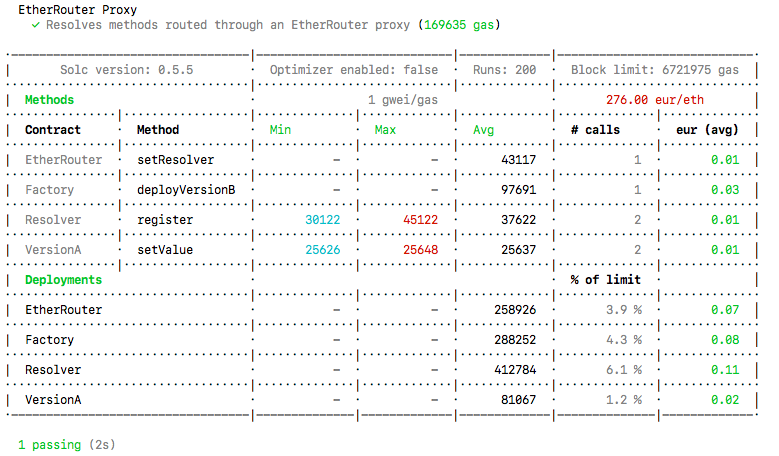

25분마다 5분 쉬기 or 2시간마다 30분 쉬기
자신에게 맞는 속도로 배우세요
몇일 몇년

협업툴을 활용하세요

# 토끼굴의 가장자리

## 블록체인

비트코인 -> bitcoin white paper -> 비트코인의 original vision

사람들이 Superior Digital Store of Value (like gold) 탁월한 자산 가치 저장소(디지털 금광마냥) 로 여겼지만
비트코인의 원래 비전은 bitcoin white paper에 나와있다.

etherium
+ Decentralized Agreements (Smart Contracts)

Nick Szabo (cryptographer)
Smart Contracts are a set of instructions exectued in a decentralized way without the need for a centralized or third party intermediary.

비트코인과 이더리움의 차이점은 smart contract
remove centralized forces and counterparty risk
비트코인도 기술적으로는 samrt contract를 가지고 있지만 "의도적으로 불완전하게" 되어있음
비트코인이 모든 기능을 가지고 있지 않음 ->
관심사 차이 
비트코인 프로토콜-> "value"를 저장하는것
이더리움 프로토콜-> "value"를 저장함과 동시에 탈중앙화를 촉진함

블록체인은 의도적으로 차단되어있음
블록체인은 사실 현실로부터 데이터를 읽거나 듣지 못한다.
The oracle problem

Blockchain Oracle:
Any device that interacts with the off-chain world to provide external data or computation to smart contracts.
체인밖의 세상에서 외부의 데이터나 스마트 컨트렉트를 계산하기 위해 상호작용되는 모든 기기들
블록체인은 하나의 데이터나 하나의 컴퓨테이션으로 작동될 수 없다.
그렇기 때문에 decentralized Oracle Network를 사용함

Hybrid Smart Contracts: On-Chain + Off-chain Agreements
여기서 가장 많이 상호작용할 프로토콜은 Hybrid Smart Contract 일 겁니다.

Chainlink
Decentralized Oracle Network
우리는 "smart contract"와 "hybrid smart contract"를 교대하며 사용할 것입니다.

비트코인 폴렛폼
아발렌체,폴리곤 , 팬텀, 하모니
대부분의 블록체인들이 이더리움 타입의 스마틐컨트렉트에서 작동가능함
따라서 여기서는 Etherium 환경에서 deploy  할 것입니다.
특정 툴이나, 체인을 익힐 걱정을 하지 않아도 됩니다. 왜냐하면 대부분 비슷하게 작동하기 때문입니다.

우리는 스마트컨트랙트 폴렛폼을 사용할때도 있고, 블록체인을 사용할때도 있을겁니다.
Dapp = Decentralized Application = Decentralized Protocol = Smart Contract

Web1: The permissionless open sourced web with static content.
Web2: The permissioned web, with dynamic content. Where companies run your agreements on their servers.
Web3: The permissionless web, with dynamic content. Where decentralized censorship resistant networks run your agreement and code. it generally is accompanied by the idea of user owend ecosystems, where the protocols you interact with you also own a portion of, instead of solely being the product.
웹3: 동적 콘텐츠가 있는 권한 없는 웹입니다. 분산된 검열 저항 네트워크가 당신의 계약과 코드를 실행한다. 일반적으로 사용자 소유 생태계에 대한 아이디어를 수반합니다. 여기서 사용자는 상호 작용하는 프로토콜도 제품이 아닌 일부만 소유합니다.

## smart contarct
### What is the value of smart contracts? 스마트 컨트렉트의 장점은 무엇일까?
이 기술은 어떤 문제점을 해결해 줄 수 있을까요?
기술은 언제나 문제점을 해결하기위해 존재합니다.
블록체인,스마트컨트렉트,암호화폐.... 이 모든것들을 합해서 말 할 수 있는 패러다임이란
이 모든걸 합쳐 스마트컨트렉트가 하는일을 쉽게 말해보자면 
->Trust Minimized Agreement
Unbreakable (Agreement) Promises 깰 수 없는 약속
속도, 효율, 투명성, 등등을 수반하지만 제일 중요한 것은

### undeniable value of smart contract
스마트 컨트렉트의 목적
re-landscape Markets and Agreements.
시장과 계약의 재조성
crypto가 아닌 다른 부분에서!

블록체인의 목적
어릴적 초등학교시절에 하던 깨지지 않는 약속 새끼손가락 걸고 하는 약속과 관계가 있습니다.

Agreements Contracts Promises
여기 당신의 인생에서 동의와 계약 그리고 약속으로 이루어진 결과물이 있습니다.

예를 들어 여기 당신의 의자는 아마존의 기술자가 가구를 만들기 위해 목재를 사기 위해 '동의'한 결과입니다.
그리고 당신은 그걸 40달러에 사는걸 '동의'했습니다.

당신의 집에 있는 전구는, 전기로 작동하고 매일 불을 켤 수 있게 전기회사에서 전기를 받고 돈을 납부하기로 '동의'한 결과입니다. 전기회사에서 생산하는 전기는 전기회사에서 터번을 돌려 전기를 생산하는 기술자과 회사가 동의한 결과입니다.

보험회사에는 당신이 매달 보험금을 내고 보험회사는 ~~아무것도안하죠~~ 당신의 의료보험금 등을 돌려줍니다.

일상생활의 대부분의 것들은 당신의 계약 동의 약속으로 이루어집니다.

Agreements / contracts = Promiese
동의와 계약을 합쳐서 쉽게 부르자면 바로 '약속'입니다.

기름을 교활할때도 과금만큼 기름을 돌려주는걸 약속합니다.
은행에 돈을 넣을때도 안전하게 돈을 보관하고 이자를 쳐서 돌려주는걸 약속합니다.
복권도 복권티켓을 사면 당신에게 당첨될 공정한 기회를 제공함을 약속합니다.

당신이 이 동의를 할때 당신은 동의대상과 이 일에 대해 속이지 않고, 공정하게 대할 것을 새끼 손가락 걸고 약속하는 겁니다. 하지만 늘 이렇진 않죠.

현실에서 이 새끼손가락 걸고 하는 약속을 어기는 경우를 생각해봅시다.

오래전 80~90 년대 맥도날드에서 모노폴리(보드게임)카드를 모으면 돈을 주는 프로모션을 진행했습니다.
쉽게 말하면 맥도날드에서 뭔가를 사면 100만 달러를 얻게 된다는 말이였습니다! 

Hey everbody, I promise if you buy our McFood we'll give you a fair chance of winning the money!

그러나 그들은 이 약속을 어겼습니다.
당첨될 공평한 기회 대신, 사실 당첨될 확률은 '0'이였습니다.
90년대 중반에 $13 ~24 백만 달러를 구입한 사람들이 아닌 회사의 부패한 내부자들이 해쳐먹었습니다.
당신이 맥도날드를 사면 100% 횡령금이 되는 것이였습니다.
이것이 맥도날드의 잘못인지 아닌지 중요하지 않습니다.
그들은 궁극적으로 지키지 못할 약속을 한 것이였습니다.

또 생각해볼 것은 24백만 달러란 돈을 우리들에게서 훔쳐간 것입니다.

하지만 이 서비스가 블록체인에서 배포되었다면 24백만 달러를 횡령하는 일은 절대 불가능했을겁니다. 바로 스마트컨트랙트의 다음과 같은 걸로 말이죠
Imuutable
Decentralized
Transparent

열살 자리 꼬마에게 돈을 맡겨달라는 부탁을 해봤다고 생각해봅시다. 아마 돈을 잃게될까봐 불안해질겁니다.

어떻게 이 사람을 믿을 수 있을까?
혹시 약속을 어기지 않을까?

언제나 이런 불안감들 때문에 숨을 못쉬겠죠

자동차 영업사원이 나에게 좋은 차를 줄지 믿을 수 있을까? 이 세탁기가 내 옷을 잘 빨아줄까 아니면 셔츠를 줄어들게 할까, 혹시 보험회사에서 내가 버스에 치였는데도 약속을 어기고 보험금을 납부하지 않을까?

계약을 하기 위해선 사람들이 옳은 일을 할꺼라고 믿어야 합니다.

작년에만 해도 로빈후드는 사용자들에게 세계금융거래와의 상호작요에 있어서 'Fair chance'를 준다고 선언했었습니다.
HAHA SIKE! 넝담~
AMC, GME, DOGE, NOK ??? (게임스탑사태때 매도버튼을 뽑아버린 걸 말하는듯)

2008년 금융위기를 기억하시나요?
비밀리에 발행된 수상한 부채들이 커다란 금융상품과 결합되어 세계경제를 무너뜨렸습니다.

짐바브웨의 하이퍼인플레이션, 브라질의 하이퍼인플레이션, 테라노스 사건

역사는 우리에게 악명높은 약속을 파기하는 것들의 실체에 대한 교훈을 주고있습니다.

우리는 마침내 이런것들을 smart contract로 고치기를 기다립니다.

이런것들로부터 우리를 지켜줄 여러 제도들이 있지만 가끔 지켜지지 않기도 합니다.
심지어 법정에 개인회생을 신청하러 가서도 3년이 걸릴 수 있고 그 사이에 돈을 구할 방법이 없을지도 모릅니다.

이런 근본적인 문제를 해결하기 위해 무엇을 해야할까요
그것이 바로 Smart Contract이며 blockchain이 만들어진 이유입니다.

스마트 컨트렉트는..
- 분산된(탈중앙화된) 블록체인에 배포된 동의,계약,지시를 말합니다.
- 바뀔(대체 될) 수 없습니다. (불변성)
- 자동으로 실행됩니다.
- 모든사람들이 계약조건을 볼 수 있습니다.

기존의 계약관계에선 중앙에서 계약조건을 마음대로 변경 할 수 있었지만 스마트 컨트렉트에선 불가능합니다.

전통적으로 복권추첨은 비공개로 진행되었습니다.
어떤 사람이 복권을 추첨하고, 코드를 가지고있고 그것을 실행할 수 있었고, 이사람이 어떤걸 조작해도 다른 사람들은 알아차리지 못했습니다.
만약 이 복권시스템이 블록체인환경으로 배포된다면 해커가 시스템을 변경할때마다 모든 사람들이 그것을 알게됩니다. 하지만 해커가 이런일을 하는 자체도 (어떤것을변경하는 일) 불가합니다.
CANNOT BER ALTERED
블록체인은 한번 배포되면 바꿀 수 없기 때문입니다.
impossible to hack
impossible to defraud (사취할 수 없는)
impossible to manipulate

decentralized exchanges
UNISWAP - ERC20 토큰으로 주식구매 가능

Decentralized Finance -> 막대한 금융 손실 감축
은행의 독단적 행동 막을 수 있음

1+1 =3 이 아닌 1+1=2 가 될 수 있도록

DEFI ->$200 Billion
defi movement

trust minimized agreement
ubreakable promises

### Ohter Blockchains benifits
Bitcoin 
이더리움 스마틐컨트렉터 decentralized trust minimized agreement
Chainlink offchain과 onchain 상호작용
스마트컨트렉트는 디지털 오일의 가치가 있다
Smart contract value = Trust Minimized Agreements

1. Decentralized
Many node operators run blockchains
2. Transparency & Flexibility
3. Speed & Efficiency (은행도 수학적으로 작동하지만 몇일걸림 마찬가지로 블록체인도 수학적으로 작동하지만 즉시처리가능함)
4. Security & immutability (데이터를 임의로 변경할 수 없다 / 데이터를 소유할 필요가 없다, 데이터가 소거되어도 모든 데이터는 분산된 노드에 저장되어있다. 수천 수만노드가 중지되어도 문제없다. 오직 하나의 블록체인이 그걸 복사했다면 문제없음, 블록체인을 해킹한다는것은 거의 불가능하다, 중앙화된 시스템을 뜷는것보다 어려움)
5. Counterparty Risk Removal (web2.0의 중개인을 제거하고, 카운터파티 게이트웨이를 제거한다.)
6. Trust minimized agreements (수학적으로 정의되는 파기할 수 없는 약속, 프로토콜의 오너가 될 수 있다.)

## What have Smart Contracts done so far?
- DeFi = Decentralized Finance
공정하고 투명한 금융거래
- DAOs = Decentralized autonomous organizations
https://ethereum.org/ko/dao/#main-content
Member-owned communities without centralized leadership.
A safe way to collaborate with internet strangers.
A safe place to commit funds to a specific cause.
- NFTs =
Non-fungible tokens (NFT)
A way to represent anything unique as an Ethereum-based asset.
NFTs are giving more power to content creators than ever before.
Powered by smart contracts on the Ethereum blockchain.

# Your First Transaction
## MetaMask
디지털 지갑


>'비밀 복구 구문'이란 무엇인가요?
복구 구문은 지갑과 자금의 '마스터 키'입니다.
비밀 복구 구문은 어떻게 저장하나요?
비밀번호 관리자에 저장
은행 금고에 보관.
대여 금고에 보관.
적어서 여러 비밀 장소에 보관하세요.
비밀 복구 구문을 공유해야 하나요?
절대로, 누구와도, 심지어 MetaMask와도 비밀 구문을 공유하면 안 됩니다!
복구 구문을 요청하는 사람은 사기를 치려는 것입니다.

https://etherscan.io/
에 만들어진 월렛주소를 복사해서 붙여넣어 봅시다.

계정생성으로 추가 계정생성하기


계정 옆에 더보기 버튼 -> 계정 상세보기 -> 계정 비밀키 내보내기 -> 트랜잭션에 필요한 private key를 얻을 수 있음


private key가 있다면 해당 계정에 접근가능하나. recovery phrase (12단어) 가 노출되는 경우 다른 계정까지도 접근가능
Public adrress는 etherscan등으로 다른사람도 조회가능 그러나 뱅킹을 하거나 할 수 없음

|Concept|Can Access|Private or Public|
|:---:|:---:|:---:|
|Mnemonic|All of your Accounts|Keep Private!|
|Private Key|1 of your account|Keep Private!|
|Public Address|Nothing|It's public|

### 네트워크 탭


Ethereum Mainnet
현실의 돈이 사용되거나 소비되어 트랜잭션되는 메인 네트워크입니다.

여기서는 TestNet을 이용해서 테스트
TestNet 엔지니어용 테스트 넷입니다.


show/hide 클릭 -> Show test networks-> ON으로

테스트넷들은 fakemoney로 트레이드 합니다.
현재는 Rinkeby가 유명하고 그다음 Kovan을 많이 사용합니다.

때에 따라 좋은 테스트네트워크가 바뀔 수 있으니 git repository를 항상 확인해보시기 바랍니다.

여기서는 Rinkeby를 자주 사용할 겁니다.

검색창에 rinkeby etherscan을 입력하거나
rinkeby.etherscan.io로 접속합니다.
etherium explorer에 private address를 입력합니다.
트랜잭션이 없으므로 빈 정보가 뜰겁니다.

### 파우셋으로 테스트넷 이더리움 보내기
테스트하기 위해 이더리움을 충전해봅시다.

사용할 파우셋
https://faucets.chain.link/

백업파우셋
https://rinkebyfaucet.com/

먼저 링크비네트웍과 지갑을 연결해야합니다.


체인링크에서 링크비네트워크에 접속이 안되니 백업파우셋으로 보내보겠습니다.


트랜잭션이 보입니다.


메타마스크 지갑에 0.1ETH가 들어왔습니다.


이더스캔에도 트랜잭션 목록이 추가되었습니다.

이 0.1ETH는 오직 Rinkeby Network에만 존재하며 
다른 테스트넷이나 이더리움 메인넷을 확인해보면 0ETH인것을 확인 할 수 있습니다.

체인링크 파우셋에서 보내기


이더스캔에서 트랜잭션 정보를 클릭해서 살펴봅시다.


Transaction Hash:
블록체인을 구분하는 값입니다.
이 트랜잭션이 0.1ETH를 이 지갑에 보냈다는 자체를 나타내는 주소입니다.

Status:
트랜잭션 성공/실패 등 상태를 나타냅니다.

Block:
이 트랜잭션이 소속되어있는 블록을 보여줍니다.

TimeStamp:
트랜잭션이 일어난 시간을 나타냅니다.

From:
트랜잭션을 보낸 계정을 나타냅니다.
링크를 누르면 해당 계정을 확인 할 수 있습니다.


To:
트랜잭션을 받은 계정을 나타냅니다.
즉, 여기선 내 계정을 나타냅니다.

Value:
트랜잭션에 보내진 eth 값을 나타냅니다.

Transaction Fee:

트랜잭션 이용비용입니다.
즉, Gas를 나타냅니다.

### Gas 1: Gas 소개


### Transaction fee


블록체인은 모두 다른 각각의 노드에서 작동하고 있습니다.
이 각각의 노드에서 블록체인을 작동하기 위해 언제나 요금을 내고 있습니다.
트랜잭션이 발생할 경우 "miner" 나 "validators"가 소정의 수수료를 받습니다.
이 수수료가 사람들이 노드를 계속 구동할 수 있도록 해줍니다.

가스는 계산 측정 단위입니다.
복잡한 트랜잭션일수록 소비하는 가스도 많아집니다.


60의 가스 제한 중에 21의 가스를 사용했다는 의미입니다.
ETH 보내기와 같은 단순한 작업은 가격이 저렴하지만,
NFT를 발행하고, 몇몇의 나눠진 컨트렉트에 입금하는것과 같이 복잡한 작업에는 계산비용이 비싸고 비싼 값을 지불해야합니다.

GasPrice * Gas Usage by Txn = Transaction Fee
0.000000002500000009 * 21000 = 0.000052500000189

또한 블록체인마다 들어가는 계산하는 가스비용이 다릅니다.

모든 블록체인상의 트랜잭션에는 가스를 지불해야합니다.

### 내 지갑안에서 계정간 트랜잭션하기
Account1 에서 계정1로 0.05ETH를 보낼경우
Account1 에는 얼마가 남을까요

가스시세:
같은 시간에 트랜잭션을 보내는 사람이 많을수록 가스요금이 비싸집니다. 

내계정-> 활동 으로 확인해보면 트랜잭션이 pending상태로 되어있습니니다. 클릭하여 이더스캔으로 넘어가면 indexing이라고 나올텐데 그것은 이더스캔이 내 트랜잭션을 받고 정리하고 있는 중이라는 뜻입니다.
만약 트랜잭션이 제대로 이루어지지 않을 경우 다른 테스트넷을 사용하면 됩니다.


트랜잭션이 success 되었다면 계정에 남은 ETH를 확인해봅시다.


ETH를 받은 계정은 정확히 0.05ETH를 가지고 있고, 보낸계정은 0.2ETH - (0.05 + Gas fee)의 ETH를 가지고있습니다. 

지금까지 테스트 해본방법이 어플리케이션을 이용해서 블록체인 프로토콜과 상호작용하는 방법입니다.

## How do Blockchains works?
Hashing, blocks, signers, etc...

https://andersbrownworth.com/blockchain/

### 해시

Hash:
데이터를 식별하기 위해, 고정된 길이의 고유한 값을 가지는 문자열입니다. 이러한 값은 해시함수에 의해 배치되고 생성됩니다.

Keccak256: 실제 이더리움이 사용하는 알고리즘

SHA 256: Keccak256 내에 포함된 크립토 알고리즘

https://andersbrownworth.com/blockchain/hash

### 블록

https://andersbrownworth.com/blockchain/block

블록은 블록넘버와 넌스 자료(데이터)를 모아 해시값을 생성하여 만들어집니다.


아무값이나 입력하고 채굴(mine)을 눌러봅시다.


배경색이 초록색이 되었고(서명되었고) 넌스(nonce)값이 달라졌습니다. (72608 -> 60075)

해시값 또한 달라졌습니다. (0000으로 시작)

마이너(채굴가)들이 하는일이 바로 이 nonce값을 찾아내는 일입니다.
해당블록넘버 (#1)에서 nonce값이 0000으로 시작하는 해시값에 해당할때까지 bruteforce(일일히 대입)하여 Nonce 1~ 60075 까지 대입하여 알아내는 것입니다.
이렇게 하여 알아낸 0000으로 시작하는 해시값을 가진 블록을 서명된 블록이라고 합니다.

nonce 60075는 0000으로 시작하는 해시가 허용된 넌스입니다.

값을 입력한 뒤 붉은색으로 되는 블록은 해시값이 0000으로 시작하지 않고 서명되지 않은 블록입니다.
여기서 넌스값을 변경하여 0000로 시작하는 해시(즉, 서명된 블록)를 찾는겁니다. 이 과정은 brute force로 이루어집니다.

이것이 블록체인을 채굴혹은 채굴가들이 하는일입니다.

### 블록체인

https://andersbrownworth.com/blockchain/blockchain

위의 블록에 이전해시(prev)변수가 추가됩니다.

블록의 원조가 되는 해시값이 000000~ *64 인 블록은 
Genesis block이라 부르고 이것이 블록체인의 첫번째 블록입니다.

#### 불변성


블록체인 중 하나의 값을 바꾸게 되면 해시값이 달라지면서(0000으로 시작하지 않는 다른 값이 되기때문에, 해당 블록은 물론이고 다음 블록의 이전해시값도 유효하지 않게 됨) 다른 나머지 블록체인 또한 망가지게 됩니다.(다시 연겱하려면 모든 블록을 다시 채굴해야하기 때문에 시간과 비용이 많이 들어감)
이것이 불변성을 보장하는 방법입니다.


#### 분산 블록체인(Distribute Blockchain)

https://andersbrownworth.com/blockchain/distributed

마지막 해시는 모든 블록들과 연결되어있기때문에 블록들에게 영향을 끼칠 수 있습니다.

블록의 값이 바뀐다면 블록체인네트워크 안에 있는 참여자들(peer)이 모두 알아차릴 수 있으며 해당 사용자(peer)는 블록체인 네트워크에서 제외됩니다.(채굴로 서명을 받은 블록이라도 다른 peer의 블록 hash값과 일치하지 않기 때문에)

#### 토큰(Tokens)

https://andersbrownworth.com/blockchain/tokens


tx(트랜잭션)이 추가되었습니다.
매 트랜잭션마다 분산 네트워크를 가지고 있으며
트랜잭션 값을 바꾸면 마찬가지로 원래 참여하고 있던 블록체인 네트워크에서 제외됩니다.

Darcy 가 Bingley에게 돈을 보냈다는걸 어떻게 알 수 있을까요? 이 점은 private key와 public key를 통해 설명 할 수 있습니다.

### 정리

해시: 데이터를 식별하는 고유한 고정 길이 문자열입니다.

해시 알고리즘: 데이터를 고유한 해시로 계산하는 함수입니다.

마이닝(mining): 블록체인 "문제"에 대한 "해결책"을 찾는 과정입니다. 이 예에서 "문제"는 4개의 0으로 시작하는 해시를 찾는 것이었습니다. 노드는 마이닝 블록에 대한 비용을 받습니다.

블록: 함께 마이닝 된 트랜잭션 목록입니다.
(블록, 넌스, 트랜잭션, 이전해시, 해시)

분산화(Decentralized): 권한을 가지고 있는 단독지점이 없습니다.
(서로의 해시를 비교해서 트랜잭션이 정상적인지, 멜리셔스한지 판단) 

넌스(Nonce): 블록체인 문제에 대한 "해결책"을 찾기 위한 "한번 사용된 숫자(Number used once)"입니다.
또한 계정/주소의 트랜잭션 번호(Number)를 정의하기 위해 사용됩니다.

### Signing Transactions 트랜잭션 서명

>Darcy 가 Bingley에게 돈을 보냈다는걸 어떻게 알 수 있을까요? 이 점은 private key와 public key를 통해 설명 할 수 있습니다.

에서 이어지는 글입니다.

#### keys

https://andersbrownworth.com/blockchain/public-private-keys//keys


개인 키: 키 홀더에게만 알려져 있으며, 트랜잭션 "서명"에 사용됩니다.

private key를 입력하면 ECDSA(Elliptic Curve Digital Signature Algorithm) 에 의해 public key를 발급합니다.

#### Signatures


메시지에 값을 입력해봅시다.


여기에서도 ECDSA로 Private key를 바탕으로 Message Signautre가 발급됩니다.

Verify 탭으로 넘어가봅시다.


Verify 버튼을 누르면 valid(배경초록색)이 되었습니다.

Signature에는 아까 전에 만든 Message Signature 값이 들어가 있습니다.

이 verify는 public key와 비교해서 verify 여부를 결정하고 아무나 verify 할 수 있습니다. 따라서 누구나 signature를 가지고 이 트랜잭션이 진짜인지 확인 할 수 있습니다.

#### Transaction 


20달러를 보내봅시다.


마찬가지로 Private key 를 가지고 생성된 message signature를 가지고 signature 값과 비교해서 확인 할 수 있습니다.

이것이 private key를 숨겨야 하는 이유입니다.

Metamask의 setting > Security & Privacy 탭을 확인해봅시다.

reveal seed phrase 를 누르면 비밀번호 확인을 거쳐서 인증 12단어를 볼 수 있습니다.


비공개 키 내보내기


이런식으로 비공개 키를 내보낼 수 있습니다.

위에서 만든 Public Key는 Account1의 public key와 역할이 동일합니다.

### 정리

Public Key: Is derived from your private key. Anyone can "see" it, and use it to verify that a transaction came from you.

Public Key 공개키:
개인 키에서 파생되었습니다. 누구나 "확인"할 수 있으며, 사용자로부터 트랜잭션이 전송되었는지 확인하는 데 사용할 수 있습니다.

Signing a transaction: A "one way" process. Someone with a private key signs a transaction by their private key being hashed with their transaction data.
Anyone can then verify this new transaction hash with your public key.

트랜잭션 서명: "단방향" 프로세스입니다. 개인 키를 가진 사용자는 자신의 개인 키를 자신의 트랜잭션 데이터로 해시하여 트랜잭션에 서명합니다.
그러면 누구나 사용자의 공개 키로 이 새 트랜잭션 해시를 확인할 수 있습니다.

Private Key ||| barrier ||| > Public key > Address

## Gas 2: Block Rewards & EIP 1559

It's not important to understand everything in this section.

The main takeaway should be:
"The more people use a chain, the more expensive it is to send transactions"

21,000 | 21,000

트랜잭션에서 사용하고 싶은 가스량을 제한 할 수 있습니다.


Base Fee: The minimum *gas price* to send your transaction

기본요금: 트랜잭션을 보낼 수 있는 최소 가스가격
Gwei가 뭘까요?

https://eth-converter.com

Wei Gwei Ether 가 있네요


1 Ether = 10,0000,0000 Gwei = 100,0000,0000,0000,0000 Wei

Max Fee: 사용할 수 있는 최대 가스량

Max Priority: 최대로 지불할 가스값 + 마이너에 줄 의향이 있는 최대 값
>https://www.blocknative.com/blog/eip-1559-fees
>
>우선 요금 설정
>
>최대 우선 순위 수수료(Max Priority Fee)는 종종 마이너 팁이라고도 하며, 당신의 거래를 블록에 포함시키기 위해 마이너에게 인센티브를 주기 위해 마이너에게 직접 지불되는 '선택적' 추가 수수료입니다. Max Priority Fee는 기술적으로 선택 사항이지만, 현재 대부분의 네트워크 참여자들은 포함 후보가 되기 위해 일반적으로 최소 2.0 GWE 팁이 필요하다고 추정한다. 이와 같이 특정 채굴 풀은 포함을 위한 대체 최소값을 설정할 수 있다.
>
>혼잡하지 않은 정상적인 네트워크 조건에서 제출되는 '일반적인' 트랜잭션의 경우, 최대 우선 수수료는 2.0 GWEI에 가까워야 합니다. 그러나 다음 블록에 순서나 포함이 중요한 트랜잭션이나 네트워크가 매우 혼잡할 경우 트랜잭션의 우선 순위를 정하기 위해 더 높은 최대 우선 수수료가 필요할 수 있습니다.
>
>Max Priority Fee에 대한 다소 미묘한 뉘앙스는 당신이 광부에게 기꺼이 지불할 수 있는 최대 팁을 나타낸다는 것이다. 단, 기본료+최대우선수수료가 최대수수료를 초과할 경우(아래 참조), 최대우선수수료의 상한을 유지하기 위해 최대우선수수료가 감소한다. 즉, 실제 팁은 최대 우선 수수료보다 작아야 할 수 있으며, 이러한 상황에서는 거래가 채굴자에게 덜 매력적일 수 있습니다.

Burnt = Base Fee * Gas Use

마이너에게 돌아가는 수익 = Transaction Fee - Burnt

Others:

Txn Type:2 (EIP-1559):
이 트랜잭션이 EIP-1559 타입의 트랜잭션이라는 뜻

많은 사람들이 트랜잭션을 이용할 수록
Burnt양이 늘어남

## EIP-1559
https://www.youtube.com/watch?v=MGemhK9t44Q

EIP(ETHEREUM IMPROVEMENT PROPOSAL)
트랜잭션의 변경된 기술사양을 다루는 문서입니다.
보통 기술사양 문서들은 기술적 세부사항을 개선하는데 중점을 둡니다.
그래서 개발자 커뮤니티에선 별로 다뤄지지 않습니다.

하지만 예외가 있는데 이것이 바로 EIP-1559입니다.
왜냐하면 지갑과 같은 사용자 어플리케이션에 관해서 큰 의미를 갖기 때문입니다.

eip1559는 이더리움 요금(fee)모델의의 변화를 설명하고 있으며 2019년에 비탈릭부테린(vitalik buterin)에 의해 제안되었습니다.

이더리움 요금 모델
First-price auction 첫 번째 가격 경매 라는 매커니즘을 기반으로 합니다.

the users who want to have their transaction picked up by a miner have to essentially bid for their space in a block
트랜잭션이 마이너에게 선택 받기를 원하는 사용자들은 기본적으로 그들의 블록 공간을 위해 입찰을 진행해야 합니다. 이는 사용자들이 특정 트랜잭션에 대해 기꺼이 지불할 의향이 있는 가스요금(gas price)을 제출해서 이루어집니다. 
마이너들은 이것을 가격이 높은 순으로 정렬해서 가장 수익성 있는 트랜잭션을 먼저 포함하여 거래를 선택합니다. 이는 매우 비효율적일 수 있고, 일반적으로 사용자가 거래에 대해 초과 지불하게 되는 결과를 초래하게됩니다.

이 모델또한 문제점이 있습니다.
metamask를 예로 들어보면 slow averge fast 중에 속도를 선택하여 또는 수동으로 가스가격을 조절할 수 있습니다.
일반적인 사용자들은 기본요금으로 트랜잭션이 confirm되기를 기다리는 상태가 되기도 전에 가스요금이 갑자기 급등해서 다시 요금 확인을 위해 기다리는 경험을 할 만큼 운이 좋지 않습니다. 이것은 물론 사용자 경험 관점에서도 좋지 않습니다. 

이것은 EIP-1559의 존재 이유기도 합니다.
제안서는 이 문제를 해결하기 위해 작성되었고 다음과 같은 목적을 가지고 있습니다.
- 트랜잭션 요금을 더 예측가능하게
- 트랜잭션 확인 딜레이를 줄이기
- 요금 입찰방식을 자동으로 하여 사용자 경험 향상
- 네트워크 활동과 ETH공급 사이에 긍정적인 피드백 루프 생성

### EIP-1559 FEE MODEL

- Base fee의 새 개념 : 
Basefee는 트랜잭션이 블록에 포함되기 위한 최소요금입니다.
- Base fee는 블록당 책정되며 이더리움 네트워크가 얼마나 혼잡한지에 따라 위아래로 조정이 가능합니다.

- Network Capacity 네트워크 용량 증설
가스 최대량을 12.5M에서 25M으로 늘림으로써, 네트워크 용량을 늘렸습니다.
기본적으로 블록사이즈가 두배로 늘었습니다.

- Base fee 와 네트워크 용량 증가로 EIP 1559 는  다음과 같은 로직으로 설계 될 수 있습니다.
  - 네트워크 사용량이 50% 이상일때 Base fee는 증가합니다.
  - 네트워크 사용량이 50% 이하일때 Base fee는 감소합니다.

이 말은 기본적으로 네트워크가 네트워크 사용량에 따라 수수료를 조정하여 50%의 용량에 평형을 맞추는 것을 목표로 한다는 것을 의미합니다.

### MINER TIP


 eip 1559 also introduces a minor tip a separate fee that can be paid directly to the miner to incentivize them to prioritize a transaction

 eip 1559는 또한 마이너팁을 도입하여 광부에게 직접 지불하여 거래의 우선순위를 부여하도록 장려할 수 있습니다.

 이것은 마이너들이 높은 가스금액에서 인센티브를 받을 수 있는 현재 매커니즘과 비슷합니다. 

이는 (arbitrage transactions)차익거래 같은 트랜잭션과 같은 빠른 트랜잭션 confirm으로 이익을 얻을 수 있을때 있어서 매우 중요한 기능입니다. 

### EIP 1559 와 기존 모델 비교
#### 기존 네트워크 모델
imagine the minimum gas fee to be included in the previous block was 50 gray the network activity seems to remain the same. so users start submitting their transactions with 50 gray trying to be included in the next block

블록에 포함되기 위한 최소가스 수수료가 50Gwei라고 가정해봅시다. 네트워크 활동은 동일하게 유지되므로 사용자는 다음 블록에 포함하려고 하는 50Gwei로 트랜잭션을 제출하기 시작합니다. 동시에 매우 기대되는 토큰이 출시되어 이를 사고싶어 하는 사용자들이 현재 입찰가를 크게 높였습니다. 이제 다음 블록에 포함될 수 있는 최소금액은 100Gwei 입니다.
만약 네트워크 활동이 여러 후속 블록에서도 여전히 혼잡하다면 이미 트랜잭션 요금으로 50Gwei를 낸 사용자는 매우 긴 시간동안 트랜잭션 확인을 기다려야 합니다.
이 경우 블록 사이즈는 12.5백만 가스로 제한되며 블록에 들어갈 수 있는 유일한 방법은 다른 사용자보다 더 높게 입찰하는 것입니다.

#### EIP 1559 의 경우
같은 상황에서 EIP 1559는 이렇게 작동합니다.
이전 블록에서 다음블록으로 옮기는데 50Gwei 가 최소요금으로 설정된 블록에 네트워크 사용률은 50%였으며 대부분의 블록은 최대 가스 제한의 절반인 1250만 가스를 사용했습니다.
새 토큰 출시로 인한 요금 급등은 사용자들이 더 높은 마이너 팁으로 거래를 하게 만듭니다.
블록 공간에 대한 높은 수요와 높은 마이너 팁을 가진 많은 트랜잭션을 볼때 마이너가 2500만 가스의 최대 상한선인 블록을 생성합니다. 더 많은 트랜잭션이 블록에 포함 될 수 있지만, 또한 후속 블록의 base fee 가격이 증가하게 됩니다.

현재 블록이 100% 꽉 찼고, 여전히 네트워크 활동량이 높고, 블록공간에 대한 수요가 높게 유지된다면, 마이너들은 각각의 후속 블록에 기본료를 증가시키면서 꽉 찬 블록을 계속 생산할 것입니다.

어느 시점에서는 요금이 일부 사용자들을 쫓아낼 만큼 충분히 높아져서, 네트워크가 다시 50% 이하의 네트워크 이용률로 돌아오기 시작하고 후속 블록에서 요금을 낮추기 시작할 것입니다. 기본요금은 블록당 최대 12.5퍼센트까지 오르내릴 수 있기 때문에 기름값은 5분 정도 20블럭에서 10배, 40블럭에서 100배까지 소요된다.

...계속

### 정리

Txn Savings : Max값과 실제 지불한 값의 차이

## High-Level Blockchain Fundamentals
블록체인 Peer마다 가지고 있는 Node에서 작동합니다.
네트워크는 참여자가 모여서 이루어집니다.

Node: A single instance in a decentralized network
노드 : 분산 네트워크의 단일 인스턴스

모든 사람이 네트워크에 참가할 수 있습니다.

Blockchains are resilient

블록체인은 복원력이 뛰어납니다. (다른 노드가 다운되더라도 작동할 수 있습니다)
또한 다른 노드가 멜리셔스하다면 그 노드를 제외합니다.

Blockchain nodes keep lists of the transactions that occur.
블록체인 노드는 발생하는 트랜잭션 목록을 보관합니다.
이것이 블록체인에 불변성을 더해줍니다. 아무것도 부패하지 않고, 변하지 않습니다.

### Consensus 컨센서스
#### proof of work
우리가 전에 살펴본 마이닝 기능을 proof of work 이라고 합니다.

proof of work(작업증명)과 proof of stake(이해관계증명)는 컨센셔스의 아래에 놓여있습니다.

컨센서스(합의)는 블록체인의 상태나 하나의 값에 동의하는데 사용되는 메커니즘입니다. 

컨센서스 프로토콜을 크게 나눠보자면 두개로 나눌 수 있습니다.
1. Chain Selection algorithm
2. Sybil Resistance mechanism -> 마이닝 사용(proof of work) 이더리움, 비트코인

http://wiki.hash.kr/index.php/%EC%8B%9C%EB%B9%8C%EA%B3%B5%EA%B2%A9#:~:text=%EC%8B%9C%EB%B9%8C%EA%B3%B5%EA%B2%A9(sybil%20attack)%EC%9D%B4%EB%9E%80,%EC%9D%84%20%EB%AF%B8%EC%B9%98%EB%8A%94%20%EA%B3%B5%EA%B2%A9%EC%9D%84%20%EB%A7%90%ED%95%9C%EB%8B%A4.

시빌 저항이란 시빌공격(공격자가 실제로는 한명이면서 마치 여러 명인 것처럼 속이는 방식으로 네트워크 상 여러 노드를 제어함으로서 의사결정에 좋지 않은 영향을 미치는 공격)으로부터 방어하는 블록체인의 능력을 뜻합니다.

시빌 저항에는 PoW 와 PoS 두가지 매커니즘이 있습니다.

PoW 작업증명:
블록체인 문제를 해결하여 증명 (앞서 실습해본 0000으로 시작하는 nonce를 찾기 같은)

no matter how many sudo anonymous account to make, each one still has undergo to very computationally expensive activity finding the answer to the proof of work problem.

얼마나 많은 sudo 익명 계정을 만들든지 간에, 각각의 계정들은 여전히 작업 증명 문제에 대한 답을 찾는 계산적으로 매우 비싼 활동을 겪습니다.

어떤 블록체인들은 알고리즘을 어렵게 만들거나 쉽게 만드는데 이는 블록타임을 조절하기 위함입니다.

블록타임 - 블록이 발행되는데 걸리는 시간, 알고리즘이 얼마나 어려운지에 비례합니다.

#### chain selection rule
이제 컨센서스를 생성하기 위해선 
시빌 저항을 chain selection rule과 합성해야 합니다.

우리가 어떻게 어떤 블록체인이 진짜 블록체인인지 알 수 있을까요? 

#### 나카모토 컨센서스
나카모토 컨센서스는 pow 와 가장 긴chain rule을 결합한 컨센서스입니다.


#### Block Confirmations
트랜잭션이 끝난 후 남은 블록들

This has recently changed as of EIP 1559
최근에 나카모토 컨센서스는 EIP 1559로 바뀌었습니다.

Pow(작업증명) -> 채굴자Miner
Proof of Stake -> Validater 검증인

작업증명에서는 모든 노드가 블록체인 문제를 해결하기 위해 경쟁합니다. 모든 노드가 이 "퍼즐"을 제일 "먼저" 해결하기 위해 노력합니다. 왜냐하면 첫번째로 문제를 푼 노드가 트랜잭션 fee를 얻을 수 있기 때문입니다.

노드는 두가지 방식으로 보상을 받을 수 있습니다.
하나는 트랜잭션 요금이고
다른 하나는 block award 입니다.
블록어워드는 블록 체인 자체에서 프로토콜로부터 이 노드에 주어집니다.

- 비트코인의 블록 반감기 (block halving)
블록이 대략 50%로 줄어드는것
https://academy.binance.com/ko/halving

블록어워드를 더이상 못얻게 하는 블록체인도 있습니다.

- sybil 공격
- 51% 공격 이더리움 클래식에서 일언난 공격


Longest chain rule:
블록체인의 규모가 클수록 안전하다

Proof of Stake
pos에서는 miner대신 validater 검증인 이라고 합니다.
pow는 너무 많은 에너지가 들어갑니다. 환경문제

ETH 2.0 으로 업그레이드 하면서 POS로 변화했습니다.

Proof of stake nodes put up collateral as a sybil resistance mechanism
Pos 노드는 담보물이 sybil 저항 매커니즘으로 설정되어있습니다.
이 담보물이 stake입니다.

ETH2.0을 예로들면 노드는 ETH를 stake로 삼아 정직하게 활동하도록 합니다. 만약 노드가 악의적 행동을 한다면 그들은 stake를 줄이거나 제거할 것입니다.

이는 효과적인 시빌 저항 매커니즘입니다.
만약 익명의 여러 계정을 만든다면 각각의 노드마다 stake를 가져야 할것입니다. 이 상태에서 잘못된 행동을 한다면 여러 계정을 만드는데 담보로 잡힌 stake(ETH)들을 모두 잃게 될 겁니다.

이 시스템 상에서 채굴자(miner)들은 검증인(validator)이라 불립니다.

- Randomness

Proof of stake uses much less energy
하나의 노드만 문제를 풀고 나머지는 검증만 하면 되기 때문

- Scalability
많은 사람들이 블록체인을 원할때 가스값이 올라갈것이다
이것은 스케일러블에 나쁨
- Sharding : scalability 문제를 해결하기 위한 솔루션
블록체인안의 블록체인

- Layer1: Base layer blockchain implementation

- Layer2: Any appplication built on top of layer2
layer1 위에 구현되어있는 모든 어플리케이션들

아베트롬 옵티미즘 -> Rollups
샤드 체인지 해주는것
싸이체인과 다름 싸인은 자신의 프로토콜로 보안
Rollups -> 베이스레이어로 보안

## Recap
ETH and BTC are Proof of Wrok (at the time of recording)

- ETH 2.0 will be Proof of Stake
- Pow & Pos are sybil resistance mechanisms
- The bigger the blockchain, the more secure
- Sharding and rollups are scalability solutions
- Only so many transactions can fit into a block
- Gas prices are how much it costs to perform executions on-chain

# Welcome to Remix!

## 리믹스 시작하기
https://remix.ethereum.org/


Solidity 선택


처음부터 시작해보기

contracts폴더만 남겨놓고 안의 내용과 나머지들을 다 지워봅시다.


contracts 폴더에 SimpleStorage.sol 파일을 만듭니다.


.sol 파일은 컴파일러가 solidity 파일로 인식하며 solidity는 스마트 계약 부분에서 가장 점유율 높은 언어입니다.

### 솔리디티 컴파일러 탭


첫번째로 해야할 일은 어떤 버전의 솔리디티를 사용할 것인지 정하는 것입니다.

이 부분은 항상 솔리디티 코드의 제일 위쪽 줄에 위치해야 합니다.

솔리디티는 지속적으로 업데이트 되는 언어입니다.
따라서 업데이트 되는 최신 버전의 솔리디티를 쓰고 싶다면
이렇게 입력하면 됩니다.

```solidty
pragma solidity
```

특정 버전을 사용하고 싶다면 뒷부분에 버전을 입력하면 됩니다.
```
pragma solidity 0.8.7; // 0.8.12
```
주석은 // 로 처리합니다.

현재 최신버전은 0.8.12 (2022-06-01기준)입니다.
스테이블 버전은 0.8.7 이기때문에 0.8.7 버전을 사용할 겁니다.

코드를 배울때 항상 주석으로 노트합시다. 복습에 도움이 됩니다.

만약 표기버전보다 더 높은 버전을 사용해도 괜찮다는 표시를 하고 싶을땐 `^`를 붙여서 입력하면 됩니다.
```
pragma solidity ^0.8.7;
```
아니면 특정 버전 범위를 정해서 해당 버전의 컴파일러만 작동하도록 만들 수도 있습니다.
```solidity
pragma solidity >=0.8.7 <0.9.0; //0.8.7이상 0.9.0 미만의 컴파일러만 작동
```

또한 모든 솔리디티 코드는 `;`로 끝나야합니다.

### SPDX License Identifier
  - 라이센스 관리와 코드 공유에 도움이 됩니다.
  - 이는 옵션 선택이지만 가끔 이를 요구하는 컴파일러가 있습니다.
  - 이 설정은 컴파일러 설정보다 먼저(코드 위쪽에) 위치해야합니다.

```solidity
// SPDX-License-Identifier: MIT
pragma solidity 0.8.8;
```


이제 왼쪽 탭에 있는 Complie SimpleSotrage.sol 버튼을 눌러봅시다.


컴파일러가 0.8.8 로 자동으로 바뀌었습니다.

`ctrl + s` 를 눌러 `저장 후 컴파일`이 가능합니다.

코드안에서 0.8.8로 설정 후 다른 버전의 컴파일러를 선택해서 컴파일 할 경우 자동으로 0.8.8버전이 설정되지만, ^0.8.8 과 같이 허용범위를 설정해놓았다면 다른 버전의 컴파일러를 선택하면 그 버전의 컴파일러로 컴파일됩니다.

### contract

contract 키워드는 contract를 정의하는 키워드입니다.
java나 javascript같은 객체지향형 프로그래밍 언어의 class와 비슷하다고 보면 됩니다.

```solidity
// SPDX-License-Identifier: MIT
pragma solidity 0.8.8;

contract
```

`{}` 열어 SimpleStorage 안의 내용을 작성할 수 있습니다.
```
contract SimpleStorage {
    
}
```

`ctrl s`를 눌러 저장 후 컴파일 해봅시다.


이번에는 모두 에러메세지 없이 모두 초록색 체크표시가 뜨는 걸 볼 수 있습니다.

이 초록색 표시는 코드가 정상적으로 컴파일 됐으며, 에러가 없다는 뜻입니다.

we get hypothetically deploy this contract right now and it would be a valid contract.
현시점에서 이 계약을 배포한다고 가정한다면, 이 계약은 유효할 것입니다.
축하합니다. 당신의 첫 계약을 작성해봤어요.

## Basic Solidity Types

솔리디티는 많은 타입과 원시자료형(원시자료타입)을 가지고 있습니다.

솔리디티 공식문서를 보면 더 자세히 알 수 있습니다.

https://docs.soliditylang.org/en/v0.8.14/types.html

https://solidity-kr.readthedocs.io/ko/latest/types.html

기본적인 타입들은 다음과 같은 것들이 있습니다.

boolean: 참 ,거짓

uint: unsigned int , 양의 정수

int: integer, 정수

address: 주소, 메타마스크 계정에 있는 그 주소가 맞습니다.

bytes: 로우레벨에서 사용할 수 있는 단위 나중에 더 자세히 다룹니다.

hasFavoriteNumber 라는 변수를 만들어볼까요. 
```solidity
contract SimpleStorage {
    // boolean, unit, int, address, bytes
    bool hasFavoriteNumber = true;
    uint256 favoriteNumber = 123;
    string favoriteNumberInText = "Five";
    int256 favoriteInt = -5;
    address myAddress = 0xC2a354ac356d3c4BC00432A4989C5fD7a6c4e199;
    bytes32 favoriteBytes = "cat"; // bytes 오브젝트는 자동으로 들어온 자료값을 bytes로변환합니다. ex) 0x12345215asdfa...
    // bytes는 bytes1, bytes2 가 가능하고 32가 최대값입니다. 
    // uint 와 int는 8의 제곱으로 설정해야 합니다. uint8 uint16 uint32
}
```

디폴트 벨류

```
contract SimpleStorage {
    uint256 favoriteNumber; 
    // unit256 favoriteNumber = 0; 과 같습니다.
    // 0으로 초기화됩니다.
}
```

### Basic Solidity Functions

```solidity
// SPDX-License-Identifier: MIT
pragma solidity 0.8.8;

contract SimpleStorage {
    // 이 변수는 0으로 초기화 됩니다.
    uint256 favoriteNumber;

    //함수도 다른 언어와 마찬가지로 사용됩니다.
    // 이 함수는 uint256 형태의 인수를 가지는데 이름은 _favoriteNumber 입니다.
    function store(uint256 _favoriteNumber) public {
        favoriteNumber = _favoriteNumber;
    }
}
```

이쯤에서 테스트넷에 배포를 해봅시다.

https://remix-ide.readthedocs.io/en/latest/run.html#run-setup


`Save and Compile` 후에 `Deploy & run transactions` 탭으로 넘어갑니다.


ENVIRONMENT 에 있는 VM 들은 가상머신(VM)에서 작동하는 fake블록체인입니다.
테스트넷에 직접 접근하지 않아도 이곳에서 JavaScript VM를 통해 테스트를 할 수 있습니다.

ACCOUNT 에는 100ETH가 들어있는 가상 계좌들이 담겨있습니다.

현재 CONTRACT는 SimpleSotre 하나만 작성했기때문에 SimpleStore로 설정되어있습니다.

이제 DEPOLY를 눌러봅시다.


아래쪽 탭을 눌러보면 `SIMPLESTORAGE`가 `0xd9145CCE52D386f254917e481eB44e9943F39138`에 배포되었습니다.


주황색 버튼에는 전에 작성한 `store` 함수가 이름으로 들어가 있고 그 옆의 인풋에는 함수 파라미터인 `uint256 _favoriteNumber` 를 볼 수 있습니다.

이처럼 스마트 컨트렉트는 지갑계정과 마찬가지로 주소를 갖습니다.

COPY를 눌러 복사해봅시다.


콘솔창에서 트랜잭션 정보도 확인 할 수 있습니다.
Etherscan에서 확인한 정보와 비슷하죠?
이는 VM에서 시뮬레이션한 트랜잭션입니다.


새 계약을 만들어 포함시키는 일과 같이 온체인(on-chain)에서의 변화를 주는 일은 항상 트랜잭션을 발생시킵니다. 

이제 store 버튼을 작동시켜볼까요
인수 _favoriteNumber 에 적당한 숫자를 넣고 store 버튼을 눌러 함수를 작동시켜봅시다.


계좌를 확인해보면 소량의 ETH가 소진되어 있습니다.


이 store 함수를 실행시키기 위해 transction이 발생해 gas요금으로 나간것 입니다. 

한번 더 해봅시다.
이번엔 5를 store 해봅시다.


역시나 트랜잭션이 발생합니다.

여기서 우리의 favoriteNumber는 어떻게 볼 수 있을까요?
현재 uint256 favoriteNumber는 private이기 때문에 확인 할 수 없습니다. 이에 관해서(visibility) 나중에 다뤄 볼 겁니다.

현재는 `uint256 public favoriteNumber;`로 바꾸면 public으로 접근이 가능합니다.

다시 컴파일 후에 배포해봅시다.

먼저 컴파일을 한 후 배포탭에 가서 Deploy Contracts 에 있는 배포된 계약을 x버튼을 눌러 삭제합니다.
- 이 버튼은 리스트 상에서만 삭제하는것이고 사실 실제 블록체인환경에서는 사라지진 않습니다. 블록체인은 불변하니까요. 하지만 이곳은 테스트용 가상블록체인이기 때문에 명목상 삭제하는셈 치는겁니다.


그런 다음 다시 Deploy 합니다.

store 밑에 추가로 favoriteNumber 버튼이 나타났습니다.


이 버튼은 public favoriteNumber를 대표하는 버튼입니다.

이 상태에서 누르면 어떻게 될까요?
0으로 초기화 된 값이 보입니다.


`0: uint256: 0`
이 타입은 uint256이고 값은 0이라는 뜻입니다.


이번엔 5를 넣고 store 눌러 저장한 다음
다시 favoriteNumber를 호출해봅시다.


값이 5로 업데이트 된 걸 확인 할 수 있습니다.


### visibility

https://docs.soliditylang.org/en/v0.8.14/cheatsheet.html?highlight=visibility#function-visibility-specifiers

>```solidity
>function myFunction() <visibility specifier> >returns (bool) {
>    return true;
>}
>```
>public: visible externally and internally (creates a getter function for storage/state variables)
>
>private: only visible in the current contract
>
>external: only visible externally (only for functions) - i.e. can only be message-called (via this.func)
>
>internal: only visible internally

- public: 외부적으로 볼수 있고 내부적으로도 볼 수 있습니다. (스토리지/상태 변수들의 getter 함수를 만듭니다.)
이말은 이 계약과 상호작용하거나 볼 수 있는 아무나 이 변수나 함수를 호출 할 수 있습니다.
또한 public 변수에는 가지고 있는 값을 반환(return)하는 함수(getter)가 구현되어있습니다. 이런 이유로 파란 favoriteNumber 버튼을 누르면 반환된 값을 볼 수 있는겁니다.

- private: 오직 이 계약 안에서만 볼 수 있습니다.
private은 오직 이 특정한 계약 안에서만 호출 할 수 있는 함수를 뜻합니다.

- external: 오직 외부에서만 볼 수 있습니다(오직 함수를 위해 사용할 수 있습니다) this.func 을 통해서만 호출 할 수 있습니다.
external은 외부의 누군가가 이 계약안의 함수를 호출 할 수 있습니다.

- internal: 내부적으로만 보입니다.
internal은 이 계약에서 그리고 그 자식요소들만이 이 함수를 호출 할 수 있습니다.

참고로 visibility의 디폴트값은 internal입니다.

```solidity
// SPDX-License-Identifier: MIT
pragma solidity 0.8.8;

contract SimpleStorage {
    // 이 변수는 0으로 초기화 됩니다.
    // 여기서 visibility를 따로 설정해 놓지 않으면 기본 internal입니다.
    uint256 public favoriteNumber;

    //함수도 다른 언어와 마찬가지로 사용됩니다.
    // 이 함수는 uint256 형태의 인수를 가지는데 이름은 _favoriteNumber 입니다.
    function store(uint256 _favoriteNumber) public {
        favoriteNumber = _favoriteNumber;
    }
}

//0xd9145CCE52D386f254917e481eB44e9943F39138
```

- _favoriteNumber 앞의 `_`는 favortieNumber와 구분해 주기 위해 붙인겁니다. 파라미터를 위한 더 좋은 이름은 무엇인가 같은 네이밍 컨벤션에 관한 이야기를 나중에 다뤄볼 것입니다.

블록체인의 상태를 바꾸는 모든 일은 반드시 트랜잭션을 수반한다는 사실을 기억하세요.

리믹스 콘솔의 트랜잭션을 확인해 보면 이더리움을 보낼때(21000가스)보다 훨씬 더 많은 가스가 소비된다는 사실을 알 수 있습니다.

이는 단순히 이더리움을 주고받는 것보다 더욱 복잡한 값을 주고받기 때문입니다.(store함수와 favorteNumber 같은)


### A quick gas example

만약 store 함수 안에서 더 많은 일을 처리한다면 어떻게 될까요?

값을 1 더해서 업데이트 해주는 기능을 추가해 봅시다.

```solidity
    function store(uint256 _favoriteNumber) public {
        favoriteNumber = _favoriteNumber;
        favortieNumber = favoriteNumber + 1;
    }
```
다시 컴파일 후에 배포된 계약리스트를 삭제한 후 재배포합니다.


다시 아무값이나 store를 해봅시다.

리믹스 로그에서 가스값을 확인해 보면 약 1.7배 가까이 가스소모가 늘어난 것을 확인 할 수 있습니다.
(26624 -> 44132)


이처럼 함수안에서 무언가 더 많이 할 수록 소모되는 가스가 많아집니다.

### Scope

`favoriteNumber`는 global 스코프에 위치해있습니다.
이 말은 SimpleStorage의 {} 안에 있는 어떤 것이든 `favoriteNumber`에 접근할 수 있다는 뜻입니다.

만약 이런경우는 어떨까요?
something 함수에서 store 함수에서 선언한 testVar에 재할당 하고 있습니다. 가능할까요?

```solidity
contract SimpleStorage {

    uint256 public favoriteNumber;

    function store(uint256 _favoriteNumber) public {
        favoriteNumber = _favoriteNumber;
        uint256 testVar = 5;
    }

    function something() public {
        testVar = 6;
    }
}
```

store 의 {} 안에서 선언된 testVar 는 그 안에서만 접근이 가능합니다. 그러므로 something() 함수안의 testVar는 testVar를 찾지 못하고 에러가 발생하게 됩니다.

`uint 256 public favoriteNumber;` 가 값을 반환하는 게터함수를 가진다는 사실을 알고 있습니다. 이 함수를 수동으로 구현해볼까요

```solidity
contract SimpleStorage {

    uint256 public favoriteNumber;

    function store(uint256 _favoriteNumber) public {
        favoriteNumber = _favoriteNumber;
        uint256 testVar = 5;
    }

    function retrieve() public view returns(uint256) {
        return favoriteNumber;
    }
}
```

컴파일 후 재배포 해봅시다.

retrieve 버튼이 보입니다.
store에 값을 넣은 뒤 눌러보면
favoriteNumber와 같은 역할을 하고 있다는걸 알 수 있습니다.


그런데 함수로 구현된 retrieve도 파란색 버튼이 되어있습니다.
그렇다면 여기서 주황색 버튼과 파란색 버튼의 차이는 뭘까요?

이유는 바로 `view` 키워드 때문입니다.
```solidity
function retrieve() public view returns(uint256) {
        return favoriteNumber;
    }
```

**`view`와 `pure` 이 두가지 키워드를 가진 함수들은 단독으로 호출되었을 때, 가스를 전혀 소모하지 않습니다.**

`view` 키워드는 이 계약안의 상태(state)를 읽기만 하겠다는 뜻입니다.

대신 `view`와 `pure` 함수는 상태를 변경할 수 없습니다.

여기에 더해서 `pure` 함수들은 블록체인의 상태를 읽는것도 허락해 주지 않습니다. 

puer function의 예
```
    //view ,pure 단독 호출시 가스를 소모하지 않는 함수들
    function retrieve() public view returns(uint256) {
        return favoriteNumber;
    }

    function add() public pure return(uint256) {
        return (1 + 1);
    }
```

수학적인 계산을 하는 함수나, 다른 값들을 읽기위한 알고리즘을 만드는 함수를 만드는 공간으로 사용할 수 있습니다.

이처럼 view, pure 와 같이 값을 읽거나 state를 변경하지 않는 함수는 gas를 소모하지 않습니다.


view와 pure 함수를 작동시켰을때 로그입니다.
보시다시피 트랜잭션로그와 달리 가스소모가 없습니다.


한가지 더 알아둬야 할 게 있습니다.

execution cost 라는 것이 보입니다.
23479 gas 가 소모된다고 되어있는데, 이는 가스가 소모되는 함수(gas calling function)에서 view나 pure 함수를 호출하게 되면 그때 발생하는 가스 비용입니다.
따라서 view, pure 함수는 평소에는 가스를 소비하지 않지만 가스를 소모하는 함수에서 호출을 받으면 excution cost 만큼 가스를 소모하게 됩니다.

기억하세요. 블록체인 state를 변경할때 트랜잭션이 일어나고, gas를 소모하게 됩니다.

```
function store(uint256 _favoriteNumber) public {
    favoriteNumber = _favoriteNumber;
    retrieve();
}
```


```
function store(uint256 _favoriteNumber) public {
    favoriteNumber = _favoriteNumber;
}
```


소량의 가스가 좀 더 소모된걸 확인 할 수 있습니다.
근데 excution cost만큼은 아니네요.

`returns` 키워드는 이 함수가 어떤 값을 반환해아 하는지를 알려줍니다. 여기서 store에 `5`를 넣고 실행했다면 uint256 타입의 값 `5`를 받아 볼 수 있습니다.

### Basic Solidity Arrays & Structs

#### Struct
favoriteNumber에 많은 양의 다른 수들을 저장하는 방법이 있을까요?

우리는 여기서 새 타입을 `sturct`라는 키워드를 통해 만들 수 있습니다.
`많은 사람들의 좋아하는 숫자를 가진` `People`이라는 타입을 만들어 봅시다.

```solidity
    struct People {
        uint256 favoriteNumber;
        string name;
    }
```
자 이제 People 타입을 사용할 수 있습니다.
People은 uint256 타입의 favortieNumber를 가지고있고, name이라는 문자열을 가지고 있습니다. 

이제 People 타입을 사용해봅시다.
uint public favoriteNumber;와 비슷하게 사용할 수 있습니다.

```solidity
uint256 public favoriteNumber;
People public person = People({favoriteNumber: 2, name: "Kim"})

struct People {
    uint256 favoriteNumber;
    string name;
}
```

컴파일 후 재배포를 해봅시다.


person이라는 새 버튼이 생겼습니다.
눌러보시면 person이 가지고 있는 People타입의 객체를 받아볼 수 있습니다.


여기서 맨 왼쪽에 있는 0,1 숫자는 변수의 index를 나타냅니다.

참고로 uint256 public 변수를 서로 다른 이름으로 선언한다면,
이것들도 index를 차례로 가지게 됩니다.

이 이유에 대해선 나중에 더 알아보도록 합시다.

```solidity
    uint256 public favoriteNumber;      --- 0
    uint256 public favoriteNumberOne;   --- 1
    uint256 public favoriteNumberTwo;   --- 2
```

#### Array

더 많은 사람들을 만들고 싶은데, 이렇게 만들어야 할까요?

```solidity
People public person = People({favoriteNumber: 2, name: "Kim"});
People public person1 = People({favoriteNumber: 5, name: "CHAD"});
People public person2 = People({favoriteNumber: 7, name: "pepe"});
```
한두명이면 몰라도 100명 쯤 된다면 정말 힘들겁니다.

이런 목록을 만드는데 더 나은 방법이 있습니다.
바로 자료구조의 한가지인 Array를 이용하는 겁니다.

배열(Array)는 서로 다른 타입들을 가진 목록을 가진 자료구조입니다.

전통적으로 이런식으로 변수를 선언했다면
```
객체타입    객체visbility  변수이름;
uint256    public         favoriteNumber;
```

배열 또한 같은 방법으로 선언하면 됩니다.
```
// People타입을 가진 배열([])타입
People[] public people
// uint256타입을 가진 배열([])타입
uint256[] public favoriteNumbersList
```

컨트랙트에 people배열을 만든 뒤 재배포 해봅시다.


people 버튼이 보입니다.

그런데 다른 getter와 달리 uint256 타입의 값을 입력 할 수 있는 인풋을 가지고 있습니다.

uint256 값에 아무 숫자나 넣어봅시다.


0,1 을 넣어도 아무것도 반환하지 않습니다.

왜냐하면 지금 people 배열이 비어있기 때문입니다.

또한 여기에 들어가는 uint256 값은 바로 배열의 index 값을 뜻합니다.

### Dynamic Array vs Fixed-Sized Array

`People[]` 같은 배열타입을 Dynamic Array 라고 부릅니다.

왜냐하면 배열의 사이즈를 정해주지 않았기 때문인데요,

만약 `People[3]` 이렇게 작성한다면
People을 타입으로 갖는 array는 최대 3개의 요소만 가질 수 있습니다. (Fixed-Sized Array)

`People[]`는 어떤 사이즈든 가능합니다.
여기선 Dynamic Array를 사용할 겁니다. 임의의 수(arbitrary number)를 받아야 하기 때문이죠.

비어있는 `people` 배열을 채워줄 수 있는 addPerson 함수를 만들어 봅시다.

```solidity
function addPerson(string memory _name, uint256 _favoriteNumber) public {
    people.push(People(_favoriteNumber, _name));
}
```
Array.push 메소드를 이용해 어떤 요소를 넣을것인데,
그 요소는 바로 struct People({})로 만들어진 객체입니다. People 안에 들어갈 값은 인수로 받아온 _favoriteNumber, _name 입니다.

이는 다른 방식으로 표현할 수 있습니다.

```solidity
function addPerson(string memory _name, uint256 _favoriteNumber) public {
    // people.push(People(_favoriteNumber, _name));
    People newPerson = People({favoriteNumber: _favoriteNumber, name: _name});
    people.push(newPerson);
}
```
`People newPerson = People({favoriteNumber: _favoriteNumber, name: _name});`
이 방법은 위에서 하나씩 People 배열안의 리스트를 만들 때 사용하던 방법입니다. 이를 함수에서 받는 인수를 이용하여 newPerson이라는 임시 리스트를 만든 뒤
이를 people 배열에 push 하도록 만들었습니다.


컴파일을 해보면 다음과 같은 에러가 나타납니다.

`People memory newPerson`으로 고치면 해결됩니다.

memory 키워드에 대해선 나중에 좀 더 알아봅시다.
(Basic memory 편으로)

```solidity
function addPerson(string memory _name, uint256 _favoriteNumber) public {
    // people.push(People(_favoriteNumber, _name));
    People newPerson = People({favoriteNumber: _favoriteNumber, name: _name});
    people.push(newPerson);
}
```

이제 컴파일 후 다시 배포해봅시다.


people 에 0을 넣으면 역시 아무 값도 반환하지 않습니다.

addPerson에 People 타입의 형식에 맞게 값을 넣은 뒤 호출해 봅시다. 

참고로 알맞지 않은 타입의 값을 넣게 되면 다음과 같은 에러가 로그에 나타납니다.


Kim, 7을 넣고 addPerson을 누른 후

people 에 0을 넣고 호출해봅시다.


입력한 값들이 people index에 알맞게 호출되는걸 확인 할 수 있습니다.

코드를 좀 더 줄여보면 이렇게도 사용가능합니다.

```solidity
function addPerson(string memory _name, uint256 _favoriteNumber) public {
    // people.push(People(_favoriteNumber, _name));
    // People memory newPerson = People({favoriteNumber: _favoriteNumber, name: _name});
    People memory newPerson = People(_favoriteNumber, _name);
    people.push(newPerson);
}
```

### Basic Solidity Erros & Warnings

붉은색 에러 -> 컴파일 에러 (ex:세미콜론 누락)

노란색 에러 -> 경고 (ex: SPDX-License-Identifier 나 사용하지 않는 선언된 변수 등)
경고는 코드실행을 막지 않습니다. 

### Basic Solidity Memory, Storage, & Calldata (Intro)

```solidity
function addPerson(string memory _name, number _favoriteNumber) public {
    people.push(People(_name, _favoriteNumber));
}
```
이 코드에서 memory 키워드를 삭제하면 에러가 발생합니다.


#### EVM Overview (Data Location)

솔리디티에서 EVM이 정보를 저장하고 접근할 수 있는 곳은 6군데가 있습니다.

- EVM can access and store information in six places: 

1. Stack
2. Memory
3. Storage
4. Calldata
5. Code
6. Logs

지금 당장은 모든걸 다루지 않고 제일 중요한 3가지만 다뤄보겠습니다.

-> calldata, memory, storage

calldata 와 memory는 오직 임시적으로만(temporary) 존재하는 변수입니다.

즉 위 코드에서 _name 변수는 addPerson 함수가 호출되어서 트랜잭션이 발생할때만 존재합니다.

storage 변수는 함수가 실행된 후 함수 바깥에서도 존재하는 함수입니다.

예를 들어 `uint256 favoriteNumber;`는 storage 키워드를 사용하지 않아도 storage변수로 존재하고 있습니다.

calldata vs memory

calldata는 임시데이터 값을 변경하지 않아도 될때 사용합니다.

string _name을 calldata로 불러온 후 'cat'이란 문자열을 재할당 한다면 에러가 발생합니다.

```solidity
function addPerson(string calldata _name, number _favoriteNumber) public {
    _name: cat;
    people.push(People(_name, _favoriteNumber));
}
```


반면에 memory는 재할당이 가능합니다.

```solidity
function addPerson(string memory _name, number _favoriteNumber) public {
    people.push(People(_favoriteNubmer, _name))
}
```

storage는 재할당 가능한 영구적인 변수입니다.

데이터 로케이션 중 Stack, Code, Logs는 변수가 저장된다고 말할 수 는 없습니다. memory, storage, calldata만 가능합니다.
왜 그런지 나중에 더 알아보겠습니다.

- 왜 두번째 인수 uint256 _favoriteNumber는 memory가 필요없을까요?

uint256 에도 memory를 붙여서 parameter로 보내봅시다.

```solidity
function addPerson(string memory _name, number memory _favoriteNumber) public {
    people.push(People(_name, _favoriteNumber));
}
```


솔리디티 자체에서 이미 uint256이 어디에 저장되어야 하는지 알고 있기 때문입니다.
이 함수 내에서 uint256이 memory에 저장되어야 한다는걸 자동으로 알고있습니다.

반면에 string타입은 어디에 저장되어야 할지 모릅니다. 때문에 data location을 설정해줘야합니다.
array, struct, mapping 타입은 솔리디티에게 특별한 타입입니다.

string타입은 생각보다 복잡합니다. string은 bytes로 이루어진 array이기도 하기때문에 위의 에러메세지에 보이는 array 타입에 포함되어 memory가 필요합니다.

string에 storage를 주어도 에러가 발생합니다. 이것 또한 솔리디티가 이미 이 함수의 인수들이 memory로 임시적으로 사용될 것임을 알기때문입니다.

정리 -> struct, array, mapping 타입의 변수를 파라미터로 줄때 memory나 calldata 키워드를 반드시 붙여야 합니다.

뒷부분에서 storage, calldata, memory 에 대한 더 많이 알아보겠습니다.

### Basic Solidity Mappings

array 리스트는 정말 유용합니다. 그런데 만약 사람들의 100명 정도 되는 사람들의 이름만 알고 favorriteNumber를 모른다면 favortieNumber를 알아보기 위해 어떻게 해야할까요? people에 index를 일일이 대입하여 호출해야 할까요? 이름을 일일이 확인하고 좋아하는 숫자를 확인해야 할까요?
굉장히 비효율적일 겁니다.

더욱 효과적인 방법이 있습니다.

또다른 자료구조인 mapping입니다.
mapping은 자료구조로 key가 하나의 값에 "mapped"되어 있는 형태입니다. 마치 사전이라고 생각하시면 이해가 쉬울겁니다. 이 key들은 key에 묶인 값을 반환합니다.

```
mapping(string => uint256) public nameToFavoriteNumber;
```
string을 uint256에 매핑하는 타입이고 visibility는 public 이름은 nameToFavoriteNumber라는 변수입니다.

이제 각 문자열마다 특정한 uint256이 매핑된 사전을 가지게 되었습니다.

배포 후에 이름을 넣어보면 0을 반환합니다.


매핑을 만들었을때 모든 값들은 0으로 초기화되기 때문에 값들을 만들어줘야 합니다.

- 매핑을 addPerson에서 추가하도록 만들기

```solidity
function addPerosn (string memory _name, number _favoriteNumber) public {
    people.push(People(_favoriteNumber,_name));
    nameToFavoriteNumber[_name] = _favoriteNumber;
}
```
저장 후 재배포합니다.
addPerson 함수에 _name과 _favoriteNumber를 입력하고 실행합니다.
nameTOFavorite에 방금 넣은 _name 값을 넣어 매핑된 값을 출력하는지 봅시다.


Kim에 매핑된 7값을 반환한 것을 확인 할 수 있습니다.

이번엔 people로 저장된 값을 불러와봅시다.


두번째로 addPerson한 Chad 도 값을 잘 출력합니다.

### Deploying your First Contract

이제 테스트넷을 이용해 웹에 직접 배포해봅시다.

컴파일 후 DEPLOY 탭으로 이동합니다.

이제 가상머신 (JavaScript VM) 대신 injcected Web3 나 Web3 Provider를 사용할 겁니다.


injcected Web3는 메타마스크 같은 브라우저 지갑에 컨트렉트를 주입(injcect) 할거라는 뜻입니다.

faucet과 비슷하게 작동하는 겁니다.


injcected Web3를 선택하고 메타 마스크 창이 뜨면 계정을 선택한 뒤 다음을 누릅니다.


연결을 누릅니다.


이제 DEPLOY탭을 보면 메타마스크 계정으로 연결된 걸 볼 수 있습니다.


Web3 Proivder는 endpoint를 정해서 좀 더 세부적으로 연결할 수 있습니다. 이 부분은 뒷부분에서 이해가 될 겁니다.

현재 지갑이 존재하는 테스트넷은 Rinkeby 고 이 계약은 Rinkeby 테스트넷에 배포되었습니다.

테스트넷 주소와 faucet 모음 :
https://docs.chain.link/docs/link-token-contracts/

Deploy 버튼을 눌러봅시다.

그러면 이번엔 메타마스크 알림창이 뜹니다. 그리고 이 계약을 정말 배포할 것인지 물어봅니다.

이 과정은 블록체인 원리를 알아볼때 예로 들었었던 트랜잭션에 서명(sign)하는 행위와 같습니다.

우리는 트랜잭션의 DATA를 sign 하고 sending 하는겁니다. 


이 계약을 배포하는데 필요한 Gas와 총합(Total) ETH 량이 표시됩니다.

이곳은 테스트넷이니 일단 confirm 합시다.

테스트넷 상태에 따라 시간이 오래걸릴 수도 있습니다.


배포가 완료되었습니다.

보시다시피 가스요금이 단순히 이더리움을 보내는 트랜잭션보다 훨씬 많이 드는 것을 볼 수 있습니다.

이제 배포한 컨트렉트 정보를 볼까요

Deployed Contracts에 주소를 Copy해서 Etherscan에서 검색합니다.


배포한 계약의 상태를 볼 수 있습니다.
첫 트랜잭션이 create contract인걸 확인할 수 있습니다.


파란버튼(view function)을 호출하면 메타마스크가 뜨지 않습니다.(gas 소모 x)

반면에 주황색버튼을 호출하면 메타마스크가 뜨면서 계약에 sign 후 컨펌을 요청합니다.

store 함수를 작동시켜보겠습니다.


confirm을 눌러서 확인합니다.


pending -> indexing -> success 순으로 트랜잭션 과정이 진행됩니다.

이 과정은 테스트 넷의 상태에 따라서 정말 오래걸릴 수도 있기 때문에 가장 마지막에 진행하는 것이 좋습니다.
저는 3시간 걸렸습니다.

이제 store 한 값을 retrieve로 불러와볼까요


정상적으로 값(17)을 가져왔습니다.

이번엔 addPerson 을 작동시켜봅시다.


이제 테스트넷에 배포가 완료되었고, 이더스캔에서 트랜잭션이 일어난 것을 직접 확인할 수 있습니다.
처음으로 테스트넷에 계약을 배포한겁니다. 축하합니다!

참고로 배포되는 테스트넷을 바꾸고 싶다면 Metamask에서 테스트넷을 바꾸면 remix에서도 해당 테스트넷으로 변경해 줍니다.
물론 faucet을 통해 transaction에 필요한 ETH를 준비해놓아야 겠죠?

### The EVM & A Recap of Lesson 2

- EVM, Ethereum Virtual Machine

Remix에서 컴파일버튼을 누르게 되면 코드를 EVM을 통해 컴파일하게 됩니다.

Avalanche, Fantom, Polygon 에서도 사용가능합니다.

이제 지금까지 작성한 코드의 순서를 복습해볼까요

1. pragma solidity ^0.8.8 -> 솔리디티 버전 알려주기
2. //SPDX-License-identifier: MIT -> SPDX 라이센스 설정하기
3. 계약(contract SimpleStorage {}) 작성하기 -> 다른 프로그램언어의 class 와 비슷한것
4. 데이터타입엔 uint, boolean, string 등 다양한 것이 있습니다.
5. 만약 새 타입을 작성하고 싶다면 `struct`를 이용하면 됩니다.
```solidity
struct People {
    uint256 favoriteNumber;
    string name;
}
```
6. 배열로 리스트를 만들 수 있습니다.
```solidity
People[] public people;
```
7. 매핑으로 키와 값을 쌍으로 가지는 해시테이블을 만들 수 있습니다.
```solidity
mapping(string => number) public nameToFavoriteNumber;
```
8. 블록체인 stat를 바꿀 수 있는 함수를 작성할 수 있습니다.

```solidity
uint256 favoriteNumber;

function store(uint256 _favoriteNumber) public {
    favortieNumber = _favoriteNumber;
}
```

```solidity
function addPerson(stirng memory _name, uint256 _favoriteNumber) public {
    people.push(People(_favoriteNumber, _name))
}
```
9. 또한 블록체인 상태(state)를 변경시키지 않는 함수도 만들 수 있습니다.
```solidity
//view, pure
function retrieve() public view retruns(uint256) {
    return favoriteNumber;
}
```
10. 임시로 사용하거나 영구적으로 사용할 데엍의 데이터 로케이션을 특정지을수도 있습니다.
calldata, memory는 임시
storage는 영구적입니다.

```solidity
//calldatat, memory, storage
function addPerson(string memory _name, uint256 _favoriteNumber) public {
    people.push(People(_memory, _favoriteNumber));
    nameToFavoriteNumber[_name] = _favoriteNumber
}
```

컴파일 버튼을 누르면 EVM specification(사양)이 이 코드를 컴파일 합니다. 나중에 사양에 대해서 더 자세히 알아볼 겁니다.

# Lesson 3 Remix Storage Factory

https://github.com/PatrickAlphaC/storage-factory-fcc

Just sit back Watch and enjoy

컨트렉트는 컨트렉트를 배포할 수 도 있습니다.

StorageFactory.sol 을 통해 다른 컨트렉트와 상호작용하여 컨트렉트를 배포할 겁니다.

DEPLOY 탭으로 가서 ENVIRONMENT를 다시 JavaScriptVM으로 설정해주고 CONTRACT란을 StorageFactory로 선택 후 Deploy 합니다.

다음과 같은 함수들이 보입니다.
createSimpleStorage는 이름에서 알 수 있다시피 SimpleStorage 계약을 만들어줍니다.

createSimpleStorage를 클릭해보겠습니다.


SimpleStorage 계약이 생성되었다면 이제 sfStore 함수를 이용해 상호작용이 가능합니다.

sfStore에 `0,1`(index 0 에 1의 값을 넣기) 값을 넣어보겠습니다.

그런다음 sfGet과 simpleStorageArray에 각각 0을 넣고 호출해보겠습니다.


sf Get에는 index0의 값 1이 반환되었고

simpleStorageArray(최하단파란버튼)에서는 방금 createSimpleStorage 버튼으로 deploy한 SimpleStorage의 address값을 반환합니다.

### Importing Contracts into other Contracts

컨트렉트에서 컨트렉트를 배포하고 배포된 컨트렉트와 상호작용하는 방법을 알아봅시다.

서로 다른 각각의 컨트렉트와 끊김없이(seamless) 상호작용하는 능력을 결합성(composability)이라고 합니다.

스마트 컨트렉트는 결합성이 있습니다. 왜냐하면 서로 상호작용하기 쉽기때문입니다.

This is specially awesome when it comes things like deFi or you can have really complex financial products interacts each other incredibly easily. since other code is available on-chain.
이런 특성은 DeFi 앱 같은 경우나 복잡한 금융관련 상품의 상호작용을 쉽게 만들어야 할 때 매우 유용합니다. 왜냐하면 체인상의 다른 코드를 사용할 수 있기 때문입니다.

이제 어떻게 하는지 배워볼 겁니다.


저번시간에 이어서 작성한 워크스페이스에 StorageFactory.sol 파일을 만들어줍니다.

다음과 같이 기본설정을 해준 후 컴파일 후 저장해줍니다.

```solidity
// SPDX-License-Identifier: MIT
pragma solidity ^0.8.0;

contract StorageFactory {
    
}
```

이제 계약을 배포하는 함수를 작성합니다.

전역변수로 createSimpleStroageContract를 저장했습니다.

```solidity
// SPDX-License-Identifier: MIT
pragma solidity ^0.8.0;

contract StorageFactory {

    function createSimpleStorageContract() public {
        
    }

}
```

그렇다면 여기서 createSimpleStorageContrcat는 어떻게 simpleStorage의 생김새를 알까요?

이렇게 해봅시다. simpleStorage의 코드를 통째로 복사해서 StorageFacotory 코드에 붙여넣습니다.

```solidity

// SPDX-License-Identifier: MIT
pragma solidity ^0.8.0;

contract SimpleStorage {

    uint256 favoriteNumber;

    struct People {
        uint256 favoriteNumber;
        string name;
    }
    // uint256[] public anArray;
    People[] public people;

    mapping(string => uint256) public nameToFavoriteNumber;

    function store(uint256 _favoriteNumber) public virtual {
        favoriteNumber = _favoriteNumber;
    }
    
    function retrieve() public view returns (uint256){
        return favoriteNumber;
    }

    function addPerson(string memory _name, uint256 _favoriteNumber) public {
        people.push(People(_favoriteNumber, _name));
        nameToFavoriteNumber[_name] = _favoriteNumber;
    }
}


contract StorageFactory {

    function createSimpleStorageContract() public {
        // How does storage factory know what simple storage looks like?
    }

}
```

이렇게 만든 후 Deploy 해보면 작동하긴 합니다.
계약배포에도 simpleStorage와 StorageFactory 함수 두가지가 들어가 있습니다. 이처럼 하나의 솔리디티 파일에 두개이상의 계약을 가지는 것도 가능합니다.

이제 위에 있는 SimpleStorage도 StorageFactory안에서 전역변수로 선언해 보겠습니다.

그런 다음 createSimpleStorageContract함수 안에 new 키워드로 새 계약을 배포하겠다는 코드를 작성해줍니다.

```solidity
contract StorageFactory {
    SimpleStorage public simpleStorage;
    function createSimpleStorageContract() public {
        simpleStorage = new SimpleStorage();
    }
}

```

JavaScript VM 환경에서 CONTRACT를 StorageFacotory로 설정한 후 Deploy해보겠습니다.

simpleStroage를 호출하면 초기화된 address 주소가 반환됩니다.


createSimpleStorageContract를 눌러 simpleStorage 계약을 하나 배포합니다.

다시 simpleStorage를 호출하면 해당 계약의 address가 보입니다.


이렇게 계약이 계약을 배포하는 방법에 대해 알아보았습니다.

사실 simpleStorage를 만들기 위해 위에 복사해 놓은 코드들은 `import`를 이용해 다른 파일에서 불러들여오는것이 좋습니다.

```solidity
// SPDX-License-Identifier: MIT
pragma solidity ^0.8.0;

import "./SimpleStorage.sol";

contract StorageFactory {
    SimpleStorage public simpleStorage;

    function createSimpleStorageContract() public {
        simpleStorage = new SimpleStorage();
    }

}
```

여기에서 SimpleStorage.sol의 solidity 버전과 StorageFactory.sol의 solidity 버전이 다릅니다. 이 때 두 버전의 중간 버전 가까운 것을 임의로 선택 후에 컴파일하면 Remix에서 자동으로 적합한 컴파일러 버전을 설정해줍니다.

하지만 만약 StorageFactory.sol 이 0.7.0 버전이고 SimpleStorage 버전이 0.8.8 이라면 컴파일러 버전이 맞지 않는다고 에러가 발생합니다.

이번엔 SimpleStorage를 배열로 만들어 여러개의 계약을 받아 볼 겁니다.

```solidity
// SPDX-License-Identifier: MIT
pragma solidity ^0.8.0;

import "./SimpleStorage.sol";

contract StorageFactory {
    SimpleStorage[] public simpleStorageArray;

    function createSimpleStorageContract() public {
        SimpleStorage simpleStorage = new SimpleStorage();
        SimpleStorageArray.push(simpleStorage);
    }

}
```

배포 후 createSimpleStorageContract버튼을 여러번 누르고 SimpleSotrage버튼으로 index를 호출해보겠습니다.


### Interacting with other contracts

이제 다른 계약을 추적할 수 있게 되었습니다.
그렇다면 상호작용은 어떻게 할까요?

만약 SimpleStorage 계약 안의 store 함수를 사용하고 싶다면 어떻게 해야할까요?

sfStore(storage factory Store)라는 이름으로 함수를 만들어보겠습니다.
이 함수는 uint256 인수 두가지를 받으며 visibility는 public입니다.

```solidity
contract StorageFactory {
    SimpleStorage[] public simpleStorageArray;

    function createSimpleStorageContract() public {
        SimpleStorage simpleStorage = new SimpleStorage();
        simpleStorageArray.push(simpleStorage);
    }

    function sfStore(uint simpleStorageIndex, uint256 simpleStorageNumber) public {

    }

}
```

외부 계약을 끌어다 쓰려면 몇가지 조건을 알고 있어야합니다.

1. Address
2. ABI - Application Binary Interface

ABI는 정확히 어떻게 계약과 소통해야하는지 알려줍니다.
나중에 더 자세히 다루겠습니다.

Remix의 COMPILE 탭에서 컴파일 후 Compliation Details 버튼을 눌러봅시다.
다른 계약의 정보에 대해서 리스트업 되어있는걸 확인 할 수 있습니다.


ABI도 있습니다. ABI는 계약의 input ouput으로 어떤 작업이 이루어지는지 정보를 담고 있습니다.


우리는 Address 값을 이미 알고 있습니다. simpleStorageArray에 담겨있으니까요.

마찬가지로 ABI도 import 해온 계약으로부터 알아낼 수 있습니다.

컴파일 하면 ABI와 함께 프리패키지 되기때문에 import "./SimpleStorage.sol"로 불러들인 순간 자동으로 ABI를 알고있는 상태입니다. 나중에 ABI를 따로 쉽게 불러오는 다른 방법도 알아볼 겁니다.

먼저 SimpleStorage 오브젝트를 불러옵니다.
SimpleStorage타입을 가진 simpleStorage라는 변수를 선언합니다.

여기선 new를 사용하지 않고 SimpleStorage()를 호출해서 SimpleStorage의 Address만 가져올 수 있도록 합니다.

Address를 가져올 수 있도록 인수(simpleStorageArray에 안의 index값)를 SimpleStorage()에 넣어줍니다.

아니면 아예 simpleStorageArray로 접근해서 _simpleStorageIndex를 사용해 해당 배열index의 계약을 simpleStorage 변수에 할당합니다.

```solidity
import "./SimpleStorage.sol";

contract StorageFactory {
    SimpleStorage[] public simpleStorageArray;

    function createSimpleStorageContract() public {
        SimpleStorage simpleStorage = new SimpleStorage();
        simpleStorageArray.push(simpleStorage);
    }

    function sfStore(uint256 _simpleStorageIndex, uint _simpleStorageNumber) public {
        // Address
        // ABI - Application Binary Interface
        SimpleStorage simpleStorage = simpleStorageArray[_simpleStorageIndex];
    }

}

```
이렇게 되면 새롭게 만든 simpleStorage 계약을 simpleStorageArray의 index n에 저장하고 다시 해당 index 안의 계약을 SimpleStorage 타입의 simpleStorage 변수에 할당한 것이 됩니다.

simpleStorageArray가 계속 address를 추적해 주고 있으며 때문에 ABI는 자동으로 함께 포함되어 들어오게 됩니다.

만약 위의 주석과 같이 SimpleStorage simpleStorage = SimpleStorage(simplesStorageArray[_simplestorage])로 작성한다면 SimpleStorage[] 배열은 address[]배열이 더 어울릴 것입니다. 왜냐하면 주소(address)값만 불러오기 때문이죠. 이 부분은 나중에 다시 확인해보도록 하겠습니다.

일단 지금은, simpleStorage 오브젝트에 대한 정보를 얻게 되었습니다.

이제 simpleStorage 에서 SimpleStorage계약 안의 store함수를 다음과 같이 사용할 수 있습니다.

```solidity
function sfStore(uint256 _simpleStorageIndex, uint256 _simpleStorageNumber) public {
    SimpleStorage simpleStorage = simpleStorageArray[_simpleStorageIndex];
    simpleStorage.store(_simpleStorageNumber);
}

```

다른 함수도 불러와 보겠습니다.
이번엔 SimpleStorage 안의 getter 함수를 불러와 sfStore로 저장한 숫자를 불러와보겠습니다.

```solidity
function sfGet(uint256 _simpleStorageIndex) public view returns(uint256) {
    SimpleStorage simpleStorage = simpleStorageArray[_simpleStorageIndex];
    return simpleStorage.retrieve();
}
```

이제 아래 최종 완성 코드를 배포한 후에 실행해보겠습니다.

```solidity
// SPDX-License-Identifier: MIT
pragma solidity ^0.8.0;

import "./SimpleStorage.sol";

contract StorageFactory {
    SimpleStorage[] public simpleStorageArray;

    function createSimpleStorageContract() public {
        SimpleStorage simpleStorage = new SimpleStorage();
        simpleStorageArray.push(simpleStorage);
    }

    function sfStore(uint256 _simpleStorageIndex, uint _simpleStorageNumber) public {
        // Address
        // ABI - Application Binary Interface
        SimpleStorage simpleStorage = simpleStorageArray[_simpleStorageIndex];
        simpleStorage.store(_simpleStorageNumber);
    }

    function sfGet(uint256 _simpleStorageIndex) public view returns(uint256) {
        SimpleStorage simpleStorage = simpleStorageArray[_simpleStorageIndex];
        return simpleStorage.retrieve();
    }

}
```


먼저 sfGet과 simpleStorage에 0을 각각 넣어보겠습니다.

아무일도 일어나지 않습니다.

다음은 createSimpleSotrageContract로 계약을 생성 한 후 simpleStorage에 0을 넣어보겠습니다.


해당 계약의 주소를 불러왔습니다.

이제 sfStore로 index 0 에 숫자 7을 address가 0x3aD18EC437c396539C439CD1A4721B01F2800b1A 인 계약에 저장해보겠습니다.
그리고 다시 sfGet으로 해당 숫자를 호출합니다.


- 참고 : simpleStorage 버튼을 계약이 없는 index를 호출했을대 아무것도 뜨지 않지만 트랜잭션 로그에서 초기화 된 address 값을 확인 할 수 있습니다.


이해를 위해 더 간단하게 만들어볼까요?
sfGet함수는 이런식으로 바로 SimpleStore 오브젝트에 접근해서 오브젝트 안의 함수를 가져올 수도 있습니다.

```solidity
function sfGet(uint256 _simpleStorageIndex) public view returns(uint256) {
    return simpleStorageArray[_simpleStorageIndex].retrieve();
}

```

이처럼 StorageFactory 계약은 SimpleStorage의 매니저 역할을 하는 계약으로 사용할 수 있습니다.

### Inheritance & Overrides

만약 store 함수에서 favoriteNumber를 저장하는데 그치지 않고 `5`를 더해서 저장하는 기능을 만들고 싶다면 어떻게 해야할까요?

ExtraStorage.sol 이라는 파일을 만들어보겠습니다.

이때 simpleStorage를 포함하고 있는 StorageFactory계약을 불러오고 싶다면 `inheritance`를 사용하면 됩니다.

첫번재로 ExtraStorage에서 사용될 계약들을 모두 불러옵니다.
두번째로 계약 이름 뒤에 is를 붙여 불러온 계약의 이름을 붙여줍니다.

```solidity
// SPDX-License-Identifier: MIT

pragma solidity ^0.8.0;

import "./SimpleStorage.sol";

contract ExtraStorage is SimpleStorage {

}
```
이렇게 하면 ExtraStorage는 SimpleStorage의 모든것을 상속받아 작동하게 됩니다. 컴파일 후 확인해보겠습니다.


SimpleStorage.sol의 모든 함수를 상속받아 사용 할 수 있습니다.

어떤 컨트렉트의 모든 기능(함수)들을 다른 계약에 상속해서 사용하고 싶다면 import로 계약을 불러온 뒤 상속받을계약 is 상속해줄계약 으로 작성하면 됩니다.

자, 여기서 상속받은 SimpleStorage의 함수중에 store 함수가 맘에 들지 않습니다. 내 입맛대로 바꿔서 사용하고 싶을땐 어떻게 해야 할까요?

store 함수는 현재 favoritNumber를 인수로 받아 저장하고 있습니다. ExtraStorage에선 store를 이용해 favoriteNumber + 5 의 값을 저장하려 합니다.

이럴때 `override` 키워드를 사용하면 됩니다.
여기엔 또 두가지의 키워드가 있습니다.
1. override
2. virtual

지금은 일단 언급한 키워드 없이 store 함수를 ExtraStorage에 그대로 옮겨서 구현해보겠습니다.

```solidity
// SPDX-License-Identifier: MIT

pragma solidity ^0.8.0;

import "./SimpleStorage.sol";

contract ExtraStorage is SimpleStorage {
    // + 5
    // override
    // virtual override
    function store(uint256 _favoriteNumber) public {
        favoriteNumber = _favoriteNumber + 5
    }
}
```
컴파일 하면 다음과 같이 두가지 오류가 발생합니다.


부모 계약이 자식계약이 갖고 있는 함수를 갖고 있다면 solidity에게 override specifier를 이용해 해당 함수를 덮어쓴다고 알려줘야 합니다.
또한 덮어씌워질 원본 함수에는 virtual이라는 specifier를 붙여야 합니다.


SimpleStorage.sol의 store 함수의 visability 오른쪽에 `virtual` 지정자(specifier)를 추가해줍니다.
```
function store(uint256 _favoriteNumber) public virtual {
    favoriteNumber = _favoriteNumber;
}
```
ExtraStorage.sol의 store 함수의 visability 오른쪽에 `override` 지정자(specifier)를 추가해줍니다.
```
function store(uint256 _favoriteNumber) public override {
    favoriteNumber = _favoriteNumber + 5;
}
```
이제 컴파일 후 DEPLOY탭에서 ExtraStorage를 선택 후(확인필수) 다시 배포해보겠습니다.


simpleStore의 함수를 모두 갖고 있으면서,
store에 5를 넣으면 5를 더해서 10을 반환하고 있습니다.


### Lesso3 Recap

1. 계약자체를 타입으로 삼고 new 키워드를 이용해 계약이 새로운 계약을 만드는 방법에 대해 알아보았습니다.
```
contract StorageFactory {
    SimpleStorage simpleStorage = new SimpleStorage()
}
```

2. import를 통해 다른 계약을 불러오는 방법을 배웠습니다.
```
import "./불러오고싶은계약.sol"
```

3. 다른 계약과 상호작용하려면 Address와 ABI가 필요하다는 걸 배웠습니다.

4. 자식계약에게 부모계약을 상속하고 싶다면 inheritance를 사용하면 된다는 걸 배웠습니다. import로 해당 계약을 불러온 뒤 contract 자식계약 is 부모계약 {}으로 상속(inheritance)을 구현할 수 있습니다.

5. 부모계약의 함수를 변형하여 사용하고 싶다면 자식함수에 구현된 부모함수와 똑같은 이름의 함수에 override 지정자를 사용해야 한다는 걸 배웠습니다.
또한 덮어씌워지는 해당 부모함수에 virtual 지정자를 사용해야 한다는 것도 배웠습니다.

# Lesson 4 Remix Fund Me

fund() 와 withdraw()를 이용해서 모금하고 출금하는 DeFi앱을 만들어 볼 겁니다.

## Sending ETH Through A function & Reverts

FundMe.sol 파일을 만들어보겠습니다.

```solidity
// 사용자로부터 펀딩기금 받아오기
// 모금된 기금 인출하기
// 달러로 최소 펀딩 금액 설정하기

//SPDX-License-Identifier: MIT
pragma solidity ^0.8.8;

contract FundMe {
    
    function fund() {

    }
    
    function withdraw() {

    }
}
```

FundMe 컨트렉트를 작성한 후 
사용자가 돈을 보내기 위한 fund(),
마련한 돈을 인출하기 위한 withdraw()
두가지 주요함수를 작성합니다.

일단 fund안에서 최소 후원금액(USD)를 설정할 겁니다.
생각해봐야 할것이 몇개 있습니다.

1. 어떻게 이 계약으로 ETH를 보낼까요?

-> remix의 DEPLOY 탭의 `VALUE` 인풋에서 보낼 ETH의 양을 정할 수 있습니다.


데이터 필드
### Transaction Fields
- Nonce: tx count for the account
- GasPrice : price per unit of gas (in wei)
- GasLimit : max gas that this tx can use
- To: address that the tx is sent to
- Value : amount of wei to send
- Data : What to send to the To address
- v, r, s: components of tx signature

데이터를 보낼때
### Transactions - value Transfer
- Nonce : tx count for the account
- Gas Price : price per unit of gas (in wei)
- Gas Limit : `21000`
- To: `address that the tx is sent to`
- Value: amount of wei to send
- Data: `empty`
- v, r, s: components of tx signature

벨류값의 데이터 중에는 이미 자동으로 입력되어있는(populated) 값들이 있습니다. 
Gas Limit, To, Data 가 그렇습니다.

함수를 호출할때도 입력할 수 있는 데이터가 있습니다.

Transactions - Function Call
- Nonce: tx count for the account
- GasPrice : price per unit of gas (in wei)
- GasLimit : max gas that this tx can use
- To: `address that the tx is sent to`
- Value : amount of wei to send
- Data : `What to send to the To address`
- v, r, s: components of tx signature


VALUE 단위인 Wei Gwei Finney Ether

### payable
스마트 컨트렉트가 지갑처럼 자금을 가질 수 있게 만듭니다.

배포할때마다 지갑주소와 비슷한 주소를 가지게 됩니다.

Remix에서 이 지정자가 들어간 함수는 빨간 버튼으로 표시됩니다.

```solidity
//SPDX-License-Identifier: MIT
pragma solidity ^0.8.8;

contract FundMe {

    function fund() public payable {

    }
}
```
지갑과 컨트렉트 모두 네이티브 블록체인 토큰(이더리움 같은)을 가질 수 있습니다.

배포할 때 이더리움 자금을 가지게 되는걸 확인 할 수 있을겁니다.

payable을 사용하면 DEPLOY탭에 있는 VALUE 에 접근할 수 있습니다.

얼마나 많은 value를 보낼 것인가는 다음과 같은 전역변수(msg)를 사용해 표현합니다.
`msg.value;`

그렇다면 사용자가 이더리움을 보낼때 최소 1이더리움을 보내게 하려면 어떻게 해야할까요?
바로 `require` 키워드를 사용하면 됩니다.

`require(msg.value > 1e18);`

여기서 `1e18 == 1 * 10 ** 18 == 1000000000000000000` 입니다.

이더리움은 wei단위로 계산합니다. 따라서 1ETH는 1e18 값으로 설정해야합니다.

`require`는 일종의 체커입니다. msg.value 가 1e18 보다 큰가요? 아니라면 require의 두번째 인수인 `revert`로 넘어갑니다.

- Solidity 에서 한글쓰기
https://ethereum.stackexchange.com/questions/97173/do-solidity-smart-contract-symbols-support-unicode
유니코드 이스케이프 문자를 쓰거나, unicode 키워드를 문자열앞에 붙여주면 됩니다. ex)`string memory greeting = unicode"안녕하세요"` or `"\ucd5c\uc18c\u0020\ud380\ub529\uae08\uc561\uc5d0\u0020\ubbf8\ub2ec\ud569\ub2c8\ub2e4\u002e"`

```solidity
//SPDX-License-Identifier: MIT
pragma solidity ^0.8.8;

contract FundMe {

    function fund() public payable {
        // 달러로 최소 금액을 설정하려 합니다.
        // 1. 어떻게 이 계약으로 ETH를 보낼까요?
        require(msg.value > 1e18, unicode"최소 펀딩금액에 미달합니다.");
    }

    // function withdraw(){}

}
```
이제 JavaScript VM에 배포해봅시다.

payable 함수는 다음과 같이 붉은색 버튼으로 표시됩니다.


버튼을 누르면 로그에 에러가 출력됩니다.


revert 메세지가 출력된걸 볼 수 있습니다.

require가 value를 보낼 필드가 필요합니다.
DEPLOY 탭의 VALUE 값을 2로 설정해보겠습니다.
그런다음 다시 `fund`를 호출합니다


Wei를 Ether로 바꿔줍시다.


트랜잭션이 성공했고, 2000000000000000000 wei가 전송된 걸 확인 할 수 있습니다.


`require(msg.value > 1, unicode"금액이 부족해요..")`

리콰이어는 이렇게 작동합니다.

`if msg.value >1 else unicode"금액이 부족해요.."`

그런데 `revert`가 정확히 뭘 하는걸까요?

-> **이전 행동을 취소하고, 남아있는 가스를 되돌려 보냅니다.**

예를 들어 전역변수로 number를 지정하고 이를 fund함수에서 불러와 보겠습니다.

```solidity
//SPDX-License-Identifier: MIT
pragma solidity ^0.8.8;

contract FundMe {

    uint256 public number;

    function fund() public payable {
        // 달러로 최소 금액을 설정하려 합니다.
        // 1. 어떻게 이 계약으로 ETH를 보낼까요?
        number = 5;
        require(msg.value > 1e18, unicode"최소 펀딩금액에 미달합니다.");
    }

    // function withdraw(){}

}
```

fund 함수를 VALUE가 0인 상태로 호출해보겠습니다.

그렇게 되면 fund함수가 호출되고 number = 5;로 설정되지만 require에서 msg.value가 0이기 때문에 이전 행동 즉, number = 5; 할당을 취소하게 됩니다.


따라서 number를 호출하면 여전히 0의 값을 보여주게 됩니다.

이 과정이 가스를 소모했을까요? 네, 그렇습니다. 
number를 5로 바꾸기 위해 사용했습니다. 그리고 남은 모든 가스들은 require로 넘어가서 반환되었습니다.

예를 들어 다음과 같이 require 다음에 많은 연산을 한다고 가정해봅시다.
그렇게 되면 require 다음에 오는 연산들에 소모되는 가스들은 모두 다시 되돌려집니다.

```solidity
function fund() public payable {
    number = 5; // -> 이 가스는 소모되었고 반환되지 않습니다.
    require(msg.value > 1, unicode"최소 펀딩금액에 미달합니다.");
    // 이후에 많은 다른 연산들 진행 -> 이것들에 의해 소모된 가스는 모두 다시 반환됩니다.
}
```

revert에 대한 개념이 지금은 잘 이해되지 않을 수 도 있습니다. revert로 할 수 있는 다른 기능도 알아볼테니 나중에 더 자세히 살펴봅시다.

## Chainlink & Oracles

현재 최소 금액을 달러가 아닌 ETH(정확히는wei)로 설정해 놓았습니다. 이제 이 부분을 달러로 바꾸어 표시합니다.

먼저 최소 USD 달러 값을 FundMe 컨트렉트 안에 설정합니다.

`uint256 public minimumUsd = 50;`

이 값을 업데이트하기 할때 더 효율적인 가스사용을 위한 방법에 대해 알아볼 겁니다.

이제 ETH를 USD로 변환하기 위해서 오라클 네트워크가 필요합니다.

여기서는 Chainlink를 사용할 겁니다.

USD 단위는 오프체인 환경(현실)에서 우리가 약속한 단위입니다. 그렇다면 블록체인 바깥의 값(USD)와 소통하기 위해서 분산된 오라클 네트워크(Decentralized Oracle Network)가 필요합니다.

더 진행하기 전에 최선의 방법으로 FundMe 컨트렉트 완성을 위해 분산 오라클 네트워크 아키텍처에 대해서 짚고 넘어가겠습니다.


전에 얘기했듯이 블록체인 스스로는 현실 데이터와 이벤트에 접근할 수 없습니다. 블록체인이 이더리움의 가치에 대해서 모르고, 바깥 날씨가 화창한지 모르고, 기온이 얼만지도 모르고, 대통령이 누군지도 모르고 이런 모든 정보에 대해서 아무것도 모릅니다. 블록체인 또한 외부의 계산을 할 수 없습니다. 놀라운 인공지능을 개발해서 스마트 컨트렉트에 심는다면 가능할지도 모르겠습니다. 하지만 스마트 컨트렉트 스스로는 아무것도 할 수 없습니다.


앞서 언급했다시피, 이것이 블록체인이 디자인(설계)에 의해 결정된다는 이유입니다.

Non-deterministic 처럼 노드마다 랜덤데이터나 서로다른 값들을 가지고 있어 결과값이 같지 않을 것이고 다른 노드는 다른 결과를 초래하고 결코 합의(컨센서스)에 도달하지 못할것입니다.

이것이 스마트 컨트렉트 연결성 문제(The Smart Contract Connectivity Problem)라 알려진 것이며, 오라클 문제(The Oracle Problem)라고도 부릅니다.


이건 달갑지 못한 소식입니다. 왜냐면 우리는 스마트 컨트렉트가  전통적인 계약을 대체하길 원하기 때문이죠.

그리고 전통적인 계약은 데이터가 필요하고 현실세계와 상호작용이 필요합니다. 

그리고 이것이 체인링크와 블록체인의 오라클이 자리잡은 이유입니다.


블록체인오라클(blockchain Oracle)은 스마트 컨트렉트 데이터 제공 혹은 계산을 위해 오프체인 세계와 상호작용하는 모든 장치입니다.


하지만, 이야기는 거기에서 끝이 아닙니다. 만약 우리가 중앙화된 오라클을 사용한다면, 우리는 실패한 부분을 재도입(reintroducing)하게 됩니다. 우리는 이 모든일을  로직 레이어를 분산(탈중앙)시키기 위해 한겁니다. 그러나 우리가 중앙화된 노드나 중앙화된 API 를 통해서 데이터를 가지고 온다면, 우리는 우리 스스로 API 를 부르게 되는것이고, 우리가 없애기 위해 엄청나게 노력한 이러한 신뢰장악을 재도입하게 되는것입니다. 스마트 컨트렉트 구측의 모든 목적을 망치는것입니다. 그래서 우린 중앙화된 노드를 통해 데이터를 얻거나 계산을 하지 않을겁니다. 


체인링크가 해결책입니다. 체인링크는 스마트 컨트렉트 안으로 데이터 가져오기와 외부 연산을 위한 분산화 오라클 네트워크입니다. 전에 말했듯이, 이것이 온체인과 오프체인에 결합된 경이롭도록 풍부한 기능을 가진, 막강한 어플리케이션인 하이브리드 스마트 컨트렉트의 시작이 되었습니다. 체인링크는 모듈화된 분산 오라클 네트워크로 원하는 데이터와 외부 연산을 커스터마이즈해서 보낼 수 있습니다.

다시 코드로 돌아가보겠습니다.

이부분에서 많은사람들이 이렇게 생각합니다.
" 여기서 HTTPS 가 API를 불러들여와야겠다. 그럼 되겠지"
블록체인 노드는 ex)https://api 이러한 HTTPS 호출을 할 수 없습니다. 왜냐면 HTTPS 호출은 컨센서스에 도달하지 못하기 때문입니다. 만약 HTTPS가 노드를 다른 시간에 호출하거나 다른 작업을 한다면, 모든 컨센서스는 파기되게 됩니다. 그래서 대신에, 우리는 체인링크 분산형 오라클 네트워크가 필요합니다. 그리고 트랜잭션중에 이 노드(FundMe)의 네트워크는 데이터를 스마트 컨트렉트에 사용하기 위해 변환할 것입니다. 

체인링크는 상호작용에 있어서 커스터마이즈를 지원합니다.
커스터마이즈를 위해선 추가로 작업해야 할 것들이 있습니다.
완전히 분산된 상태로 제공되는 수많은 기능들이 스마트 컨트렉트에 즉시 사용할 준비가 되어있습니다.

어떤 기능들이 있을까요?
1. Chainlink Data Feeds :
Powering over $50 bilion in the DeFi World
첫번째로 체인링크 데이터 피드 기능입니다.
이 기능을 이 어플리케이션에서 사용할 겁니다.

그들이 작동하는 곳은 체인링크 노드들이고 , 다른 교환처 그리고 데이터제공자로부터 데이터를 받고, 그 데이터들을 분산화된 체인링크 노드를 통해 들여옵니다.

체인링크 노드는 미디언(medium)을 이용해서 에셋이 실제 얼마의 가격(prcie)인지 알아냅니다. 그리고 그걸 하나의 트랜잭션에 가져다줍니다. 다른 스마트 컨트렉트가 쓸 수 있는 체인들(레퍼런스 컨트렉트, 프라이스 피드 컨트렉트, 데이터 컨트렉트)에게 전달해 줍니다.

그러면 그 스마트 컨트렉트는 price 정보를 통해서 디파이 어플리케이션을 작동시킵니다.

https://data.chain.link

이곳에서 가상화폐단위를 확인하고 변환 할 수 있습니다.


ETH USD example을 살펴보겠습니다.


ETH USD에서는 각각의 노드가 ETH USD가격에 대해 서로 다른 응답을 가지고 있는 독립된 체인링크 노드 오퍼레이터의 전체 네트워크를 볼 수 있습니다. 이것들은 네트워크에 의해 집계되었고, 체인에 전달되었습니다. 


Trigger parameters:
Deviation threshold, Heartbeat

얼마나 자주 업데이트 하는지 확인 할 수 있습니다.
이러한 항목은 현재 0.5% 의 편차임계값이나 3600초의 heartbeat중 하나라도 도달하면 업데이트 됩니다.

최종 업데이트가 언제인지 볼 수 있고, 오라클 응답의 수도 볼 수 있습니다.


체인에서 직접 컨트렉트 주소도 볼 수 있고, 심지어 이더스캔에서 컨트렉트를 볼수 있고, 기록도 볼수있습니다.
서로 다른 오라클의 모든 응답을 볼 수 있습니다.
그리고 맨 끝에서 이 네트워크를 유지하는 사용자와 스폰서들을 볼 수 있습니다.


트랜잭션 가스와 비슷하게, 노드 운영자(operator)가 스마트 컨트렉트에 데이터를 전달할 때마다, 체인링크 노드 운영자는 체인링크 토큰에서 약간의 오라클 가스를 보상받습니다. 


현재의 데이터피드 모델입니다.

A network of these chainlink nodes, each reaches out and gets the information about an asset and then signs the data with their own private key. In a single transaction, then, one node will deliver all the data with all the different signatures to a reference contract. If that node doesn't deliver the data, another node will send it instead. Reputation is incredibly important when your chainlink node operator. If you miss data updates, If you forget to send transactions, you'll probably be quickly kicked off these networks and have no chance of making any more money in the future. 

이러한 체인 링크 노드의 네트워크는 각각 자산에 대한 정보를 얻고 자신의 개인 키로 데이터에 서명합니다. 단일 트랜잭션에서 하나의 노드가 모든 서로 다른 서명이 있는 모든 데이터를 참조 계약으로 전달합니다. 해당 노드가 데이터를 전송하지 않으면 다른 노드가 대신 데이터를 전송합니다. 체인 링크 노드 운영자에게 평판은 매우 중요합니다. 데이터 업데이트를 놓치는 경우 트랜잭션을 보내는 것을 잊으면 이러한 네트워크에서 빠르게 퇴출되고 앞으로 더 이상 돈을 벌 기회가 없습니다.


These data feeds are used by some of the largest protocols in the space, such as 'Synthetics', 'SushiSwap', 'Compound' and 'AAVE', with several billion dollars each.


이러한 데이터 피드는 '합성', '스시스와프', '복합', 'AAVE'와 같은 공간 내 가장 큰 프로토콜에 의해 사용되며, 각각 수십억 달러씩이다.

We can take a look at an example over at 'http://docs.chain.link'

'http://docs.chain.link'에서 예를 살펴볼 수 있습니다.

EVM contracts로 작업할땐 EVM chains를 선택하고 DATA FEEDS 로 스크롤을 내린다음 솔리디티 섹션으로 가십시오.
그럼 trending price feeds의 읽기와 사용 컨트렉트 전체 예시를 볼 수 있습니다. 심지어 리믹스에서도 읽을 수 있습니다. 열어보면 kovan 네트워크 계약의 예시가 있습니다. 추후에 테스트넷이 아니라 실제 네트워크에서 어떻게 체인링크와 함께 작동하는지 심화해서 살펴볼 겁니다.

faucet에서 kovan네트워크의 ETH를 받기위해 이동합니다.

메타마스크 테스트넷을 kovan으로 변경합니다.


docs를 읽을때 항상 적혀있는 테스트넷에 맞춰서 테스트 하세요.


솔리디티에서 데이터피드 이용 예제코드 : https://docs.chain.link/docs/get-the-latest-price/#solidity

예제 코드를 열고 컴파일 합니다.


ENVIORNMENT를 injected web3로 설정한 후
CONTRACT를 PriceConsumerV3로 선택하고 Deploy합니다.


Deployed Contract를 펼쳐서 getLatestPrice를 눌러보면 ETH가 달러로 변환된 값이 반환됩니다.


변환된 값이 이상한 `176996000000` 값이 나오는데 이는 솔리디티에서 소숫점이 제대로 작동하지 않기 떄문입니다.

There is a decimals flag associated with this price feed address. that tells us how many decimals to include with this price.

이 프라이스 피드 주소와 연결된 소수 플래그가 있습니다. 이 가격에 포함할 소수 자릿수를 알려줍니다. 이는 개발자 문서에도 포함되어 있습니다.

솔리디티에서 데이터피드 이용 예제코드 : https://docs.chain.link/docs/get-the-latest-price/#solidity

소수점 플래그 : https://docs.chain.link/docs/price-feeds-api-reference/#decimals

// $1,769.96000000

프라이스피드 활용하기

만약 다른 프라이스 피드 주소를 찾고 있다면 contract addresses 항목을 참조하면 됩니다.

https://docs.chain.link/docs/ethereum-addresses/


여기서 이 Proxy 주소가 1 INCH 토큰을 ETH으로 변환해서 가격을 알려줄 겁니다.

세번째 AAPL 은 애플 주식을 USD 단위로 알려줄것이고, 나머지 목록들도 이런식으로 사용할 수 있습니다.

그 다음 바로 사용할 수 있는 분산 어플리케이션은 `Chainlink VRF` 입니다.

### Chainlink VRF, Chainlink Verifiable random dysfunction

Securing Randomness for your applications.

나중에 해볼 복권 어플리케이션 예제를 하기전에, 어떻게 블록체인에서 무작위성(randomness)이 조작되는지에 대해서 살펴보겠습니다. 


Blockchains are deterministic system, which by definition means that they can't have randomness. If you can determine what a random number is, it's not a really random anymore, is it? So we need to wait to get a provably random number by looking outside of the blockchain. And Oracle's are perfectly positioned to do exactly that.


Chainlink verifiable randomness function is way to get provably a random number into our smart contract to guarantee fairness and guarantee randomness of applications. 


Many protocols like 'Pooltogether', 'x infinity', 'Ether Cards', 'Avocado Cheese' and more use Chainlink VRF for lotteries, randomizing NFT's for gaming and for more, we're going to do an example of chainlink VRF in a later section. Once we get to the lottery section. if you want to see if you can play with the randomness yourself right now, I recommend you go into Doc's chainlink -> EVM chains, and scroll down to get a random number. And this will teach you how to get a provaly random number into your applications.

### Chainlink Keepers


Decentralized Event-Driven Execution

The next decentralized out of the box feature of chainlink is chainlink keepers, which is decentralized event driven execution.


As we've seen in order to kick off some type of transaction, somebody needs to spend the gas and somebody needs to sit down and hit the go button or hit the transact button or hit the send button. But this is obviously a centralized vetor. If you have a decentralized application that needs to run at specific times, or after specific events are trigger. Chainlink keepers are the solution to this. Chainlink keepers are chainlink nodes that listen to a registration contract for different events that you specify to fire. Maybe you say every 10 minutes, you want to do someting or once a week do something or if the price of some acid hits some number, or maybe a liquidity pool is at a certain level, whatever envet that you want to code, you absoulutely can. the chainlink nodes constantly listen for these triggers to happen and check the different contracts for these triggers. Once a trigger returns true, the chainlink nodes will then perform whatever action that you tell the chainlink nodes to do, we're also not going to go over the chainlink keepers examples right now, because we're going to get to them in a later module. However, if you want to try them out, go to https://docs.chain.link/docs/chainlink-keepers

and go to Making Compatible Contracts and feel free to read the documentation. Try it out yourself.


The last of the box feature of chainlink is the most customizalbe, but also the hardest to get correct end to end reliability is the ultimate promise of our smart contracts. And we want and need them to be able to do anything, we want to be able to take any input and get any output making HTTP GET HTTP POST request is an easy way to customize our chainlink nodes to be able to do anything. Remember how we talked about making API calls that blockchain nodes themselves can do that?
Well, chainlink nodes can do that chainlink nodes can make direct requests to any APi that you specify. In order to do this, you both have to choose the chainlink node and the URL /data to send the request to. This is a little bit trickier than Chainlink VRF keepers or price feeds because you then have to responsible for creating the Chainlink network that gets data from many different chainlink nodes and many different data providers. But let's look an example in remix anywats. For this Section,

예제 코드 : https://docs.chain.link/docs/single-word-response/

```solidity
// SPDX-License-Identifier: MIT
pragma solidity ^0.8.7;

import '@chainlink/contracts/src/v0.8/ChainlinkClient.sol';
import '@chainlink/contracts/src/v0.8/ConfirmedOwner.sol';

/**
 * Request testnet LINK and ETH here: https://faucets.chain.link/
 * Find information on LINK Token Contracts and get the latest ETH and LINK faucets here: https://docs.chain.link/docs/link-token-contracts/
 */

/**
 * THIS IS AN EXAMPLE CONTRACT WHICH USES HARDCODED VALUES FOR CLARITY.
 * PLEASE DO NOT USE THIS CODE IN PRODUCTION.
 */
contract APIConsumer is ChainlinkClient, ConfirmedOwner {
    using Chainlink for Chainlink.Request;

    uint256 public volume;
    bytes32 private jobId;
    uint256 private fee;

    event RequestVolume(bytes32 indexed requestId, uint256 volume);

    /**
     * @notice Initialize the link token and target oracle
     *
     * Kovan Testnet details:
     * Link Token: 0xa36085F69e2889c224210F603D836748e7dC0088
     * Oracle: 0x74EcC8Bdeb76F2C6760eD2dc8A46ca5e581fA656 (Chainlink DevRel)
     * jobId: ca98366cc7314957b8c012c72f05aeeb
     *
     */
    constructor() ConfirmedOwner(msg.sender) {
        setChainlinkToken(0xa36085F69e2889c224210F603D836748e7dC0088);
        setChainlinkOracle(0x74EcC8Bdeb76F2C6760eD2dc8A46ca5e581fA656);
        jobId = 'ca98366cc7314957b8c012c72f05aeeb';
        fee = (1 * LINK_DIVISIBILITY) / 10; // 0,1 * 10**18 (Varies by network and job)
    }

    /**
     * Create a Chainlink request to retrieve API response, find the target
     * data, then multiply by 1000000000000000000 (to remove decimal places from data).
     */
    function requestVolumeData() public returns (bytes32 requestId) {
        Chainlink.Request memory req = buildChainlinkRequest(jobId, address(this), this.fulfill.selector);

        // Set the URL to perform the GET request on
        req.add('get', 'https://min-api.cryptocompare.com/data/pricemultifull?fsyms=ETH&tsyms=USD');

        // Set the path to find the desired data in the API response, where the response format is:
        // {"RAW":
        //   {"ETH":
        //    {"USD":
        //     {
        //      "VOLUME24HOUR": xxx.xxx,
        //     }
        //    }
        //   }
        //  }
        // request.add("path", "RAW.ETH.USD.VOLUME24HOUR"); // Chainlink nodes prior to 1.0.0 support this format
        req.add('path', 'RAW,ETH,USD,VOLUME24HOUR'); // Chainlink nodes 1.0.0 and later support this format

        // Multiply the result by 1000000000000000000 to remove decimals
        int256 timesAmount = 10**18;
        req.addInt('times', timesAmount);

        // Sends the request
        return sendChainlinkRequest(req, fee);
    }

    /**
     * Receive the response in the form of uint256
     */
    function fulfill(bytes32 _requestId, uint256 _volume) public recordChainlinkFulfillment(_requestId) {
        emit RequestVolume(_requestId, _volume);
        volume = _volume;
    }

    /**
     * Allow withdraw of Link tokens from the contract
     */
    function withdrawLink() public onlyOwner {
        LinkTokenInterface link = LinkTokenInterface(chainlinkTokenAddress());
        require(link.transfer(msg.sender, link.balanceOf(address(this))), 'Unable to transfer');
    }
}

```

HTTP 요청 예제를 테스트하기 위해 파우셋에서 link토큰을 받아야 합니다.

https://faucets.chain.link/


링크토큰을 받은 후 반드시 메타마스크에서 import(토큰가져오기) 해줘야 합니다.


link토큰의 네트워크 별 주소는 여기서 볼 수 있습니다.

https://docs.chain.link/docs/link-token-contracts/#kovan

여기서는 kovan 네트워크를 사용할겁니다.

토큰 주소를 복사해서 붙여넣으면 자동으로 기호와 십진수 값을 지정해 줍니다.


ETH 아래 LINK 가 추가되었습니다.


아래의 세팅으로 deploy 합니다.


여기서 requestVolumeData를 살펴보겠습니다.


requestVolumeData가 사실 API call을 만들어줍니다.
전에 말했듯이 체인링크에 데이터를 요청하면 오라클 가스(LINK토큰)을 지불합니다.

처음에 받은 LINK 토큰을 가지고 진행하겠습니다(LINK토큰은 ERC 677 토큰입니다. ERC 677 토큰은 ERC 20 토큰으로부터 함수를 상속받은 토큰으로 데이터를 페이로드에 넣어 전송할 수 있습니다.)

이제 이 오라클가스(LINK토큰)을 APICONSUMER에 보내기 위해 방금 배포한 APICONSUMER 계약의 주소를 복사합니다.

메타마스크의 보내기(Send)버튼을 눌러 복사한 주소를 붙여넣고 보냅니다.

에셋(자산)을 LINK로 바꾼 뒤 0.2LINK를 전송합니다.


0.2LINK를 보낸 이유는 테스트 예제에 0.1LINK라고 적혀있기 때문인데 버전이 바뀌면서 fee가 사라진것 같아요...

volume을 호출해보겠습니다.

초기값인 0으로 나오는데, 지난 24시간의 ETH volume을 조회하기 위해서 해당 주석을 참고하면 구조를 알 수 있습니다.

```solidity

// Set the URL to perform the GET request on
        req.add('get', 'https://min-api.cryptocompare.com/data/pricemultifull?fsyms=ETH&tsyms=USD');

        // Set the path to find the desired data in the API response, where the response format is:
        // {"RAW":
        //   {"ETH":
        //    {"USD":
        //     {
        //      "VOLUME24HOUR": xxx.xxx,
        //     }
        //    }
        //   }
        //  }
        // request.add("path", "RAW.ETH.USD.VOLUME24HOUR"); // Chainlink nodes prior to 1.0.0 support this format
```

더 명확하게 확인하기 위해 api요청 endpoint로 직접 이동해보겠습니다.

https://min-api.cryptocompare.com/data/pricemultifull?fsyms=ETH&tsyms=USD

여기서 VOLUME24HOUR 값을 들여올 겁니다.


하나의 트랜잭션에 요청을 만들고, 두번째 트랜잭션엔 볼륨값을 받아 volume 전역변수에 저장할 것입니다.

```solidity
    /**
     * Receive the response in the form of uint256
     */
    function fulfill(bytes32 _requestId, uint256 _volume) public recordChainlinkFulfillment(_requestId) {
        emit RequestVolume(_requestId, _volume);
        volume = _volume;
    }
```

Deploy탭에서 주황색버튼 requestVolumeData를 호출해보겠습니다.
메타마스크가 뜨면 컨펌을 눌러주면 됩니다.
그리고 알겠지만 volume 값이 업데이트 되지 않습니다.


트랜잭션이 끝난 후(fulfill) 다시 volume버튼을 눌러보면 ETH volume 들어와 있습니다.


잠깐의 딜레이 후 체인링크 노드가 API 콜백을 다시 이 계약으로 보내줍니다.

나중에 이 과정에 대해서 더 자세히 알아보겠습니다.

나중에 배울 chainlink VRF, keeper 의 실무적용을 위해 실습해 본 것입니다.

## Review of Sending ETH And Working with Chainlink

논점을 벗어난 이야기가 길어졌습니다. 간단하게 복습을 해보겠습니다.

이더리움을 보내거나 다른 네이티브 블록체인 토큰을 함수를 통해 보낼때 항상 payable을 붙여주어야 합니다.

`require(성공조건,실패시행동);`를 이용해 트랜잭션이 성공할 경우와 실패할 경우 동작을 설정할 수 있습니다.

트랜잭션에 보낼 이더리움이나 블록체인 네이티브 토큰의 값에 접근하고 싶다면 전역변수`msg.vlaue`를 사용하면 됩니다.

chainlink data feed: 외부 데이터 정보를 받을 수 있는 서비스 -> 화폐단위 등등

chainlink VRF: provably(증명가능한) 외부 무작위 수를 생성할 수 있는 서비스

chainlink keeper: 이벤트 주도 외부 계산을 할 수 있는 서비스 if를 이용한 트리거 사용가능

Connect to any api: 분산시스템을 통해 API 연결가능

## Interfaces & Price Feeds

```solidity
// 사용자로부터 펀딩기금 받아오기
// 기금 인출하기
// 달러로 최소 펀딩 금액 설정하기

//SPDX-License-Identifier: MIT
pragma solidity ^0.8.8;

contract FundMe {

    uint256 public minimumUsd = 50;
    // uint256 public number;

    function fund() public payable {
        // 달러로 최소 금액을 설정하려 합니다.
        // 1. 어떻게 이 계약으로 ETH를 보낼까요?
        // number = 5;
        require(msg.value >= minimumUsd, unicode"최소 펀딩금액에 미달합니다.");
        // revert 될 경우 이후 액션에서 소모된 가스는 반환됩니다.
    }

    // function withdraw(){}

}
```
먼저 변환된 비율을 받아야 합니다.

Using Data Feeds 예제 코드에 있는 AggregationV3Interface 는 getLatestPrice 안에 있는 int price와 나머지 데이터들을 불러올 수 있습니다.

먼저 getPrice()함수를 작동시키기 위해선 프로젝트 바깥의 함수에서 가져와야 합니다. 저번 시간에 배웠듯이
1. ABI
2. Address

두가지 값이 필요합니다.

Address는 가져오는건 간단합니다. chainlink data feed 문서에 가서 원하는 테스트넷 에 있는 목록 중 원하는 주소를 가져오면 됩니다. 여기선 Rinkeby ETH/USD 주소를 사용하겠습니다.


ETH/USD 0x8A753747A1Fa494EC906cE90E9f37563A8AF630e

ABI값은 어떻게 구할까요?
솔리디티엔 interface라는 개념이 있습니다. 한 번 살펴봅시다.

https://github.com/smartcontractkit/chainlink

이 레포지토리로 가서 AggregatorV3Interface를 살펴봅시다.

 https://github.com/smartcontractkit/chainlink/blob/develop/contracts/src/v0.8/interfaces/AggregatorV3Interface.sol

```solidity
// SPDX-License-Identifier: MIT
pragma solidity ^0.8.0;

interface AggregatorV3Interface {
  function decimals() external view returns (uint8);

  function description() external view returns (string memory);

  function version() external view returns (uint256);

  // getRoundData and latestRoundData should both raise "No data present"
  // if they do not have data to report, instead of returning unset values
  // which could be misinterpreted as actual reported values.
  function getRoundData(uint80 _roundId)
    external
    view
    returns (
      uint80 roundId,
      int256 answer,
      uint256 startedAt,
      uint256 updatedAt,
      uint80 answeredInRound
    );

  function latestRoundData()
    external
    view
    returns (
      uint80 roundId,
      int256 answer,
      uint256 startedAt,
      uint256 updatedAt,
      uint80 answeredInRound
    );
}
```

안을 살펴보면 많은 함수들이 선언만 되어있을 뿐 내용이 구현되어있지 않습니다.

이것이 바로 interface라 불리는 것입니다.
만약 이 파일을 컴파일 하면 사실상 계약의 ABI를 얻을 수 있습니다. 왜냐하면 계약과 상호작용는 서로 다른 모든 방법에 대해 정의하고 있기 때문입니다. 사실 이 함수가 어떤 일을 하는지 말해주지는 않지만, 괜찮습니다. 왜냐하면 우리가 함수가 사실 어떤일을 하는지 알 필요가 없기 때문입니다. 그것들은 모두 계약에 저장 될겁니다. 그래서 우리가 할 수 있는 건 우린 이 코드에서 인터페이스를 가져와서 리믹스에 붙여넣는 것입니다.
하지만 잠시만 기다리십시오. 이것보다 쉬운 방법이 있습니다. 보기만 하세요 일단

인터페이스 코드를 붙여넣었다면 이제 API 호출이 가능합니다.


```solidity
    function getPrice() public {
        // ABI
        // Address 
        AggregatorV3Interface(0xECe365B379E1dD183B20fc5f022230C044d51404).version()
    }

```
getPrice에서 AggregatorV3Interface를 불러온 뒤 인수로 Rinkeby BTC/USD 주소를 넣어줍니다.

해당 주소가 유효하면 interface 안에 있는 version 함수를 사용할 수 있습니다.

즉, version 함수를 `0xECe365B379E1dD183B20fc5f022230C044d51404` 주소를 가진 계약에서 호출한 겁니다.

이제 version을 함수로 따로 빼내보겠습니다.

uint256 값을 반환하는 함수 getVersion을 작성하고
AggregatorV3Interface 타입의 객체 priceFeed를 만듭니다.

```solidity
function getVersion() public returns (uint256) {
    AggregatorV3Interface priceFeed = AggregatorV3Interface(0xECe365B379E1dD183B20fc5f022230C044d51404)
    return priceFeed.version();
}

```

이제 오라클과 작업하기 위해 지금 바로 사용할 수 있는 실제 테스트넷이 필요합니다. hardhat 과 자바스크립트 환경으로 이전해서 로컬에서 테스트한다면 훨씬 쉬워지고 빨라질것입니다. 다만 현재 테스트넷에서 테스트하려면 조금 오래걸립니다.

Rinkeby 테스트넷으로 바꾼 뒤 배포하고 getVersion을 호출하면 '4'를 반환하고 이 pricefeed가 버전 4라는 사실을 알 수 있습니다. 이것이 프로젝트 외부에 이미 존재하고 있는 계약과 상호작용하는 매우 쉬운 방법입니다.

## Importing from GitHub & NPM

로컬에 AggregationV3Interface 파일을 만들어 import하는 방법도 있지만 GitHub(npm package)으로 직접 연결하는 방법도 있습니다.

```
import "@chainlink/contracts/src/v0.8/interfaces/AggregatorV3Interface.sol";
```

```
npm i @chainlink/contracts
yarn add @chainlink/contracts
```
이 명령어는 GitHub로 부터 직접 코드를 import해옵니다.
리믹스는 github에서 만들어진 코드를 npm package를 다운받습니다.

## Floating Point Math in Solidity

이제 가격을 가져올 차례입니다. chainlink 문서의 코드를 리버스엔지니어링 해서 가져오는것도 좋습니다.

```solidity
// 사용자로부터 펀딩기금 받아오기
// 기금 인출하기
// 달러로 최소 펀딩 금액 설정하기

//SPDX-License-Identifier: MIT
pragma solidity ^0.8.8;

import "@chainlink/contracts/src/v0.8/interfaces/AggregatorV3Interface.sol";

contract FundMe {

    uint256 public minimumUsd = 50;
    // uint256 public number;

    function fund() public payable {
        // 달러로 최소 금액을 설정하려 합니다.
        // 1. 어떻게 이 계약으로 ETH를 보낼까요?
        // number = 5;
        require(msg.value >= minimumUsd, unicode"최소 펀딩금액에 미달합니다.");
        // revert 될 경우 이후 액션에서 소모된 가스는 반환됩니다.
    }

    function getPrice() public {
        // ABI
        // Address 
        AggregatorV3Interface priceFeed = AggregatorV3Interface(0xECe365B379E1dD183B20fc5f022230C044d51404)
        
    }

    function getVersion() public returns (uint256) {
        AggregatorV3Interface priceFeed = AggregatorV3Interface(0xECe365B379E1dD183B20fc5f022230C044d51404)
        return priceFeed.version()
    }

    function getConversionRate() public {}
    // function withdraw(){}

}
```

이 코드는 해당주소의 계약이 AggregationV3Interface의 함수들을 가지고 있다는 가정 하에 작성한 코드입니다.

특히 latestRoundData 함수 안의 int256 answer 값이 현재 원하는 값입니다.

이제 priceFeed 에서 answer를 반환시켜봅시다.
```solidity
priceFeed.latestRoundData()
```

```solidity
function latestRoundData()
    external
    view
    returns (
      uint80 roundId,
      int256 answer,
      uint256 startedAt,
      uint256 updatedAt,
      uint80 answeredInRound
    );
}
```
여기서 latestRoundData 함수를 보면 한가지 값이 아닌 여러값을 반환함을 알 수 있습니다.

따라서 이렇게 작성해줍니다. (docs에도 주석으로 나와있습니다.)

```
(uint80 roundId, int price, uint startedAt, uint updateAt, uint80 answeredInRound) = priceFeed.latestRoundData();
```
하지만 지금은 int256 price만 필요하니 나머지는 지워도 상관없습니다.

```solidity
(,int256 price,,,) = priceFeed.latestRoundData();

```

msg.value 는 18자리 수입니다. 1ETH = 1000000000000000000 Wei

msg.value와 getPrice에서 받는 price값의 단위를 일치시켜주기 위한 작업을 해야합니다.
Wei는 0이 18개인 숫자이고,
현재 ether의 시세는 1800$ 이고 price에서 실제로  받는값은 소수점 없이 180000000000이므로 1800.00000000으로 생각하면 이미 0을 8개를 갖고 있으니  ether도 0이 18개 되도록 `10**10`을 곱해주거나 `10e10`을 곱해줘서 단위를 맞춰주면 됩니다.

`return price * 1e10;`

또한 int도 uint로 변환해줍니다. 타입케이스를 바꾸는 건 어렵지만 int와 uint는 쉽게 바꾸기가 가능합니다.

`return uint256(price * 1e10);`

```solidity
    function getPrice() public view returns(uint256) {
        // ABI
        // Address 
        AggregatorV3Interface priceFeed = AggregatorV3Interface(0xECe365B379E1dD183B20fc5f022230C044d51404);
        // (uint80 roundId, int price, uint startedAt, uint updateAt, uint80 answeredInRound) = priceFeed.latestRoundData();
        (, int256 price, , , ) = priceFeed.latestRoundData();
        // ETH in term of USD
        // 1800.00000000
        return uint256(price * 1e10); // * 1 ** 10;
    }
```
마지막으로 함수에 view 속성을 추가해줍니다.

이제 getConversionRate 함수를 작성해보겠습니다.

```solidity
    function getConversionRate(uint256 ethAmount) public view returns(uint256) {
        
    }
```

파라미터로 들어오는 ethAmout 값이 USD로 얼마의 가치를 가지는지 계산해줘야 합니다.

먼저 위에서 만든 getPrice함수로 현재 1이더리움에 몇 달러인지 시세값을 ethPrice에 할당합니다.

두번째로 현재 시세값에 인수로 받은 이더리움 양(ethAmount)을 곱하여 총 인수로 받은 이더리움이 몇달러인지 계산합니다.

주의할 점은, ethPrice는 18자리 숫자이기 때문에 ethPrice 에 ethAmount를 먼저 곱한 뒤 다시 1**18로 나누어줘야 달러 소숫점에 맞출 수 있습니다.

예를 들어 1ETH 당 1800$ 일때 ethPrice는 `1800 * 1e18` 값을 가지고 ethAmount로 `2`가 들어왔다고 가정하면, `(1800 * 1e18) * 2` 가 되어 `3600 * 1e18`이 됩니다. 여기서 필요없는 소숫점을 제거하기 위해 `(3600 * 1e18) / 1e18`을 하면 `3600`$ 값을 얻을 수 있습니다.

참고로 곱셈을 먼저 하는 이유는 솔리디티 특성상 소숫점계산이 제대로 작동하지 않기 때문입니다.

솔리디티에서 소숫점계산을 하지 않는이유는 예를들어 ETH/USD 비율이 3이 나와야 할때 2999.999999999999999999 로 나오기 때문입니다.

하지만 소숫점 없이 전체 숫자로 계산할 경우엔 올바른 결과값이 나옵니다. 따라서 먼저 곱셉으로 소숫점을 생성하지 않고 결과값을 낸 뒤 자릿수로 나눠줘야 정상적인 결과를 얻을 수 있습니다.

```solidity
function getConversionRate(uint256 ethAmount) public view returns(uint256) {
    uint256 ethPrice = getPrice();
    uint256 ethAmountInUsd = (ethPrice * ethAmount) / 1e18;
}
```
또한 최소펀딩금액인 minmumUsd 변수에도 변환된 msg.value값과 같은 자릿수를 가질 수 있도록 1e18을 곱해줍니다.

`int256 public miniumbUsd = 50 * 1e18;`

배포후 fund 함수를 실행시킬때 VALUE 값에 들어갈 유효한 값을 알아내기 위해선 먼저 이더리움 시세를 확인 한 후에 최소펀딩금액 / 이더리움 달러시세 로 나누면 나누면 몇 eth를 보내야 하는지 알아낼 수 있습니다.
여기선 최소펀딩금액 50이고, 현재 시세를 1이더리움당 1800달러라 가정할시  50 / 1800 = 0.02777777777777777777777777777778eth 이상 보내야 유효한 VALUE 값이 된다는 걸 알 수 있습니다.

이더리움 컨버터로 Wei로 바꾼다면 27777777777777777Wei 이상의 VALUE값이 필요합니다.

반올림 하여 0.03으로 하여 30000000000000000 Wei를 넣어보겠습니다.


## Basic Solidity Arrays & Structs 2

FundMe 계약에서 다음으로 할일은 뭐가 있을까요?

계속 돈을 보낸 모든 사람들을 지속적으로 추적하게 만들겁니다.

이를 위해서 데이터 스트럭쳐를 하나 만들어보겠습니다.

주소를 담은 배열 `funders` 만들겠습니다.
그리고 이 안에 송금한 사람들의 주소를 계속 추가할겁니다.

```
address[] public funders;

function fund() public payable {
    require(getConversionRate(msg.value) >= minimumUsd, unicode"최소금액에 미달합니다");
    funders.push(msg.sender)
}

```
`msg.sender`는 `msg.value`와 같이 미리 정해진 솔리디티의 전역변수로 msg.value가 보내는 이더리움이나 화폐값의 양을 나타낸다면 sender는 보내는 사람의 `address`에 접근 할 수 있습니다. (예를 들어 보내는 사람의 메타마스크 계정 지갑주소와 동일합니다)

그리고 매핑을 이용하여 주소와 금액을 매핑해 어떤사람이 얼만큼 금액을 보냈는지도 만들 수 있을겁니다.

```
address[] public funders;
mapping(address => int256) public addressToAmountFunded;

function fund() public payable {
    require(getConversionRate(msg.value) >= minimumUsd, unicode"최소금액에 미달합니다");
    funders.push(msg.sender);
    addressToAmountFunded[msg.sender] = msg.value;
}

```

## Review Interfaces, GitHub Imports, & Math in Solidity

## Library

https://solidity-by-example.org/library/

라이브러리는 계약과 비슷하지만 상태변수를 선언할 수 없고 이더리움을 전송할수도 없습니다.

모든 라이브러리 함수가 내부(internal)인 경우 라이브러리가 계약에 내장됩니다(embedded).

그렇지 않으면 라이브러리를 배포한 다음 계약을 배포하기 전에 연결해야 합니다.

이 말이 무슨 뜻일까요?

우리가 원하는 함수를 만들어 다른 함수에 포함시킬 수 있다는 뜻입니다.

예를 들어, getConversionRate 함수를 기본전역변수인 msg.value에 포함시켜 msg.value.getConversionRate();처럼 사용이 가능하단 뜻입니다.

그럼 어떻게 하면 될까요?

일단 contract폴더에 새로운 파일을 만들어보겠습니다.
`PriceConverter.sol`

라이브러리는 스마트 계약 작성과 매우매우 유사합니다.

이번에도 SPDX라이센스 식별자로 시작합니다.
pragma 로 솔리디티 버전을 정해준 뒤 contract 대신 library 키워드를 사용하여 PriceConveter 라이브러리를 만들어줍니다.

```
// SPDX-License-Identifier: MIT

pragma solidity ^0.8.0;

library PriceConverter {
    
}

```
라이브러리는 상태변수를 선언할 수 없고 이더리움도 보낼 수 없습니다. 또한 모든 함수는 internal 이 될 것입니다.

다음은 FundMe에 있는 Fund를 제외한 get으로 시작하는 모든 함수들을 PriceConverter로 잘라내어 붙여넣습니다.

또한 AggregatorV3Interface 도 FundMe엔 더이상 필요없고 여기서 사용할것이기 때문에 가져옵니다.

이 상태에서 컴파일을 하면 컴파일을 통과합니다.

이제 uint256인 값으로 msg.vlaue를 conversionRate 한 값을 직접 얻고싶습니다.

먼저 모든 함수를 public에서 internal로 전환합니다.

```solidity
// SPDX-License-Identifier: MIT

pragma solidity ^0.8.0;

import "@chainlink/contracts/src/v0.8/interfaces/AggregatorV3Interface.sol";

library PriceConverter {
        function getDecimals() internal view returns (uint8) {
        AggregatorV3Interface priceFeed = AggregatorV3Interface(0xECe365B379E1dD183B20fc5f022230C044d51404);
        return priceFeed.decimals();
        // 18 decimals
    }

    function getPrice() internal view returns(uint256) {
        // ABI
        // Address 
        AggregatorV3Interface priceFeed = AggregatorV3Interface(0xECe365B379E1dD183B20fc5f022230C044d51404);
        // (uint80 roundId, int price, uint startedAt, uint updateAt, uint80 answeredInRound) = priceFeed.latestRoundData();
        (, int256 price, , , ) = priceFeed.latestRoundData();
        // ETH in term of USD
        // 1800.00000000
        return uint256(price * 1e10); // * 1 ** 10;
    }

    function getVersion() internal view returns (uint256) {
        AggregatorV3Interface priceFeed = AggregatorV3Interface(0xECe365B379E1dD183B20fc5f022230C044d51404);
        return priceFeed.version();
    }

    function getConversionRate(uint256 ethAmount) internal view returns(uint256) {
        uint256 ethPrice = getPrice();
        uint256 ethAmountInUsd = (ethPrice * ethAmount) / 1e18;
        // 2999.999999999999999999
        return ethAmountInUsd;
    }
    // function withdraw(){}
}

```

이제 이 모든 함수들을 FundMe.sol 에서 import 한 후 uint256 안에 함수로 붙여넣을 수 있습니다.

```solidity

import "./PriceConverter.sol"

contract FundMe {
    using PriceConverter for uint256;

    ...
    ...

```

이러면 FundMe에선 getConversionRate 함수가 정의되어 있지 않다고 에러를 발생시킵니다.

일단 라이브러리로 돌아와서 getConversionRate함수를 살펴보겠습니다.

Now in our library, the first variable that gets passed to the function is going to be the object that it's called on itself.
라이브러리에서 함수에 첫번째로 전달되는 인수는 함수가 스스로를 호출하는 객체가 될 것입니다.

따라서 암묵적으로 msg.value.getConversionRate()는 getConversionRate(msg.value)와 동일합니다.

```solidity
 function fund() public payable {
        require(msg.value.getConversionRate() >= minimumUsd, unicode"최소 펀딩금액에 미달합니다.");

        funders.push(msg.sender);
        addressToAmountFunded[msg.sender] = msg.value;
    }

```
다시 한번 살펴봅시다.
`msg.value.getConversionRate()`는 파라미터로 값을 전달하지 않았음에도 불구하고 값을 유추하고 있습니다. 왜냐하면 
`msg.value.getConversionRate()`에서 `msg.value`는 첫번째 파라미터로 취급되며 이와 같은 라이브러리 함수의 첫번째 파라미터로 취급됩니다.

만약 라이브러리 함수 getConversionRate에 다른 인수를 추가하고 싶다면 예를들어
```solidity
function getConversionRate(int256 ethAmount, int256 sometingElse) internal view returns(uint256){}
```
이라면

```solidity
require(msg.value.getConversionRate(123), unicode"....)
```
이런식으로 인수를 추가해줘야 합니다.

## SafeMath, Overflow Checking, and the "unchecked" keyword

솔리디티의 오랫동안 사용되던 라이브러리 중 하나는 SafeMath.sol입니다. 아마 다른 곳에서도 본적이 있을 수도 있습니다.

잠시 옆길로 새서 SafeMath에 대해 알아봅시다.

Contract 폴더에 SafeMathTest.sol 파일을 생성합니다.

SafeMath는 솔리디티 버전 0.8 이전부터 거의 모든 부분에 사용되어져 왔습니다. 지금은 거의 컨트렉트가 아니기도 합니다. 무슨 일이 일어난 걸까요? 왜 SfaeMath가 더이상 사용되지 않을까요? 예시코드를 한번 작성해보겠습니다.

0.8 이전 버전을 사용하는 솔리디티 계약을 만듭니다.

`uint8`의 최대값은 `255`입니다.

만약 여기에 +1을 더하면 어떻게 될까요?

```solidity
//SPDX-License-Identifier: MIT
pragma solidity ^0.6.0;

contract SafeMathTester {
    uint8 public bigNumber = 255; //uint8 -> maximum 255

    function add() public {
        bigNumber = bigNumber + 1;
    }
}
```
bigNumber를 그냥 호출해보면 255가 정상적으로 반환됩니다.


add를 호출해 bigNumber에 1을 더하면 bigNumber는 `0`으로 초기화 되어버립니다.


0.8.0 버전 이전에 uint와 int는 "unchecked"라는 개념으로 실행되어져왔습니다.

이말은 만약 숫자의 최대한계를 넘는 숫자를 전달하면, 0으로 전체를 감싸고 0부터 다시 수를 세기 시작하게됩니다. 이로써 유명해진 라이브러리가 바로 SafeMath입니다. 기본적으로 이 라이브러리는 최대수가 넘어가게되면 트랜잭션이 실패할 것이라고 미리 경고해주는 식으로 작동합니다.

이제 0.8.0 버전으로 컴파일 해보겠습니다.


add를 호출하게 되면 에러가 발생합니다.

0.8.0 버전부터는 overflow와 underflow 가 변수에서 일어나면 미리 체크하도록 만들었습니다. 

unchecked 키워드를 사용한다면 unchecked 버전으로 되돌릴 수도 있습니다.

```solidity
//SPDX-License-Identifier: MIT
pragma solidity ^0.8.0;

contract SafeMathTester {
    uint8 public bigNumber = 255; //uint8 -> maximum 255

    function add() public {
        unchecked {bigNumber = bigNumber + 1;}
    }
}
```
오버플로우를 일으켰지만 에러발생대신 0으로 돌아가게 됩니다.


즉 0.7.6 버전 이하에서 보는 코드는 위 코드와 동일하다 보면 됩니다.

언뜻보면 unchecked 키워드가 필요없을 것 처럼 보이지만, 가스사용을 효율적으로 조절할때 사용됩니다.

이제 FundMe 계약으로 돌아가보겠습니다.

## Basic Solidity For Loop

이제 모인 자금을 인출하는 함수 withdraw를 만들어보겠습니다.

모든 자금을 빼간다면 funder 배열과 addressToAmountFunded 매핑이 초기화되어야 합니다.

각각의 funder로 부터 돈을 인출할것이기 때문에

여기서 for loop에 대해 알아보겠습니다.

/* */ 안에 있는 모든 구문은 주석으로 처리됩니다.

```solidity
for(/* starting index, ending index, step amount*/) {
    //code
}
```

```solidity
function withdraw() public {
    for(int256 funderIndex = 0; funderIndex < funders.length; funderIndex++) {
        address funder = funders[funderIndex];
        addressToAmountFunded[funder] = 0;
    }
}
```
이제 출금과 동시에 펀딩한 사람 객체를 배열(funders)에서 삭제해야 할 것입니다. 
또한 실제로 출금하는 코드를 작성해야합니다.

사용자 배열을 초기화 시키는 방법은 사용자 배열마다 0으로 초기화시켜주거나 아니면 이 배열 전체를 초기화 시켜주는 방법 2가지가 있습니다.

## Basic Solidity Resetting an Array

for 로 일일이 루프하는기보다 array를 초기화시켜보겠습니다.

```solidity
funders = new address[](0);
```
funders는 새로운 address를 가진 []배열입니다 안에는 (0)개의 오브젝트가 들어있습니다.(아무것도 없습니다.) 

## Sending ETH from a Contract

이제 이 함수를 부른 사람에게 돈을 전달해줄 코드를 작성해야합니다.

이더리움을 보내거나 기타 네이티브 블록체인 통화를 보낼때 , 3가지의 다른 방법이 있습니다. 이 세가지 방법을 다 배워볼 것입니다. 그리고 세가지 사이의 차이점에 대해서 말해볼 것입니다. 
1. transfer
2. send
3. call

### 1. transfer : 
transfer는 가장 단순하고 쉬운 방법으로 
합리적인 방법입니다.

msg.sender 로 해당 전송자 변수를 불러온 뒤 transfer를 사용합니다 transfer 안에는 금액을 넣어야합니다.

this는 현재의 전체 컨트렉트(FundMe)를 가리킵니다.

address(this)로 FundMe에 접근하여 balance 변수에 접근하면 계약이 가지고 있는 금액을 참조할 수 있습니다.

이를 위해 먼저 해야할 일은 이 msg.sender를 address에서 payable로 타입캐스트(타입변환) 해주는 것입니다.

```solidity
// msg.sender = address
// payable(msg.sender) = payable address
payable(msg.sender).transfer(address(this).balance)
```
솔리디티에서 입출금을 위해선 반드시 payable 키워드를 붙여야합니다. 그래서 payable 타입캐스터로 msg.sender를 감싸준것입니다.

하지만 transfer에 문제점이 좀 있습니다.

https://solidity-by-example.org/setting-ether/

첫부분에서 MetaMask로 Account1에서 계정2로 ETH를 전송할때 21000가스가 들었습니다.

transfer 함수는 23000가스로 제한이 걸려있습니다.
만약 초과해서 사용한다면 에러를 발생시킵니다.

### 2. send

다음에 사용해볼것은 send입니다.
send는 transfer와 마찬가지로 23000의 가스사용량이 제한되어있습니다. 만약 실패한다면 boolean 를 반환합니다.

따라서 transfer 함수는 실패한다면 에러를 일으키고 트랜잭션을 되돌릴것입니다.

send를 이용한다면 에러를 발생시키지 않습니다. 성공했는지 여부를 알리는 boolean을 반환합니다.

```solidity
payable(msg.sender).send(address(this).balance);
```
그런데 만약 이렇게 끝나게 된다면 send는 트랜잭션을 되돌리지(revert) 않기때문에 우리가 돈을 돌려받을 코드를 작성할 필요가 있습니다.

```solidity
boolean sendSuccess = payable(msg.sender).send(address(this).balance);
require(sendSuccess, "Send failed");
```
이렇게 작성한다면 require가 이전행동을 되돌림으로서 sendSuccess 트랜잭션이 revert할 수 있게 됩니다.

따라서 transfer는 자동으로 에러와 트랜잭션을 반화하고, send는 require문을 작성했을때만 에러와 트랜잭션을 반환합니다.

세번째는 무엇일까요?

### 3. call

세번째는 `call`입니다.

`call`은 우리가 처음으로 배우는 솔리디티에서 실제 사용되는 저수준 명령어 일겁니다. 이 call 함수는 매우 강력합니다.

call은 이더리움의 모든 함수를 virtually 로 사용할 수 있습니다. 그것도 API 없이도 말이죠. 이 call에 대해 후에 심화해서 알아볼 것입니다. 지금은 이것을 이용해서 이더리움을 보내는 방법만 알아보겠습니다.

콜은 'send'와 매우 비슷해보입니다.

```solidity
payable(msg.sender).call()
```

여기서 call() 의 괄호 안에 어떤 함수정보나 다른 계약에서 불러올 함수에 대한 정보를 넣어줄 수 있습니다.

여기서는 실제로 함수를 불러들일 필요는 없기때문에 공백으로`("")` 놔둘겁니다. 이렇게 함으로써 트랜잭션을 하는것처럼 이용할 수 있습니다.

```solidity
payable(msg.sender).call("");
```

그리고 배포탭을 보면 항상 'msg.value' 값이 있습니다(Remix의 DEPOLY탭의 VALUE 인풋). 이 call 함수를 일반 트랜잭션처럼 사용할 것이며 'msg.value'와 같은 기능을 추가할 수 있습니다.

```solidity
payable(msg.sender).call{value: address(this).balnace}("");
```


This call function actually returns two variables.
And when a function returns two variables, we can show that by placing them into parentheses on the left hand side. 

The two variables, it returns are going to be a Boolean, that we're going to  call call success.

이 call 함수는 실제로 두개의 변수를 반환합니다. 그리고 이를 좌변항의 괄호안에 놓았을때 그 두 변수를 나타낼 수 있습니다.

```solidity
() = payable(msg.sender).call{value: address(this).balance}("");
```

이 두변수들은, 하나는 boolean을 변환할것이며, 이걸 callSuccess라 지정하겠습니다. 그리고 다른 하나는 bytes를 반환할것이며, dataReturned라 지정하겠습니다.

```solidity
(bool callSuccess, bytes dataReturned) = payable(msg.sender).call{value: address(this).balance}("");
```

call은 다른 함수를 호출 할 수 있도록 해줍니다. 만약 호출한 함수가 데이터나 값을 반환한다면, 우리는 그걸 dataReturned 변수에 할당할 것입니다. 또한 call은 함수가 성공적으로 호출되었는지 호출 성공여부를 반환하며, 성공했다면 true 아니라면 false를 반환합니다. 이 boolean은 callSuccess에 할당할 것입니다.

그리고 bytes객체는 배열이기 때문에 데이터 반환은 memory 안에 있어야 합니다.

```solidity
(bool callSuccess, bytes memory dataReturned) = payable(msg.sender).call{value: address(this).balance}("");
```

사실 여기서는 아무함수도 불러오지 않았기 때문에 데이터를 반환하지 않았고, 그렇기 때문에 dataReturned에는 신경쓸필요가 없습니다.

price 계약과 비슷하게 dataReturned 부분을 지우고 진행해도 상관없고, 다만 콤마(,)는 놔두어서, 솔리디티에게 "이 함수가 두개의 변수를 반환한다는걸 알아, 하지만 한개만 사용할거야" 라고 알려줘야 합니다.

그리고 send와 마찬가지로 require문을 작성해줘야합니다.

```solidity
(bool callSuccess, bytes dataReturned) = payable(msg.sender).call{value: address(this).balance}("");
require(callSuccess, "Call failed");
```

이 문의 뜻은 callSuccess 를 필요로하고(require) 만약 없다면(false) "Call failed"라는 에러메세지와 함께 revert 시킵니다.

현재 기준으로는 이더리움이나 블록체인 화폐를 보내거나 받을때 `call`을 사용하는 것이 권장되는 방식입니다.

## Basic Solidity Constructor

문제가 하나 있습니다. 지금 상태에선 누구나 withdraw함수로 돈을 빼갈 수 있다는 겁니다.

이 계약의 소유자만이 출금할 수 있도록 하려면 어떻게 해야할까요? 몇몇 함수들을 세팅해보겠습니다.

배포시에 배포자가 이 계약의 소유자 될 수 있도록 자동으로 설정하게 만들겁니다.

```solidity
    function callMeRgihtAway() {
        
    }
```
계약이 배포되면 해당함수가 작동하면서 배포자를 자동으로 계약 소유자로 변경할 것입니다.

이 과정에서 두번의 트랜잭션이 필요할겁니다.
그리고 이런 방식으로 코드를 짜려면 굉장히 불편할 겁니다.

그래서 대신에 솔리디티는 constructor라는 것이 있습니다.

만약 다른 프로그램 언어에 익숙하다면, constructor는 다른 언어에 있는 constructor와 역할이 같습니다.

constructor는 이 계약이 배포되는 즉시 호출되는 함수입니다.

만약 이렇게 작성한다면

```solidity
constructor() {
    minimumUsd = 2;
}
```

minimumUsd는 50 * 10e18 값이 아닌 즉시 2로 변경됩니다.

왜냐하면 constructor이 호출되는 트랜잭션은 이 계약이 생성되는 트랜잭션과 같기 때문입니다.

constructor는 입맛에 따라 계약을 설정 할 수 있기 때문에 매우 유용합니다. 예를들어

withdraw 함수를 오직 이 계약의 소유자만 사용가능하게 만드려면, 컨스트럭터가 계약의 소유자가 누구인지 결정하게 만들면 됩니다.
전역변수로 owner 주소를 만듭니다.

```
address public owner;
```

이제 컨스트럭터에 다음과 같이 작성합니다.

```solidity
address public owner;

constructor () {
    owner = msg.sender;
}
```
컨스트럭터 안의 msg.sender는 이 계약의 배포자를 가르킵니다.

이제 owner에 계약배포자의 주소가 들어가게되었습니다.

## Basic Solidity Modifiers

소유자(owner)가 설정되었으니 이제 withdraw 함수를 소유자만 사용할 수 있도록 설정해보겠습니다.

withdraw 함수안의 내용을 실행시키기 전에 맨 위쪽에 requrie문을 작성합니다.

withdraw 함수를 작동시키는 사람 (msg.sender)가 owner와 같은지 확인하고 다음 코드를 실행시킬 수 있도록 작성합니다.

```solidity
function withdraw() public {
    require(msg.sender == owner, unicode"펀딩 소유자가 아닙니다.");
    for(uint256 fundersIndex = 0; fundersindex < funders.length; fundersIndex++) {
        address funder = funders[fundersIndex];
        addressAmountToFunded[funder] = 0;
    }
    funders = new address[](0);
    (bool callSuccess,) = payable(msg.sender).call{value: address(this).balance}("");
    require(callSuccess, unicode"호출 실패");
}
```

그런데 매번 함수마다 이렇게 require문을 작성하기 번거로울 겁니다. 그래서 필요한게 `modifier`입니다.

이번에는 require문 대신에 modifier를 사용해 작성해보겠습니다.

모디파이어는 함수선언문 오른쪽에 키워드로 사용할 수 있습니다. 그 기능으로 함수를 수정할 수 있게 할 것입니다.

modifier 키워드로 onlyOwner 라는 객체를 생성하고 앞서 withdraw함수에서 작성한 소유자 확인 require문을 붙여넣습니다. 그 후 맨 끝줄에 `_`(언더스코어)를 붙입니다.

```solidity
    modifier onlyOwner {
        require(msg.sender == owner, unicode"펀딩 소유자만 인출할 수 있습니다.");
        _;
    }
```

그러고나서 midifier를 함수선언문 오른쪽에 붙여줍니다

```solidity
    function withdraw() public onlyOwner {
        for(uint256 funderIndex = 0; funderIndex < funders.length; funderIndex++) {
            address funder = funders[funderIndex];
            addressToAmountFunded[funder] = 0;
        }
        // reset the array
        funders = new address[](0);
        // actually withdraw the funds
        (bool callSuccess,/*bytes dataReturned*/) = payable(msg.sender).call{value: address(this).balance}("");
        require(callSuccess, unicode"호출 실패");
    }
```

그렇다면 모디파이어에서 어떤 일이 일어나는 걸까요?

withdraw 함수에 onlyowner 모디파이어를 붙이면 솔리디티에게 이렇게 말하는 것입니다.

"withdraw 함수에서 withdraw 안의 코드를 읽기 전에 modifier onlyOnwer 코드를 먼저 보렴, 그리고 그곳에 있는걸 무조건 먼저 실행하고, `_;`로 가렴. "

`_`가 의마하는 것은 나머지 코드들을 실행하라는 뜻입니다.

정확히 말해서 withdraw 함수가 실행되면 onlyOnwer 에 있는 코드가 먼저 실행되고, withdraw의 나머지 코드가 실행되는 겁니다. 

만약 `_`가 위쪽에 와있다면

```
modifier onlyOwner {
    _;
    require(msg.sender == owner, unicode"펀딩 소유자만 인출할 수 있습니다.");;
}
```

이렇게 되면 withdraw의 나머지 코드들을 먼저 실행시킨뒤 onlyOnwer의 require문을 실행시키게 됩니다.

## Testnet Demo


자릿수를 맞추기위해 minimumUsd에 1e18을 곱해준 값이 나옵니다.

owner는 이 컨트렉트 소유자의 address입니다. (constructor 안에서 호출한 msg.sender 값)

addressToAmountFunded 와 funders 는 아직 아무도 fund하지 않았으므로 0입니다.

그리고 블록체인의 상태를 변경할 수 있는 빨간 버튼과 주황색 버튼을 확인 할 수 있습니다.

withdraw는 주황색입니다. 왜냐하면 이더리움을 사용하지도 않고 받지도 않기 때문입니다.

fund는 빨간색입니다. fund는 payable 함수이고 이더리움을 전송 할 것입니다.

이제 이 계약을 사용해보겠습니다.

50 / 1900(현재이더리움시세) = 0.0263157894736842

이를 wei로 환산합니다. * 1e18 = 26315789473684200

올림하여 27000000000000000 를 VALUE 값에 넣어 보내겠습니다.

성공하면 etherscan에서 해당 트랜잭션을 확인 할 수 있습니다.


트랜잭션에서 해당 컨트렉트 정보 페이지로 넘어가보겠습니다.


컨트렉트 정보를 보면 두개의 트랜잭션이 발생한 걸 확인 할 수 있습니다.


하나는 컨트렉트 크리에이션(컨트렉트를 생성했을때) 트랜잭션이고

다른 하나는 Fund 함수를 호출했을때의 트랜잭션입니다.


또한 Balance 를 확인하면 0.027 Ether 가 들어와있습니다.

Fund 를 호출할때 VALUE에 넣었던 ether 값이 그대로 적용되었습니다.


확인을 위해 한번 더 송금하고 0.054 Ether 가 되는지 확인해보겠습니다.


Fund 메소드가 한번 더 호출되었고 자산도 예상치에 부합하는 0.054Ether로 늘어났습니다.

이제 addressToAmountFunded 와 funders를 확인해보겠습니다.

addressToAmoutFunded 에 Fund한 지갑주소를 복사해서 넣습니다.

funders에도 0과 1을 각각 넣고 호출해보겠습니다.


이제 withdraw 함수가 작동하는지 확인해보겠습니다.

먼저 withdraw가 소유자만 작동시킬 수 있는지 확인합니다.

메타마스크 계정을 계정2로 바꾸고 withdraw 함수를 호출해보겠습니다.


계약 소유자가 아닐경우 withdraw 트랜잭션이 revert 되는 모습을 볼 수 있습니다.


이제 다시 소유주 계정으로 withdraw를 실행시켜보겠습니다.


이번엔 정상적으로 작동합니다.
계약의 자산도 0으로 바뀌었습니다.

그리고 addressToAmountFunded는 0을 반환하고 funders 는 execution revert 됩니다.


## Advanced Solidity Concepts 5:04:30

### Advancded Solidity Immutable & Constant 5:05:40

이제 이 펀딩 계약을 더 전문적으로 만들어보겠습니다.
대단하다고는 할 수 없지만 좀 더 나아질 거에요. 왜 그런지 알게될 겁니다.

먼저 이쪽의 변수들을 살펴보겠습니다.

특히 owner 와 minimunUsd를 보면, owner는 계약에서 단 한번만 설정되었고, 그 후 전혀 값이 바뀌지 않았습니다.
minimumUsd는 한번만 설정되었고, 심지어 constructor 바깥에서 선언되었습니다. 

만약 우리가 단 한번만 값이 설정되는 변수를 가지고 있다면, 솔리디티에 있는 툴을 이용해서 가스를 효율적으로 사용하도록 만들 수 있습니다.

일단 FundMe를 컴파일하고 JS VM에 배포해보겠습니다.
참고로 VM에 배포할 경우 fund 와 withdraw 등은 사용하지 못할 겁니다. 왜냐하면 VM에 chainlink network가 없기 때문입니다.(chainlink는 실제 서비스이기때문에 실제 메인넷이나 테스트넷에서 작동가능)

하지만 상관없습니다. 여기서 중요한건 가스사용량 입니다.


현재 이 계약은 872,573 가스가 사용되었고, 이 사용량을 줄이기 위해 몇가지 트릭을 추가하겠습니다.

트릭에 사용할 수 있는 키워드는 2가지가 있습니다.
1. constant
2. immutable

솔리디티에는 변수를 재할당 할 수 없게 만드는 2가지 키워드가 있습니다. 

솔리디티 공식문서에서 더 자세히 알 수 있습니다.

https://docs.soliditylang.org/en/v0.8.14/contracts.html?highlight=constant#constant

https://docs.soliditylang.org/en/v0.8.14/contracts.html?highlight=constant#immutable

만약 변수가 함수 바깥에서 한번만 할당되었고, 이후에 재할당이 이루어지지 않았다면, 그래서 만약 변수가 컴파일 시 할당되었다면, 변수에 `constant` 키워드를 추가할 수 있습니다. 

```solidity
uint256 public constant minimumUsd= 50 * 10e18;
```

나중에 stroage에 대해서 좀 더 배우겠지만, constant 키워드를 추가하면, minimumUsd는 스토리지 공간을 차지 하지 않고, 읽기도 훨씬 쉬워집니다. 

컴파일 후 배포해보겠습니다. 가스가 줄어들었는지 확인합니다.


872,573 -> 852,990 로 줄어든걸 확인 할 수 있습니다.
20000 정도의 가스를 아낄 수 있습니다. 이 정도면 이더리움을 한번 보낼 수 있을 정도의 가스입니다.

보통, constant 변수는 다른 명명규칙을 가지고 있습니다. 보통 모두 대문자로 표기하고 `_`로 단어를 나눕니다. 이렇게 하면 해당 명명규칙을 가진 변수가 상수(constant)라는 걸 알 수 있고 읽는 비용이 저렴하다는 걸 알 수 있습니다.

```solidity
int256 public constant MINIMUM_USD = 50 * 1e18;
```

다시 배포하고 이번엔 MINIMUM_USD를 호출해보겠습니다.
view 함수도 가스값을 가진다는 사실을 지난시간에 알아보았습니다. 


execution cost 를 확인해보니 
21415 gas 가 명시되어있습니다.

constant 키워드를 없이 deploy 하면 excution cost가 23515 gas 입니다.

23515 -> 21415 로 줄어들었습니다. 

이런 변화는 작은 트랜잭션에선 체감이 덜 될지도 모르지만 이더리움 같은 비싼체인에서는 큰 차이를 생깁니다. 

예를들어 이더리움에서 현재 가스요금(current gas price)를 알 수 있습니다.

https://etherscan.io/gastracker


이를 평균 42gwei 값을 wei로 환산해서 트랜잭션에 소모하는 가스량에 곱하면 소모하는 총 이더리움(가스요금)을 구할 수 있습니다.

21,415 * 42,000,000,000 = 899,430,000,000,000 wei

= 0.00089943 ether = 1.618974 달러

23,515 * 42,000,000,000 = 987,630,000,000,000 wei

= 0.00098763 ether = 1.777734 달러

물론, 아직 현재 배우는 단계에서 가스 최적화를 생각하지마십시오. 나중에 정어어엉말 잘 하게 된다면 그때 가스 최적화를 시작하면 됩니다. 하지만 지금 가스최적화에 시간을 뺏기거나 스트레스 받지 마세요!

이제 나머지 owner 변수를 살펴보겠습니다.
우리는 owner를 컨스트럭터 바깥에서 선언한 후, 컨스트럭터에서 한번 할당하고 바꾸지 않았습니다.

이렇게 컨스트럭터에서 할당하고, 컨스트럭터 바깥에서 선언한 변수는 `immutable` 키워드를 사용할 수 있습니다.

일반적으로 immutable 값을 나타내는 좋은 컨벤션은 이름앞에 `i_`를 붙이는 것입니다.
```solidity
address public immutable i_owner;
```
constant 키워드와 가스절약 방식이 비슷합니다. 

owner 변수는 `address public immutable i_owner;` 구간에서 값을 설정하지 못합니다. 왜냐하면 전역스코프에 는 실행되고 있는 함수가 없기 때문입니다. 즉 전역에서는 msg.sender를 호출하지 못합니다. msg.sender는 함수 안에 있어야 받을 수 있습니다. 

이제 immutable 유무에 따른 가스값을 알아보겠습니다.

immutable 미적용


immutable 적용


23622 -> 21508

이 두가지 방법이 가스를 절약할 수 있는 방법은 스토리지에 이 변수를 저장하는것이 아니라 이 계약에 직접 byte코드로 들어가기 때문입니다. 이러한 저수준 컨트롤은 이 과정의 후반부에 배울것입니다.

### Advancde Solidity Custom Errors 5:12:56

가스 소모량을 줄일 다른 방법이 또 있을까요?

하나는 require를 업데이트 하는 것입니다.

현재 require문에는 에러메세지가 포함되어있는데 이 에러메세지 문자열 하나하나마다 배열에 포함되어야 하기 때문에 소모되는 비용이 있습니다.

0.8.4 버전부터 커스텀 에러 기능이 생겼습니다.
맨 위에 커스텀에러를 선언하고 rquire 대신 if를 사용하는 방법입니다.

https://blog.soliditylang.org/2021/04/21/custom-errors/

```solidity
// SPDX-License-Identifier: GPL-3.0
pragma solidity ^0.8.4;

error Unauthorized();

contract VendingMachine {
    address payable owner = payable(msg.sender);

    function withdraw() public {
        if (msg.sender != owner)
            revert Unauthorized();

        owner.transfer(address(this).balance);
    }
    // ...
}
```
이 방법은 직접 에러코드를 호출하는 것(`error Unauthorized();`)으로 훨씬 가스량을 줄일 수 있습니다. 오류와 관련된 전체 문자열을 호출하는 것이 아니라 오류코드를 직접 호출하기 때문입니다.

require 문을 custom error로 바꿔보겠습니다.

먼저 contract 바깥에 error를 선언합니다.
```sol
error NotOwner();
```

이제 onlyOwner 모디파이어의 require문을 고쳐보겠습니다.

```sol
//require(msg.sender == i_owner, unicode"계정 소유자만 인출 가능합니다.")
if(msg.sender != i_owner) { revert NotOwner();}
_;
```

이렇게 하면 긴 오류메세지를 직접 저장해하는 대신 오류코드만 호출하면 끝납니다.

하지만 아직도 require 문을 많이 볼 수 있을겁니다. custom error 가 만들어지지 얼마 안됬기 때문에 상황에 따라 사용하는 걸 추천드립니다. 아마 미래에 custom error도 require 문 만큼 가독성이 좋게 업데이트 될 지도 모릅니다. 하지만 더 효율적인 가스사용을 원한다면 custom error를 사용하면 됩니다.

revert는 require에서 revert 되는 원리와 달리 revet 다음에 오는 아무것이나 다시 되돌릴 수 있습니다.

### Advancde Solidity Receive & fallback

자 이제 이 계약을 향상시켜줄 방법 한개만 더 봅시다.

떄때로, 사람들은 필요한 구문을 통과하지 않고 이더리움이나 블록체인 토큰을 가져가는 계약과 상호작용 할 것입니다.

예를 들어, remix의 JavaScript EVM에서 fund 함수 없이 돈을 보낼 수 도 있습니다. 그렇게 되면 어떻게 될까요?

fund함수를 실행시켰나요? 아닙니다. 우리는 기부자를(funder)를 추적하지 않을 것이고, 그 사람의 개인정보를 가지고 정보를 이 계약에 업데이트 하지 않을 겁니다.

그래서 나중에 우리가 보상이나 어떤걸 주고 싶을 때 우리는 그 기부자들에 대해 알 수 없습니다. 그리고 이건 문제가 될겁니다. 사람들이 우리에게 정보없이 돈을 보낼 것이고 우리는 그들에게 어떠한 보상을 줄 수도 없게 됩니다.

추가적으로 그 사람들이 아마 의도치 않게 다른 함수를 잘못 호출했을 수도 있습니다. 그리고 그들은 메타마스크를 사용하지도 않고, 그들에게 무언가 알려줄 툴도 사용하지 않을거고(이 트랜잭션이 잘못됬다는 걸 알려주는 ), 이런경우에 우리는 어떻게 대처해야 할까요?

fund 함수를 호출하지 않고 이 계약에 ETH를 보냈을때 어떤 일이 발생할까요?

지금은 fundMe 계약의 balnace로 ETH가 전송될 것이며 fundMe 계약은 보낸 사람을 추적하지 않을 겁니다.

하지만 사실 사람들이 존재하지 않는 함수를 호출해서 이 계약에 돈을 보냈을때도 코드를 작동시키는 방법이 있습니다.

자, 솔리디티엔 두가지 특별한 함수가 있습니다.

하나는 `receive` 라 불리고 다른 하나는 `fallback`이라 불립니다.

1. `receive()`
2. `fallback()`

솔리디티의 여러 특별 함수 중 두가지가 이것들입니다.

https://docs.soliditylang.org/en/v0.8.14/contracts.html?highlight=receive#receive-ether-function

https://docs.soliditylang.org/en/v0.8.14/contracts.html?highlight=receive#fallback-function

>A contract can have at most one receive function, declared using 'receive() external payable { ... }' (without the function keyword). This function cannot have arguments, cannot return anything and must have external visibility and payable state mutability. It can be virtual, can override and can have modifiers.

계약에는 `receive() external paybal { ... }`(`function` 키워드 없이)을 사용하여 선언된 최대 하나의 `receive` 함수를 가질 수 있습니다. 이 함수는 인수를 가질 수 없고, 아무것도 반환할 수 없으며, `external` 가시성(visibility) 및 `payable`지급 가능한' 상태 변이성(mutability)을 가져야 합니다. 가상(`virtual`)일 수 있고, 재정의(`override`)할 수 있으며, 수정자(`modifier`)가 있을 수 있습니다.

이게 정확히 의마하는 바가 뭘까요?

따로 파일을 만들어 실험해 보겠습니다.

FallbackExample.sol

```sol
// SPDX-License-Identifier: MIT

pragma solidity ^0.8.7;

contract FallbackExample {
    uint256 public result;

    receive() external payable {
        result = 1;
    }
}
```

솔리디티는 receive()가 특별함수임 알기에
이더리움을 이 계약으로 보내거나 트랜잭션이 일어났을때 트랜잭션과 연관된 코드가 없더라도receive 함수가 작동할 것입니다.

한번 자바스크립트 vm에 배포해서 테스트 해볼까요


처음 아무것도 보내거나 트랜잭션 하지 않았을대 result는 0으로 초기화 됩니다.

하지만 이 계약으로 이더리움을 조금 보내면 어떻게 될까요?

remix의 Low level interactions 에 CALLDATA에서 ETH를 직접적으로 보내보겠습니다. 지금 여기에 있는 calldata가 무엇인지 알지 못해도 괜찮습니다. 이곳을 통해 그냥 다른 함수를 이용해 작업하거나 보낼 수 있다는 사실만 알아두십시오. 

그리고 파라미터를 transact 옆 인풋에 넣어 보낼 수 있습니다.


이곳은 VM 환경이기 때문에 MetaMask를 사용 할 수 없습니다. 따라서 메타마스크에서 보내기(send)기능을 사용하는것과 동일한 방식을 통해 테스트할 겁니다.

VALUE 값에 1wei를 넣은 뒤 Low level interactions에 아무것도 넣지 않은 상태로 transact 버튼을 누릅니다. 이는 메타마스크의 send 작동과 비슷합니다.

우리가 receive 함수를 실행시키지도 않았는데
receive()를 실행시켰다고 로그에 나옵니다.


그럼 result 값이 바뀌었는지 확인해볼까요


receive 안의 코드가 실행되어 result에 1을 재할당 하였습니다!

현재 배포를 지우고 다시 배포한 후 이번엔 0wei VALUE 로 transact 버튼을 눌러보겠습니다.


마찬가지로 0을 보내더라도 receive 함수가 작동되어 1을 할당 한 것을 확인 할 수 있습니다.

receive 함수는 트랜잭션이 일어난 모든 순간에 작동됩니다. 그리고 여기에선 함수를 특정짓지 않고, call data도 빈 값으로 두었습니다.

FundMe와 같이 다른 계약과 같이 작동해야 할때는, 예를 들어, 우리는 fund,withdraw,addressToAmountFunded... 같은 함수들 중 하나를 작동시킬때 calldata에 이 함수 들 중 하나를 가리키는 특정 데이터를 채웁니다.

즉 receive는 calldata가 빈 값 일때 작동됩니다.

이번엔 calldata에 특정함수를 가리키는 값을 집어넣어 보겠습니다.

`0x00`을 입력했을때 'Fallback' function is not defined라고 에러 메세지가 나옵니다.

즉 calldata에 들어있는 함수정보를 통해 해당 함수에 맞는 함수를 실행하고, 만약 해당 함수를 찾지못햇을때 fallback 함수가 실행되는 겁니다.

```sol
// SPDX-License-Identifier: MIT

pragma solidity ^0.8.7;

contract FallbackExample {
    uint256 public result;

    receive() external payable {
        result = 1;
    }

    fallback() external payable {
        result = 2;
    }
}
```

fallback 은 솔리디티가 예상하는 함수 "키워드"를 입력하지 않았을때 실행됩니다.

이것과 비슷한 것이 지난시간에 배운것중에 있습니다. 바로 constructor()입니다. 이것 또한 특별함수입니다. 솔리디티가 constructor가 배포시에 가장 먼저 실행되어야 할 코드라는 걸 알고 있습니다.

이제 코드로 돌아와서 다시 배포한 후에 `0x00`값을 넣고 Transact를 눌러봅시다. 그럼 솔리디티가 해당하는 함수를 찾지 못하고 `fallback`함수를 실행시키게 되고 result는 2값을 반환하게 됩니다.

이번엔 다시 calldata에 아무것도 넣지 않고 transact  버튼을 눌러봅시다. 이는 솔리디티가 이렇게 받아들이게 됩니다 " 이 계약에 이더리움을 보내거나 함수를 호출하기 하려하는데, 어떤 일을 할지 특정짓지 않고 그것을 하려하는구나, 내게 준비된 (레시피) 함수가 있으니 그걸 실행시켜줄께 " 이렇게하여 `receive` 함수를 실행시키게 되고 result 값은 다시 1이 됩니다.

https://solidity-by-example.org/fallback/

```
이더리움이 계약으로 전송됨
            |
     msg.data 가 비었나요?
          /   \
         네   아니오
        /        \
    receive()?  fallback()
      /  \
    네   아니오
    /       \
receive()  fallback()
```

이제 FundMe에 적용시켜 보겠습니다.

fund 함수를 작동시키지 않고 돈을 보내거나 트랜잭션 했을때 receive와 fallback을 실행시키도록 만들겁니다.

누군가 의도치 않게 돈을 보냈을때, receive 함수가 작동되도록 그리고 fallback함수가 작동되도록 해서 자동적으로 fund 함수를 실행시키도록 합니다.

```sol
receive() external payable {
    fund();
}

fallback() external payalbe {
    fund();
}

```

이제 실제 테스트넷에 배포해서 작동되는지 확인해보겠습니다.

배포가 완료되면 fund함수를 사용하지 않고 메타마스크를 직접 열어 보내기(send) 기능에 해당 계약주소를 넣고 ETH를 송금합니다.

현재 배포된 계약의 상태는 계약생성시 트랜잭션밖에 없고 balance도 0ETH 인 상태입니다.


abc3


abc2


abc1


이제 이더스캔에 업데이트된 정보를 확인해보겠습니다.


계약에 돈이 들어와있고 fund 대신 transfer로 트랜잭션도 발생했습니다.

이제 funders 배열도 확인해봅시다.


배열에도 우리가 보낸 지갑주소가 저장되어있으며 해당 지갑주소로 addressToAmoutFunded를 호출하면 보낸 금액을 확인할 수 있습니다.

## LESSON 4 Recap

### 아직 안배운 것들
실제 사용하는 이유를 모르면 배우기 어렵기 때문에 나중에 배울것입니다.

1. Enums
2. Events
3. Try / Catch
4. Function Selectors
5. abi.encode / decode
6. Hasing
7. Yul / Assumbly

하지만 그래도 지금까지 배운것들로만으로도 대부분의 솔리디티 코드가 무엇을 하는지 이해할 수 있을 겁니다.

### LESSON4에서 배운것들
1. 솔리디티의 특별한 함수
 - receive
 - fallback
 - constructor

이 함수들은 function 키워드 없이 사용 할 수 있습니다.
msg.data에 있는 값이 특정 함수를 지정하는 값이 아니라면 fallback 함수를 실행시킵니다. msg.data에 값이 비어있다면(empty) receive함수를 실행시킵니다.
 
2. 가스를 아낄 수 있는 두가지 키워드
 - constant
 - immutable

 constant와 immutable은 오직 한번만 업데이트 되는 변수에만 적용 할 수 있습니다. 
 constant는 한번만 할당되었고, 이후에 값이 변경되지 않는 경우 사용가능하고, immutable은 constructor에서 할당되어 이후에 값이 변경되지 않는 변수에 사용합니다.

3. remix의 Low level Interactions 는 CALLDATA 와 transfer를 통해 함수호출 없이 값을 보낼 수 있으며 CALLDATA가 비어있을땐 `receive` 함수를 호출하고 CALLDATA에 값이 있다면 값이 가리키는 특정 함수를 찾아 실행시키고 만약 없다면 `fallback`함수를 실행시킵니다. 

# 축하합니다! 솔리디티 기본과정을 마쳤습니다! 5:30:40


# LESSON 5 Ethers.js Simple Stroage

## Effective Debugging Strategies & Getting Help Don't skip this!!

하드햇(HardHat)과 자바스크립트로 넘어가기 전에 왜 그래야하는지 알아야합니다.

잠시 도움을 요청하는 방법과 문제에 대응하는 방법에 대해 알아봅시다.

- tinker and figure out yourself : Limit tinkering / triaging to 20 minutes.

20분이 넘어간다면 다음 단계로 넘어가세요.
하지만 반드시 적어도 15분은 스스로 생각해보세요.
or be 100% sure
you exhausted all options

Tinker and try to pinpoint exactly what's going on

stack exchange eth

2. check the documentation
3. google it

- Indexed Code-Based Forum : Stack overflow
- Indexed Repository : GitHub
- Indexed Technology-Specific Forum : r/ether (reddit)
- Unindexed Discussion Platform : chainlink discord channel

"Make your questions searchable and indexed by web crawlers"

And maybe build a new decentralized Stackoverflow please. Please build this.

ex)
I'm trying to find the best places to learn about smart contracts? Where should I look?

-> asking r/ethdev or probably more a "discord"
Why? -> It's Opinionated, Not Technical, etc

How do I undo 'git add' before commit?

I mistakenly ~...... ... ...
```
git add myfile.txt
```
I have not yet run `git commit`. Is there ~ ....

-> asking Stack Overflow

## Installation & Setup - Moving to local development

### HardHat

A smart contract developer framework similar to brownie or foundry or, and likes,

그리고 하드햇을 쓰는 이유는 바로 자바스크립트 기반이기때문입니다.


타입스크립트를 좋아하는 분들을 위해서 코드 끝부분 마다 타입스크립트 버전의 코드를 보여드릴겁니다.

HardHat을 배우기 전에 먼저 배워야 할 패키지가 있습니다.

### Ethers.js

앞으로 Ethers.js로 할 수 있는 모든것들을 배울것입니다.
Ethers.js는 스마트 컨트렉트로 작업하기 위한 자바스크립트 기반의 라이브러리 입니다. 그리고 이 다음 배울 HardHat을 작동시킬 라이브러리기도 합니다.

HardHat 환경 안에는 많은 ethers.js가 있습니다. 그러니 ethers.js를 배우는것은 hardHat이 무엇을 하는지 이해하기 위해 굉장히 중요합니다.

## Local Development Introduction


설치

포메터 설정

`ctrl shift  p` -> `기본설정(settings.json)`

을 열고 다음줄을 추가합니다.


```solidity
    "[solidity]": {
        "editor.defaultFormatter": "NomicFoundation.hardhat-solidity"
    }
```
hardhat-solidity plulgin을 디폴트 포멧터로 설정
javascript는 prettier로

폴더에 전에 만들었던 SimpleStorage.sol 파일을 복사해서 넣어놓겠습니다.

## Tiny JavaScript Refresher

노드환경에서 자바스크립트를 실행시켜봅시다.

deploy.js를 만들고 다음과 같이 입력합니다.

```js
console.log("hi");
```

이제 터미널에서 node deploy.js 를 실행해봅시다.

터미널에서 tab키를 누르면 파일이름을 자동완성 시켜줍니다.

## Async Programming in JavaScript

솔리디티는 synchronous(동기) 프로그램밍 언어입니다.

동기가 뜻하는 것은 그저 다른것이 끝나면 한줄이 다시 시작되는 것입니다. 

```js
function main() {
  console.log("hi");
  let variable = 5;
  console.log(variable);
}

main();
```

만약 코드가 이렇게 되어있다면 이건 동기적으로 작성한겁니다. 

main()이 먼저 실행될 것이고, main안의 코드들이 한줄한줄 차례로 실행될겁니다.

이것이 자바스크립트의 동기형 프로그래밍이고 솔리디티는 모든 처리가 동기형으로 되어있습니다. 다만 오라클에서 작업할때는 예외가 있습니다.

그러나 지금은, 동기형으로 작동합니다.

자바스크립트는 비동기로 작동할 수 있습니다. 
이 말은 코드실행을 동시에 할 수 있다는 뜻입니다.

요리를 좋은 예시로 차이점에 대해서 설명해보겠습니다.

```tsx
요리

동기(Synchronous)
1. 팝콘을 전자레인지에 넣는다.
2. 팝콘이 완성될때까지 기다린다.
3. 다른 사람들을 위해 음료수를 준비한다.

```

여기서 이상한 점이 있다면, 굳이 이 순서대로 요리를 해야할까요?
`3. 다른 사람들을 위해 음료수를 준비한다` 는 `2. 팝콘이 완성될때까지 기다린다` 를 하면서 충분히 할 수 있는 일입니다. 팝콘이 다 될때까지 기다리지 않고, 음료수를 따르면 되겠죠?

```tsx
요리

비동기(Asynchronous)
1. 팝콘을 전자레인지에 넣는다.
2. 다른 사람들을 위해 음료수를 준비한다.
3. 팝콘이 완성될때까지 기다린다.
```

자바스크립트는 동기와 비동기의 전환이 자유롭습니다. 만약 `팝콘에 소금을 뿌린다` 라는 요리과정이 필요하다면 반드시 팝콘이 완성 된 후에 뿌려야 될 겁니다. 이럴땐 동기적으로 처리해야 되겠죠?

이렇게 대기시간이 있는 함수들은 `Promise`라고 불리는 객체를 반환합니다.

```tsx
요리

동기(Synchronous)
1. 팝콘을 전자레인지에 넣는다. -> `Promise`
2. 팝콘이 완성될때까지 기다린다.
3. 다른 사람들을 위해 음료수를 준비한다.

```

1.번이 자바스크립트 함수로 표현된다면 아마 `Promise` 기반의 함수가 될 겁니다. 프로미스(`Promise`)는 대기`pending`, 이행됨`fulfilled` 혹은 거절`reject` 도 가능합니다.

그리고 이런것들 덕분에 팝콘이 완성될 경우 그 사실을 알 수 있습니다.

팝콘이 메소드 일 경우, 

우리가 팝콘이 다 될 때까지 기다리는건 `pending` 상태입니다. 

팝콘이 다 되었다면 그건 `fulfilled` 상태일겁니다.

만약 도중에 그만 두고 기다림을 멈췄다면 `reject`상태일겁니다.

전자레인지에 팝콘을 넣는건 `Promise`입니다.
이 `Promise`를 가지고, 우리는 코드에게 이렇게 말 할 수 있습니다. "팝콘이 다 될때까지 기다려줄래요? 아니면 하던거 계속 해도 괜찮아요."

이제 이걸 자바스크립트로 표현해봅시다.

```js
불금 영화 세팅하기

팝콘 튀기기
음료수 따르기
영화 틀기

```

먼저 수도 코드로 이를 작성해보겠습니다.

```jsx
function 불금영화세팅하기() {
    팝콘튀기기()
    음료수따르기()
    영화틀기()
}
```
여기서 우리는 `영화틀기()`를 `팝콘튀기기()`와 `음료수따르기()`가 완료된 후에 실행하고 싶습니다.

팝콘튀기기와 음료수따르기 중 하나가 `Promise`를 반환한다면, 우리는 `불금영화세팅하기` 함수에게 기다려 달라고 팝콘을 다 튀길때까지 기다려달라고 말해야 합니다.
때문에 팝콘튀기기는 함수는 다음과 같이 표현할 수 있습니다.

```jsx
function 불금영화세팅하기() {
    let 상태 = 팝콘튀기기()
    음료수따르기()
    영화틀기()
}

function 팝콘튀기기() {
    //팝콘튀기는 코드
    return Promise(/*여기에 코드 입력*/)
}
```
그리고 팝콘이 튀겨지는 동안에 `상태`는 `완성`이 될것입니다. 즉 팝콘이 다 튀겨지면 `fulfilled` 로 될것이고, 팝콘이 망하고, 전자레인지가 폭발했다면 `reject` 상태가 될것입니다. 그런데 여기서 우리가 움직이기 전에 `상태`가 기다리는`pending`상태로 만들기는 싫습니다. 

영화가 시작되는 때는 오직 팝콘이 튀겨지고 음료수가 다 준비되었을 때 입니다.

그리고 `팝콘튀기기`와`음료수따르기` 둘다 `Promise`를 반환한다고 해봅시다. 그리고 코드에게 이렇게 말해야합니다. "팝콘이 다튀겨지고 음료수를 다 준비할때까지 기다려야해"

이렇게 하는 방법엔 2가지가 있습니다. 

그 중 가장 쉬운 방법은 `async` 함수로 만드는 것입니다.
async 함수를 사용한 함수 안에서는 `await`라 불리는 키워드에 접근할 수 있습니다. 

`await`를 가진 함수는 모든 `Promise`기반의 함수에게 `Promise`가 `fulfilled`되거나 `reject`될 때까지 기다려야한다고 알려줍니다.

여기서 await 팝콘튀기기() 함수를 fulfilled 되거나 reject 될때까지 기다리라는 뜻입니다.

그러면 이렇게 표현할 수 있습니다.

 팝콘이 튀겨질때까지 기다리고 `await 팝콘튀기기()`

그리고 나면 음료수가 다 준비될때까지 기다립니다. `await 음료수따르기()`

그리고 나서 나머지 작업 `영화틀기`를 실행합니다.

그리고 `영화틀기`는 반드시 위의 두가지 await 함수가 fulfilled 되거나 reject 되고 나서 실행됩니다.

```js
async function 불금영화세팅하기() {
    await 팝콘튀기기()
    await 음료수따르기()
    영화틀기()
}

function 팝콘튀기기() {
    //팝콘튀기는 코드
    return Promise(/*여기에 코드 입력*/)
}
```

이렇게 기억하면 됩니다. async 함수 안에서 만나는 await가 붙은 함수는 이 함수가 끝날때까지 다음 단계로 움직이지 않는구나. 라구요.

이렇게 살펴본 이유는 우리가 사용할 대부분의 함수들이 asyncronous로 작동하기 때문입니다.

예를들어, 우리가 계약을 배포할때 , 뭘 해야 하나요?

```js
async function deploy() {
    console.log("배포시작");
    //계약을 배포한다구? 배포가 완료될 때까지 기다려
}
```

만약 async를 사용하지 않으면 어떻게 될까요?

```js
function deploy() {
    console.log("배포시작");
    //계약을 배포한다구? 배포가 완료될 때까지 기다려
    //contract.deploy -> 배포가 끝날때까지 기다리지 않음
}
```
이렇게 된다면 배포가 끝나지 않은상태에서 컨트렉트 안의 코드를 실행시키게 되고 작동하지 않게 될 겁니다.

```js
async function deploy() {
    console.log("배포시작");
    //계약을 배포한다구? 배포가 완료될 때까지 기다려
    //contract.deploy -> 배포가 끝날때까지 기다림
}
```

그리고 이제 우리의 main()함수에 코드를 적어줄겁니다.

```js
async function main() {
    
}

main().then(() => process.exit(0)).catch((error)=>{
    console.error(error);
    process.exit(1);
})
```

이것이 기본적으로 완료될떄까지 기다렸다가 에러를 출력하도록 만드는 코드입니다.

## Compiling our Solidity

모든 코드는 async function main() {} 안에서 이루어질겁니다. main 안에 들어가는 코드가 SimpleStroge를 배포하기 위한 코드입니다.

리믹스에서 첫번째로 하던일이 뭐였나요?
바로 모든 코드를 컴파일 하는 것입니다.

그러니 로컬에서도 자바스크립트 코드를 컴파일 하려합니다.

### solc-js

solc-js: 
https://github.com/ethereum/solc-js

yarn: https://yarnpkg.com/getting-started/install

yarn 설치

- 노드 16.10 버전부터 별도의 설치 없이 코어팩 설정으로 사용가능 합니다.

`corepack enable`

`yarn --version`

- 혹은 16.10 미만일때 `npm i -g corepack`

- 글로벌 설치 `npm i -g yarn`

solc 설치하기

이 프로젝트에서는 솔리디티 0.8.7 버전을 사용할 예쩡이니 0.8.7 버전을 설치하겠습니다.

```ps1
yarn add solc@0.8.7-fixed
```

package.json
```json
{
  "dependencies": {
    "solc": "0.8.7-fixed"
  }
}
```

solc 로 컴파일 하려면 글로벌 설치가 필요하지만 yarn을 이용해 로컬에만 설치해도 컴파일 할 수 있습니다.

solc 명령어 알아보기

```ps1
yarn solcjs --help
```

solc 로 컴파일하기

```ps1
yarn solcjs --bin --abi --include-path node_modules/ --base-path . -o . SimpleStorage.sol
```
- `--bin` 바이너리를 원함
- `--abi` abi 도 원함
- `--include-path node_module/` 노드모듈 폴더에 계약이나 파일을 포함시키겠다.
- `--base-path .` 기본 경로는 `.`(이 폴더경로)가 될것이다.
- `-o .` 컴파일된 바이너리와(--bin) ABI(--abi)를 산출물로 내보내겠다. `.` 현재 폴더로
- `SimpleStorage.sol` 컴파일할 파일

입력하면 다음과 같은 파일이 생성됩니다.


abi는 ABI 정보를 가지고 있고,
bin은 바이너리 코드를 가지고 있습니다.

bin의 코드들은 remix에서 컴파일했을때 compilation detail을 열면 나오는 있는 bytecode의 object 값과 똑같습니다.


abi는 마찬가지로 compiliation detail에 있는 ABI 정보와 같습니다.


이제 방금 입력했던 solc 컴파일 코드를 더 간편하게 입력하기 위해 package.json의 스크립트 프로퍼티를 수정합니다.

```json
{
  "dependencies": {
    "solc": "0.8.7-fixed"
  },
  "scripts": {
    "complie": "yarn solcjs --bin --abi --include-path node_modules/ --base-path . -o . SimpleStorage.sol"
  }
}
```

이제 `yarn compile`로 위 명령을 실행 할 수 있습니다.

여기까지가 구현한 것이 remix에서 컴파일 버튼을 누르는것과 동일합니다.

## Ganache & Networks

이제 사실상 이걸 어떻게 배포하는지 알아보겠습니다.

remix에선 2곳에 배포했었습니다. 하나는 VM 하나는 metamask를 이용한 injected web3 에 말이죠.

일단 이걸 자바스크립트 가상머신에 배포하려면 먼저 페이크블록체인이 필요합니다. 나중에 Hardhat 런타임 환경을 자바스크립트 가상머신, 일명 가짜블록체인으로 쓸겁니다.

하지만 지금은, Ganache라는 툴을 사용해보겠습니다.
https://trufflesuite.com/ganache/

가나슈(Ganache)는 remix의 가상머신(VM)과 비슷합니다.
로컬로 테스트, 배포, 코드실행을 할 수 있는 가짜블록체인입니다. 또 블록체인이 어떻게 작동하고 있는지 알아보기에도 좋은 툴입니다.


QUICKSTART를 누르면 페이크 블록체인을 바로 만들 수 있습니다.


이게 바로 여러분 컴퓨터에서 돌아가는 페이크블록체인들입니다.

이 목록들은 remix 의 DEPLOY 탭에 있는 ACCOUNT와 같다고 보면 됩니다.

이제 remix의 EVIORNMENT 탭처럼 배포할 가상환경을 선택 할 수 있게 만들어보겠습니다.

injected web3를 선택하면 metamask가 팝업됩니다.
이건 마법같은게 아니라 그렇게 설정해놨기 때문입니다.
metamask에서 `네트워크 추가(add testnet)`을 눌러봅시다.


네트워크 탭으로 가보면 네트워크 마다 정보를 확인 할 수 있습니다. 공통적으로 들어가 있는 요소중에 `RPC URL`이란걸 주목해봅시다.


https://ko.wikipedia.org/wiki/%EC%9B%90%EA%B2%A9_%ED%94%84%EB%A1%9C%EC%8B%9C%EC%A0%80_%ED%98%B8%EC%B6%9C

>원격 프로시저 호출(영어: remote procedure call, 리모트 프로시저 콜, RPC)은 별도의 원격 제어를 위한 코딩 없이 다른 주소 공간에서 함수나 프로시저를 실행할 수 있게하는 프로세스 간 통신 기술이다. 다시 말해, 원격 프로시저 호출을 이용하면 프로그래머는 함수가 실행 프로그램에 로컬 위치에 있든 원격 위치에 있든 동일한 코드를 이용할 수 있다.
>
>객체 지향의 원칙을 사용하는 소프트웨어의 경우 원격 프로시저 호출을 원격 호출(remote invocation) 또는 원격 메소드 호출(remote method invocation)이라고 일컫는다.
>
>가끔 ONC RPC와 DCE/RPC와 같은 비호환 대상을 수행하기 위해 쓰이는 다른 수많은 기술이 있다.

`RPC`는 `Remote procedure call(원격 프로시저 호출)`의 준말입니다. `URL`은 `Uniform Resource locator`의 약자구요.

`RPC URL`은 누군가가 이 URL을 실행하고 있는 블록체인 노드와의 연결을 의미하며, 이를 통해 API 호출을 하고 블록체인 노드와 상호 작용할 수 있습니다.

블록체인 노드는 소프트웨어로 실행되고 , 어떤것들은 API 콜을 공개하고 있습니다. 

Go-Etherium 웹사이트를 보면 나만의 블록체인을 돌리기 위한 설명이 있습니다. 실제 블록체인인 이더리움처럼 말이죠.

이문서에는 RPC 앤드포인트를 공개하기 위해 대부분은 `-http.addr` 같은 플래그를 가지고 있습니다. 

만약 메타마스크나 다른 프로바이더를 쓰지 않고, 진짜 블록체인노드를 만들고 싶다면 `Go-Etherium`이나 블록체인을 돌릴수 있는 다른 소프트웨어를 사용하는게 좋습니다.

이 RPCURL을 가지고 가나슈와 연결해보겠습니다.

가나슈 상단에 RPC server 가 보이는데 이게 현재 가나슈 노드의 엔드포인트입니다. 이걸 복사해서 deploy.js에 참고하기 위해 붙여넣겠습니다.

Etherium Json-RPC Specification

https://playground.open-rpc.org/?schemaUrl=https://raw.githubusercontent.com/ethereum/execution-apis/assembled-spec/openrpc.json&uiSchema%5BappBar%5D%5Bui:splitView%5D=false&uiSchema%5BappBar%5D%5Bui:input%5D=false&uiSchema%5BappBar%5D%5Bui:examplesDropdown%5D=false

Axios나 fetch를 가지고 api 콜을 할 수 있습니다. 하지만 여기선 레퍼로 만들어서 노드와 상호작용하는데 사용할 겁니다. 그리고 배포나 상호작용 아님 다른것들 을 블록체인 노드로 할겁니다. 

모든 세팅이 다 끝났나요?
바로 여기에서 Ethers.js가 등장할 때입니다.

## Introduction to Ethers.js
Ethers js is one of the most popular JavaScript based tooling kits, that allows us to interact with different blockchains and has all these wrappers that make all these API calls and do all these things with Aetherium, and polygon and avalanche and any EVM compatible chain.

Ethersjs는 가장 인기 있는 JavaScript 기반 툴킷 중 하나로, 다양한 블록체인과 상호 작용할 수 있으며, 이러한 API 호출을 수행하고 이더리움, 폴리곤, 아발란체, EVM 호환 체인으로 이러한 모든 작업을 수행할 수 있는 랩퍼가 있습니다.

똑같은 일을 하는 다른 인기있는 패키지로는 `web3.js`가 있습니다. 이 과정중에 잠시 다뤄볼 수 있을 겁니다.

The reason that we're using ethers is that ethers is the main tool that powers the hard hat environment.

우리가 이더js를 사용하는 이유는 이더js가 하드햇 환경을 작동시키는 주요 도구이기 때문입니다. 

### ethers 설치하기

https://docs.ethers.io/v5/

```ps
/home/ricmoo> npm install --save ethers
```

```ps
yarn add ethers
```

deploy.js에서 ethers를 불러옵니다.

js일경우
```js
const ethers = require("ethers");
```

ts일 경우
```ts
import ethers from "ethers";
```

이제 main함수에 provider 객체를 만들 수 있습니다.
그리고 이게 스크립트 기본 세팅입니다.
```js
const ethers = require("ethers");

async function main() {
// 솔리디티 코드를 컴파일
// 방법 1. 여기(main)에서 컴파일하기
// 방법 2. 따로 분리해서 컴파일하기 <- 이걸로 할거임
// http://127.0.0.1:7545
}

main()
  .then(() => process.exit(0))
  .catch((error) => {
    console.error(error);
    process.exit(1);
  });

```

이제 메인함수에 프로바이더 인스턴스를 생성합니다.
JsonRpcProvider에 인수로 가나슈 Rpc endpoint를 보내주면 됩니다.

```js
async function main() {
    // http://127.0.0.1:7545
    const provider = new ethers.provider.JsonRpcProvider("http://127.0.0.1:7545");
}
```

이말은 `"http://127.0.0.1:7545"`여기에 접속할 거란 뜻입니다.

이것이 스크립트(const provider)와 로컬 블록체인("http://127.0.0.1:7545")을 연결하는 방법입니다.

이제 지갑을 가져오겠습니다.

Wallet함수는 한쌍의 파라미터를 갖는데 프라이빗키와 프로바이더가 그것입니다.

프라이빗 키를 확인하려면 가나슈에서 해당 계정의 맨 오른쪽에 있는 열쇠아이콘을 클릭하면 됩니다.


단 여기서 프라이빗키는 **절대** 이런식으로 직접적으로 넣지 않습니다. 나중에 어떻게 처리하는지 배울것입니다.

```js
async function main() {
    //"http://127.0.0.1:7545"
    const provider = new ethers.providers.JsonRpcProvider("http://127.0.0.1:7545");
    const wallet = new ethers.Wallet("2a3c137e648be125443bea64ca3e3a79e6ab0014dcc9b7d72d9ce965d500e9dc", provider);
}
```

이 두개가 블록체인과 연결하는데 필요한 모든 정보를 가지고 있습니다.

provider는 블록체인과 연결하게 해주며, wallet은 프라이빗키를 이용해서 트랜잭션마다 서명(sign)을 해줄 수 있게 해줍니다.

프라이빗 키가 트랜잭션을 서명하는데 사용되고 트랜잭션을 암호화 한다는걸 기억하고 계세요.

이제 연결은 끝났고 계약을 가지고 오겠습니다.

계약을 배포하기 위해선 ABI가 필요합니다. 그러니 아까 컴파일한 계약의 바이너리 코드를 가져오겠습니다.

이제 이 두개의 파일을 읽어야 합니다.


이 두개의 파일을 읽기 위해선 `fs`라는 패키지가 필요합니다.

최상단에 이렇게 작성합니다.

```js
const ethers = require("ethers");
const fs = require("fs-extra") // 그냥 ("fs") 도 가능

async function main() {
    //"http://127.0.0.1:7545"
    const provider = ethers.providers.JsonRpcProvider("http://127.0.0.1:7545");
    const wallet = ethers.Wallet("2a3c137e648be125443bea64ca3e3a79e6ab0014dcc9b7d72d9ce965d500e9dc", provider);
}
```

fs-extra는 기본적으로 노드패키지에 포함되어있지만 만약 포함되어있지 않다면 `yarn add fs-extra`로 설치하세요.

```js
const ethers = require("ethers");
const fs = require("fs-extra");

async function main() {
    //"http://127.0.0.1:7545"
    const provider = new ethers.providers.JsonRpcProvider("http://127.0.0.1:7547");
    const wallet = new ethers.Wallet("2a3c137e648be125443bea64ca3e3a79e6ab0014dcc9b7d72d9ce965d500e9dc", provider);
    const abi = fs.readFileSync("./_SimpleStorage_sol_SimpleStorage.abi", "utf8");
    const binary = fs.readFileSync("./_SimpleStorage_sol_SimpleStorage.bin", "utf8");

}
```

이제 계약 공장(contract factory)이라는 걸 만들 수 있습니다.(계약 팩토리 패턴하고는 다른겁니다).
ethers.js에서 계약을 배포할 수 있는 객체를 만들겁니다.

```js
const ethers = require("ethers");
const fs = requrie("fs-extra");

async function main() {
    const provider = new ethers.providers.JsonRpcProvider("http://127.0.0.1:7545");
    const wallet = new ethers.Wallet("2a3c137e648be125443bea64ca3e3a79e6ab0014dcc9b7d72d9ce965d500e9dc", provider);
    const abi = fs.readFileSync("./_SimpleStorage_sol_SimpleStorage.abi", "utf8");
    const binary = fs.readFileSync("./_SimpleStorage_sol_SimpleStorage.bin", "utf8");
    const contractFactory = new ethers.ContractFactory(abi, binary, wallet);
    const contract = await contractFactory.deploy(); // 여기서 멈춰! 계약이 배포될때까지 기다리렴
}
```

abi를 넘김으로써 binary와 어떻게 상호작용해야하는지 알려주고, 그리고 서명하고 배포할 수 있는 프라이빗 키를 가진 지갑(wallet)에 있는 바이너리는 당연히 주요 컴파일된 코드입니다. 

그리고 contract 를 만들어 컨트렉트가 배포될때까지 기다리도록 합니다.

여기에서 처음으로 `await` 키워드를 사용하게 되었습니다.

`await`키워드를 사용한 이유는 우리가 코드한테 "여기서 멈춰! 계약이 배포될때까지 기다리렴" 이라고 말해야 하기 때문입니다. 그리고 여기에 있는 await은 또한 contractFactory.deploy()가 Promise(contract)를 해결할 것이라는 걸 뜻합니다.

contractFactory.deploy는 contract 객체를 반환합니다.
콘솔로그로 확인해보겠습니다.

이제 코드를 실행해보겠습니다.
`Ganache`가 실행된 상태인지 확인하고, 터미널에 이렇게 입력합니다.
```ps1
node deploy.js
```

다음과 같은 결과가 나옵니다.

```ps1
PS C:\Dev\web3\ethersjs-simple-storage> node deploy.js
배포중입니다. 기다려주세요...
Contract {
  interface: Interface {
    fragments: [
      [FunctionFragment],
      [FunctionFragment],
      [FunctionFragment],
      [FunctionFragment],
      [FunctionFragment]
    ],
    _abiCoder: AbiCoder { coerceFunc: null },
    functions: {
      'addPerson(string,uint256)': [FunctionFragment],
      'nameToFavoriteNumber(string)': [FunctionFragment],
      'people(uint256)': [FunctionFragment],
      'retrieve()': [FunctionFragment],
      'store(uint256)': [FunctionFragment]
    },
    errors: {},
    events: {},
    structs: {},
    deploy: ConstructorFragment {
      name: null,
      type: 'constructor',
      inputs: [],
      payable: false,
      stateMutability: 'nonpayable',
      gas: null,
      _isFragment: true
    },
    _isInterface: true
  },
  provider: JsonRpcProvider {
    _isProvider: true,
    _events: [],
    _emitted: { block: -2 },
    disableCcipRead: false,
    formatter: Formatter { formats: [Object] },
    anyNetwork: false,
    _networkPromise: Promise { [Object] },
    _maxInternalBlockNumber: 0,
    _lastBlockNumber: -2,
    _maxFilterBlockRange: 10,
    _pollingInterval: 4000,
    _fastQueryDate: 1654669229311,
    connection: { url: 'http://127.0.0.1:7545' },
    _nextId: 57,
    _eventLoopCache: { detectNetwork: null, eth_chainId: null, eth_blockNumber: null },
    _network: { chainId: 1337, name: 'unknown' },
    _internalBlockNumber: Promise { [Object] },
    _fastBlockNumber: 0,
    _fastBlockNumberPromise: Promise { 0 }
  },
  signer: Wallet {
    _isSigner: true,
    _signingKey: [Function (anonymous)],
    _mnemonic: [Function (anonymous)],
    address: '0xE36bc43c99B529d1d367406Dd2c4837c2Df5cE0E',
    provider: JsonRpcProvider {
      _isProvider: true,
      _events: [],
      _emitted: [Object],
      disableCcipRead: false,
      formatter: [Formatter],
      anyNetwork: false,
      _networkPromise: [Promise],
      _maxInternalBlockNumber: 0,
      _lastBlockNumber: -2,
      _maxFilterBlockRange: 10,
      _pollingInterval: 4000,
      _fastQueryDate: 1654669229311,
      connection: [Object],
      _nextId: 57,
      _eventLoopCache: [Object],
      _network: [Object],
      _internalBlockNumber: [Promise],
      _fastBlockNumber: 0,
      _fastBlockNumberPromise: [Promise]
    }
  },
  callStatic: {
    'addPerson(string,uint256)': [Function (anonymous)],
    'nameToFavoriteNumber(string)': [Function (anonymous)],
    'people(uint256)': [Function (anonymous)],
    'retrieve()': [Function (anonymous)],
    'store(uint256)': [Function (anonymous)],
    addPerson: [Function (anonymous)],
    nameToFavoriteNumber: [Function (anonymous)],
    people: [Function (anonymous)],
    retrieve: [Function (anonymous)],
    store: [Function (anonymous)]
  },
  estimateGas: {
    'addPerson(string,uint256)': [Function (anonymous)],
    'nameToFavoriteNumber(string)': [Function (anonymous)],
    'people(uint256)': [Function (anonymous)],
    'retrieve()': [Function (anonymous)],
    'store(uint256)': [Function (anonymous)],
    addPerson: [Function (anonymous)],
    nameToFavoriteNumber: [Function (anonymous)],
    people: [Function (anonymous)],
    retrieve: [Function (anonymous)],
    store: [Function (anonymous)]
  },
  functions: {
    'addPerson(string,uint256)': [Function (anonymous)],
    'nameToFavoriteNumber(string)': [Function (anonymous)],
    'people(uint256)': [Function (anonymous)],
    'retrieve()': [Function (anonymous)],
    'store(uint256)': [Function (anonymous)],
    addPerson: [Function (anonymous)],
    nameToFavoriteNumber: [Function (anonymous)],
    people: [Function (anonymous)],
    retrieve: [Function (anonymous)],
    store: [Function (anonymous)]
  },
  populateTransaction: {
    'addPerson(string,uint256)': [Function (anonymous)],
    'nameToFavoriteNumber(string)': [Function (anonymous)],
    'people(uint256)': [Function (anonymous)],
    'retrieve()': [Function (anonymous)],
    'store(uint256)': [Function (anonymous)],
    addPerson: [Function (anonymous)],
    nameToFavoriteNumber: [Function (anonymous)],
    people: [Function (anonymous)],
    retrieve: [Function (anonymous)],
    store: [Function (anonymous)]
  },
  filters: {},
  _runningEvents: {},
  _wrappedEmits: {},
  address: '0x10af82Dbab411AB5F3f60D771f3a56503F095247',
  resolvedAddress: Promise { '0x10af82Dbab411AB5F3f60D771f3a56503F095247' },
  'addPerson(string,uint256)': [Function (anonymous)],
  'nameToFavoriteNumber(string)': [Function (anonymous)],
  'people(uint256)': [Function (anonymous)],
  'retrieve()': [Function (anonymous)],
  'store(uint256)': [Function (anonymous)],
  addPerson: [Function (anonymous)],
  nameToFavoriteNumber: [Function (anonymous)],
  people: [Function (anonymous)],
  retrieve: [Function (anonymous)],
  store: [Function (anonymous)],
  deployTransaction: {
    nonce: 0,
    gasPrice: BigNumber { _hex: '0x04a817c800', _isBigNumber: true },
    gasLimit: BigNumber { _hex: '0x071342', _isBigNumber: true },
    to: null,
    value: BigNumber { _hex: '0x00', _isBigNumber: true },
    data: '0x608060405234801561001057600080fd5b50610771806100206000396000f3fe608060405234801561001057600080fd5b50600436106100575760003560e01c80632e64cec11461005c5780636057361d1461007a5780636f760f41146100965780638bab8dd5146100b25780639e7a13ad146100e2575b600080fd5b610064610113565b604051610071919061052a565b60405180910390f35b610094600480360381019061008f919061046d565b61011c565b005b6100b060048036038101906100ab9190610411565b610126565b005b6100cc60048036038101906100c791906103c8565b6101b6565b6040516100d9919061052a565b60405180910390f35b6100fc60048036038101906100f7919061046d565b6101e4565b60405161010a929190610545565b60405180910390f35b60008054905090565b8060008190555050565b6001604051806040016040528083815260200184815250908060018154018082558091505060019003906000526020600020906002020160009091909190915060008201518160000155602082015181600101908051906020019061018c9291906102a0565b505050806002836040516101a09190610513565b9081526020016040518091039020819055505050565b6002818051602081018201805184825260208301602085012081835280955050505050506000915090505481565b600181815481106101f457600080fd5b906000526020600020906002020160009150905080600001549080600101805461021d9061063e565b80601f01602080910402602001604051908101604052809291908181526020018280546102499061063e565b80156102965780601f1061026b57610100808354040283529160200191610296565b820191906000526020600020905b81548152906001019060200180831161027957829003601f168201915b5050505050905082565b8280546102ac9061063e565b90600052602060002090601f0160209004810192826102c5 
760008555610315565b82601f106102e757805160ff1916838001178555610315565b82800160010185558215610315579182015b828111156103145782518255916020019190600101906102f9565b5b5090506103229190610326565b5090565b5b8082111561033f576000816000905550600101610327565b5090565b60006103566103518461059a565b610575565b90508281526020810184848401111561037257610371610704565b5b61037d8482856105fc565b509392505050565b600082601f83011261039a576103996106ff565b5b81356103aa848260208601610343565b91505092915050565b6000813590506103c281610724565b92915050565b6000602082840312156103de576103dd61070e565b5b600082013567ffffffffffffffff8111156103fc576103fb610709565b5b61040884828501610385565b91505092915050565b600080604083850312156104285761042761070e565b5b600083013567ffffffffffffffff81111561044657610445610709565b5b61045285828601610385565b9250506020610463858286016103b3565b9150509250929050565b6000602082840312156104835761048261070e565b5b6000610491848285016103b3565b91505092915050565b60006104a5826105cb565b6104af81856105d6565b93506104bf81856020860161060b565b6104c881610713565b840191505092915050565b60006104de826105cb565b6104e881856105e7565b93506104f881856020860161060b565b80840191505092915050565b61050d816105f2565b82525050565b600061051f82846104d3565b915081905092915050565b600060208201905061053f6000830184610504565b92915050565b600060408201905061055a6000830185610504565b818103602083015261056c818461049a565b90509392505050565b600061057f610590565b905061058b8282610670565b919050565b6000604051905090565b600067ffffffffffffffff8211156105b5576105b46106d0565b5b6105be82610713565b9050602081019050919050565b600081519050919050565b600082825260208201905092915050565b600081905092915050565b6000819050919050565b82818337600083830152505050565b60005b8381101561062957808201518184015260208101905061060e565b83811115610638576000848401525b50505050565b6000600282049050600182168061065657607f821691505b6020821081141561066a576106696106a1565b5b50919050565b61067982610713565b810181811067ffffffffffffffff82111715610698576106976106d0565b5b80604052505050565b7f4e487b7100000000000000000000000000000000000000000000000000000000600052602260045260246000fd5b7f4e487b7100000000000000000000000000000000000000000000000000000000600052604160045260246000fd5b600080fd5b600080fd5b600080fd5b600080fd5b6000601f19601f8301169050919050565b61072d816105f2565b811461073857600080fd5b5056fea2646970667358221220b45b5261c3f2c329911796f4e0af49b3ce4ab7b6971f62fbfaf6ef176acf6bf664736f6c63430008070033',
    chainId: 1337,
    v: 2710,
    r: '0x8790586e0c8c63783c6bc1ee5bbbba550c11e243e9e2a734ecfb1fb968f85d9f',
    s: '0x3f4a67dfdae214e2e4a771bb9d4f2da410a7c1fc6b07612135c83155d0d0e7bf',
    from: '0xE36bc43c99B529d1d367406Dd2c4837c2Df5cE0E',
    hash: '0x92e80a79e33a1ae12d6a92b2dad213ea2e1f790354cdce4b862f768027e3aa02',
    type: null,
    confirmations: 0,
    wait: [Function (anonymous)]
  }
}
```

이것이 우리가 배포한 계약 객체입니다.

그리고 가나슈를 확인해봅시다.


약간의 ETH가 줄어든것을 확인 할 수 있습니다. Tx COUNT도 1로 늘었습니다.

만약 트러플(truffle suite)환경에서 작업한다면 
이곳에서 계약을 확인 할 수 있습니다. 하지만 지금은 하드햇 환경이기때문에 볼 수 없습니다.


하지만 TRANSACTION 탭에 가면 계약이 생성되며 발생된 트랜잭션을 볼 수 있습니다.


이건 이더스캔하고 비슷한겁니다, 로컬에서 돌아간다는것만 빼구요.

블럭도 볼 수 있습니다.

우리가 트랜잭션을 한번 했기때문에 블록은 한개뿐입니다.


잘했습니다! 방금 ethers.js를 이용해 당신의 로컬 블록체인에 계약을 배포한겁니다!

## A note on the await keyword

자 이제 await 키워드 없이 진행하면 어떻게 되는지 살펴봅시다. 

await키워드가 없다면 자바스크립트는 코드를 계속 진행하게 할 것이고, 우리는 결코 이 계약이 배포되었는지 체크하지 못하고 지나갈 것입니다. 그렇게 되면 어떻게 되는지 한번 봅시다.

```ps1
PS C:\Dev\web3\ethersjs-simple-storage> node deploy.js
배포중입니다. 기다려주세요...
Promise { <pending> }
```

스크립트가 pending인 상태에서 끝나버렸습니다.

왜냐하면 Promise가 완료되기도 전에 이미 코드실행이 끝나서 종료되었기 때문입니다.

그래서 `await`이 굉장히 중요한겁니다.
awiat키워드는 또한 Promise를 해결해줍니다. 즉, Promise를 `pending`상태에서 빠져나가게 해줍니다.

https://docs.ethers.io/v5/api/contract/contract-factory/#ContractFactory-deploy

```js
contractFactory.deploy( ...args [ , overrides ] ) ⇒ Promise< Contract >
```
contractFactory는 Contract를 resolve(해결)하는 Promise를 반환해줍니다.

그리고 await를 사용하기 위해 함수앞에 async를 붙이는 걸 잊지마세요.

## Adding Transaction Overrides

remix에서 배포할 때 여러 가지 것들을 트랜잭션에 실어 보낼 수 있었습니다.

value 로 eth나 블록체인화폐를 보낼 수 도 있었고, gas limit 값을 설정해서 보낼 수 도 있었습니다. 또 transact 버튼을 이용해 calldata에 데이터를 넣어 보낼수도 있었습니다.

또 메타마스크에서 보내기로 돈을 보낼때 gasfee와 priority fee, 등 가스요금도 조절할 수 있었습니다.

ethers 에서도 이런것들이 가능합니다.

vscode의 메소드나 함수에 ctrl을 누르고 클릭하면 해당 메소드의 원본소스코드로 이동할 수 있습니다. 그러면 어떻게 생긴 함수인지 알 수 있겠죠.

ContractFactory가 가지고 있는 deploy 메소드를 한번 살펴봅시다.

```ts
async deploy(...args: Array<any>): Promise<Contract> {

        let overrides: any = { };

        // If 1 extra parameter was passed in, it contains overrides
        if (args.length === this.interface.deploy.inputs.length + 1) {
            overrides = args.pop();
        }

        // Make sure the call matches the constructor signature
        logger.checkArgumentCount(args.length, this.interface.deploy.inputs.length, " in Contract constructor");

        // Resolve ENS names and promises in the arguments
        const params = await resolveAddresses(this.signer, args, this.interface.deploy.inputs);
        params.push(overrides);

        // Get the deployment transaction (with optional overrides)
        const unsignedTx = this.getDeployTransaction(...params);

        // Send the deployment transaction
        const tx = await this.signer.sendTransaction(unsignedTx);

        const address = getStatic<(tx: TransactionResponse) => string>(this.constructor, "getContractAddress")(tx);
        const contract = getStatic<(address: string, contractInterface: ContractInterface, signer?: Signer) => Contract>(this.constructor, "getContract")(address, this.interface, this.signer);

        // Add the modified wait that wraps events
        addContractWait(contract, tx);

        defineReadOnly(contract, "deployTransaction", tx);
        return contract;
    }
```

앞줄을 보게되면 인수가 1개 이상일 경우 마지막에 오는 인수가 객체 타입을 가지는 overrides가 되어 덮어씌워지는 걸 확인 할 수 있습니다.

따라서 이렇게 쓸 수 있습니다.

```js
const contract = contractFactory.deploy({gasPrice: 1000000000 });
```

이렇게 하고 배포를 한다면 우리는 gasPrice가 1000000000인 계약을 배포하게 되는겁니다.

아니면 gasLimit을 설정해도 됩니다. 다양한 값을 덮어씌울 수 (override)있습니다.

## Transaction Receipts

또 뭘 할 수 있을까요?

우리는 계약을 끝내기 위해 특정 블록넘버를 기다릴 수 있습니다.

배포할때 체인에 최소 한개의 블럭이 연결되는지 확인하고 싶을때가 있을겁니다.

```js
const deploymentReceipt = await contract.deployTransaction.wait(1);
console.log(deploymentReceipt);
```
여기서 기다리고 싶은 confrimation을 특정지을 수 있습니다.

그래서 우린 1 블럭이 승인(confirmation)됬다는걸 deploymentReceipt로 확실시 할 수 있습니다.

그리고 deploymentReceipt를 콘솔로그로 확인해보겠습니다.

`node deploy.js`

```js
{
  to: null,
  from: '0xE36bc43c99B529d1d367406Dd2c4837c2Df5cE0E',
  contractAddress: '0x5dba3ce7d8Fdf6FC61Dfc92af36cb3Fa2a7EEACc',
  transactionIndex: 0,
  gasUsed: BigNumber { _hex: '0x071342', _isBigNumber: true },
  logsBloom: '0x00000000000000000000000000000000000000000000000000000000000000000000000000000000000000000000000000000000000000000000000000000000000000000000000000000000000000000000000000000000000000000000000000000000000000000000000000000000000000000000000000000000000000000000000000000000000000000000000000000000000000000000000000000000000000000000000000000000000000000000000000000000000000000000000000000000000000000000000000000000000000000000000000000000000000000000000000000000000000000000000000000000000000000000000000000000',
  blockHash: '0x82d3d80b8773dcc46e0f8fc6996aff43e2fcb39a634b901ea593af7905bc106f',
  transactionHash: '0xb29b37631e2b17cca3c6bb0559bb1cbf14b3c1aca4f14387dca7f64b5493c91d',
  logs: [],
  blockNumber: 3,
  confirmations: 1,
  cumulativeGasUsed: BigNumber { _hex: '0x071342', _isBigNumber: true },
  status: 1,
  type: 0,
  byzantium: true,
  events: []
}
```
여기서 트랜잭션에 관한 모든 정보를 확인 할 수 있습니다.

to는 계약을 배포했기 때문에 null 입니다.
그리고 from은 계약이 배포된 가나슈 지갑계정의 address가 적혀있습니다. contractAddress에서 계약의 address도 볼 수 있네요. 트랜잭션 인덱스, 가스..등등

이번엔 두가지로 나누어서 트랜잭션을 좀 더 잘 알아볼 수 있도록 해보겠습니다.
또한 좀 더 명확한 표현을 위해 `transactionReceipt`로 이름을 고치겠습니다.

```
console.log("")
```

```js
배포 트랜잭션입니다.
{
  nonce: 3,
  gasPrice: BigNumber { _hex: '0x04a817c800', _isBigNumber: true },
  gasLimit: BigNumber { _hex: '0x071342', _isBigNumber: true },
  to: null,
  value: BigNumber { _hex: '0x00', _isBigNumber: true },
  data: '0x608060405234801561001057600080fd5b50610771806100206000396000f3fe608060405234801561001057600080fd5b50600436106100575760003560e01c80632e64cec11461005c5780636057361d1461007a5780636f760f41146100965780638bab8dd5146100b25780639e7a13ad146100e2575b600080fd5b610064610113565b604051610071919061052a565b60405180910390f35b610094600480360381019061008f919061046d565b61011c565b005b6100b060048036038101906100ab9190610411565b610126565b005b6100cc60048036038101906100c791906103c8565b6101b6565b6040516100d9919061052a565b60405180910390f35b6100fc60048036038101906100f7919061046d565b6101e4565b60405161010a929190610545565b60405180910390f35b60008054905090565b8060008190555050565b6001604051806040016040528083815260200184815250908060018154018082558091505060019003906000526020600020906002020160009091909190915060008201518160000155602082015181600101908051906020019061018c9291906102a0565b505050806002836040516101a09190610513565b9081526020016040518091039020819055505050565b6002818051602081018201805184825260208301602085012081835280955050505050506000915090505481565b600181815481106101f457600080fd5b906000526020600020906002020160009150905080600001549080600101805461021d9061063e565b80601f01602080910402602001604051908101604052809291908181526020018280546102499061063e565b80156102965780601f1061026b57610100808354040283529160200191610296565b820191906000526020600020905b81548152906001019060200180831161027957829003601f168201915b5050505050905082565b8280546102ac9061063e565b90600052602060002090601f0160209004810192826102ce5760008555610315565b82601f106102e757805160ff1916838001178555610315565b82800160010185558215610315579182015b828111156103145782518255916020019190600101906102f9565b5b5090506103229190610326565b5090565b5b8082111561033f576000816000905550600101610327565b5090565b60006103566103518461059a565b610575565b90508281526020810184848401111561037257610371610704565b5b61037d8482856105fc565b509392505050565b600082601f83011261039a576103996106ff565b5b81356103aa848260208601610343565b91505092915050565b6000813590506103c281610724565b92915050565b6000602082840312156103de576103dd61070e565b5b600082013567ffffffffffffffff8111156103fc576103fb610709565b5b61040884828501610385565b91505092915050565b600080604083850312156104285761042761070e565b5b600083013567ffffffffffffffff81111561044657610445610709565b5b61045285828601610385565b9250506020610463858286016103b3565b9150509250929050565b6000602082840312156104835761048261070e565b5b6000610491848285016103b3565b91505092915050565b60006104a5826105cb565b6104af81856105d6565b93506104bf81856020860161060b565b6104c881610713565b840191505092915050565b60006104de826105cb565b6104e881856105e7565b93506104f881856020860161060b565b80840191505092915050565b61050d816105f2565b82525050565b600061051f82846104d3565b915081905092915050565b600060208201905061053f6000830184610504565b92915050565b600060408201905061055a6000830185610504565b818103602083015261056c818461049a565b90509392505050565b600061057f610590565b905061058b8282610670565b919050565b6000604051905090565b600067ffffffffffffffff8211156105b5576105b46106d0565b5b6105be82610713565b9050602081019050919050565b600081519050919050565b600082825260208201905092915050565b600081905092915050565b6000819050919050565b82818337600083830152505050565b60005b8381101561062957808201518184015260208101905061060e565b83811115610638576000848401525b50505050565b6000600282049050600182168061065657607f821691505b6020821081141561066a576106696106a1565b5b50919050565b61067982610713565b810181811067ffffffffffffffff82111715610698576106976106d0565b5b80604052505050565b7f4e487b7100000000000000000000000000000000000000000000000000000000600052602260045260246000fd5b7f4e487b7100000000000000000000000000000000000000000000000000000000600052604160045260246000fd5b600080fd5b600080fd5b600080fd5b600080fd5b6000601f19601f8301169050919050565b61072d816105f2565b811461073857600080fd5b5056fea2646970667358221220b45b5261c3f2c329911796f4e0af49b3ce4ab7b6971f62fbfaf6ef176acf6bf664736f6c63430008070033',
  chainId: 1337,
  v: 2709,
  r: '0x62c3c75c955f7ab7d5c5438b38e9bc4383b272132886cd54ef2cd021845a99fc',
  s: '0x05dd3deb55d991f6be4b95d03fa629603f3fa1df4b5892b3091cff40e2bfcfb4',
  from: '0xE36bc43c99B529d1d367406Dd2c4837c2Df5cE0E',
  hash: '0x37b1a7041c41899dfdc7ae203da501fede43d80a9dcc2e02463212da7c32f0a3',
  type: null,
  confirmations: 0,
  wait: [Function (anonymous)]
}
트랜잭션 영수증입니다.
{
  to: null,
  from: '0xE36bc43c99B529d1d367406Dd2c4837c2Df5cE0E',
  contractAddress: '0x9E27bdD1fdf8D48B156D540D8D3bd607b4d5ceA7',
  transactionIndex: 0,
  gasUsed: BigNumber { _hex: '0x071342', _isBigNumber: true },
  logsBloom: '0x00000000000000000000000000000000000000000000000000000000000000000000000000000000000000000000000000000000000000000000000000000000000000000000000000000000000000000000000000000000000000000000000000000000000000000000000000000000000000000000000000000000000000000000000000000000000000000000000000000000000000000000000000000000000000000000000000000000000000000000000000000000000000000000000000000000000000000000000000000000000000000000000000000000000000000000000000000000000000000000000000000000000000000000000000000000',
  blockHash: '0x28648f06f7744dc2d6e017c7d5ad5d6cb5bbfbbf4358152d88b77ff0f930b0c3',
  transactionHash: '0x37b1a7041c41899dfdc7ae203da501fede43d80a9dcc2e02463212da7c32f0a3',
  logs: [],
  blockNumber: 4,
  confirmations: 1,
  cumulativeGasUsed: BigNumber { _hex: '0x071342', _isBigNumber: true },
  status: 1,
  type: 0,
  byzantium: true,
  events: []
}
```
오직 wait()로 트랜잭션을 기다렸을때만 내역(receipt)를 얻을 수 있습니다.

아니라면 contract에 들어있는 deployTransaciton 오브젝트(즉, 트랜잭션 응답)에 접근하게 됩니다. 이 둘의 차이점은 매우 중요하기 때문에 나중에 가서 더 살펴볼 겁니다.

## Sending a "raw" transaction in ethersjs

우리가 트랜잭션 내역을 받아 출력했을때 안에 들어있는 모든걸 얻을 수 있다는걸 알게 됬습니다. 왜냐하면 전에도 말했듯이 계약을 배포하는건 사실 그냥 트랜잭션을 보내는것이기 때문입니다.

so if we want to see what's really going on under the hood, we can actually create a transaction ourselves and create a contract ourselves just by specifying the transaction information. 

그래서 우리가 실제로 무슨 일이 일어나고 있는지 알고 싶다면, 우리는 실제로 거래를 만들고 거래 정보를 명시하는 것만으로 계약을 만들 수 있습니다.

순수 트랜잭션만 사용하여 컨트렉트를 다시 배포해보겠습니다.

And this is going to be the way you can actually deploy or send transactions purely with transaction data. you can send any transaction this gives you unlimited flexibility with the transactions you want to send.

그리고 이것이 실제로 트랜잭션 데이터를 사용하여 트랜잭션을 배포하거나 전송할 수 있는 방법이 될 것입니다. 원하는 아무 트랜잭션을 보낼 수 있으며, 따라서 모든 트랜잭션을 유연하게 전송할 수 있습니다.

다음과 같이 트랜잭션 정보를 담을 tx 객체를 만듭니다.
트랜잭션 정보는 유연하여 원하는 대로 정보를 넣을 수 있습니다.

```js
const tx = {
    
} 
```


tx 카운트는 nonce값을 만드는 재료중 하나로 쓰입니다. 그리고 nonce값은 매 트랜잭션마다 증가합니다.
넌스는 number only use once 입니다. 단 한번만 써야되요. tx 카운트가 4이므로 이전에 사용하지 않았던 nonce 값 5를 넣어줘야 할까요? 한번 넣어봅시다.

```js
const tx = {
    nonce: 5,
}
```
넌스는 지갑에도 쓰이고 서명자에겐 트랜잭션을 보내기 위해 사용됩니다. 그리고 매 트랜잭션마다 다른 논스를 사용합니다. 특정 트랜잭션과 연관된 숫자이며, 마이닝을 위한 어려운 블록체인 문제를 푸는데 사용됩니다.


가스가격도 정하겠습니다. 가나슈에서 복사해오면 됩니다.
가스한도도 정합니다.

to는 계약배포시 콘솔로그에서 봤던것과 같이 `null`값으로 지정해줍니다. 

그리고 `value` 아무것도 보내지 않을 것이니 `0`이 될것입니다. 

`data`에는 우리가 보낼 계약의 바이너리코드를 보내면 됩니다. 보낼때는 항상 앞에 `0x`를 붙인뒤 그 뒤에 바이너리 코드를 붙이면 됩니다.

이제 `chainId`를 정할 차례입니다.
메타마스크의 네트워크 추가화면의 목록을 보면 네트워크마다 `체인ID`를 숫자값으로 가지고 있습니다.
ex) Rinkeby:4, Kovan:42, Localhost8545: 1337

가나슈에서 NETWORK ID로 찾을 수 있습니다. 


`chainId: 5777`을 입력해줍니다.


```js
const tx = {
    nonce: 5,
    gasPrice: 20000000000,
    gasLimit: 100000,
    to: null,
    value: 0,
    data: "0x608060405234801561001057600080fd5b50610771806100206000396000f3fe608060405234801561001057600080fd5b50600436106100575760003560e01c80632e64cec11461005c5780636057361d1461007a5780636f760f41146100965780638bab8dd5146100b25780639e7a13ad146100e2575b600080fd5b610064610113565b604051610071919061052a565b60405180910390f35b610094600480360381019061008f919061046d565b61011c565b005b6100b060048036038101906100ab9190610411565b610126565b005b6100cc60048036038101906100c791906103c8565b6101b6565b6040516100d9919061052a565b60405180910390f35b6100fc60048036038101906100f7919061046d565b6101e4565b60405161010a929190610545565b60405180910390f35b60008054905090565b8060008190555050565b6001604051806040016040528083815260200184815250908060018154018082558091505060019003906000526020600020906002020160009091909190915060008201518160000155602082015181600101908051906020019061018c9291906102a0565b505050806002836040516101a09190610513565b9081526020016040518091039020819055505050565b6002818051602081018201805184825260208301602085012081835280955050505050506000915090505481565b600181815481106101f457600080fd5b906000526020600020906002020160009150905080600001549080600101805461021d9061063e565b80601f01602080910402602001604051908101604052809291908181526020018280546102499061063e565b80156102965780601f1061026b57610100808354040283529160200191610296565b820191906000526020600020905b81548152906001019060200180831161027957829003601f168201915b5050505050905082565b8280546102ac9061063e565b90600052602060002090601f0160209004810192826102ce5760008555610315565b82601f106102e757805160ff1916838001178555610315565b82800160010185558215610315579182015b828111156103145782518255916020019190600101906102f9565b5b5090506103229190610326565b5090565b5b8082111561033f576000816000905550600101610327565b5090565b60006103566103518461059a565b610575565b90508281526020810184848401111561037257610371610704565b5b61037d8482856105fc565b509392505050565b600082601f83011261039a576103996106ff565b5b81356103aa848260208601610343565b91505092915050565b6000813590506103c281610724565b92915050565b6000602082840312156103de576103dd61070e565b5b600082013567ffffffffffffffff8111156103fc576103fb610709565b5b61040884828501610385565b91505092915050565b600080604083850312156104285761042761070e565b5b600083013567ffffffffffffffff81111561044657610445610709565b5b61045285828601610385565b9250506020610463858286016103b3565b9150509250929050565b6000602082840312156104835761048261070e565b5b6000610491848285016103b3565b91505092915050565b60006104a5826105cb565b6104af81856105d6565b93506104bf81856020860161060b565b6104c881610713565b840191505092915050565b60006104de826105cb565b6104e881856105e7565b93506104f881856020860161060b565b80840191505092915050565b61050d816105f2565b82525050565b600061051f82846104d3565b915081905092915050565b600060208201905061053f6000830184610504565b92915050565b600060408201905061055a6000830185610504565b818103602083015261056c818461049a565b90509392505050565b600061057f610590565b905061058b8282610670565b919050565b6000604051905090565b600067ffffffffffffffff8211156105b5576105b46106d0565b5b6105be82610713565b9050602081019050919050565b600081519050919050565b600082825260208201905092915050565b600081905092915050565b6000819050919050565b82818337600083830152505050565b60005b8381101561062957808201518184015260208101905061060e565b83811115610638576000848401525b50505050565b6000600282049050600182168061065657607f821691505b6020821081141561066a576106696106a1565b5b50919050565b61067982610713565b810181811067ffffffffffffffff82111715610698576106976106d0565b5b80604052505050565b7f4e487b7100000000000000000000000000000000000000000000000000000000600052602260045260246000fd5b7f4e487b7100000000000000000000000000000000000000000000000000000000600052604160045260246000fd5b600080fd5b600080fd5b600080fd5b600080fd5b6000601f19601f8301169050919050565b61072d816105f2565b811461073857600080fd5b5056fea2646970667358221220b45b5261c3f2c329911796f4e0af49b3ce4ab7b6971f62fbfaf6ef176acf6bf664736f6c63430008070033",
    chainId:5777,
}
```

그러나 이 트랜잭션은 서명되지 않았기때문에 아무도 이 트랜잭션을 전송한게 아니게 됩니다. 여기엔 그저 트랜잭션 정보만 있을 뿐입니다. 우리는 이 트랜잭션에  서명해야 합니다. 그리고 블록체인에 보내야 합니다.  

다음과 같이 작성합니다.

```js
const signedTxResponse = await wallet.signTransaction(tx);
console.log(signedTxResponse);
```

자 이렇게 하고 이렇게 3줄을 주석처리하고 실행해보겠습니다.

```js
const ethers = require("ethers");
const fs = require("fs-extra");

async function main() {
  // 솔리디티 코드를 컴파일
  // 방법 1. 여기(main)에서 컴파일하기
  // 방법 2. 따로 분리해서 컴파일하기 <- 이걸로 할거임
  // http://127.0.0.1:7545
  const provider = new ethers.providers.JsonRpcProvider(
    "http://127.0.0.1:7545"
  );
  const wallet = new ethers.Wallet(
    "2a3c137e648be125443bea64ca3e3a79e6ab0014dcc9b7d72d9ce965d500e9dc",
    provider
  );
  const abi = fs.readFileSync("./_SimpleStorage_sol_SimpleStorage.abi", "utf8");
  const binary = fs.readFileSync(
    "./_SimpleStorage_sol_SimpleStorage.bin",
    "utf8"
  );
  // const contractFactory = new ethers.ContractFactory(abi, binary, wallet);
  // console.log("배포중입니다. 기다려주세요...");
  // const contract = await contractFactory.deploy(); // 여기서 멈춰! 계약이 배포될때까지 기다리렴
  // console.log(contract);
  // const transactionReceipt = await contract.deployTransaction.wait(1);

  // console.log("배포 트랜잭션입니다.")
  // console.log(contract.deployTransaction);
  // console.log("트랜잭션 내역입니다.")
  // console.log(transactionReceipt);

  console.log("트랜잭션 데이터만 가지고 배포하기!");
  const tx = {
    nonce: 5,
    gasPrice: 20000000000,
    gasLimit: 6721975,
    to:null,
    value:0,
    data: "0x608060405234801561001057600080fd5b50610771806100206000396000f3fe608060405234801561001057600080fd5b50600436106100575760003560e01c80632e64cec11461005c5780636057361d1461007a5780636f760f41146100965780638bab8dd5146100b25780639e7a13ad146100e2575b600080fd5b610064610113565b604051610071919061052a565b60405180910390f35b610094600480360381019061008f919061046d565b61011c565b005b6100b060048036038101906100ab9190610411565b610126565b005b6100cc60048036038101906100c791906103c8565b6101b6565b6040516100d9919061052a565b60405180910390f35b6100fc60048036038101906100f7919061046d565b6101e4565b60405161010a929190610545565b60405180910390f35b60008054905090565b8060008190555050565b6001604051806040016040528083815260200184815250908060018154018082558091505060019003906000526020600020906002020160009091909190915060008201518160000155602082015181600101908051906020019061018c9291906102a0565b505050806002836040516101a09190610513565b9081526020016040518091039020819055505050565b6002818051602081018201805184825260208301602085012081835280955050505050506000915090505481565b600181815481106101f457600080fd5b906000526020600020906002020160009150905080600001549080600101805461021d9061063e565b80601f01602080910402602001604051908101604052809291908181526020018280546102499061063e565b80156102965780601f1061026b57610100808354040283529160200191610296565b820191906000526020600020905b81548152906001019060200180831161027957829003601f168201915b5050505050905082565b8280546102ac9061063e565b90600052602060002090601f0160209004810192826102ce5760008555610315565b82601f106102e757805160ff1916838001178555610315565b82800160010185558215610315579182015b828111156103145782518255916020019190600101906102f9565b5b5090506103229190610326565b5090565b5b8082111561033f576000816000905550600101610327565b5090565b60006103566103518461059a565b610575565b90508281526020810184848401111561037257610371610704565b5b61037d8482856105fc565b509392505050565b600082601f83011261039a576103996106ff565b5b81356103aa848260208601610343565b91505092915050565b6000813590506103c281610724565b92915050565b6000602082840312156103de576103dd61070e565b5b600082013567ffffffffffffffff8111156103fc576103fb610709565b5b61040884828501610385565b91505092915050565b600080604083850312156104285761042761070e565b5b600083013567ffffffffffffffff81111561044657610445610709565b5b61045285828601610385565b9250506020610463858286016103b3565b9150509250929050565b6000602082840312156104835761048261070e565b5b6000610491848285016103b3565b91505092915050565b60006104a5826105cb565b6104af81856105d6565b93506104bf81856020860161060b565b6104c881610713565b840191505092915050565b60006104de826105cb565b6104e881856105e7565b93506104f881856020860161060b565b80840191505092915050565b61050d816105f2565b82525050565b600061051f82846104d3565b915081905092915050565b600060208201905061053f6000830184610504565b92915050565b600060408201905061055a6000830185610504565b818103602083015261056c818461049a565b90509392505050565b600061057f610590565b905061058b8282610670565b919050565b6000604051905090565b600067ffffffffffffffff8211156105b5576105b46106d0565b5b6105be82610713565b9050602081019050919050565b600081519050919050565b600082825260208201905092915050565b600081905092915050565b6000819050919050565b82818337600083830152505050565b60005b8381101561062957808201518184015260208101905061060e565b83811115610638576000848401525b50505050565b6000600282049050600182168061065657607f821691505b6020821081141561066a576106696106a1565b5b50919050565b61067982610713565b810181811067ffffffffffffffff82111715610698576106976106d0565b5b80604052505050565b7f4e487b7100000000000000000000000000000000000000000000000000000000600052602260045260246000fd5b7f4e487b7100000000000000000000000000000000000000000000000000000000600052604160045260246000fd5b600080fd5b600080fd5b600080fd5b600080fd5b6000601f19601f8301169050919050565b61072d816105f2565b811461073857600080fd5b5056fea2646970667358221220b45b5261c3f2c329911796f4e0af49b3ce4ab7b6971f62fbfaf6ef176acf6bf664736f6c63430008070033",
    chainId: 5777
  };
  const signedTxResponse = await wallet.signTransaction(tx);
  console.log(signedTxResponse);
}

main()
  .then(() => process.exit(0))
  .catch((error) => {
    console.error(error);
    process.exit(1);
  });

```

`node deploy.js`

이러한 거대한 값이 나옵니다.

```ps1
트랜잭션 데이터만 가지고 배포하기!
0xf907e6058504a817c800836691b78080b90791608060405234801561001057600080fd5b50610771806100206000396000f3fe608060405234801561001057600080fd5b50600436106100575760003560e01c80632e64cec11461005c5780636057361d1461007a5780636f760f41146100965780638bab8dd5146100b25780639e7a13ad146100e2575b600080fd5b610064610113565b604051610071919061052a565b60405180910390f35b610094600480360381019061008f919061046d565b61011c565b005b6100b060048036038101906100ab9190610411565b610126565b005b6100cc60048036038101906100c791906103c8565b6101b6565b6040516100d9919061052a565b60405180910390f35b6100fc60048036038101906100f7919061046d565b6101e4565b60405161010a929190610545565b60405180910390f35b60008054905090565b8060008190555050565b6001604051806040016040528083815260200184815250908060018154018082558091505060019003906000526020600020906002020160009091909190915060008201518160000155602082015181600101908051906020019061018c9291906102a0565b505050806002836040516101a09190610513565b9081526020016040518091039020819055505050565b6002818051602081018201805184825260208301602085012081835280955050505050506000915090505481565b600181815481106101f457600080fd5b906000526020600020906002020160009150905080600001549080600101805461021d9061063e565b80601f01602080910402602001604051908101604052809291908181526020018280546102499061063e565b80156102965780601f1061026b57610100808354040283529160200191610296565b820191906000526020600020905b81548152906001019060200180831161027957829003601f168201915b5050505050905082565b8280546102ac9061063e565b90600052602060002090601f0160209004810192826102ce5760008555610315565b82601f106102e757805160ff1916838001178555610315565b82800160010185558215610315579182015b828111156103145782518255916020019190600101906102f9565b5b5090506103229190610326565b5090565b5b8082111561033f576000816000905550600101610327565b5090565b60006103566103518461059a565b610575565b90508281526020810184848401111561037257610371610704565b5b61037d8482856105fc565b509392505050565b600082601f83011261039a576103996106ff565b5b81356103aa848260208601610343565b91505092915050565b6000813590506103c281610724565b92915050565b6000602082840312156103de576103dd61070e565b5b600082013567ffffffffffffffff8111156103fc576103fb610709565b5b61040884828501610385565b91505092915050565b600080604083850312156104285761042761070e565b5b600083013567ffffffffffffffff81111561044657610445610709565b5b61045285828601610385565b9250506020610463858286016103b3565b9150509250929050565b6000602082840312156104835761048261070e565b5b6000610491848285016103b3565b91505092915050565b60006104a5826105cb565b6104af81856105d6565b93506104bf81856020860161060b565b6104c881610713565b840191505092915050565b60006104de826105cb565b6104e881856105e7565b93506104f881856020860161060b565b80840191505092915050565b61050d816105f2565b82525050565b600061051f82846104d3565b915081905092915050565b600060208201905061053f6000830184610504565b92915050565b600060408201905061055a6000830185610504565b818103602083015261056c818461049a565b90509392505050565b600061057f610590565b905061058b8282610670565b919050565b6000604051905090565b600067ffffffffffffffff8211156105b5576105b46106d0565b5b6105be82610713565b9050602081019050919050565b600081519050919050565b600082825260208201905092915050565b600081905092915050565b6000819050919050565b82818337600083830152505050565b60005b8381101561062957808201518184015260208101905061060e565b83811115610638576000848401525b50505050565b6000600282049050600182168061065657607f821691505b6020821081141561066a576106696106a1565b5b50919050565b61067982610713565b810181811067ffffffffffffffff82111715610698576106976106d0565b5b80604052505050565b7f4e487b7100000000000000000000000000000000000000000000000000000000600052602260045260246000fd5b7f4e487b7100000000000000000000000000000000000000000000000000000000600052604160045260246000fd5b600080fd5b600080fd5b600080fd5b600080fd5b6000601f19601f8301169050919050565b61072d816105f2565b811461073857600080fd5b5056fea2646970667358221220b45b5261c3f2c329911796f4e0af49b3ce4ab7b6971f62fbfaf6ef176acf6bf664736f6c63430008070033822d45a01b0590ba797b4ca4d256ac47cb4dd76a4a10af98c70e8ca3d0047bc813b019b2a04138c49fe916bdcedb84166c05b1612069f5ca3718efa7cceaaf852556bbcc43

```

그리고 가나슈를 보면 블록이 추가되지도 않았습니다.


이유는 우리가 서명만 해놓고 블럭을 보내지 않았기 때문입니다.

signedTxResponse 부분을 고쳐보겠습니다.
사인대신 send로 트랜잭션을 보내고,
트랜잭션이 보내져서 블록에 추가될때까지 wait(1) 기다리라고 작성합니다.

```js
const sentTxResponse = await wallet.sendTransaction(tx);
await sentTxResponse.wait(1);
console.log(sentTxResponse);
```

에러가 발생했습니다.

```ps1
Error: chainId address mismatch
```

위로 올려서 배포한 계약의 체인아이디를 다시 확인해보면 1337로 되어있습니다. chainId를 1337로 바꾸어 다시 시도합니다.

또다시 에러가 발생했습니다.

```ps1
"error: Error: the tx doesn't have the correct nonce. account has nonce of: 4 tx has nonce of: 5"

...
...

 data: {
      stack: "TXRejectedError: the tx doesn't have the correct nonce. account has nonce of: 4 tx has nonce of: 5\n"
```

즉 계정은 넌스값을 4를 가져야하는데 트랜잭션이 5값을 가지고 있다는 뜻입니다.

넌스값도 4로 바꾸어 다시 시도합니다.

여기서 넌스값을 가장 쉽게 구하는 방법은 지갑으로부터 트랜잭션 카운트 값을 받아오는 것입니다.

https://docs.ethers.io/v5/api/signer/#Wallet

여기 이더리움 문서에 트랜잭션 카운트를 받아오는 모범예시가 적혀있습니다.
```js
await wallet.getTransactionCount();
```

그럼 이렇게 적어줄 수 있습니다.

```js
const nonce = await wallet.getTransactionCount();

const tx = {
    nonce: nonce,
    ...
    ...
}
```

다시 배포해봅시다.


블록이 성공적으로 추가되었습니다!

그리고 node deploy.js로 한번 더 트랜잭션해도 넌스값을 걱정할 필요가 없습니다. 매번마다 넌스값을 구해서 갖고오기 때문입니다.

`sendTransaction`도 ctrl를 눌러 원본소스를 확인해봅시다.

```ts
    // Populates all fields in a transaction, signs it and sends it to the network
    async sendTransaction(transaction: Deferrable<TransactionRequest>): Promise<TransactionResponse> {
        this._checkProvider("sendTransaction");
        const tx = await this.populateTransaction(transaction);
        const signedTx = await this.signTransaction(tx);
        return await this.provider.sendTransaction(signedTx);
    }
```

우리가 sign없이 트랜잭션이 가능한 이유가 있었습니다.
중간에 signedTx 가 트랜잭션 서명작업을 해주고 있습니다.

앞서 체험해본 과정이 바로 remix에서 DEPLOY 탭으로 값을 보내고 함수를 호출하는 방식이였습니다.

하지만 이렇게 작업한다면 아주아주 번거롭기 때문에 ethers와 hardhat을 이용하여 이런 작업을 훨씬 쉽게 진행하는 겁니다.

다시 ethers를 이용한 코드로 바꿔놓겠습니다.

## Interacting with Contracts in Ethersjs

리믹스 함수버튼처럼 함수를 호출 할 수 있도록 만들어보겠습니다.

```js
const currentFavoriteNumber = await contract.retrieve();
```

우리가 가지고 있는 계약 오브젝트는 계약 공장(contractFactory)에서 반환된 것으로, 계약 오브젝트는 ABI에 설명된 모든 함수와 함께 제공될 예정입니다. 그래서 우리는 계약 공장에 ABI를 전달해야 했습니다.

SimpleStorage를 solc로 컴파일하여 나온 ABI 파일을 살펴보면 retrieve에 대한 설명을 찾을 수 있습니다. ABI에는 함수가 어떤 타입이여야 하는지 설명해줍니다.

```
{"inputs":[],"name":"retrieve","outputs":[{"internalType":"uint256","name":"","type":"uint256"}],"stateMutability":"view","type":"function"},
```

지금은 읽기 힘들지만 확장자를 json으로 변경 후 포메터로 정리하면 훨씬 읽기 쉬워집니다.

```json
  {
    "inputs": [],
    "name": "retrieve",
    "outputs": [{ "internalType": "uint256", "name": "", "type": "uint256" }],
    "stateMutability": "view",
    "type": "function"
  },
```

이 상태로 다시 확장자를 abi파일로 바꾸면 가독성을 높이면서도 사용하는데는 지장이 없습니다.

전에도 말했듯이, ABI(Application Binary Interface)는 컨트렉트 작업에 있어서 무척 중요합니다.

우리가 만약 bin파일 처럼 거대한 바이트코드만 전달해준다면 어떤 프로세서든지간에 바이너리 코드안에 어떤 함수가 어떤 일을 하는지 이해하기 위해 디컴파일하는것은 힘든 일입니다.

etherVM.io 같은 걸로도 디컴파일 할 수 있습니다. 이 컴파일러는 바이트코드를 솔리디티로 디컴파일 할 수 있습니다. 다만 제대로 된 컴파일결과를 얻기 어려운 편입니다.

그래서 그냥 ABI를 통해 이 바이트코드가 어떤 함수인지 함수 정보를 설명해 주는 편이 낫습니다.

바이트코드를 블록체인에 배포하면, 그리고 거기에서 함수를 호출하면, 코드가 코드안에 그 함수가 존재하면 자동적으로 그 함수를 호출할 수 있게 해줍니다. 

하지만 코드에게 함수가 존재한다고 알려주려면, ABI 정보를 주는것이 훨씬 쉽습니다. 

그래서 favoriteNumber를 얻고싶다면 이렇게 하는것이 좋습니다.

currentFavoriteNumber 를 콘솔로그로 살펴보겠습니다.

```js
const currentFavoriteNumber = await contract.retrieve();
console.log(currentFavoriteNumber);
```


코드를 다시 살펴보겠습니다.

provider를 가나슈 인스턴스에 연결했습니다.
```js
const provider = new ethers.providers.JsonRpcServer(RPCURL);
```
그리고 프라이빗 키를 이용하여 가나슈의 맨 위에 있는 지갑계정과 연결했습니다.
```js
const wallet = new ethers.Wallet(PRIVATE_KEY,provider)
```
파일시스템을(fs) 이용해서 abi와 binary 값을 가져왔습니다.
```js
const abi = fs.readFileSync(ABI_FILE_PATH,"utf8");
const binary = fs.readFileSync(BINARY_FILE_PATH,"utf8");
```
가져온 abi와 binary 그리고 연결한 wallet을 이용하여 contractFactory를 만들었습니다.
```js
const contractFactory = new ethers.ContractFactory(abi, bianary, wallet);
```
contractFactory를 배포했습니다.
```js
const contract = await contractFactory.deploy();
```
트랜잭션에서 블록 하나가 추가될때까지 기다리고 완료되면 내역을 얻을 수 있게 만들었습니다.
```js
const txReceipt = await contract.deployTransaction.wait(1);
```
배포된 계약에서 retrieve 함수를 호출해 favortieNumber를 얻었습니다.
```js
const currentFavoriteNumber = await contract.retrieve();
```

배포 후 currentFavoriteNumber 값을 콘솔로그로 확인하면 이런 객체가 들어옵니다.

```ps1
# console.log("좋아하는 숫자",currentFavoriteNumber);
좋아하는 숫자 BigNumber { _hex: '0x00', _isBigNumber: true }
```

여기서 `BigNumber` 란 무엇일까요?

https://docs.ethers.io/v5/api/utils/bignumber/#BigNumber

`BigNumber`는 ethers.js 어플리케이션에서 제공하는 라이브러리로 숫자로 하는 작업을 도와줍니다.

bigNumber 문서를 읽다보면 이런 항목이 있습니다.

Why can't I just use Number?
https://docs.ethers.io/v5/api/utils/bignumber/#BigNumber--notes-safenumbers

처음에는 아마 반환값이 0일거라 생각했을겁니다. 그러나 이상한 hex값과 함께 _isBigNumber: true 를 갖는 bigNumber 를 얻었습니다.

So solidity can't use decimal places, and JavaScript has a hard time with decimal places.

And this is kind of the more specific rationale for why not to use numbers, what you'll see a lot of the time instead of numbers is you'll see strings like zero, you'll see JavaScript use strings like this, or big numbers.

솔리디티는 소수점을 사용할 수 없고, 자바스크립트는 소수점을 사용하기 어렵습니다.

이것은 왜 숫자를 사용하지 않는지에 대한 더 구체적인 근거입니다. 숫자 대신 여러분이 종종 보게 될 것은 자바스크립트가 `("1000000000")` 와같은  문자열을 사용하는 것을 볼 수 있거나 `bigNumber`를 사용한다는 것입니다.

자바스크립트는 `100000000000000000000000000000` 같은 숫자를 너무 커서 이해하지 못합니다. 그래서  ethers로 작업할땐 bigNumber나 string을 사용합니다.

반환 받은 currentFavoriteNumber 객체를 더 쉽게 읽는방법은 `toString()`을 이용해 문자열로 변환시키는것입니다.

```js
console.log(`좋아하는 숫자 : ${currentFavoriteNumber.toString()}`);
```


이제 다시 실행시켜보면 

숫자로 `0`을 출력합니다.

이제 store함수를 호출해 좋아하는 숫자를 업데이트 해보겠습니다.

```js
const transactionResponse = await contract.store("7")
```

물론 숫자 `7`을 넘겨도 작동하지만 만약 숫자가 `10000000000000000000000000000`처럼 커진다면 방금 살펴봤던 예시와 같이 부정확한 결과가 나올 수 있기 때문에 문자열 `"7"`로 넘겨주는 것이 가장 좋습니다.
ethers는 `"7"`이 숫자 7이라는걸 알 정도로 충분히 스마트합니다.

```js
const transactionResponse = await contract.store("7");
const transactionRecipet = await contract.transactionResponse.wait(1);
```
store 함수의 결과값을 받을때까지 기다렸다가 transactionResponse 값을 받으면, 트랜잭션 블록이 하나 추가될때까지 기다리고 그 내역을 transactionRecipet 에 저장합니다.

이제 업데이트 된 숫자를 받아보겠습니다.

```js
const transactionResponse = await contract.store("7");
const transactionReceipt = await transactionResponse.wait(1);
const updatedFavoriteNumber = await contract.retrieve();
console.log(`업데이트 된 좋아하는 숫자: ${updatedFavoriteNumber.toString()}`);
```

```ps1
좋아하는 숫자 0
업데이트 된 좋아하는 숫자: 7
```

이제 가나슈로 가보면 TRANSACTIONS에 컨트렉트 콜이 생성된걸 확인 할 수 있습니다.


또한 트랜잭션 데이터(TX DATA)가 들어있는걸 확인 할 수 있습니다.


이 트랜잭션 데이터가 트랜잭션 객체에 들어가는 값들입니다. ethers.js가 백엔드에서 우리 대신 해주기 때문에 우리가 트랜잭션 데이터 객체를 일일이 작성하지 않아도 됩니다.

## Enviroment Variables

다시 코드로 돌아가보면 RPCURL 과 노출되지 말아야 할 프라이빗 키가 노출되어 있습니다. 이 값을 숨기는 방법을 알아보겠습니다.

```ps1
echo $CAT
```
이 코드는 CAT 환경변수를 보여줍니다.

현재는 CAT 변수가 비어있기 때문에 아무값도 나오지 않습니다.

```ps1
export CAT=dog
echo $CAT
# dog
```
이렇게 dog를 넣어주면 dog를 출력합니다.

이것이 스크립트나 터미널환경에 들어있는 환경변수입니다.
.env 파일을 이용하는 이유는 
`PRIVATE_KEY = 1513421313...` 이런식으로 일일이 배쉬에 입력하기 번거롭기 때문입니다.

```
PRIVATE_KEY=2a3c137e648be125443bea64ca3e3a79e6ab0014dcc9b7d72d9ce965d500e9dc
```
어떤 툴들은 0x로 시작하는 프라이빗 키를 받야야 하는 경우가 있습니다. 
ex)`0x2a3c137e648be125443bea64ca3e3a79e6ab0014dcc9b7d72d9ce965d500e9dc`

하지만 Ethers와 hardhat에선 자동으로 변환하니 그대로 넣어도 됩니다.

그리고 이 변수를 환경에 갖다 붙이기 위해 dotenv 패키지가 필요합니다.

https://www.npmjs.com/package/dotenv

```ps1
yarn add dotenv
```

env안의 변수를 환경변수로 만들어주는 역할을 하는 코드입니다.

```js
require('dotenv').config()
```
이제 이런식으로 dotenv안의 환경변수에 접근할 수 있습니다.

```js
require('dotenv').config();
const provider = new ether.providers(process.env.RPC_URL);
const wallet = new ether.Wallet(process.env.PRIVATE_KEY, provieder);
```

### .gitignore

```
.env
node_modules
```

## Better Private Key Management

혹시나 실수로 .env파일을 push해서 프라이빗키가 노출되거나 기타 다른 이유로 .env파일이 걱정된다면, 

대안 중 하나가 바로 RPC URL안에 커맨드라인에서 환경변수로 private key를 집어넣는 방법입니다.

그러니 배포하기 전 bash에서

```bash
RPC_URL=http://127.0.0.1:7545 PRIVATE_KEY=2a3c137e648be125443bea64ca3e3a79e6ab0014dcc9b7d72d9ce965d500e9dc node deploy.js
```

이렇게 입력해주세면 됩니다.
노드 실행 명령 전에 RPC_URL과 RPIVATE_KEY 를 설정하는 것은 .env 변수를 만드는것과 똑같습니다.

아직 테스트빌드나 배우는 시점에서 .env 에 프라이빗 키를 보관하는건 그렇게 신경쓰이진 않습니다.

하지만 좀 더 전문적인 분야로 들어간다면, 조금은 걱정될겁니다.

어떻게 하면 보안을 더 강화할 수 있을까요?

바로 프라이빗 키를 암호화 하여 로컬에 보관하는 것입니다. 그렇게 하면 누군가 내 프라이빗 키를 탈취하였다면, 탈취된 프라이빗 키는 일반적인 플레인 텍스트로 존재하진 않을겁니다. 암호화되었으니까요.

그리고 값을 알아내기 위한 나만이 아는 비밀번호를 설정해야할겁니다.

먼저, 새파일 `encryptKey.js`를 만듭니다.
프라이빗 키 플레인 텍스트 대신 이 파일을 로컬에 보관할겁니다. 이 방법이 프라이빗 키를 날것으로 돌아다니게 두는 것보다 안전합니다.

시작은 `deploy.js`와 똑같이 하면 됩니다.

그 후 ethers, fs, dotenv 패키지를 불러와줍니다.
```js
const ethers = require("ethers");
const fs = require("fs-extra");
require("dotenv").config();

async function main() {}

main()
  .then(() => process.exit(0))
  .catch((error) => {
    console.log(error);
    process.exit(1);
  });

```

이제 지갑을 만들겠습니다, 그러나 저번 지갑과는 다른방법으로 만들겁니다.

```js
const ethers = require("ethers");
const fs = require("fs-extra");
require("dotenv").config();

async function main() {
    const wallet = new ethers.Wallet(process.env.PRIVATE_KEY);
    const encryptedJsonKey = await wallet.encrypt();
}

main().then(() => process.exit(0)).catch((error) => {
    console.log(error);
    process.exit(1);
});
```
`ethers.encrypt()` 는 암호화된 JSON 키를 반환하며 반환된 키를 로컬에 보관해 오직 비밀번호로만 풀 수 있게 만들 수 있습니다.

`ethers.encrypt()`는 두가지 파라미터를 받습니다.하나는 프라이빗키를 해독하기 위한 패스워드, 나머지 하나는 프라이빗 키를 받습니다. 

그러므로 `.env` 파일로 가서 PRIVATE_KEY_PASSWORD 변수를 만들고 비밀번호를 설정합니다.

```
PRIVATE_KEY=2a3c137e648be125443bea64ca3e3a79e6ab0014dcc9b7d72d9ce965d500e9dc
RPC_URL=http://127.0.0.1:7545
PRIVATE_KEY_PASSWORD=mypassword
```

여기선 예시를 위해 간단한 `mypassword`로 설정했습니다.
crypto 패키지 등으로 암호화해시를 생성해서 값을 주는것이 좋아보입니다.

```js
const ether = require("ether");
const fs = require("fs-extra");
require("dotenv").config();

async function main() {
    const wallet = new ethers.Wallet(process.env.PRIVATE_KEY);
    const encryptedJsonKey = await wallet.encrypt(process.env.PRIVATE_KEY_PASSWORD, process.env.PRIVATE_KEY);
    console.log(encryptedJsonKey)
}

main()
    .then(() => process.exit(0))
    .catch((error) => {
        console.log(error);
        process.exit(1);
    })
```

`node encryptKey.js`로 실행하면

다음과 같은 JSON객체를 반환받습니다.

```ps1
{
  "address": "e36bc43c99b529d1d367406dd2c4837c2df5ce0e",
  "id": "e114a8a6-d58b-411f-a349-e0c8c6cbcaa7",
  "version": 3,
  "Crypto": {
    "cipher": "aes-128-ctr",
    "cipherparams": {
      "iv": "417642ebf5bf290595059258e8c875f2"
    },
    "ciphertext": "96313370a1de7affe12e2362ee43e82e2d38e00136d6aba5c1549634c0fb624f",
    "kdf": "scrypt",
    "kdfparams": {
      "salt": "75aa9a30a25724605177525168a470ce03d3a36893bfb88fe1542869b143686c",
      "n": 131072,
      "dklen": 32,
      "p": 1,
      "r": 8
    },
    "mac": "a9e36b5c1b5c4c7bd6dbebe74e2093d4b902516678f430598408af84e90b2ec1"
  }
}
```
이것은 나의 계정정보 즉 월렛정보가 암호화 된 것으로 누군가 내 비밀번호를 탈취해서 계정에 접근하더라도 해독 비밀번호가 없다면 암호화된 정보를 볼 수 없습니다.

이제 파일시스템이 이것을 JSON 파일 형태로 저장하도록 만듭니다.

```js
const encryptedJsonKey = await wallet.encrypt(
    process.env.PRIVATE_KEY_PASSWORD,
    process.env.PRIVATE_KEY
)
fs.writeFileSync("./.encryptedKey.json", encryptedJsonKey);
```
`writeFilesSync` 로 첫번째 인수에는 새로만들 파일이름과 경로, 그리고 두번째 인수에는 파일에 들어갈 값을 전달해줍니다.

다시 `node encryptedKey.js`를 실행합니다.


새 json파일 `.encryptedKey.json`이 생성되었습니다.

이제 `.gitignore`에도 해당 항목을 추가해줍니다.

```
.env
node_modules
.encryptedKey.json
```

.env 파일 안의 프라이빗 키와 프라이빗 키 패스워드도 삭제합니다. 이미 json파일로 만들었으니까요.

```
RPC_URL
```

이제 다시 `deploy.js`로 돌아가서 암호화된 키를 적용해서 프라이빗 키를 넘겨보겠습니다.

https://docs.ethers.io/v5/api/signer/#Wallet-fromEncryptedJson

```js
const encryptedJson = fs.readFileSync("./.encryptedKey.json","utf8");
let wallet = new ethers.Wallet.fromEncryptedJsonSync(encryptedJson, process.env.PRIVATE_KEY_PASSWORD);
```
그리고 다시 프로바이더와 연결해주기 위해 다음과 같이 작성합니다.

```js
const encryptedJson = fs.readFileSync("./.encryptedKey.json","utf8");
let wallet = new ether.Wallet.fromEncryptedJsonSync(encryptedJson, porcess.env.PRIVATE_KEY_PASSWORD);
wallet = await wallet.connect(provider);
```

자 이제 이 계약이 배포되려면 새로운 PRIVATE_KEY_PASSWORD를 환경변수로 주입시킨 뒤 실행시켜야합니다.

좀 이상한 실행방법이지만 일단 해보겠습니다.

```bash
PRIVATE_KEY_PASSWORD=mypassword node deploy.js
```

```bash
좋아하는 숫자 0
업데이트 된 좋아하는 숫자: 7
```

제대로 작동합니다. 환경변수에 PRIVATE_KEY_PASSWORD와 PRIVATE_KEY를 두지 않고 작동시키는데 성공했습니다!

추가로, 터미널에 `history`를 입력하면 내가 커맨드라인 배쉬에 입력한 명령어 기록이 나오게 됩니다.

사실 해커가 이걸 추적할 수 도 있습니다.
따라서 `history -c` 명령어를 입력하면 배쉬명령어 기록이 사라집니다.

이런 사소한 문제를 대비하는게 우스꽝스러울지 몰라도, 프로젝트가 점점 거대해질수록 프라이빗 키 보안과 같은 보안문제는 정말 중요해집니다.

이 과정에서는 최소한의 정보를 제공하고 키를 암호화하는 방법과 여기서 조금 더 안전하게 사용하는 방법을 보여드렸습니다. 

나머지 과정에서는 dotenv 파일을 사용하겠습니다.

그리고 만약 미래에 실제 돈을 다룰 일이 있다면 이 링크를 꼭 읽어보고 진행하세요!

https://github.com/smartcontractkit/full-blockchain-solidity-course-js/discussions/5

## Optional Prettier Formatting

다른 사람들도 포맷된 코드를 볼 수 있도록 만들어봅시다.

https://github.com/prettier-solidity/prettier-plugin-solidity

`npm install --save-dev prettier prettier-plugin-solidity`

`yarn add prettier prettier-plugin-solidity`

노드 환경에서 작동되는 프리티어와 솔리디티 프리티어 플러그인을 설치합니다.

`.prettierrc` 파일을 만들고 다음과 같이 설정할 수 있습니다. 그렇게 하면 앞으로 이 파일이 default setting을 대신할 겁니다.

```
{
    "tabWitdh": 4,
    "semi": false,
    "useTabs": false,
    "singleQuote": false,
}
```

`README.md` 파일을 만들어보세요

## Deploying to a Testnet or a Mainnet

마지막으로 해볼것은 이 코드를 테스트넷에 배포해보는 겁니다.

Rinkeby 테스트넷을 사용할 겁니다.

### Alchemy


알케미 대시보드는 테스트넷이나 실제 메인넷에 연결된 앱의 상태를 보여줍니다.


새로 만든 앱 이름을 클릭해서 들어가보겠습니다.


View Key를 확인해봅니다.


우리가 여기서 신경쓸건 HTTP 엔드포인트 입니다.

이것이 사용할 RPC URL이 될겁니다.

이 URL을 복사해서 .env의 RPC_URL을 교체해줍니다.

```
RPC_URL=https://eth-rinkeby.alchemyapi.io/v2/liDyftmlXDHrSl5L8ZbgejY-boPgGKB9
```

이제 테스트넷에 사용할 프라이빗 키를 메타마스크에서 가지고 올겁니다.

계정세부정보 -> 비공개키 내보내기 -> .env에 포함

```
PRIVATE_KEY: yourprivatekey
RPC_URL=https://eth-rinkeby.alchemyapi.io/v2/liDyftmlXDHrSl5L8ZbgejY-boPgGKB9
```

`node deploy.js` 로 실행합니다.

이 작업은 실제로 운용되는 테스트넷과 트랜잭션하는 작업이기 때문에 시간이 조금 걸립니다.

```bash
$ node deploy.js
배포중입니다. 기다려주세요...
컨트렉트 주소 : 0xE2511d49c2F5B779d629737A11749E4b1a387c6f
좋아하는 숫자 0
업데이트 된 좋아하는 숫자: 7
```

이제 해당 컨트렉트 주소를 이더스캔에서 검색하면 계약을 확인 할 수 있습니다.


테스트넷에 배포를 성공했습니다!

## Verifying on Block Explorers - From the UI

이더스캔에선 내 계약코드를 검증(verify) 하고 발행(publish) 할 수 있습니다.


그래서 내 코드를 검증하고 발행한다는게 무슨뜻일까요?

여기 보면 바이트코드가 뒤섞여있는걸 볼 수 있습니다.
Decomplie ByteCode를 누르면 solidity코드로 디컴파일 할 수 있지만 보통 시간과 자원을 많이 잡아먹습니다. 

그래서 Verify and Publish 링크를 눌러 우리스스로 이 작업을 할 수 있습니다.

스크롤을 내려 컴파일 정보를 추가하고 이더스캔 같은 블록탐색기에서 이것을 컴파일 할 수 있습니다.


argument로 넣어줄 게 없으므로 비워둬도 됩니다.


계약이 성공적으로 컴파일되었습니다.


이제 다시 돌아가봅시다.

그리고 이더스캔 검색창에 계약주소를 다시 검색하고 Contract 탭을 다시 보면 체크표시가 되어있습니다.

이제 누구나 이 소스코드를 볼 수 있습니다.


Read Contract를 누르면 remix에서 봤던 함수버튼도 볼 수 있습니다.


Write Contract를 보면 ,remix의 주황,빨강 함수를 볼 수 있습니다.

그런데 이렇게 하나하나 이더스캔에 들어가서 검증을 받기는 번거롭습니다. 나중에 로컬코드에서 이를 작성하는법을 알아볼겁니다.

그리고 Alchemy의 RPC_URL은 다른 테스트넷과 메인넷등으로 손쉽게 변경하고 사용할 수 있습니다.
Phantom, avalanche 등등 기타 블록체인네트워크에 연결하고 싶다면 Alchemy에서 네트워크를 변경한 후 HTTP 엔드포인트를 RPC_URL로 가지고 오면 됩니다.

## Alchemy Dashboard & The Mempool 8:08:00

알케미는 이외에도 트랜잭션에 대해서 많은 걸 가르쳐줍니다. 그리고 그 뒤에서 벌어지는 일들도 알 수 있죠. `Mempool`이라 불리는 개념을포함해서요


메타마스크에서 가스량을 최소로 조절해서 마이너가 피킹하지 않도록 하고 Alchemy의 Mempool 탭을 확인해보겠습니다.

Mempool은 일종의 홀딩그라운드 입니다. 마치 레스토랑의 웨이팅 룸과 같습니다. 트랜잭션 보내면 마이닝 될때까지 기다려야겠죠. 그 기다리는 동안의 공간을 Mempool이 시각적으로 보여줍니다.

모든 노드는 홀딩그라운드를 가지고 있습니다.

블록체인은 노드 네트워크로 작동하고, 노드는 블록체인 복사본으로 유지되고 있습니다.


개발자들은 블록체인에 요청을 보내기 위해 노드를 사용합니다.


여기에서 노드는 전체 블록체인 상태의 복사본을 갖고있습니다. 또한 로컬메모리에 트랜잭션 정보를 담고 있는데, 이를 `Mempool`이라 부릅니다.

그래서 마이닝 되기를 기다리는 pending상태의 트랜잭션은 `Mempool`에 위치해 있다고 생각하면 됩니다.

가스값이 너무 낮아 팬딩된 트랜잭션은 메타마스크에서 `가속화`를 눌러 가스요금을 `High`등으로 설정해서 트랜잭션을 성공시킬 수 있습니다.

`Mempool`에서 트랜잭션의 과정을 확인할 수 있습니다. 참고로 가속화된 트랜잭션은 취소되었다가 다시 트랜잭션을 보내게 됩니다.

## Lesson 5 Recap

1. node.js로 프로젝트를 만드는 방법에 대해 배웠습니다.
    1. `node abcd` 명령어로 노드 실행
    2. `package.json`에서 `dependenies` 관리하는법
    3. `script` 관리하기 `soclc` complie 명령어
    4. async `main` 함수 와 후열에 붙는 main실행 후 exit 함수
    5. `await` 키워드 이게 붙은 작업이 끝날때까지 기다려줘
    6. `RPC_URL` 사용해서 `provider` 만들기
    7. `wallet`에 프라이빗키로 provider(RPC) 연결하기
    8. `PRIVATE_KEY` 암호화 방법
        1. .env 사용하기
        2. .env에 PRIVATE_KEY_PASSWORD 만들어서 encryptedKey.json 생성 후 .env에 있는 PRIVATE_KEY와 PRIVATE_KEY_PASSWORD를 지우고 .gitignore 설정 후 
        ehters.Wallet.fromEncryptedJsonSync(암호화제이슨문서,process.env.PRIVATE_KEY_PASSWORD)로 지갑과 연결,
        그리고 실행할때 터미널에 아래와 같이 PRIVATE_KEY_PASSWORD를 터미널에서 설정해주고 실행
        ```
        PRIVATE_KEY_PASSWORD=내비밀번호 node deploy.js
        ```
    9. 솔리디티 계약코드를 solc로 application binary interface 파일과 바이너리 파일을 컴파일 해서 추출 한 후에 deploy.js에 fs.readFileSync("파일경로","utf8")로 들여오기
    10. 배포된 컨트렉트와 상호작용하기 
    11. 포멧터 세팅하기
    12. 실제 네트워크에 계약 배포하고 수동으로 검증(verify)하기 (나중에 솔리디티에서 처리하는법을 배울겁니다.)

## Optional: TypeScript

require를 es6 import 모듈로 바꿔주고 실행하면 다음과 같은 에러가 발생합니다.

```
SyntaxError: Cannot use import statement outside a module
```
자바스크립트에서 모듈을 사용할려면  `package.json`에 "type": "module" 이런식으로 무언갈 만들어야 하지만 타입스크립트는 그럴 필요가 없습니다.

노드 타입스크립트를 설치하면 됩니다.

```
yarn add typescript ts-node
```

ts-node로 실행하려면 반드시 `yarn ts-node deploy.ts` 이런식으로 실행해야합니다.

실행하면 타입스크립트용 fs-extra가 없으므로 에러가 납니다.

`@types/fs-extra` 도 설치해줍니다.

`yarn ts-node deploy.ts`로 다시 실행하면 또 에러가 발생합니다.

```ps1
deploy.ts:15:36 - error TS2345: Argument of type 'string | undefined' is not assignable to parameter of type 'BytesLike | ExternallyOwnedAccount | SigningKey'.
  Type 'undefined' is not assignable to type 'BytesLike | ExternallyOwnedAccount | SigningKey'.

15   const wallet = new ethers.Wallet(process.env.PRIVATE_KEY, provider);
```
타입스크립트는 PRIVATE_KEY를 string | undefined로 인식하는데,
우리가 가진 PRIVATE_KEY가 바이트코드로 되어있기때문에 PRIVATE_KEY의 타입을 지정해줘야 합니다.

먼저 process.env를 사용하는 모든 곳에 `!`를 붙여서 `PRIVATE_KEY`가 `undefined`가 될일이 없다는걸 알려줍니다.

```ts
const wallet = new ethers.Wallet(process.env.PRIVATE_KEY!);
const encryptedJsonKey = ethers.wallet.encrypt(
    process.env.PRIVATE_KEY_PASSWORD!,
    process.env.PRIVATE_KEY!
)
fs.writeFileSync("./.encryptedKey.json", encryptedJsonKey);

```
```ts
const provider = new ethers.providers(process.env.RPC_URL!);
const wallet = new ethers.wallet(PRIVATE_KEY, provider!);

const abi = fs.readFileSync(COMPILED_ABI,"utf8");
const binary = fs.readFileSync(COMPIED_BIN,"utf8");

const contractFactory = new ehters.ContractFactory(abi, binary, wallet);

const contract = await contractFactory.deploy()
await contract.deployTransaction.wait(1);

console.log(`contract address : ${contract.address}`);

const favoriteNumber = await contract.retrieve();
console.log(favoriteNumber);
const transactionResponse = await contract.store("7");
console.log(transactionResponse);
const transactionReceipt = await transactionResponse.wait(1);
console.log(transactionReceipt);
const updatedFavoriteNumber = await contract.retrieve();
console.log(updatedFavoriteNumber);

```


```
배포중입니다. 기다려주세요...
컨트렉트 주소 : 0x1a3Fb3730089C3957aF735F5bb7B33F651603e81
좋아하는 숫자 0
업데이트 된 좋아하는 숫자: 7
Done in 27.65s.
```

`yarn ts-node encryptedKey.ts` 로 새 encryptedKey를 얻을 수 도 있습니다.

# Lesson 6 Hardhat Simple Storage

>https://hardhat.org/


하드햇은 개발환경입니다.

- 컴파일, 배포, 테스트 및 EVM 기반 스마트 컨트렉트 디버그가 유연한 자바스크립트 기반 개발환경을 제공합니다.

- 코드 와 외부툴의 간편하게 통합할 수 있습니다.

- 이더리움을 시뮬레이션 할 수 있는 로컬 하드햇 네트워크를 제공합니다.

- 확장가능한 플러그인 기능들이 있습니다.

- 고수준의 디버깅이 가능합니다.


## Hardhat Setup

>https://hardhat.org/getting-started
하드햇 문서는 경이롭습니다. 모르는 부분이 있다면 하드햇 문서를 꼭 읽어보세요!

>https://hardhat.org/tutorial
혼자 해보시고 싶다면 잠시 멈추고 튜토리얼 문서로 시작하시는것도 권장하는 바 입니다.

설치부터 시작해보겠습니다.

```bash
# npm init
yarn init
```
질문이 귀찮다면 이렇게 하셔도 됩니다.
```
yarn init -y
```

package.json 이 생성되는데 `main` 프로퍼티를 지워줍니다.

```json
{
  "name": "hardhat-simple-storage",
  "version": "1.0.0",
  //"main": "index.js",
  "license": "MIT"
}
```

이제 하드햇 프레임워크를 설치해줍니다.

```bash
# npm install --dev hardhat
yarn add --dev hardhat
```

yarn 에서 npm 명령어는 다음과 같이 대응됩니다.
```
yarn = npm
yarn = npx
```
hardhat 프로젝트를 시작하면 프로젝트 준비를 위한 설정 프롬프트가 실행됩니다.

```bash
# npx hardhat
yarn hardhat
```

```bash
888    888                      888 888               888
888    888                      888 888               888
888    888                      888 888               888
8888888888  8888b.  888d888 .d88888 88888b.   8888b.  888888
888    888     "88b 888P"  d88" 888 888 "88b     "88b 888
888    888 .d888888 888    888  888 888  888 .d888888 888
888    888 888  888 888    Y88b 888 888  888 888  888 Y88b.
888    888 "Y888888 888     "Y88888 888  888 "Y888888  "Y888

Welcome to Hardhat v2.9.9

? What do you want to do? ...
> Create a basic sample project
  Create an advanced sample project
  Create an advanced sample project that uses TypeScript
  Create an empty hardhat.config.js
  Quit

```
`Create a basic sample project`를 선택합니다.
모든 간단한 하드햇 보일러플레이트를 생성해줍니다.

```ps
888    888                      888 888               888
888    888                      888 888               888
888    888                      888 888               888
8888888888  8888b.  888d888 .d88888 88888b.   8888b.  888888
888    888     "88b 888P"  d88" 888 888 "88b     "88b 888
888    888 .d888888 888    888  888 888  888 .d888888 888
888    888 888  888 888    Y88b 888 888  888 888  888 Y88b.
888    888 "Y888888 888     "Y88888 888  888 "Y888888  "Y888

Welcome to Hardhat v2.9.9

√ What do you want to do? · Create a basic sample project
√ Hardhat project root: · C:\Users\ESO\Desktop\Dev\web3\hardhat-simple-storage
√ Do you want to add a .gitignore? (Y/n) · y

You need to install these dependencies to run the sample project:
  yarn add --dev "hardhat@^2.9.9" "@nomiclabs/hardhat-waffle@^2.0.0" "ethereum-waffle@^3.0.0" "chai@^4.2.0" "@nomiclabs/hardhat-ethers@^2.0.0" "ethers@^5.0.0"

Project created
See the README.md file for some example tasks you can run.
```

추가 디팬던시 패키지를 설치해줘야 합니다.

```bash
yarn add --dev "hardhat@^2.9.9" "@nomiclabs/hardhat-waffle@^2.0.0" "ethereum-waffle@^3.0.0" "chai@^4.2.0" "@nomiclabs/hardhat-ethers@^2.0.0" "ethers@^5.0.0"
```

설치 후 `package.json` 의 `devDependencies`는 다음과 같습니다.

```json
{
  "name": "hardhat-simple-storage",
  "version": "1.0.0",
  "license": "MIT",
  "devDependencies": {
    "@nomiclabs/hardhat-ethers": "^2.0.0",
    "@nomiclabs/hardhat-waffle": "^2.0.0",
    "chai": "^4.2.0",
    "ethereum-waffle": "^3.0.0",
    "ethers": "^5.0.0",
    "hardhat": "^2.9.9"
  }
}
```

`ethers`는 익숙하지만 나머지 낯선 패키지에 대해선 나중에 설명하겠습니다.

훌륭합니다. 이로써 하드햇 프로젝트를 시작하기 위한 보일러 플레이트를 설치했습니다.

이제 무엇이 설치되었는지 살펴봅시다.


첫번째로 `contract` 폴더입니다.
`Greeter.sol`이란 파일이 이미 생성되어있습니다.
자그마한 계약코드입니다.

다음은, `node_modules`입니다.
당연하게도 JavaScript 의존성(dependecies)가 설치된 폴더입니다. 그런데 여기서 특이한 점이 있습니다. 어떤 폴더는 `@`로 시작하고 어떤폴더는 그렇지 않습니다. 무슨차이일까요?

`@`로 시작되는 폴더는 `scoped package`라고 부릅니다.
이는 외부모듈이며 범위패키지입니다. 이러한 외부모듈은 npm 패키지나 yarn 패키지가 namespace가 될 수 있도록 허락해줍니다. 이로써 개발조직에서 이 패키지를 공식적으로 만들었는지 아닌지 표기 할 수 있고 구분이 용이합니다.

예를들어 패키지가 범위(scope)를 `@angular` 가지고 있다면 이는 앵귤러 코어 팀에서 발행한것임을 알 수 있습니다.

우리가 가진 패키지에서도 `@ensdomains` 은 ens팀에서 만들었고, `@nomiclabs`는 하드햇을 만든 노믹랩에서 배포한 패키지임을 알 수 있습니다.

다음은 `scripts` 폴더 입니다.
이곳에 코드를 작성해서 계약을 배포하거나 계약과 상호작용 할 수 있습니다.

그리고 다음은 `test`폴더입니다.
지금까지 테스트코드를 작성해본적이 없지만 스마트 컨트렉트에서 테스트는 굉장히 중요합니다.
이 `sample-test.js`에선 매우 간단한 테스트를 해볼 수 있는 샘플 코드를 제공하고 있습니다.

다음 `.gitignore` 에는 몇몇 미리 지정된 중요한 파일이름들이 적혀있습니다.

그리고 가장 큰 변화점인 `hardhat.config.js` 파일입니다.
이 파일은 지금당장은 단순하지만, 우리가 작성한 모든 스크립트를 실행시키는 진입점(entry point)이라 볼 수 있습니다. 이 파일은 설정 파일로 어떻게 나머지 코드들이 블록체인과 상호작용하고 작동하는지 결정합니다.

이제 다시 `yarn hardhat`을 해보면 템플릿 설치가 아닌 hardhat 명령어에 대해서 출력합니다.

```bash
Hardhat version 2.9.9

Usage: hardhat [GLOBAL OPTIONS] <TASK> [TASK OPTIONS]

GLOBAL OPTIONS:

  --config              A Hardhat config file.
  --emoji               Use emoji in messages.
  --help                Shows this message, or a task's help if its name is provided
  --max-memory          The maximum amount of memory that Hardhat can use.
  --network             The network to connect to.
  --show-stack-traces   Show stack traces.
  --tsconfig            A TypeScript config file.
  --verbose             Enables Hardhat verbose logging
  --version             Shows hardhat's version.


AVAILABLE TASKS:

  accounts      Prints the list of accounts
  check         Check whatever you need
  clean         Clears the cache and deletes all artifacts
  compile       Compiles the entire project, building all artifacts
  console       Opens a hardhat console
  flatten       Flattens and prints contracts and their dependencies
  help          Prints this message
  node          Starts a JSON-RPC server on top of Hardhat Network
  run           Runs a user-defined script after compiling the project
  test          Runs mocha tests

To get help for a specific task run: npx hardhat help [task]
```

## Hardhat Setup Troubleshooting 8:30:00

`npx hardhat`이나 `yarn hardhat`으로 보일러 플레이트 설치 후 다시 해당 명령어를 입력해도 위에서 살펴본 출력결과가 나오지 않고 에러가 생긴다면, 먼저 폴더 구조가 잘못되었는지 살펴보세요.

잘못된 `dependencie` 설치시 `npx hardhat --verbose`를 입력하면 어디에서 디펜던시를 가져오는지 알려주고 이를 수정할 수 있습니다.


그 후 hardhat.config.js 파일을 삭제한 후에 다시 npx harhat을 실행시킵니다.

또 한가지 자주 하는 실수는 `npm install`을 누락한 경우입니다. 다른 리포지토리나 다른 사람이 작업한 코드를 `pull`로 다운받았을때 해당 package.json에 있는 dependencie를 설치하기 위해 `npm install`을 해줘야 작동합니다.

## Hardhat Setup Continued

아무것도 없는 날것의 상태에서 hardhat 명령어를 실행해서 할 수 있는 또 다른 일은 무엇일까요?

```bash
AVAILABLE TASKS:

  accounts      Prints the list of accounts
  check         Check whatever you need
  clean         Clears the cache and deletes all artifacts
  compile       Compiles the entire project, building all artifacts
  console       Opens a hardhat console
  flatten       Flattens and prints contracts and their dependencies
  help          Prints this message
  node          Starts a JSON-RPC server on top of Hardhat Network
  run           Runs a user-defined script after compiling the project
  test          Runs mocha tests

To get help for a specific task run: npx hardhat help [task]
```

여기에 있는 `TASKS`가 보이시나요 이것이 hardhat을 통해 실행할 수 있는 다른 tasks(일)이 혹은  다른 명령어입니다.

예를들어 `yarn hardhat account`를 입력하면 우리가 사용할 수 있는 가짜 계정을 생성해서 출력합니다.

```bash
0xf39Fd6e51aad88F6F4ce6aB8827279cffFb92266
0x70997970C51812dc3A010C7d01b50e0d17dc79C8
0x3C44CdDdB6a900fa2b585dd299e03d12FA4293BC
0x90F79bf6EB2c4f870365E785982E1f101E93b906
0x15d34AAf54267DB7D7c367839AAf71A00a2C6A65
0x9965507D1a55bcC2695C58ba16FB37d819B0A4dc
0x976EA74026E726554dB657fA54763abd0C3a0aa9
0x14dC79964da2C08b23698B3D3cc7Ca32193d9955
0x23618e81E3f5cdF7f54C3d65f7FBc0aBf5B21E8f
0xa0Ee7A142d267C1f36714E4a8F75612F20a79720
0xBcd4042DE499D14e55001CcbB24a551F3b954096
0x71bE63f3384f5fb98995898A86B02Fb2426c5788
0xFABB0ac9d68B0B445fB7357272Ff202C5651694a
0x1CBd3b2770909D4e10f157cABC84C7264073C9Ec
0xdF3e18d64BC6A983f673Ab319CCaE4f1a57C7097
0xcd3B766CCDd6AE721141F452C550Ca635964ce71
0x2546BcD3c84621e976D8185a91A922aE77ECEc30
0xbDA5747bFD65F08deb54cb465eB87D40e51B197E
0xdD2FD4581271e230360230F9337D5c0430Bf44C0
0x8626f6940E2eb28930eFb4CeF49B2d1F2C9C1199
```
가나슈의 가상계정과 똑같은 역할입니다.

`yarn hardhat compile`로 컴파일도 진행할 수 있습니다.
우리가 ethers.js와 solc.js 로 솔리디티 코드를 컴파일 한 작업과 똑같습니다.

```
Downloading compiler 0.8.4
Compiled 2 Solidity files successfully
```


artifacts와 cache 폴더가 생성되었습니다.

cache 폴더안의 파일을 이용해 솔리디티 계약파일에 빠르게 엑세스할 수 있습니다.
artifacts 폴더는 컴파일된 코드의 모든 정보를 담고 있습니다. 


build-info를 보면 계약에 대한 많은 정보를 포함하고 있습니다.

저수준(lower-level)에서 무슨일이 일어나는지 확인하고 싶다면, artifact 폴더에 그 정보들이 다 담겨있습니다.

다른 명령어도 실행할 수 있지만 좀 나중에 알아보겠습니다.

## Deploying SimpleStorage From Hardhat

이제 저번시간에 ethers.js를 가지고 배포했던것처럼 이번엔 hardhat 환경에서 배포를 해보겠습니다.

먼저 계약과의 상호작용을 해봅시다.

`contracts`폴더 안의 `Greeter.sol`파일을 이전에 만든 계약인 `SimpleStorage.sol`로 대체합니다.

`ctrl+p`를 눌러 `hardhat.config.js` 파일을 열고 솔리디티 컴파일러 버전을 솔리디티 파일에 맞게 변경해줍니다.

맨 아랫줄 module.exports 부분을 수정해주면 됩니다.

```js
require("@nomiclabs/hardhat-waffle");

// This is a sample Hardhat task. To learn how to create your own go to
// https://hardhat.org/guides/create-task.html
task("accounts", "Prints the list of accounts", async (taskArgs, hre) => {
  const accounts = await hre.ethers.getSigners();

  for (const account of accounts) {
    console.log(account.address);
  }
});

// You need to export an object to set up your config
// Go to https://hardhat.org/config/ to learn more

/**
 * @type import('hardhat/config').HardhatUserConfig
 */
module.exports = {
  solidity: "0.8.8",
};
```

이제 컴파일을 해보겠습니다.

```bash
yarn hardhat compile
```

버전이 맞다면 정상적으로 컴파일 됩니다.

```bash
Compiled 1 Solidity file successfully
Done in 1.42s.
```

컴파일 된 파일은 `artifacts` 폴더에서 찾을 수 있습니다. 저수준 정보를 얻고 싶다면 artifact/buildinfo 폴더를 보면 됩니다.

솔리디티 코드를 예쁘게 정리하기 위한 프리티어를 추가합니다.

```
yarn add --dev prettier prettier-plugin-solidity
```

프로젝트 폴더에 `.prettierrc`파일을 생성하고 포맷터 세팅을 해줍니다.

```
{
    "tabWidth": 4,
    "useTabs": false,
    "semi": false,
    "singleQuote": false
}
```

포멧터 예외 설정을 위한 `.prettierignore`도 작성합니다.

```
node_modules
package.json
img
artifacts
cache
coverage
.env
.*
README.md
coverage.json
```

이제 배포스크립트를 작성해봅시다.


`scripts`폴더 안의 `sample-script.js` 파일의 이름을 `deploy.js`로 변경합니다.

먼저 전체적인 구조는 ethers로 배포하는 방식과 비슷합니다.

```js
//imports


//async main
async function main() {}

// main
main()
  .then(() => process.exit(0))
  .catch((error) => {
    console.log(error);
    process.exit(1);
  });

```

하지만 달라진 점이 있는데 불러들여오는 패키지가 다릅니다.
ethers를 직접 불러오는 대신 depencencies 에 표기되어 있는 `@nomiclabs/hardat-ethers`를 불러옵니다.

```js
const { ethers } = require("hardhat");
```

즉 하드헷 안의 ethers를 불러오면 됩니다.

이는 하드헷이 서로다른 스크립트와 배포등을 자동으로 추적하여 관리해주는 장점이 있습니다.

심지어 ethers를 이용해 즉시 컨트렉트팩토리를 생성할 수 있습니다.

```js
const {ethers} = require("hardhat");

async function main() {
    const simpleStorageFactory = await ehters.getContractFactory("SimpleStorage");
}

```

만약 hardhat에서 ethers를 불러오지 않고 ethers에서 가져왔다면

ethers가 contract 폴더의 존재를 모르기때문에 전에 했던 작업과 같이 contract에 대한 정보와 컴파일 된 파일을 다 넘겨줘야 했을겁니다. 하지만 하드햇은 컴파일정보가 어디있는지 알기 때문에 간편하게 컨트렉트 팩토리를 만들 수 있습니다.

```js
const {ethers} = require("hardhat");

async function main() {
    const SimpleStorageFactory = await ehters.getContractFactory("SimpleStorage");
    console.log("계약을 배포중입니다...")
    const simpleStorage = await SimpleStorageFactory.deploy();
    await simpleStorage.deployed();
}

```
또한 deployed 메소드를 사용하면 deployTransaction.wait(1) 처럼 작성하지 않아도 됩니다.

또 한가지 더. RPCURL 로 프로시저에 연결하지도, private 키를 이용해 지갑에도 연결하지 않았습니다. 이 상태에서 실행해보겠습니다.

어떤 블록체인에 배포할건지(RPCURL) 정하지 않았으니 작동하지 않을까요? 게다가 프라이빗 키 값을 넘겨주지도 않았습니다.

아무튼 실행해봅시다.
다음과 같이 입력하여 실행합니다. tab으로 자동완성시킬 수 있습니다.
```bash
yarn hardhat run scripts/deploy.js
```
```bash
Done in 2.79s.
```
무슨일이 일어난 걸까요?

콘솔로그를 추가해보겠습니다.

```js
const {ethers} = require("hardhat");

//async main
async function main() {
  const simpleStorageFactory = await ethers.getContractFactory("SimpleStorage");
  const simpleStorage = await simpleStorageFactory.deploy();
  console.log("계약을 배포중입니다...")
  await simpleStorage.deployed();
  // private key ㅇㄷ? rpc url ㅇㄷ?
  console.log(`이곳에 배포되었습니다: ${simpleStorage.address}`)
}

// main
main()
  .then(() => process.exit(0))
  .catch((error) => {
    console.log(error);
    process.exit(1);
  });
```

```bash
이곳에 배포되었습니다: 0x5FbDB2315678afecb367f032d93F642f64180aa3
Done in 2.70s.
```
??? 계약주소를 얻었습니다.

## Networks in Hardhat

하드햇은 `Hardhat Network`라는 빌트인 툴이 있습니다.

>https://hardhat.org/hardhat-network#hardhat-network
Hardhat은 Ganache, 'geth --dev' 등과 유사하게 개발을 위해 설계된 로컬 이더리움 네트워크 노드인 Hardhat Network와 함께 내장되어 있다. 계약을 배포하고, 테스트를 실행하고, 코드를 디버깅할 수 있습니다.

우리가 `command hardhat`이나 `script hardhat` 또는 `task hardhat`을 실행할때마다. 우리는 이를 페이크 하드햇 네트워크에 배포하게 됩니다.

하드햇 네트워크는 가나슈(Ganache)와 매우 유사합니다. 가나슈같은 UI는 없지만 스크립트를 위해 백그라운드에서 실행됩니다.

사실 `hardhat.config.js`의 `module.exports` 부분에서 우리가 사용하는 네트워크를 설정 할 수 있습니다.

우리가 아무것도 exports하지 않는다면 기본적으로 이렇게 작성되어있는것과 같습니다.

```js
module.exports = {
    defaultNetwork: "hardhat",
    solidity: "0.8.8",
}
```

특정 네트워크를 설정하지 않고 하드햇 스크립틀 실행시키면 언제나 hardhat 페이크 네트워크를 사용하며, 하드햇 네트워크는 사용자를 위한 RPCURL과 private key를 자동으로 제공합니다. 그래서 그것들을 넣지 않아도 되는겁니다.

이것이 하드햇을 사용하는 주요이점입니다.

또한 CLI실행시 이렇게 직접적으로도 표현할 수 있습니다.

```bash
yarn run hardhat scripts/deploy.js --network hardhat
```

이러한 방식의 네트워크 플래그는 서로 다른 체인이나 블록체인, 프라이빗 키를 굉장히 쉽게 변경하며 넘나 들 수 있습니다. 

여기에 더해 네트워크를 추가할 수 있습니다.

```js
module.exports = {
    defaultNetwork: "hardhat",
    Network: {
        rinkeyby: {
            url: RINKEBY_RPC_URL,
        },
    },
    solidity:"0.8.8",
}
```
.env 파일을 만들어서 링크비 RPCURL을 가지고옵시다.

```bash
yarn add --dev dotenv
```

그리고 이번엔 하드햇 네트워크가 아니기때문에 해당 네트워크에서 사용할 프라이빗 키가 필요합니다. 따라서 메타마스크에서 이를 가져올겁니다. .env에 입력합니다.

프라이빗 키는 account로 배열로 저장합니다.

```js
const RINKEBY_RPC_URL = process.env.RINKEBY_RPC_URL;
const PRIVATE_KEY = process.env.PRIVATE_KEY

module.exports = {
    defaultNetwork: "hardhat",
    Network: {
        rinkeyby: {
            url: RINKEBY_RPC_URL,
            account: [PRIVATE_KEY],
        },
    },
    solidity:"0.8.8",
}
```

한가지 더 추가할 것은 네트워크의 `chainId`입니다.
링크비 체인의 아이디가 될 값이죠.

https://chainlist.org

이곳에 가보면 각 네트워트 마다 가진 고유한 chainId를 볼 수 있습니다.

```js
const RINKEBY_RPC_URL = process.env.RINKEBY_RPC_URL;
const PRIVATE_KEY = process.env.PRIVATE_KEY

module.exports = {
    defaultNetwork: "hardhat",
    Network: {
        rinkeyby: {
            url: RINKEBY_RPC_URL,
            account: [PRIVATE_KEY],
            chainId: 4,
        },
    },
    solidity:"0.8.8",
}
```
링크비는 4이므로 4를 넣었습니다.

```bash
yarn hardhat run scripts/deploy.js --network rinkeby
```
이상태로 실행하며 이러한 에러가 발생합니다.

```bash
TypeError: Cannot read properties of null (reading 'sendTransaction')
```

https://ethereum.stackexchange.com/questions/102390/how-to-fix-typeerror-cannot-read-property-sendtransaction-of-null-when-depl

맨 마지막 답변을 보면 account 가 아니라 accounts 가 되어야 함을 알 수 있습니다.

다시 실행하면 에러가 또 뜹니다.

```bash
Error HH100: Network rinkeby doesn't exist
```

찾아보니 객체구조를 잘못 입력하였습니다.

module.exports안의 
`Network` -> `networks` 로 고쳐써야 합니다.

```js
const RINKEBY_RPC_URL = process.env.RINKEBY_RPC_URL;
const PRIVATE_KEY = process.env.PRIVATE_KEY;

module.exports = {
  defaultNetwork: "hardhat",
  networks: {
    rinkeby: {
      url: RINKEBY_RPC_URL,
      accounts: [PRIVATE_KEY],
      chainId: 4,
    },
  },
  solidity: "0.8.8",
};
```

다시 시도해보겠습니다.

```bash
계약을 배포중입니다...
이곳에 배포되었습니다: 0xF045a64686Ae25eC3A829449e5B73d5BD4BAA6b4
Done in 18.17s.
```

성공적으로 계약이 배포되었습니다. 이더스캔도 확인해보겠습니다.


## Programatic Verification


보시는 바와 같이 배포된 계약이 검증이 되지 않은 상태입니다.

이전처럼 배포 후 일일이 수동으로 검증하지 않고, 배포스크립트에 검증용 코드를 작성해보겠습니다.

verify 라는 함수를 작성합니다.

simplestorage에 constructor가 없기 때문에 simplestorage를 위한 argument는 빈값이 될겁니다. 그러나 나중에, constructor가 존재하는 계약에서는, arguments가 입력될 것이고, 넘겨받는 인수에 대해선 그 때 가서 설명드리겠습니다.

이 자동 검증 프로세스는 이더스캔같은 블록익스플로러에서 작동하는것과 같습니다. 만약 다른 블록익스플로러에서 검증을 하고 싶다면, 해당 블록익스플로러의 API를 참조하시기 바랍니다.

https://docs.etherscan.io/tutorials/verifying-contracts-programmatically

이더스캔에는 `프로그래매틱하게 계약을 검증하는 방법`이라는 튜토리얼도 가지고 있습니다. API를 통해서 요청하여 검증받는 방식입니다.

이런 방법도 가능하지만 훨씬 쉬운방법이 있습니다.

하드햇은 '확장가능한' 프레임워크입니다.

이 말은 플러그인을 추가할 수 있다는 뜻입니다. 심지어 문서에는 `Building Plugin`이라는 섹션도 있습니다.

https://hardhat.org/advanced/building-plugins#building-plugins

좀 더 스크롤을 내려보면 노믹스 하드햇팀에서 생성한 유명 플러그인들이 있습니다. 그 중에 `@nomiclabs/hardhat-etherscan` 항목을 찾을 수 있습니다. 

https://hardhat.org/plugins/nomiclabs-hardhat-etherscan

이더스캔 계약 검증을 훨씬 쉽게 만들어주는 플러그인입니다.

설치
```bash
# npm install --save-dev @nomiclabs/hardhat-etherscan
yarn add --dev @nomiclabs/hardhat-etherscan
```

`hardhat.config.js`파일을 열고 최상단에 플러그인을 불러옵니다.

```js
require("@nomiclabs/hardhat-etherscan");

```

이 기능을 이용하기 위해선 etherscan API가 필요합니다.

etherscan에 가입합니다.


대시보드에서 API keys 탭을 선택합니다.


+Add 버튼을 눌러 key를 추가합니다.

이 API키 또한 비밀번호처럼 취급해주어야 합니다.

.env 파일 혹은 기타 보안조치를 취해서 보관해줍시다.

이제 다시 `hardhat.config.js`로 돌아와서 `module.exports`에 새로운 엔트리를 추가합니다.

```js
const ETHERSCAN_API_KEY = process.env.ETHERSCAN_API_KEY;

module.exports = {
    defaultNetwork: "hardhat",
    networks: {
        rinkeby: {
            url: RPC_URL,
            accounts: [PRIVATE_KEY],
            chainId: 4,
        }
    },
    solidity: "0.8.8",
    etherscan: {
        apiKey: ETHERSCAN_API_KEY,
    }
}

```

이제 하드햇 문서로 돌아오면 새로운 task를 이용해서 검증을 해야 한다고 명시되어있습니다.

```bash
npx hardhat verify --network mainnet DEPLOYED_CONTRACT_ADDRESS "Constructor argument 1"
```

여기서 `yarn hardhat`으로 task를 살펴봅시다.

```bash
Hardhat version 2.9.9

Usage: hardhat [GLOBAL OPTIONS] <TASK> [TASK OPTIONS]

GLOBAL OPTIONS:

  --config              A Hardhat config file.      
  --emoji               Use emoji in messages.      
  --help                Shows this message, or a task's help if its name is provided
  --max-memory          The maximum amount of memory that Hardhat can use.
  --network             The network to connect to.  
  --show-stack-traces   Show stack traces.
  --tsconfig            A TypeScript config file.   
  --verbose             Enables Hardhat verbose logging
  --version             Shows hardhat's version.    


AVAILABLE TASKS:

  accounts      Prints the list of accounts
  check         Check whatever you need
  clean         Clears the cache and deletes all artifacts
  compile       Compiles the entire project, building all artifacts
  console       Opens a hardhat console
  flatten       Flattens and prints contracts and their dependencies
  help          Prints this message
  node          Starts a JSON-RPC server on top of Hardhat Network
  run           Runs a user-defined script after compiling the project
  test          Runs mocha tests

To get help for a specific task run: npx hardhat help [task]

Done in 1.11s.
```

수정된 harhat.config.js 파일을 저장하고 다시 `yarn hardhat`을 입력하면 `AVAILABLE TASKS:`에 `verify`항목이 새로 생긴걸 볼 수 있습니다.


```bash
Hardhat version 2.9.9

Usage: hardhat [GLOBAL OPTIONS] <TASK> [TASK OPTIONS]

GLOBAL OPTIONS:

  --config              A Hardhat config file.      
  --emoji               Use emoji in messages.      
  --help                Shows this message, or a task's help if its name is provided
  --max-memory          The maximum amount of memory that Hardhat can use.
  --network             The network to connect to.  
  --show-stack-traces   Show stack traces.
  --tsconfig            A TypeScript config file.   
  --verbose             Enables Hardhat verbose logging
  --version             Shows hardhat's version.    


AVAILABLE TASKS:

  accounts      Prints the list of accounts
  check         Check whatever you need
  clean         Clears the cache and deletes all artifacts
  compile       Compiles the entire project, building all artifacts
  console       Opens a hardhat console
  flatten       Flattens and prints contracts and their dependencies
  help          Prints this message
  node          Starts a JSON-RPC server on top of Hardhat Network
  run           Runs a user-defined script after compiling the project
  test          Runs mocha tests
  verify        Verifies contract on Etherscan      

To get help for a specific task run: npx hardhat help [task]

Done in 1.10s.
```

hardhat 명령어를 입력할 때 hardhat에서 config에 plugin을 확인하고 추가된 것이 있으면 추가합니다.

```bash
npx hardhat verify --network mainnet DEPLOYED_CONTRACT_ADDRESS "Constructor argument 1"
```

물론 이런 명령어로 수동으로 계약으 검증 할 수도 있습니다.

그러나 이것보다 더 프로그래메틱한 방법으로 접근해보겠습니다.

그러니 다시 deploy.js로 돌아거서 verify 함수를 마저 작성해봅시다.

```js
async function verify(contractAddress, args) {
  console.log("계약을 검증하고 있습니다...");
}
```

그리고 사실 hardhat을 입력했을때 출력되는 run package에 있는 실행명령어를 스크립트에서도 실행할 수 있습니다.

```bash
AVAILABLE TASKS:

  accounts      Prints the list of accounts
  check         Check whatever you need
  clean         Clears the cache and deletes all artifacts
  compile       Compiles the entire project, building all artifacts
  console       Opens a hardhat console
  flatten       Flattens and prints contracts and their dependencies
  help          Prints this message
  node          Starts a JSON-RPC server on top of Hardhat Network
  run           Runs a user-defined script after compiling the project
  test          Runs mocha tests
  verify        Verifies contract on Etherscan  
```

최상단에 `run` 패키지를 가져와줍니다.

```js
const { ethers, run } = require("hardhat");

```
`run`은 hardhat task를 실행할 수 있도록 허용해줍니다.

따라서 이렇게 작성할 수 있습니다.

```js
async function verify(contractAddress, args) {
  console.log("계약을 검증하고 있습니다...");
  await run("verify");
}
```

또한 `run`에게 파라미터를 넘겨줄 수 있습니다.

다음 명령어로 verify에 대한 도움말을 살펴보겠습니다.

```bash
yarn hardhat verify --help
```
```bash
Hardhat version 2.9.9

Usage: hardhat [GLOBAL OPTIONS] verify [--constructor-args <INPUTFILE>] [--contract <STRING>] [--libraries <INPUTFILE>] [--list-networks] [address] [...constructorArgsParams]

OPTIONS:

  --constructor-args    File path to a javascript module that exports the list of arguments.
  --contract            Fully qualified name of the 
contract to verify. Skips automatic detection of the contract. Use if the deployed bytecode matches more than one contract in your project.
  --libraries           File path to a javascript module that exports the dictionary of library addresses for your contract. Use if there are undetectable library addresses in your contract. Library addresses are undetectable if they are only used in the constructor for your contract.
  --list-networks       Print the list of supported 
networks

POSITIONAL ARGUMENTS:

  address               Address of the smart contract to verify
  constructorArgsParams Contract constructor arguments. Ignored if the --constructor-args option is used. (default: [])

verify: Verifies contract on Etherscan

For global options help run: hardhat help

Done in 1.12s.
```

`verify: Verifies contract on Etherscan`

verify 객체를 넘겨줍시다.

```js
async function verify(contractAddress, args) {
  console.log("계약을 검증하고 있습니다...");
  await run("verify:verify");
}
```

하드햇 깃허브에 가면 verify 이외에 가능한 것도 확인 할 수 있습니다.

https://github.com/NomicFoundation/hardhat/blob/767f68dee84d6a47cd40153a8ab8552f41a95d5e/packages/hardhat-etherscan/src/constants.ts

```ts
export const pluginName = "@nomiclabs/hardhat-etherscan";
export const TASK_VERIFY = "verify";
export const TASK_VERIFY_GET_MINIMUM_BUILD = "verify:get-minimum-build";
export const TASK_VERIFY_GET_CONSTRUCTOR_ARGUMENTS =
  "verify:get-constructor-arguments";
export const TASK_VERIFY_GET_COMPILER_VERSIONS = "verify:get-compiler-versions";
export const TASK_VERIFY_GET_ETHERSCAN_ENDPOINT =
  "verify:get-etherscan-endpoint";
export const TASK_VERIFY_GET_CONTRACT_INFORMATION =
  "verify:get-contract-information";
export const TASK_VERIFY_VERIFY_MINIMUM_BUILD = "verify:verify-minimum-build";
export const TASK_VERIFY_VERIFY = "verify:verify";
export const TASK_VERIFY_GET_LIBRARIES = "verify:get-libraries";
```
verify뿐만아니라 verify minimum build 등 다양한 명령이 수행가능합니다.

그리고 여기서 사용할 것은 `export const TASK_VERIFY_VERIFY = "verify:verify";` 이 부분입니다.

첫번째 파라미터가 테스크(verify)의 서브테스크를 결정한다면, 두번째 파라미터에는 실제 파라미터를 가지고 있는 객체를 받습니다.

```js
function verify(contractAddress, args) {
    console.log("계약을 검증하고 있습니다...");
    await run("verify:verify", {
        address: contractAddress,
        constructorArguments: args,
    })
} 

```

이정도만 해도 검증을 하는데 문제가 없지만 좀 더 배워보기 위해 에러케이스에 대해 알아보겠습니다.

에러케이스 중 한가지는 계약이 이미 검증이 완료된 상태일때입니다.
이는 매우 반가운 상황이기도 한데, 자동적으로 etherscan에서 검증을 마쳤고, 이 계약코드가 etherscan에서 검증한 계약코드(바이트코드)와 같다는걸 인식함을 알 수 있기 때문입니다.

One of the errors that often comes up when running 'await' is that the contract has already been verified. And you'll actually likely run into this, because 'Ether Scan' will get smart enough by seeing enough byte-code that is exactly 'simple-storage' that it will start to just automatically verify any byte-code that looks like 'simple-storage'.

'await'을 실행할 때 자주 나타나는 오류 중 하나는 계약이 이미 검증됐다는 점입니다. EtherScan은 'SimpleStorage'로 보이는 바이트 코드를 자동으로 확인하기 시작할 정도로 충분히 똑똑해지기 때문에 실제로 이 문제에 부딪힐 가능성이 높습니다.

즉 이더스캔이 코드 일부만 보고 검증해버리는 상황을 피하기 위해서 피하기 위해서, try catch 문을 사용할 수 있습니다.

hardhat도 자체적으로 에러를 캐치하여 메시지를 출력하지만 
catch문 안의 에러객체를 이용해 이를 처리해 보겠습니다.

이렇게 처리하는 이유는 try 안의 코드에서 에러가 발생할 경우 모든 스크립트가 끝나기 종료되기 때문입니다. 지금은 스크립트가 끝나지 않고 검증이 안되어도(별 문제가 없기 때문에) 계속 진행시키고 싶기 때문입니다.

verify 함수를 부르기 전 해야할 일이 있습니다.
main() 함수에 마지막 줄에서 생각해봅시다.
1. 만약 하드햇 네트워크에 배포했다면 어떻게 될까요?

하드햇네트워크에 배포한 계약을 이더스캔네트워크에서 검증한다. 말이 안됩니다. 물론 hardhat.etherscan.io 라는 하드햇 테스트넷도 없을 것입니다.

그러므로 하드햇 네트워크에 배포했을때르 조건으로 처리해주어야 합니다.

이 때 config에 설정해놓은 chainId를 유용하게 사용할 수 있습니다.
네트워크 상태를 network 패키지를 가져와서 확인 할 수 있습니다.

```js
const {ethers, run, netwrok} = require("hardhat");

async function main() {
    const contractFactory = await ethers.getContractFactory("SimpleStorage");
    console.log("배포중...")
    const contract = await contractFactory.deploy();
    await contract.deployed();
    console.log("계약주소: ",contract.address);
    // 하드햇네트워크에 배포했을때
    console.log(network.config);
}

```

이 상태에서 네트워크 안의 객체들에 무엇이 있는지 살펴보겠습니다.
```bash
 yarn hardhat run scripts/deploy.js
```
```bash
계약을 배포중입니다...
이곳에 배포되었습니다: 0x5FbDB2315678afecb367f032d93F642f64180aa3
{
  hardfork: 'arrowGlacier',
  blockGasLimit: 30000000,
  gasPrice: 'auto',
  chainId: 31337,
  throwOnTransactionFailures: true,
  throwOnCallFailures: true,
  allowUnlimitedContractSize: false,
  mining: { auto: true, interval: 0, mempool: { order: 'priority' } },
  accounts: {
    initialIndex: 0,
    count: 20,
    path: "m/44'/60'/0'/0",
    passphrase: '',
    mnemonic: 'test test test test test test test test test test test junk',
    accountsBalance: '10000000000000000000000'      
  },
  loggingEnabled: false,
  gasMultiplier: 1,
  minGasPrice: <BN: 0>,
  chains: Map(4) {
    1 => { hardforkHistory: [Map] },
    3 => { hardforkHistory: [Map] },
    4 => { hardforkHistory: [Map] },
    42 => { hardforkHistory: [Map] }
  },
  gas: 30000000,
  initialDate: '2022-06-12T15:19:16.651Z'
}
Done in 3.12s.

```

네트워크 객체는 이처럼 많은 정보를 담고 있습니다.
또한 chainId가 31337 이란 사실도 알 수 있습니다.

chainId는 매우중요한데 이 값으로 메인넷과 테스트넷을 구별해 줄 수 있기 때문입니다.

위 결과는 아래와 같이 실행했을때와 동일합니다.
```bash
yarn hardhat run scripts/deploy.js --network hardhat
```
default network를 hardhat으로 설정했기 때문입니다.

다시 deploy.js로 와서 조건문을 작성해보겠습니다.

```js
async function main() {
    const SimpleStorageFactory = await ethers.getContractsFactory("SimpleStorage");
    console.log("배포중...")
    const simpleStorage = await SimpleStorageFactory.deploy();
    await simpleStorage.deployed();
    console.log("이곳에 배포되었습니다", simpleStorage.address);
    // 하드햇네트워크에 배포했을때
    // chainId === 4 -> rinkeby 즉 링크비에 배포했을때 처리할 코드
    if(network.config.chainId === 4 && process.env.ETHERSCAN_API_KEY) {
        await simpleStorage.deployTransaction.wait(6);
        await verify(simpleStorage.address, [])
    }
}

```

링크비이고 이더스캔API키가 존재하는 경우 verify 함수를 작동시킵니다.
인수로는 simpleStorage.address로 계약주소를 넘겨주고, 두번째 인수 constructor는 없으므로 빈([])을 넣어줍니다.
또한 verify는 async 함수이므로 await을 사용해줍니다.

또한 배포가 될때 이더스캔이 이것의 트랜잭션을 알아차리는데 시간이 ㅇ걸립니다. 그러므로 이에 대한 모범사례는 전에 했던것처럼 블록이 추가될때까지 기다리는겁니다. 단 이번엔 6번째 블록이 추가될때입니다.

## Interaction with Contracts in Hardhat

이제 검증과정 작성이 끝난 코드를 가지고 계약안의 함수들을 작동시켜보겠습니다.

```js
async function main() {
    const SimpleStorageFactory = await ethers.getContractFactory("SimpleStorage");
    const simpleStorage = await SimpleStorageFactory.deploy();
    await simpleStorage.deployed();
    console.log(`배포주소: ${simpleStorage.address}`);
    //하드햇으로 배포했을 때
    if(simpleStorage.network.chainId === 4 && process.env.ETHERSCAN_API_KEY) {
        console.log("블록 트랜잭션 대기중...")
        await simpleStorage.deployTransaction.wait(6);
        await verify(simpleStorage.address, []);
    }

    const currentValue = await simpleStorage.retrieve();
    console.log(`현재 좋아하는 숫자: ${currentValue}`);
    const transactionResponse = await simpleStorage.store(7);
    await transactionResponse.wait(1);
    const updatedValue = await simpleStorage.retrieve();
    console.log(`업데이트 된 좋아하는 숫자: ${updatedValue}`);
    
}

async function verify(contractAddress, args) {
    try {
        await run("verify:verify", {
            address:contractAddress,
            constructorArguments: args,
        })
    } catch(e) {
        if(e.message.toLowerCase().includes("already verified")) {
            console.log("이미 검증된 계약입니다.");
        } else {
            console.log(e);
        }
    }
}

```

```bash
yarn hardhat run scripts/deploy.js
```
```bash
계약을 배포중입니다...
이곳에 배포되었습니다: 0x5FbDB2315678afecb367f032d93F642f64180aa3
{
  hardfork: 'arrowGlacier',
  blockGasLimit: 30000000,
  gasPrice: 'auto',
  chainId: 31337,
  throwOnTransactionFailures: true,
  throwOnCallFailures: true,
  allowUnlimitedContractSize: false,
  mining: { auto: true, interval: 0, mempool: { order: 'priority' } },
  accounts: {
    initialIndex: 0,
    count: 20,
    path: "m/44'/60'/0'/0",
    passphrase: '',
    mnemonic: 'test test test test test test test test test test test junk',
    accountsBalance: '10000000000000000000000'      
  },
  loggingEnabled: false,
  gasMultiplier: 1,
  minGasPrice: <BN: 0>,
  chains: Map(4) {
    1 => { hardforkHistory: [Map] },
    3 => { hardforkHistory: [Map] },
    4 => { hardforkHistory: [Map] },
    42 => { hardforkHistory: [Map] }
  },
  gas: 30000000,
  initialDate: '2022-06-13T03:34:11.461Z'
}
현재 좋아하는 숫자: 0
업데이트 된 좋아하는 숫자 7
Done in 2.96s.
```


```bash
yarn hardhat run scripts/deploy.js --network rinkeby
```
```bash
계약을 배포중입니다...
이곳에 배포되었습니다: 0x909f0c4C5cf36cb05A29B1bfA18bd57668812D49
{
  accounts: [
    '0x1fcf5044cf30d6def697a4011f6ed3cd18a4cb868052ec7c0df251194aad1657'
  ],
  gas: 'auto',
  gasPrice: 'auto',
  gasMultiplier: 1,
  httpHeaders: {},
  timeout: 20000,
  url: 'https://eth-rinkeby.alchemyapi.io/v2/liDyftmlXDHrSl5L8ZbgejY-boPgGKB9',
  chainId: 4
}
블록 트랜잭션 대기중...
계약을 검증하고 있습니다...
Nothing to compile
[Error: ENOENT: no such file or directory, open 'C:\Users\ESO\Desktop\Dev\web3\hardhat-simple-storage\artifacts\build-info\f6d72e584f9c6e176d0b340e8f9097a9.json'] {
  errno: -4058,
  code: 'ENOENT',
  syscall: 'open',
  path: 'C:\\Users\\ESO\\Desktop\\Dev\\web3\\hardhat-simple-storage\\artifacts\\build-info\\f6d72e584f9c6e176d0b340e8f9097a9.json'
}
[Error: ENOENT: no such file or directory, open 'C:\Users\ESO\Desktop\Dev\web3\hardhat-simple-storage\artifacts\build-info\f6d72e584f9c6e176d0b340e8f9097a9.json'] {
  errno: -4058,
  code: 'ENOENT',
  syscall: 'open',
  path: 'C:\\Users\\ESO\\Desktop\\Dev\\web3\\hardhat-simple-storage\\artifacts\\build-info\\f6d72e584f9c6e176d0b340e8f9097a9.json'
}
현재 좋아하는 숫자: 0
업데이트 된 좋아하는 숫자 7
Done in 104.98s.
```

그런데 rinkeby 네트워크에 배포시 에러가 발생하게 됩니다.

## Artifacts Troubleshooting

```bash
Nothing to compile
[Error: ENOENT: no such file or directory, open 'C:\Users\ESO\Desktop\Dev\web3\hardhat-simple-storage\artifacts\build-info\f6d72e584f9c6e176d0b340e8f9097a9.json'] {
  errno: -4058,
  code: 'ENOENT',
  syscall: 'open',
  path: 'C:\\Users\\ESO\\Desktop\\Dev\\web3\\hardhat-simple-storage\\artifacts\\build-info\\f6d72e584f9c6e176d0b340e8f9097a9.json'
}
[Error: ENOENT: no such file or directory, open 'C:\Users\ESO\Desktop\Dev\web3\hardhat-simple-storage\artifacts\build-info\f6d72e584f9c6e176d0b340e8f9097a9.json'] {
  errno: -4058,
  code: 'ENOENT',
  syscall: 'open',
  path: 'C:\\Users\\ESO\\Desktop\\Dev\\web3\\hardhat-simple-storage\\artifacts\\build-info\\f6d72e584f9c6e176d0b340e8f9097a9.json'
}
```

이렇게 해결하겠습니다. artifact 디렉토리와 cache 디렉토리를 모두 삭제합니다.

다시 `yarn hardhat run scripts/deploy.js --network rinkeby` 를 실행하면, hardhat이 자동으로 솔리디티 코드를 컴파일하고 폴더를 만들어서 보관합니다.

```bash
Compiled 1 Solidity file successfully
계약을 배포중입니다...
이곳에 배포되었습니다: 0x78103D5E763947947b18AbAE195b3D9f36fc29Ca
{
  accounts: [
    '0x1fcf5044cf30d6def697a4011f6ed3cd18a4cb868052ec7c0df251194aad1657'
  ],
  gas: 'auto',
  gasPrice: 'auto',
  gasMultiplier: 1,
  httpHeaders: {},
  timeout: 20000,
  url: 'https://eth-rinkeby.alchemyapi.io/v2/liDyftmlXDHrSl5L8ZbgejY-boPgGKB9',
  chainId: 4
}
블록 트랜잭션 대기중...
계약을 검증하고 있습니다...
Nothing to compile
Successfully submitted source code for contract
contracts/SimpleStorage.sol:SimpleStorage at 0x78103D5E763947947b18AbAE195b3D9f36fc29Ca
for verification on the block explorer. Waiting for 
verification result...

Successfully verified contract SimpleStorage on Etherscan.
https://rinkeby.etherscan.io/address/0x78103D5E763947947b18AbAE195b3D9f36fc29Ca#code
현재 좋아하는 숫자: 0
업데이트 된 좋아하는 숫자 7
Done in 144.21s.
```

성공적으로 검증이 완료되었습니다.
검증 후 나오는 주소를 통해 검증사항을 자세히 확인할 수 있습니다.

https://rinkeby.etherscan.io/address/0x78103D5E763947947b18AbAE195b3D9f36fc29Ca#code

## Custom Hardhat Tasks

이제 검증하고 검증한 코드와 상호작용하는 방법까지 알게되었습니다.
훌륭합니다.

하드햇으로 할 수 있는 다른건 뭐가 있을까요?

```
yarn hardhat
```
을 입력한 후 `AVAILABLE TASKS:`에 주목해봅시다.

```
AVAILABLE TASKS:

  accounts      Prints the list of accounts
  check         Check whatever you need
  clean         Clears the cache and deletes all artifacts
  compile       Compiles the entire project, building all artifacts
  console       Opens a hardhat console
  flatten       Flattens and prints contracts and their dependencies
  help          Prints this message
  node          Starts a JSON-RPC server on top of Hardhat Network
  run           Runs a user-defined script after compiling the project
  test          Runs mocha tests
  verify        Verifies contract on Etherscan      

To get help for a specific task run: npx hardhat help [task]

```

하드햇 TASKS는 hardhat.config.js 파일에서 커스텀으로 만들 수 있습니다.

기본적으로 제공되는 커스텀 테스크중에는 accounts가 있습니다.
```js
// This is a sample Hardhat task. To learn how to create your own go to
// https://hardhat.org/guides/create-task.html
task("accounts", "Prints the list of accounts", async (taskArgs, hre) => {
  const accounts = await hre.ethers.getSigners();

  for (const account of accounts) {
    console.log(account.address);
  }
});

```

하지만 일반적으로 `tasks`라는 폴더를 만들어 그 안에 테스크들을 보관합니다.

따라서 accounts 테스크를 지우고 tasks 폴더에 따로 만들겠습니다.

hardhat.config.js 안의 account를 지웠을 경우 `yarn hardhat`을 하면 사용가능한 테스크 목록에 account가 사라진것으 확인할 수 있습니다.

```bash
AVAILABLE TASKS:       

  check         Check whatever you need       
  clean         Clears the cache and deletes all artifacts
  compile       Compiles the entire project, building all artifacts  
  console       Opens a hardhat console       
  flatten       Flattens and prints contracts and their dependencies 
  help          Prints this message
  node          Starts a JSON-RPC server on top of Hardhat Network   
  run           Runs a user-defined script after compiling the project
  test          Runs mocha tests
  verify        Verifies contract on Etherscan

To get help for a specific task run: npx hardhat help [task]

Done in 1.15s.
```

이제 새로운 task를 task폴더에 만들어보겠습니다.
`block-number.js` 파일을 만들어줍니다.


이것을 사용하여 현재 블록넘버를 식별하거나 현재 사용하고있는 블록체인을 확인 할 수 있습니다. 

첫번째로 task 함수를 불러옵니다.

그 후 테스크이름과 설명을 정해주고 setAction으로 할일을 정해줍니다.

task가 수행할 일은 taskArgs( 아까 빈값([])으로 보내는 인수)와 hre 라는 인수를 받는 익명함수로 작성합니다.

hre 란 hardhat runtime enviornment 를 뜻합니다.
즉, deploy에서 불러왔던 `require("hardhat")`과 같은겁니다. 하드햇의 패키지에 접근할 수 있습니다.

그럼 `hre.ethers`로 `ethers`에 접근도 가능합니다.
ehters.provider.getBlocknumber 로 블록넘버를 얻은 후

이 함수를 exports 해줍니다.

```js
const {task} = require("hardhat/config");

task("block-number", "현재 블록넘버 출력하기").setAction(
    // const blockTask = async function() => {}
    // async function blockTask() {}
    async (taskArgs, hre) => {
        const blockNumber = await hre.ethers.provider.getBlockNumber();
        console.log(`현재 블록넘버: ${blockNumber}`);
    }
)

module.exports = {}

```

이제 이 block-number 테스크를 하드햇이 인식할 수 있도록 만들어보겠습니다.

`hardhat.config.js`파일로 이동해서 tasks 파일에 있는 blcok-number를 불러옵니다.

```js
require("./tasks/block-number");
```

다시 `yarn hardhat`으로 테스크목록을 불러와보겠습니다.

```bash
AVAILABLE TASKS:

  block-number  현재 블록넘버 확인하기
  check         Check whatever you need
  clean         Clears the cache and deletes all artifacts
  compile       Compiles the entire project, building all artifacts
  console       Opens a hardhat console
  flatten       Flattens and prints contracts and their dependencies
  help          Prints this message
  node          Starts a JSON-RPC server on top of Hardhat Network
  run           Runs a user-defined script after compiling the project
  test          Runs mocha tests
  verify        Verifies contract on Etherscan      

To get help for a specific task run: npx hardhat help [task]

Done in 1.15s.
```

`block-number  현재 블록넘버 확인하기`로 테스크가 등록된걸 확인 할 수 있습니다.

한번 사용해보겠습니다.

```bash
yarn hardhat block-number
```

`await`을 붙이지 않게되면 프로미스가 해결되지 않아 프로미스 객체를 받게됩니다.

```bash
현재 블록 넘버: [object Promise]
Done in 2.03s.
```

수정 후 다시 실행해보겠습니다.

```bash
현재 블록 넘버: 0
Done in 2.08s.
```

왜 0이냐면 이것을 하드햇 네트워크에서 실행시켰고 하드햇 네트워크에서 실행시킬시 하드햇 네트워크를 디폴팅 하기때문입니다.

반면에 링크비 테스트넷으로 테스트해보면

```bash
yarn hardhat block-number --network rinkeby
```
```bash
현재 블록 넘버: 10843030
Done in 3.20s.
```

엄청나게 높은 블록 넘버를 받을 수 있습니다.
이것이 링크비의 실제 블록넘버입니다.

다시 하드햇 네트워크로 실행해보면 `0`을 출력하는데 이는 하드햇 네트워크를 실행할때마다 리셋되기때문입니다.

스크립트와 테스크는 둘다 같은 일을 할 수 있습니다. 둘다 계약과 상호작용 가능하고 스마트 계약을 배포할 수 도 있습니다. 

지금은 스크립트로 처리하는것이 권장할만합니다. 특별히 다른 요소를 CLI로 일일이 입력하는것이 말이 안되기 떄문입니다.

그렇지만 다른 외부패키지 등에서 많은 tasks를 볼 수 있고 특정한 부분에서 유용하게 사용됩니다. 하지만 항상 스크립트를 우선으로 합시다.

테스크는 플러그인에 좋고, 스크립트는 로컬 환경에 좋다고 생각됩니다.

## Hardhat Localhost Node

hardhat.config.js 의 module.exports 부분을 보면
우리가 매번 hardhat 네트워크를 실행할때마다 초기화 되는데

이를 가나슈처럼 네트워크를 초기화 시키지 않고 특정 블럭과 계속 상호작용하는 방법에 대해 알아보겠습니다.

다음과 같은 명령어를 입력해봅시다.

```bash
yarn hardhat node
```
```bash
Started HTTP and WebSocket JSON-RPC server at http://127.0.0.1:8545/

Accounts
========

WARNING: These accounts, and their private keys, are publicly known.
Any funds sent to them on Mainnet or any other live 
network WILL BE LOST.

Account #0: 0xf39Fd6e51aad88F6F4ce6aB8827279cffFb92266 (10000 ETH)
Private Key: 0xac0974bec39a17e36ba4a6b4d238ff944bacb478cbed5efcae784d7bf4f2ff80

Account #1: 0x70997970C51812dc3A010C7d01b50e0d17dc79C8 (10000 ETH)
Private Key: 0x59c6995e998f97a5a0044966f0945389dc9e86dae88c7a8412f4603b6b78690d

Account #2: 0x3C44CdDdB6a900fa2b585dd299e03d12FA4293BC (10000 ETH)
Private Key: 0x5de4111afa1a4b94908f83103eb1f1706367c2e68ca870fc3fb9a804cdab365a

Account #3: 0x90F79bf6EB2c4f870365E785982E1f101E93b906 (10000 ETH)
Private Key: 0x7c852118294e51e653712a81e05800f419141751be58f605c371e15141b007a6

Account #4: 0x15d34AAf54267DB7D7c367839AAf71A00a2C6A65 (10000 ETH)
Private Key: 0x47e179ec197488593b187f80a00eb0da91f1b9d0b13f8733639f19c30a34926a

Account #5: 0x9965507D1a55bcC2695C58ba16FB37d819B0A4dc (10000 ETH)
Private Key: 0x8b3a350cf5c34c9194ca85829a2df0ec3153be0318b5e2d3348e872092edffba

Account #6: 0x976EA74026E726554dB657fA54763abd0C3a0aa9 (10000 ETH)
Private Key: 0x92db14e403b83dfe3df233f83dfa3a0d7096f21ca9b0d6d6b8d88b2b4ec1564e

Account #7: 0x14dC79964da2C08b23698B3D3cc7Ca32193d9955 (10000 ETH)
Private Key: 0x4bbbf85ce3377467afe5d46f804f221813b2bb87f24d81f60f1fcdbf7cbf4356

Account #8: 0x23618e81E3f5cdF7f54C3d65f7FBc0aBf5B21E8f (10000 ETH)
Private Key: 0xdbda1821b80551c9d65939329250298aa3472ba22feea921c0cf5d620ea67b97

Account #9: 0xa0Ee7A142d267C1f36714E4a8F75612F20a79720 (10000 ETH)
Private Key: 0x2a871d0798f97d79848a013d4936a73bf4cc922c825d33c1cf7073dff6d409c6

Account #10: 0xBcd4042DE499D14e55001CcbB24a551F3b954096 (10000 ETH)
Private Key: 0xf214f2b2cd398c806f84e317254e0f0b801d0643303237d97a22a48e01628897

Account #11: 0x71bE63f3384f5fb98995898A86B02Fb2426c5788 (10000 ETH)
Private Key: 0x701b615bbdfb9de65240bc28bd21bbc0d996645a3dd57e7b12bc2bdf6f192c82

Account #12: 0xFABB0ac9d68B0B445fB7357272Ff202C5651694a (10000 ETH)
Private Key: 0xa267530f49f8280200edf313ee7af6b827f2a8bce2897751d06a843f644967b1

Account #13: 0x1CBd3b2770909D4e10f157cABC84C7264073C9Ec (10000 ETH)
Private Key: 0x47c99abed3324a2707c28affff1267e45918ec8c3f20b8aa892e8b065d2942dd

Account #14: 0xdF3e18d64BC6A983f673Ab319CCaE4f1a57C7097 (10000 ETH)
Private Key: 0xc526ee95bf44d8fc405a158bb884d9d1238d99f0612e9f33d006bb0789009aaa

Account #15: 0xcd3B766CCDd6AE721141F452C550Ca635964ce71 (10000 ETH)
Private Key: 0x8166f546bab6da521a8369cab06c5d2b9e46670292d85c875ee9ec20e84ffb61

Account #16: 0x2546BcD3c84621e976D8185a91A922aE77ECEc30 (10000 ETH)
Private Key: 0xea6c44ac03bff858b476bba40716402b03e41b8e97e276d1baec7c37d42484a0

Account #17: 0xbDA5747bFD65F08deb54cb465eB87D40e51B197E (10000 ETH)
Private Key: 0x689af8efa8c651a91ad287602527f3af2fe9f6501a7ac4b061667b5a93e037fd

Account #18: 0xdD2FD4581271e230360230F9337D5c0430Bf44C0 (10000 ETH)
Private Key: 0xde9be858da4a475276426320d5e9262ecfc3ba460bfac56360bfa6c4c28b4ee0

Account #19: 0x8626f6940E2eb28930eFb4CeF49B2d1F2C9C1199 (10000 ETH)
Private Key: 0xdf57089febbacf7ba0bc227dafbffa9fc08a93fdc68e1e42411a14efcf23656e

WARNING: These accounts, and their private keys, are publicly known.
Any funds sent to them on Mainnet or any other live 
network WILL BE LOST.
```

마치 가나슈의 계정목록처럼 로컬네트워크의 노드들을 한번 순회하였습니다. 차이점이라면 터미널에서 말이죠.

다음 문장을 봅시다.

```bash
Started HTTP and WebSocket JSON-RPC server at http://127.0.0.1:8545/
```

알아차리셨나요? 이 노드들은 하드햇 네트워크 상에 존재하고 있지 않습니다. 

새 터미널을 연다면 이 노드들과 상호작용 할 수 있습니다.

새 터미널을 추가하고 연 뒤 `yarn hardhat run scripts/deploy.js` 로 계약을 배포해보겠습니다.

```bash
계약을 배포중입니다...
이곳에 배포되었습니다: 0x5FbDB2315678afecb367f032d93F642f64180aa3
{
  hardfork: 'arrowGlacier',
  blockGasLimit: 30000000,
  gasPrice: 'auto',
  chainId: 31337,
  throwOnTransactionFailures: true,
  throwOnCallFailures: true,
  allowUnlimitedContractSize: false,
  mining: { auto: true, interval: 0, mempool: { order: 'priority' } },
  accounts: {
    initialIndex: 0,
    count: 20,
    path: "m/44'/60'/0'/0",
    passphrase: '',
    mnemonic: 'test test test test test test test test test test test junk',
    accountsBalance: '10000000000000000000000'      
  },
  loggingEnabled: false,
  gasMultiplier: 1,
  minGasPrice: <BN: 0>,
  chains: Map(4) {
    1 => { hardforkHistory: [Map] },
    3 => { hardforkHistory: [Map] },
    4 => { hardforkHistory: [Map] },
    42 => { hardforkHistory: [Map] }
  },
  gas: 30000000,
  initialDate: '2022-06-13T05:08:15.247Z'
}
현재 좋아하는 숫자: 0
업데이트 된 좋아하는 숫자 7
Done in 3.03s.
```

배포 후 다시 노드목록이 있는 터미널을 살펴보면 이 목록에 있는 계정과 상호작용한 것 같지는 않습니다...

하드햇 네트워크는 터미널에 출력된 로컬 네트워크와 사실상 다릅니다.

이 로컬에서 작동중인 네트워크는 로컬호스트(http://127.0.0.1:8545/)로 하여금 작동되는 네트워크입니다.

그래서 하드햇 네트워크와는 약간 다릅니다. 물론 지금 `하드햇 환경`을 사용하고 있지만 `하드햇 네트워크`상에는 존재하고 있지 않습니다. 따라서 이것은 분리된 네트워크로 취급되어집니다.

그래서 이것을 hardhat.config.js에 추가하면 이 노드들과 상호작용을 할 수 있습니다.

체인아이디는 하드햇과 다른 네트워크상에 있지만 같은 chainId를 지니고 있습니다.

또한 accounts는 하드햇이 자동으로 로컬호스트 노드목록중 10개의 가계정을 뽑아서 입력해줍니다.

```js
module.exports = {
  defaultNetwork: "hardhat",
  networks: {
    rinkeby: {
      url: RINKEBY_RPC_URL,
      accounts: [PRIVATE_KEY],
      chainId: 4,
    },
    localhost: {
      url:"http://127.0.0.1:8545/",
      //acounts: 하드햇이 자동으로 노드목록에 있는 프라이빗키를 잡아줍니다!
      chainId: 31337,
    }
  },
  solidity: "0.8.8",
  etherscan: {
    apiKey: ETHERSCAN_API_KEY,
  }
};
```

이제 이렇게 로컬호스트를 네트워크로 잡고 실행해봅시다.
이렇게하면 localhost를 가르키게 됩니다.

```bash
yarn hardhat run scripts/deploy.js --network localhost
```
```bash
계약을 배포중입니다...
이곳에 배포되었습니다: 0x5FbDB2315678afecb367f032d93F642f64180aa3
{
  accounts: 'remote',
  gas: 'auto',
  gasPrice: 'auto',
  gasMultiplier: 1,
  httpHeaders: {},
  timeout: 40000,
  url: 'http://127.0.0.1:8545/',
  chainId: 31337
}
현재 좋아하는 숫자: 0
업데이트 된 좋아하는 숫자 7
Done in 2.57s.
```

완료되었다면 이제 노드목록이 있는 터미널 창을 확인해보겠습니다.

```bash
web3_clientVersion (2)
eth_chainId (2)
eth_accounts
eth_chainId
eth_blockNumber
eth_chainId (2)
eth_estimateGas
eth_getBlockByNumber
eth_feeHistory
eth_sendTransaction
  Contract deployment: SimpleStorage
  Contract address:    0x5fbdb2315678afecb367f032d93f642f64180aa3
  Transaction:         0xe5ef9ac3156f8cebe5239371c93d0a0239fd43e9c6d7e397ec25c3dd693fe477
  From:                0xf39fd6e51aad88f6f4ce6ab8827279cfffb92266
  Value:               0 ETH
  Gas used:            463682 of 463682
  Block #1:            0x0f7101bbea0d8bd14e6a9fe94bf5a364ec9d53b37f357daa6671c2ce229b3a29

eth_chainId
eth_getTransactionByHash
eth_chainId
eth_getTransactionReceipt
eth_chainId
eth_call
  Contract call:       SimpleStorage#retrieve       
  From:                0xf39fd6e51aad88f6f4ce6ab8827279cfffb92266
  To:                  0x5fbdb2315678afecb367f032d93f642f64180aa3

eth_chainId
eth_estimateGas
eth_feeHistory
eth_sendTransaction
  Contract call:       SimpleStorage#store
  Transaction:         0x7705d6421a42c95a0e34825319c8d7d6d632512a564a27f94f91c343a652357f
  From:                0xf39fd6e51aad88f6f4ce6ab8827279cfffb92266
  To:                  0x5fbdb2315678afecb367f032d93f642f64180aa3
  Value:               0 ETH
  Gas used:            43724 of 43724
  Block #2:            0x22bd0c899b0c1dafe6cb99defc6ecb89bafe4ef219e51a2b7c0d47eebc4d2bca

eth_chainId
eth_getTransactionByHash
eth_chainId
eth_getTransactionReceipt
eth_chainId
eth_call
  Contract call:       SimpleStorage#retrieve       
  From:                0xf39fd6e51aad88f6f4ce6ab8827279cfffb92266
  To:                  0x5fbdb2315678afecb367f032d93f642f64180aa3
```

우리가 실행한 배포트랜잭션, 그리고 함수호출 트랜잭션 등 정보들이 로깅되어 출력되었습니다!

이 방식은 작성한 스크립트가 제대로 작동되는지, 계약과 상호작용은 제대로 되는지 테스트하는데 굉장히 유용합니다. 무엇보다, 실제 테스트넷에서 배포후 테스트하는것보다 훨씬 빠릅니다.

로컬호스트 노드들을 중단하거나 재실행 하고 싶다면 `ctrl+c`를 눌러 실행을 종료하고 다시 `yarn hardhat node`를 입력하거나 해당 터미널을 쓰레기통 아이콘을 눌러 종료하고 새 터미널을 열어 명령어를 입력하면 됩니다.

## The Hardhat Console

만약 전체 스크립트를 건드리지 않고, 블록체인을 조작해야 한다면 어떻게 해야할까요? 

하드햇에는 `console`이라는 패키지가 있습니다.
`console`은 블록체인과 소통할 수 있는 자바스크립트코드를 실행할 수 있는 자바스크립트 환경으로, 다음과 같이 실행할 수 있습니다. 

```bash
yarn hardhat console # --네트워크 플래그 ex) --network localhost
```

로컬 호스트에서 실행해보겠습니다.

```bash
yarn hardhat console --network localhost
```
```bash
Welcome to Node.js v16.15.1.
Type ".help" for more information.
>
```
쉘 안에 쉘이 들어가서 실행됩니다!

이 셸 안에서는 우리가 deploy.js 스크립트에서 했던 모든걸 할 수 있습니다.

우리는 import나 require를 사용해 패키지를 가져올 필요도 없습니다.
모든 하드햇 패키지가 콘솔안에 있기 때문입니다.

deploy.js 안에 있는 스크립트를 복사해서 붙여넣어보겠습니다.

```bash
Welcome to Node.js v16.15.1.
Type ".help" for more information.
> const simpleStorageFactory = await ethers.getContractFactory("SimpleStorage");
undefined
> const simpleStorage = await simpleStorageFactory.deploy();
undefined
>
```

그리고 다시 노드목록이 있는 터미널로 돌아와서 로그를 확인해보겠습니다.

```bash
web3_clientVersion
eth_chainId (2)
eth_accounts
eth_blockNumber
eth_chainId (2)
eth_estimateGas
eth_getBlockByNumber
eth_feeHistory
eth_sendTransaction
  Contract deployment: SimpleStorage
  Contract address:    0x5fbdb2315678afecb367f032d93f642f64180aa3
  Transaction:         0xe5ef9ac3156f8cebe5239371c93d0a0239fd43e9c6d7e397ec25c3dd693fe477
  From:                0xf39fd6e51aad88f6f4ce6ab8827279cfffb92266
  Value:               0 ETH
  Gas used:            463682 of 463682
  Block #1:            0xc2572244d7e52a24b205496664858cd946c2ab23d719beefc24be2074d3c1cc0

eth_chainId
eth_getTransactionByHash

```

새 simpleStorage가 배포된걸 확인 할 수 있습니다.
계약안의 함수도 실행해보겠습니다.

```bash
> await simpleStorage.retrieve();
BigNumber { value: "0" }
> await simpleStorage.store(9);
{
  hash: '0x14a058663d6f366fb9e46eb2a56acfae4b07eddee24c49b79c2b6b37e8f20b9d',
  type: 2,
  accessList: [],
  blockHash: '0x3a7bfe8f89c9a6519dd488eab487b78744b09416b5282afb33200619ead785c4',
  blockNumber: 2,
  transactionIndex: 0,
  confirmations: 1,
  from: '0xf39Fd6e51aad88F6F4ce6aB8827279cffFb92266',
  gasPrice: BigNumber { value: "769006015" },       
  maxPriorityFeePerGas: BigNumber { value: "0" },   
  maxFeePerGas: BigNumber { value: "973273237" },   
  gasLimit: BigNumber { value: "43724" },
  to: '0x5FbDB2315678afecb367f032d93F642f64180aa3', 
  value: BigNumber { value: "0" },
  nonce: 1,
  data: '0x6057361d0000000000000000000000000000000000000000000000000000000000000009',
  r: '0x5efb81e851fc75ac12e1b5743f3677f3da264e1b0329b5221b56a5e722e56dc0',
  s: '0x466031505e9d890b183ef025e29d4911c7de6df71e9aeacfb8b6a15cd47750de',
  v: 0,
  creates: null,
  chainId: 31337,
  wait: [Function (anonymous)]
}
> await simpleStorage.retrieve();
BigNumber { value: "9" }
```

함수 실행도 가능한걸 확인 할 수 있습니다.

이처럼 스크립트 작성없이 빠르게 블록체인과 상호작용테스트를 할 수 있습니다.

이 콘솔은 어떤 네트워크에서도 사용가능합니다. hardhat, rinkeby
```bash
await ethers.provider.getBlockNumber();
> 10468453
```

## Running Tests

이전에 artifact와 cache 를 지울때 폴더를 수동으로 직접 지웠지만, 커맨드라인으로 지우는 방법도 있습니다.

```bash
yarn hardhat clean
```

이 밖에도 다른 유용한 테스크들이 있지만 그 중 가장 뛰어난 기능을 자랑하는 테스크가 바로 `test`입니다.

test 운용(running test)은 스마트 컨트렉트 개발여정 에 있어서 핵심사항인 부분입니다. 그리고 이 과정에서도 앞으로도 좋은 테스트 코드를 작성할 수 있도록 많은 시간을 투자할 것입니다.

테스트를 작성하는 이유는 코드가 내 의도되로 작동되는지 확인하기 위해서입니다.

especially in the defi, and the decentralized, smart contract world, all of our code is going to be open source for anybody to interact with, and potentially exploit.

특히 'defi'와 분산된 스마트 계약 세계에서 우리의 모든 코드는 누구나 상호 작용하고 잠재적으로 이용할 수 있는 오픈 소스가 될 것입니다.

`rekt.news` 라는 사이트는, 이전의 해킹에 대한 많은 정보가 있고, 어떻게 해킹되었는지, 그리고 스마트컨트랙트가 어떻게 이것을 해킹되게 만들었는지에 대한 정보가 나와있습니다.

그래서 테스트는, 강력한 테스트를 작성하는것이 바로 해킹방어의 첫 걸음이 될것입니다.

그리고 우리가 가지고 있는 test폴더 안의 sample-test를 이름을 바꿀 것입니다. 

`test-deploy.js`

그리고 안의 내용을 모두 지오고 처음부터 시작해보겠습니다.

자, 이제 SimpleStorage.sol의 테스트 코드를 작성해봅시다.

하드햇 테스팅은 `Mocha`프레임워크를 통해 작동됩니다. 모카는 자바스크립트 기반의 테스트 프레임워크이며, 원한다면 solidity 안에서 직접 테스트를 할 수 있습니다. 

https://remix-ide.readthedocs.io/en/latest/unittesting_examples.html

순수 solidity 코드로 테스트하는 것이 나은지 모던 프로그래밍 언어로 테스트하는게 나은지에 대해서는 약간의 장단점이 있습니다.

이 논쟁은 모던 프로그래밍 언어로 테스트하는것이, 계약과 상호작용하는데 있어서 더 많은 기능을 테스트 해볼 수 있기 때문입니다. 반면에 솔리디티로 테스트해야 한다는 측의 주장은, 가능한 코드 그대로 남아있어야 한다는 의견입니다.

현재는 대부분의 프로젝트는 자바스크립트 같은 현대 프로그래밍 언어로 테스트의 대부분을 수행하고 있습니다. 그래서 여기서는 자바스크립틀 가지고 테스팅 할 것입니다.

첫번째로 `describe`함수를 호출합니다.
describe는 인수로 두가지를 받습니다.

첫번째는 계약이름 그리고 두번째는 함수입니다.

이 함수는 따로 작성해서 기명함수로 넣을 수 있지만 대부분 익명함수로 작성합니다.

```js
describe("SimpleStorage", function () {})
describe("SimpleStorage", () => {})
```

다음은 우리는 `describe` 블럭마다 `beforeEach`라는 함수를 호출해줘야 합니다. 그리고 `it`이라는 함수와 같이 말이죠.

`beforeEach`함수는 `it`에 돌입하기전 해야할 일을 말합니다.

이 여러개의 `it`마다 사실상 우리가 테스트할 코드가 들어가는 곳입니다.

심지어 `describe`블록 안에서 `describe`를 호출해 `beforeEach`와 `it`을 또 다시 호출 할 수 있습니다.

```js
describe("SimpleStorage", function () {
    beforeEach();
    it();
    it();
    describe("SimpleStorage", function () {
        beforeEach();
        it();
        it();
        it();
    })
    it();
})
```

이런 `describe` 네스팅 방법은 테스트를 분리하거나 모듈화 하는데 도움이 됩니다.

하지만 이번시간에는 하나의블럭만 사용할 것이고, it도 하나만 사용해보겠습니다.

그렇다면 우리가 코드를 테스트하기 전에 (it문을 작동시키기 전에) 
beforeEach에서 할일은 코드를 배포하는 일입니다.

```js
const { ethers } = require("hardhat");

// describe("SimpleStorage", () => {});
describe("SimpleStorage", function () {
  beforeEach(async function () {
    const simpleStorageFactory = await ethers.getContractFactory("SimpleStorage");
    const simpleStorage = await simpleStorageFactory.deploy();
  })

  it()
})
```

지금 상태에선 simpleStorageFactory와 simpleStorage가 beforeEach 스코프 안에 들어있어서 it()이 이것들을 테스트 할 수 있도록 바깥으로 꺼내주어야 합니다.

따라서 let으로 해당 변수들을 선언한 뒤 재할당 되도록 바꿉니다.

```js
const { ethers } = require("hardhat");

describe("SimpleStorage", function () {
    // let simpleStorageFactory;
    // let simpleStorage;
    let simpleStorageFactory, simpleStorage;
    beforeEach(async function () {
      simpleStorageFactory = await ethers.getContractFactory("SimpleStorage");
      simpleSotrage = await simpleStorageFactory.deploy();  
    })

    it()
})

```

다음은 it문에서 새로 배포된 계약과 상호작용 할 수 있도록 만들어 주어야 합니다.

먼저 it의 인수로 테스트가 무엇을 수행해야 하는지 설명을 적어줍니다. 그다음 두번째 인수로 async 함수를 전달해줍니다.
전달된 async 함수가 첫번재 인수에서 설명하고 있는 일을 수행하는 코드여야 합니다.

그 다음 해당 테스트 코드가 내놔야 할 결과값을 정해줍니다.

`const expectedValue = "0";`

```js
const { ethers } = require("hardhat");

describe("SimpleStorage", function () {
    // let simpleStorageFactory;
    // let simpleStorage;
    let simpleStorageFactory, simpleStorage;
    beforeEach(async function () {
      simpleStorageFactory = await ethers.getContractFactory("SimpleStorage");
      simpleSotrage = await simpleStorageFactory.deploy();  
    })

    it("favorite number가 0으로 시작되야 합니다.", async function () {
        const currentValue = await simpleStorage.retrieve();
        const expectedValue = "0";
    })
})

```

그 다음은 `assert` 와 `expect`키워드를 사용할 겁니다. 이 함수들은 `chai`라는 패키지에서 가져옵니다. `chai`패키지는 하드햇을 설치할때 함께 설치되어 들어옵니다.

assert를 사용하는 편이 신텍스가 좀 더 말이 되어 좋습니다. 하지만 expect를 사용해야할 경우도 있습니다.

assert는 많은 함수들이 들어있는 메소드로써, 이 값이 뭐가 되어야 하는지 정하는걸 도와줍니다.

`aseert.equal` 을 사용해서 첫번째 인수로는 테스트 코드 결과값 두번째 인수로는 나와야할 기대값을 정해줍니다.


```js
const { ethers } = require("hardhat");
const { assert, expect } = require("chai");

describe("SimpleStorage", function () {
    // let simpleStorageFactory;
    // let simpleStorage;
    let simpleStorageFactory, simpleStorage;
    beforeEach(async function () {
      simpleStorageFactory = await ethers.getContractFactory("SimpleStorage");
      simpleSotrage = await simpleStorageFactory.deploy();  
    })

    it("favorite number가 0으로 시작되야 합니다.", async function () {
    const currentValue = await simpleStorage.retrieve();
    const expectedValue = "0";
    assert.equal(currentValue.toString(), expectedValue);
  })
})

```

이제 터미널에서 `yarn hardhat test`를 입력해보겠습니다.

```bash


  SimpleStorage
    ✔ favorite number가 0으로 시작되야 합니다.


  1 passing (962ms)

Done in 2.15s.
```

테스트를 정상적으로 통과했습니다.

이번엔 기대값을 다르게 넣고 오답일 경우를 테스트해보겠습니다.
`const expectedValue = "1"`로 고치고 테스트해보겠습니다.

```bash


  SimpleStorage
    1) favorite number가 0으로 시작되야 합니다.


  0 passing (974ms)
  1 failing

  1) SimpleStorage
       favorite number가 0으로 시작되야 합니다.:    

      AssertionError: expected '0' to equal '1'     
      + expected - actual

      -0
      +1

      at Context.<anonymous> (test\test-deploy.js:15:12)


error Command failed with exit code 1.
info Visit https://yarnpkg.com/en/docs/cli/run for documentation about this command.

```

테스트 통과를 실패했습니다. `1`값을 기대했지만 `0`값을 얻었다고 나옵니다. 

```bash
      AssertionError: expected '0' to equal '1'     
      + expected - actual
```

이번엔 it()문을 추가해서 테스트 문을 하나 더 작성해보겠습니다.
store 함수를 호출했을때 값이 업데이트 되었는지 체크해보는 테스트코드를 작성하겠습니다.
먼저 기대값을 변수로 store 함수에 인수로 전달하여 기대값을 저장합니다.
그리고 결과값을 변수로 retrieve 함수를 호출하여 이 둘을 assert로 비교합니다.


```js
const { ethers } = require("hardhat");
const { assert, expect } = require("chai"); 

// describe("SimpleStorage", () => {});
describe("SimpleStorage", function () {
  let simpleStorageFactory, simpleStorage;
  beforeEach(async function () {
    simpleStorageFactory = await ethers.getContractFactory("SimpleStorage");
    simpleStorage = await simpleStorageFactory.deploy();
  })

  it("favorite number가 0으로 시작되야 합니다.", async function () {
    const currentValue = await simpleStorage.retrieve();
    const expectedValue = "0";
    assert.equal(currentValue.toString(), expectedValue);
  })

  it("store를 호출했을 때 업데이트 되어야 합니다.", async function () {
    const expectedValue = "7";
    const transactionResponse = await simpleStorage.store(expectedValue);
    await transactionResponse.wait(1);

    const currentValue = await simpleStorage.retrieve();
    assert(currentValue.toString(), expectedValue);
  })
})

```

테스트를 위와 마찬가지로 `yarn hardhat test`로 시행하면 두 테스트가 모두 테스트됩니다.

```bash


  SimpleStorage
    ✔ favorite number가 0으로 시작되야 합니다.
    ✔ store를 호출했을 때 업데이트 되어야 합니다. (39ms)


  2 passing (1s)

Done in 2.23s.

```

만약 테스트 중 일부만을 테스트하고 싶다면 `--grep` 키워드를 사용해 it문의 첫번째 인수안에 들어있는 설명문의 문장을 키워드로 넣어서 해당 키워드가 문장에 포함되어 있다면, 그 테스트를 실행합니다. 여기서는 store를 넣어보겠습니다.

```bash
yarn hardhat test --grep store
```
```bash


  SimpleStorage
    ✔ store를 호출했을 때 업데이트 되어야 합니다.


  1 passing (980ms)

Done in 2.14s.

```

아니면 스크립트에 .only 를 추가하면 해당 메소드가 붙은 테스트만 실행됩니다.

```js
it.only("store를 호출했을때 값이 업데이트 되어야 합니다.", async function () {
    const expectedValue = "7";
    const transactionResponse = simpleStorage.store(currentValue);
    await transactionResponse.wait(1);
    const currentValue = simpleStorage.retrieve();
    assert(currentValue.toStirng(), expectedValue);
})

```

다음은 `expect`키워드를 사용하는 방법입니다.

```js
  it("favorite number가 0으로 시작되야 합니다.", async function () {
    const currentValue = await simpleStorage.retrieve();
    const expectedValue = "0";
    assert.equal(currentValue.toString(), expectedValue);
    expect(currentValue.toStirng().to.equal(expectedValue))
  })
```

위 코드에 작성된 expect 코드는 바로 위의 assert 코드와 똑같이 작동됩니다. 원하는 것을 사용하면 됩니다.

## Hardhat Gas Reporter

가스 소모량이 얼만큼 드는지 테스트할 수 도 있습니다.

`hardhat-gas-reporter`

이 패키지는 테스트코드마다 가스사용량을 표로 정리해서 보여줍니다.

https://www.npmjs.com/package/hardhat-gas-reporter



함수 중 하나의 가스소모량이 대략 어느정도인지 알려줍니다.

```bash
yarn add hardhat-gas-reporter --dev
```

패키지가 설치되었다면 `hardhat.config.js`파일로 가서 gas pit을 통해 작업할 수 있습니다.

etherScan 아래에 섹션을 하나 추가해줍니다.
```js
require("hardhat-gas-reporter");

  gasReporter: {
    enabled:true,
  }
```


```js
require("hardhat-gas-reporter");

module.exports = {
  defaultNetwork: "hardhat",
  networks: {
    rinkeby: {
      url: RINKEBY_RPC_URL,
      accounts: [PRIVATE_KEY],
      chainId: 4,
    },
    localhost: {
      url:"http://127.0.0.1:8545/",
      //acounts: 하드햇이 자동으로 노드목록에 있는 프라이빗키를 잡아줍니다!
      chainId: 31337,
    }
  },
  solidity: "0.8.8",
  etherscan: {
    apiKey: ETHERSCAN_API_KEY,
  },
  gasReporter: {
    enabled:true,
  }
};
```

추가했다면 테스트코드를 실행해봅시다.

```bash
yarn hardhat test
```
```bash

  SimpleStorage
    √ favorite number가 0으로 시작되야 합니다.
    √ store를 호출했을 때 업데이트 되어야 합니다.

·----------------------------|----------------------------|-------------|-----------------------------·
|    Solc version: 0.8.8     ·  Optimizer enabled: false  ·  Runs: 200  ·  Block limit: 30000000 gas  │
·····························|····························|·············|······························
|  Methods                                                                                            │
··················|··········|··············|·············|·············|···············|··············
|  Contract       ·  Method  ·  Min         ·  Max        ·  Avg        ·  # calls      ·  eur (avg)  │
··················|··········|··············|·············|·············|···············|··············
|  SimpleStorage  ·  store   ·           -  ·          -  ·      43724  ·            2  ·          -  │
··················|··········|··············|·············|·············|···············|··············
|  Deployments               ·                                          ·  % of limit   ·             │
·····························|··············|·············|·············|···············|··············
|  SimpleStorage             ·           -  ·          -  ·     463682  ·        1.5 %  ·          -  │
·----------------------------|--------------|-------------|-------------|---------------|-------------·

  2 passing (1s)

Done in 4.18s.
```

store 함수는 43724 가스를
SimpleStorage가 배포되는데 463682 가스를 썼음을 대략적으로 알 수 있습니다. 이러한 정보는 가스 최적화를 할때 아주 유용합니다.

조금 더 발전시켜서 사용해봅시다.
결과물을 파일로 저장해보겠습니다.

컬러를 출력할시 내용이 깨질 수 도 있기때문에 noColor를 true로 설정하고, currency 로 화폐단위를 원(KRW)로 바꿔보겠습니다.
이렇게 하면 각각의 가스마다 원으로 환산해서 가스값을 얻을 수 있습니다.

이 기능을 이용하려면 coinmarketcap API가 필요합니다.

https://coinmarketcap.com/api/

`.env` 파일에 `COINMARKETCAP_API_KEY`로 coinmarketcap api키를 추가해줍니다.

```js
const COINMARKETCAP_API_KET = process.env.COINMARKETCAP_API_KEY;

gasReporter: {
    enabled: true,
    outputFile: "gas-report.txt",
    noColors: true,
    currency: "KRW",
    coinmarketcap: COINMARKETCAP_API_KEY,
}
```

`.gitignore`에 `gas-rpeort.txt`파일을 추가해줍시다.

위와 같이 coinmarketcap 프로퍼티를 추가하면 gas repoter를 실행할때마다 코인마켓캡 api를 호출하게 됩니다. 앞으로 이 부분을 주석처리할때가 가끔있을텐데 지속적인 api 호출을 방지하기 위함입니다.

이제 테스트를 실시합니다.

```bash
yarn hardhat test
```
 
```txt
·----------------------------|----------------------------|-------------|-----------------------------·
|    Solc version: 0.8.8     ·  Optimizer enabled: false  ·  Runs: 200  ·  Block limit: 30000000 gas  │
·····························|····························|·············|······························
|  Methods                   ·               139 gwei/gas               ·     1546487.91 krw/eth      │
··················|··········|··············|·············|·············|···············|··············
|  Contract       ·  Method  ·  Min         ·  Max        ·  Avg        ·  # calls      ·  krw (avg)  │
··················|··········|··············|·············|·············|···············|··············
|  SimpleStorage  ·  store   ·           -  ·          -  ·      43724  ·            2  ·    9398.99  │
··················|··········|··············|·············|·············|···············|··············
|  Deployments               ·                                          ·  % of limit   ·             │
·····························|··············|·············|·············|···············|··············
|  SimpleStorage             ·           -  ·          -  ·     463682  ·        1.5 %  ·   99673.93  │
·----------------------------|--------------|-------------|-------------|---------------|-------------·
```

달러로도 해보겠습니다.

```txt
·----------------------------|----------------------------|-------------|-----------------------------·
|    Solc version: 0.8.8     ·  Optimizer enabled: false  ·  Runs: 200  ·  Block limit: 30000000 gas  │
·····························|····························|·············|······························
|  Methods                   ·               150 gwei/gas               ·       1196.70 usd/eth       │
··················|··········|··············|·············|·············|···············|··············
|  Contract       ·  Method  ·  Min         ·  Max        ·  Avg        ·  # calls      ·  usd (avg)  │
··················|··········|··············|·············|·············|···············|··············
|  SimpleStorage  ·  store   ·           -  ·          -  ·      43724  ·            2  ·       7.85  │
··················|··········|··············|·············|·············|···············|··············
|  Deployments               ·                                          ·  % of limit   ·             │
·····························|··············|·············|·············|···············|··············
|  SimpleStorage             ·           -  ·          -  ·     463682  ·        1.5 %  ·      83.23  │
·----------------------------|--------------|-------------|-------------|---------------|-------------·
```

이번엔 암호화폐(토큰)종류를 바꿔보겠습니다.
폴리곤(MATIC)으로 바꿔봅시다.

```js
gasReporter: {
    enabled: true,
    outputFile: "gas-reports.txt",
    noColors: true,
    currency: "KRW"
    coinmarketcap: COINMARKETCAP_API_KEY,
    token: "MATIC",
}
```

```txt
·----------------------------|----------------------------|-------------|-----------------------------·
|    Solc version: 0.8.8     ·  Optimizer enabled: false  ·  Runs: 200  ·  Block limit: 30000000 gas  │
·····························|····························|·············|······························
|  Methods                   ·               86 gwei/gas                ·       0.42 usd/matic        │
··················|··········|··············|·············|·············|···············|··············
|  Contract       ·  Method  ·  Min         ·  Max        ·  Avg        ·  # calls      ·  usd (avg)  │
··················|··········|··············|·············|·············|···············|··············
|  SimpleStorage  ·  store   ·           -  ·          -  ·      43724  ·            2  ·       0.00  │
··················|··········|··············|·············|·············|···············|··············
|  Deployments               ·                                          ·  % of limit   ·             │
·····························|··············|·············|·············|···············|··············
|  SimpleStorage             ·           -  ·          -  ·     463682  ·        1.5 %  ·       0.02  │
·----------------------------|--------------|-------------|-------------|---------------|-------------·
```

원(KRW)단위로 살펴보겠습니다.

```txt
·----------------------------|----------------------------|-------------|-----------------------------·
|    Solc version: 0.8.8     ·  Optimizer enabled: false  ·  Runs: 200  ·  Block limit: 30000000 gas  │
·····························|····························|·············|······························
|  Methods                   ·               89 gwei/gas                ·      537.36 krw/matic       │
··················|··········|··············|·············|·············|···············|··············
|  Contract       ·  Method  ·  Min         ·  Max        ·  Avg        ·  # calls      ·  krw (avg)  │
··················|··········|··············|·············|·············|···············|··············
|  SimpleStorage  ·  store   ·           -  ·          -  ·      43724  ·            2  ·       2.09  │
··················|··········|··············|·············|·············|···············|··············
|  Deployments               ·                                          ·  % of limit   ·             │
·····························|··············|·············|·············|···············|··············
|  SimpleStorage             ·           -  ·          -  ·     463682  ·        1.5 %  ·      22.18  │
·----------------------------|--------------|-------------|-------------|---------------|-------------·
```

ETH 보다 훨씬 싸네요.

만약 가스리포트를 끄고싶다면 `enalbed:false`로 설정하면됩니다.

### 환경변수 예외처리

모종의 이유로 환경변수값을 읽어오지 못하거나 존재하지 않을때 핸들링해줄 코드가 필요합니다. 다음과 같이 `||` 연산자를 사용해 값이 존재하지 않을시 사용할 값이나 행동을 처리합니다.

```js
const RINKEBY_RPC_URL = process.env.RINKEBY_RPC_URL; || "https://rinkeby.ethereum.com"
const PRIVATE_KEY = process.env.PRIVATE_KEY || "0xkey"
...
...
```

## Solidiy Coverage

타입스크립트 버전으로 넘어가기 전에 Test Coverage 에 대해서 짚고 넘어가겠습니다. 앞으로의 과정에서 계약을 배포할때 해킹으로 부터 안전과 보안을 위한 좀 더 많은 툴을 다루게 될 것입니다.

그 중 한가지가 `Solidity Coverage`라는 툴입니다. 이것은 harhat 플러그인이기도 합니다.

coverage is a project that goes through all of our tests and sees exactly how many lines of code in our 'Simpestorage.sol' are actually covered.

커버리지(coverage)는 모든 테스트를 거치고 '심플스토리지솔'에서 실제로 커버되는 코드 라인의 수를 정확하게 확인하는 프로젝트입니다.

즉, 테스트 되어지지 않은 코드들을 찾아내어 테스트하라고 권유합니다.

설치
```bash
yarn add --dev solidity-coverage
```

마찬가지로 `hardhat.config.js`파일에서 불러와줍니다.

```js
require("solidity-coverage");
```

이 패키지 또한 마찬가지로 module.exports 부분에서 다양한 옵션을 설정할 수 있지만 이번에는 아무것도 사용하지 않고 기본설정으로 실행해보겠습니다.

```bash
yarn hardhat coverage
```

```bash

Version
=======
> solidity-coverage: v0.7.21

Instrumenting for coverage...
=============================

> SimpleStorage.sol

Compilation:
============

Compiled 1 Solidity file successfully

Network Info
============
> HardhatEVM: v2.9.9
> network:    hardhat


  SimpleStorage
    ✔ favorite number가 0으로 시작되야 합니다.
    ✔ store를 호출했을 때 업데이트 되어야 합니다. (38ms)


  2 passing (294ms)

--------------------|----------|----------|----------|----------|----------------|
File                |  % Stmts | % Branch |  % Funcs |  % Lines |Uncovered Lines |
--------------------|----------|----------|----------|----------|----------------|
 contracts\         |       50 |      100 |    66.67 |       50 |                |
  SimpleStorage.sol |       50 |      100 |    66.67 |       50 |          29,30 |
--------------------|----------|----------|----------|----------|----------------|
All files           |       50 |      100 |    66.67 |       50 |                |
--------------------|----------|----------|----------|----------|----------------|

> Istanbul reports written to ./coverage/ and ./coverage.json
Done in 3.56s.

```

이 밖에도 coverage.json 파일이 생성됩니다. `.gitignore`에 이것도 추가해줍시다. 또 `coverage`를 추가해 coverage 폴더도 같이 추가해줍니다.

이 표를 보면, SimpleStorage.sol 안의 50%의 코드가 커버되고 있습니다. 3분의2의(66.67%)함수와 50%의 줄이 커버되고 있고, 현재 정확히 어떤 코드줄이 테스트 되어지지 않았는지 알려줍니다.

여기선 SimpleStorage.sol의 31,32 줄이 테스트로 커버되지 않았다고 나옵니다.

말이 되는군요. 왜냐하면 31에서 32는 `AddPerson`함수인데, 호출도 하지 않았고 테스트에도 추가하지 않았으니까요.

이제 잠시 멈추고 AddPerson도 테스트 코드에 추가해서 coverage를 100%로 끌어올려보십시오. 아주 훌륭한 학습이 될 겁니다.

참고: 리믹스에서 확인해본 파라미터값


people같은 함수를 부를때 `people[0]`이런식으로 호출하면 안되고 `people(0)` 이렇게 호출해야 됩니다. 또한 people 배열은 비어있으면 revert 되기때문에, 비어있는 people(0)을 호출하면 에러가 발생하면서 코드가 종료됩니다. 따라서 비어있는 people배열을 호출하더라도 에러를 처리하고 코드가 계속될 수 있는 처리를 해야할 것 같습니다... 단순 변수인 public view 함수들은 어떻게 receive와 fallback으로 처리해야하는지 알아봐야 할 것 같습니다...

지금 생각난건 modifier를 생성해 해당 함수가 호출되기전에 require문을 처리해 배열이 비어있다면 에러를 반환하는것으로 처리하면 어떨까 싶네요.

```js
  const addPerson = await simpleStorage.addPerson("KIM","7");
  await addPerson.wait(1);
  console.log("person 불러오는중");
  const updatedObj = await simpleStorage.people(0);
  const updatedMap = await simpleStorage.nameToFavoriteNumber("KIM");
  console.log(`업데이트 된 people배열: ${updatedObj}`,updatedObj.toString());
  console.log(`업데이트 된 Map: ${updatedMap}`,updatedMap.toString());
```
```bash
계약을 배포중입니다...
이곳에 배포되었습니다: 0x9A9f2CCfdE556A7E9Ff0848998Aa4a0CFD8863AE
{
  accounts: 'remote',
  gas: 'auto',
  gasPrice: 'auto',
  gasMultiplier: 1,
  httpHeaders: {},
  timeout: 40000,
  url: 'http://127.0.0.1:8545/',
  chainId: 31337
}
현재 좋아하는 숫자: 0
업데이트 된 좋아하는 숫자 7
person 불러오는중
업데이트 된 people배열: 7,KIM 7,KIM
업데이트 된 Map: 7 7
Done in 2.77s.
```

toString 없이 생으로 가져오는 경우
```bash
계약을 배포중입니다...
이곳에 배포되었습니다: 0x9A676e781A523b5d0C0e43731313A708CB607508
{
  accounts: 'remote',
  gas: 'auto',
  gasPrice: 'auto',
  gasMultiplier: 1,
  httpHeaders: {},
  timeout: 40000,
  url: 'http://127.0.0.1:8545/',
  chainId: 31337
}
현재 좋아하는 숫자: 0
업데이트 된 좋아하는 숫자 7
person 불러오는중
업데이트 된 people배열: 7,KIM [
  BigNumber { value: "7" },
  'KIM',
  favoriteNumber: BigNumber { value: "7" },
  name: 'KIM'
]
업데이트 된 Map: 7 BigNumber { value: "7" }
Done in 2.82s.
```

테스트 코드
`test-deploy.js`
```js
const { ethers } = require("hardhat");
const { assert, expect } = require("chai"); 

// describe("SimpleStorage", () => {});
describe("SimpleStorage", function () {
  let simpleStorageFactory, simpleStorage;
  beforeEach(async function () {
    simpleStorageFactory = await ethers.getContractFactory("SimpleStorage");
    simpleStorage = await simpleStorageFactory.deploy();
  })

  it("favorite number가 0으로 시작되야 합니다.", async function () {
    const currentValue = await simpleStorage.retrieve();
    const expectedValue = "0";
    assert.equal(currentValue.toString(), expectedValue);
    // expect(currentValue.toStirng().to.equal(expectedValue))
  })

  // it.only() only 붙은 것만 테스트
  it("store를 호출했을 때 업데이트 되어야 합니다.", async function () {
    const expectedValue = "7";
    const transactionResponse = await simpleStorage.store(expectedValue);
    await transactionResponse.wait(1);

    const currentValue = await simpleStorage.retrieve();
    assert(currentValue.toString(), expectedValue);
  })

  it("AddPerson으로 사람이름과 좋아하는 숫자를 추가했을때 people배열에 좋아하는 숫자와 사람이름이 담긴 People struct가 추가 되어야합니다.", async function () {
    const expectedNameValue = "김철수";
    const expectedNumberValue = "7";
    const expectedValue = `${expectedNumberValue},${expectedNameValue}`;
    const transactionResponse = await simpleStorage.addPerson(expectedNameValue, expectedNumberValue);
    await transactionResponse.wait(1);
    const currentValue = await simpleStorage.people(0);
    assert(currentValue.toString(), expectedValue); 
  })
})

```

```bash
yarn hardhat coverage
```
```bash

Version
=======
> solidity-coverage: v0.7.21

Instrumenting for coverage...
=============================

> SimpleStorage.sol

Compilation:
============

Compiled 1 Solidity file successfully

Network Info
============
> HardhatEVM: v2.9.9
> network:    hardhat


  SimpleStorage
    ✔ favorite number가 0으로 시작되야 합니다.
    ✔ store를 호출했을 때 업데이트 되어야 합니다. (38ms)
    ✔ AddPerson으로 사람이름과 좋아하는 숫자를 추가했을때 people배열에 좋아하는 숫자와 사람이름이 담긴 People 
struct가 추가 되어야합니다. (45ms)


  3 passing (375ms)

--------------------|----------|----------|----------|----------|----------------|
File                |  % Stmts | % Branch |  % Funcs |  % Lines |Uncovered Lines |
--------------------|----------|----------|----------|----------|----------------|
 contracts\         |      100 |      100 |      100 |      100 |                |
  SimpleStorage.sol |      100 |      100 |      100 |      100 |                |
--------------------|----------|----------|----------|----------|----------------|
All files           |      100 |      100 |      100 |      100 |                |
--------------------|----------|----------|----------|----------|----------------|

> Istanbul reports written to ./coverage/ and ./coverage.json
Done in 3.33s.
```

커버리지 100%를 달성했습니다!

다음 챕터로 넘어가도록 하겠습니다.

## Hardhat Waffle

우리가 마지막으로 살펴보지 않은게 하나 있습니다.

`hardhat.config.js`에 있는 `require("@nomiclabs/hardhat-waffle")`은 무엇일까요?

구글링 해봅시다.

https://hardhat.org/plugins/nomiclabs-hardhat-waffle

여기에는 이렇게 써져있습니다.

>Hardhat plugin for integration with Waffle
와플과의 통합을 위한 하드햇 플러그인

해당 링크를 따라가보면 Waffle 홈페이지가 나옵니다.

https://getwaffle.io/

와플(Waffle)은 진보된 테스팅을 할 수 있도록 해주는 프레임워크중 하나입니다.

스크롤을 내려 써져있는 코드들은 우리가 곧 테스트 코드를 작성할때 사용해볼 코드들입니다.

```js
await expect(token.transfer(walletTo.address, 7))
	.to.emit(token, 'Transfer')
	.withArgs(wallet.address, walletTo.address, 7);

```
```js
await expect(token.transfer(walletTo.address, 1007)).to.be.reverted;
```

그리고 앞으로 더욱 더 이 와플 툴을 보여드릴겁니다.

## Lesson 6 Recap

1. 하드햇 프로젝트를 spin up 하는방법 `yarn hardhat`
2. 모든 TASKS의 출발점이 되는 `hardhat.config.js` 다루는 법
3. contracts 폴더에 계약파일을 넣을 수 있다는 점
4. 그리고 contracts폴더에 들어있는 계약파일을 `hardhat compile` 명령어로 컴파일 할 수 있습니다.
5. 모든 컴파일 결과물은 `artifacts`와 `cache`폴더로 들어가게 됩니다.
6. 만약 컴파일 에러 등으로 클린리셋을 원한다면, `artifacts`,`cache`폴더를 지우거나 `yarn hardhat clean` 명령어로 리셋할 수 있습니다.
7. script 뿐만아니라 tasks로도 계약을 배포하고 상호작용 할 수 있다는 사실을 알게되었습니다.
8. 주로 script를 사용할거지만, script와 tasks의 다른점에 대해서 알아둡시다. script는 주로 로컬에서 개발할때, tasks는 플러그인에서 사용할때 유용합니다.
9. `const { ethers, run, netwrok } = require("hardhat");` 처럼 하드햇 패키지 안에서 여러가지를 가져올 수 있습니다.
10. 그리고 이것들을 사요해서 async 함수로 계약을 배포하고 상호작용했습니다.
11. 또한 하드햇과 하드햇플러그인을 이용해 계약을 프로그래메틱하게 검증했습니다.
12. 그리고나서 `ehters`와 비슷하게 계약과 상호작용 했습니다.
13. 우리는 놀라운 검증 스크립트 `verify` 함수를 작성했고, 
14. 나만의 커스텀 task인 `block-number` task도 작성했습니다.
15. 우리는 이 모든것들의 테스트 코드를 처음으로 작성했습니다.
16. 또한 우리는 우리의 테스트가 앞으로 어떻게 진행될지 보여주었습니다.
17. 그리고 테스트의 중요성에 대해서 살짝 얘기했습니다.
18. 그리고 좋은 테스트를 작성하는 것이 정말로 전문적인 환경과 부차적인 프로젝트(그저그런 사이드프로젝트) 사이의 차이가 될 것이라는 것을 강조했습니다.
19. 스마트 계약을 검사하거나 , 누군가가 저에게 보라하는 프로젝트가 주어질 때마다. 제가 첫번째로 보는것은 당연히 README입니다. 그리고 두번째로 보는것이 바로 테스트입니다.
20. 만약 테스트가 좋지 않다면, 저는 보통 이렇게 말합니다. "여러분은 처음부터 다시 시작할 필요가 있고, 여러분의 테스트를 레벨업 할 필요가 있습니다."
21. 그래서 테스트는 정말 정말 중요한 부분입니다. 특히 이 분야에서는요!
22. 우리는 사용할 수 있는 몇가지 환경변수에 대해 더 배웠습니다. `etherscan api` `coinmarketcap api`
23. 우리의 테스트를 더욱 좋게 만들어주는 도구에 대해 배웠습니다.
24. 그 중 하나는 `coverage` 전체 코드중에 테스트 된 코드의 비율을 알려줍니다.
25. 또 하나는 `gas-repoter`로 실제네트워크에서 가스요금으로 얼마나 지불해야하는지를 알려주는 도구입니다.
26. 우리는 `hardhat.config.js`에 대해서 많은 것을 배웠습니다.
27. `modules.exports`부분에서 `defaultNetwork` `networks`를 이용해 어떻게 여러개의 네트워크를 추가하고 우리의 EVM 코드나 프로젝트가 여기에 적힌 네트워크에서 작업할 수 있도록 하는 방법에 대해 알게되었습니다.
28. 우리는 일반 dependencies 대신 dev dependencies를 이용해 작업을 시작했습니다.
29. 리드미에 대해서는 이 시간에 자세히 다루지 않았었습니다.
30. 그러나 리드미는 깃 허브 리포지토리의 환영 페이지 같은겁니다. 그리고 당신의 코드가 무슨일을 하는지 이해할 수 있도록 내용을 전달해주어야 합니다.
31. 블록체인, 블록체인 생태계에 참여한다는 것은 여러분 스스로 코딩하는 일보다 그 이상의 것입니다. 
32. 다른사람들이 여러분의 프로젝트에 관심을 갖고 참여하도록 하세요.
33. 제 깃 리포지토리의 README.md를 살펴보세요, Getting started에는 코드의 설치방법 부터 실행방법 등, quickstart 섹션, Useage 섹션도 있습니다. 그리고 testing 섹션도요, 사람들에게 어떻게 당신의 코드와 상호작용하는지 가르쳐주는 겁니다.

https://github.com/othneildrew/Best-README-Template

리드미에 관한 리포지토리입니다. 참고하세요.

### TypeScript

나중에 TypeScript로 하드햇 프로젝트를 시작하고 싶다면 이렇게 하면 됩니다.

`yarn hardhat` -> `Create an advanced sample project that uses TypeScript` 선택 -> 많은 플러그인이 설치될 겁니다.

하지만 이번에는 자바스크립트에서 타입스크립트로 이전하는 방법에 대해 알려드릴겁니다.

앞으로 심화된 타입스크립트를 사용하기 위해선 원하든 원치않든 패키지를 설치해야 할것입니다.
다음 시간에 설명드리겠습니다. 그러나 그 중에 절대적으로 필요한 패키지가 있습니다.

```bash
yarn add --dev @typechain/ethers-v5 @typechain/hardhat @types/chai @types/node @types/mocha ts-node typechain typescript
```

다음에 할것은 모든 자바스크립트파일을 ts파일로 바꿔주는겁니다.

`deploy.js`->`deploy.ts`
`hardhat.config.js` -> `hardhat.config.ts`
`block-number.js` -> `block-number.ts`
`test-deploy.js` -> `test-deploy.ts`

그리고 `tsconfig.json`파일을 새로 만들어줍니다. 이 파일은 우리의 타입스크립트 설정파일이 될겁니다.

`tsconfig.json`는 다음과 같이 작성합니다.
```json
{
    "compilerOptions": {
        "target": "ES2018",
        "module": "commonjs",
        "strict": true,
        "esModuleInterop": true,
        "outDir": "dist"
    },
    "include": ["./scripts","./test"],
    "files": ["./hardhat.config.ts"]
}
```

이제 `deploy.ts`로 가서 시작해봅시다.

먼저 require를 import 문으로 수정합니다.

그다음 verify 함수에 있는 파라미터의 타입을 지정해줍니다.

args에는 배열이 오는데 배열의 타입이 뭐가 될지 모르므로(문자열, 숫자, 불리언 기타 등등이 가능하므로) any[]로 설정해줍니다.

error 객체에도 any를 붙여줍니다. 기술적으로는 error타입이지만 지금은 단순하게 any를 붙여주겠습니다.

```ts
const verify = async (contractAddress: string, args: any[]) => {
  console.log("계약을 검증하고 있습니다...");
  try {
    await run("verify:verify", {
      address:contractAddress,
      constructorArguments: args,
    })
  } catch (e: any) {
    console.log(e);
    if (e.message.toLowerCase().includes("already verified")) {
      console.log("이미 배포된 계약입니다.");
    } else {
      console.log(e);
    }
  }
}
```

또한 지금 ethers가 불러와지지 않고 있습니다. `hardhat.config.ts`파일로 가봅시다.

현재 require 문으로 되어있는 불러오기를 import문으로 모두 수정해줍니다.

```ts
// require("@nomiclabs/hardhat-waffle");
// require("dotenv").config();
// require("@nomiclabs/hardhat-etherscan");
// require("./tasks/block-number");
// require("hardhat-gas-reporter");
// require("solidity-coverage");
import "@nomiclabs/hardhat-waffle";
import "dotenv/config";
import "@nomiclabs/hardhat-etherscan";
import "./tasks/block-number";
import "hardhat-gas-reporter";
import "solidity-coverage";
```

다시 deploy.ts로 가보면 ethers에 에러가 사라져있는걸 확인 할 수 있습니다.

더 강조해서 나타내고 싶다면
```ts
import "@nomiclabs/hardhat-ethers"
```
로 작성해도 됩니다.

`hardhat.config.ts` 파일에서는 또 task를 불러오고 있습니다. 따라서 `block-number.ts`도 수정해줘야 합니다.

다음과 같이 import 문으로 고쳐주고

moduel.exports 대신 `export default` 를 메소드 앞에 붙여줍니다.

```ts
import { task } from "hardhat/config";

export default task("block-number","현재 블록넘버 확인하기").setAction(
    async (taskArgs, hre) => {
        const blockNumber = await hre.ethers.provider.getBlockNumber();
        console.log(`현재 블록 넘버: ${blockNumber}`);
    }
)

// module.exports = {}
```

이제 deploy.ts 스크립트를 실행해봅시다.

```bash
yarn hardhat run scripts/deploy.ts --network hardhat
```
```bash
계약을 배포중입니다...
이곳에 배포되었습니다: 0x5FbDB2315678afecb367f032d93F642f64180aa3
{
  hardfork: 'arrowGlacier',
  blockGasLimit: 30000000,
  gasPrice: 'auto',
  chainId: 31337,
  throwOnTransactionFailures: true,
  throwOnCallFailures: true,
  allowUnlimitedContractSize: false,
  mining: { auto: true, interval: 0, mempool: { order: 'priority' } },
  accounts: {
    initialIndex: 0,
    count: 20,
    path: "m/44'/60'/0'/0",
    passphrase: '',
    mnemonic: 'test test test test test test test test test test test junk',
    accountsBalance: '10000000000000000000000'
  },
  loggingEnabled: false,
  gasMultiplier: 1,
  minGasPrice: <BN: 0>,
  chains: Map(4) {
    1 => { hardforkHistory: [Map] },
    3 => { hardforkHistory: [Map] },
    4 => { hardforkHistory: [Map] },
    42 => { hardforkHistory: [Map] }
  },
  gas: 30000000,
  initialDate: '2022-06-13T15:05:15.643Z'
}
현재 좋아하는 숫자: 0
업데이트 된 좋아하는 숫자 7
person 불러오는중
업데이트 된 people배열: 7,KIM 7,KIM
업데이트 된 Map: 7 7
Done in 8.64s.

```

성공적으로 실행되었습니다.

이제 테스트 코드를 바꿀 차례입니다.

`test-deploy.ts`

require문을 import로 고치고

`yarn hardhat test`를 실행해봅시다.

그럼 린터로 인해 에러가 뿜어져나옵니다.

```bash

```

One of the trickiest things that you run into as a developer in this space is calling functions on contracts where those functions don't exist, or vice versa. We're not calling functions on contracts that do exist. Right now the typing for our contracts is just `type: contract`, which isn't super helpful, because `type: contract` doesn't necessarily have all the functions that we want it to have. 

이 부분에서 개발자로서 마주치게 되는 가장 까다로운 일 중 하나는 해당 함수가 존재하지 않는 계약에서 함수를 호출하는 것입니다. 또는 그 반대도 마찬가지입니다. 우리는 계약에 존재하는 함수를 호출하는 것이 아닙니다. 지금 우리의 계약을 타입화 하는것은 그저 contract 타입 일 뿐이기 때문에, 별 도움이 되지 않습니다. 왜냐하면 contract 타입은 우리가 원하는 모든 함수를 가지고 있지는 않기 때문입니다. 

\node_modules\@ethersproject\contracts\src.ts\index.ts 파일을 보면 contract 클래스가 있습니다. 그것이 contract 타입입니다.

따라서 우리는 우리의 계약 SimpleStorage에 맞는 계약 타입을 작성해야 합니다.

여기서 사용할 수 있는 것이 `TypeChain` 패키지입니다.
계약에게 올바른 타입을 추가해줍니다.

타입체인은 하드헷 플러그인을 가지고 있습니다. 타입스크립트와 타입스크립트를 네이티브하게 쓸수있게 해줍니다.

`typechain/hardhat`이 우리가 이미 설치한 패키지입니다.

이제 `hardhat.config.ts` 파일로 가서 typeChain을 불러와줍니다.

```ts
import "@typechain/hardhat"
```

그후 다시 `yarn hardhat` 명령어를 입력하면, 새로운 typechain이라는 TASK가 생긴걸 확인 할 수 있습니다.

```bash
AVAILABLE TASKS:

  block-number          현재 블록넘버 확인하기
  check                 Check whatever you need
  clean                 Clears the cache and deletes all artifacts
  compile               Compiles the entire project, building all artifacts
  console               Opens a hardhat console
  coverage              Generates a code coverage report for tests
  flatten               Flattens and prints contracts and their dependencies
  gas-reporter:merge
  help                  Prints this message
  node                  Starts a JSON-RPC server on top of Hardhat Network
  run                   Runs a user-defined script after compiling the project
  test                  Runs mocha tests
  typechain             Generate Typechain typings for compiled contracts
  verify                Verifies contract on Etherscan

To get help for a specific task run: npx hardhat help [task]

Done in 3.64s.
```

설명을 읽어보면 컴파일 된 계약을 위한 타입체인 타이핑을 생성해준다고 되어있습니다.
이것은 simpleStorage와 같은 계약들이 각각에 알맞는 타이핑을 가지게 해줍니다.

그러므로 이걸 사용하면 simpleStorge 타입을 가지는 변수 simpleStorage를 얻을 수 있습니다.

이것이 더 나은 이유는 계약마다 무엇을 하는지 더욱 명확해지기 때문이죠,

이걸 만들기 위해선 다음 명령어를 입력합니다.

```bash
yarn hardhat typechain
```
```bash
Generating typings for: 0 artifacts in dir: typechain-types for target: ethers-v5
Successfully generated 6 typings!
Done in 4.40s.
```

이 명령어는 이러한 새 폴더를 만듭니다.
계약에 맞는 타입을 가지고 있는 계약이 들어있는 폴더입니다.


simpleStorage.ts 를 열어보면 simpleStorage 계약에서 할 수 있는 모든것들이 자동적으로 타입스크립트와 자바스크립트로 변환되어 코딩되어 있습니다. 

이제 `.gitignore`에 `typechain`과 `typechain-types`도 추가해줍니다.

다시 테스트코드로 돌아와서

simpleStorage에 맞는 타입을 정해줄 겁니다.

```ts
import { SimpleStorage, SimpleStorage__factory } from "../typechain_types"


```

SimpleStorage ctrl을 누르고 눌러보면 해당 함수의 타입에 대해서 알 수 있습니다.


getContractFactory를 살펴보면


```ts
(property) HardhatEthersHelpers.getContractFactory: (name: string, signerOrOptions?: Signer | FactoryOptions | undefined) => Promise<ContractFactory> (+1 overload)
```

` Promise<ContractFactory> (+1 overload)`를 반환하는걸 알 수 있습니다.

이걸 ()로 감싸주고 SimpleStorage__factory 타입으로 지정해주면 됩니다.

```ts
simpleStorageFactory = (await ethers.getContractFactory("SimpleStorage")) as SimpleStorage__factory;
```

이제 다시 `yarn hardhat test`를 입력해 테스트를 실시해보겠습니다.

```bash
No need to generate any newer typings.

  SimpleStorage
    √ favorite number가 0으로 시작되야 합니다.
    √ store를 호출했을 때 업데이트 되어야 합니다.
    √ AddPerson으로 사람이름과 좋아하는 숫자를 추가했을때 people배열에 좋아하는 숫자와 사람이름이 담긴 People 
struct가 추가 되어야합니다.


  3 passing (1s)

Done in 6.88s.

```
성공적으로 테스트가 통과되었습니다.

아래는 타입스크립트로 변환한 최종코드입니다.

`test-deploy.ts`
```ts
import { ethers } from "hardhat";
import { assert, expect } from "chai";
import { SimpleStorage, SimpleStorage__factory } from "../typechain-types" 

// describe("SimpleStorage", () => {});
describe("SimpleStorage", function () {
  let simpleStorageFactory: SimpleStorage__factory
  let simpleStorage: SimpleStorage;
  beforeEach(async function () {
    simpleStorageFactory = (await ethers.getContractFactory("SimpleStorage")) as SimpleStorage__factory;
    simpleStorage = await simpleStorageFactory.deploy();
  })

  it("favorite number가 0으로 시작되야 합니다.", async function () {
    const currentValue = await simpleStorage.retrieve();
    const expectedValue = "0";
    assert.equal(currentValue.toString(), expectedValue);
    // expect(currentValue.toStirng().to.equal(expectedValue))
  })

  // it.only() only 붙은 것만 테스트
  it("store를 호출했을 때 업데이트 되어야 합니다.", async function () {
    const expectedValue = "7";
    const transactionResponse = await simpleStorage.store(expectedValue);
    await transactionResponse.wait(1);

    const currentValue = await simpleStorage.retrieve();
    assert(currentValue.toString(), expectedValue);
  })

  it("AddPerson으로 사람이름과 좋아하는 숫자를 추가했을때 people배열에 좋아하는 숫자와 사람이름이 담긴 People struct가 추가 되어야합니다.", async function () {
    const expectedNameValue = "김철수";
    const expectedNumberValue = "7";
    const expectedValue = `${expectedNumberValue},${expectedNameValue}`;
    const transactionResponse = await simpleStorage.addPerson(expectedNameValue, expectedNumberValue);
    await transactionResponse.wait(1);
    const currentValue = await simpleStorage.people(0);
    assert(currentValue.toString(), expectedValue); 
  })
})

```


`deploy.ts` 코드
```ts
import {ethers, run, network} from "hardhat";

//async main
async function main() {
  const simpleStorageFactory = await ethers.getContractFactory("SimpleStorage");
  console.log("계약을 배포중입니다...")
  const simpleStorage = await simpleStorageFactory.deploy();
  await simpleStorage.deployed();
  // private key ㅇㄷ? rpc url ㅇㄷ?
  console.log(`이곳에 배포되었습니다: ${simpleStorage.address}`)
  //하드햇 로컬 네트워크에 배포했다면 어떻게 될까?
  console.log(network.config);
  if(network.config.chainId === 4 && process.env.ETHERSCAN_API_KEY) {
    console.log("블록 트랜잭션 대기중...")
    await simpleStorage.deployTransaction.wait(6);
    await verify(simpleStorage.address, []);
  }

  const currentValue = await simpleStorage.retrieve();
  console.log(`현재 좋아하는 숫자: ${currentValue}`);
  const transactionResponse = await simpleStorage.store("7");
  await transactionResponse.wait(1);
  const updatedValue = await simpleStorage.retrieve();
  console.log(`업데이트 된 좋아하는 숫자 ${updatedValue}`);
  
  const addPerson = await simpleStorage.addPerson("KIM","7");
  await addPerson.wait(1);
  console.log("person 불러오는중");
  const updatedObj = await simpleStorage.people(0);
  const updatedMap = await simpleStorage.nameToFavoriteNumber("KIM");
  console.log(`업데이트 된 people배열: ${updatedObj}`,updatedObj.toString());
  console.log(`업데이트 된 Map: ${updatedMap}`,updatedMap.toString());

}

// async function verify(contractAddress, args) {
const verify = async (contractAddress: string, args: any[]) => {
  console.log("계약을 검증하고 있습니다...");
  try {
    await run("verify:verify", {
      address:contractAddress,
      constructorArguments: args,
    })
  } catch (e: any) {
    console.log(e);
    if (e.message.toLowerCase().includes("already verified")) {
      console.log("이미 배포된 계약입니다.");
    } else {
      console.log(e);
    }
  }
}

// main
main()
  .then(() => process.exit(0))
  .catch((error) => {
    console.log(error);
    process.exit(1);
  });

```

`hardhat.config.ts` 코드
```ts
import "@nomiclabs/hardhat-waffle";
import "dotenv/config";
import "@nomiclabs/hardhat-etherscan";
import "./tasks/block-number";
import "hardhat-gas-reporter";
import "solidity-coverage";
// ethers를 가져온걸 더 강조해서 표시하고 싶다면 이렇게 작성 (이렇게 안해도 됨) hardhat-waffle 과 hardhat-etherscan이 이미 ethers를 포함하고 있기 때문
// import "@nomiclabs/hardhat-ethers";
import "@typechain/hardhat";

// You need to export an object to set up your config
// Go to https://hardhat.org/config/ to learn more

/**
 * @type import('hardhat/config').HardhatUserConfig
 */

const RINKEBY_RPC_URL = process.env.RINKEBY_RPC_URL;
const PRIVATE_KEY = process.env.PRIVATE_KEY;
const ETHERSCAN_API_KEY = process.env.ETHERSCAN_API_KEY;
const COINMARKETCAP_API_KEY = process.env.COINMARKETCAP_API_KEY;

module.exports = {
  defaultNetwork: "hardhat",
  networks: {
    rinkeby: {
      url: RINKEBY_RPC_URL,
      accounts: [PRIVATE_KEY],
      chainId: 4,
    },
    localhost: {
      url:"http://127.0.0.1:8545/",
      //acounts: 하드햇이 자동으로 노드목록에 있는 프라이빗키를 잡아줍니다!
      chainId: 31337,
    }
  },
  solidity: "0.8.8",
  etherscan: {
    apiKey: ETHERSCAN_API_KEY,
  },
  gasReporter: {
    enabled: true,
    outputFile: "gas-report.txt",
    noColors: true,
    currency: "KRW",
    coinmarketcap: COINMARKETCAP_API_KEY,
    token: "MATIC",
  }
};

```

`block-numbers.ts`코드
```ts
import { task } from "hardhat/config";

export default task("block-number","현재 블록넘버 확인하기").setAction(
    async (taskArgs, hre) => {
        const blockNumber = await hre.ethers.provider.getBlockNumber();
        console.log(`현재 블록 넘버: ${blockNumber}`);
    }
)

// module.exports = {}
```

# Lesson 7 Hardhat fund Me